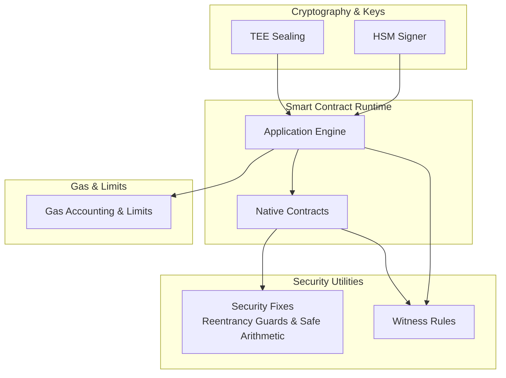
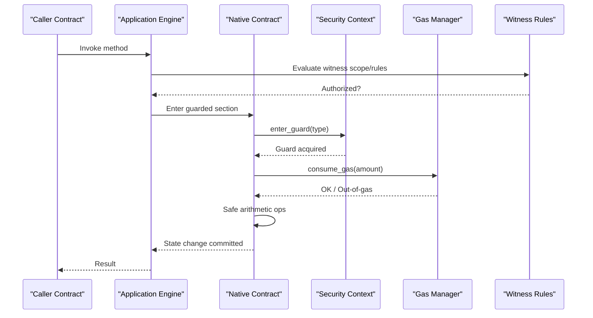
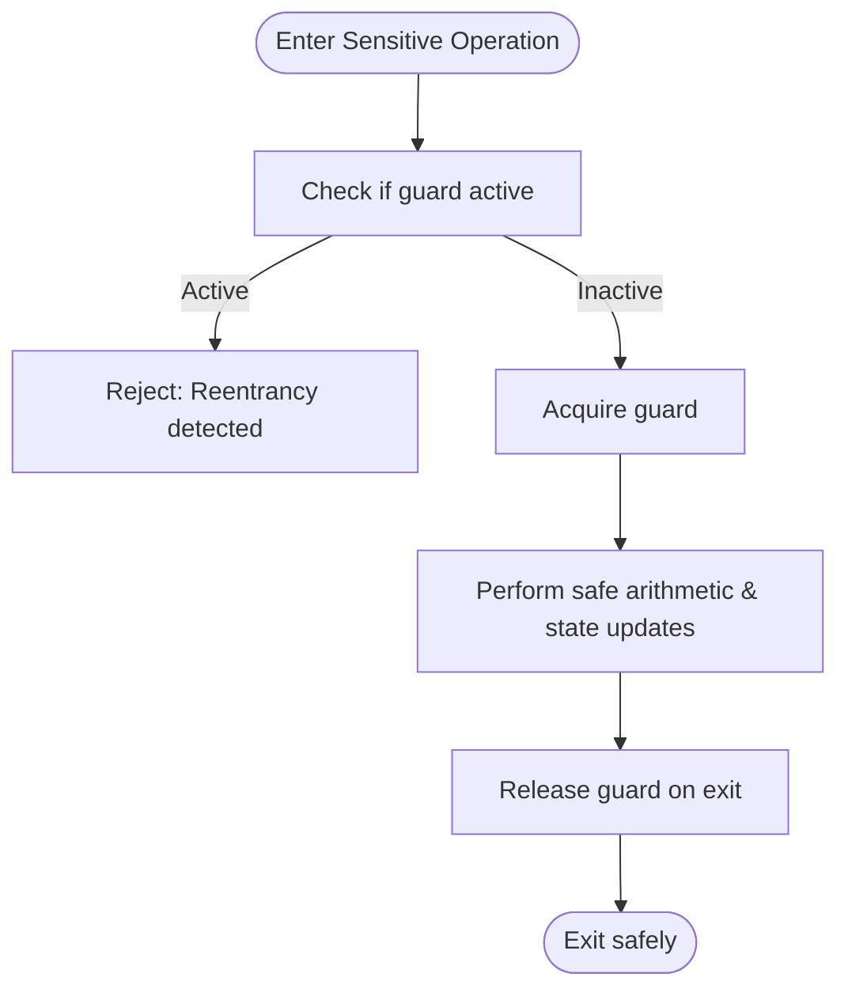
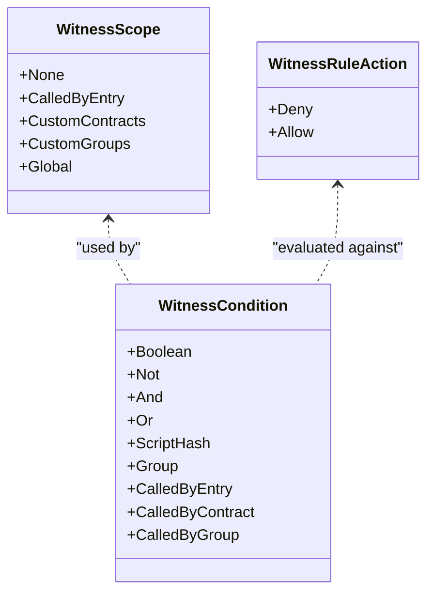
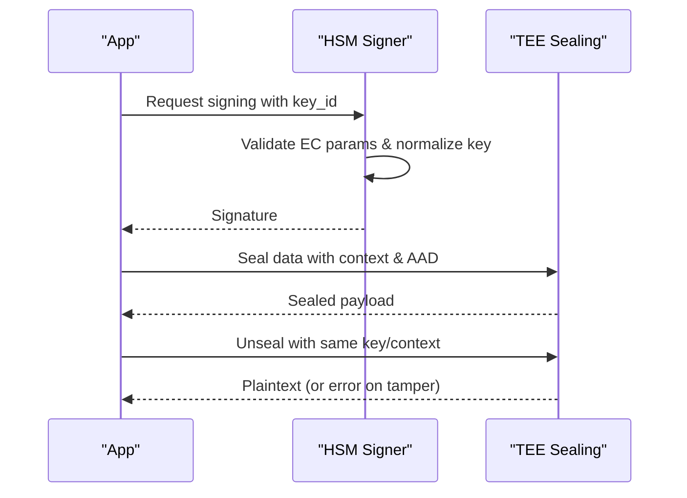
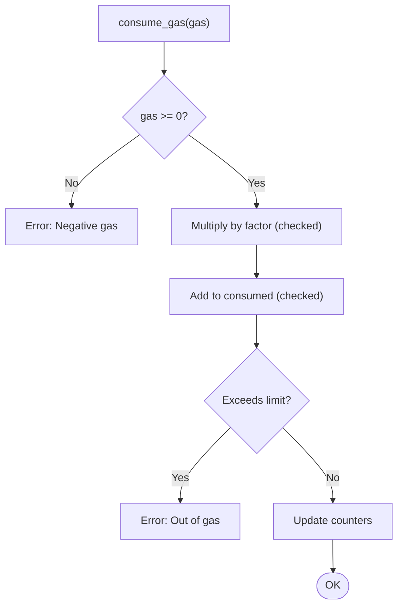
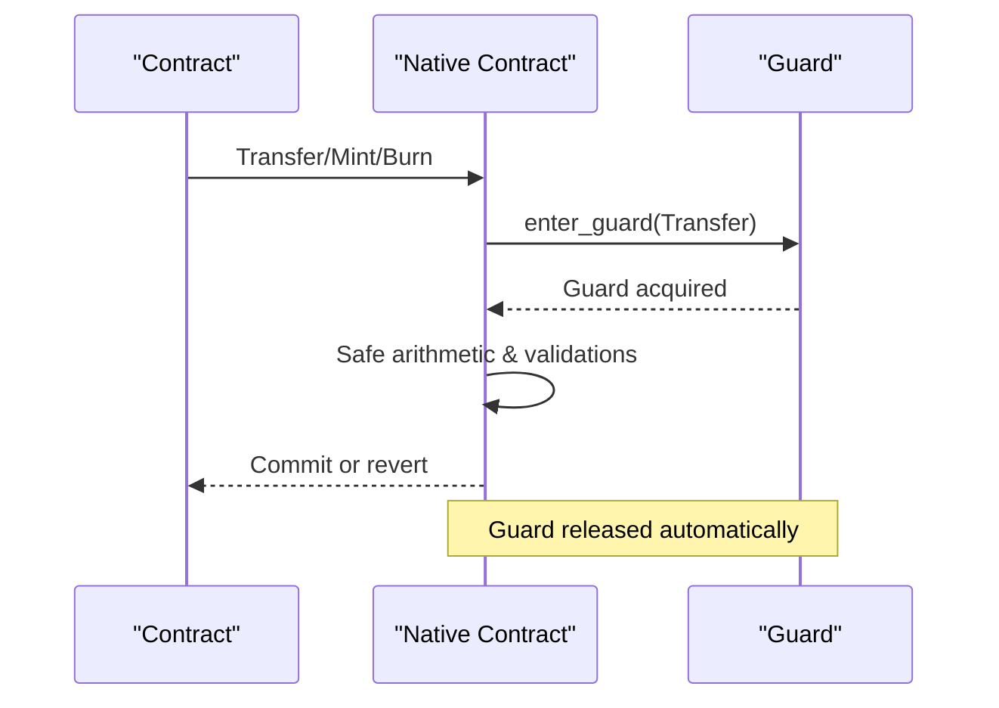
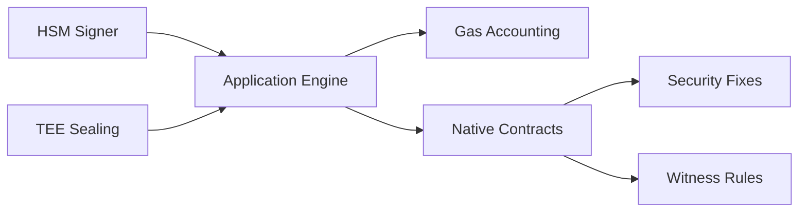

# Security Best Practices

<cite>
**Referenced Files in This Document**
- [SECURITY.md](file://SECURITY.md)
- [ARCHITECTURE.md](file://docs/ARCHITECTURE.md)
- [security_fixes.rs](file://neo-core/src/smart_contract/native/security_fixes.rs)
- [witness_rule.rs](file://neo-core/src/witness_rule.rs)
- [witness_rule_action.rs](file://neo-primitives/src/witness_rule_action.rs)
- [pkcs11_signer.rs](file://neo-hsm/src/pkcs11/pkcs11_signer.rs)
- [sealing.rs](file://neo-tee/src/enclave/sealing.rs)
- [fees_events_native.rs](file://neo-core/src/smart_contract/application_engine/fees_events_native.rs)
- [smart-contract-native-audit.md](file://docs/audits/smart-contract-native-audit.md)
</cite>

## Table of Contents
1. Introduction
2. Project Structure
3. Core Components
4. Architecture Overview
5. Detailed Component Analysis
6. Dependency Analysis
7. Performance Considerations
8. Troubleshooting Guide
9. Conclusion
10. Appendices

## Introduction
This document provides comprehensive security guidance for developing smart contracts on Neo-RS. It focuses on preventing common vulnerabilities such as reentrancy, integer overflow/underflow, access control issues, and gas limit exploitation. It also covers secure coding practices, input validation, proper use of witness rules for authorization, cryptographic best practices, key management patterns, safe interaction with native contracts, secure contract patterns, vulnerability detection methods, audit checklists, gas optimization security implications, and safe upgrade strategies.

## Project Structure
Neo-RS organizes security-related functionality across several modules:
- Native contract security utilities (reentrancy guards, safe arithmetic, state consistency checks)
- Witness rule system for fine-grained authorization
- HSM and TEE integrations for secure key handling and data sealing
- Gas accounting and enforcement to prevent overconsumption
- Audit reports and architectural security mechanisms

**Diagram sources**
- [security_fixes.rs:1-30](file://neo-core/src/smart_contract/native/security_fixes.rs#L1-L30)
- [witness_rule.rs:1-24](file://neo-core/src/witness_rule.rs#L1-L24)
- [pkcs11_signer.rs:137-258](file://neo-hsm/src/pkcs11/pkcs11_signer.rs#L137-L258)
- [sealing.rs:182-228](file://neo-tee/src/enclave/sealing.rs#L182-L228)
- [fees_events_native.rs:389-432](file://neo-core/src/smart_contract/application_engine/fees_events_native.rs#L389-L432)

**Section sources**
- [security_fixes.rs:1-30](file://neo-core/src/smart_contract/native/security_fixes.rs#L1-L30)
- [witness_rule.rs:1-24](file://neo-core/src/witness_rule.rs#L1-L24)
- [pkcs11_signer.rs:137-258](file://neo-hsm/src/pkcs11/pkcs11_signer.rs#L137-L258)
- [sealing.rs:182-228](file://neo-tee/src/enclave/sealing.rs#L182-L228)
- [fees_events_native.rs:389-432](file://neo-core/src/smart_contract/application_engine/fees_events_native.rs#L389-L432)

## Core Components
- Reentrancy protection and safe arithmetic for native operations
- Witness scopes and rules for precise authorization
- Secure key management via HSM and TEE
- Gas consumption tracking and enforcement
- Audit-driven hardening of native contracts

Key responsibilities:
- Prevent reentrant calls into sensitive native operations
- Ensure all numeric operations are checked for overflow/underflow
- Enforce strict authorization using witness conditions and scopes
- Safely derive, store, and use keys within HSM/TEE boundaries
- Track and enforce gas limits to avoid DoS or unexpected behavior

**Section sources**
- [security_fixes.rs:21-109](file://neo-core/src/smart_contract/native/security_fixes.rs#L21-L109)
- [witness_rule_action.rs:1-96](file://neo-primitives/src/witness_rule_action.rs#L1-L96)
- [pkcs11_signer.rs:183-225](file://neo-hsm/src/pkcs11/pkcs11_signer.rs#L183-L225)
- [sealing.rs:182-228](file://neo-tee/src/enclave/sealing.rs#L182-L228)
- [fees_events_native.rs:389-432](file://neo-core/src/smart_contract/application_engine/fees_events_native.rs#L389-L432)

## Architecture Overview
The runtime enforces security through layered controls:
- Application Engine coordinates execution and gas accounting
- Native contracts perform state changes under reentrancy guards and safe arithmetic
- Witness rules validate authorization per call context
- HSM/TEE provide secure key material and sealed storage

**Diagram sources**
- [security_fixes.rs:55-109](file://neo-core/src/smart_contract/native/security_fixes.rs#L55-L109)
- [fees_events_native.rs:389-432](file://neo-core/src/smart_contract/application_engine/fees_events_native.rs#L389-L432)
- [witness_rule.rs:1-24](file://neo-core/src/witness_rule.rs#L1-L24)

## Detailed Component Analysis

### Reentrancy Protection and Safe Arithmetic
- Thread-local guard set tracks active reentrancy contexts for critical operations (e.g., token transfers, mint/burn, contract lifecycle).
- RAII guard ensures automatic cleanup; entering an already-guarded operation fails fast.
- Safe arithmetic helpers prevent overflow/underflow and validate balance/supply changes.

**Diagram sources**
- [security_fixes.rs:21-109](file://neo-core/src/smart_contract/native/security_fixes.rs#L21-L109)
- [security_fixes.rs:160-193](file://neo-core/src/smart_contract/native/security_fixes.rs#L160-L193)

**Section sources**
- [security_fixes.rs:21-109](file://neo-core/src/smart_contract/native/security_fixes.rs#L21-L109)
- [security_fixes.rs:160-193](file://neo-core/src/smart_contract/native/security_fixes.rs#L160-L193)

### Access Control via Witness Scopes and Rules
- Witness scopes restrict what a transaction signature can authorize (e.g., entry-only, specific contracts/groups, global discouraged).
- Witness rules enable fine-grained conditional authorization combining boolean logic, script hashes, groups, and call context.
- Default action is deny when unknown values are encountered, ensuring fail-safe behavior.

**Diagram sources**
- [ARCHITECTURE.md:945-986](file://docs/ARCHITECTURE.md#L945-L986)
- [witness_rule_action.rs:1-96](file://neo-primitives/src/witness_rule_action.rs#L1-L96)

**Section sources**
- [ARCHITECTURE.md:945-986](file://docs/ARCHITECTURE.md#L945-L986)
- [witness_rule_action.rs:1-96](file://neo-primitives/src/witness_rule_action.rs#L1-L96)

### Cryptographic Best Practices and Key Management
- HSM integration validates EC parameters, normalizes public keys, and derives script hashes from securely stored keys.
- TEE sealing uses AES-GCM with AAD binding and counter inclusion to prevent tampering; derived keys are zeroized after use.
- Prefer HSM/TEE for private key usage and sensitive data; never expose raw secrets to VM or user space.

**Diagram sources**
- [pkcs11_signer.rs:183-225](file://neo-hsm/src/pkcs11/pkcs11_signer.rs#L183-L225)
- [sealing.rs:182-228](file://neo-tee/src/enclave/sealing.rs#L182-L228)

**Section sources**
- [pkcs11_signer.rs:183-225](file://neo-hsm/src/pkcs11/pkcs11_signer.rs#L183-L225)
- [sealing.rs:182-228](file://neo-tee/src/enclave/sealing.rs#L182-L228)

### Gas Limit Exploitation Prevention
- Gas consumption is validated for non-negative values and checked for overflow during accumulation.
- VM gas counters are enforced to prevent exceeding configured limits.
- Always bound loops and unbounded operations; prefer bounded iteration and early exits.

**Diagram sources**
- [fees_events_native.rs:389-432](file://neo-core/src/smart_contract/application_engine/fees_events_native.rs#L389-L432)

**Section sources**
- [fees_events_native.rs:389-432](file://neo-core/src/smart_contract/application_engine/fees_events_native.rs#L389-L432)

### Secure Interaction with Native Contracts
- Use reentrancy guards around any state-changing native calls.
- Apply safe arithmetic for balances and supplies; validate constraints before committing state.
- Restrict access via witness rules to minimize attack surface.

**Diagram sources**
- [security_fixes.rs:55-109](file://neo-core/src/smart_contract/native/security_fixes.rs#L55-L109)
- [security_fixes.rs:160-193](file://neo-core/src/smart_contract/native/security_fixes.rs#L160-L193)

**Section sources**
- [security_fixes.rs:55-109](file://neo-core/src/smart_contract/native/security_fixes.rs#L55-L109)
- [security_fixes.rs:160-193](file://neo-core/src/smart_contract/native/security_fixes.rs#L160-L193)

### Vulnerability Detection Methods
- Enable strict security mode via environment flag to enforce guards in tests and controlled environments.
- Run protocol parity and native compatibility checks to detect deviations that may indicate vulnerabilities.
- Use audits and comparison scripts to validate behavior across implementations.

**Section sources**
- [security_fixes.rs:26-30](file://neo-core/src/smart_contract/native/security_fixes.rs#L26-L30)
- [smart-contract-native-audit.md:1-14](file://docs/audits/smart-contract-native-audit.md#L1-L14)

### Audit Checklist for Smart Contracts
- Reentrancy: Ensure all state-changing paths are guarded; no external calls before finalization.
- Integer Safety: All arithmetic uses checked operations; validate bounds and non-negativity.
- Access Control: Enforce witness scopes/rules; avoid Global scope unless absolutely necessary.
- Gas: Bound loops; check gas consumption; ensure no path exceeds limits.
- Crypto: Use approved primitives; validate curves and points; never handle raw private keys outside HSM/TEE.
- Upgrades: Implement immutable upgrades with clear migration steps; preserve state invariants.
- Testing: Include fuzzing, property-based tests, and cross-implementation parity checks.

[No sources needed since this section provides general guidance]

### Gas Optimization Security Implications
- Optimizations must not bypass safety checks; always preserve overflow/underflow checks and gas limits.
- Avoid introducing unbounded recursion or dynamic allocations that could be abused.
- Profile gas usage to ensure worst-case paths remain within limits.

[No sources needed since this section provides general guidance]

### Safe Contract Upgrade Strategies
- Use versioned storage prefixes and migration functions; validate invariants post-migration.
- Employ multi-step upgrades with governance or time-locks; allow rollback windows where feasible.
- Keep upgrade logic minimal and well-tested; rely on native reentrancy guards and safe arithmetic.

[No sources needed since this section provides general guidance]

## Dependency Analysis

**Diagram sources**
- [fees_events_native.rs:389-432](file://neo-core/src/smart_contract/application_engine/fees_events_native.rs#L389-L432)
- [security_fixes.rs:1-30](file://neo-core/src/smart_contract/native/security_fixes.rs#L1-L30)
- [witness_rule.rs:1-24](file://neo-core/src/witness_rule.rs#L1-L24)
- [pkcs11_signer.rs:137-258](file://neo-hsm/src/pkcs11/pkcs11_signer.rs#L137-L258)
- [sealing.rs:182-228](file://neo-tee/src/enclave/sealing.rs#L182-L228)

**Section sources**
- [fees_events_native.rs:389-432](file://neo-core/src/smart_contract/application_engine/fees_events_native.rs#L389-L432)
- [security_fixes.rs:1-30](file://neo-core/src/smart_contract/native/security_fixes.rs#L1-L30)
- [witness_rule.rs:1-24](file://neo-core/src/witness_rule.rs#L1-L24)
- [pkcs11_signer.rs:137-258](file://neo-hsm/src/pkcs11/pkcs11_signer.rs#L137-L258)
- [sealing.rs:182-228](file://neo-tee/src/enclave/sealing.rs#L182-L228)

## Performance Considerations
- Prefer constant-time crypto operations where applicable; avoid branching on secret data.
- Minimize memory allocations inside hot paths; reuse buffers when safe.
- Batch operations to reduce syscall overhead while maintaining atomicity and invariants.
- Monitor gas usage closely; optimize loops and storage reads/writes.

[No sources needed since this section provides general guidance]

## Troubleshooting Guide
Common issues and mitigations:
- Reentrancy detected: Ensure each sensitive operation acquires a guard exactly once; verify call chains do not loop back.
- Out of gas: Reduce complexity; add early returns; profile worst-case paths.
- Overflow/Underflow: Replace unchecked math with checked variants; validate inputs and intermediate results.
- Invalid witness rule/action: Ensure only known enum values are used; default to deny for unknowns.
- Key errors: Validate EC parameters; confirm HSM key presence and correct ID/label mapping.

**Section sources**
- [security_fixes.rs:55-109](file://neo-core/src/smart_contract/native/security_fixes.rs#L55-L109)
- [fees_events_native.rs:389-432](file://neo-core/src/smart_contract/application_engine/fees_events_native.rs#L389-L432)
- [witness_rule_action.rs:1-96](file://neo-primitives/src/witness_rule_action.rs#L1-L96)
- [pkcs11_signer.rs:183-225](file://neo-hsm/src/pkcs11/pkcs11_signer.rs#L183-L225)

## Conclusion
Secure smart contract development on Neo-RS requires disciplined use of reentrancy guards, safe arithmetic, strict access control via witness rules, robust gas accounting, and secure key management through HSM/TEE. Adopting the patterns and checklists in this document will significantly reduce risk and improve resilience against common vulnerabilities.

[No sources needed since this section summarizes without analyzing specific files]

## Appendices

### Reporting Vulnerabilities
Follow coordinated disclosure practices and contact the security team with detailed reproduction steps.

**Section sources**
- [SECURITY.md:1-16](file://SECURITY.md#L1-L16)