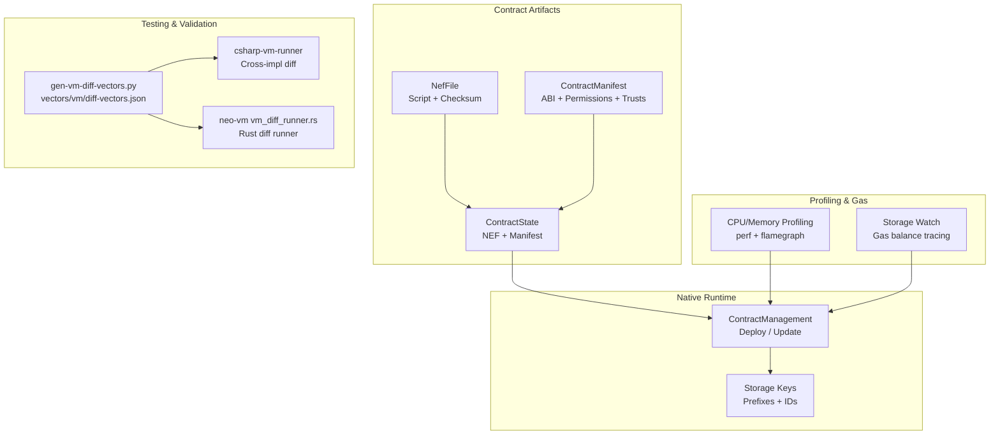
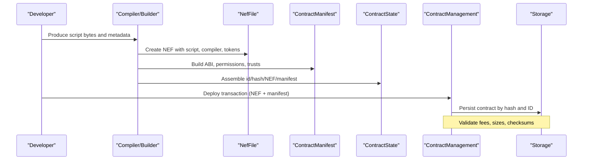
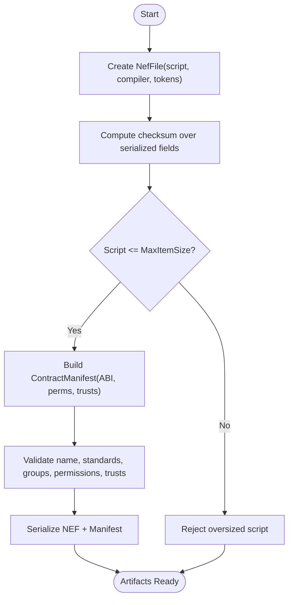
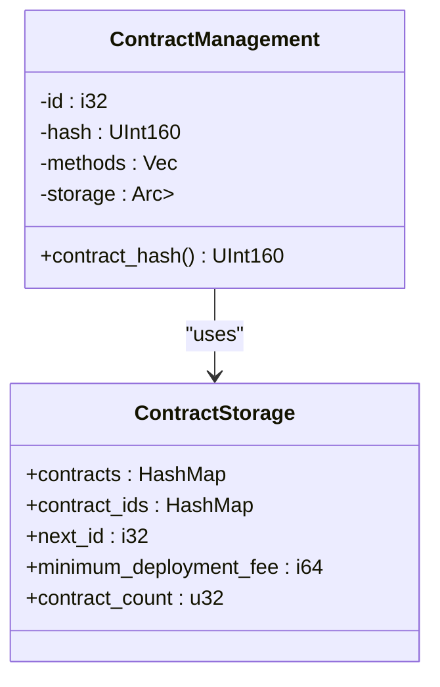
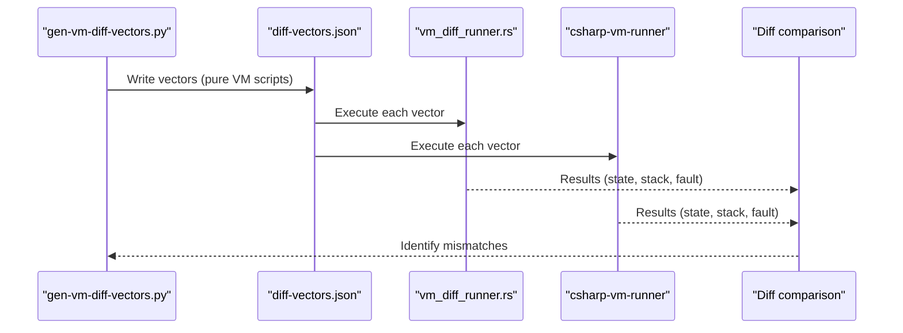
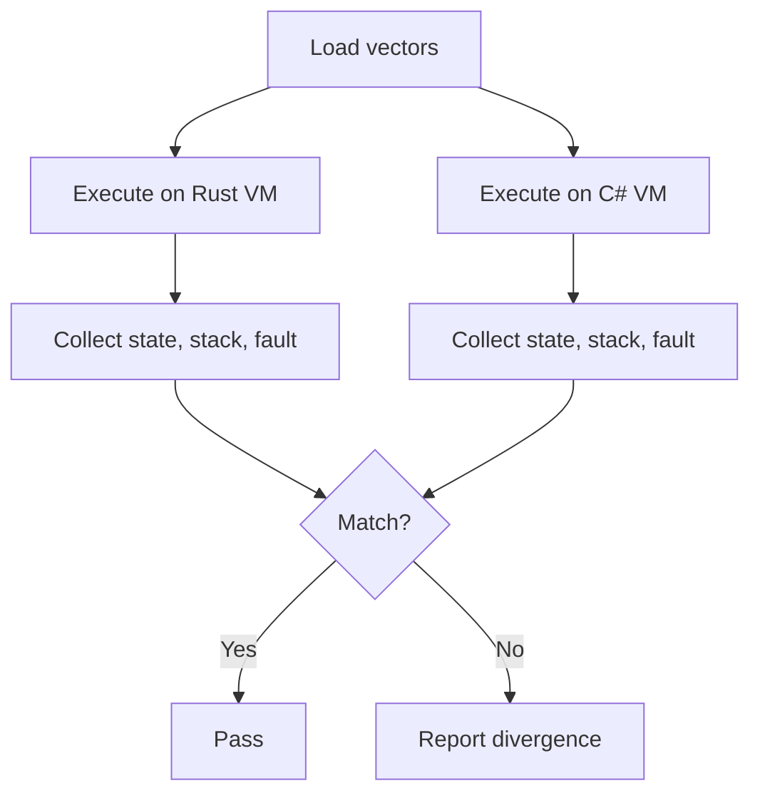
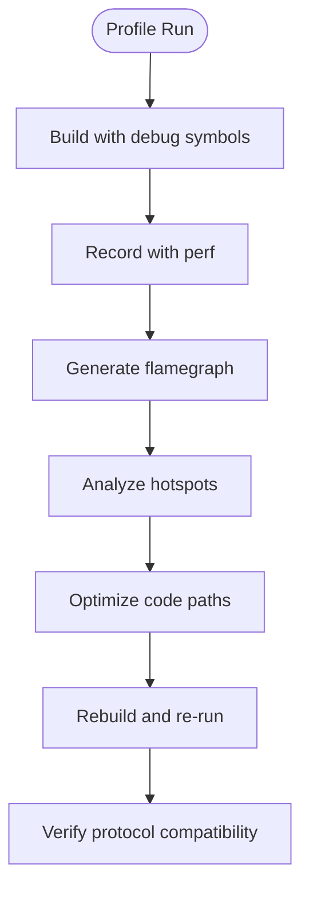
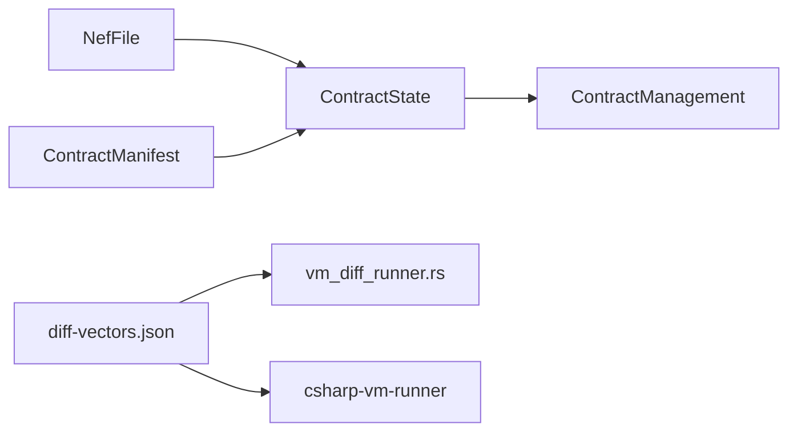

# Smart Contract Development Workflow

<cite>
**Referenced Files in This Document**
- [contract_state.rs](file://neo-core/src/smart_contract/contract_state.rs)
- [contract_manifest.rs](file://neo-core/src/smart_contract/manifest/contract_manifest.rs)
- [mod.rs (ContractManagement)](file://neo-core/src/smart_contract/native/contract_management/mod.rs)
- [Program.cs (csharp-vm-runner)](file://tools/csharp-vm-runner/Program.cs)
- [gen-vm-diff-vectors.py](file://scripts/gen-vm-diff-vectors.py)
- [vm_diff_runner.rs](file://neo-vm/examples/vm_diff_runner.rs)
- [storage_runtime_tests.rs](file://neo-core/tests/storage_runtime_tests.rs)
- [native_contract_tests.rs](file://neo-core/tests/native_contract_tests.rs)
- [cpu-profile.sh](file://scripts/profiling/cpu-profile.sh)
- [profiling.md](file://docs/profiling.md)
- [storage_watch.rs](file://neo-core/src/persistence/data_cache/storage_watch.rs)
</cite>

## Table of Contents
1. Introduction
2. Project Structure
3. Core Components
4. Architecture Overview
5. Detailed Component Analysis
6. Dependency Analysis
7. Performance Considerations
8. Troubleshooting Guide
9. Conclusion
10. Appendices

## Introduction
This document describes the end-to-end smart contract development workflow for Neo-RS, covering compilation to NEO VM bytecode, manifest generation, deployment via the ContractManagement native contract, debugging and testing with vectors and simulation environments, gas analysis, and performance optimization. It also explains integration with existing tooling such as csharp-vm-runner and vector generation utilities used for cross-implementation validation.

## Project Structure
The workflow spans several modules:
- Contract state and NEF handling: serialization, checksums, and size limits
- Manifest model: ABI, permissions, trusts, standards, and JSON compatibility
- Native ContractManagement: storage layout and deployment semantics
- Testing and validation: vector generation, differential execution, and test harnesses
- Profiling and gas analysis: CPU/memory profiling and storage tracing

**Diagram sources**
- [contract_state.rs:23-59](file://neo-core/src/smart_contract/contract_state.rs#L23-L59)
- [contract_state.rs:171-262](file://neo-core/src/smart_contract/contract_state.rs#L171-L262)
- [contract_manifest.rs:44-76](file://neo-core/src/smart_contract/manifest/contract_manifest.rs#L44-L76)
- [mod.rs (ContractManagement):55-78](file://neo-core/src/smart_contract/native/contract_management/mod.rs#L55-L78)
- [gen-vm-diff-vectors.py:1-349](file://scripts/gen-vm-diff-vectors.py#L1-L349)
- [Program.cs (csharp-vm-runner):1-231](file://tools/csharp-vm-runner/Program.cs#L1-L231)
- [vm_diff_runner.rs:1-200](file://neo-vm/examples/vm_diff_runner.rs#L1-L200)
- [cpu-profile.sh:1-24](file://scripts/profiling/cpu-profile.sh#L1-L24)
- [storage_watch.rs:87-127](file://neo-core/src/persistence/data_cache/storage_watch.rs#L87-L127)

**Section sources**
- [contract_state.rs:23-59](file://neo-core/src/smart_contract/contract_state.rs#L23-L59)
- [contract_manifest.rs:44-76](file://neo-core/src/smart_contract/manifest/contract_manifest.rs#L44-L76)
- [mod.rs (ContractManagement):55-78](file://neo-core/src/smart_contract/native/contract_management/mod.rs#L55-L78)

## Core Components
- ContractState: Represents a deployed contract on-chain, including id, update counter, hash, NEF file, and manifest. Provides serialization, deserialization, JSON conversion, and stack value projection.
- NefFile: Encapsulates compiled script bytes, compiler metadata, source info, method tokens, and checksum computation/validation.
- ContractManifest: Declares ABI, groups, features, supported standards, permissions, trusts, and extra metadata; validates constraints and serializes to binary and JSON.
- ContractManagement: Native contract that stores deployed contracts by hash and ID, tracks next ID, minimum deployment fee, and contract count.

Key responsibilities:
- Compile artifacts into NEF and manifest, compute checksums, validate sizes and constraints
- Deploy contracts through native methods, persist state under well-defined prefixes
- Provide interoperability between VM stack values and Rust models for tests and RPC

**Section sources**
- [contract_state.rs:23-59](file://neo-core/src/smart_contract/contract_state.rs#L23-L59)
- [contract_state.rs:171-262](file://neo-core/src/smart_contract/contract_state.rs#L171-L262)
- [contract_state.rs:348-513](file://neo-core/src/smart_contract/contract_state.rs#L348-L513)
- [contract_manifest.rs:44-76](file://neo-core/src/smart_contract/manifest/contract_manifest.rs#L44-L76)
- [contract_manifest.rs:180-257](file://neo-core/src/smart_contract/manifest/contract_manifest.rs#L180-L257)
- [mod.rs (ContractManagement):55-78](file://neo-core/src/smart_contract/native/contract_management/mod.rs#L55-L78)

## Architecture Overview
The development workflow connects high-level build outputs to runtime behavior and validation:

**Diagram sources**
- [contract_state.rs:171-262](file://neo-core/src/smart_contract/contract_state.rs#L171-L262)
- [contract_state.rs:348-513](file://neo-core/src/smart_contract/contract_state.rs#L348-L513)
- [contract_manifest.rs:297-344](file://neo-core/src/smart_contract/manifest/contract_manifest.rs#L297-L344)
- [mod.rs (ContractManagement):55-78](file://neo-core/src/smart_contract/native/contract_management/mod.rs#L55-L78)

## Detailed Component Analysis

### Compilation to NEF and Manifest Generation
- NEF creation includes compiler string, optional source, method tokens, script bytes, and checksum computed from serialized fields excluding the checksum itself.
- Manifest generation encodes ABI, permissions, trusts, supported standards, and extra metadata; it validates uniqueness and structural constraints before serialization.
- Size checks enforce limits on script length and item size during serialization.

**Diagram sources**
- [contract_state.rs:171-262](file://neo-core/src/smart_contract/contract_state.rs#L171-L262)
- [contract_state.rs:388-513](file://neo-core/src/smart_contract/contract_state.rs#L388-L513)
- [contract_manifest.rs:180-257](file://neo-core/src/smart_contract/manifest/contract_manifest.rs#L180-L257)
- [contract_manifest.rs:297-344](file://neo-core/src/smart_contract/manifest/contract_manifest.rs#L297-L344)

**Section sources**
- [contract_state.rs:171-262](file://neo-core/src/smart_contract/contract_state.rs#L171-L262)
- [contract_state.rs:388-513](file://neo-core/src/smart_contract/contract_state.rs#L388-L513)
- [contract_manifest.rs:180-257](file://neo-core/src/smart_contract/manifest/contract_manifest.rs#L180-L257)
- [contract_manifest.rs:297-344](file://neo-core/src/smart_contract/manifest/contract_manifest.rs#L297-L344)

### Deployment Through ContractManagement
- ContractManagement maintains storage for contracts by hash and ID, tracks next available ID, minimum deployment fee, and total contract count.
- Tests demonstrate how to set up storage keys for mapping contract ID to hash and storing contract state under appropriate prefixes.

**Diagram sources**
- [mod.rs (ContractManagement):55-78](file://neo-core/src/smart_contract/native/contract_management/mod.rs#L55-L78)

**Section sources**
- [mod.rs (ContractManagement):55-78](file://neo-core/src/smart_contract/native/contract_management/mod.rs#L55-L78)
- [storage_runtime_tests.rs:29-41](file://neo-core/tests/storage_runtime_tests.rs#L29-L41)
- [storage_runtime_tests.rs:43-66](file://neo-core/tests/storage_runtime_tests.rs#L43-L66)

### Debugging Techniques and Tools
- Differential execution: Generate pure-VM vectors and run them on both Rust and C# VM implementations to detect divergences.
- Storage watch: Optionally trace GAS balance changes for a specific account using an environment variable to filter storage keys.

**Diagram sources**
- [gen-vm-diff-vectors.py:1-349](file://scripts/gen-vm-diff-vectors.py#L1-L349)
- [vm_diff_runner.rs:1-200](file://neo-vm/examples/vm_diff_runner.rs#L1-L200)
- [Program.cs (csharp-vm-runner):1-231](file://tools/csharp-vm-runner/Program.cs#L1-L231)

**Section sources**
- [gen-vm-diff-vectors.py:1-349](file://scripts/gen-vm-diff-vectors.py#L1-L349)
- [Program.cs (csharp-vm-runner):1-231](file://tools/csharp-vm-runner/Program.cs#L1-L231)
- [storage_watch.rs:87-127](file://neo-core/src/persistence/data_cache/storage_watch.rs#L87-L127)

### Testing Strategies with Test Vectors and Simulation
- Vector generation produces deterministic scripts without syscalls or host dependencies, ensuring unambiguous divergence detection.
- The C# runner executes vectors on a bare ExecutionEngine and renders results in a canonical JSON envelope compatible with the Rust side.
- Tests construct minimal contract states and engines to exercise storage and deployment paths.

**Diagram sources**
- [gen-vm-diff-vectors.py:1-349](file://scripts/gen-vm-diff-vectors.py#L1-L349)
- [Program.cs (csharp-vm-runner):1-231](file://tools/csharp-vm-runner/Program.cs#L1-L231)
- [storage_runtime_tests.rs:43-66](file://neo-core/tests/storage_runtime_tests.rs#L43-L66)

**Section sources**
- [gen-vm-diff-vectors.py:1-349](file://scripts/gen-vm-diff-vectors.py#L1-L349)
- [Program.cs (csharp-vm-runner):1-231](file://tools/csharp-vm-runner/Program.cs#L1-L231)
- [storage_runtime_tests.rs:43-66](file://neo-core/tests/storage_runtime_tests.rs#L43-L66)

### Gas Consumption Analysis and Optimization
- Use CPU and memory profiling tools to identify hotspots and allocation patterns in node execution paths related to contract execution.
- Leverage storage watch to focus on GAS balance key accesses for targeted tracing.

**Diagram sources**
- [cpu-profile.sh:1-24](file://scripts/profiling/cpu-profile.sh#L1-L24)
- [profiling.md:1-97](file://docs/profiling.md#L1-L97)
- [storage_watch.rs:87-127](file://neo-core/src/persistence/data_cache/storage_watch.rs#L87-L127)

**Section sources**
- [cpu-profile.sh:1-24](file://scripts/profiling/cpu-profile.sh#L1-L24)
- [profiling.md:1-97](file://docs/profiling.md#L1-L97)
- [storage_watch.rs:87-127](file://neo-core/src/persistence/data_cache/storage_watch.rs#L87-L127)

## Dependency Analysis
- ContractState depends on NefFile and ContractManifest for serialization and validation.
- ContractManagement persists ContractState instances under well-known storage prefixes and maps IDs to hashes.
- Testing utilities depend on generated vectors and execute them across implementations to ensure parity.

**Diagram sources**
- [contract_state.rs:23-59](file://neo-core/src/smart_contract/contract_state.rs#L23-L59)
- [contract_state.rs:171-262](file://neo-core/src/smart_contract/contract_state.rs#L171-L262)
- [contract_manifest.rs:44-76](file://neo-core/src/smart_contract/manifest/contract_manifest.rs#L44-L76)
- [mod.rs (ContractManagement):55-78](file://neo-core/src/smart_contract/native/contract_management/mod.rs#L55-L78)
- [gen-vm-diff-vectors.py:1-349](file://scripts/gen-vm-diff-vectors.py#L1-L349)
- [Program.cs (csharp-vm-runner):1-231](file://tools/csharp-vm-runner/Program.cs#L1-L231)
- [vm_diff_runner.rs:1-200](file://neo-vm/examples/vm_diff_runner.rs#L1-L200)

**Section sources**
- [contract_state.rs:23-59](file://neo-core/src/smart_contract/contract_state.rs#L23-L59)
- [contract_manifest.rs:44-76](file://neo-core/src/smart_contract/manifest/contract_manifest.rs#L44-L76)
- [mod.rs (ContractManagement):55-78](file://neo-core/src/smart_contract/native/contract_management/mod.rs#L55-L78)
- [gen-vm-diff-vectors.py:1-349](file://scripts/gen-vm-diff-vectors.py#L1-L349)
- [Program.cs (csharp-vm-runner):1-231](file://tools/csharp-vm-runner/Program.cs#L1-L231)

## Performance Considerations
- Keep NEF script size within MaxItemSize to avoid rejection during serialization.
- Ensure manifest size stays within MAX_MANIFEST_LENGTH and validate all fields to prevent costly failures at runtime.
- Use profiling to target hot paths in contract execution and storage access; focus on reducing allocations and improving cache locality.
- For gas-sensitive operations, use storage watch to isolate GAS balance key accesses and measure overhead.

[No sources needed since this section provides general guidance]

## Troubleshooting Guide
Common issues and resolutions:
- NEF checksum mismatch: Recompute checksum after modifying NEF fields; verify serialization order matches specification.
- Script too large: Reduce script size or split logic; check MaxItemSize constraints.
- Manifest validation errors: Ensure unique standards, valid group public keys, and correct permission/trust descriptors.
- Cross-implementation divergence: Use differential vectors to pinpoint opcode or stack behavior differences; compare fault families and stack shapes.
- Gas anomalies: Enable storage watch for a specific account to trace GAS balance key reads/writes.

**Section sources**
- [contract_state.rs:388-513](file://neo-core/src/smart_contract/contract_state.rs#L388-L513)
- [contract_manifest.rs:180-257](file://neo-core/src/smart_contract/manifest/contract_manifest.rs#L180-L257)
- [Program.cs (csharp-vm-runner):1-231](file://tools/csharp-vm-runner/Program.cs#L1-L231)
- [storage_watch.rs:87-127](file://neo-core/src/persistence/data_cache/storage_watch.rs#L87-L127)

## Conclusion
Neo-RS provides a robust pipeline for building, validating, deploying, and optimizing smart contracts. By combining NEF and manifest integrity checks, native deployment semantics, differential execution testing, and profiling tools, developers can confidently iterate on contracts while maintaining protocol consistency and performance.

[No sources needed since this section summarizes without analyzing specific files]

## Appendices

### Example: Setting Up Development Environment
- Install profiling tools (perf, flamegraph, heaptrack) per platform instructions.
- Build with debug symbols for accurate profiling.
- Use provided scripts to record and visualize profiles.

**Section sources**
- [profiling.md:1-97](file://docs/profiling.md#L1-L97)
- [cpu-profile.sh:1-24](file://scripts/profiling/cpu-profile.sh#L1-L24)

### Example: Using Debuggers and Analyzing Gas
- Run differential execution vectors to catch VM-level discrepancies early.
- Configure storage watch to trace GAS balance changes for a target account.

**Section sources**
- [gen-vm-diff-vectors.py:1-349](file://scripts/gen-vm-diff-vectors.py#L1-L349)
- [Program.cs (csharp-vm-runner):1-231](file://tools/csharp-vm-runner/Program.cs#L1-L231)
- [storage_watch.rs:87-127](file://neo-core/src/persistence/data_cache/storage_watch.rs#L87-L127)

### Example: Verifying Native Contracts and Standards
- Confirm native contract IDs and manifest contents (e.g., NEP-17 support and Transfer events).

**Section sources**
- [native_contract_tests.rs:336-376](file://neo-core/tests/native_contract_tests.rs#L336-L376)