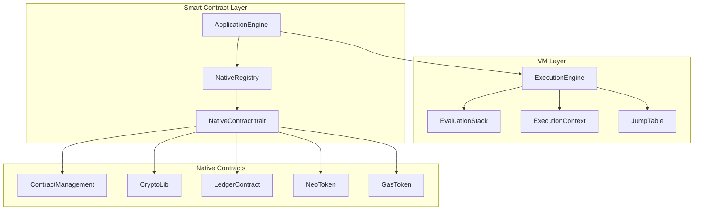
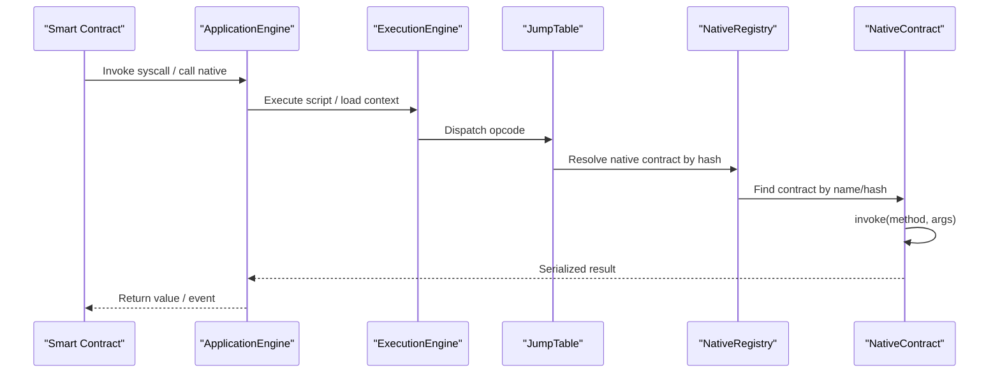
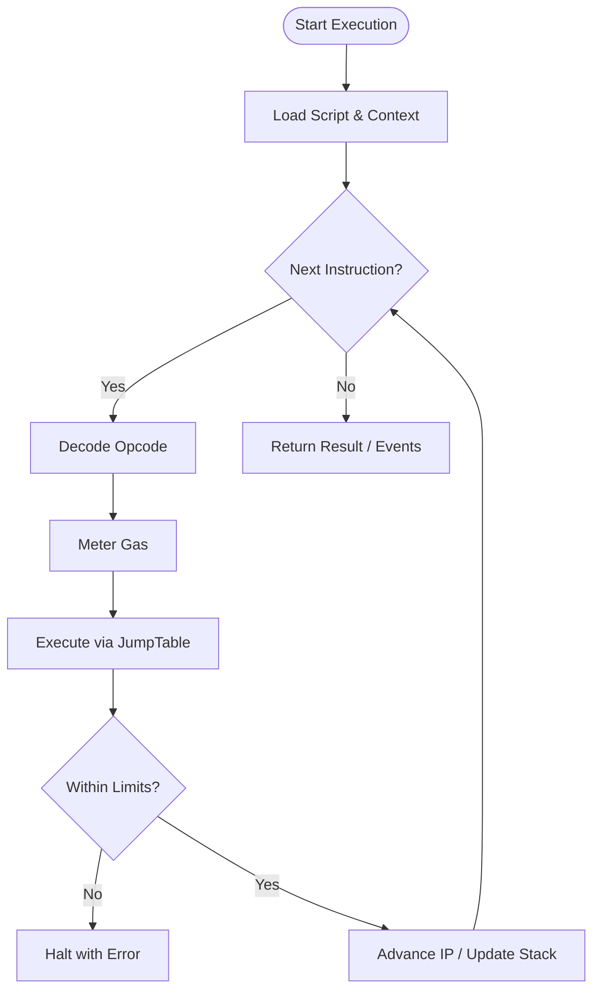
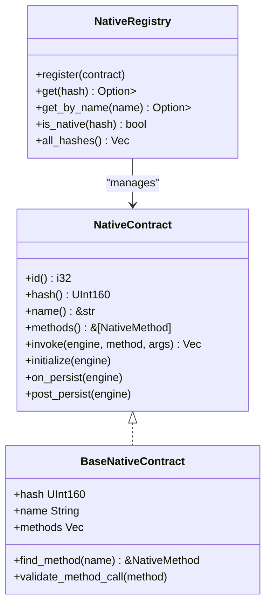
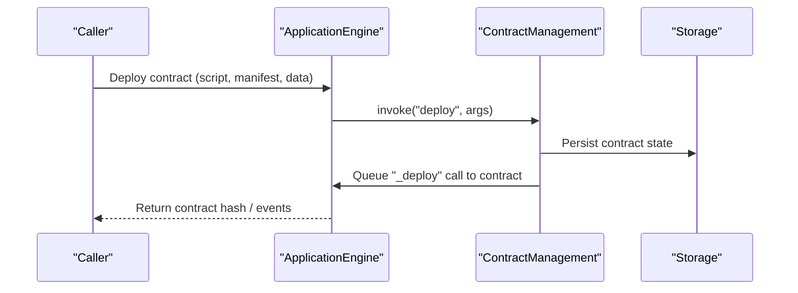
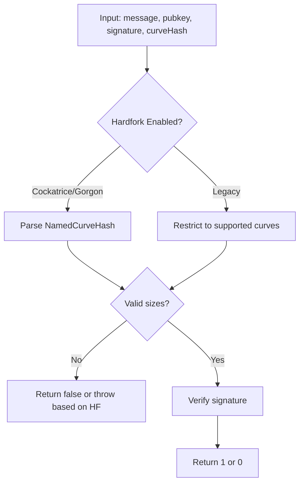
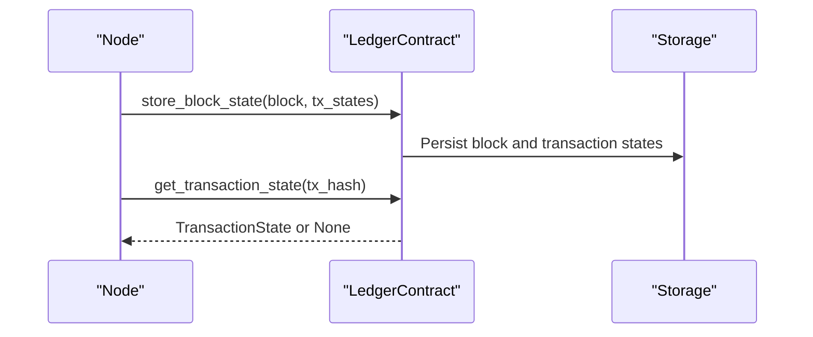
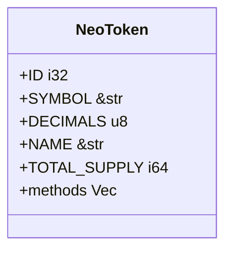
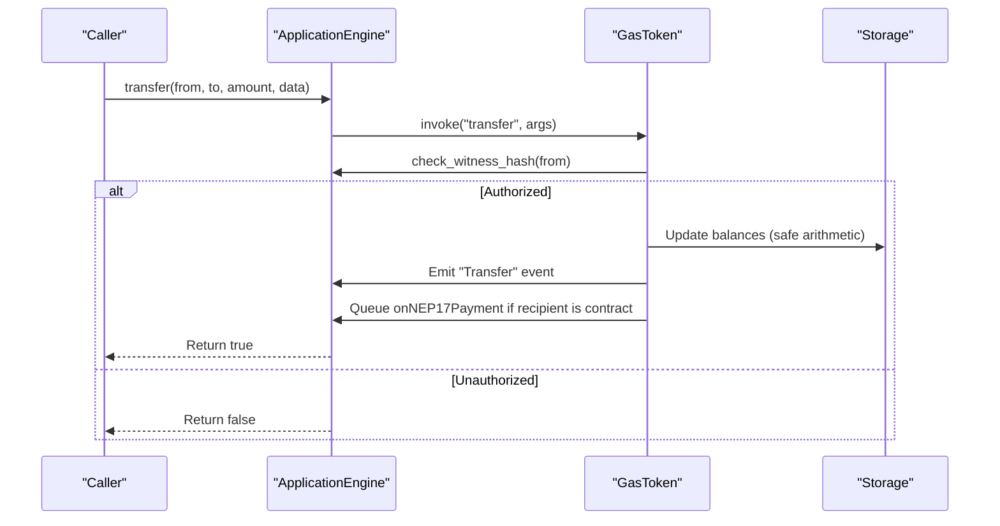
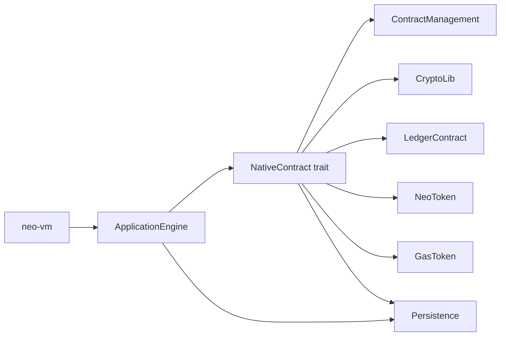

# Smart Contracts

<cite>
**Referenced Files in This Document**
- [neo-vm/src/lib.rs](file://neo-vm/src/lib.rs)
- [neo-core/src/smart_contract/mod.rs](file://neo-core/src/smart_contract/mod.rs)
- [neo-core/src/smart_contract/native/mod.rs](file://neo-core/src/smart_contract/native/mod.rs)
- [neo-core/src/smart_contract/native/native_contract.rs](file://neo-core/src/smart_contract/native/native_contract.rs)
- [neo-core/src/smart_contract/native/contract_management/mod.rs](file://neo-core/src/smart_contract/native/contract_management/mod.rs)
- [neo-core/src/smart_contract/native/crypto_lib/mod.rs](file://neo-core/src/smart_contract/native/crypto_lib/mod.rs)
- [neo-core/src/smart_contract/native/ledger_contract/mod.rs](file://neo-core/src/smart_contract/native/ledger_contract/mod.rs)
- [neo-core/src/smart_contract/native/neo_token/mod.rs](file://neo-core/src/smart_contract/native/neo_token/mod.rs)
- [neo-core/src/smart_contract/native/gas_token/mod.rs](file://neo-core/src/smart_contract/native/gas_token/mod.rs)
</cite>

## Table of Contents
1. Introduction
2. Project Structure
3. Core Components
4. Architecture Overview
5. Detailed Component Analysis
6. Dependency Analysis
7. Performance Considerations
8. Troubleshooting Guide
9. Conclusion
10. Appendices

## Introduction
This document provides comprehensive smart contract development documentation for the Neo-RS implementation. It covers the Neo Virtual Machine architecture (stack-based execution, gas metering, and resource limits), native contracts (ContractManagement, CryptoLib, LedgerContract, NeoToken, GasToken, PolicyContract, RoleManagement, OracleContract, Notary, Treasury), NEP standards (NEP-17 fungible tokens and NEP-11 NFTs), the smart contract lifecycle from compilation to deployment and execution, gas optimization techniques, security best practices, common pitfalls, and testing strategies using available tooling and test vectors.

## Project Structure
The Neo-RS repository organizes smart contract functionality under neo-core and neo-vm:
- neo-vm: Embedded VM runtime with stack-based execution, gas hooks, exception handling, and ABI-level value semantics.
- neo-core::smart_contract: Contract model, manifest, storage context, application engine integration, and native contracts registry.
- Native contracts are implemented as built-in system contracts registered by a central registry and exposed via System.Contract.CallNative.

**Diagram sources**
- [neo-vm/src/lib.rs:142-218](file://neo-vm/src/lib.rs#L142-L218)
- [neo-core/src/smart_contract/native/mod.rs:91-197](file://neo-core/src/smart_contract/native/mod.rs#L91-L197)
- [neo-core/src/smart_contract/native/native_contract.rs:21-163](file://neo-core/src/smart_contract/native/native_contract.rs#L21-L163)

**Section sources**
- [neo-vm/src/lib.rs:1-135](file://neo-vm/src/lib.rs#L1-L135)
- [neo-core/src/smart_contract/mod.rs:1-86](file://neo-core/src/smart_contract/mod.rs#L1-L86)
- [neo-core/src/smart_contract/native/mod.rs:1-197](file://neo-core/src/smart_contract/native/mod.rs#L1-L197)

## Core Components
- ExecutionEngine: Core VM loop managing contexts, instruction cycle, and gas consumption.
- EvaluationStack: Type-safe operand stack with reference counting.
- ExecutionContext: Per-call frame with IP, evaluation stack, locals, and static fields.
- JumpTable: Stateful opcode dispatch adapters integrating host state.
- ApplicationEngine: Host boundary bridging VM execution to smart contract APIs and native contracts.
- NativeRegistry: Central registry that registers standard native contracts and exposes them by hash or name.
- NativeContract trait: Common interface for all native contracts including method tables, activation logic, invocation, and lifecycle hooks.

Key responsibilities:
- VM layer executes scripts, enforces gas and limits, and raises exceptions.
- Smart contract layer manages manifests, storage contexts, events, and interop calls.
- Native contracts implement protocol-critical functions (tokens, policy, ledger, crypto).

**Section sources**
- [neo-vm/src/lib.rs:58-135](file://neo-vm/src/lib.rs#L58-L135)
- [neo-core/src/smart_contract/native/native_contract.rs:21-163](file://neo-core/src/smart_contract/native/native_contract.rs#L21-L163)
- [neo-core/src/smart_contract/native/mod.rs:91-197](file://neo-core/src/smart_contract/native/mod.rs#L91-L197)

## Architecture Overview
The Neo-RS smart contract architecture follows an adapter-oriented design:
- The VM core is vendored into neo-vm and exposes canonical opcode metadata, interpreter, and ABI semantics.
- neo-core integrates the VM with the application engine and native contracts.
- Native contracts are invoked through System.Contract.CallNative and are versioned per hardfork activation.

**Diagram sources**
- [neo-vm/src/lib.rs:142-218](file://neo-vm/src/lib.rs#L142-L218)
- [neo-core/src/smart_contract/native/mod.rs:91-197](file://neo-core/src/smart_contract/native/mod.rs#L91-L197)
- [neo-core/src/smart_contract/native/native_contract.rs:138-163](file://neo-core/src/smart_contract/native/native_contract.rs#L138-L163)

## Detailed Component Analysis

### Neo Virtual Machine (NeoVM)
- Stack-based execution model:
  - EvaluationStack holds operands; ExecutionContext tracks call frames, locals, and static fields.
  - ExecutionEngine drives the instruction cycle, handles try/catch/finally, and tracks gas.
- Gas metering:
  - Precise cost tracking per operation; base costs documented in module docs.
- Resource limits:
  - Limits on invocation depth, stack depth, item size, and script size enforced by VM.

**Diagram sources**
- [neo-vm/src/lib.rs:58-135](file://neo-vm/src/lib.rs#L58-L135)
- [neo-vm/src/lib.rs:142-218](file://neo-vm/src/lib.rs#L142-L218)

**Section sources**
- [neo-vm/src/lib.rs:1-135](file://neo-vm/src/lib.rs#L1-L135)
- [neo-vm/src/lib.rs:142-218](file://neo-vm/src/lib.rs#L142-L218)

### Native Contracts Registry and Lifecycle
- Registration order is consensus-critical and matches C# native contract ordering.
- Hardfork activation:
  - Contracts and methods can be activated or deprecated at specific hardfork heights.
  - Manifest generation includes only active methods at current block height.
- Lifecycle hooks:
  - initialize, on_persist, post_persist allow state updates across blocks.

**Diagram sources**
- [neo-core/src/smart_contract/native/native_contract.rs:21-163](file://neo-core/src/smart_contract/native/native_contract.rs#L21-L163)
- [neo-core/src/smart_contract/native/native_contract.rs:333-365](file://neo-core/src/smart_contract/native/native_contract.rs#L333-L365)
- [neo-core/src/smart_contract/native/mod.rs:91-197](file://neo-core/src/smart_contract/native/mod.rs#L91-L197)

**Section sources**
- [neo-core/src/smart_contract/native/native_contract.rs:21-163](file://neo-core/src/smart_contract/native/native_contract.rs#L21-L163)
- [neo-core/src/smart_contract/native/native_contract.rs:333-365](file://neo-core/src/smart_contract/native/native_contract.rs#L333-L365)
- [neo-core/src/smart_contract/native/mod.rs:91-197](file://neo-core/src/smart_contract/native/mod.rs#L91-L197)

### ContractManagement
- Manages deployed contracts: deploy, update, destroy, query, and metadata.
- Maintains contract IDs, hashes, counts, and minimum deployment fee.
- Invokes _deploy hook on newly deployed or updated contracts.

**Diagram sources**
- [neo-core/src/smart_contract/native/contract_management/mod.rs:55-229](file://neo-core/src/smart_contract/native/contract_management/mod.rs#L55-L229)

**Section sources**
- [neo-core/src/smart_contract/native/contract_management/mod.rs:1-242](file://neo-core/src/smart_contract/native/contract_management/mod.rs#L1-L242)

### CryptoLib
- Provides cryptographic primitives: SHA-256, RIPEMD-160, Murmur32, Keccak-256.
- Signature verification:
  - verifyWithECDsa supports named curves and hardfork-dependent behavior.
  - verifyWithEd25519 supports Ed25519 signatures with versioned error handling.
- Public key recovery for secp256k1.

**Diagram sources**
- [neo-core/src/smart_contract/native/crypto_lib/mod.rs:88-227](file://neo-core/src/smart_contract/native/crypto_lib/mod.rs#L88-L227)

**Section sources**
- [neo-core/src/smart_contract/native/crypto_lib/mod.rs:1-343](file://neo-core/src/smart_contract/native/crypto_lib/mod.rs#L1-L343)

### LedgerContract
- Stores and queries blocks and transactions.
- Tracks transaction states and VM execution results.
- Supports conflict stubs and traceable block windows.

**Diagram sources**
- [neo-core/src/smart_contract/native/ledger_contract/mod.rs:22-45](file://neo-core/src/smart_contract/native/ledger_contract/mod.rs#L22-L45)

**Section sources**
- [neo-core/src/smart_contract/native/ledger_contract/mod.rs:1-290](file://neo-core/src/smart_contract/native/ledger_contract/mod.rs#L1-L290)

### NeoToken
- Implements governance token with NEP-17 surface and additional governance features.
- Handles validator candidate registration, voting, committee management, and GAS reward distribution.
- Uses prefixes for voters count, committee, candidates, and reward accounting.

**Diagram sources**
- [neo-core/src/smart_contract/native/neo_token/mod.rs:46-89](file://neo-core/src/smart_contract/native/neo_token/mod.rs#L46-L89)

**Section sources**
- [neo-core/src/smart_contract/native/neo_token/mod.rs:1-89](file://neo-core/src/smart_contract/native/neo_token/mod.rs#L1-L89)

### GasToken
- NEP-17 compliant fungible token for GAS with transfer, mint, burn, total supply, and balance queries.
- Enforces witness checks for transfers, emits Transfer events, and optionally calls onNEP17Payment for contracts.
- Uses safe arithmetic and state validation to ensure consistency.

**Diagram sources**
- [neo-core/src/smart_contract/native/gas_token/mod.rs:62-265](file://neo-core/src/smart_contract/native/gas_token/mod.rs#L62-L265)

**Section sources**
- [neo-core/src/smart_contract/native/gas_token/mod.rs:1-655](file://neo-core/src/smart_contract/native/gas_token/mod.rs#L1-L655)

### PolicyContract, RoleManagement, OracleContract, Notary, Treasury
- PolicyContract: Configures network policies such as attribute fees and limits.
- RoleManagement: Assigns roles (e.g., Oracle, Notary) to accounts.
- OracleContract: Processes oracle requests and responses.
- Notary: Handles notary deposits and related operations after hardfork activation.
- Treasury: Manages treasury operations after hardfork activation.

These contracts are registered by the NativeRegistry and follow the same lifecycle and invocation patterns as other native contracts.

**Section sources**
- [neo-core/src/smart_contract/native/mod.rs:159-197](file://neo-core/src/smart_contract/native/mod.rs#L159-L197)

## Dependency Analysis
- VM depends on interpreter, jump table, and ABI modules for opcode semantics and dispatch.
- Smart contract layer depends on VM for execution and storage contexts.
- Native contracts depend on persistence, cryptography, and policy helpers.
- Registry orchestrates contract discovery and invocation.

**Diagram sources**
- [neo-vm/src/lib.rs:142-218](file://neo-vm/src/lib.rs#L142-L218)
- [neo-core/src/smart_contract/native/mod.rs:91-197](file://neo-core/src/smart_contract/native/mod.rs#L91-L197)

**Section sources**
- [neo-vm/src/lib.rs:142-218](file://neo-vm/src/lib.rs#L142-L218)
- [neo-core/src/smart_contract/native/mod.rs:91-197](file://neo-core/src/smart_contract/native/mod.rs#L91-L197)

## Performance Considerations
- Gas optimization techniques:
  - Minimize storage writes; prefer batch updates where possible.
  - Use read-only methods (safe=true) for queries to reduce gas costs.
  - Avoid unnecessary conversions between StackItem and BigInt; reuse values.
  - Leverage snapshot reads to avoid redundant storage lookups within a single method.
- Resource limits:
  - Respect MAX_SCRIPT_SIZE, MAX_ITEM_SIZE, DEFAULT_MAX_INVOCATION_DEPTH, and DEFAULT_MAX_STACK_DEPTH.
  - Profile gas usage per method; consider splitting complex operations into multiple calls.
- Best practices:
  - Validate inputs early to fail fast and save gas.
  - Use safe arithmetic to prevent overflows and reverts.
  - Emit events sparingly; they incur gas and storage overhead.

[No sources needed since this section provides general guidance]

## Troubleshooting Guide
Common issues and resolutions:
- Unknown native method:
  - Ensure method names match declared metadata; check hardfork activation status.
- Invalid arguments:
  - Verify parameter types and lengths; handle malformed inputs according to hardfork rules.
- Witness failures:
  - Confirm caller authorization; use calling_script_hash vs current_script_hash appropriately.
- Storage errors:
  - Check storage key construction and serialization formats; ensure compatibility with legacy formats.
- Gas exhaustion:
  - Reduce complexity; optimize loops and storage operations; split large tasks.

**Section sources**
- [neo-core/src/smart_contract/native/crypto_lib/mod.rs:88-227](file://neo-core/src/smart_contract/native/crypto_lib/mod.rs#L88-L227)
- [neo-core/src/smart_contract/native/gas_token/mod.rs:62-265](file://neo-core/src/smart_contract/native/gas_token/mod.rs#L62-L265)

## Conclusion
Neo-RS provides a robust, production-grade smart contract platform with a well-defined VM architecture, comprehensive native contracts, and strong support for NEP standards. By understanding the stack-based execution model, gas metering, and resource limits, developers can build efficient and secure contracts. Following the lifecycle patterns, leveraging native contracts, and adhering to best practices ensures reliable deployment and execution on the Neo blockchain.

[No sources needed since this section summarizes without analyzing specific files]

## Appendices

### Smart Contract Lifecycle
- Compilation:
  - Build contract code to a NEF file containing bytecode and metadata.
- Deployment:
  - Use ContractManagement to deploy; the system persists contract state and invokes _deploy.
- Execution:
  - Transactions trigger ApplicationEngine execution; syscalls route to native contracts or interop services.
- Persistence:
  - Native contracts update storage during on_persist and post_persist hooks.

**Section sources**
- [neo-core/src/smart_contract/native/native_contract.rs:138-163](file://neo-core/src/smart_contract/native/native_contract.rs#L138-L163)
- [neo-core/src/smart_contract/native/contract_management/mod.rs:195-208](file://neo-core/src/smart_contract/native/contract_management/mod.rs#L195-L208)

### NEP Standards Implementation
- NEP-17 Fungible Tokens:
  - Methods include symbol, decimals, totalSupply, balanceOf, transfer, and events.
  - GasToken implements NEP-17 compliance with transfer authorization, events, and optional onNEP17Payment callbacks.
- NEP-11 Non-Fungible Tokens:
  - TokenManagement library provides NFT capabilities; note it is not a registered native contract in the protocol formula.

**Section sources**
- [neo-core/src/smart_contract/native/gas_token/mod.rs:633-651](file://neo-core/src/smart_contract/native/gas_token/mod.rs#L633-L651)
- [neo-core/src/smart_contract/native/mod.rs:48-53](file://neo-core/src/smart_contract/native/mod.rs#L48-L53)

### Testing Strategies and Tooling
- Unit tests:
  - Validate native contract methods, storage keys, and serialization formats.
- Integration tests:
  - Exercise full execution paths via ApplicationEngine and VM.
- Protocol consistency:
  - Compare outputs with reference implementations using golden files and vector comparisons.
- Test vectors:
  - Use provided scripts and fixtures to generate and validate VM execution vectors.

**Section sources**
- [neo-core/src/smart_contract/native/crypto_lib/mod.rs:262-343](file://neo-core/src/smart_contract/native/crypto_lib/mod.rs#L262-L343)
- [neo-core/src/smart_contract/native/ledger_contract/mod.rs:56-279](file://neo-core/src/smart_contract/native/ledger_contract/mod.rs#L56-L279)