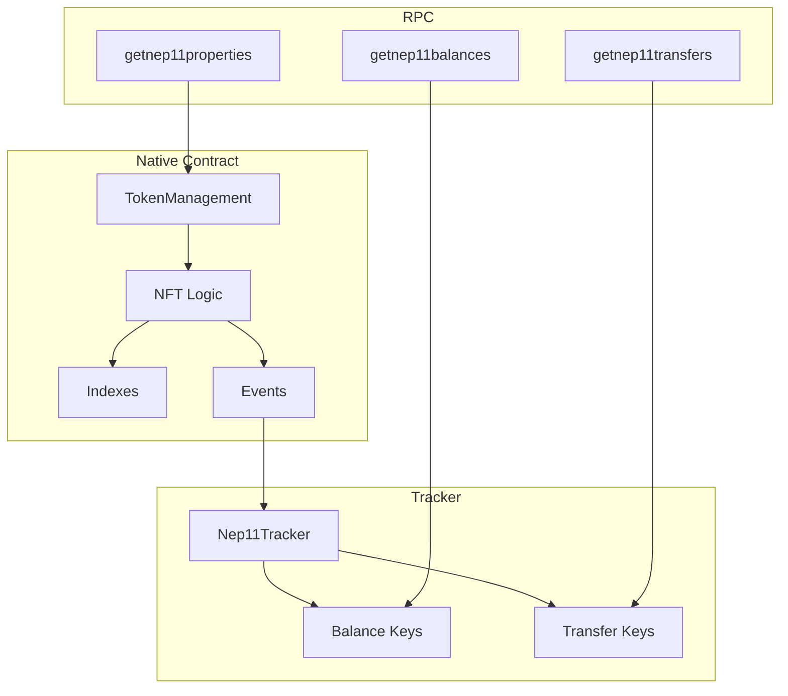
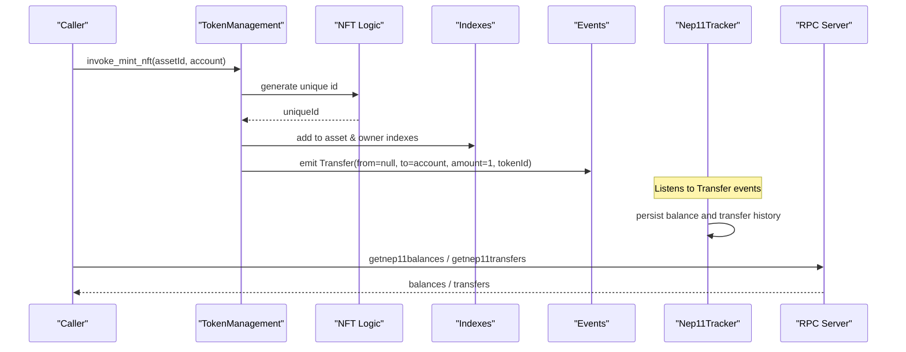
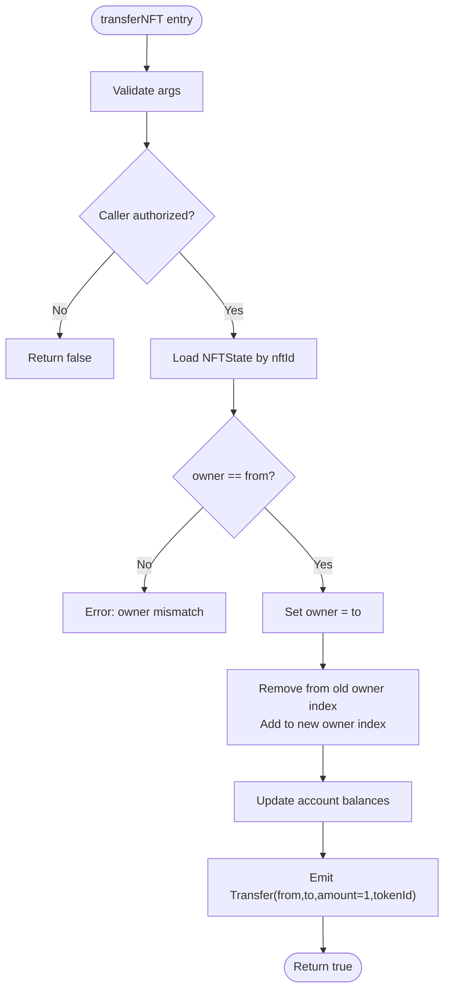
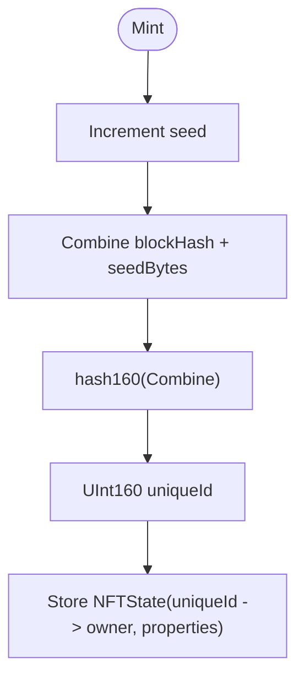
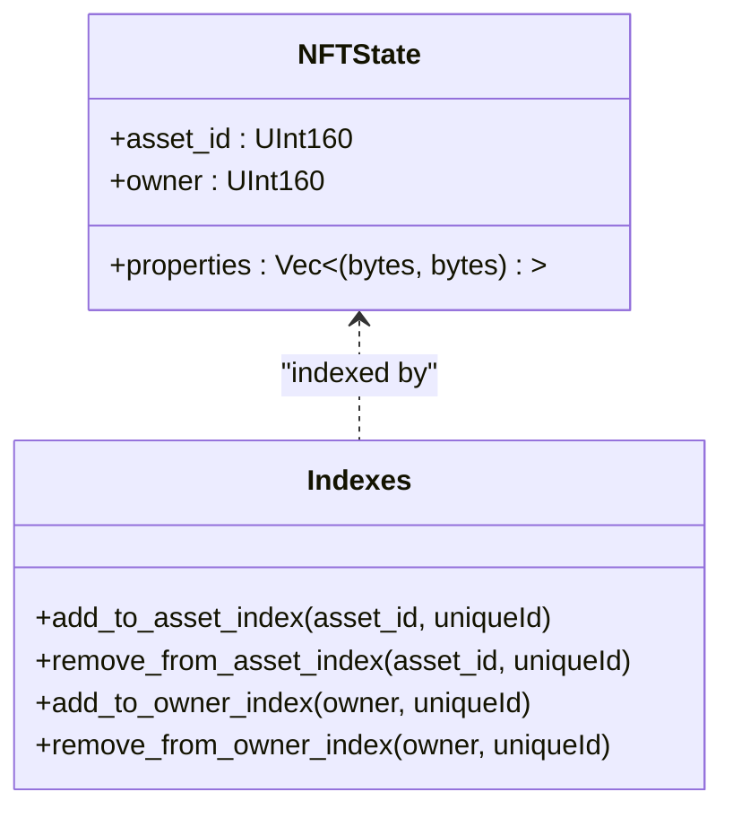
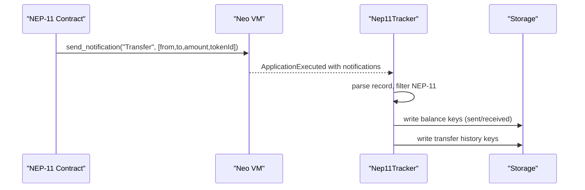
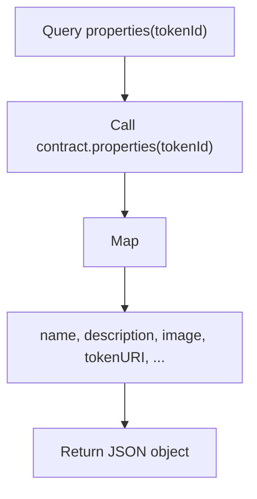
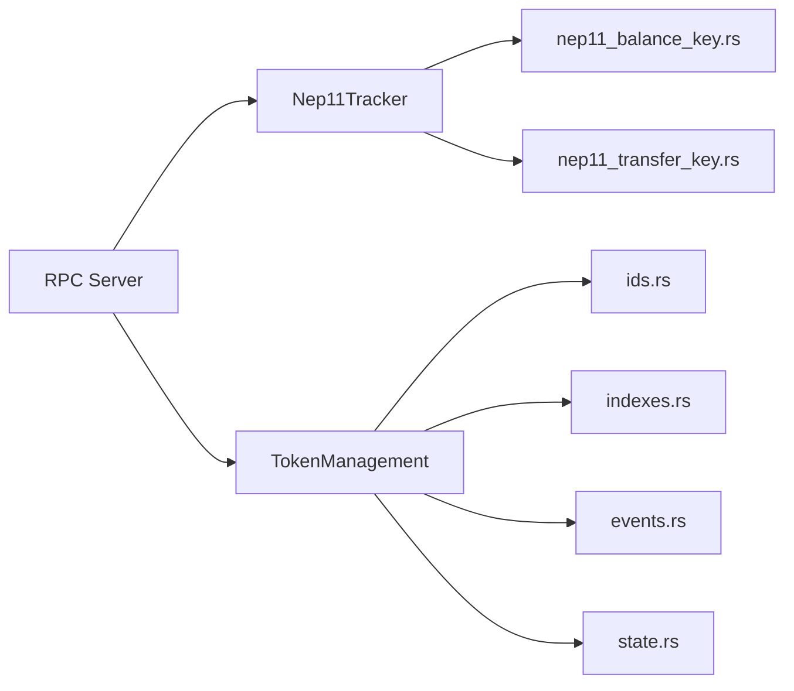

# NEP-11 Non-Fungible Tokens (NFT)

<cite>
**Referenced Files in This Document**
- [nft.rs](file://neo-core/src/smart_contract/native/token_management/nft.rs)
- [mod.rs](file://neo-core/src/smart_contract/native/token_management/mod.rs)
- [ids.rs](file://neo-core/src/smart_contract/native/token_management/ids.rs)
- [indexes.rs](file://neo-core/src/smart_contract/native/token_management/indexes.rs)
- [state.rs](file://neo-core/src/smart_contract/native/token_management/state.rs)
- [events.rs](file://neo-core/src/smart_contract/native/token_management/events.rs)
- [nep11_tracker.rs](file://neo-core/src/tokens_tracker/trackers/nep_11/nep11_tracker.rs)
- [nep11_balance_key.rs](file://neo-core/src/tokens_tracker/trackers/nep_11/nep11_balance_key.rs)
- [nep11_transfer_key.rs](file://neo-core/src/tokens_tracker/trackers/nep_11/nep11_transfer_key.rs)
- [rpc_server_tokens_tracker_mod.rs](file://neo-rpc/src/server/rpc_server_tokens_tracker/mod.rs)
- [rpc_client_client.rs](file://neo-rpc/src/client/rpc_client/client.rs)
</cite>

## Table of Contents
1. Introduction
2. Project Structure
3. Core Components
4. Architecture Overview
5. Detailed Component Analysis
6. Dependency Analysis
7. Performance Considerations
8. Troubleshooting Guide
9. Conclusion
10. Appendices

## Introduction
This document explains the NEP-11 non-fungible token standard implementation in the repository, focusing on how NFTs are created, owned, transferred, and queried. It covers required methods for NFT contracts, token ID management, uniqueness guarantees, metadata handling, event emission, and RPC integration for balances, transfers, and properties. It also provides guidance for minting, transferring, querying metadata, and batch operations, along with performance and troubleshooting considerations for large collections and marketplace integrations.

## Project Structure
The NEP-11 implementation spans native contract logic, state and indexing, transfer tracking, and RPC exposure:
- Native TokenManagement exposes NFT lifecycle methods and storage layout.
- NFT-specific logic handles unique IDs, ownership indexes, and transfers.
- The tracker records balances and transfer history from Transfer events emitted by contracts.
- RPC handlers expose queries for balances, transfers, and properties.

**Diagram sources**
- [mod.rs:93-186](file://neo-core/src/smart_contract/native/token_management/mod.rs#L93-L186)
- [nft.rs:20-351](file://neo-core/src/smart_contract/native/token_management/nft.rs#L20-L351)
- [indexes.rs:11-100](file://neo-core/src/smart_contract/native/token_management/indexes.rs#L11-L100)
- [events.rs:9-52](file://neo-core/src/smart_contract/native/token_management/events.rs#L9-L52)
- [nep11_tracker.rs:53-130](file://neo-core/src/tokens_tracker/trackers/nep_11/nep11_tracker.rs#L53-L130)
- [nep11_balance_key.rs:12-65](file://neo-core/src/tokens_tracker/trackers/nep_11/nep11_balance_key.rs#L12-L65)
- [nep11_transfer_key.rs:13-71](file://neo-core/src/tokens_tracker/trackers/nep_11/nep11_transfer_key.rs#L13-L71)
- [rpc_server_tokens_tracker_mod.rs:33-60](file://neo-rpc/src/server/rpc_server_tokens_tracker/mod.rs#L33-L60)

**Section sources**
- [mod.rs:93-186](file://neo-core/src/smart_contract/native/token_management/mod.rs#L93-L186)
- [nft.rs:20-351](file://neo-core/src/smart_contract/native/token_management/nft.rs#L20-L351)
- [nep11_tracker.rs:53-130](file://neo-core/src/tokens_tracker/trackers/nep_11/nep11_tracker.rs#L53-L130)
- [rpc_server_tokens_tracker_mod.rs:33-60](file://neo-rpc/src/server/rpc_server_tokens_tracker/mod.rs#L33-L60)

## Core Components
- TokenManagement native contract: registers assets, mints/burns/transfers fungible tokens, and exposes NFT-specific methods for creating, minting, burning, transferring, and querying NFTs.
- NFT state and indexing: stores per-token owner and properties; maintains indexes by asset and owner to support efficient enumeration.
- Unique ID generation: deterministic, collision-resistant token IDs derived from block hash and a monotonically increasing seed.
- Tracker: listens to Transfer events from NEP-11 contracts, persists balances and transfer history, and supports both divisible and indivisible NFT semantics based on ABI.
- RPC layer: exposes getnep11balances, getnep11transfers, and getnep11properties for wallets, galleries, and marketplaces.

Key responsibilities:
- Uniqueness: Each NFT has a unique ID generated via hashing of block hash and an incrementing seed.
- Ownership: Owner is stored in NFTState and updated on transfers; indexes allow fast lookup by owner or asset.
- Metadata: NFTState carries key-value properties; contracts may implement additional metadata methods like properties(tokenId).
- Events: Transfer events carry from, to, amount, and token_id for trackers to index.

**Section sources**
- [nft.rs:20-351](file://neo-core/src/smart_contract/native/token_management/nft.rs#L20-L351)
- [ids.rs:10-63](file://neo-core/src/smart_contract/native/token_management/ids.rs#L10-L63)
- [indexes.rs:11-100](file://neo-core/src/smart_contract/native/token_management/indexes.rs#L11-L100)
- [state.rs:191-287](file://neo-core/src/smart_contract/native/token_management/state.rs#L191-L287)
- [nep11_tracker.rs:53-130](file://neo-core/src/tokens_tracker/trackers/nep_11/nep11_tracker.rs#L53-L130)

## Architecture Overview
The system combines native contract operations with off-chain tracking and RPC APIs:

**Diagram sources**
- [nft.rs:69-151](file://neo-core/src/smart_contract/native/token_management/nft.rs#L69-L151)
- [events.rs:9-31](file://neo-core/src/smart_contract/native/token_management/events.rs#L9-L31)
- [nep11_tracker.rs:53-130](file://neo-core/src/tokens_tracker/trackers/nep_11/nep11_tracker.rs#L53-L130)
- [rpc_server_tokens_tracker_mod.rs:33-60](file://neo-rpc/src/server/rpc_server_tokens_tracker/mod.rs#L33-L60)

## Detailed Component Analysis

### NFT Lifecycle Methods (Native)
- createNonFungible(owner, name, symbol, mintable): Registers a new NFT collection (asset) and emits Created.
- mintNFT(assetId, account): Mints one NFT to an account, assigns a unique ID, updates indexes, and emits Transfer.
- burnNFT(nftId): Burns an NFT if caller is owner, updates supply and indexes, emits Transfer.
- transferNFT(nftId, from, to, data): Transfers ownership after authorization checks, updates indexes and balances, emits Transfer.
- getNFTInfo(nftId): Returns serialized NFTState for a given token ID.
- getNFTs(assetId), getNFTsOfOwner(account): Return iterators over NFT IDs indexed by asset or owner.

**Diagram sources**
- [nft.rs:230-297](file://neo-core/src/smart_contract/native/token_management/nft.rs#L230-L297)

**Section sources**
- [nft.rs:20-351](file://neo-core/src/smart_contract/native/token_management/nft.rs#L20-L351)
- [events.rs:9-52](file://neo-core/src/smart_contract/native/token_management/events.rs#L9-L52)

### Token ID Management and Uniqueness
- Unique IDs are generated deterministically using a persistent seed incremented per mint and combined with the current block hash before hashing to produce a UInt160.
- Asset IDs are derived deterministically as HASH160(owner || name) to avoid collisions across different creators and names.

**Diagram sources**
- [ids.rs:10-63](file://neo-core/src/smart_contract/native/token_management/ids.rs#L10-L63)

**Section sources**
- [ids.rs:10-63](file://neo-core/src/smart_contract/native/token_management/ids.rs#L10-L63)

### Ownership Tracking and Indexes
- NFTState stores asset_id, owner, and properties.
- Two indexes enable efficient enumeration:
  - By asset: maps asset_id to set of uniqueIds.
  - By owner: maps owner address to set of uniqueIds.
- Updates occur on mint, transfer, and burn.

**Diagram sources**
- [state.rs:191-287](file://neo-core/src/smart_contract/native/token_management/state.rs#L191-L287)
- [indexes.rs:11-100](file://neo-core/src/smart_contract/native/token_management/indexes.rs#L11-L100)

**Section sources**
- [state.rs:191-287](file://neo-core/src/smart_contract/native/token_management/state.rs#L191-L287)
- [indexes.rs:11-100](file://neo-core/src/smart_contract/native/token_management/indexes.rs#L11-L100)

### Transfer Event Emission and Tracker
- Contracts must emit Transfer with fields including token_id for NEP-11.
- The tracker parses notifications, filters NEP-11 contracts by manifest, and persists:
  - Per-token balances keyed by user, asset, and token_id.
  - Transfer history entries for sent/received with timestamp, tx_hash, and block index.
- Divisibility detection: If the contract exposes balanceOf with two parameters, balances are tracked numerically; otherwise treated as indivisible (set to 1).

**Diagram sources**
- [nep11_tracker.rs:53-130](file://neo-core/src/tokens_tracker/trackers/nep_11/nep11_tracker.rs#L53-L130)
- [nep11_balance_key.rs:12-65](file://neo-core/src/tokens_tracker/trackers/nep_11/nep11_balance_key.rs#L12-L65)
- [nep11_transfer_key.rs:13-71](file://neo-core/src/tokens_tracker/trackers/nep_11/nep11_transfer_key.rs#L13-L71)

**Section sources**
- [nep11_tracker.rs:53-130](file://neo-core/src/tokens_tracker/trackers/nep_11/nep11_tracker.rs#L53-L130)

### Metadata Handling and JSON Schema
- NFTState includes a list of key-value pairs for properties. Contracts can expose a properties(tokenId) method returning a map of metadata such as name, description, image, tokenURI, and custom attributes.
- RPC property retrieval invokes the contract’s properties method when available.

**Diagram sources**
- [rpc_server_tokens_tracker_mod.rs:31-38](file://neo-rpc/src/server/rpc_server_tokens_tracker/mod.rs#L31-L38)
- [state.rs:191-287](file://neo-core/src/smart_contract/native/token_management/state.rs#L191-L287)

**Section sources**
- [rpc_server_tokens_tracker_mod.rs:31-38](file://neo-rpc/src/server/rpc_server_tokens_tracker/mod.rs#L31-L38)
- [state.rs:191-287](file://neo-core/src/smart_contract/native/token_management/state.rs#L191-L287)

### RPC Integration Examples
- Balances: getnep11balances(address) returns per-token balances for an address.
- Transfers: getnep11transfers(address, start?, end?) returns sent and received transfers with token_id, timestamps, and transaction references.
- Properties: getnep11properties(contract, tokenId) returns metadata map from the contract.

Client-side usage patterns:
- Wallets: query balances to display owned NFTs; fetch transfers to show activity.
- Marketplaces: use properties to render listings; rely on transfers for provenance.
- Galleries: enumerate NFTs via getNFTs/getNFTsOfOwner and enrich with properties.

**Section sources**
- [rpc_server_tokens_tracker_mod.rs:33-60](file://neo-rpc/src/server/rpc_server_tokens_tracker/mod.rs#L33-L60)
- [rpc_client_client.rs:623-689](file://neo-rpc/src/client/rpc_client/client.rs#L623-L689)

## Dependency Analysis
- TokenManagement depends on:
  - ids.rs for unique ID generation and asset ID derivation.
  - indexes.rs for maintaining owner and asset indexes.
  - events.rs for emitting Transfer and Created notifications.
  - state.rs for serializing/deserializing TokenState, AccountState, and NFTState.
- Nep11Tracker depends on:
  - Balance and transfer key structures for storage.
  - Contract manifest inspection to identify NEP-11 contracts.
  - ApplicationEngine to call balanceOf for divisibility detection.
- RPC server depends on:
  - Tracker prefixes and helpers to serve balances and transfers.
  - Contract calls to retrieve properties.

**Diagram sources**
- [mod.rs:93-186](file://neo-core/src/smart_contract/native/token_management/mod.rs#L93-L186)
- [nft.rs:20-351](file://neo-core/src/smart_contract/native/token_management/nft.rs#L20-L351)
- [nep11_tracker.rs:53-130](file://neo-core/src/tokens_tracker/trackers/nep_11/nep11_tracker.rs#L53-L130)
- [rpc_server_tokens_tracker_mod.rs:33-60](file://neo-rpc/src/server/rpc_server_tokens_tracker/mod.rs#L33-L60)

**Section sources**
- [mod.rs:93-186](file://neo-core/src/smart_contract/native/token_management/mod.rs#L93-L186)
- [nep11_tracker.rs:53-130](file://neo-core/src/tokens_tracker/trackers/nep_11/nep11_tracker.rs#L53-L130)

## Performance Considerations
- Large collections:
  - Use iterators returned by getNFTs and getNFTsOfOwner to paginate results efficiently.
  - Prefer RPC getnep11transfers with time ranges to limit result sets.
- Gas efficiency:
  - Batch operations should minimize repeated reads/writes; group transfers where possible.
  - Avoid excessive property payloads; store large assets off-chain and reference via tokenURI.
- Storage optimization:
  - Keep properties compact; prefer small keys and values.
  - Use var_bytes carefully; very long token_ids increase key sizes.

[No sources needed since this section provides general guidance]

## Troubleshooting Guide
Common issues and resolutions:
- Missing token_id in Transfer:
  - Ensure NEP-11 contracts include token_id in Transfer notifications; otherwise tracker cannot index balances correctly.
- Unauthorized transfer attempts:
  - transferNFT requires proper witness verification; ensure caller signs or is authorized.
- Divisibility detection failures:
  - If balanceOf with two parameters is missing, tracker treats NFTs as indivisible; verify contract ABI.
- RPC not enabled:
  - getnep11* endpoints require tracker enabled; check node configuration.

**Section sources**
- [nep11_tracker.rs:132-229](file://neo-core/src/tokens_tracker/trackers/nep_11/nep11_tracker.rs#L132-L229)
- [nft.rs:230-297](file://neo-core/src/smart_contract/native/token_management/nft.rs#L230-L297)
- [rpc_server_tokens_tracker_mod.rs:44-60](file://neo-rpc/src/server/rpc_server_tokens_tracker/mod.rs#L44-L60)

## Conclusion
The NEP-11 implementation provides a robust foundation for NFTs on Neo:
- Deterministic, collision-resistant token IDs ensure uniqueness.
- Clear ownership model with efficient indexes supports scalable enumeration.
- Flexible metadata via properties enables rich representations.
- Tracker-based indexing simplifies client access to balances and histories.
- RPC endpoints integrate seamlessly with wallets, marketplaces, and galleries.

[No sources needed since this section summarizes without analyzing specific files]

## Appendices

### Required NEP-11 Methods for Contracts
- transfer(from, to, amount, data): Must include token_id in Transfer notification.
- ownerOf(tokenId): Returns current owner.
- tokens(): Enumerates all token IDs in the contract.
- tokensOf(account): Enumerates token IDs owned by an account.
- Metadata methods:
  - symbol(): Short identifier for the collection.
  - name(): Human-readable name.
  - decimals(): Typically 0 for NFTs.
  - icon(): Optional icon representation.
  - properties(tokenId): Returns a map of metadata fields such as name, description, image, tokenURI, and custom attributes.

[No sources needed since this section lists standard requirements conceptually]

### Example Workflows
- Minting:
  - Call native mintNFT(assetId, account) to create a new NFT assigned to an account.
  - Tracker records balance and transfer history upon Transfer event emission.
- Transferring:
  - Call transferNFT(nftId, from, to, data) with proper authorization.
  - On success, indexes update and Transfer event is emitted.
- Metadata queries:
  - Use RPC getnep11properties(contract, tokenId) to retrieve metadata map.
- Batch operations:
  - For multiple transfers, bundle transactions to reduce overhead; ensure each Transfer includes token_id.

**Section sources**
- [nft.rs:69-151](file://neo-core/src/smart_contract/native/token_management/nft.rs#L69-L151)
- [nep11_tracker.rs:53-130](file://neo-core/src/tokens_tracker/trackers/nep_11/nep11_tracker.rs#L53-L130)
- [rpc_server_tokens_tracker_mod.rs:33-60](file://neo-rpc/src/server/rpc_server_tokens_tracker/mod.rs#L33-L60)