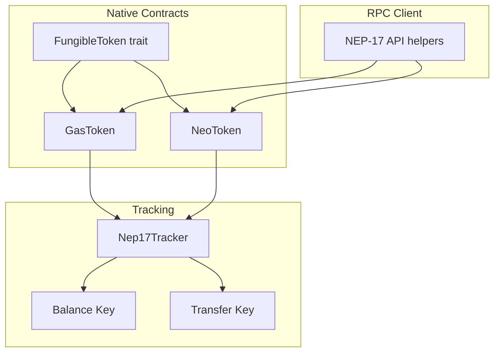
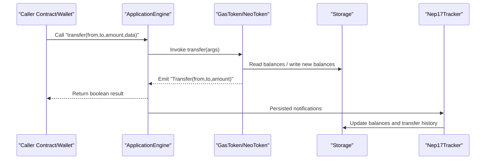
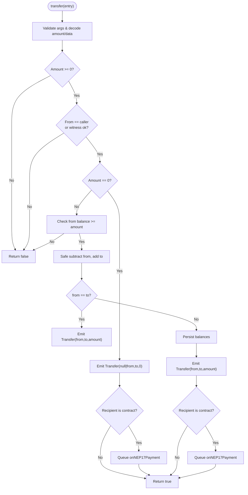
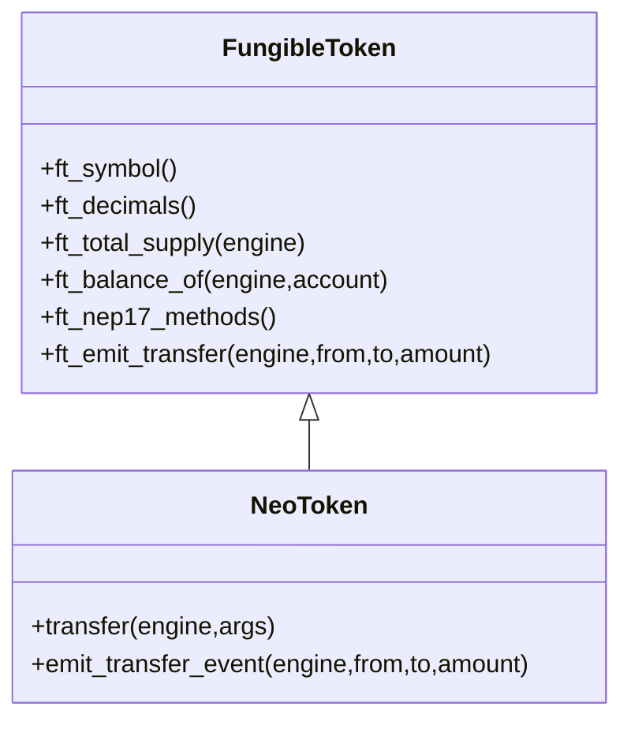
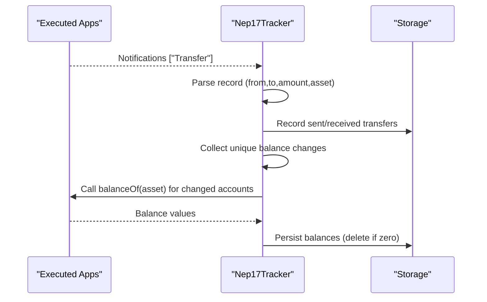
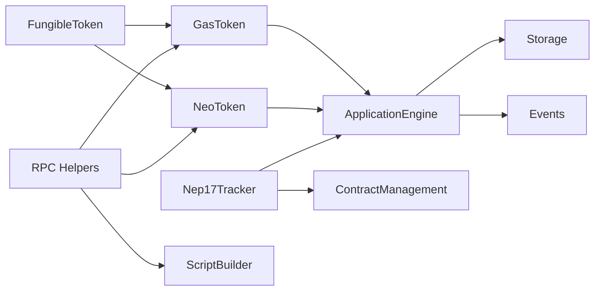

# NEP-17 Fungible Tokens

<cite>
**Referenced Files in This Document**
- [fungible_token.rs](file://neo-core/src/smart_contract/native/fungible_token.rs)
- [gas_token/mod.rs](file://neo-core/src/smart_contract/native/gas_token/mod.rs)
- [gas_token/metadata.rs](file://neo-core/src/smart_contract/native/gas_token/metadata.rs)
- [neo_token/mod.rs](file://neo-core/src/smart_contract/native/neo_token/mod.rs)
- [neo_token/nep17.rs](file://neo-core/src/smart_contract/native/neo_token/nep17.rs)
- [nep17_tracker.rs](file://neo-core/src/tokens_tracker/trackers/nep_17/nep17_tracker.rs)
- [nep17_balance_key.rs](file://neo-core/src/tokens_tracker/trackers/nep_17/nep17_balance_key.rs)
- [nep17_transfer_key.rs](file://neo-core/src/tokens_tracker/trackers/nep_17/nep17_transfer_key.rs)
- [nep17_api.rs](file://neo-rpc/src/client/nep17_api.rs)
</cite>

## Table of Contents
1. [Introduction](#introduction)
2. [Project Structure](#project-structure)
3. [Core Components](#core-components)
4. [Architecture Overview](#architecture-overview)
5. [Detailed Component Analysis](#detailed-component-analysis)
6. [Dependency Analysis](#dependency-analysis)
7. [Performance Considerations](#performance-considerations)
8. [Troubleshooting Guide](#troubleshooting-guide)
9. [Conclusion](#conclusion)
10. [Appendices](#appendices)

## Introduction
This document explains the NEP-17 fungible token standard implementation in Neo-RS, focusing on native tokens GAS and NEO. It covers required methods (transfer, symbol, decimals, totalSupply, balanceOf), storage layout for balances and total supply, event emission for Transfer, and integration patterns for wallets, exchanges, and dApps. It also documents edge cases such as zero-value transfers, self-transfers, witness authorization, and overflow protection.

## Project Structure
The NEP-17 implementation is centered around a shared trait that defines common behavior for fungible tokens, with concrete implementations for GasToken and NeoToken. A tracker component indexes balances and transfer history from emitted events. RPC client helpers assist in building transfer scripts and querying balances.

**Diagram sources**
- [fungible_token.rs:28-231](file://neo-core/src/smart_contract/native/fungible_token.rs#L28-L231)
- [gas_token/mod.rs:32-79](file://neo-core/src/smart_contract/native/gas_token/mod.rs#L32-L79)
- [neo_token/mod.rs:46-89](file://neo-core/src/smart_contract/native/neo_token/mod.rs#L46-L89)
- [nep17_tracker.rs:35-40](file://neo-core/src/tokens_tracker/trackers/nep_17/nep17_tracker.rs#L35-L40)
- [nep17_balance_key.rs:9-26](file://neo-core/src/tokens_tracker/trackers/nep_17/nep17_balance_key.rs#L9-L26)
- [nep17_transfer_key.rs:11-30](file://neo-core/src/tokens_tracker/trackers/nep_17/nep17_transfer_key.rs#L11-L30)
- [nep17_api.rs:354-381](file://neo-rpc/src/client/nep17_api.rs#L354-L381)

**Section sources**
- [fungible_token.rs:28-231](file://neo-core/src/smart_contract/native/fungible_token.rs#L28-L231)
- [gas_token/mod.rs:32-79](file://neo-core/src/smart_contract/native/gas_token/mod.rs#L32-L79)
- [neo_token/mod.rs:46-89](file://neo-core/src/smart_contract/native/neo_token/mod.rs#L46-L89)
- [nep17_tracker.rs:35-40](file://neo-core/src/tokens_tracker/trackers/nep_17/nep17_tracker.rs#L35-L40)
- [nep17_balance_key.rs:9-26](file://neo-core/src/tokens_tracker/trackers/nep_17/nep17_balance_key.rs#L9-L26)
- [nep17_transfer_key.rs:11-30](file://neo-core/src/tokens_tracker/trackers/nep_17/nep17_transfer_key.rs#L11-L30)
- [nep17_api.rs:354-381](file://neo-rpc/src/client/nep17_api.rs#L354-L381)

## Core Components
- FungibleToken trait: Defines symbol, decimals, totalSupply, balanceOf, transfer descriptors, amount encoding/decoding, account storage key helpers, and Transfer event emission.
- GasToken: Native GAS token implementing NEP-17 with mint/burn and transfer logic including witness checks, safe arithmetic, and onNEP17Payment queuing.
- NeoToken: Native NEO token implementing NEP-17 with governance interactions, gas distribution to voters, and state updates.
- Nep17Tracker: Indexes balances and transfer history by scanning Transfer notifications from executed applications and persisting them under specific prefixes.
- RPC helpers: Build transfer scripts and query balances via RPC calls.

Key responsibilities:
- Method descriptors and fees are declared centrally for all NEP-17 methods.
- Storage keys and value formats are consistent across tokens.
- Events are emitted using the canonical Transfer signature.

**Section sources**
- [fungible_token.rs:28-231](file://neo-core/src/smart_contract/native/fungible_token.rs#L28-L231)
- [gas_token/mod.rs:81-265](file://neo-core/src/smart_contract/native/gas_token/mod.rs#L81-L265)
- [neo_token/nep17.rs:46-217](file://neo-core/src/smart_contract/native/neo_token/nep17.rs#L46-L217)
- [nep17_tracker.rs:57-198](file://neo-core/src/tokens_tracker/trackers/nep_17/nep17_tracker.rs#L57-L198)
- [nep17_api.rs:354-381](file://neo-rpc/src/client/nep17_api.rs#L354-L381)

## Architecture Overview
The architecture separates concerns into three layers:
- Native contracts expose NEP-17 methods and manage token state.
- The tracker listens to Transfer events and maintains indexed balances and histories.
- RPC clients provide utilities to build and execute contract calls.

**Diagram sources**
- [gas_token/mod.rs:81-265](file://neo-core/src/smart_contract/native/gas_token/mod.rs#L81-L265)
- [neo_token/nep17.rs:46-217](file://neo-core/src/smart_contract/native/neo_token/nep17.rs#L46-L217)
- [nep17_tracker.rs:210-262](file://neo-core/src/tokens_tracker/trackers/nep_17/nep17_tracker.rs#L210-L262)

## Detailed Component Analysis

### FungibleToken Trait (Shared NEP-17 Surface)
- Methods exposed:
  - symbol: returns token symbol string; fee 0; read-only.
  - decimals: returns decimal count; fee 0; read-only.
  - totalSupply: returns total supply integer; fee 1<<15; reads states.
  - balanceOf(account): returns balance integer; fee 1<<15; reads states.
  - transfer(from,to,amount,data): returns boolean; fee 1<<17; writes states; storage_fee 50.
- Helpers:
  - ft_factor computes 10^decimals.
  - ft_encode_amount/ft_decode_amount use little-endian signed bytes compatible with C#.
  - ft_read_account validates 20-byte account argument.
  - ft_account_storage_key and ft_total_supply_storage_key define storage key suffixes.
  - ft_invoke_standard_read dispatches symbol, decimals, totalSupply, balanceOf.
  - ft_emit_transfer emits Transfer event with from/to/amount encoded as StackItems.
  - ft_validate_amount rejects negative amounts.

Storage layout:
- Total supply stored under a fixed prefix byte.
- Account balances stored under an account prefix followed by the 20-byte account hash.

Event emission:
- Transfer event uses three parameters: from (Hash160 or null), to (Hash160 or null), amount (Integer).

**Section sources**
- [fungible_token.rs:22-106](file://neo-core/src/smart_contract/native/fungible_token.rs#L22-L106)
- [fungible_token.rs:108-189](file://neo-core/src/smart_contract/native/fungible_token.rs#L108-L189)
- [fungible_token.rs:191-231](file://neo-core/src/smart_contract/native/fungible_token.rs#L191-L231)

### GasToken Implementation
- Constants: symbol "GAS", decimals 8, name "GasToken".
- Method routing: delegates standard reads to FungibleToken; transfer handled locally.
- Transfer flow:
  - Validates argument count and decodes amount/data.
  - Ensures non-negative amount.
  - Authorizes via calling script hash and witness checks when necessary.
  - Handles zero-value transfers: emits Transfer and optionally queues onNEP17Payment if recipient is a contract.
  - For non-zero transfers: checks sufficient balance, applies safe arithmetic, updates both accounts, emits Transfer, and queues onNEP17Payment if applicable.
  - Emits Transfer event with canonical StackItem types.
- Storage:
  - Uses account suffix derived from ID and PREFIX_ACCOUNT.
  - Deletes account entry when balance becomes zero; otherwise persists serialized state.
  - Adjusts total supply on mint/burn operations.
- Security:
  - Reentrancy guard around transfer, mint, burn.
  - Safe arithmetic prevents overflow/underflow.
  - State validation after updates.

**Diagram sources**
- [gas_token/mod.rs:81-265](file://neo-core/src/smart_contract/native/gas_token/mod.rs#L81-L265)

**Section sources**
- [gas_token/mod.rs:32-79](file://neo-core/src/smart_contract/native/gas_token/mod.rs#L32-L79)
- [gas_token/mod.rs:81-265](file://neo-core/src/smart_contract/native/gas_token/mod.rs#L81-L265)
- [gas_token/mod.rs:383-458](file://neo-core/src/smart_contract/native/gas_token/mod.rs#L383-L458)
- [gas_token/metadata.rs:6-21](file://neo-core/src/smart_contract/native/gas_token/metadata.rs#L6-L21)

### NeoToken Implementation
- Constants: symbol "NEO", decimals 0, name "NeoToken", fixed total supply.
- NEP-17 transfer:
  - Validates arguments and amount.
  - Authorizes via calling script hash and witness checks.
  - Applies governance-related updates (voter counts, candidate votes) and distributes unclaimed GAS rewards.
  - Emits Transfer event and queues onNEP17Payment if recipient is a contract.
- Storage:
  - Persists NeoAccountState under account prefix; deletes when balance is zero.
  - Updates related governance structures during balance changes.

**Diagram sources**
- [fungible_token.rs:28-231](file://neo-core/src/smart_contract/native/fungible_token.rs#L28-L231)
- [neo_token/nep17.rs:46-217](file://neo-core/src/smart_contract/native/neo_token/nep17.rs#L46-L217)

**Section sources**
- [neo_token/mod.rs:46-89](file://neo-core/src/smart_contract/native/neo_token/mod.rs#L46-L89)
- [neo_token/nep17.rs:46-217](file://neo-core/src/smart_contract/native/neo_token/nep17.rs#L46-L217)

### NEP-17 Tracker (Balances and Transfer History)
- Listens to Transfer notifications from executed applications.
- Filters only NEP-17 supported contracts.
- Records sent/received transfers with keys composed of user address, timestamp, asset hash, and transfer index.
- Recomputes balances by invoking balanceOf on affected accounts and stores results under a dedicated prefix.

**Diagram sources**
- [nep17_tracker.rs:57-198](file://neo-core/src/tokens_tracker/trackers/nep_17/nep17_tracker.rs#L57-L198)
- [nep17_tracker.rs:210-262](file://neo-core/src/tokens_tracker/trackers/nep_17/nep17_tracker.rs#L210-L262)

**Section sources**
- [nep17_tracker.rs:25-40](file://neo-core/src/tokens_tracker/trackers/nep_17/nep17_tracker.rs#L25-L40)
- [nep17_tracker.rs:57-198](file://neo-core/src/tokens_tracker/trackers/nep_17/nep17_tracker.rs#L57-L198)
- [nep17_balance_key.rs:9-26](file://neo-core/src/tokens_tracker/trackers/nep_17/nep17_balance_key.rs#L9-L26)
- [nep17_transfer_key.rs:11-30](file://neo-core/src/tokens_tracker/trackers/nep_17/nep17_transfer_key.rs#L11-L30)

### RPC Integration Helpers
- Builds transfer scripts with correct parameter order and optional assertion.
- Encodes data payload (optional) and pushes from/to addresses and amount before calling transfer.
- Provides convenience methods to fetch balances and enrich token info.

**Section sources**
- [nep17_api.rs:339-381](file://neo-rpc/src/client/nep17_api.rs#L339-L381)

## Dependency Analysis
- FungibleToken is the central abstraction used by GasToken and NeoToken.
- Both native tokens rely on ApplicationEngine for storage, notifications, and witness checks.
- Nep17Tracker depends on ContractManagement to verify NEP-17 support and invokes balanceOf via a temporary ApplicationEngine instance.
- RPC helpers depend on ScriptBuilder and call flags to construct valid contract invocations.

**Diagram sources**
- [fungible_token.rs:28-231](file://neo-core/src/smart_contract/native/fungible_token.rs#L28-L231)
- [gas_token/mod.rs:81-265](file://neo-core/src/smart_contract/native/gas_token/mod.rs#L81-L265)
- [neo_token/nep17.rs:46-217](file://neo-core/src/smart_contract/native/neo_token/nep17.rs#L46-L217)
- [nep17_tracker.rs:210-262](file://neo-core/src/tokens_tracker/trackers/nep_17/nep17_tracker.rs#L210-L262)
- [nep17_api.rs:354-381](file://neo-rpc/src/client/nep17_api.rs#L354-L381)

**Section sources**
- [fungible_token.rs:28-231](file://neo-core/src/smart_contract/native/fungible_token.rs#L28-L231)
- [nep17_tracker.rs:210-262](file://neo-core/src/tokens_tracker/trackers/nep_17/nep17_tracker.rs#L210-L262)
- [nep17_api.rs:354-381](file://neo-rpc/src/client/nep17_api.rs#L354-L381)

## Performance Considerations
- Method fees:
  - symbol/decimals: minimal overhead (fee 0).
  - totalSupply/balanceOf: read-only state access (fee 1<<15).
  - transfer: state mutation (fee 1<<17) plus storage_fee 50.
- Safe arithmetic avoids costly error paths due to overflows.
- Tracker recomputes balances only for accounts involved in transfers, minimizing RPC calls.
- Deleting zero-balance entries reduces storage footprint.

[No sources needed since this section provides general guidance]

## Troubleshooting Guide
Common issues and resolutions:
- Negative amount: rejected by validation; ensure inputs are non-negative.
- Insufficient balance: transfer returns false; check sender balance before invoking.
- Unauthorized transfer: witness verification fails unless from equals caller; ensure proper signatures.
- Invalid data format: data must be deserializable; wrap payloads appropriately.
- Zero-value transfers: still emit Transfer; recipients may receive onNEP17Payment callbacks.
- Self-transfers: allowed; balances remain unchanged but events are emitted.

**Section sources**
- [gas_token/mod.rs:81-169](file://neo-core/src/smart_contract/native/gas_token/mod.rs#L81-L169)
- [neo_token/nep17.rs:46-125](file://neo-core/src/smart_contract/native/neo_token/nep17.rs#L46-L125)

## Conclusion
Neo-RS implements NEP-17 consistently across native tokens GAS and NEO through a shared trait and robust per-token logic. The design emphasizes safety (witness checks, safe arithmetic, state validation), compatibility (C# parity in encoding and events), and observability (Transfer events and indexed balances/history). RPC helpers streamline integration for wallets, exchanges, and dApps.

[No sources needed since this section summarizes without analyzing specific files]

## Appendices

### Method Signatures and Specifications
- symbol(): returns String; no parameters; fee 0; read-only.
- decimals(): returns Integer; no parameters; fee 0; read-only.
- totalSupply(): returns Integer; no parameters; fee 1<<15; reads states.
- balanceOf(account: Hash160): returns Integer; fee 1<<15; reads states.
- transfer(from: Hash160, to: Hash160, amount: Integer, data: Any): returns Boolean; fee 1<<17; writes states; storage_fee 50.

Parameter validation:
- Account arguments must be exactly 20 bytes.
- Amount must be non-negative.
- Data is optional and deserialized as StackItem when provided.

Return values:
- symbol/decimals/totalSupply/balanceOf return their respective types.
- transfer returns true on success, false on failure (e.g., insufficient funds or unauthorized).

Event emission:
- Transfer(event): parameters [from: Hash160|null, to: Hash160|null, amount: Integer].

**Section sources**
- [fungible_token.rs:191-231](file://neo-core/src/smart_contract/native/fungible_token.rs#L191-L231)
- [gas_token/metadata.rs:15-21](file://neo-core/src/smart_contract/native/gas_token/metadata.rs#L15-L21)

### Storage Layout
- Total supply: stored under a fixed prefix byte; value is little-endian signed integer.
- Account balances: stored under account prefix followed by 20-byte account hash; value is serialized account state or integer depending on token.
- Tracker indices:
  - Balances: prefix 0xe8 with key (user, asset).
  - Sent transfers: prefix 0xe9 with key (user, timestamp, asset, index).
  - Received transfers: prefix 0xea with key (user, timestamp, asset, index).

**Section sources**
- [fungible_token.rs:22-106](file://neo-core/src/smart_contract/native/fungible_token.rs#L22-L106)
- [nep17_tracker.rs:25-40](file://neo-core/src/tokens_tracker/trackers/nep_17/nep17_tracker.rs#L25-L40)
- [nep17_balance_key.rs:9-26](file://neo-core/src/tokens_tracker/trackers/nep_17/nep17_balance_key.rs#L9-L26)
- [nep17_transfer_key.rs:11-30](file://neo-core/src/tokens_tracker/trackers/nep_17/nep17_transfer_key.rs#L11-L30)

### Examples and Workflows
- Deployment:
  - Deploy native tokens are pre-installed; no deployment script needed for GAS/NEO.
  - For custom NEP-17 contracts, declare supported standards and methods matching NEP-17 descriptors.
- Balance queries:
  - Use balanceOf(account) to retrieve current balance.
  - RPC helpers can batch get_nep17_balances and enrich with token metadata.
- Transfer operations:
  - Build a script pushing data, amount, to, from, then call transfer with ALL flags.
  - Assert return value if strict success is required.
- Approval workflows:
  - NEP-17 does not define approve/allowance; implement allowance via additional methods if needed by your contract.
  - For interoperability, consider wrapping approvals in custom logic while emitting Transfer events as required.

**Section sources**
- [nep17_api.rs:339-381](file://neo-rpc/src/client/nep17_api.rs#L339-L381)

### Edge Cases
- Zero-value transfers:
  - Allowed; emits Transfer; may trigger onNEP17Payment if recipient is a contract.
- Self-transfers:
  - Allowed; balances unchanged; Transfer emitted; onNEP17Payment may be queued.
- Overflow protection:
  - Safe arithmetic used for balance updates; ensures no overflow/underflow.
- Witness authorization:
  - If from != caller, witness must authorize from; otherwise transfer returns false.

**Section sources**
- [gas_token/mod.rs:150-217](file://neo-core/src/smart_contract/native/gas_token/mod.rs#L150-L217)
- [neo_token/nep17.rs:96-189](file://neo-core/src/smart_contract/native/neo_token/nep17.rs#L96-L189)

### Integration Patterns
- Wallets:
  - Query symbol/decimals/totalSupply/balanceOf for UI display.
  - Build transfer scripts with proper argument order and optional assertion.
- Exchanges:
  - Monitor Transfer events for deposits/withdrawals; use tracker indices for efficient queries.
  - Batch balance queries to reduce RPC overhead.
- dApps:
  - Implement onNEP17Payment to handle incoming token payments.
  - Validate Transfer events and update internal state accordingly.

**Section sources**
- [nep17_tracker.rs:210-262](file://neo-core/src/tokens_tracker/trackers/nep_17/nep17_tracker.rs#L210-L262)
- [nep17_api.rs:339-381](file://neo-rpc/src/client/nep17_api.rs#L339-L381)