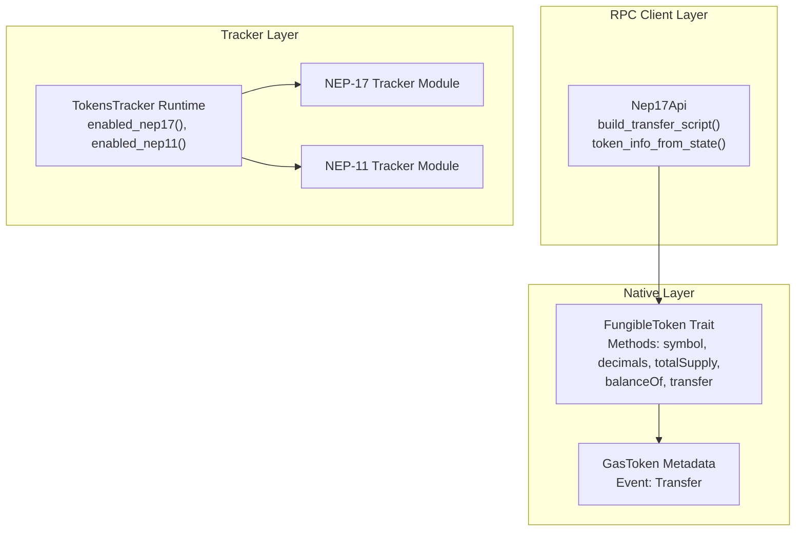
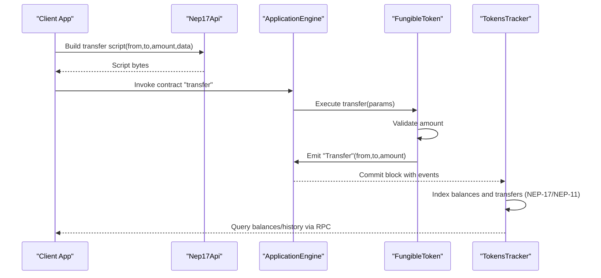
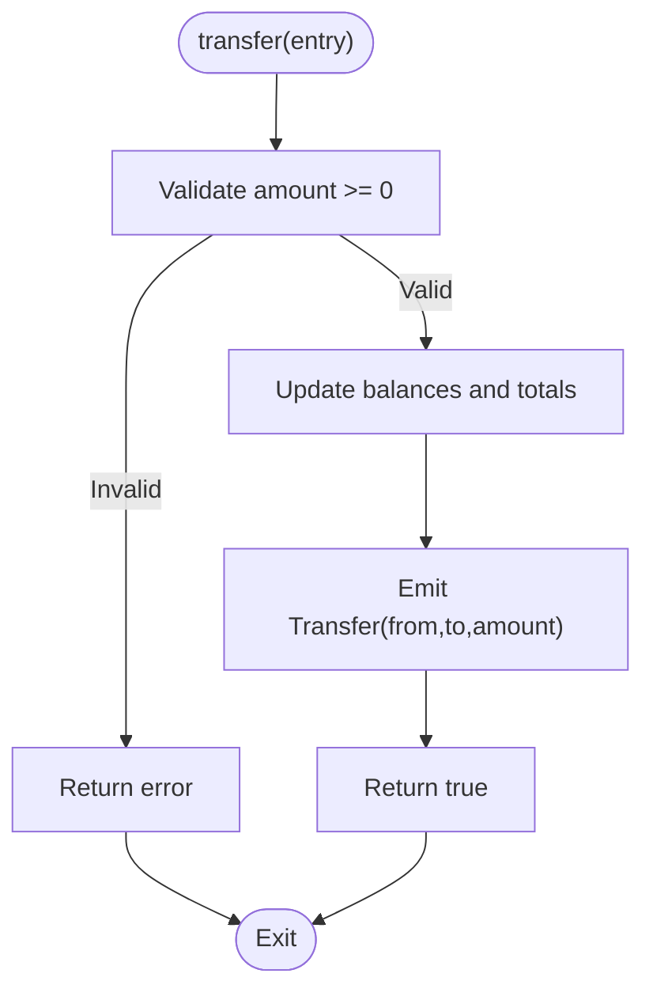
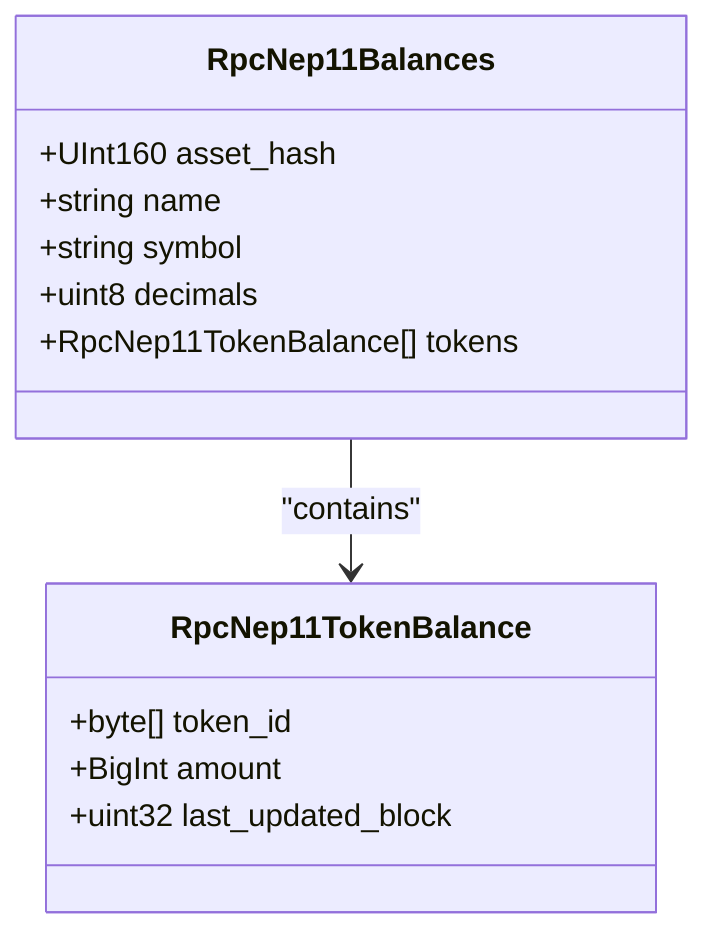
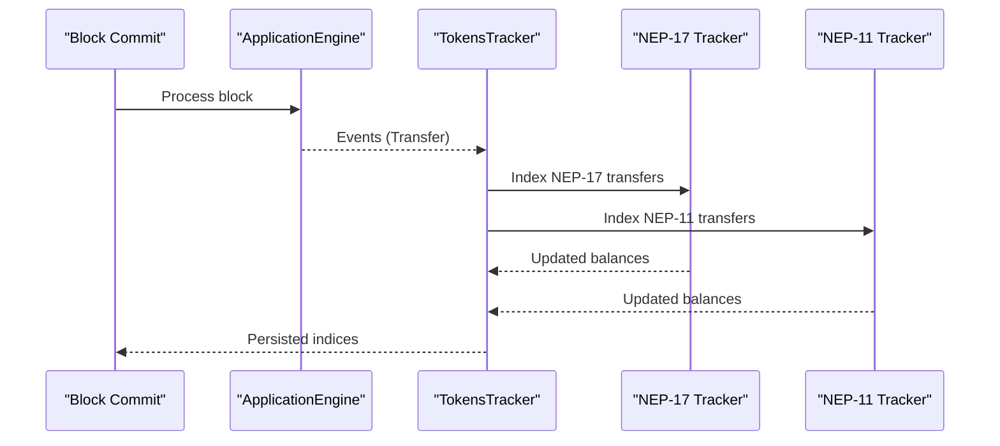
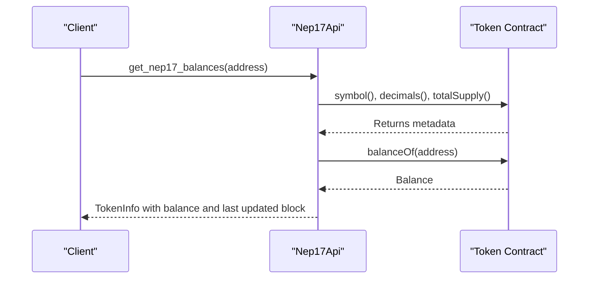
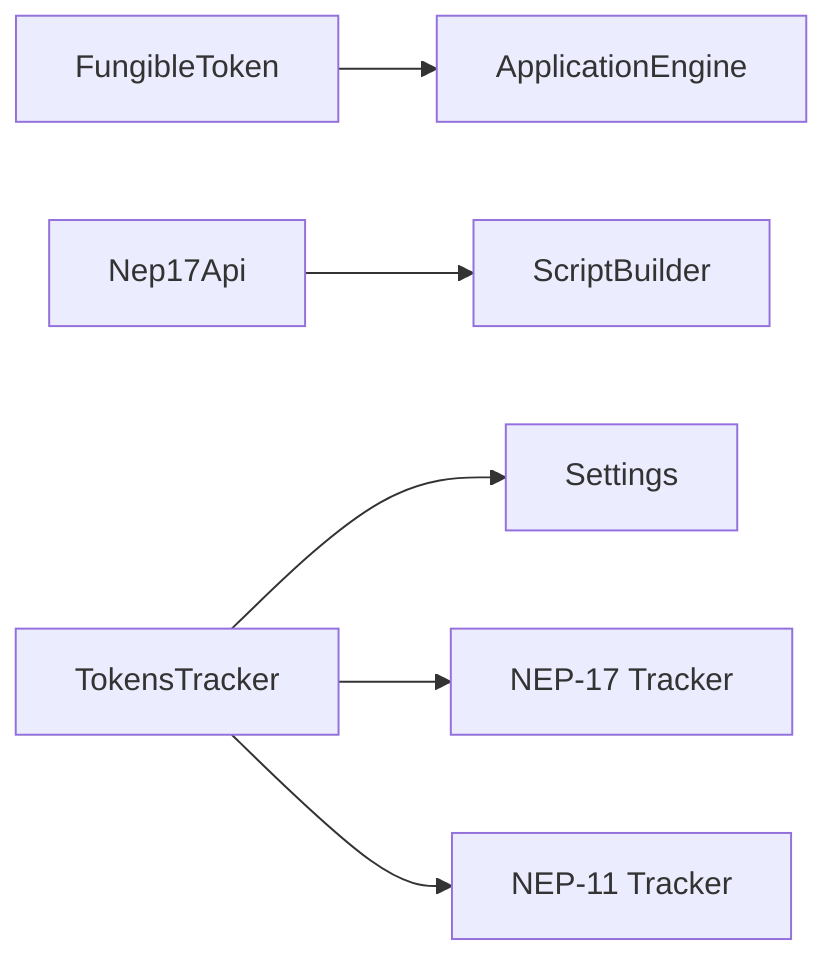

# Token Standards (NEP-17 & NEP-11)

<cite>
**Referenced Files in This Document**
- [fungible_token.rs](file://neo-core/src/smart_contract/native/fungible_token.rs)
- [gas_token_metadata.rs](file://neo-core/src/smart_contract/native/gas_token/metadata.rs)
- [nep17_api.rs](file://neo-rpc/src/client/nep17_api.rs)
- [tokens_tracker_mod.rs](file://neo-core/src/tokens_tracker/mod.rs)
- [tokens_tracker_runtime.rs](file://neo-core/src/tokens_tracker/runtime.rs)
- [tokens_tracker_settings.rs](file://neo-core/src/tokens_tracker/settings.rs)
- [nep_17_mod.rs](file://neo-core/src/tokens_tracker/trackers/nep_17/mod.rs)
- [nep_11_mod.rs](file://neo-core/src/tokens_tracker/trackers/nep_11/mod.rs)
- [native_contract_tests.rs](file://neo-core/tests/native_contract_tests.rs)
- [rpc_nep11_balances.rs](file://neo-rpc/src/client/models/rpc_nep11_balances.rs)
</cite>

## Table of Contents
1. [Introduction](#introduction)
2. [Project Structure](#project-structure)
3. [Core Components](#core-components)
4. [Architecture Overview](#architecture-overview)
5. [Detailed Component Analysis](#detailed-component-analysis)
6. [Dependency Analysis](#dependency-analysis)
7. [Performance Considerations](#performance-considerations)
8. [Troubleshooting Guide](#troubleshooting-guide)
9. [Conclusion](#conclusion)
10. [Appendices](#appendices)

## Introduction
This document explains the Neo token standards implementation for NEP-17 (fungible tokens) and NEP-11 (non-fungible tokens). It covers method specifications, event emission requirements, tracking mechanisms, compatibility guarantees, deployment and integration patterns, differences between standards, gas optimization strategies, and common pitfalls. The content is grounded in the repository’s native token base trait, RPC client utilities, and token tracker subsystem that indexes balances and transfers.

## Project Structure
The token standards are implemented across three layers:
- Native token base trait and metadata for NEP-17 methods and events
- RPC client helpers to build transfer scripts and query token info/balances
- Token trackers that index Transfer events into persistent storage for both NEP-17 and NEP-11

**Diagram sources**
- [fungible_token.rs:191-231](file://neo-core/src/smart_contract/native/fungible_token.rs#L191-L231)
- [gas_token_metadata.rs:6-21](file://neo-core/src/smart_contract/native/gas_token/metadata.rs#L6-L21)
- [nep17_api.rs:354-397](file://neo-rpc/src/client/nep17_api.rs#L354-L397)
- [tokens_tracker_runtime.rs:47-57](file://neo-core/src/tokens_tracker/runtime.rs#L47-L57)
- [nep_17_mod.rs:1-10](file://neo-core/src/tokens_tracker/trackers/nep_17/mod.rs#L1-L10)
- [nep_11_mod.rs:1-11](file://neo-core/src/tokens_tracker/trackers/nep_11/mod.rs#L1-L11)

**Section sources**
- [tokens_tracker_mod.rs:1-37](file://neo-core/src/tokens_tracker/mod.rs#L1-L37)

## Core Components
- FungibleToken trait defines the canonical NEP-17 surface: symbol, decimals, totalSupply, balanceOf, transfer; it also provides shared helpers for encoding amounts, reading accounts, building storage keys, emitting Transfer events, and generating method descriptors with correct flags and fees.
- GasToken metadata declares supported standard as NEP-17 and registers the Transfer event descriptor.
- TokensTracker runtime enables NEP-17 and NEP-11 trackers based on settings and wires them into block commit processing.
- RPC Nep17Api builds transfer scripts and aggregates token info from contract state.

Key behaviors:
- NEP-17 methods have explicit call flags and storage fees defined in method descriptors.
- Transfer events are emitted with from, to, amount using a consistent format.
- Trackers index Transfer events to provide balances and transfer history for both standards.

**Section sources**
- [fungible_token.rs:28-129](file://neo-core/src/smart_contract/native/fungible_token.rs#L28-L129)
- [fungible_token.rs:147-189](file://neo-core/src/smart_contract/native/fungible_token.rs#L147-L189)
- [fungible_token.rs:191-231](file://neo-core/src/smart_contract/native/fungible_token.rs#L191-L231)
- [gas_token_metadata.rs:6-21](file://neo-core/src/smart_contract/native/gas_token/metadata.rs#L6-L21)
- [tokens_tracker_runtime.rs:47-57](file://neo-core/src/tokens_tracker/runtime.rs#L47-L57)
- [nep17_api.rs:354-397](file://neo-rpc/src/client/nep17_api.rs#L354-L397)

## Architecture Overview
The system integrates native token logic, RPC tooling, and indexing:

**Diagram sources**
- [nep17_api.rs:354-397](file://neo-rpc/src/client/nep17_api.rs#L354-L397)
- [fungible_token.rs:147-189](file://neo-core/src/smart_contract/native/fungible_token.rs#L147-L189)
- [tokens_tracker_runtime.rs:47-57](file://neo-core/src/tokens_tracker/runtime.rs#L47-L57)

## Detailed Component Analysis

### NEP-17 Fungible Token Standard
- Methods and behavior:
  - symbol: returns token symbol string; read-only, no storage fee.
  - decimals: returns decimal precision; read-only, no storage fee.
  - totalSupply: returns total supply encoded as integer; read-only with storage fee flag.
  - balanceOf(account): returns account balance encoded as integer; read-only with storage fee flag.
  - transfer(from,to,amount,data): mutable operation requiring all call flags; includes storage fee and emits Transfer event.
- Event emission:
  - Transfer event parameters: from (address or null), to (address or null), amount (integer).
- Storage and encoding:
  - Amounts are little-endian signed integers.
  - Account and total supply use dedicated prefixes for storage keys.
- Method descriptors:
  - Flags and storage fees are explicitly set per method to enforce access control and cost accounting.

**Diagram sources**
- [fungible_token.rs:178-189](file://neo-core/src/smart_contract/native/fungible_token.rs#L178-L189)
- [fungible_token.rs:147-176](file://neo-core/src/smart_contract/native/fungible_token.rs#L147-L176)

**Section sources**
- [fungible_token.rs:28-129](file://neo-core/src/smart_contract/native/fungible_token.rs#L28-L129)
- [fungible_token.rs:147-189](file://neo-core/src/smart_contract/native/fungible_token.rs#L147-L189)
- [fungible_token.rs:191-231](file://neo-core/src/smart_contract/native/fungible_token.rs#L191-L231)
- [native_contract_tests.rs:816-842](file://neo-core/tests/native_contract_tests.rs#L816-L842)

### NEP-11 Non-Fungible Token Standard
- Methods and behavior:
  - transfer(tokenId, from, to, data): moves ownership of a specific token ID; typically requires all call flags and emits Transfer.
  - ownerOf(tokenId): returns the current owner address for a given token ID.
  - tokens(address): enumerates token IDs owned by an address.
  - tokensOf(address): alternative enumeration interface returning token IDs for an address.
- Metadata handling:
  - NFT contracts expose a properties(tokenId) method returning a map of key-value pairs (e.g., name, image, tokenURI).
  - RPC models include fields for asset hash, name, symbol, decimals, and a list of token balances with last updated block.
- Tracking:
  - NEP-11 tracker module exists alongside NEP-17 tracker; both are enabled via settings and indexed during block commits.

**Diagram sources**
- [rpc_nep11_balances.rs:79-160](file://neo-rpc/src/client/models/rpc_nep11_balances.rs#L79-L160)

**Section sources**
- [nep_11_mod.rs:1-11](file://neo-core/src/tokens_tracker/trackers/nep_11/mod.rs#L1-L11)
- [rpc_nep11_balances.rs:79-160](file://neo-rpc/src/client/models/rpc_nep11_balances.rs#L79-L160)

### Token Tracking Mechanisms
- The TokensTracker subsystem indexes Transfer events from blocks and stores balance/transfer records in a separate database.
- Both NEP-17 and NEP-11 trackers are conditionally enabled via settings and registered at runtime.
- Tracker modules define keys for balances and transfers, enabling efficient queries for balances and histories.

**Diagram sources**
- [tokens_tracker_mod.rs:1-37](file://neo-core/src/tokens_tracker/mod.rs#L1-L37)
- [tokens_tracker_runtime.rs:47-57](file://neo-core/src/tokens_tracker/runtime.rs#L47-L57)
- [tokens_tracker_settings.rs:92-97](file://neo-core/src/tokens_tracker/settings.rs#L92-L97)
- [nep_17_mod.rs:1-10](file://neo-core/src/tokens_tracker/trackers/nep_17/mod.rs#L1-L10)
- [nep_11_mod.rs:1-11](file://neo-core/src/tokens_tracker/trackers/nep_11/mod.rs#L1-L11)

**Section sources**
- [tokens_tracker_mod.rs:1-37](file://neo-core/src/tokens_tracker/mod.rs#L1-L37)
- [tokens_tracker_runtime.rs:47-57](file://neo-core/src/tokens_tracker/runtime.rs#L47-L57)
- [tokens_tracker_settings.rs:92-97](file://neo-core/src/tokens_tracker/settings.rs#L92-L97)

### Integration Patterns and Examples
- Building a transfer script:
  - Use the RPC client helper to construct a script that pushes arguments in reverse order and calls the contract’s transfer method with appropriate flags. Optional assertion can be appended to enforce success.
- Aggregating token info:
  - Combine contract manifest metadata (name, symbol, decimals) with on-chain queries (totalSupply) and per-address balances to assemble complete token information.

**Diagram sources**
- [nep17_api.rs:339-397](file://neo-rpc/src/client/nep17_api.rs#L339-L397)

**Section sources**
- [nep17_api.rs:339-397](file://neo-rpc/src/client/nep17_api.rs#L339-L397)

## Dependency Analysis
- Native layer depends on ApplicationEngine for event emission and storage access.
- RPC client depends on script builder and contract invocation utilities to generate transfer scripts and aggregate token info.
- Tracker layer depends on settings to enable NEP-17/NEP-11 and on block commit events to index data.

**Diagram sources**
- [fungible_token.rs:147-176](file://neo-core/src/smart_contract/native/fungible_token.rs#L147-L176)
- [nep17_api.rs:354-397](file://neo-rpc/src/client/nep17_api.rs#L354-L397)
- [tokens_tracker_runtime.rs:47-57](file://neo-core/src/tokens_tracker/runtime.rs#L47-L57)
- [tokens_tracker_settings.rs:92-97](file://neo-core/src/tokens_tracker/settings.rs#L92-L97)

**Section sources**
- [tokens_tracker_runtime.rs:47-57](file://neo-core/src/tokens_tracker/runtime.rs#L47-L57)
- [tokens_tracker_settings.rs:92-97](file://neo-core/src/tokens_tracker/settings.rs#L92-L97)

## Performance Considerations
- Read-only methods (symbol, decimals) have zero storage fees; totalSupply and balanceOf incur storage fees aligned with READ_STATES flags.
- Transfer operations carry higher storage fees and require full call flags; ensure minimal state mutations and avoid unnecessary reads/writes inside custom logic.
- Batch token info retrieval:
  - Use combined scripts to fetch symbol, decimals, and totalSupply in a single invocation to reduce round-trips.
- Tracker efficiency:
  - Enable only needed trackers (NEP-17 vs NEP-11) via settings to minimize indexing overhead.

[No sources needed since this section provides general guidance]

## Troubleshooting Guide
- Negative amounts:
  - Ensure amount validation rejects negative values before updates.
- Argument parsing:
  - Verify account argument length and encoding when calling balanceOf or transfer.
- Event consistency:
  - Confirm Transfer events are emitted with correct parameter types and order to maintain indexer compatibility.
- RPC script construction:
  - Push arguments in reverse order and use proper flags when invoking transfer; add ASSERT if you need to enforce success.

**Section sources**
- [fungible_token.rs:178-189](file://neo-core/src/smart_contract/native/fungible_token.rs#L178-L189)
- [fungible_token.rs:83-94](file://neo-core/src/smart_contract/native/fungible_token.rs#L83-L94)
- [nep17_api.rs:354-397](file://neo-rpc/src/client/nep17_api.rs#L354-L397)

## Conclusion
Neo’s NEP-17 and NEP-11 implementations provide a robust, standardized foundation for fungible and non-fungible tokens. The FungibleToken trait centralizes method definitions, event emission, and encoding rules, while the TokensTracker subsystem ensures reliable indexing of balances and transfers. RPC utilities simplify client interactions by constructing scripts and aggregating token metadata. Adhering to method flags, storage fees, and event formats guarantees compatibility and predictable performance across the ecosystem.

[No sources needed since this section summarizes without analyzing specific files]

## Appendices

### NEP-17 vs NEP-11 Differences
- NEP-17:
  - Fungible units with balances and total supply.
  - Methods: symbol, decimals, totalSupply, balanceOf, transfer.
  - Transfer events track unit movements.
- NEP-11:
  - Unique token IDs with ownership and enumeration.
  - Methods: transfer, ownerOf, tokens, tokensOf; plus properties(tokenId) for metadata.
  - Transfer events track unique token movement; balances represent counts per token ID.

[No sources needed since this section provides general guidance]

### Deployment and Operations Checklist
- Define token metadata and supported standards in contract manifest.
- Register Transfer event descriptors for NEP-17; ensure NEP-11 properties method is exposed.
- Enable relevant trackers via settings; verify indexing starts after deployment.
- Use RPC helpers to build transfer scripts and test end-to-end flows.

[No sources needed since this section provides general guidance]