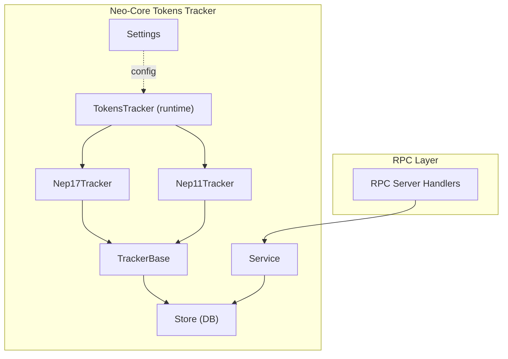
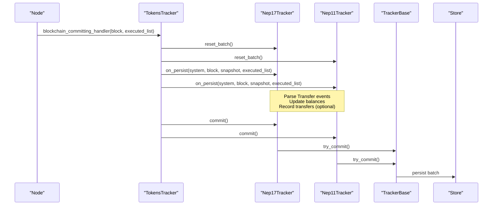
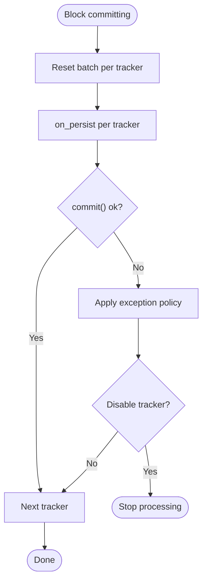
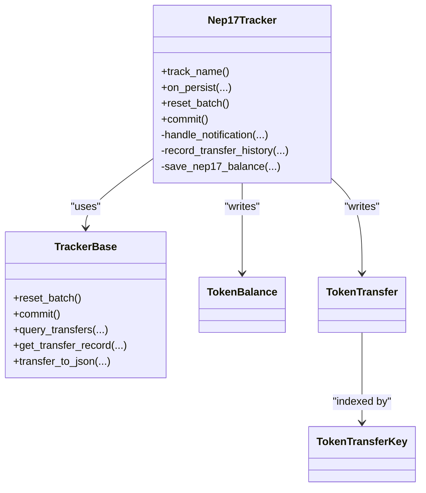
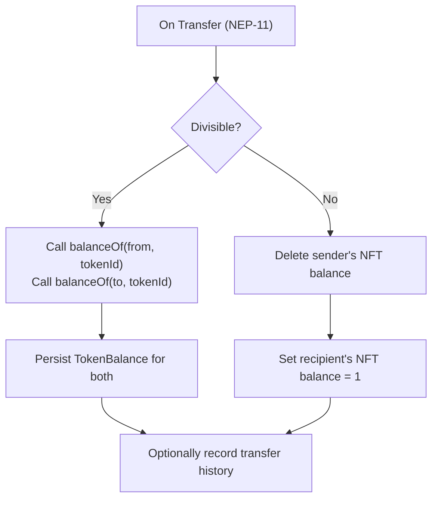
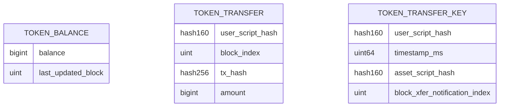
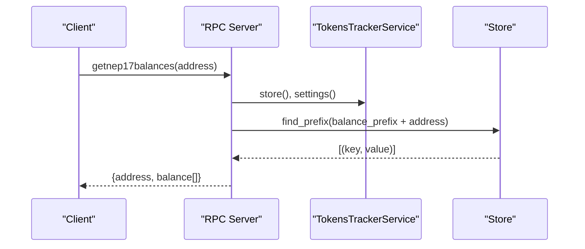
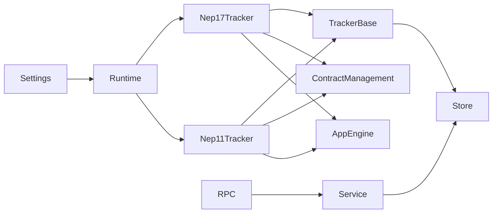

# Token Tracking & Indexing

<cite>
**Referenced Files in This Document**
- [mod.rs](file://neo-core/src/tokens_tracker/mod.rs)
- [runtime.rs](file://neo-core/src/tokens_tracker/runtime.rs)
- [settings.rs](file://neo-core/src/tokens_tracker/settings.rs)
- [service.rs](file://neo-core/src/tokens_tracker/service.rs)
- [tracker_base.rs](file://neo-core/src/tokens_tracker/trackers/tracker_base.rs)
- [nep_17_tracker.rs](file://neo-core/src/tokens_tracker/trackers/nep_17/nep17_tracker.rs)
- [nep_11_tracker.rs](file://neo-core/src/tokens_tracker/trackers/nep_11/nep11_tracker.rs)
- [token_balance.rs](file://neo-core/src/tokens_tracker/trackers/token_balance.rs)
- [token_transfer.rs](file://neo-core/src/tokens_tracker/trackers/token_transfer.rs)
- [token_transfer_key.rs](file://neo-core/src/tokens_tracker/trackers/token_transfer_key.rs)
- [extensions.rs](file://neo-core/src/tokens_tracker/extensions.rs)
- [rpc_server_tokens_tracker_mod.rs](file://neo-rpc/src/server/rpc_server_tokens_tracker/mod.rs)
</cite>

## Table of Contents
1. Introduction
2. Project Structure
3. Core Components
4. Architecture Overview
5. Detailed Component Analysis
6. Dependency Analysis
7. Performance Considerations
8. Troubleshooting Guide
9. Conclusion
10. Appendices

## Introduction
This document explains the token tracking and indexing system in Neo-RS that monitors token transfers across the blockchain, maintains real-time balances, and provides efficient querying for NEP-17 (fungible) and NEP-11 (non-fungible) tokens. It covers the tracking architecture (event listeners, index maintenance, cache strategies), configuration options, performance tuning, storage requirements, query examples, error handling, recovery mechanisms, and guidance for high-throughput scenarios.

## Project Structure
The token tracking subsystem lives under neo-core/src/tokens_tracker and is composed of:
- Runtime integration with block commit lifecycle
- Per-standard trackers (NEP-17, NEP-11)
- Shared base logic for persistence and queries
- Data models for balances and transfer history
- RPC service wrapper exposing settings and store to RPC handlers

**Diagram sources**
- [runtime.rs:22-70](file://neo-core/src/tokens_tracker/runtime.rs#L22-L70)
- [tracker_base.rs:87-135](file://neo-core/src/tokens_tracker/trackers/tracker_base.rs#L87-L135)
- [nep_17_tracker.rs:25-55](file://neo-core/src/tokens_tracker/trackers/nep_17/nep17_tracker.rs#L25-L55)
- [nep_11_tracker.rs:27-51](file://neo-core/src/tokens_tracker/trackers/nep_11/nep11_tracker.rs#L27-L51)
- [service.rs:8-30](file://neo-core/src/tokens_tracker/service.rs#L8-L30)
- [settings.rs:11-39](file://neo-core/src/tokens_tracker/settings.rs#L11-L39)

**Section sources**
- [mod.rs:1-36](file://neo-core/src/tokens_tracker/mod.rs#L1-L36)

## Core Components
- TokensTracker runtime: Implements CommittingHandler and CommittedHandler to process blocks, reset per-block batches, invoke tracker on_persist, and commit changes.
- Trackers: Nep17Tracker and Nep11Tracker parse Transfer notifications, update balances, and optionally record transfer history.
- TrackerBase: Provides batched snapshot-based writes, key/value helpers, range/prefix scans, and JSON serialization for transfer records.
- Data models: TokenBalance and TokenTransfer represent stored values; keys include user, asset, time, and notification index.
- Settings: Controls enabled standards, history tracking, max results, network scope, and exception policy.
- Service: Lightweight handle for RPC to access settings and backing store.

**Section sources**
- [runtime.rs:22-70](file://neo-core/src/tokens_tracker/runtime.rs#L22-L70)
- [tracker_base.rs:66-135](file://neo-core/src/tokens_tracker/trackers/tracker_base.rs#L66-L135)
- [nep_17_tracker.rs:25-55](file://neo-core/src/tokens_tracker/trackers/nep_17/nep17_tracker.rs#L25-L55)
- [nep_11_tracker.rs:27-51](file://neo-core/src/tokens_tracker/trackers/nep_11/nep11_tracker.rs#L27-L51)
- [token_balance.rs:10-41](file://neo-core/src/tokens_tracker/trackers/token_balance.rs#L10-L41)
- [token_transfer.rs:11-51](file://neo-core/src/tokens_tracker/trackers/token_transfer.rs#L11-L51)
- [token_transfer_key.rs:9-79](file://neo-core/src/tokens_tracker/trackers/token_transfer_key.rs#L9-L79)
- [settings.rs:11-39](file://neo-core/src/tokens_tracker/settings.rs#L11-L39)
- [service.rs:8-30](file://neo-core/src/tokens_tracker/service.rs#L8-L30)

## Architecture Overview
The system integrates into the node’s block processing pipeline via event handlers. For each committed block:
- The runtime resets a per-tracker batch snapshot.
- Each tracker processes ApplicationExecuted notifications, extracts Transfer events, updates balances, and records transfer history if enabled.
- After processing, the runtime commits all pending writes atomically.

**Diagram sources**
- [runtime.rs:137-197](file://neo-core/src/tokens_tracker/runtime.rs#L137-L197)
- [tracker_base.rs:118-135](file://neo-core/src/tokens_tracker/trackers/tracker_base.rs#L118-L135)
- [nep_17_tracker.rs:215-270](file://neo-core/src/tokens_tracker/trackers/nep_17/nep17_tracker.rs#L215-L270)
- [nep_11_tracker.rs:271-353](file://neo-core/src/tokens_tracker/trackers/nep_11/nep11_tracker.rs#L271-L353)

## Detailed Component Analysis

### TokensTracker Runtime
- Lifecycle hooks: Resets per-block batches, invokes tracker.on_persist for each enabled tracker, then commits.
- Exception policy: Catches panics and errors per tracker; applies configured policy (ignore, continue, stop plugin, terminate, stop node). Disables further processing when required by policy.
- Network gating: Only processes blocks from the configured network ID.

**Diagram sources**
- [runtime.rs:77-134](file://neo-core/src/tokens_tracker/runtime.rs#L77-L134)
- [runtime.rs:137-197](file://neo-core/src/tokens_tracker/runtime.rs#L137-L197)

**Section sources**
- [runtime.rs:22-70](file://neo-core/src/tokens_tracker/runtime.rs#L22-L70)
- [runtime.rs:77-134](file://neo-core/src/tokens_tracker/runtime.rs#L77-L134)
- [runtime.rs:137-197](file://neo-core/src/tokens_tracker/runtime.rs#L137-L197)

### NEP-17 Tracker
- Event parsing: Filters Transfer events from contracts that declare NEP-17 support.
- Balance updates: Identifies affected users (from/to), calls balanceOf on the contract via a read-only VM invocation using the current snapshot, and persists TokenBalance or deletes zero balances.
- Transfer history: Optionally records sent/received entries keyed by user, timestamp, asset, and notification index.

**Diagram sources**
- [nep_17_tracker.rs:25-55](file://neo-core/src/tokens_tracker/trackers/nep_17/nep17_tracker.rs#L25-L55)
- [nep_17_tracker.rs:57-198](file://neo-core/src/tokens_tracker/trackers/nep_17/nep17_tracker.rs#L57-L198)
- [tracker_base.rs:66-135](file://neo-core/src/tokens_tracker/trackers/tracker_base.rs#L66-L135)
- [token_balance.rs:10-41](file://neo-core/src/tokens_tracker/trackers/token_balance.rs#L10-L41)
- [token_transfer.rs:11-51](file://neo-core/src/tokens_tracker/trackers/token_transfer.rs#L11-L51)
- [token_transfer_key.rs:9-79](file://neo-core/src/tokens_tracker/trackers/token_transfer_key.rs#L9-L79)

**Section sources**
- [nep_17_tracker.rs:57-198](file://neo-core/src/tokens_tracker/trackers/nep_17/nep17_tracker.rs#L57-L198)
- [nep_17_tracker.rs:215-270](file://neo-core/src/tokens_tracker/trackers/nep_17/nep17_tracker.rs#L215-L270)

### NEP-11 Tracker
- Event parsing: Filters Transfer events from contracts that declare NEP-11 support and require a token_id.
- Divisibility detection: Inspects ABI to determine whether balanceOf supports one or two parameters; uses appropriate path to compute balances.
- Balance updates: For indivisible NFTs, sets ownership to recipient and removes sender; for divisible NFTs, re-queries balances for both parties.
- Transfer history: Records sent/received entries including token_id.

**Diagram sources**
- [nep_11_tracker.rs:53-130](file://neo-core/src/tokens_tracker/trackers/nep_11/nep11_tracker.rs#L53-L130)
- [nep_11_tracker.rs:132-254](file://neo-core/src/tokens_tracker/trackers/nep_11/nep11_tracker.rs#L132-L254)
- [nep_11_tracker.rs:315-344](file://neo-core/src/tokens_tracker/trackers/nep_11/nep11_tracker.rs#L315-L344)

**Section sources**
- [nep_11_tracker.rs:53-130](file://neo-core/src/tokens_tracker/trackers/nep_11/nep11_tracker.rs#L53-L130)
- [nep_11_tracker.rs:132-254](file://neo-core/src/tokens_tracker/trackers/nep_11/nep11_tracker.rs#L132-L254)
- [nep_11_tracker.rs:271-353](file://neo-core/src/tokens_tracker/trackers/nep_11/nep11_tracker.rs#L271-L353)

### Storage Models and Keys
- TokenBalance: Stores amount and last_updated_block.
- TokenTransfer: Stores counterpart address, block_index, tx_hash, and amount.
- TokenTransferKey: Composite key ordering by user, timestamp_ms, asset, and notification index to enable efficient time-range queries.

**Diagram sources**
- [token_balance.rs:10-41](file://neo-core/src/tokens_tracker/trackers/token_balance.rs#L10-L41)
- [token_transfer.rs:11-51](file://neo-core/src/tokens_tracker/trackers/token_transfer.rs#L11-L51)
- [token_transfer_key.rs:9-79](file://neo-core/src/tokens_tracker/trackers/token_transfer_key.rs#L9-L79)

**Section sources**
- [token_balance.rs:10-41](file://neo-core/src/tokens_tracker/trackers/token_balance.rs#L10-L41)
- [token_transfer.rs:11-51](file://neo-core/src/tokens_tracker/trackers/token_transfer.rs#L11-L51)
- [token_transfer_key.rs:9-79](file://neo-core/src/tokens_tracker/trackers/token_transfer_key.rs#L9-L79)

### Querying and RPC Integration
- RPC handlers use tracker-specific prefixes to scan balances and transfers.
- find_prefix and find_range helpers perform prefix/range scans over the Store using snapshots.
- getnep17balances and getnep11balances assemble responses by scanning balances and enriching with metadata where applicable.

**Diagram sources**
- [rpc_server_tokens_tracker_mod.rs:273-309](file://neo-rpc/src/server/rpc_server_tokens_tracker/mod.rs#L273-L309)
- [extensions.rs:26-54](file://neo-core/src/tokens_tracker/extensions.rs#L26-L54)
- [service.rs:15-30](file://neo-core/src/tokens_tracker/service.rs#L15-L30)

**Section sources**
- [extensions.rs:26-104](file://neo-core/src/tokens_tracker/extensions.rs#L26-L104)
- [rpc_server_tokens_tracker_mod.rs:273-309](file://neo-rpc/src/server/rpc_server_tokens_tracker/mod.rs#L273-L309)

## Dependency Analysis
- TokensTracker depends on:
  - Settings for enabling standards, limits, and policies
  - Trackers for NEP-17 and NEP-11
  - Store for snapshot-based batched writes
- Trackers depend on:
  - ContractManagement to verify supported standards and inspect ABIs
  - ApplicationEngine for read-only balanceOf calls against contracts
  - TrackerBase for persistence and query utilities
- RPC layer depends on:
  - TokensTrackerService to access settings and store
  - Extension helpers for prefix/range scans

**Diagram sources**
- [runtime.rs:40-70](file://neo-core/src/tokens_tracker/runtime.rs#L40-L70)
- [nep_17_tracker.rs:142-198](file://neo-core/src/tokens_tracker/trackers/nep_17/nep17_tracker.rs#L142-L198)
- [nep_11_tracker.rs:132-229](file://neo-core/src/tokens_tracker/trackers/nep_11/nep11_tracker.rs#L132-L229)
- [service.rs:15-30](file://neo-core/src/tokens_tracker/service.rs#L15-L30)

**Section sources**
- [runtime.rs:40-70](file://neo-core/src/tokens_tracker/runtime.rs#L40-L70)
- [nep_17_tracker.rs:142-198](file://neo-core/src/tokens_tracker/trackers/nep_17/nep17_tracker.rs#L142-L198)
- [nep_11_tracker.rs:132-229](file://neo-core/src/tokens_tracker/trackers/nep_11/nep11_tracker.rs#L132-L229)
- [service.rs:15-30](file://neo-core/src/tokens_tracker/service.rs#L15-L30)

## Performance Considerations
- Batched writes: Each block creates a snapshot; writes are buffered and committed once per block to minimize I/O overhead.
- History toggling: Disable track_history to reduce write amplification when only balances are needed.
- Max results: Tune max_results to cap RPC response sizes and avoid large scans.
- Selective tracking: Enable only required standards (NEP-17, NEP-11) to reduce processing.
- Read-only VM calls: Trackers call balanceOf via ApplicationEngine with limited gas budgets; failures are logged and skipped to keep throughput stable.
- Efficient scans: Use prefix and range scans to limit database reads during RPC queries.

[No sources needed since this section provides general guidance]

## Troubleshooting Guide
- Exceptions and panics:
  - Per-tracker actions are wrapped to catch panics and errors.
  - UnhandledExceptionPolicy determines whether to ignore, continue, stop plugin, terminate, or stop node.
  - On policy-triggered failure, the tracker can be disabled to prevent further processing.
- Common issues:
  - Missing or malformed Transfer payloads are ignored safely.
  - Contract not supporting standard or missing methods leads to skipping updates.
  - Snapshot commit failures propagate as errors; ensure underlying Store is healthy.

**Section sources**
- [runtime.rs:77-134](file://neo-core/src/tokens_tracker/runtime.rs#L77-L134)
- [settings.rs:75-86](file://neo-core/src/tokens_tracker/settings.rs#L75-L86)
- [tracker_base.rs:123-135](file://neo-core/src/tokens_tracker/trackers/tracker_base.rs#L123-L135)

## Conclusion
The token tracking system provides robust, pluggable indexing for NEP-17 and NEP-11 tokens with strong isolation between block processing and persistence. It balances accuracy (via read-only contract calls) with performance (batched writes, selective history, bounded queries). Proper configuration and monitoring ensure reliable operation at scale.

[No sources needed since this section summarizes without analyzing specific files]

## Appendices

### Configuration Options
- db_path: Path or identifier for the token balance database.
- track_history: Whether to record full transfer history.
- max_results: Maximum number of results returned by RPC queries.
- network: Network ID filter for processing blocks.
- enabled_trackers: List of standards to enable ("NEP-17", "NEP-11").
- unhandled_exception_policy: Behavior on unexpected errors/panics.

**Section sources**
- [settings.rs:11-39](file://neo-core/src/tokens_tracker/settings.rs#L11-L39)
- [settings.rs:41-89](file://neo-core/src/tokens_tracker/settings.rs#L41-L89)

### Example Queries
- Get NEP-17 balances for an address:
  - Build prefix from balance prefix and user script hash.
  - Scan using find_prefix and return balances with optional metadata enrichment.
- Get NEP-11 balances for an address:
  - Similar prefix scan using NEP-11 balance prefix.
- Get transfer history:
  - Use query_transfers or find_range with time bounds to retrieve sent/received entries.

**Section sources**
- [rpc_server_tokens_tracker_mod.rs:273-309](file://neo-rpc/src/server/rpc_server_tokens_tracker/mod.rs#L273-L309)
- [extensions.rs:26-104](file://neo-core/src/tokens_tracker/extensions.rs#L26-L104)
- [tracker_base.rs:180-219](file://neo-core/src/tokens_tracker/trackers/tracker_base.rs#L180-L219)

### Relationship to Native Token Contracts
- Trackers rely on contract manifests to confirm standard support before processing Transfer events.
- For NEP-11 divisibility detection, trackers inspect the ABI to choose the correct balanceOf signature.
- This ensures compatibility with native and user contracts that implement the standards.

**Section sources**
- [nep_17_tracker.rs:228-257](file://neo-core/src/tokens_tracker/trackers/nep_17/nep17_tracker.rs#L228-L257)
- [nep_11_tracker.rs:284-344](file://neo-core/src/tokens_tracker/trackers/nep_11/nep11_tracker.rs#L284-L344)

### Error Handling and Recovery
- Failures in balanceOf or VM execution are logged and do not halt block processing.
- Snapshot commit errors are propagated; the policy may disable the tracker to protect the node.
- Re-enabling requires restarting or adjusting policy and ensuring storage health.

**Section sources**
- [nep_17_tracker.rs:168-198](file://neo-core/src/tokens_tracker/trackers/nep_17/nep17_tracker.rs#L168-L198)
- [nep_11_tracker.rs:180-229](file://neo-core/src/tokens_tracker/trackers/nep_11/nep11_tracker.rs#L180-L229)
- [runtime.rs:77-134](file://neo-core/src/tokens_tracker/runtime.rs#L77-L134)

### Optimizing for High Throughput
- Disable history tracking if only balances are needed.
- Limit enabled_trackers to required standards.
- Increase storage capacity and tune RocksDB/cache layers as needed.
- Monitor RPC max_results to avoid oversized responses.
- Ensure low-latency storage and adequate CPU for VM calls.

[No sources needed since this section provides general guidance]