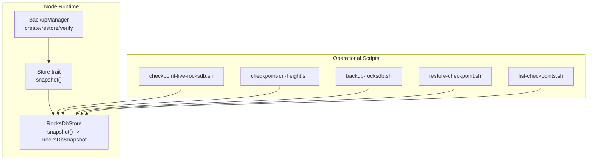
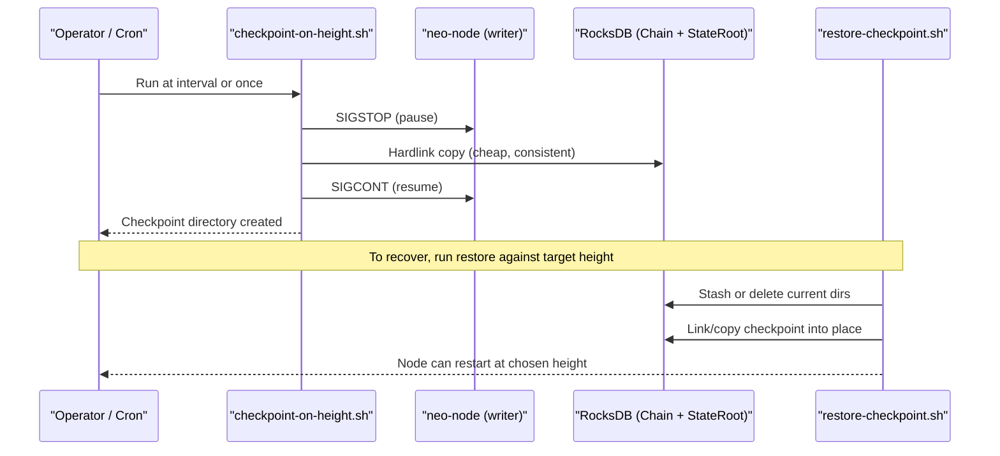
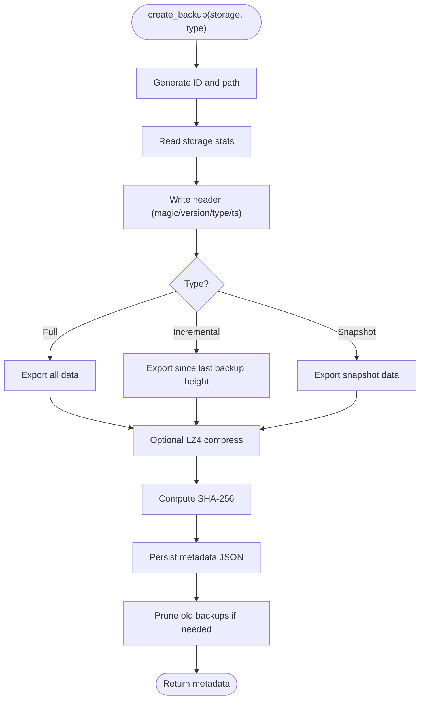
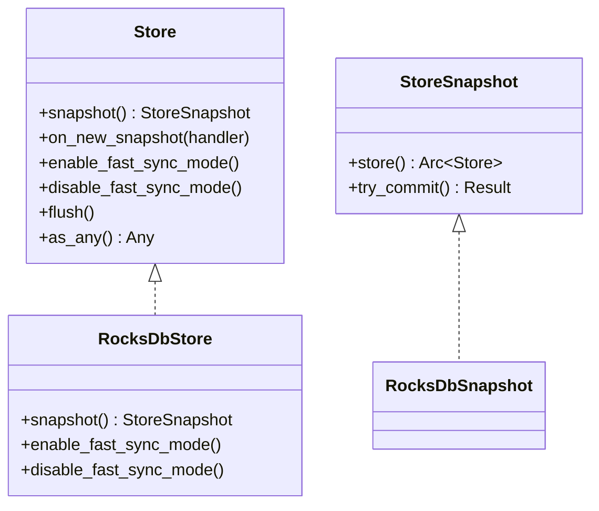
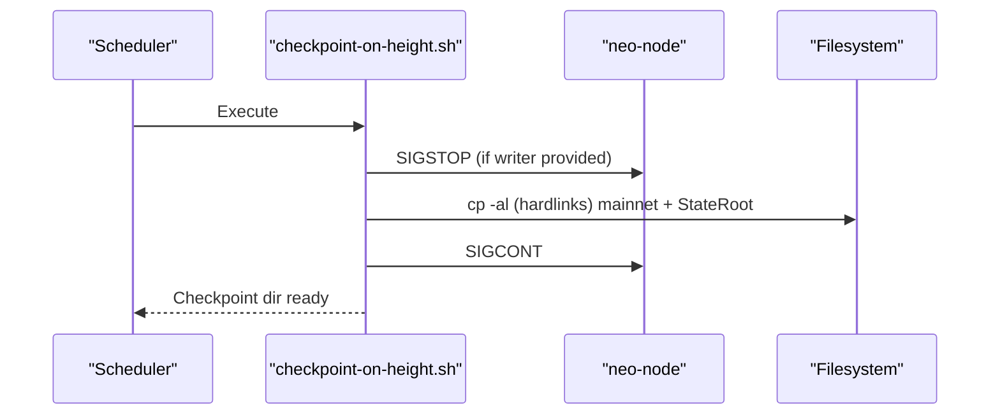
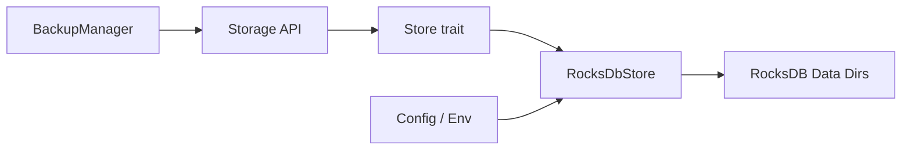

# Backup & Recovery

<cite>
**Referenced Files in This Document**
- [backup.rs](file://neo-core/src/persistence/backup.rs)
- [store.rs](file://neo-storage/src/persistence/store.rs)
- [store_snapshot.rs](file://neo-storage/src/persistence/store_snapshot.rs)
- [rocksdb_store.rs](file://neo-core/src/persistence/providers/rocksdb/store.rs)
- [config.rs](file://neo-node/src/startup/config.rs)
- [mainnet.toml](file://config/mainnet.toml)
- [backup-rocksdb.sh](file://scripts/backup-rocksdb.sh)
- [checkpoint-live-rocksdb.sh](file://scripts/checkpoint-live-rocksdb.sh)
- [checkpoint-on-height.sh](file://scripts/checkpoint-on-height.sh)
- [restore-checkpoint.sh](file://scripts/restore-checkpoint.sh)
- [list-checkpoints.sh](file://scripts/list-checkpoints.sh)
</cite>

## Table of Contents
1. [Introduction](#introduction)
2. [Project Structure](#project-structure)
3. [Core Components](#core-components)
4. [Architecture Overview](#architecture-overview)
5. [Detailed Component Analysis](#detailed-component-analysis)
6. [Dependency Analysis](#dependency-analysis)
7. [Performance Considerations](#performance-considerations)
8. [Troubleshooting Guide](#troubleshooting-guide)
9. [Conclusion](#conclusion)
10. [Appendices](#appendices)

## Introduction
This document provides operational guidance for backing up and recovering Neo-RS blockchain data. It covers snapshot-based backups that do not disrupt node operation, backup formats and compression, restore procedures including point-in-time recovery and incremental updates, disaster recovery planning, automated scheduling, checkpoint mechanisms for fast synchronization and validation, verification and integrity checks, migration strategies for database upgrades and format changes, rotation and retention policies, storage optimization, and security considerations for encryption and access control.

## Project Structure
Neo-RS exposes two complementary backup and recovery paths:
- In-process backup via the BackupManager API (full, incremental, snapshot), with metadata, checksums, and optional LZ4 compression.
- Out-of-process RocksDB snapshots using helper scripts that create consistent checkpoints by briefly pausing the writer and hardlinking SST files for near-zero cost copies.

**Diagram sources**
- [backup.rs:109-164](file://neo-core/src/persistence/backup.rs#L109-L164)
- [store.rs:12-30](file://neo-storage/src/persistence/store.rs#L12-L30)
- [rocksdb_store.rs:284-312](file://neo-core/src/persistence/providers/rocksdb/store.rs#L284-L312)
- [backup-rocksdb.sh:1-29](file://scripts/backup-rocksdb.sh#L1-L29)
- [checkpoint-live-rocksdb.sh:1-78](file://scripts/checkpoint-live-rocksdb.sh#L1-L78)
- [checkpoint-on-height.sh:1-222](file://scripts/checkpoint-on-height.sh#L1-L222)
- [restore-checkpoint.sh:1-162](file://scripts/restore-checkpoint.sh#L1-L162)
- [list-checkpoints.sh:1-47](file://scripts/list-checkpoints.sh#L1-L47)

**Section sources**
- [backup.rs:16-87](file://neo-core/src/persistence/backup.rs#L16-L87)
- [store.rs:12-30](file://neo-storage/src/persistence/store.rs#L12-L30)
- [rocksdb_store.rs:284-312](file://neo-core/src/persistence/providers/rocksdb/store.rs#L284-L312)
- [backup-rocksdb.sh:1-29](file://scripts/backup-rocksdb.sh#L1-L29)
- [checkpoint-live-rocksdb.sh:1-78](file://scripts/checkpoint-live-rocksdb.sh#L1-L78)
- [checkpoint-on-height.sh:1-222](file://scripts/checkpoint-on-height.sh#L1-L222)
- [restore-checkpoint.sh:1-162](file://scripts/restore-checkpoint.sh#L1-L162)
- [list-checkpoints.sh:1-47](file://scripts/list-checkpoints.sh#L1-L47)

## Core Components
- BackupManager: Produces full, incremental, and snapshot backups; writes a headered .neo file with optional LZ4 compression; computes SHA-256 checksums; persists JSON metadata; enforces retention; supports restore with integrity verification.
- Store trait and StoreSnapshot: Provide snapshot creation and event hooks; RocksDbStore implements snapshot() returning a RocksDbSnapshot suitable for consistent reads and batched writes.
- Operational scripts: Create live checkpoints by pausing the writer process, hardlinking SST files, and recording metadata; restore from checkpoints with safety checks; list and manage checkpoints.

Key capabilities:
- Consistent snapshots without stopping the node (brief pause + hardlinks).
- Point-in-time recovery to specific heights or latest available.
- Incremental backups based on last completed backup height.
- Integrity verification via checksums and restored-data checks.
- Retention management and pruning of old backups/checkpoints.

**Section sources**
- [backup.rs:109-164](file://neo-core/src/persistence/backup.rs#L109-L164)
- [backup.rs:167-201](file://neo-core/src/persistence/backup.rs#L167-L201)
- [backup.rs:253-278](file://neo-core/src/persistence/backup.rs#L253-L278)
- [store.rs:12-30](file://neo-storage/src/persistence/store.rs#L12-L30)
- [store_snapshot.rs:8-31](file://neo-storage/src/persistence/store_snapshot.rs#L8-L31)
- [rocksdb_store.rs:284-312](file://neo-core/src/persistence/providers/rocksdb/store.rs#L284-L312)

## Architecture Overview
The system combines an in-process backup API with out-of-process snapshotting tools. The Store abstraction decouples backup logic from the underlying RocksDB implementation. Scripts coordinate safe pauses and hardlink-based copies to produce consistent snapshots while minimizing downtime.

**Diagram sources**
- [checkpoint-on-height.sh:117-160](file://scripts/checkpoint-on-height.sh#L117-L160)
- [restore-checkpoint.sh:124-162](file://scripts/restore-checkpoint.sh#L124-L162)

**Section sources**
- [checkpoint-on-height.sh:1-222](file://scripts/checkpoint-on-height.sh#L1-L222)
- [restore-checkpoint.sh:1-162](file://scripts/restore-checkpoint.sh#L1-L162)

## Detailed Component Analysis

### BackupManager (In-process Backups)
Responsibilities:
- Generate unique IDs and filenames per backup type.
- Export data via Storage APIs (full/incremental/snapshot).
- Optional LZ4 compression around exported payloads.
- Compute SHA-256 checksums and persist JSON metadata alongside .neo files.
- Enforce retention by deleting oldest backups beyond configured maximum.
- Restore with pre-flight checks, data import, and post-restore verification.

Backup types:
- Full: Exports all storage data.
- Incremental: Exports changes since last completed backup height.
- Snapshot: Exports current state snapshot.

Compression:
- LZ4 when enabled; otherwise raw bytes.

Integrity:
- Header magic/version/type validation.
- File-level SHA-256 checksum stored in metadata and verified on restore/verify.

Retention:
- Configurable max_backups; cleanup runs after successful backup.

**Diagram sources**
- [backup.rs:109-164](file://neo-core/src/persistence/backup.rs#L109-L164)
- [backup.rs:305-364](file://neo-core/src/persistence/backup.rs#L305-L364)
- [backup.rs:395-445](file://neo-core/src/persistence/backup.rs#L395-L445)
- [backup.rs:447-483](file://neo-core/src/persistence/backup.rs#L447-L483)
- [backup.rs:485-558](file://neo-core/src/persistence/backup.rs#L485-L558)

**Section sources**
- [backup.rs:16-87](file://neo-core/src/persistence/backup.rs#L16-L87)
- [backup.rs:109-164](file://neo-core/src/persistence/backup.rs#L109-L164)
- [backup.rs:167-201](file://neo-core/src/persistence/backup.rs#L167-L201)
- [backup.rs:203-251](file://neo-core/src/persistence/backup.rs#L203-L251)
- [backup.rs:253-278](file://neo-core/src/persistence/backup.rs#L253-L278)
- [backup.rs:305-364](file://neo-core/src/persistence/backup.rs#L305-L364)
- [backup.rs:395-445](file://neo-core/src/persistence/backup.rs#L395-L445)
- [backup.rs:447-483](file://neo-core/src/persistence/backup.rs#L447-L483)
- [backup.rs:485-558](file://neo-core/src/persistence/backup.rs#L485-L558)

### Store and RocksDB Snapshots
- Store::snapshot() returns a read-only view plus a write-capable snapshot interface for batched operations.
- RocksDbStore implements snapshot(), creating a RocksDbSnapshot backed by the same immutable SST files.
- Fast-sync mode toggles are exposed on Store for optimized sync paths.

**Diagram sources**
- [store.rs:12-30](file://neo-storage/src/persistence/store.rs#L12-L30)
- [store_snapshot.rs:8-31](file://neo-storage/src/persistence/store_snapshot.rs#L8-L31)
- [rocksdb_store.rs:284-312](file://neo-core/src/persistence/providers/rocksdb/store.rs#L284-L312)

**Section sources**
- [store.rs:12-30](file://neo-storage/src/persistence/store.rs#L12-L30)
- [store_snapshot.rs:8-31](file://neo-storage/src/persistence/store_snapshot.rs#L8-L31)
- [rocksdb_store.rs:284-312](file://neo-core/src/persistence/providers/rocksdb/store.rs#L284-L312)

### Live Checkpoint Scripts
- checkpoint-live-rocksdb.sh: Pauses the writer process, copies the RocksDB directory, then resumes it. Suitable for ad-hoc consistent snapshots.
- checkpoint-on-height.sh: Periodically polls block height via RPC and creates hardlink-based checkpoints at multiples of a configurable interval. Supports --once mode and retention pruning.
- restore-checkpoint.sh: Selects a checkpoint by exact height, latest, or “at-or-below N”. Safely stashes or deletes current data directories and restores from the selected checkpoint. Refuses to run if a writer is active or locks are held.
- list-checkpoints.sh: Lists available checkpoints with completion status and sizes.

**Diagram sources**
- [checkpoint-live-rocksdb.sh:58-78](file://scripts/checkpoint-live-rocksdb.sh#L58-L78)
- [checkpoint-on-height.sh:117-160](file://scripts/checkpoint-on-height.sh#L117-L160)

**Section sources**
- [checkpoint-live-rocksdb.sh:1-78](file://scripts/checkpoint-live-rocksdb.sh#L1-L78)
- [checkpoint-on-height.sh:1-222](file://scripts/checkpoint-on-height.sh#L1-L222)
- [restore-checkpoint.sh:1-162](file://scripts/restore-checkpoint.sh#L1-L162)
- [list-checkpoints.sh:1-47](file://scripts/list-checkpoints.sh#L1-L47)

### RocksDB Offline Backup Helper
- backup-rocksdb.sh: Creates a compressed tarball of the RocksDB directory. Useful for offline archival or when in-process backup is not desired.

Usage pattern:
- Stop the node or ensure no writers are active.
- Run the script pointing at the data directory.
- Archive the resulting tar.gz to long-term storage.

**Section sources**
- [backup-rocksdb.sh:1-29](file://scripts/backup-rocksdb.sh#L1-L29)

## Dependency Analysis
- BackupManager depends on Storage export/import methods and uses LZ4 for optional compression. It also relies on SHA-256 hashing for integrity.
- Store abstraction decouples backup logic from RocksDB specifics; RocksDbStore implements snapshot() which underpins both in-process and script-driven workflows.
- Configuration influences storage backend and data paths; environment variables tune RocksDB batch profiles for durability vs throughput trade-offs.

**Diagram sources**
- [backup.rs:109-164](file://neo-core/src/persistence/backup.rs#L109-L164)
- [store.rs:12-30](file://neo-storage/src/persistence/store.rs#L12-L30)
- [rocksdb_store.rs:284-312](file://neo-core/src/persistence/providers/rocksdb/store.rs#L284-L312)
- [config.rs:44-83](file://neo-node/src/startup/config.rs#L44-L83)
- [mainnet.toml:7-10](file://config/mainnet.toml#L7-L10)

**Section sources**
- [config.rs:44-83](file://neo-node/src/startup/config.rs#L44-L83)
- [mainnet.toml:7-10](file://config/mainnet.toml#L7-L10)

## Performance Considerations
- Prefer hardlink-based checkpoints (checkpoint-on-height.sh) for minimal I/O overhead and near-zero time windows during writer pause.
- Use RocksDB batch profiles tuned for your workload:
  - Balanced/durable for production consistency.
  - High-throughput profile reduces crash durability at the cost of potential data loss on power failure.
- Enable LZ4 compression in BackupManager only when CPU is available and network transfer size matters; otherwise prefer uncompressed for faster local restores.
- Keep checkpoint root on the same filesystem as data directories to leverage hardlinks efficiently.

[No sources needed since this section provides general guidance]

## Troubleshooting Guide
Common issues and resolutions:
- Checkpoint incomplete: Ensure CHECKPOINT_IN_PROGRESS marker is removed; verify both Chain and StateRoot directories exist in the checkpoint.
- Restore blocked by locks: Confirm no neo-node processes hold LOCK files; stop the node before restoring.
- Integrity check failed: Verify backup checksum matches metadata; re-download or re-create the backup if mismatch occurs.
- Cross-filesystem hardlinks fail: Move checkpoint root to the same filesystem as data directories or accept slower full copies.
- RPC unreachable during periodic checkpointing: Adjust retry behavior or use --once with explicit height override.

**Section sources**
- [restore-checkpoint.sh:56-122](file://scripts/restore-checkpoint.sh#L56-L122)
- [checkpoint-on-height.sh:83-89](file://scripts/checkpoint-on-height.sh#L83-L89)
- [backup.rs:180-191](file://neo-core/src/persistence/backup.rs#L180-L191)

## Conclusion
Neo-RS provides robust backup and recovery through both in-process APIs and operational scripts. Use in-process backups for application-level full/incremental/snapshot workflows with built-in integrity and retention. Use script-based checkpoints for fast, consistent, point-in-time snapshots with minimal disruption. Combine these approaches with scheduled automation, retention policies, and verification routines to achieve resilient disaster recovery.

[No sources needed since this section summarizes without analyzing specific files]

## Appendices

### A. Snapshot Creation Procedures (Consistent, Non-Disruptive)
- Preferred method: checkpoint-on-height.sh
  - Runs periodically, pauses the writer briefly, hardlinks SST files, records metadata, and prunes old checkpoints.
  - Configure interval, retention, RPC endpoint, and data/checkpoint roots via arguments or environment variables.
- Ad-hoc method: checkpoint-live-rocksdb.sh
  - Pause the writer process, copy the RocksDB directory, resume the writer.
- Offline method: backup-rocksdb.sh
  - Requires node stopped; archives the RocksDB directory to a compressed tarball.

**Section sources**
- [checkpoint-on-height.sh:1-222](file://scripts/checkpoint-on-height.sh#L1-L222)
- [checkpoint-live-rocksdb.sh:1-78](file://scripts/checkpoint-live-rocksdb.sh#L1-L78)
- [backup-rocksdb.sh:1-29](file://scripts/backup-rocksdb.sh#L1-L29)

### B. Backup Formats, Compression, and Storage Locations
- In-process backups:
  - Format: Custom header (.neo) followed by optional LZ4-compressed payload; metadata stored as adjacent JSON.
  - Compression: LZ4 when enabled; otherwise raw.
  - Location: Configurable output_path; default ./backups.
- Script-based checkpoints:
  - Format: Directory structure with mainnet and StateRoot subdirectories; metadata files record timestamps and context.
  - Compression: None (hardlinks); archive externally if needed.
  - Location: Configurable checkpoint root; default <data-dir>/checkpoints.

**Section sources**
- [backup.rs:42-64](file://neo-core/src/persistence/backup.rs#L42-L64)
- [backup.rs:395-445](file://neo-core/src/persistence/backup.rs#L395-L445)
- [backup.rs:447-466](file://neo-core/src/persistence/backup.rs#L447-L466)
- [checkpoint-on-height.sh:1-222](file://scripts/checkpoint-on-height.sh#L1-L222)

### C. Restore Procedures (Point-in-Time and Incremental)
- Point-in-time recovery:
  - Use restore-checkpoint.sh with exact height, latest, or --at-or-below N.
  - Safety checks prevent running while a writer is active or locks are held.
- Incremental updates:
  - After restoring to a base checkpoint, start the node to replay blocks from the chain’s genesis to catch up to current state.
  - Alternatively, use in-process incremental backups to apply deltas between known good states.

**Section sources**
- [restore-checkpoint.sh:1-162](file://scripts/restore-checkpoint.sh#L1-L162)
- [backup.rs:334-359](file://neo-core/src/persistence/backup.rs#L334-L359)

### D. Disaster Recovery Planning and Automated Scheduling
- Strategy:
  - Maintain regular checkpoints every N blocks (e.g., 50k) with retention of K most recent.
  - Offload archived checkpoints to secure, geographically distributed storage.
  - Test restores regularly to validate RTO/RPO targets.
- Automation:
  - Schedule checkpoint-on-height.sh via cron/systemd timers.
  - Integrate backup verification steps post-schedule.
  - Alert on failures and missing checkpoints.

[No sources needed since this section provides general guidance]

### E. Checkpoint Mechanisms for Fast Sync and Validation
- Hardlink-based snapshots minimize I/O and allow rapid restoration.
- Use Store::enable_fast_sync_mode() to optimize sync performance when appropriate.
- Validate restored nodes by comparing state roots and block hashes against trusted references.

**Section sources**
- [store.rs:19-23](file://neo-storage/src/persistence/store.rs#L19-L23)
- [checkpoint-on-height.sh:1-222](file://scripts/checkpoint-on-height.sh#L1-L222)

### F. Backup Verification and Integrity Checking
- In-process:
  - Verify checksums stored in metadata; compare file size and hash.
  - Post-restore verification ensures restored height meets expectations.
- Script-based:
  - Ensure CHECKPOINT_INFO exists and CHECKPOINT_IN_PROGRESS is absent.
  - Validate presence of both Chain and StateRoot directories.

**Section sources**
- [backup.rs:253-278](file://neo-core/src/persistence/backup.rs#L253-L278)
- [backup.rs:507-522](file://neo-core/src/persistence/backup.rs#L507-L522)
- [restore-checkpoint.sh:99-105](file://scripts/restore-checkpoint.sh#L99-L105)

### G. Migration Strategies (Database Upgrades and Format Changes)
- Pre-upgrade:
  - Take a final checkpoint and/or in-process backup.
  - Record version and configuration details.
- During upgrade:
  - Stop the node, replace binaries, and validate compatibility.
- Post-upgrade:
  - Restore from checkpoint if necessary.
  - Re-run validation against trusted state roots.

[No sources needed since this section provides general guidance]

### H. Rotation, Retention, and Storage Optimization
- Retention:
  - BackupManager enforces max_backups; prune old entries automatically.
  - checkpoint-on-height.sh prunes older checkpoints beyond max.
- Optimization:
  - Use hardlinks for checkpoints to save disk space.
  - Compress offloaded archives for long-term storage.
  - Monitor disk usage and adjust intervals/retention accordingly.

**Section sources**
- [backup.rs:524-558](file://neo-core/src/persistence/backup.rs#L524-L558)
- [checkpoint-on-height.sh:162-173](file://scripts/checkpoint-on-height.sh#L162-L173)

### I. Security Considerations (Encryption and Access Control)
- Encryption:
  - Encrypt backups at rest using external tooling (e.g., LUKS, cloud KMS).
  - For sensitive keys/secrets, consider TEE/HSM sealing where applicable.
- Access control:
  - Restrict filesystem permissions on backup and checkpoint directories.
  - Limit RPC exposure and authenticate clients if enabling RPC endpoints.
- Auditability:
  - Log backup/restore events and outcomes.
  - Maintain immutable audit trails for critical operations.

**Section sources**
- [mainnet.toml:26-34](file://config/mainnet.toml#L26-L34)
- [config.rs:44-83](file://neo-node/src/startup/config.rs#L44-L83)