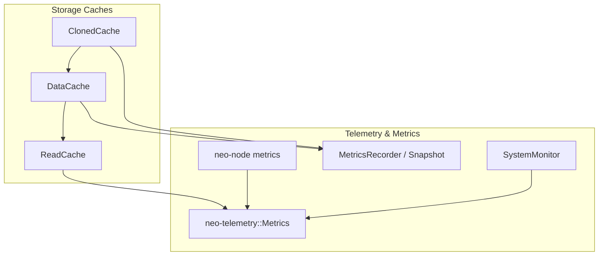
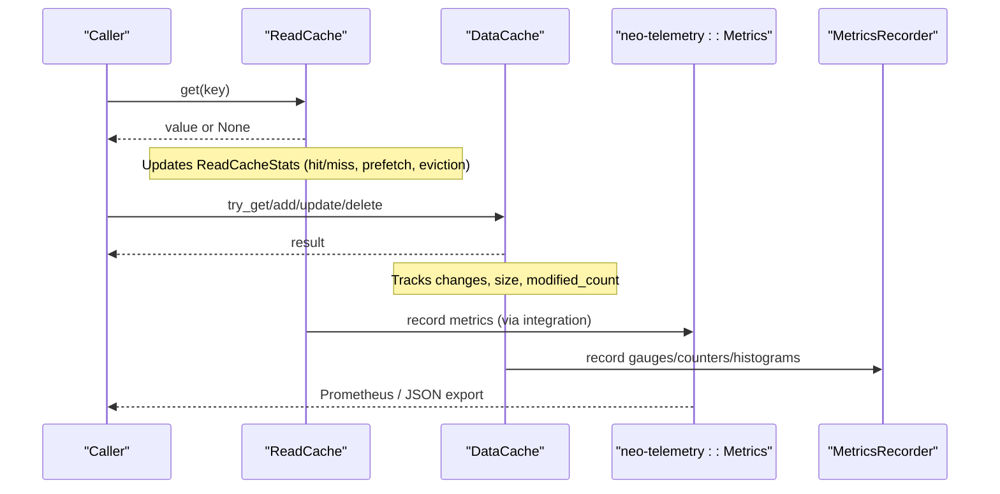
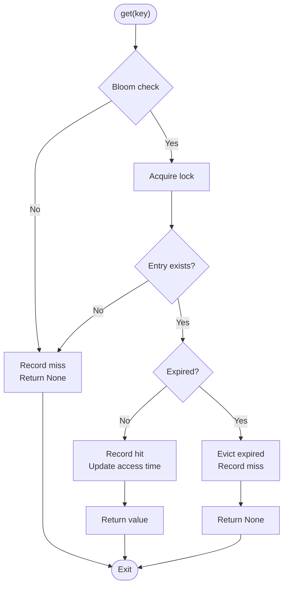
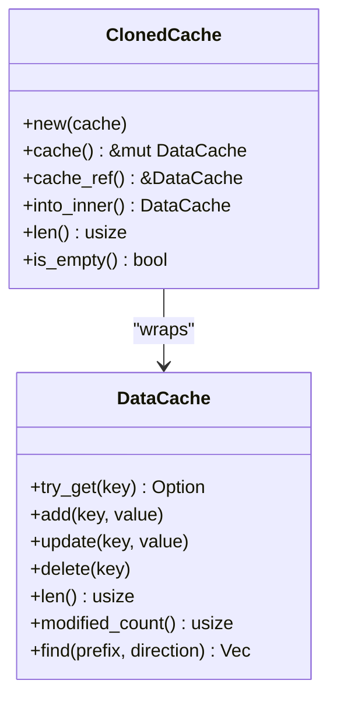
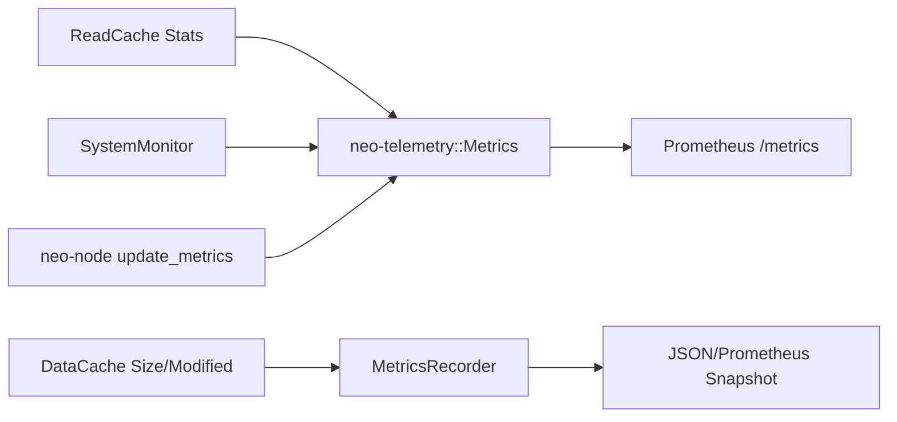
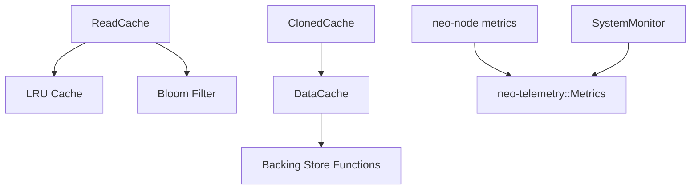

# Cache Monitoring and Metrics

<cite>
**Referenced Files in This Document**
- [data_cache.rs](file://neo-storage/src/cache/data_cache.rs)
- [cloned_cache.rs](file://neo-storage/src/cache/cloned_cache.rs)
- [read_cache.rs](file://neo-storage/src/persistence/read_cache.rs)
- [lru_cache.rs](file://neo-io/src/caching/lru_cache.rs)
- [metrics.rs](file://neo-telemetry/src/metrics.rs)
- [system.rs](file://neo-telemetry/src/system.rs)
- [recorder.rs](file://neo-core/src/telemetry/recorder.rs)
- [mod.rs](file://neo-core/src/monitoring/mod.rs)
- [node_metrics.rs](file://neo-node/src/metrics.rs)
- [METRICS.md](file://docs/METRICS.md)
</cite>

## Table of Contents
1. Introduction
2. Project Structure
3. Core Components
4. Architecture Overview
5. Detailed Component Analysis
6. Dependency Analysis
7. Performance Considerations
8. Troubleshooting Guide
9. Conclusion
10. Appendices

## Introduction
This document explains how to monitor and collect metrics for Neo-RS cache layers, focusing on hit rates, miss ratios, memory usage, and performance across DataCache, ClonedCache, and ReadCache. It covers telemetry integration points, metric definitions, aggregation strategies, export formats (Prometheus and JSON), debugging techniques, dashboard setup guidance, alerting rules, and interpretation of metrics to identify bottlenecks and optimize configurations for different deployment scenarios.

## Project Structure
Neo-RS organizes caching and monitoring across several modules:
- Storage caches: DataCache and ClonedCache provide write-side tracking and isolated clones; ReadCache provides an LRU read cache with prefetch and bloom filter optimizations.
- Telemetry and metrics: neo-telemetry exposes Prometheus metrics and system resource monitoring; neo-core provides a generic recorder and snapshot exporter; neo-node wires node-level metrics into the telemetry system.

**Diagram sources**
- [data_cache.rs:58-69](file://neo-storage/src/cache/data_cache.rs#L58-L69)
- [cloned_cache.rs:35-71](file://neo-storage/src/cache/cloned_cache.rs#L35-L71)
- [read_cache.rs:327-337](file://neo-storage/src/persistence/read_cache.rs#L327-L337)
- [metrics.rs:11-44](file://neo-telemetry/src/metrics.rs#L11-L44)
- [system.rs:34-98](file://neo-telemetry/src/system.rs#L34-L98)
- [recorder.rs:9-14](file://neo-core/src/telemetry/recorder.rs#L9-L14)
- [node_metrics.rs:13-15](file://neo-node/src/metrics.rs#L13-L15)

**Section sources**
- [data_cache.rs:58-69](file://neo-storage/src/cache/data_cache.rs#L58-L69)
- [cloned_cache.rs:35-71](file://neo-storage/src/cache/cloned_cache.rs#L35-L71)
- [read_cache.rs:327-337](file://neo-storage/src/persistence/read_cache.rs#L327-L337)
- [metrics.rs:11-44](file://neo-telemetry/src/metrics.rs#L11-L44)
- [system.rs:34-98](file://neo-telemetry/src/system.rs#L34-L98)
- [recorder.rs:9-14](file://neo-core/src/telemetry/recorder.rs#L9-L14)
- [node_metrics.rs:13-15](file://neo-node/src/metrics.rs#L13-L15)

## Core Components
- DataCache: In-memory write cache with change tracking, optional backing store delegation, and commit semantics. Useful for measuring modified counts and cache size.
- ClonedCache: Lightweight wrapper around DataCache providing copy-on-write isolation for speculative or transactional workloads.
- ReadCache: LRU-based read cache with TTL, prefetching, bloom filter negative lookups, and rich statistics (hits, misses, evictions, prefetch hits, current entries/bytes).
- Telemetry: Prometheus metrics registry and system monitors; core recorder/snapshot exporter supports Prometheus text and JSON outputs; node metrics integrate blockchain and storage metrics.

Key responsibilities:
- Track cache effectiveness via ReadCache stats (hit rate, miss ratio, prefetch efficiency).
- Observe memory usage via system metrics and cache size counters.
- Export metrics to Prometheus and JSON for dashboards and alerts.

**Section sources**
- [data_cache.rs:129-169](file://neo-storage/src/cache/data_cache.rs#L129-L169)
- [cloned_cache.rs:40-84](file://neo-storage/src/cache/cloned_cache.rs#L40-L84)
- [read_cache.rs:42-55](file://neo-storage/src/persistence/read_cache.rs#L42-L55)
- [metrics.rs:11-44](file://neo-telemetry/src/metrics.rs#L11-L44)
- [recorder.rs:58-89](file://neo-core/src/telemetry/recorder.rs#L58-L89)

## Architecture Overview
The monitoring architecture integrates cache internals with telemetry:
- ReadCache emits detailed stats (hits, misses, evictions, prefetches) that can be exported as Prometheus metrics or JSON snapshots.
- DataCache and ClonedCache expose size and modification metrics useful for capacity planning and workload analysis.
- Node-level metrics aggregate blockchain state, peers, timeouts, and disk usage, and are exposed via a health endpoint and Prometheus scrape.

**Diagram sources**
- [read_cache.rs:400-454](file://neo-storage/src/persistence/read_cache.rs#L400-L454)
- [data_cache.rs:129-169](file://neo-storage/src/cache/data_cache.rs#L129-L169)
- [metrics.rs:211-221](file://neo-telemetry/src/metrics.rs#L211-L221)
- [recorder.rs:58-89](file://neo-core/src/telemetry/recorder.rs#L58-L89)

## Detailed Component Analysis

### ReadCache: Hit Rate, Miss Ratio, Memory Usage, Prefetch
- Statistics: Atomic counters for hits, misses, evictions, prefetches, prefetch_hits, inserts, current_entries, current_bytes, bloom filter checks/negatives.
- Derived metrics: hit_rate(), prefetch_hit_rate(), bloom_filter_effectiveness().
- Behavior: LRU eviction by entry count and byte budget; TTL support; prefetch triggers based on access thresholds; bloom filter fast-path negative lookups.

**Diagram sources**
- [read_cache.rs:400-454](file://neo-storage/src/persistence/read_cache.rs#L400-L454)
- [read_cache.rs:211-239](file://neo-storage/src/persistence/read_cache.rs#L211-L239)

**Section sources**
- [read_cache.rs:42-55](file://neo-storage/src/persistence/read_cache.rs#L42-L55)
- [read_cache.rs:211-239](file://neo-storage/src/persistence/read_cache.rs#L211-L239)
- [read_cache.rs:242-325](file://neo-storage/src/persistence/read_cache.rs#L242-L325)
- [read_cache.rs:400-454](file://neo-storage/src/persistence/read_cache.rs#L400-L454)

### DataCache and ClonedCache: Change Tracking and Isolation
- DataCache tracks added/changed/deleted items, supports backing store delegation, and exposes len, is_empty, modified_count, tracked_items, find.
- ClonedCache wraps DataCache to provide isolated modifications without affecting the original, enabling safe speculative execution.

**Diagram sources**
- [data_cache.rs:58-69](file://neo-storage/src/cache/data_cache.rs#L58-L69)
- [data_cache.rs:129-169](file://neo-storage/src/cache/data_cache.rs#L129-L169)
- [cloned_cache.rs:35-71](file://neo-storage/src/cache/cloned_cache.rs#L35-L71)

**Section sources**
- [data_cache.rs:129-169](file://neo-storage/src/cache/data_cache.rs#L129-L169)
- [cloned_cache.rs:40-84](file://neo-storage/src/cache/cloned_cache.rs#L40-L84)

### Telemetry Integration Points
- neo-telemetry::Metrics: Defines Prometheus metrics for blockchain, network, consensus, system, and RPC; provides gather() for Prometheus text format.
- SystemMonitor: Collects CPU/memory/disk uptime and process memory; useful for correlating cache pressure with system resources.
- MetricsRecorder/Snapshot: Generic recorder with Prometheus text and JSON export; used by tests and integrations to validate exports.
- neo-node metrics: Wires node-level updates (block height, peers, mempool, timeouts, state roots, disk usage) into both internal telemetry and Prometheus.

**Diagram sources**
- [metrics.rs:11-44](file://neo-telemetry/src/metrics.rs#L11-L44)
- [metrics.rs:211-221](file://neo-telemetry/src/metrics.rs#L211-L221)
- [system.rs:34-98](file://neo-telemetry/src/system.rs#L34-L98)
- [recorder.rs:58-89](file://neo-core/src/telemetry/recorder.rs#L58-L89)
- [node_metrics.rs:26-101](file://neo-node/src/metrics.rs#L26-L101)

**Section sources**
- [metrics.rs:11-44](file://neo-telemetry/src/metrics.rs#L11-L44)
- [metrics.rs:211-221](file://neo-telemetry/src/metrics.rs#L211-L221)
- [system.rs:34-98](file://neo-telemetry/src/system.rs#L34-L98)
- [recorder.rs:58-89](file://neo-core/src/telemetry/recorder.rs#L58-L89)
- [node_metrics.rs:26-101](file://neo-node/src/metrics.rs#L26-L101)

## Dependency Analysis
- ReadCache depends on LRU structures and atomic stats; it optionally uses a bloom filter for negative lookups.
- DataCache may delegate reads/writes to a backing store function; ClonedCache depends on DataCache.
- Telemetry components are decoupled from cache implementations but receive updates via integration points at node startup and periodic tasks.

**Diagram sources**
- [read_cache.rs:327-337](file://neo-storage/src/persistence/read_cache.rs#L327-L337)
- [data_cache.rs:32-38](file://neo-storage/src/cache/data_cache.rs#L32-L38)
- [cloned_cache.rs:35-71](file://neo-storage/src/cache/cloned_cache.rs#L35-L71)
- [metrics.rs:11-44](file://neo-telemetry/src/metrics.rs#L11-L44)
- [system.rs:34-98](file://neo-telemetry/src/system.rs#L34-L98)

**Section sources**
- [read_cache.rs:327-337](file://neo-storage/src/persistence/read_cache.rs#L327-L337)
- [data_cache.rs:32-38](file://neo-storage/src/cache/data_cache.rs#L32-L38)
- [cloned_cache.rs:35-71](file://neo-storage/src/cache/cloned_cache.rs#L35-L71)
- [metrics.rs:11-44](file://neo-telemetry/src/metrics.rs#L11-L44)
- [system.rs:34-98](file://neo-telemetry/src/system.rs#L34-L98)

## Performance Considerations
- Tune ReadCacheConfig:
  - Increase max_entries/max_bytes for high-throughput nodes to reduce evictions and improve hit rate.
  - Enable prefetch for sequential scans; adjust prefetch_threshold and prefetch_count based on workload patterns.
  - Use TTL to bound memory for volatile datasets.
  - Enable bloom filter to avoid unnecessary lock contention on absent keys.
- Monitor memory and CPU via SystemMonitor; correlate spikes with cache evictions and prefetch activity.
- Use DataCache modified_count and len to assess write amplification and cache churn.
- Prefer batched operations (e.g., put_batch) to reduce lock overhead during prefetch.

[No sources needed since this section provides general guidance]

## Troubleshooting Guide
Common issues and diagnostics:
- Low hit rate:
  - Inspect ReadCacheStatsSnapshot.hit_rate(); if low, consider increasing capacity or adjusting TTL/prefetch.
  - Check bloom_filter_effectiveness; very low indicates misconfigured FPR or capacity.
- High eviction rate:
  - Review current_bytes vs max_bytes; increase limits or reduce item sizes.
  - Analyze prefetch behavior; excessive prefetch may cause thrashing under tight memory constraints.
- Memory pressure:
  - Correlate SystemMonitor.memory_usage_percent and process_memory with cache sizes.
  - Reduce prefetch_count or disable prefetch temporarily.
- Export validation:
  - Use MetricsRecorder snapshot to verify Prometheus text and JSON outputs.
  - Confirm node metrics include expected labels and values.

**Section sources**
- [read_cache.rs:211-239](file://neo-storage/src/persistence/read_cache.rs#L211-L239)
- [read_cache.rs:242-325](file://neo-storage/src/persistence/read_cache.rs#L242-L325)
- [system.rs:54-98](file://neo-telemetry/src/system.rs#L54-L98)
- [recorder.rs:130-168](file://neo-core/src/telemetry/recorder.rs#L130-L168)

## Conclusion
Neo-RS provides robust cache monitoring through ReadCache statistics, DataCache/ClonedCache introspection, and comprehensive telemetry exports. By tuning ReadCache configuration, observing system resources, and leveraging Prometheus/JSON exports, operators can build effective dashboards and alerts to maintain optimal cache performance across diverse deployments.

[No sources needed since this section summarizes without analyzing specific files]

## Appendices

### Metric Definitions and Aggregation Strategies
- ReadCache metrics (from stats):
  - hits, misses, evictions, prefetches, prefetch_hits, inserts, current_entries, current_bytes, bloom_filter_checks, bloom_filter_negatives.
  - Derived: hit_rate = hits/(hits+misses); prefetch_hit_rate = prefetch_hits/prefetches; bloom_filter_effectiveness = negatives/checks.
- System metrics:
  - total_memory, used_memory, available_memory, memory_usage_percent, cpu_usage_percent, process_memory, uptime_secs.
- Node metrics (Prometheus):
  - Blockchain, network, consensus, RPC, storage, and timeout metrics as defined in neo-telemetry and updated via node metrics.

Aggregation:
- Use Prometheus histograms for latency-sensitive paths (e.g., RPC request duration).
- Aggregate counters per second using PromQL queries for rate calculations.
- Combine cache stats with system metrics to detect correlation between memory pressure and cache performance.

**Section sources**
- [read_cache.rs:211-239](file://neo-storage/src/persistence/read_cache.rs#L211-L239)
- [system.rs:54-98](file://neo-telemetry/src/system.rs#L54-L98)
- [metrics.rs:11-44](file://neo-telemetry/src/metrics.rs#L11-L44)
- [node_metrics.rs:26-101](file://neo-node/src/metrics.rs#L26-L101)

### Export Formats and Endpoints
- Prometheus text format via neo-telemetry gather() and MetricsRecorder snapshot.to_prometheus_text().
- JSON format via MetricsRecorder snapshot.to_json().
- Health endpoints and metrics exposure documented in docs/METRICS.md.

**Section sources**
- [metrics.rs:211-221](file://neo-telemetry/src/metrics.rs#L211-L221)
- [recorder.rs:130-168](file://neo-core/src/telemetry/recorder.rs#L130-L168)
- [METRICS.md:1-64](file://docs/METRICS.md#L1-L64)

### Dashboard and Alerting Examples
- Dashboards:
  - Cache hit rate over time (ReadCache hit_rate).
  - Eviction rate and current bytes vs max bytes.
  - Prefetch effectiveness (prefetch_hit_rate).
  - System memory/CPU utilization alongside cache metrics.
- Alerts:
  - Hit rate below threshold for sustained period.
  - Eviction rate spike indicating capacity pressure.
  - Memory usage percent exceeding safety margin.
  - Prefetch hit rate near zero suggesting misconfiguration.

[No sources needed since this section provides general guidance]

### Interpreting Metrics and Optimization Tips
- If hit_rate is low and evictions are high: increase max_entries/max_bytes or reduce item sizes.
- If prefetch_hit_rate is low: lower prefetch_count or raise prefetch_threshold.
- If bloom_filter_effectiveness is low: tune FPR and capacity.
- If memory_usage_percent rises with cache growth: consider TTL or reducing prefetch aggressiveness.

[No sources needed since this section provides general guidance]