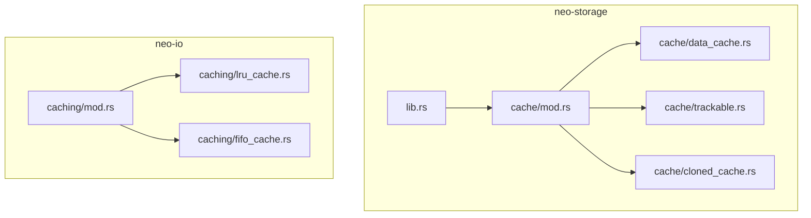
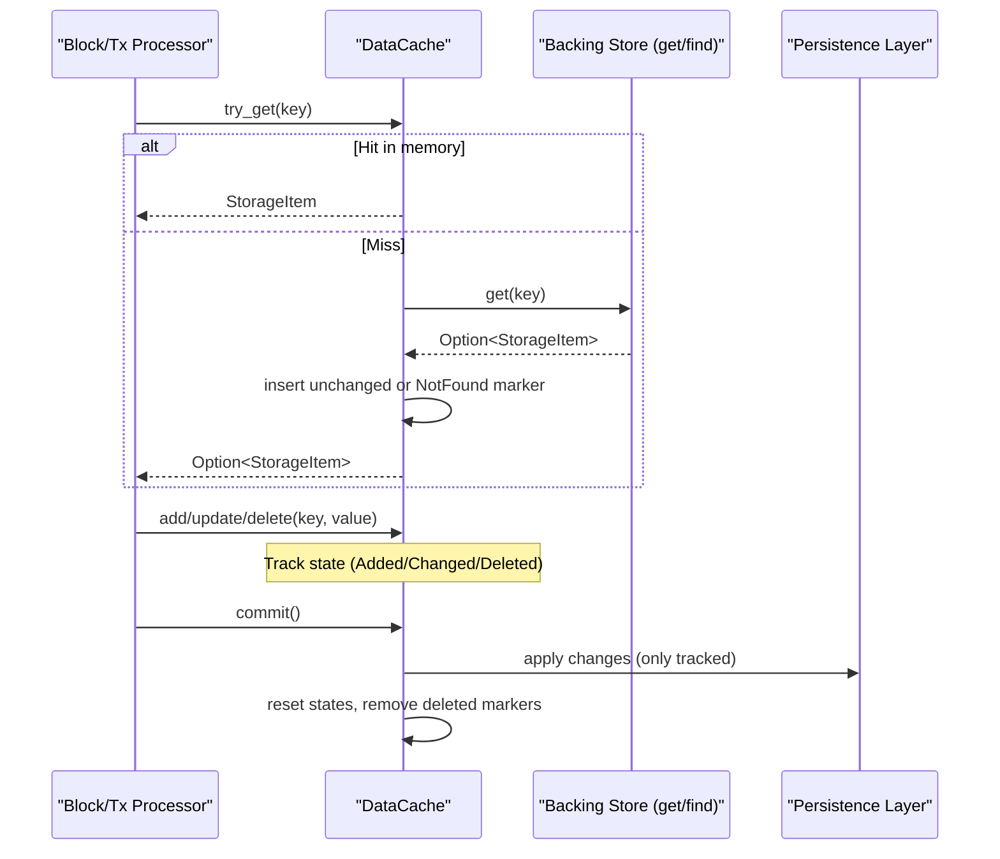
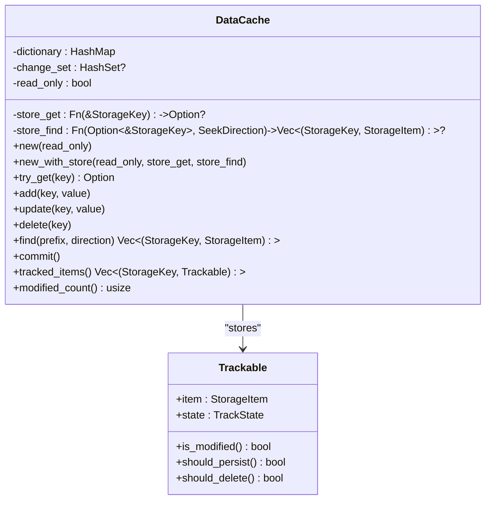
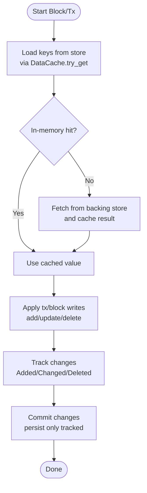
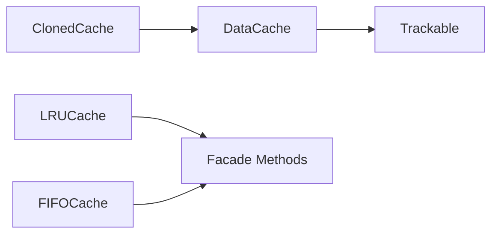

# Caching Strategies

<cite>
**Referenced Files in This Document**
- [mod.rs](file://neo-storage/src/cache/mod.rs)
- [data_cache.rs](file://neo-storage/src/cache/data_cache.rs)
- [trackable.rs](file://neo-storage/src/cache/trackable.rs)
- [cloned_cache.rs](file://neo-storage/src/cache/cloned_cache.rs)
- [lib.rs](file://neo-storage/src/lib.rs)
- [mod.rs](file://neo-io/src/caching/mod.rs)
- [lru_cache.rs](file://neo-io/src/caching/lru_cache.rs)
- [fifo_cache.rs](file://neo-io/src/caching/fifo_cache.rs)
</cite>

## Table of Contents
1. [Introduction](#introduction)
2. [Project Structure](#project-structure)
3. [Core Components](#core-components)
4. [Architecture Overview](#architecture-overview)
5. [Detailed Component Analysis](#detailed-component-analysis)
6. [Dependency Analysis](#dependency-analysis)
7. [Performance Considerations](#performance-considerations)
8. [Troubleshooting Guide](#troubleshooting-guide)
9. [Conclusion](#conclusion)
10. [Appendices](#appendices)

## Introduction
This document explains the multi-layered caching strategy used by Neo-RS to optimize storage operations during block processing and transaction execution. It covers:
- Data cache with change tracking for efficient batch commits
- Read cache abstractions and eviction policies (LRU, FIFO)
- Cloned cache for isolated, copy-on-write state snapshots
- Trackable cache system that records added/changed/deleted entries
- Interaction with underlying storage providers via optional get/find functions
- Synchronization and consistency guarantees
- Monitoring metrics and debugging techniques
- Best practices for configuring caches across validators, full nodes, and archive nodes

## Project Structure
Neo-RS separates storage concerns into two main areas:
- neo-storage: Core storage types, traits, and in-memory cache with tracking (DataCache, Trackable, ClonedCache)
- neo-io: General-purpose caching primitives (LRU, FIFO) and shared facade utilities used by various subsystems

**Diagram sources**
- [mod.rs:1-36](file://neo-storage/src/cache/mod.rs#L1-L36)
- [lib.rs:43-58](file://neo-storage/src/lib.rs#L43-L58)
- [mod.rs:1-129](file://neo-io/src/caching/mod.rs#L1-L129)
- [lru_cache.rs:1-69](file://neo-io/src/caching/lru_cache.rs#L1-L69)
- [fifo_cache.rs:1-39](file://neo-io/src/caching/fifo_cache.rs#L1-L39)

**Section sources**
- [mod.rs:1-36](file://neo-storage/src/cache/mod.rs#L1-L36)
- [lib.rs:1-71](file://neo-storage/src/lib.rs#L1-L71)
- [mod.rs:1-129](file://neo-io/src/caching/mod.rs#L1-L129)

## Core Components
- DataCache: In-memory dictionary with change tracking, optional backing store delegation, read-only mode, and concurrent access via RwLock. Supports add/update/delete, find with prefix matching, commit/reset, and modified item enumeration.
- Trackable/TrackState: Per-entry state machine (None, Added, Changed, Deleted, NotFound) enabling precise persistence decisions and efficient commit.
- ClonedCache: Lightweight wrapper providing a writable clone of an existing DataCache for isolated speculative execution or transaction verification.
- LRU/FIFO caches: Eviction strategies for general-purpose caching needs within the node (e.g., cryptographic objects, relay payloads).

Key responsibilities:
- Minimize disk reads by caching frequently accessed items
- Track changes to enable batched, targeted persistence
- Provide snapshot isolation through cloning
- Offer configurable eviction policies where applicable

**Section sources**
- [data_cache.rs:39-121](file://neo-storage/src/cache/data_cache.rs#L39-L121)
- [trackable.rs:8-76](file://neo-storage/src/cache/trackable.rs#L8-L76)
- [cloned_cache.rs:7-84](file://neo-storage/src/cache/cloned_cache.rs#L7-L84)
- [lru_cache.rs:7-52](file://neo-io/src/caching/lru_cache.rs#L7-L52)
- [fifo_cache.rs:6-29](file://neo-io/src/caching/fifo_cache.rs#L6-L29)

## Architecture Overview
The caching architecture layers are designed to reduce I/O and provide consistent views during block processing and transaction execution.

**Diagram sources**
- [data_cache.rs:129-159](file://neo-storage/src/cache/data_cache.rs#L129-L159)
- [data_cache.rs:172-261](file://neo-storage/src/cache/data_cache.rs#L172-L261)
- [data_cache.rs:274-300](file://neo-storage/src/cache/data_cache.rs#L274-L300)

## Detailed Component Analysis

### DataCache: Change Tracking and Backing Store Delegation
- Read path: Checks in-memory dictionary first; on miss, delegates to optional store_get function and caches result (including NotFound markers to avoid repeated misses).
- Write path: Maintains per-entry TrackState; updates change_set when present to optimize commit scope.
- Find path: Merges backing store results with cached overlay, honoring deletions and prefix filters; sorts by direction.
- Commit: Removes deleted/not-found entries, resets states to None, clears change_set.

Concurrency and safety:
- Dictionary protected by RwLock for concurrent reads and exclusive writes
- Optional change_set also protected by RwLock

Complexity highlights:
- O(1) average for get/add/update/delete
- O(k log k) for find due to sorting, where k is number of merged results

Error handling:
- Read-only mode rejects mutations
- KeyNotFound returned by get when missing

**Section sources**
- [data_cache.rs:39-121](file://neo-storage/src/cache/data_cache.rs#L39-L121)
- [data_cache.rs:129-170](file://neo-storage/src/cache/data_cache.rs#L129-L170)
- [data_cache.rs:172-261](file://neo-storage/src/cache/data_cache.rs#L172-L261)
- [data_cache.rs:263-300](file://neo-storage/src/cache/data_cache.rs#L263-L300)
- [data_cache.rs:332-375](file://neo-storage/src/cache/data_cache.rs#L332-L375)

#### DataCache Class Diagram

**Diagram sources**
- [data_cache.rs:39-121](file://neo-storage/src/cache/data_cache.rs#L39-L121)
- [trackable.rs:8-76](file://neo-storage/src/cache/trackable.rs#L8-L76)

### Trackable and TrackState: State Machine for Persistence Decisions
- States: None (unchanged), Added, Changed, Deleted, NotFound
- Helpers: is_modified, should_persist, should_delete
- Used by DataCache to decide what to write or remove on commit

**Section sources**
- [trackable.rs:8-76](file://neo-storage/src/cache/trackable.rs#L8-L76)

### ClonedCache: Copy-on-Write Isolation
- Creates a deep clone of DataCache for isolated modifications
- Useful for transaction verification, speculative execution, and read-only queries with temporary changes
- Consumers can extract inner DataCache to persist if desired

**Section sources**
- [cloned_cache.rs:7-84](file://neo-storage/src/cache/cloned_cache.rs#L7-L84)

### LRU and FIFO Caches: Eviction Policies
- LRUCache: Evicts least recently used entries when capacity exceeded; supports key selector and thread-safe access
- FIFOCache: Simple first-in-first-out eviction policy; wraps a generic Cache implementation
- Both expose common facade methods (count, clear, contains, remove, values, max_capacity)

Use cases:
- Cryptographic object caches (e.g., EC points, signatures)
- Relay message caches
- Any bounded in-memory cache with predictable eviction behavior

**Section sources**
- [lru_cache.rs:7-52](file://neo-io/src/caching/lru_cache.rs#L7-L52)
- [fifo_cache.rs:6-29](file://neo-io/src/caching/fifo_cache.rs#L6-L29)
- [mod.rs:31-118](file://neo-io/src/caching/mod.rs#L31-L118)

### Block Processing and Transaction Execution Flow

**Diagram sources**
- [data_cache.rs:129-159](file://neo-storage/src/cache/data_cache.rs#L129-L159)
- [data_cache.rs:172-261](file://neo-storage/src/cache/data_cache.rs#L172-L261)
- [data_cache.rs:274-300](file://neo-storage/src/cache/data_cache.rs#L274-L300)

## Dependency Analysis
- DataCache depends on Trackable for state tracking and optional backing store functions for read-through behavior
- ClonedCache depends on DataCache’s Clone implementation to create isolated copies
- LRU/FIFO caches depend on shared facade macros and internal entry structures for eviction and concurrency

**Diagram sources**
- [data_cache.rs:39-121](file://neo-storage/src/cache/data_cache.rs#L39-L121)
- [trackable.rs:8-76](file://neo-storage/src/cache/trackable.rs#L8-L76)
- [cloned_cache.rs:7-84](file://neo-storage/src/cache/cloned_cache.rs#L7-L84)
- [mod.rs:31-118](file://neo-io/src/caching/mod.rs#L31-L118)
- [lru_cache.rs:7-52](file://neo-io/src/caching/lru_cache.rs#L7-L52)
- [fifo_cache.rs:6-29](file://neo-io/src/caching/fifo_cache.rs#L6-L29)

**Section sources**
- [data_cache.rs:39-121](file://neo-storage/src/cache/data_cache.rs#L39-L121)
- [cloned_cache.rs:7-84](file://neo-storage/src/cache/cloned_cache.rs#L7-L84)
- [mod.rs:31-118](file://neo-io/src/caching/mod.rs#L31-L118)

## Performance Considerations
- Read path optimization:
  - On miss, fetch once from backing store and cache both present and absent results to prevent thundering herds
  - Use prefix-aware find to minimize unnecessary scans
- Write path optimization:
  - Maintain change_set to limit commit scope to only modified keys
  - Batch persisted writes using tracked_items to reduce I/O calls
- Memory management:
  - For LRU/FIFO caches, tune max_capacity based on available RAM and workload patterns
  - Avoid unbounded growth in DataCache by committing regularly and clearing when appropriate
- Concurrency:
  - RwLock usage ensures high read throughput with controlled write contention
- Eviction policies:
  - Prefer LRU for hot-path data (e.g., cryptographic objects)
  - Use FIFO for simple, ordered caches where recency is less important

[No sources needed since this section provides general guidance]

## Troubleshooting Guide
Common issues and diagnostics:
- Read-only errors:
  - Occur when attempting to modify a read-only DataCache; ensure correct cache mode for the operation
- Key not found:
  - get returns an error when a key is missing; use try_get to handle absence gracefully
- Stale reads:
  - Ensure you call commit after applying changes to reset states and remove deleted markers
- Excessive misses:
  - Verify backing store functions are wired correctly and that cache is not being cleared too aggressively
- Memory pressure:
  - Monitor cache sizes and adjust eviction parameters for LRU/FIFO caches
  - Periodically inspect modified_count and len to detect leaks or unexpected growth

Debugging tips:
- Use Debug implementations to inspect cache sizes and modification counts
- Log tracked_items before commit to understand what will be persisted
- Validate find results against expected prefixes and directions

**Section sources**
- [data_cache.rs:14-30](file://neo-storage/src/cache/data_cache.rs#L14-L30)
- [data_cache.rs:161-170](file://neo-storage/src/cache/data_cache.rs#L161-L170)
- [data_cache.rs:274-300](file://neo-storage/src/cache/data_cache.rs#L274-L300)
- [data_cache.rs:378-390](file://neo-storage/src/cache/data_cache.rs#L378-L390)

## Conclusion
Neo-RS employs a layered caching strategy centered around a trackable in-memory DataCache, complemented by eviction-based caches (LRU/FIFO) for specific workloads. The design minimizes disk I/O, enables efficient batched persistence, and supports isolated state snapshots for transaction verification. Proper configuration of eviction policies, commit cadence, and backing store integration yields significant performance gains across validators, full nodes, and archive nodes.

[No sources needed since this section summarizes without analyzing specific files]

## Appendices

### Configuration Recommendations by Deployment Scenario
- Validators:
  - Keep DataCache committed frequently to maintain low latency for consensus-critical reads/writes
  - Use moderate-sized LRU caches for cryptographic objects to balance CPU and memory
- Full Nodes:
  - Tune LRU capacities to fit working set of active contracts/accounts
  - Ensure find operations leverage prefix filtering to reduce scan overhead
- Archive Nodes:
  - Favor larger caches and more aggressive read-through to historical data
  - Consider FIFO for long-lived, sequential access patterns

[No sources needed since this section provides general guidance]