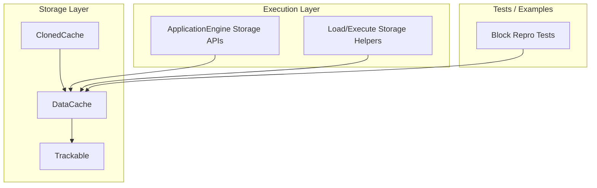
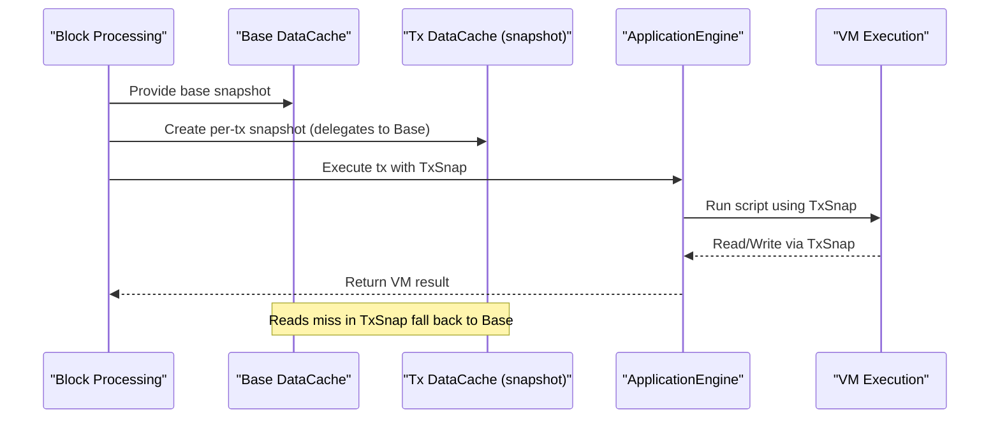
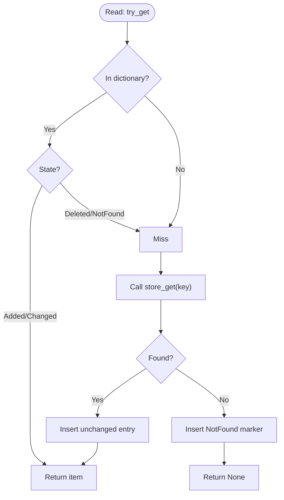
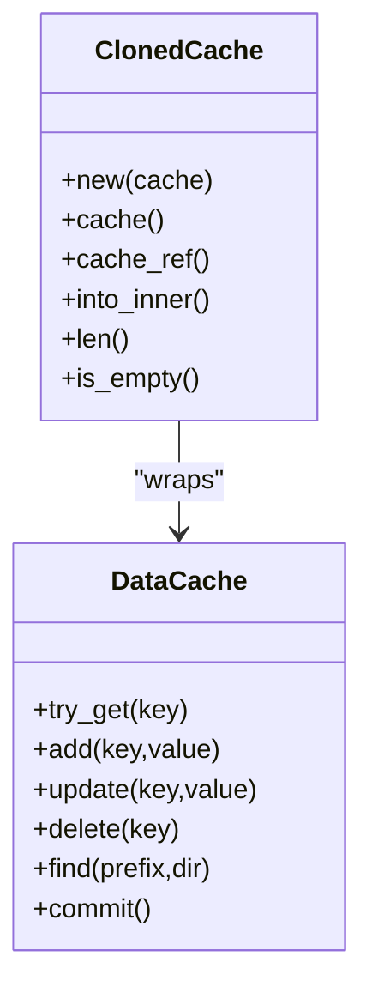
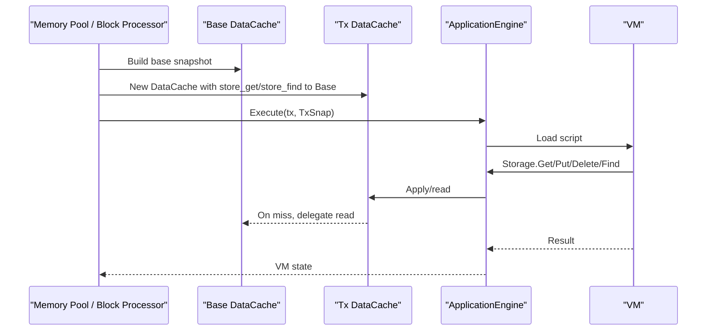
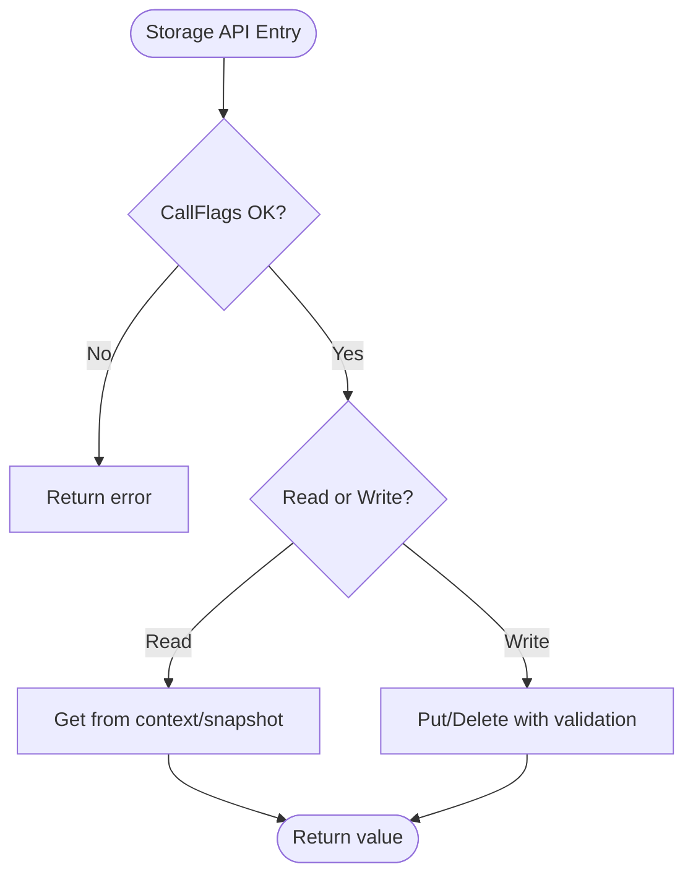
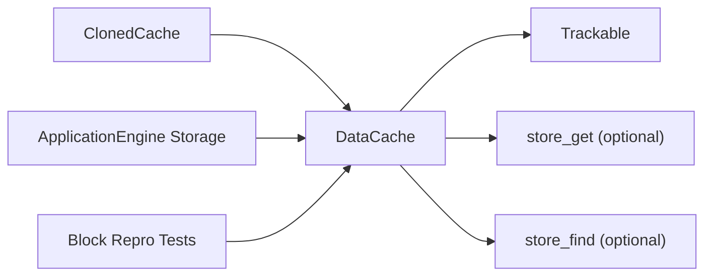

# Cloned Cache Strategy

<cite>
**Referenced Files in This Document**
- [cloned_cache.rs](file://neo-storage/src/cache/cloned_cache.rs)
- [data_cache.rs](file://neo-storage/src/cache/data_cache.rs)
- [trackable.rs](file://neo-storage/src/cache/trackable.rs)
- [mod.rs (cache)](file://neo-storage/src/cache/mod.rs)
- [storage.rs (ApplicationEngine)](file://neo-core/src/smart_contract/application_engine/storage.rs)
- [load_execute_storage.rs](file://neo-core/src/smart_contract/application_engine/load_execute_storage.rs)
- [state.rs (ApplicationEngine state)](file://neo-core/src/smart_contract/application_engine/state.rs)
- [mainnet_block_1208916_repro.rs](file://neo-core/tests/mainnet_block_1208916_repro.rs)
- [mainnet_block_1268131_repro.rs](file://neo-core/tests/mainnet_block_1268131_repro.rs)
- [mainnet_block_1283521_repro.rs](file://neo-core/tests/mainnet_block_1283521_repro.rs)
</cite>

## Table of Contents
1. Introduction
2. Project Structure
3. Core Components
4. Architecture Overview
5. Detailed Component Analysis
6. Dependency Analysis
7. Performance Considerations
8. Troubleshooting Guide
9. Conclusion
10. Appendices

## Introduction
This document explains the ClonedCache strategy used in Neo-RS to create isolated cache views for consistent reads during block processing and transaction execution. It covers how cloning provides snapshot semantics, the underlying cloning mechanism that creates independent cache instances while sharing data where possible, and practical use cases such as transaction verification isolation, contract call contexts, and query consistency. It also discusses performance implications, memory usage considerations, and garbage collection behavior for cloned caches.

## Project Structure
The ClonedCache strategy is implemented in the storage layer and consumed by higher-level components like the ApplicationEngine and tests that simulate transaction execution with isolated snapshots.

**Diagram sources**
- [cloned_cache.rs:1-84](file://neo-storage/src/cache/cloned_cache.rs#L1-L84)
- [data_cache.rs:39-84](file://neo-storage/src/cache/data_cache.rs#L39-L84)
- [trackable.rs:8-22](file://neo-storage/src/cache/trackable.rs#L8-L22)
- [storage.rs (ApplicationEngine):12-151](file://neo-core/src/smart_contract/application_engine/storage.rs#L12-L151)
- [load_execute_storage.rs:199-232](file://neo-core/src/smart_contract/application_engine/load_execute_storage.rs#L199-L232)
- [mainnet_block_1208916_repro.rs:192-232](file://neo-core/tests/mainnet_block_1208916_repro.rs#L192-L232)
- [mainnet_block_1268131_repro.rs:184-224](file://neo-core/tests/mainnet_block_1268131_repro.rs#L184-L224)
- [mainnet_block_1283521_repro.rs:219-259](file://neo-core/tests/mainnet_block_1283521_repro.rs#L219-L259)

**Section sources**
- [cloned_cache.rs:1-84](file://neo-storage/src/cache/cloned_cache.rs#L1-L84)
- [data_cache.rs:39-84](file://neo-storage/src/cache/data_cache.rs#L39-L84)
- [mod.rs (cache):1-36](file://neo-storage/src/cache/mod.rs#L1-L36)

## Core Components
- DataCache: In-memory cache with change tracking, optional backing store delegation, read-only mode, and concurrent access via RwLock. Supports add/update/delete/find/commit and exposes tracked items for batch commits.
- Trackable: Entry wrapper that records whether an item is unchanged, added, changed, deleted, or not found, enabling efficient commit and diff operations.
- ClonedCache: Lightweight wrapper around DataCache that provides a writable clone with isolated modifications. The original remains untouched; changes are local to the clone until explicitly committed by consumers.

Key behaviors:
- Snapshot semantics: A clone starts from the current state of the source cache and isolates subsequent writes to itself.
- Isolation guarantees: Reads on the clone see its own modifications; writes do not affect the original.
- Backing store delegation: DataCache can delegate reads to a backing store function when entries are missing, which is commonly used to build per-transaction snapshots over a base snapshot.

**Section sources**
- [data_cache.rs:39-376](file://neo-storage/src/cache/data_cache.rs#L39-L376)
- [trackable.rs:8-76](file://neo-storage/src/cache/trackable.rs#L8-L76)
- [cloned_cache.rs:1-84](file://neo-storage/src/cache/cloned_cache.rs#L1-L84)

## Architecture Overview
The cloning strategy enables consistent reads across multiple transactions within a block by providing each transaction with an isolated view of state. Higher layers construct a base snapshot and then either:
- Create a new DataCache per transaction that delegates reads to the base snapshot (commonly seen in tests), or
- Use ClonedCache to wrap an existing DataCache and isolate modifications.

**Diagram sources**
- [mainnet_block_1208916_repro.rs:192-232](file://neo-core/tests/mainnet_block_1208916_repro.rs#L192-L232)
- [mainnet_block_1268131_repro.rs:184-224](file://neo-core/tests/mainnet_block_1268131_repro.rs#L184-L224)
- [mainnet_block_1283521_repro.rs:219-259](file://neo-core/tests/mainnet_block_1283521_repro.rs#L219-L259)
- [data_cache.rs:129-159](file://neo-storage/src/cache/data_cache.rs#L129-L159)

## Detailed Component Analysis

### DataCache: Change Tracking and Backing Store Delegation
- Read path: try_get checks the in-memory dictionary first; on miss, it calls the optional store_get function and caches the result.
- Write path: add/update/delete mark entries with TrackState and update the change_set when present.
- Commit: removes deleted/not-found entries and resets states to None for persisted items.
- Find: merges backing store results with in-memory overlay, honoring delete markers and prefix filtering.

**Diagram sources**
- [data_cache.rs:129-159](file://neo-storage/src/cache/data_cache.rs#L129-L159)
- [data_cache.rs:172-252](file://neo-storage/src/cache/data_cache.rs#L172-L252)
- [data_cache.rs:263-300](file://neo-storage/src/cache/data_cache.rs#L263-L300)
- [data_cache.rs:332-376](file://neo-storage/src/cache/data_cache.rs#L332-L376)

**Section sources**
- [data_cache.rs:39-376](file://neo-storage/src/cache/data_cache.rs#L39-L376)
- [trackable.rs:8-76](file://neo-storage/src/cache/trackable.rs#L8-L76)

### ClonedCache: Isolated Views
- Construction: wraps an existing DataCache by cloning it, inheriting all entries at creation time.
- Isolation: modifications go to the inner DataCache clone; the original remains unchanged.
- Accessors: mutable and immutable borrows of the inner cache; conversion to inner cache for ownership transfer.

**Diagram sources**
- [cloned_cache.rs:1-84](file://neo-storage/src/cache/cloned_cache.rs#L1-L84)
- [data_cache.rs:39-376](file://neo-storage/src/cache/data_cache.rs#L39-L376)

**Section sources**
- [cloned_cache.rs:1-84](file://neo-storage/src/cache/cloned_cache.rs#L1-L84)

### Transaction Execution Isolation Patterns
- Per-transaction snapshots: Tests demonstrate creating a new DataCache per transaction that delegates reads to a shared base snapshot. This ensures each transaction sees a consistent view of state without interfering with others.
- Contract call contexts: ApplicationEngine storage APIs operate against the engine’s snapshot cache, enforcing read/write flags and context scoping.
- Query consistency: find operations merge backing store and in-memory overlays, ensuring deletes and updates are visible consistently within a snapshot.

**Diagram sources**
- [mainnet_block_1208916_repro.rs:192-232](file://neo-core/tests/mainnet_block_1208916_repro.rs#L192-L232)
- [mainnet_block_1268131_repro.rs:184-224](file://neo-core/tests/mainnet_block_1268131_repro.rs#L184-L224)
- [mainnet_block_1283521_repro.rs:219-259](file://neo-core/tests/mainnet_block_1283521_repro.rs#L219-L259)
- [storage.rs (ApplicationEngine):12-151](file://neo-core/src/smart_contract/application_engine/storage.rs#L12-L151)

**Section sources**
- [mainnet_block_1208916_repro.rs:192-232](file://neo-core/tests/mainnet_block_1208916_repro.rs#L192-L232)
- [mainnet_block_1268131_repro.rs:184-224](file://neo-core/tests/mainnet_block_1268131_repro.rs#L184-L224)
- [mainnet_block_1283521_repro.rs:219-259](file://neo-core/tests/mainnet_block_1283521_repro.rs#L219-L259)
- [storage.rs (ApplicationEngine):12-151](file://neo-core/src/smart_contract/application_engine/storage.rs#L12-L151)

### Contract Call Contexts and Read/Write Enforcement
- Storage APIs enforce CallFlags to allow or deny reads/writes based on context.
- Read-only contexts prevent accidental mutations; write paths validate permissions before applying changes.
- Local storage helpers provide convenience methods tied to the current contract context.

**Diagram sources**
- [storage.rs (ApplicationEngine):12-151](file://neo-core/src/smart_contract/application_engine/storage.rs#L12-L151)

**Section sources**
- [storage.rs (ApplicationEngine):12-151](file://neo-core/src/smart_contract/application_engine/storage.rs#L12-L151)

## Dependency Analysis
- ClonedCache depends on DataCache and Trackable for isolation and change tracking.
- DataCache optionally depends on backing store functions for lazy loading and prefix scans.
- ApplicationEngine storage APIs depend on the snapshot cache provided by the execution context.
- Tests compose base snapshots and per-transaction snapshots to emulate realistic block processing.

**Diagram sources**
- [cloned_cache.rs:1-84](file://neo-storage/src/cache/cloned_cache.rs#L1-L84)
- [data_cache.rs:39-121](file://neo-storage/src/cache/data_cache.rs#L39-L121)
- [storage.rs (ApplicationEngine):12-151](file://neo-core/src/smart_contract/application_engine/storage.rs#L12-L151)
- [mainnet_block_1208916_repro.rs:192-232](file://neo-core/tests/mainnet_block_1208916_repro.rs#L192-L232)

**Section sources**
- [cloned_cache.rs:1-84](file://neo-storage/src/cache/cloned_cache.rs#L1-L84)
- [data_cache.rs:39-121](file://neo-storage/src/cache/data_cache.rs#L39-L121)
- [storage.rs (ApplicationEngine):12-151](file://neo-core/src/smart_contract/application_engine/storage.rs#L12-L151)
- [mainnet_block_1208916_repro.rs:192-232](file://neo-core/tests/mainnet_block_1208916_repro.rs#L192-L232)

## Performance Considerations
- Snapshot cost: Creating a per-transaction DataCache that delegates reads to a base snapshot avoids copying large datasets; misses are lazily loaded into the transaction cache.
- Write amplification: Each add/update/delete marks entries and updates the change set; frequent small writes increase tracking overhead. Batch operations and minimizing churn help.
- Find overhead: Prefix scans merge backing store results with in-memory overlay and sort results; prefer targeted keys or smaller prefixes where possible.
- Cloning vs shared: Use ClonedCache when you need a quick isolated view of an existing cache for short-lived speculative work. For long-running or highly concurrent scenarios, consider per-transaction snapshots with backing store delegation to avoid duplicating large dictionaries.

[No sources needed since this section provides general guidance]

## Troubleshooting Guide
Common issues and diagnostics:
- Unexpected reads: If a key appears missing in a clone but exists in the original, verify whether the clone has marked it deleted or not found.
- Stale reads: Ensure the snapshot was created before expected writes if you require a consistent point-in-time view.
- Read-only errors: Storage APIs enforce CallFlags; ensure the context allows the requested operation.
- Memory growth: Large numbers of pending changes or deep backing store delegations can increase memory usage. Monitor modified_count and tracked_items to understand workload characteristics.

Relevant code paths:
- Error types and read-only enforcement in DataCache.
- Storage API flag checks and context handling in ApplicationEngine.

**Section sources**
- [data_cache.rs:13-30](file://neo-storage/src/cache/data_cache.rs#L13-L30)
- [storage.rs (ApplicationEngine):12-151](file://neo-core/src/smart_contract/application_engine/storage.rs#L12-L151)

## Conclusion
ClonedCache provides a simple and effective way to obtain isolated, writable views over existing caches, enabling snapshot semantics for consistent reads during block processing and transaction execution. Combined with DataCache’s change tracking and optional backing store delegation, it supports both lightweight cloning and robust per-transaction isolation patterns. Proper use of snapshots and careful management of writes and finds can deliver strong consistency with predictable performance and memory characteristics.

[No sources needed since this section summarizes without analyzing specific files]

## Appendices

### Example: Using ClonedCache for Speculative Execution
- Create a base cache with initial state.
- Wrap it with ClonedCache to perform speculative writes.
- Validate outcomes without affecting the original.
- Optionally extract the inner DataCache to commit changes.

**Section sources**
- [cloned_cache.rs:1-84](file://neo-storage/src/cache/cloned_cache.rs#L1-L84)

### Example: Per-Transaction Snapshots in Block Processing
- Build a base snapshot once per block.
- For each transaction, create a new DataCache that delegates reads to the base snapshot.
- Execute the transaction in the ApplicationEngine with this snapshot.
- Collect tracked changes after successful execution.

**Section sources**
- [mainnet_block_1208916_repro.rs:192-232](file://neo-core/tests/mainnet_block_1208916_repro.rs#L192-L232)
- [mainnet_block_1268131_repro.rs:184-224](file://neo-core/tests/mainnet_block_1268131_repro.rs#L184-L224)
- [mainnet_block_1283521_repro.rs:219-259](file://neo-core/tests/mainnet_block_1283521_repro.rs#L219-L259)

### Memory Usage and Garbage Collection Behavior
- DataCache uses Arc<RwLock<HashMap>> for the dictionary and an optional Arc<RwLock<HashSet>> for the change set. Cloning copies these Arc handles and creates new locks for the clone’s dictionary and change set.
- When a clone goes out of scope, its Arc references are dropped, allowing the underlying HashMap and HashSet to be reclaimed if no other references remain.
- Backing store functions are typically wrapped in Arc and shared across snapshots; they persist only as long as the snapshot holds them.

**Section sources**
- [data_cache.rs:39-84](file://neo-storage/src/cache/data_cache.rs#L39-L84)
- [cloned_cache.rs:1-84](file://neo-storage/src/cache/cloned_cache.rs#L1-L84)