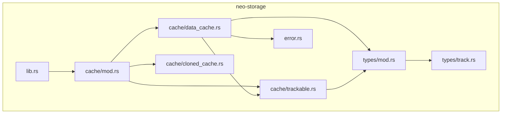
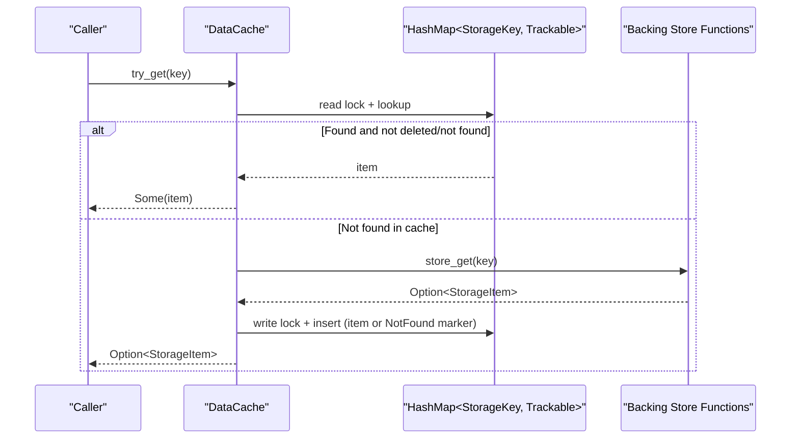
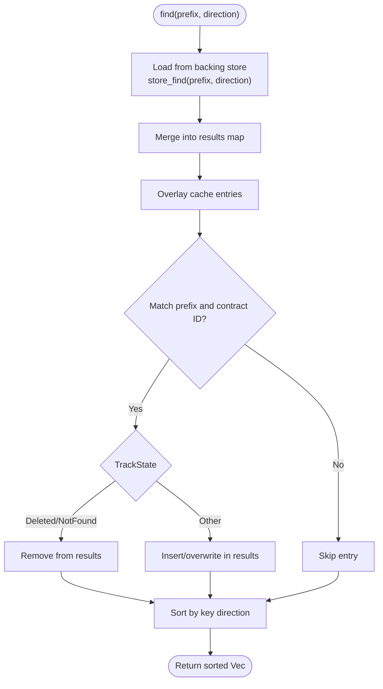
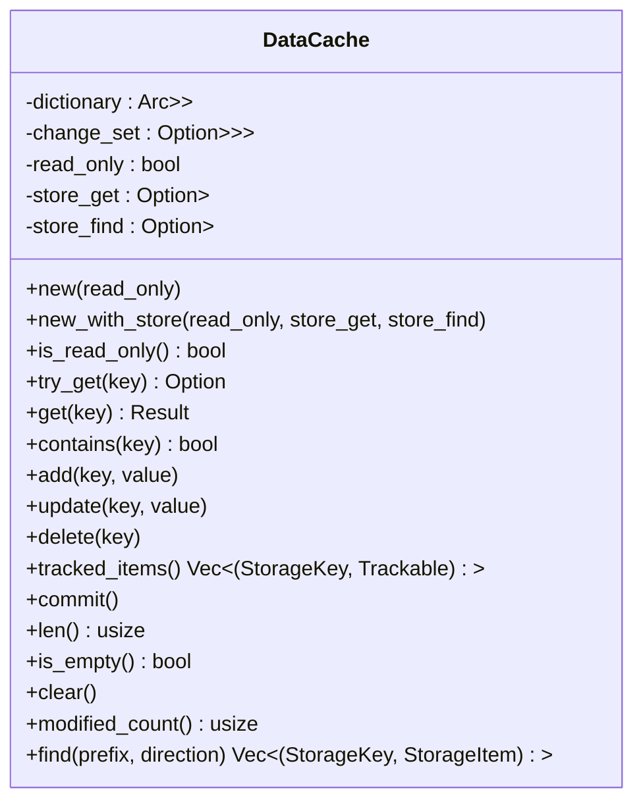
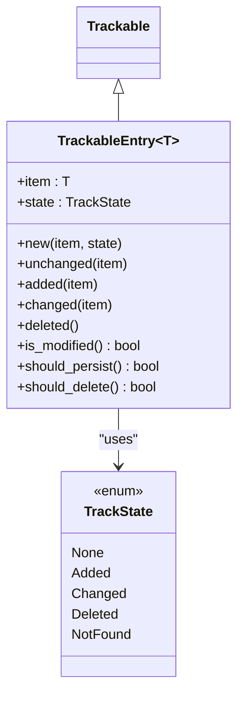
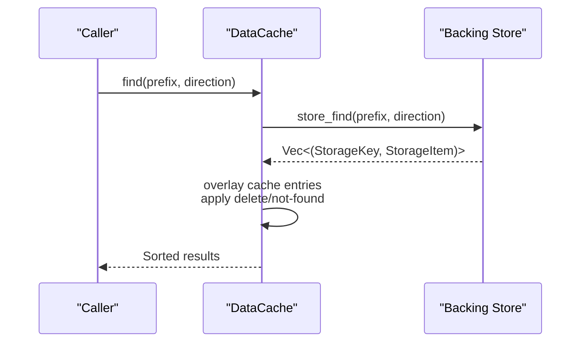
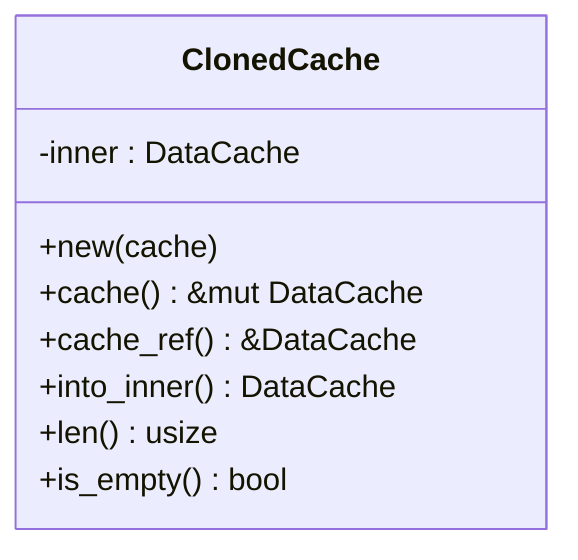
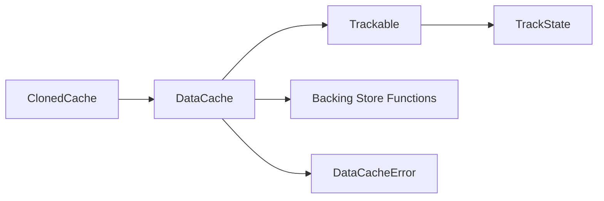

# Data Cache Implementation

<cite>
**Referenced Files in This Document**
- [lib.rs](file://neo-storage/src/lib.rs)
- [mod.rs](file://neo-storage/src/cache/mod.rs)
- [data_cache.rs](file://neo-storage/src/cache/data_cache.rs)
- [trackable.rs](file://neo-storage/src/cache/trackable.rs)
- [cloned_cache.rs](file://neo-storage/src/cache/cloned_cache.rs)
- [types_mod.rs](file://neo-storage/src/types/mod.rs)
- [track.rs](file://neo-storage/src/types/track.rs)
- [error.rs](file://neo-storage/src/error.rs)
</cite>

## Table of Contents
1. Introduction
2. Project Structure
3. Core Components
4. Architecture Overview
5. Detailed Component Analysis
6. Dependency Analysis
7. Performance Considerations
8. Troubleshooting Guide
9. Conclusion

## Introduction
This document explains the DataCache implementation in the Neo-RS storage layer. It focuses on the in-memory cache with change tracking for blockchain storage operations, the Trackable system that records state changes (Added, Changed, Deleted, NotFound), and the backing store delegation mechanism that allows caching to work with underlying storage providers. It also covers read-only mode support, concurrent access patterns using RwLock, lifecycle management, commit strategies, memory optimization techniques, error handling patterns, and debugging capabilities.

## Project Structure
The DataCache lives under the neo-storage crate’s cache module and is built around a few core types:
- DataCache: In-memory cache with optional backing store functions and change tracking.
- Trackable: A wrapper around StorageItem with a TrackState indicating whether it was Added, Changed, Deleted, or not found.
- ClonedCache: A lightweight copy-on-write wrapper over DataCache for isolated modifications.
- Types: StorageKey, StorageItem, SeekDirection, and TrackState define the data model and iteration semantics.

**Diagram sources**
- [lib.rs:43-58](file://neo-storage/src/lib.rs#L43-L58)
- [mod.rs:29-35](file://neo-storage/src/cache/mod.rs#L29-L35)
- [data_cache.rs:58-69](file://neo-storage/src/cache/data_cache.rs#L58-L69)
- [trackable.rs:12-21](file://neo-storage/src/cache/trackable.rs#L12-L21)
- [cloned_cache.rs:35-38](file://neo-storage/src/cache/cloned_cache.rs#L35-L38)
- [types_mod.rs:9-17](file://neo-storage/src/types/mod.rs#L9-L17)
- [track.rs:6-20](file://neo-storage/src/types/track.rs#L6-L20)
- [error.rs:5-50](file://neo-storage/src/error.rs#L5-L50)

**Section sources**
- [lib.rs:43-58](file://neo-storage/src/lib.rs#L43-L58)
- [mod.rs:29-35](file://neo-storage/src/cache/mod.rs#L29-L35)

## Core Components
- DataCache: Provides add/update/delete/get/find operations backed by an in-memory HashMap of Trackable entries, with an optional HashSet of changed keys for efficient commits. Supports read-only mode and optional backing store functions for get and find.
- TrackableEntry<StorageItem>: Holds the item and its TrackState; exposes helpers like is_modified, should_persist, should_delete.
- TrackState: Enumerates None, Added, Changed, Deleted, NotFound to represent entry lifecycle states.
- ClonedCache: Wraps a clone of DataCache to allow isolated, speculative modifications without affecting the original.

Performance characteristics:
- try_get: O(1) average for cache hit; if miss, delegates to backing store once and caches result (including NotFound markers).
- add/update/delete: O(1) average per operation; maintains a change set when writable.
- find: Merges backing store results with cached overlay, filters by prefix and contract ID, then sorts by key direction. Complexity depends on backing store result size plus cache scan.
- commit: O(N) where N is number of tracked entries; resets states and removes deleted/not-found entries.

Concurrency:
- All mutable state is protected by parking_lot::RwLock for fine-grained read/write concurrency.

**Section sources**
- [data_cache.rs:58-69](file://neo-storage/src/cache/data_cache.rs#L58-L69)
- [data_cache.rs:129-170](file://neo-storage/src/cache/data_cache.rs#L129-L170)
- [data_cache.rs:172-261](file://neo-storage/src/cache/data_cache.rs#L172-L261)
- [data_cache.rs:263-330](file://neo-storage/src/cache/data_cache.rs#L263-L330)
- [data_cache.rs:332-375](file://neo-storage/src/cache/data_cache.rs#L332-L375)
- [trackable.rs:23-76](file://neo-storage/src/cache/trackable.rs#L23-L76)
- [track.rs:6-20](file://neo-storage/src/types/track.rs#L6-L20)
- [cloned_cache.rs:35-84](file://neo-storage/src/cache/cloned_cache.rs#L35-L84)

## Architecture Overview
DataCache sits above a pluggable backing store via function pointers. Reads first check the in-memory dictionary; misses are fetched from the backing store and cached. Writes update the dictionary and optionally track changed keys. Commits reset tracking states and remove tombstones. Find merges backing store results with cached overlay, applying delete/not-found semantics and sorting by direction.

**Diagram sources**
- [data_cache.rs:129-159](file://neo-storage/src/cache/data_cache.rs#L129-L159)

**Diagram sources**
- [data_cache.rs:332-375](file://neo-storage/src/cache/data_cache.rs#L332-L375)

## Detailed Component Analysis

### DataCache
Responsibilities:
- Provide fast in-memory reads/writes with optional backing store delegation.
- Track changes to enable efficient batch commits.
- Support read-only mode and safe concurrent access.

Key methods and behavior:
- new/new_with_store: Construct cache with optional backing store functions and change set allocation only for writable caches.
- try_get/get/contains: Read path with cache-first strategy and NotFound caching to avoid repeated misses.
- add/update/delete: Write path with single HashMap entry() usage to minimize lookups; maintain change_set for optimized commit paths.
- tracked_items/modified_count: Inspect modified entries for diagnostics or custom commit logic.
- commit: Removes deleted/not-found entries and resets all states to None; clears change_set.
- find: Combines backing store results with cache overlay, applies delete/not-found semantics, and returns sorted results.

Concurrent access:
- Uses Arc<RwLock<HashMap>> for dictionary and Arc<RwLock<HashSet>> for change_set to allow multiple readers and exclusive writers.

Error handling:
- Returns DataCacheResult<T> for operations that may fail due to read-only constraints or missing keys.

Memory optimization:
- Change set allocated only for writable caches.
- NotFound markers prevent repeated backing store calls for missing keys within the same cache lifetime.

**Diagram sources**
- [data_cache.rs:58-69](file://neo-storage/src/cache/data_cache.rs#L58-L69)
- [data_cache.rs:86-121](file://neo-storage/src/cache/data_cache.rs#L86-L121)
- [data_cache.rs:129-375](file://neo-storage/src/cache/data_cache.rs#L129-L375)

**Section sources**
- [data_cache.rs:58-69](file://neo-storage/src/cache/data_cache.rs#L58-L69)
- [data_cache.rs:86-121](file://neo-storage/src/cache/data_cache.rs#L86-L121)
- [data_cache.rs:129-375](file://neo-storage/src/cache/data_cache.rs#L129-L375)

### Trackable and TrackState
TrackableEntry wraps a generic item with a TrackState. For DataCache, it specializes to Trackable = TrackableEntry<StorageItem>.

TrackState variants:
- None: Loaded but unmodified.
- Added: New record added to cache.
- Changed: Existing record modified.
- Deleted: Should be removed on commit.
- NotFound: Entry was not found in backing store; used to short-circuit future reads.

Helpers:
- is_modified: True for Added, Changed, Deleted.
- should_persist: True for Added, Changed.
- should_delete: True for Deleted.

**Diagram sources**
- [trackable.rs:12-76](file://neo-storage/src/cache/trackable.rs#L12-L76)
- [track.rs:6-20](file://neo-storage/src/types/track.rs#L6-L20)

**Section sources**
- [trackable.rs:12-76](file://neo-storage/src/cache/trackable.rs#L12-L76)
- [track.rs:6-20](file://neo-storage/src/types/track.rs#L6-L20)

### Backing Store Delegation
DataCache supports optional functions for reading from the underlying store:
- StoreGetFn: Fetch a single item by key.
- StoreFindFn: Iterate items with optional prefix and seek direction.

Behavior:
- try_get falls back to store_get on cache miss and caches the result (including NotFound).
- find queries store_find and overlays cache entries, honoring delete/not-found semantics and contract ID/prefix matching.

**Diagram sources**
- [data_cache.rs:332-375](file://neo-storage/src/cache/data_cache.rs#L332-L375)

**Section sources**
- [data_cache.rs:332-375](file://neo-storage/src/cache/data_cache.rs#L332-L375)

### Read-Only Mode and Concurrent Access
- Read-only caches reject write operations via try_add/try_update/try_delete, returning DataCacheError::ReadOnly.
- All internal state uses RwLock for safe concurrent reads and exclusive writes.
- Cloning a DataCache creates independent dictionaries and change sets, enabling isolated snapshots.

**Section sources**
- [data_cache.rs:192-261](file://neo-storage/src/cache/data_cache.rs#L192-L261)
- [data_cache.rs:71-84](file://neo-storage/src/cache/data_cache.rs#L71-L84)

### ClonedCache
A lightweight wrapper that clones the underlying DataCache to provide isolated modifications. Useful for transaction verification, speculative execution, or temporary modifications without affecting the original cache.

**Diagram sources**
- [cloned_cache.rs:35-84](file://neo-storage/src/cache/cloned_cache.rs#L35-L84)

**Section sources**
- [cloned_cache.rs:35-84](file://neo-storage/src/cache/cloned_cache.rs#L35-L84)

## Dependency Analysis
High-level dependencies:
- DataCache depends on Trackable and TrackState for change tracking.
- DataCache optionally depends on backing store functions for read delegation.
- ClonedCache depends on DataCache for isolation semantics.
- Error types are defined centrally and used across modules.

**Diagram sources**
- [data_cache.rs:58-69](file://neo-storage/src/cache/data_cache.rs#L58-L69)
- [trackable.rs:12-21](file://neo-storage/src/cache/trackable.rs#L12-L21)
- [track.rs:6-20](file://neo-storage/src/types/track.rs#L6-L20)
- [cloned_cache.rs:35-38](file://neo-storage/src/cache/cloned_cache.rs#L35-L38)
- [data_cache.rs:13-30](file://neo-storage/src/cache/data_cache.rs#L13-L30)

**Section sources**
- [data_cache.rs:13-30](file://neo-storage/src/cache/data_cache.rs#L13-L30)
- [error.rs:5-50](file://neo-storage/src/error.rs#L5-L50)

## Performance Considerations
- Cache-first reads: try_get avoids backing store calls on hits and caches NotFound to reduce repeated misses.
- Efficient writes: add/update use HashMap::entry() to perform a single lookup and mutate in place.
- Change set: Maintains a HashSet of modified keys only for writable caches to optimize commit and inspection.
- Commit cost: O(N) over tracked entries; deletes tombstones and resets states.
- find complexity: Proportional to backing store result size plus cache scan; final sort adds log factor based on result count.
- Concurrency: RwLock minimizes contention by allowing concurrent reads.

[No sources needed since this section provides general guidance]

## Troubleshooting Guide
Common errors and how to handle them:
- ReadOnly: Attempting to modify a read-only cache returns DataCacheError::ReadOnly. Use try_* methods to detect and handle gracefully.
- KeyNotFound: get returns an error when a key is absent; prefer try_get when absence is expected.
- CommitFailed: When integrating with external stores, wrap commit failures with context and propagate StorageError::CommitFailed if needed.

Debugging tips:
- Use Debug formatting for DataCache to inspect read_only flag, entry count, and modified count.
- Use tracked_items and modified_count to audit pending changes before committing.
- Validate find results against expected prefixes and contract IDs to ensure correct overlay behavior.

**Section sources**
- [data_cache.rs:13-30](file://neo-storage/src/cache/data_cache.rs#L13-L30)
- [data_cache.rs:378-390](file://neo-storage/src/cache/data_cache.rs#L378-L390)
- [error.rs:5-50](file://neo-storage/src/error.rs#L5-L50)

## Conclusion
DataCache provides a robust, concurrent, and efficient in-memory caching layer for Neo’s storage operations. Its Trackable system enables precise change tracking for batch commits, while optional backing store delegation ensures seamless integration with persistent storage. Read-only mode, NotFound caching, and a change set further enhance performance and correctness. ClonedCache offers isolated, speculative modifications ideal for transactional workflows. Together, these components form a solid foundation for high-performance blockchain storage operations in Neo-RS.