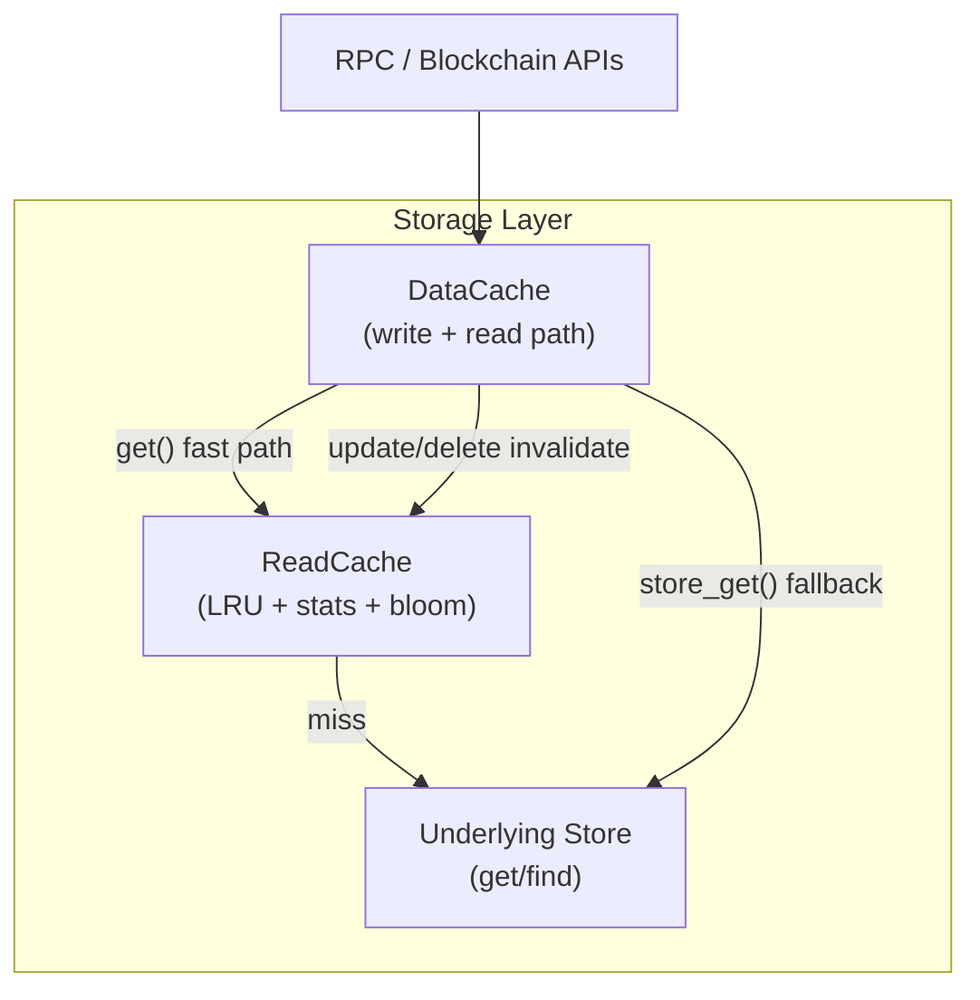
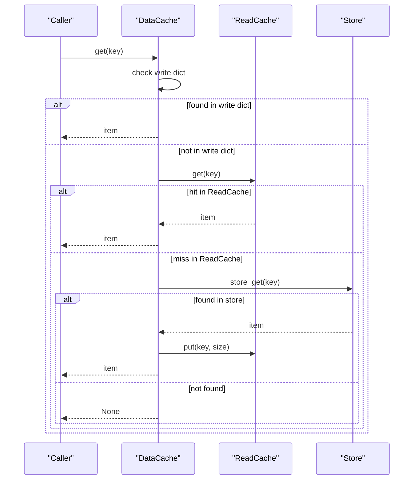
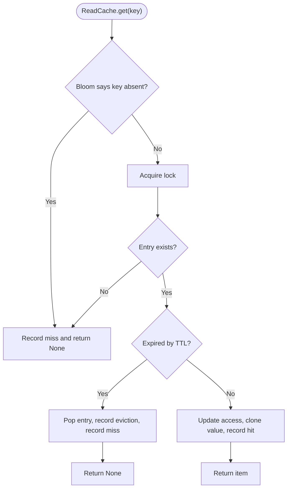
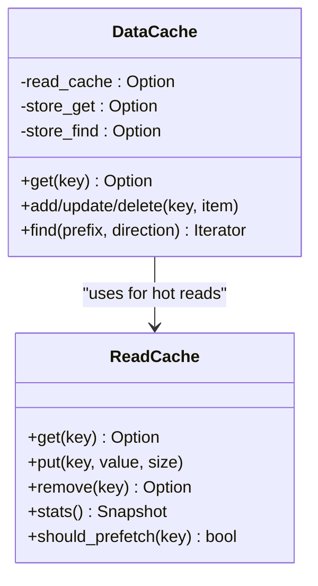
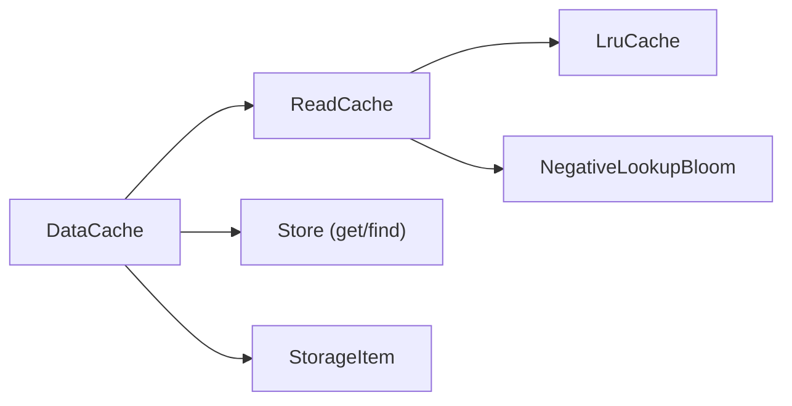

# Read-Only Cache Layer

<cite>
**Referenced Files in This Document**
- [neo-storage/src/persistence/read_cache.rs](file://neo-storage/src/persistence/read_cache.rs)
- [neo-storage/src/persistence/data_cache/cache.rs](file://neo-storage/src/persistence/data_cache/cache.rs)
- [neo-storage/src/cache/mod.rs](file://neo-storage/src/cache/mod.rs)
- [neo-storage/src/cache/data_cache.rs](file://neo-storage/src/cache/data_cache.rs)
- [neo-storage/src/types/storage_item.rs](file://neo-storage/src/types/storage_item.rs)
- [neo-core/src/persistence/mod.rs](file://neo-core/src/persistence/mod.rs)
</cite>

## Table of Contents
1. [Introduction](#introduction)
2. [Project Structure](#project-structure)
3. [Core Components](#core-components)
4. [Architecture Overview](#architecture-overview)
5. [Detailed Component Analysis](#detailed-component-analysis)
6. [Dependency Analysis](#dependency-analysis)
7. [Performance Considerations](#performance-considerations)
8. [Troubleshooting Guide](#troubleshooting-guide)
9. [Conclusion](#conclusion)
10. [Appendices](#appendices)

## Introduction
This document explains the ReadCache layer that provides optimized read-only access patterns for Neo-RS storage. It covers how read caches improve query performance by caching frequently accessed data from underlying storage providers, details cache invalidation strategies and consistency guarantees for reads, documents integration with the main DataCache system, and outlines configuration options for sizing, eviction policies, prefetching, and monitoring metrics. It also includes usage examples for blockchain queries, state lookups, and RPC endpoint implementations, along with tuning guidance for validators, full nodes, and archive nodes.

## Project Structure
The read cache is implemented as a dedicated LRU-backed cache with optional bloom filter support and statistics tracking. It is integrated into the DataCache pipeline to accelerate reads while preserving write semantics and snapshot isolation.

**Diagram sources**
- [neo-storage/src/persistence/data_cache/cache.rs:263-338](file://neo-storage/src/persistence/data_cache/cache.rs#L263-L338)
- [neo-storage/src/persistence/read_cache.rs:400-454](file://neo-storage/src/persistence/read_cache.rs#L400-L454)
- [neo-storage/src/persistence/read_cache.rs:456-535](file://neo-storage/src/persistence/read_cache.rs#L456-L535)

**Section sources**
- [neo-storage/src/persistence/data_cache/cache.rs:263-338](file://neo-storage/src/persistence/data_cache/cache.rs#L263-L338)
- [neo-storage/src/persistence/read_cache.rs:400-454](file://neo-storage/src/persistence/read_cache.rs#L400-L454)

## Core Components
- ReadCache: An LRU-based read cache with TTL, prefetch thresholds, bloom filter negative lookup, and atomic statistics.
- ReadCacheConfig: Configuration for capacity (entries and bytes), prefetch behavior, TTL, stats, and bloom filter parameters.
- ReadCacheStats / Snapshot: Atomic counters for hits, misses, evictions, prefetches, and bloom filter effectiveness; snapshots expose computed rates.
- DataCache integration: The DataCache read path checks the write dictionary first, then the ReadCache, then falls back to the store getter; writes invalidate or update the ReadCache accordingly.

Key responsibilities:
- Reduce repeated disk I/O for hot keys via LRU caching.
- Accelerate prefix scans and sequential reads via prefetching.
- Provide negative lookup acceleration using a bloom filter to avoid unnecessary store calls.
- Expose metrics for observability and tuning.

**Section sources**
- [neo-storage/src/persistence/read_cache.rs:242-325](file://neo-storage/src/persistence/read_cache.rs#L242-L325)
- [neo-storage/src/persistence/read_cache.rs:327-399](file://neo-storage/src/persistence/read_cache.rs#L327-L399)
- [neo-storage/src/persistence/read_cache.rs:400-454](file://neo-storage/src/persistence/read_cache.rs#L400-L454)
- [neo-storage/src/persistence/read_cache.rs:456-535](file://neo-storage/src/persistence/read_cache.rs#L456-L535)
- [neo-storage/src/persistence/read_cache.rs:537-593](file://neo-storage/src/persistence/read_cache.rs#L537-L593)
- [neo-storage/src/persistence/data_cache/cache.rs:263-338](file://neo-storage/src/persistence/data_cache/cache.rs#L263-L338)

## Architecture Overview
The DataCache orchestrates reads through a layered strategy:
1. Write dictionary (in-memory tracked changes).
2. Read cache (LRU with optional TTL and bloom filter).
3. Underlying store (via provided get/find functions).

Writes (add/update/delete) propagate to the write dictionary and optionally invalidate or update the ReadCache to maintain consistency. Prefetching can be triggered based on access patterns to pre-populate the ReadCache.

**Diagram sources**
- [neo-storage/src/persistence/data_cache/cache.rs:263-338](file://neo-storage/src/persistence/data_cache/cache.rs#L263-L338)
- [neo-storage/src/persistence/read_cache.rs:400-454](file://neo-storage/src/persistence/read_cache.rs#L400-L454)

## Detailed Component Analysis

### ReadCache: LRU Eviction, TTL, Bloom Filter, Prefetch
- LRU eviction: Enforces both max_entries and max_bytes; evicts least recently used entries when limits are exceeded.
- TTL: Entries older than configured TTL are treated as expired on access and removed.
- Bloom filter: Optional negative lookup optimization to skip expensive store calls for keys definitely not present.
- Prefetch: Batch insertions support preloading related keys after detecting access patterns; prefetch hits are recorded.

**Diagram sources**
- [neo-storage/src/persistence/read_cache.rs:400-454](file://neo-storage/src/persistence/read_cache.rs#L400-L454)

**Section sources**
- [neo-storage/src/persistence/read_cache.rs:400-454](file://neo-storage/src/persistence/read_cache.rs#L400-L454)
- [neo-storage/src/persistence/read_cache.rs:456-535](file://neo-storage/src/persistence/read_cache.rs#L456-L535)
- [neo-storage/src/persistence/read_cache.rs:537-593](file://neo-storage/src/persistence/read_cache.rs#L537-L593)

### DataCache Integration: Read Path and Invalidation
- Read path: Checks write dictionary first, then ReadCache, then store getter; on store hit, populates ReadCache and optionally tracks in write dictionary if configured.
- Invalidation: On add/update/delete, DataCache removes or updates corresponding entries in ReadCache to ensure consistency.
- Prefetch coordination: Access pattern tracking can trigger prefetch windows; ReadCache records prefetch hits when prefetched keys are subsequently accessed.

**Diagram sources**
- [neo-storage/src/persistence/data_cache/cache.rs:263-338](file://neo-storage/src/persistence/data_cache/cache.rs#L263-L338)
- [neo-storage/src/persistence/read_cache.rs:400-454](file://neo-storage/src/persistence/read_cache.rs#L400-L454)

**Section sources**
- [neo-storage/src/persistence/data_cache/cache.rs:263-338](file://neo-storage/src/persistence/data_cache/cache.rs#L263-L338)
- [neo-storage/src/persistence/data_cache/cache.rs:368-435](file://neo-storage/src/persistence/data_cache/cache.rs#L368-L435)
- [neo-storage/src/persistence/data_cache/cache.rs:464-477](file://neo-storage/src/persistence/data_cache/cache.rs#L464-L477)

### Consistency Guarantees and Invalidation Strategy
- Write-first visibility: DataCache’s write dictionary always takes precedence over ReadCache and store.
- Immediate invalidation: Writes remove or update ReadCache entries so subsequent reads see the latest state.
- Snapshot isolation: Cloned overlays and forks preserve consistent views; ReadCache is shared but invalidated on writes to the active cache.

**Section sources**
- [neo-storage/src/persistence/data_cache/cache.rs:368-435](file://neo-storage/src/persistence/data_cache/cache.rs#L368-L435)
- [neo-storage/src/persistence/data_cache/cache.rs:464-477](file://neo-storage/src/persistence/data_cache/cache.rs#L464-L477)

### Configuration Options and Metrics
- Capacity: max_entries and max_bytes control memory footprint and eviction pressure.
- Prefetch: enable_prefetch, prefetch_count, prefetch_threshold tune proactive loading.
- TTL: ttl sets per-entry lifetime to bound staleness.
- Bloom filter: enable_bloom_filter, bloom_filter_capacity, bloom_filter_fpr optimize negative lookups.
- Stats: enable_stats toggles metric collection; snapshots provide hit_rate, prefetch_hit_rate, bloom_filter_effectiveness.

Typical presets:
- Default: balanced for general use.
- high_memory: larger capacities and more aggressive prefetch.
- low_memory: smaller capacities, optional TTL, reduced prefetch.

**Section sources**
- [neo-storage/src/persistence/read_cache.rs:242-325](file://neo-storage/src/persistence/read_cache.rs#L242-L325)
- [neo-storage/src/persistence/read_cache.rs:196-240](file://neo-storage/src/persistence/read_cache.rs#L196-L240)

### Usage Examples

#### Blockchain Queries (prefix scans)
- Use DataCache.find with a contract ID and key prefix to iterate items efficiently.
- Prefetching can reduce store round-trips for sequential scans.

**Section sources**
- [neo-storage/src/persistence/data_cache/cache.rs:678-750](file://neo-storage/src/persistence/data_cache/cache.rs#L678-L750)

#### State Lookups (account, token balances)
- Repeated get(key) calls benefit from ReadCache after initial store load.
- Monitor ReadCache hit_rate to validate effectiveness.

**Section sources**
- [neo-storage/src/persistence/data_cache/cache.rs:263-338](file://neo-storage/src/persistence/data_cache/cache.rs#L263-L338)
- [neo-storage/src/persistence/read_cache.rs:400-454](file://neo-storage/src/persistence/read_cache.rs#L400-L454)

#### RPC Endpoint Implementations
- RPC handlers typically call into ledger/state services which use DataCache; enabling ReadCache reduces latency for common queries like account info, transaction retrieval, and block headers.
- Expose ReadCache stats via node metrics endpoints for operational visibility.

**Section sources**
- [neo-core/src/persistence/mod.rs:26-26](file://neo-core/src/persistence/mod.rs#L26-L26)

## Dependency Analysis
- DataCache depends on ReadCache for hot-path optimizations and on store getters/finders for fallbacks.
- ReadCache depends on LRU structures and optional bloom filter for negative lookups.
- StorageItem may carry lazy cache-backed values; sealing materializes cached content when needed.

**Diagram sources**
- [neo-storage/src/persistence/data_cache/cache.rs:263-338](file://neo-storage/src/persistence/data_cache/cache.rs#L263-L338)
- [neo-storage/src/persistence/read_cache.rs:327-399](file://neo-storage/src/persistence/read_cache.rs#L327-L399)
- [neo-storage/src/types/storage_item.rs:143-167](file://neo-storage/src/types/storage_item.rs#L143-L167)

**Section sources**
- [neo-storage/src/persistence/data_cache/cache.rs:263-338](file://neo-storage/src/persistence/data_cache/cache.rs#L263-L338)
- [neo-storage/src/persistence/read_cache.rs:327-399](file://neo-storage/src/persistence/read_cache.rs#L327-L399)
- [neo-storage/src/types/storage_item.rs:143-167](file://neo-storage/src/types/storage_item.rs#L143-L167)

## Performance Considerations
- Hot-key locality: Enable ReadCache and monitor hit_rate; increase max_entries/max_bytes if evictions are high.
- Sequential scans: Enable prefetching with appropriate prefetch_count and threshold to reduce store calls.
- Memory constraints: For constrained environments, use low_memory preset or disable prefetch; consider TTL to expire stale entries.
- Negative lookups: Bloom filter helps when many unique keys are queried; tune capacity and FPR based on workload.
- Observability: Track current_entries, current_bytes, evictions, prefetches, and prefetch_hit_rate to guide tuning.

[No sources needed since this section provides general guidance]

## Troubleshooting Guide
Common issues and diagnostics:
- Low hit rate: Check prefetch settings and access patterns; verify that hot keys are being written once and read repeatedly.
- High evictions: Increase max_entries or max_bytes; review TTL settings; analyze whether large values dominate memory.
- Stale reads: Ensure writes go through DataCache so ReadCache is invalidated; confirm read-only caches are not bypassed.
- Bloom filter overhead: If false positives dominate, adjust bloom_filter_capacity and FPR; measure bloom_filter_effectiveness.

Operational tips:
- Use clear_read_cache to reset during maintenance or after major state transitions.
- Periodically log ReadCache stats snapshots to detect regressions.

**Section sources**
- [neo-storage/src/persistence/read_cache.rs:537-593](file://neo-storage/src/persistence/read_cache.rs#L537-L593)
- [neo-storage/src/persistence/data_cache/cache.rs:660-676](file://neo-storage/src/persistence/data_cache/cache.rs#L660-L676)

## Conclusion
The ReadCache layer significantly improves read performance by caching frequently accessed storage items behind an LRU with TTL and bloom filter optimizations. Integrated tightly with DataCache, it maintains consistency through immediate invalidation on writes while providing strong observability via metrics. Properly tuned for node type and workload, it delivers measurable latency reductions for blockchain queries, state lookups, and RPC endpoints.

[No sources needed since this section summarizes without analyzing specific files]

## Appendices

### A. DataCache Legacy Module Reference
The legacy module exposes a simpler DataCache abstraction for basic caching scenarios without advanced prefetching or integrated ReadCache.

**Section sources**
- [neo-storage/src/cache/mod.rs:1-36](file://neo-storage/src/cache/mod.rs#L1-L36)
- [neo-storage/src/cache/data_cache.rs:39-121](file://neo-storage/src/cache/data_cache.rs#L39-L121)

### B. StorageItem Lazy Materialization
StorageItem supports lazy materialization of cached values, allowing efficient serialization and copying without premature expansion.

**Section sources**
- [neo-storage/src/types/storage_item.rs:143-167](file://neo-storage/src/types/storage_item.rs#L143-L167)