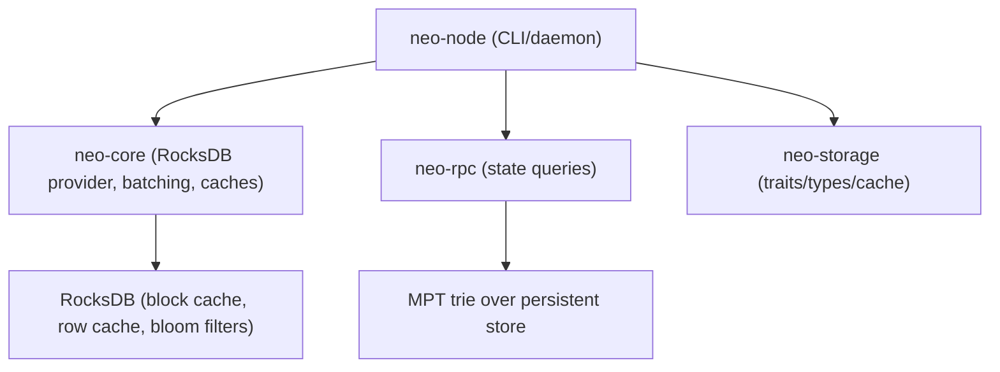
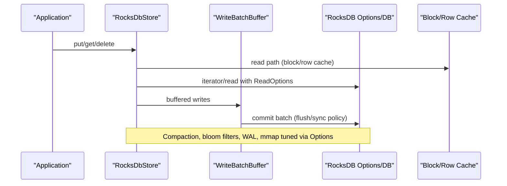
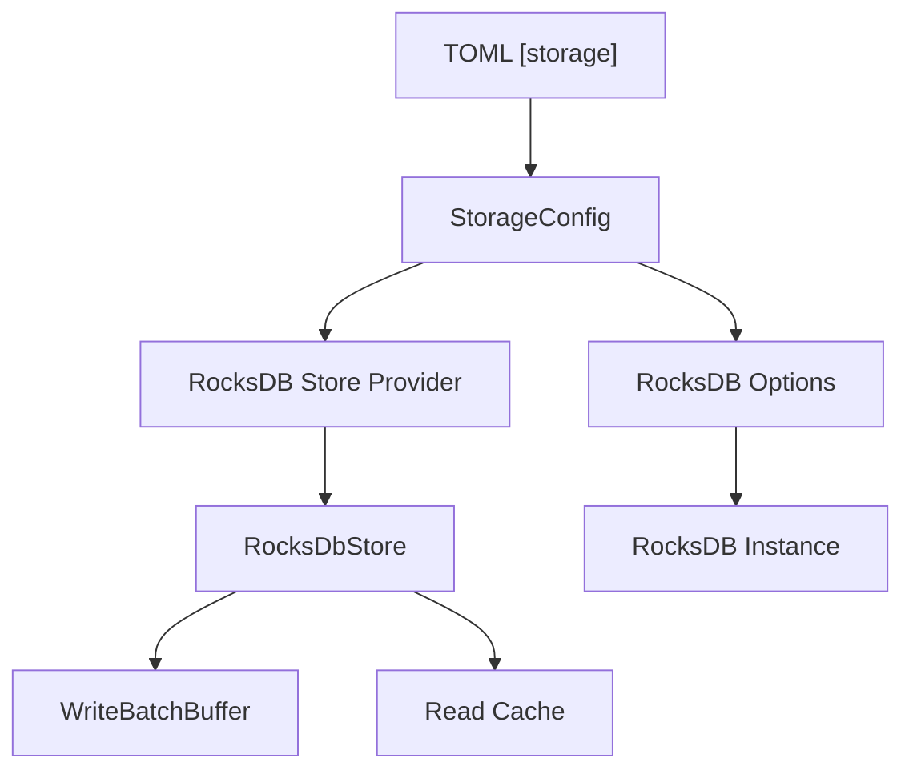

# Performance Tuning

<cite>
**Referenced Files in This Document**
- [README.md](file://README.md)
- [mainnet.toml](file://config/mainnet.toml)
- [perf-validate.toml](file://config/perf-validate.toml)
- [lib.rs](file://neo-storage/src/lib.rs)
- [provider.rs](file://neo-core/src/persistence/providers/rocksdb/provider.rs)
- [storage.rs](file://neo-core/src/persistence/storage.rs)
- [node_config.rs](file://neo-node/src/config/node_config.rs)
- [write_batch_buffer.rs](file://neo-core/src/persistence/write_batch_buffer.rs)
- [rpc_server_state.rs](file://neo-rpc/src/server/rpc_server_state.rs)
- [mod.rs](file://neo-core/src/monitoring/mod.rs)
</cite>

## Table of Contents
1. [Introduction](#introduction)
2. [Project Structure](#project-structure)
3. [Core Components](#core-components)
4. [Architecture Overview](#architecture-overview)
5. [Detailed Component Analysis](#detailed-component-analysis)
6. [Dependency Analysis](#dependency-analysis)
7. [Performance Considerations](#performance-considerations)
8. [Troubleshooting Guide](#troubleshooting-guide)
9. [Conclusion](#conclusion)
10. [Appendices](#appendices)

## Introduction
This document provides performance tuning guidance for the Neo-RS storage subsystem with a focus on RocksDB-backed persistence, indexing strategies for common query patterns, compaction and buffer sizing, cache optimization, monitoring, disk space management, benchmarking, and node-type-specific recommendations. It consolidates configuration options exposed by the node and storage layers and maps them to practical tuning actions.

## Project Structure
Neo-RS separates storage concerns across crates:
- neo-storage defines storage traits, types, caching primitives, and key utilities.
- neo-core implements the RocksDB provider, write batching, read caches, and storage configuration.
- neo-node wires configuration into runtime storage settings.
- neo-rpc exposes state queries that traverse the MPT trie backed by persistent storage.
- Configuration files under config/ define defaults for production-like runs.

**Diagram sources**
- [provider.rs:1-132](file://neo-core/src/persistence/providers/rocksdb/provider.rs#L1-L132)
- [storage.rs:47-80](file://neo-core/src/persistence/storage.rs#L47-L80)
- [node_config.rs:147-171](file://neo-node/src/config/node_config.rs#L147-L171)
- [rpc_server_state.rs:95-113](file://neo-rpc/src/server/rpc_server_state.rs#L95-L113)
- [lib.rs:1-58](file://neo-storage/src/lib.rs#L1-L58)

**Section sources**
- [README.md:192-227](file://README.md#L192-L227)
- [mainnet.toml:7-11](file://config/mainnet.toml#L7-L11)
- [perf-validate.toml:5-8](file://config/perf-validate.toml#L5-L8)

## Core Components
- Storage configuration model: path, compression, compaction strategy, open files limit, block cache size, write buffer size, statistics toggle, read-only mode.
- RocksDB provider: builds DB options, sets compaction style, background jobs, bytes per sync, memtable prefix bloom ratio, L0 triggers, WAL cap, block/row caches, bloom filters, mmap behavior, pipelined writes.
- Write batch buffering: configurable batching thresholds, delay-based flushes, optional WAL disable for throughput, durability presets.
- Read cache: optional point-read cache integrated into the store; can be enabled/disabled and cleared at runtime.
- Node configuration mapping: TOML fields map to StorageConfig values used by providers.

Key tunables surfaced via configuration or provider APIs:
- Block cache size and row cache sizing.
- Write buffer size and number of buffers.
- Compaction strategy selection.
- Compression algorithm selection.
- Open file limits and background job parallelism.
- Bloom filter usage and index/filter pinning.
- Read-ahead for sequential scans.
- WAL size cap and bytes-per-sync cadence.

**Section sources**
- [storage.rs:47-80](file://neo-core/src/persistence/storage.rs#L47-L80)
- [provider.rs:243-333](file://neo-core/src/persistence/providers/rocksdb/provider.rs#L243-L333)
- [write_batch_buffer.rs:127-168](file://neo-core/src/persistence/write_batch_buffer.rs#L127-L168)
- [node_config.rs:147-171](file://neo-node/src/config/node_config.rs#L147-L171)

## Architecture Overview
The storage stack integrates application-level caching, RocksDB internals, and RPC-driven queries.

**Diagram sources**
- [provider.rs:158-208](file://neo-core/src/persistence/providers/rocksdb/provider.rs#L158-L208)
- [provider.rs:243-333](file://neo-core/src/persistence/providers/rocksdb/provider.rs#L243-L333)
- [write_batch_buffer.rs:127-168](file://neo-core/src/persistence/write_batch_buffer.rs#L127-L168)

## Detailed Component Analysis

### RocksDB Provider and Options
- Compaction strategy is selectable (Level/Universal/FIFO) and applied to DB options.
- Background parallelism and max background jobs are set based on CPU availability.
- Bytes per sync smooths I/O; WAL size capped; L0 slowdown/stop triggers configured to protect sync.
- Memtable prefix bloom ratio improves hit rate for key-prefix workloads.
- Block cache and row cache sizes are derived from configured cache_size; optimize_for_point_lookup is set accordingly.
- Bloom filters can be enabled with index/filter blocks pinned in cache.
- mmap reads are disabled on Windows to avoid soft page faults; mmap writes disabled universally.
- Pipelined writes enabled for throughput.

Tuning levers:
- Increase block cache for read-heavy nodes; adjust row cache within bounds.
- Tune write buffer size to reduce flush frequency during heavy sync.
- Select compaction strategy aligned with workload (e.g., FIFO for time-series-like TTL).
- Enable bloom filters when point lookups dominate.

**Section sources**
- [provider.rs:243-333](file://neo-core/src/persistence/providers/rocksdb/provider.rs#L243-L333)

### Write Batch Buffering
- Configurable batching thresholds (size, delay, min operations, bytes).
- Presets: durable (small batches, sync-on-flush), balanced, high-throughput (larger batches, optional WAL disable).
- Stats exposed for observability.

Recommendations:
- Use durable preset for safety-critical paths.
- Use high-throughput preset during initial sync or bulk import where data loss window is acceptable.

**Section sources**
- [write_batch_buffer.rs:127-168](file://neo-core/src/persistence/write_batch_buffer.rs#L127-L168)

### Read Cache Integration
- Optional read cache can be enabled/disabled per store instance.
- Runtime stats and clear operations available.

Use cases:
- Enable for hot-spot key reads; disable if memory pressure or low locality.

**Section sources**
- [provider.rs:68-78](file://neo-core/src/persistence/providers/rocksdb/provider.rs#L68-L78)

### Node Configuration Mapping
- TOML storage section maps to StorageConfig: path, cache_size (MB), write_buffer_size (MB), max_open_files, compression, read_only.
- These values flow into RocksDB provider options.

Operational notes:
- Ensure sufficient OS file descriptors for large max_open_files.
- Choose compression balancing CPU vs disk savings (LZ4/ZSTD).

**Section sources**
- [node_config.rs:147-171](file://neo-node/src/config/node_config.rs#L147-L171)
- [storage.rs:47-80](file://neo-core/src/persistence/storage.rs#L47-L80)

### Indexing Strategies for Common Query Patterns
- Account lookups: typically point lookups by account hash; benefit from bloom filters and adequate block cache.
- Transaction searches: often prefix-based scans; use read-ahead and iterators with bounded ranges; consider FIFO compaction for time-bounded scans.
- Contract state queries: MPT trie traversal over contract prefixes; ensure row cache and index/filter pinning to reduce seeks.

RPC state access demonstrates how contract IDs and keys are resolved and queried against the trie.

**Section sources**
- [rpc_server_state.rs:95-113](file://neo-rpc/src/server/rpc_server_state.rs#L95-L113)
- [rpc_server_state.rs:155-196](file://neo-rpc/src/server/rpc_server_state.rs#L155-L196)

### Compaction Settings
- Level compaction is default; Universal and FIFO are supported.
- L0 slowdown/stop triggers help maintain responsiveness during heavy writes.
- WAL cap prevents unbounded growth.

Guidance:
- For append-heavy historical data, FIFO may reduce space amplification.
- For mixed workloads, Level offers balanced latency and throughput.

**Section sources**
- [provider.rs:256-306](file://neo-core/src/persistence/providers/rocksdb/provider.rs#L256-L306)

### Write Buffer Sizing and Flush Behavior
- Default write buffer size chosen to reduce flush frequency during sync.
- Number of write buffers and merge thresholds set to balance memory and compaction load.
- Batch commit policies tune latency vs durability trade-offs.

**Section sources**
- [provider.rs:282-288](file://neo-core/src/persistence/providers/rocksdb/provider.rs#L282-L288)
- [write_batch_buffer.rs:127-168](file://neo-core/src/persistence/write_batch_buffer.rs#L127-L168)

### Cache Size Optimization
- Block cache sized from configuration; row cache derived as a fraction with clamping.
- Point lookup optimization parameter set relative to cache size.
- Bloom filters and pinned index/filter blocks improve read performance.

**Section sources**
- [provider.rs:308-326](file://neo-core/src/persistence/providers/rocksdb/provider.rs#L308-L326)

### Monitoring and Metrics
- Built-in monitoring facade supports registering metrics, recording samples, threshold evaluation, and alert callbacks.
- RocksDB statistics can be enabled via configuration to expose internal counters.

Operational tips:
- Enable RocksDB statistics in controlled environments to diagnose stalls or excessive compaction.
- Use monitoring thresholds to detect degraded performance early.

**Section sources**
- [mod.rs:400-459](file://neo-core/src/monitoring/mod.rs#L400-L459)
- [provider.rs:328-330](file://neo-core/src/persistence/providers/rocksdb/provider.rs#L328-L330)

### Disk Space Management and Cleanup
- WAL cap limits log growth; compaction reduces SST proliferation.
- Use FIFO compaction for time-bounded retention scenarios.
- Back up RocksDB data using provided scripts; stop node before backup when possible.

**Section sources**
- [provider.rs:304-306](file://neo-core/src/persistence/providers/rocksdb/provider.rs#L304-L306)
- [README.md:417-418](file://README.md#L417-L418)

### Benchmarking Methodologies and Regression Testing
- Use built-in benchmarks and test suites to establish baselines.
- Validate configuration changes with targeted workloads (account lookups, transaction scans, contract state queries).
- Compare metrics pre/post change to detect regressions.

[No sources needed since this section provides general guidance]

### Recommendations by Node Type and Hardware
- Validator: prioritize durability (balanced/durable batching), moderate cache sizes, Level compaction, enable bloom filters.
- Full node: emphasize read performance (larger block/row cache, bloom filters), read-ahead enabled, Level compaction.
- Archive node: consider FIFO compaction for time-series-like data, larger WAL cap, monitor disk usage closely.
- Hardware: scale block cache to available RAM; ensure SSD/NVMe for write-heavy paths; increase OS limits for open files and processes.

[No sources needed since this section provides general guidance]

## Dependency Analysis
Configuration flows from TOML to StorageConfig to RocksDB Options, while the provider composes batching and caches around the DB handle.

**Diagram sources**
- [node_config.rs:147-171](file://neo-node/src/config/node_config.rs#L147-L171)
- [storage.rs:47-80](file://neo-core/src/persistence/storage.rs#L47-L80)
- [provider.rs:111-132](file://neo-core/src/persistence/providers/rocksdb/provider.rs#L111-L132)
- [provider.rs:243-333](file://neo-core/src/persistence/providers/rocksdb/provider.rs#L243-L333)

**Section sources**
- [node_config.rs:147-171](file://neo-node/src/config/node_config.rs#L147-L171)
- [storage.rs:47-80](file://neo-core/src/persistence/storage.rs#L47-L80)
- [provider.rs:111-132](file://neo-core/src/persistence/providers/rocksdb/provider.rs#L111-L132)

## Performance Considerations
- Prefer enabling bloom filters for point-heavy workloads.
- Set block cache to a significant fraction of available RAM for read-heavy nodes.
- Use read-ahead for sequential scans (enabled by default).
- Tune write buffer size to reduce flush frequency during sync; choose batching preset appropriate to workload.
- Monitor L0 triggers and WAL size to prevent write stalls.
- On Windows, rely on non-mmap reads to avoid soft page faults.
- Enable RocksDB statistics temporarily for diagnostics.

[No sources needed since this section provides general guidance]

## Troubleshooting Guide
Common issues and mitigations:
- High read latency: verify bloom filters enabled, check block/row cache sizing, ensure read-ahead enabled.
- Write stalls during sync: review L0 slowdown/stop triggers, WAL cap, and write buffer size; consider temporary high-throughput batching preset.
- Excessive disk growth: evaluate compaction strategy (FIFO for time-bounded), monitor compaction rates, schedule backups and cleanup.
- Memory pressure: reduce cache sizes or disable read cache if necessary.

[No sources needed since this section provides general guidance]

## Conclusion
Neo-RS provides a flexible, high-performance storage layer with tunable RocksDB options, write batching, and read caching. By aligning compaction, buffers, caches, and monitoring with your workload and node role, you can achieve predictable latency and throughput while managing disk usage effectively.

[No sources needed since this section summarizes without analyzing specific files]

## Appendices

### A. Key Configuration Locations
- Node storage configuration mapping: [node_config.rs:147-171](file://neo-node/src/config/node_config.rs#L147-L171)
- Storage model defaults and fields: [storage.rs:47-80](file://neo-core/src/persistence/storage.rs#L47-L80)
- Example production configs: [mainnet.toml:7-11](file://config/mainnet.toml#L7-L11), [perf-validate.toml:5-8](file://config/perf-validate.toml#L5-L8)

**Section sources**
- [node_config.rs:147-171](file://neo-node/src/config/node_config.rs#L147-L171)
- [storage.rs:47-80](file://neo-core/src/persistence/storage.rs#L47-L80)
- [mainnet.toml:7-11](file://config/mainnet.toml#L7-L11)
- [perf-validate.toml:5-8](file://config/perf-validate.toml#L5-L8)

### B. RocksDB Options Reference
- Compaction, background jobs, bytes per sync, WAL cap, L0 triggers, caches, bloom filters, mmap, pipelined writes: [provider.rs:243-333](file://neo-core/src/persistence/providers/rocksdb/provider.rs#L243-L333)

**Section sources**
- [provider.rs:243-333](file://neo-core/src/persistence/providers/rocksdb/provider.rs#L243-L333)

### C. Write Batching Presets
- Durability, balanced, high-throughput presets and parameters: [write_batch_buffer.rs:127-168](file://neo-core/src/persistence/write_batch_buffer.rs#L127-L168)

**Section sources**
- [write_batch_buffer.rs:127-168](file://neo-core/src/persistence/write_batch_buffer.rs#L127-L168)

### D. State Query Flow
- Contract state retrieval and iteration via MPT trie: [rpc_server_state.rs:95-113](file://neo-rpc/src/server/rpc_server_state.rs#L95-L113), [rpc_server_state.rs:155-196](file://neo-rpc/src/server/rpc_server_state.rs#L155-L196)

**Section sources**
- [rpc_server_state.rs:95-113](file://neo-rpc/src/server/rpc_server_state.rs#L95-L113)
- [rpc_server_state.rs:155-196](file://neo-rpc/src/server/rpc_server_state.rs#L155-L196)

### E. Monitoring Facade
- Metric registration, recording, thresholds, alerts: [mod.rs:400-459](file://neo-core/src/monitoring/mod.rs#L400-L459)

**Section sources**
- [mod.rs:400-459](file://neo-core/src/monitoring/mod.rs#L400-L459)