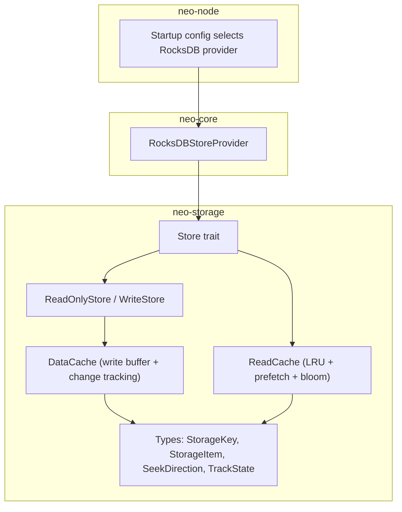
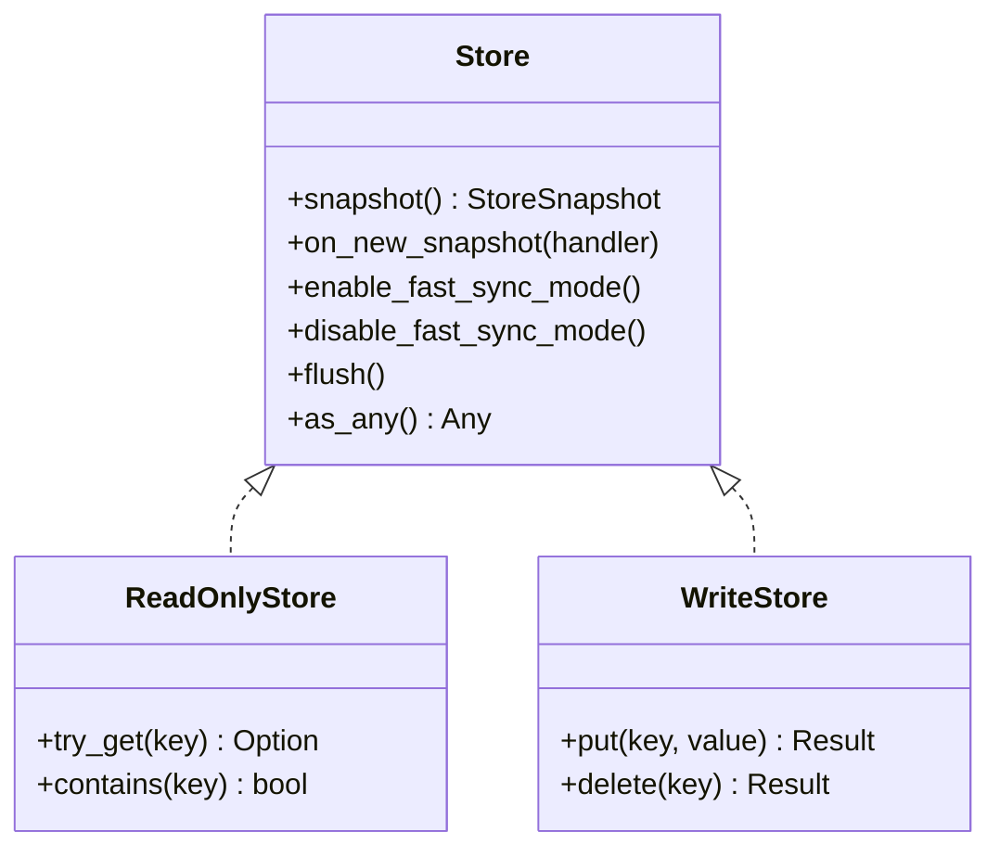
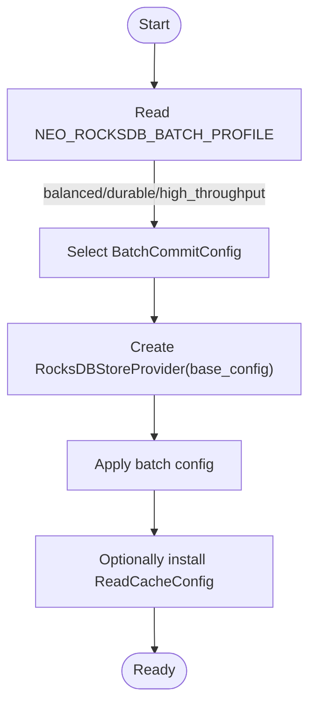
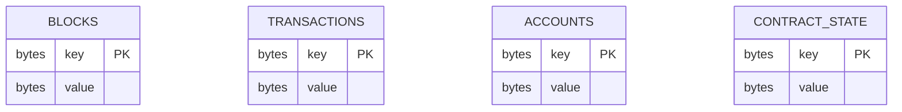
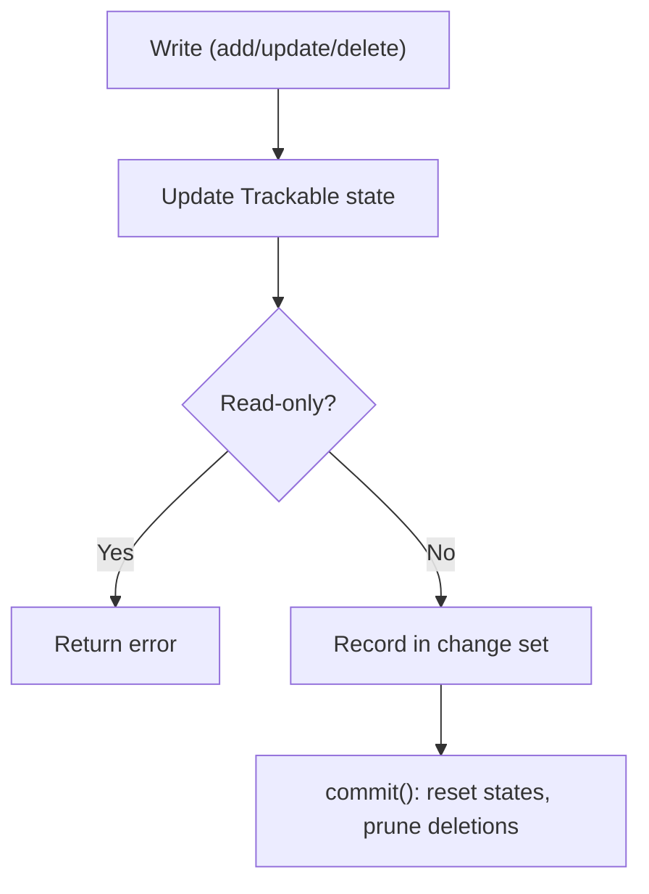
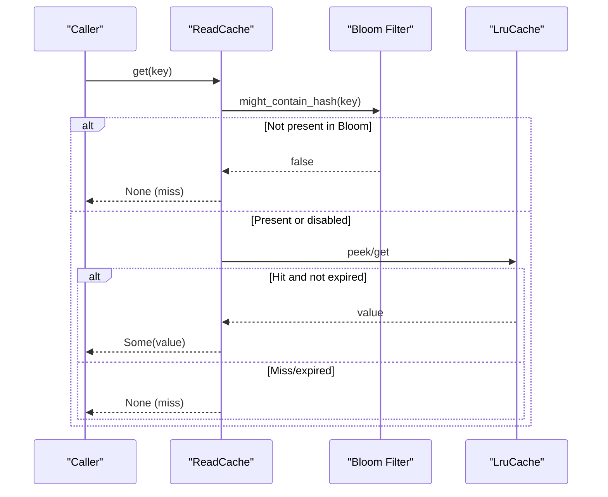
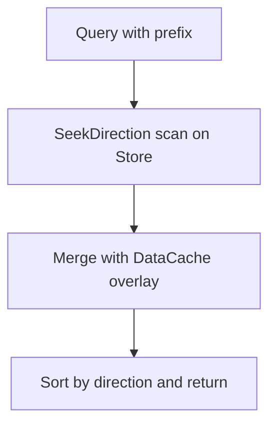
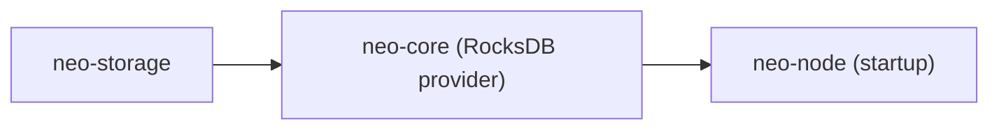

# Storage & Persistence

<cite>
**Referenced Files in This Document**
- [lib.rs](file://neo-storage/src/lib.rs)
- [mod.rs](file://neo-storage/src/persistence/mod.rs)
- [store.rs](file://neo-storage/src/persistence/store.rs)
- [read_cache.rs](file://neo-storage/src/persistence/read_cache.rs)
- [data_cache.rs](file://neo-storage/src/cache/data_cache.rs)
- [types/mod.rs](file://neo-storage/src/types/mod.rs)
- [provider.rs](file://neo-core/src/persistence/providers/rocksdb/provider.rs)
- [config.rs](file://neo-node/src/startup/config.rs)
</cite>

## Table of Contents
1. [Introduction](#introduction)
2. [Project Structure](#project-structure)
3. [Core Components](#core-components)
4. [Architecture Overview](#architecture-overview)
5. [Detailed Component Analysis](#detailed-component-analysis)
6. [Dependency Analysis](#dependency-analysis)
7. [Performance Considerations](#performance-considerations)
8. [Troubleshooting Guide](#troubleshooting-guide)
9. [Conclusion](#conclusion)
10. [Appendices](#appendices)

## Introduction
This document explains Neo-RS storage and persistence with a focus on the storage abstraction layer, pluggable backend architecture (RocksDB as default), key-value patterns for blocks, transactions, accounts, and smart contract state, caching strategies (read cache, write buffer via DataCache, and data cache), schema and indexing considerations, backup/restore and snapshotting, performance tuning, disk space management, monitoring, and migration/version compatibility.

## Project Structure
Neo’s storage subsystem is primarily implemented in the neo-storage crate, exposing traits and types that define a unified interface to underlying stores. The node wires a concrete provider (RocksDB by default) at startup.



**Diagram sources**
- [store.rs:10-30](file://neo-storage/src/persistence/store.rs#L10-L30)
- [mod.rs:1-30](file://neo-storage/src/persistence/mod.rs#L1-L30)
- [data_cache.rs:39-69](file://neo-storage/src/cache/data_cache.rs#L39-L69)
- [read_cache.rs:327-364](file://neo-storage/src/persistence/read_cache.rs#L327-L364)
- [types/mod.rs:1-18](file://neo-storage/src/types/mod.rs#L1-L18)
- [provider.rs:35-72](file://neo-core/src/persistence/providers/rocksdb/provider.rs#L35-L72)
- [config.rs:44-54](file://neo-node/src/startup/config.rs#L44-L54)

**Section sources**
- [lib.rs:1-71](file://neo-storage/src/lib.rs#L1-L71)
- [mod.rs:1-30](file://neo-storage/src/persistence/mod.rs#L1-L30)
- [store.rs:10-30](file://neo-storage/src/persistence/store.rs#L10-L30)
- [provider.rs:35-72](file://neo-core/src/persistence/providers/rocksdb/provider.rs#L35-L72)
- [config.rs:44-54](file://neo-node/src/startup/config.rs#L44-L54)

## Core Components
- Store trait: Unified read/write interface plus snapshot creation, fast-sync hooks, flush, and eventing.
- ReadOnlyStore/WriteStore: Base interfaces for get/contains and put/delete operations.
- DataCache: In-memory write buffer with change tracking (Added/Changed/Deleted/NotFound) and optional backing store delegation for reads.
- ReadCache: LRU read cache with configurable TTL, prefetching, and negative lookup via Bloom filter; provides statistics and snapshots.
- Types: StorageKey (contract ID + suffix), StorageItem (value + flags), SeekDirection, TrackState.

These components form a layered design where application logic writes through DataCache and reads may be served from ReadCache or the backing store.

**Section sources**
- [store.rs:10-30](file://neo-storage/src/persistence/store.rs#L10-L30)
- [data_cache.rs:39-69](file://neo-storage/src/cache/data_cache.rs#L39-L69)
- [read_cache.rs:242-325](file://neo-storage/src/persistence/read_cache.rs#L242-L325)
- [types/mod.rs:1-18](file://neo-storage/src/types/mod.rs#L1-L18)

## Architecture Overview
The system uses a pluggable provider pattern. At runtime, the node constructs a RocksDB-backed provider configured with batch commit profiles and optional read cache. The Store trait abstracts the underlying engine, enabling snapshots and fast-sync optimizations.

```mermaid
sequenceDiagram
participant Node as "Node Startup"
participant Config as "Config"
participant Provider as "RocksDBStoreProvider"
participant Store as "Store (trait)"
participant Cache as "ReadCache/DataCache"
Node->>Config : Build storage provider
Config-->>Node : Arc<dyn StoreProvider>
Node->>Provider : new(storage_config).with_batch_config(...)
Provider-->>Node : StoreProvider instance
Node->>Provider : create_store()
Provider-->>Node : Store (RocksDB-backed)
Note over Store,Cache : Reads may hit ReadCache; Writes go through DataCache then Store
```

**Diagram sources**
- [config.rs:44-54](file://neo-node/src/startup/config.rs#L44-L54)
- [provider.rs:35-72](file://neo-core/src/persistence/providers/rocksdb/provider.rs#L35-L72)
- [store.rs:10-30](file://neo-storage/src/persistence/store.rs#L10-L30)

## Detailed Component Analysis

### Storage Abstraction Layer
- Store trait exposes snapshot(), on_new_snapshot(), enable/disable fast sync, flush(), and downcasting helpers. It composes ReadOnlyStore and WriteStore<Vec<u8>, Vec<u8>> for generic key/value access.
- Snapshot support enables consistent point-in-time views for queries and analytics without blocking writes.



**Diagram sources**
- [store.rs:10-30](file://neo-storage/src/persistence/store.rs#L10-L30)

**Section sources**
- [store.rs:10-30](file://neo-storage/src/persistence/store.rs#L10-L30)

### Pluggable Backend: RocksDB Provider
- RocksDBStoreProvider encapsulates base storage configuration, batch commit profile selection, optional read cache, and toggles for bloom filters and read-ahead.
- Batch profiles are selected via environment variable to tune durability vs throughput.



**Diagram sources**
- [config.rs:57-83](file://neo-node/src/startup/config.rs#L57-L83)
- [provider.rs:35-72](file://neo-core/src/persistence/providers/rocksdb/provider.rs#L35-L72)

**Section sources**
- [config.rs:44-83](file://neo-node/src/startup/config.rs#L44-L83)
- [provider.rs:35-72](file://neo-core/src/persistence/providers/rocksdb/provider.rs#L35-L72)

### Key-Value Patterns for Blocks, Transactions, Accounts, and Contract State
- Keys are built using StorageKey (contract ID + key bytes) and stored as byte vectors in the underlying store.
- SeekDirection supports forward/backward iteration for prefix scans.
- Typical patterns:
  - Blocks: keyed by block height/hash prefixes for sequential and random access.
  - Transactions: keyed by transaction hash or sender/script prefixes for lookups and scans.
  - Accounts: native token balances keyed by account script hashes.
  - Smart contract state: per-contract StorageKey with user-defined suffixes.



[No sources needed since this diagram shows conceptual schema mapping]

**Section sources**
- [types/mod.rs:1-18](file://neo-storage/src/types/mod.rs#L1-L18)
- [lib.rs:10-26](file://neo-storage/src/lib.rs#L10-L26)

### Caching Strategies

#### DataCache (Write Buffer and Change Tracking)
- Maintains an in-memory dictionary with TrackState (None/Added/Changed/Deleted/NotFound).
- Supports optional backing store functions for lazy loading on reads.
- Provides find(prefix, direction) that merges backing store results with cached overlays and sorts by direction.
- Commit resets tracked states and prunes deleted/not-found entries.



**Diagram sources**
- [data_cache.rs:172-300](file://neo-storage/src/cache/data_cache.rs#L172-L300)
- [data_cache.rs:332-376](file://neo-storage/src/cache/data_cache.rs#L332-L376)

**Section sources**
- [data_cache.rs:39-69](file://neo-storage/src/cache/data_cache.rs#L39-L69)
- [data_cache.rs:129-170](file://neo-storage/src/cache/data_cache.rs#L129-L170)
- [data_cache.rs:172-300](file://neo-storage/src/cache/data_cache.rs#L172-L300)
- [data_cache.rs:332-376](file://neo-storage/src/cache/data_cache.rs#L332-L376)

#### ReadCache (Read Optimization)
- LRU cache with configurable max entries and bytes, TTL, prefetching, and Bloom filter for negative lookups.
- Statistics track hits, misses, evictions, prefetches, and Bloom effectiveness.
- Prefetch can be triggered based on access thresholds and batch-inserted into cache.



**Diagram sources**
- [read_cache.rs:327-364](file://neo-storage/src/persistence/read_cache.rs#L327-L364)
- [read_cache.rs:400-454](file://neo-storage/src/persistence/read_cache.rs#L400-L454)
- [read_cache.rs:566-583](file://neo-storage/src/persistence/read_cache.rs#L566-L583)

**Section sources**
- [read_cache.rs:242-325](file://neo-storage/src/persistence/read_cache.rs#L242-L325)
- [read_cache.rs:327-364](file://neo-storage/src/persistence/read_cache.rs#L327-L364)
- [read_cache.rs:400-454](file://neo-storage/src/persistence/read_cache.rs#L400-L454)
- [read_cache.rs:566-583](file://neo-storage/src/persistence/read_cache.rs#L566-L583)

### Database Schema Design, Indexing, and Query Optimization
- Schema: All entities are stored as key-value pairs with well-defined prefixes for blocks, transactions, accounts, and contract state. Keys combine identifiers (e.g., contract ID) with suffixes to form unique StorageKeys.
- Indexing: Prefix-based scanning using SeekDirection enables efficient range queries. DataCache.find merges backing store scans with cached overlays and sorts results according to direction.
- Query optimization: Use targeted prefixes, avoid full scans, leverage ReadCache for hot keys, and use StoreSnapshot for consistent reads during heavy workloads.



**Diagram sources**
- [data_cache.rs:332-376](file://neo-storage/src/cache/data_cache.rs#L332-L376)

**Section sources**
- [data_cache.rs:332-376](file://neo-storage/src/cache/data_cache.rs#L332-L376)
- [types/mod.rs:1-18](file://neo-storage/src/types/mod.rs#L1-L18)

### Backup, Restore, Snapshots, and Disaster Recovery
- Snapshots: Store::snapshot() creates a point-in-time view suitable for consistent reads and offline analysis.
- Backups: Use RocksDB-level tools to snapshot or copy the underlying database directory while ensuring consistency (e.g., via snapshot APIs or offline freeze if required by deployment).
- Restore: Rebuild from backups or bootstrap from checkpoints; validate state roots post-restore.
- Disaster recovery: Combine periodic snapshots, offsite backups, and checkpoint files to minimize RPO/RTO.

[No sources needed since this section provides general operational guidance]

### Performance Tuning Parameters, Disk Space Management, and Monitoring
- Batch commit profiles: Choose durable, balanced, or high-throughput via environment variable to trade durability for latency.
- Read cache tuning: Adjust max_entries, max_bytes, TTL, prefetch threshold/count, and Bloom filter capacity/false positive rate.
- Disk space: Monitor RocksDB SST size, compaction pressure, and cache memory usage; configure compaction and retention policies appropriate to workload.
- Monitoring: Expose ReadCacheStats (hits, misses, evictions, prefetch rates, Bloom effectiveness) and store metrics (batch stats) to observability systems.

**Section sources**
- [config.rs:57-83](file://neo-node/src/startup/config.rs#L57-L83)
- [read_cache.rs:42-239](file://neo-storage/src/persistence/read_cache.rs#L42-L239)
- [read_cache.rs:242-325](file://neo-storage/src/persistence/read_cache.rs#L242-L325)

### Data Migration and Version Compatibility
- Schema evolution: When adding new fields or changing key layouts, introduce versioned prefixes and migration routines that backfill or transform existing data.
- Compatibility: Ensure Store implementations handle legacy keys gracefully during transition periods; use feature flags or protocol versions to gate migrations.
- Validation: After migration, verify state roots and run parity checks against reference nodes.

[No sources needed since this section provides general guidance]

## Dependency Analysis
- neo-storage defines the abstractions and caches used across the stack.
- neo-core provides the RocksDB-backed provider implementing Store.
- neo-node wires the provider at startup based on configuration and environment.



**Diagram sources**
- [lib.rs:43-58](file://neo-storage/src/lib.rs#L43-L58)
- [provider.rs:35-72](file://neo-core/src/persistence/providers/rocksdb/provider.rs#L35-L72)
- [config.rs:44-54](file://neo-node/src/startup/config.rs#L44-L54)

**Section sources**
- [lib.rs:43-58](file://neo-storage/src/lib.rs#L43-L58)
- [provider.rs:35-72](file://neo-core/src/persistence/providers/rocksdb/provider.rs#L35-L72)
- [config.rs:44-54](file://neo-node/src/startup/config.rs#L44-L54)

## Performance Considerations
- Prefer DataCache for batching writes within a block or transaction scope; commit once to reduce store round-trips.
- Tune ReadCache for your workload: increase max_bytes for hot-state nodes; enable prefetch for sequential scans; adjust TTL to balance freshness and memory.
- Use StoreSnapshot for heavy analytical queries to avoid interfering with live processing.
- Select batch profile aligned with deployment goals: durable for safety-critical paths, high-throughput for latency-sensitive scenarios.

[No sources needed since this section provides general guidance]

## Troubleshooting Guide
- Read cache misses: Inspect ReadCacheStatsSnapshot for hit_rate and prefetch_hit_rate; adjust prefetch_threshold or prefetch_count.
- High eviction rate: Increase max_bytes or max_entries; consider TTL to expire stale entries.
- Bloom filter underutilization: Check bloom_filter_effectiveness; tune capacity and false positive rate.
- Write stalls: Review batch profile and flush behavior; ensure DataCache.commit is called appropriately.

**Section sources**
- [read_cache.rs:42-239](file://neo-storage/src/persistence/read_cache.rs#L42-L239)
- [read_cache.rs:242-325](file://neo-storage/src/persistence/read_cache.rs#L242-L325)

## Conclusion
Neo-RS storage combines a clean abstraction layer (Store), robust caching (DataCache and ReadCache), and a pluggable RocksDB backend to deliver high-performance, scalable persistence. By leveraging snapshots, tuned caches, and careful schema/index design, operators can achieve strong performance and reliability while maintaining upgradeability and disaster recovery readiness.

## Appendices

### Configuration Quick Reference
- Batch profile selection via environment variable influences RocksDB commit behavior.
- ReadCacheConfig offers presets for high/low memory and no-prefetch modes.

**Section sources**
- [config.rs:57-83](file://neo-node/src/startup/config.rs#L57-L83)
- [read_cache.rs:267-325](file://neo-storage/src/persistence/read_cache.rs#L267-L325)