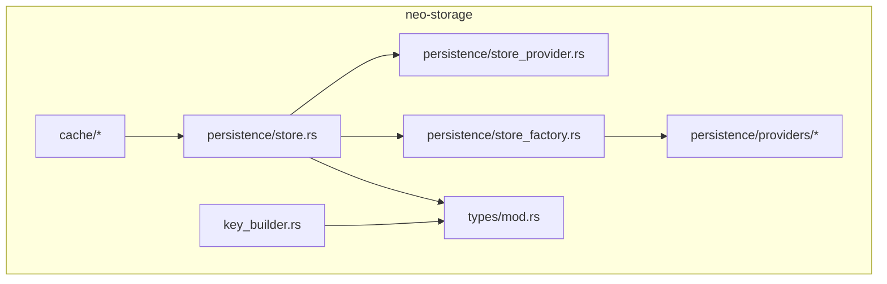
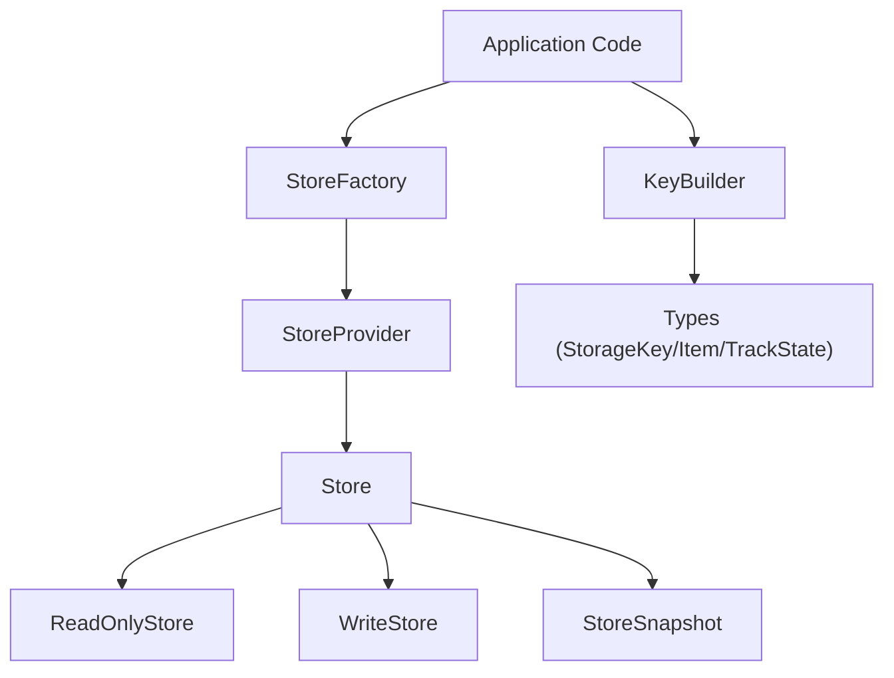
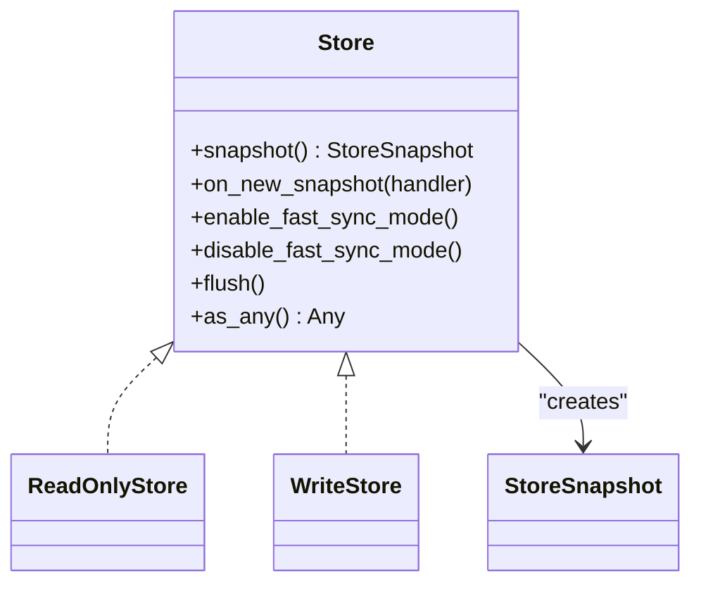
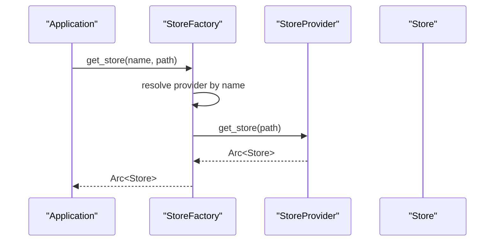
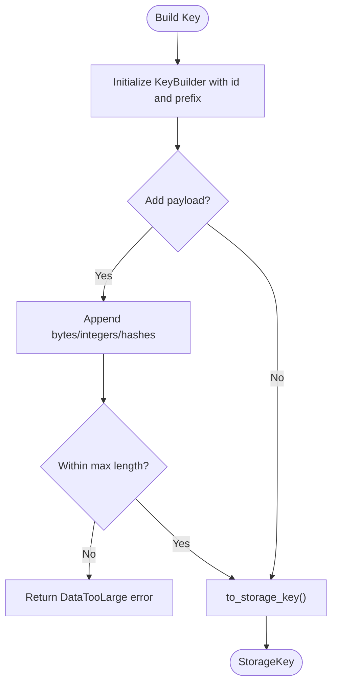
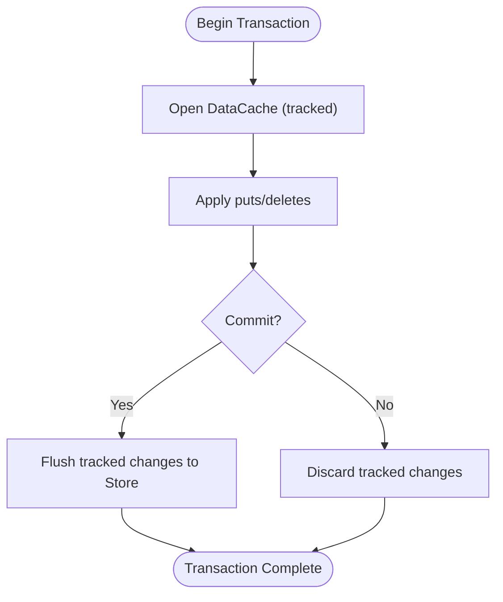
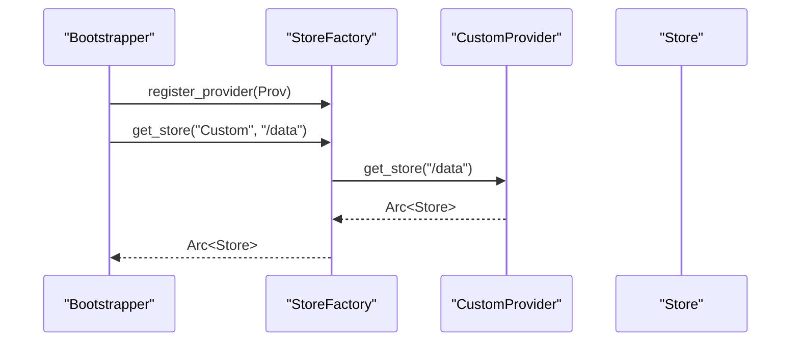
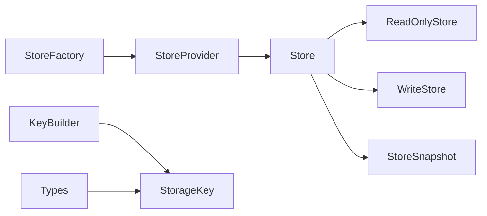

# Storage Architecture

<cite>
**Referenced Files in This Document**
- [lib.rs](file://neo-storage/src/lib.rs)
- [store.rs](file://neo-storage/src/persistence/store.rs)
- [store_provider.rs](file://neo-storage/src/persistence/store_provider.rs)
- [store_factory.rs](file://neo-storage/src/persistence/store_factory.rs)
- [key_builder.rs](file://neo-storage/src/key_builder.rs)
- [mod.rs](file://neo-storage/src/types/mod.rs)
</cite>

## Table of Contents
1. [Introduction](#introduction)
2. [Project Structure](#project-structure)
3. [Core Components](#core-components)
4. [Architecture Overview](#architecture-overview)
5. [Detailed Component Analysis](#detailed-component-analysis)
6. [Dependency Analysis](#dependency-analysis)
7. [Performance Considerations](#performance-considerations)
8. [Troubleshooting Guide](#troubleshooting-guide)
9. [Conclusion](#conclusion)
10. [Appendices](#appendices)

## Introduction
This document explains the storage architecture of Neo-RS blockchain data management with a focus on the pluggable storage abstraction layer. It details the core traits Store, StoreProvider, and StoreFactory that enable multiple backend implementations, describes key-value patterns used across blocks, transactions, accounts, and smart contract state, and outlines the storage key construction system and namespace organization. It also covers the transactional storage model with write tracking and rollback capabilities, the snapshot mechanism for read-only access to historical states, provider lifecycle and initialization procedures, and guidance for implementing custom storage backends and integrating them into the system.

## Project Structure
The storage subsystem is implemented under neo-storage and exposes a cohesive set of modules:
- Core traits and types: store interfaces, snapshots, providers, factory, and shared types (keys, items, seek direction, track state).
- Key building utilities: fluent API for constructing storage keys compatible with C# semantics.
- Cache and persistence layers: in-memory caching with change tracking and provider-backed persistence.



**Diagram sources**
- [store.rs:10-30](file://neo-storage/src/persistence/store.rs#L10-L30)
- [store_provider.rs:6-13](file://neo-storage/src/persistence/store_provider.rs#L6-L13)
- [store_factory.rs:11-55](file://neo-storage/src/persistence/store_factory.rs#L11-L55)
- [key_builder.rs:30-189](file://neo-storage/src/key_builder.rs#L30-L189)
- [mod.rs:1-18](file://neo-storage/src/types/mod.rs#L1-L18)

**Section sources**
- [lib.rs:1-58](file://neo-storage/src/lib.rs#L1-L58)

## Core Components
- Store trait: Unified interface combining read and write operations with snapshot creation, fast-sync toggles, flush, and downcasting support.
- ReadOnlyStore and WriteStore traits: Split responsibilities for reads and writes; Store composes both.
- StoreSnapshot: Read-only view over a point-in-time state enabling consistent historical queries.
- StoreProvider: Factory-like abstraction to create Store instances by name and path.
- StoreFactory: Global registry of providers with default memory provider and lookup/dispatch logic.
- Types: StorageKey, StorageItem, SeekDirection, TrackState define the key-value domain model.
- KeyBuilder: Fluent builder for constructing StorageKey values with length checks and type-safe helpers.

These components together form a pluggable storage layer where application code depends only on traits, while concrete backends are registered via providers.

**Section sources**
- [store.rs:10-30](file://neo-storage/src/persistence/store.rs#L10-L30)
- [store_provider.rs:6-13](file://neo-storage/src/persistence/store_provider.rs#L6-L13)
- [store_factory.rs:11-55](file://neo-storage/src/persistence/store_factory.rs#L11-L55)
- [mod.rs:1-18](file://neo-storage/src/types/mod.rs#L1-L18)
- [key_builder.rs:30-189](file://neo-storage/src/key_builder.rs#L30-L189)

## Architecture Overview
The storage architecture separates concerns into three layers:
- Abstraction layer: Traits (Store, ReadOnlyStore, WriteStore, StoreSnapshot) define stable contracts.
- Provider layer: StoreProvider implementations encapsulate backend-specific initialization and lifetime.
- Registry layer: StoreFactory maintains a global registry of providers and resolves Store instances by name/path.



**Diagram sources**
- [store.rs:10-30](file://neo-storage/src/persistence/store.rs#L10-L30)
- [store_provider.rs:6-13](file://neo-storage/src/persistence/store_provider.rs#L6-L13)
- [store_factory.rs:11-55](file://neo-storage/src/persistence/store_factory.rs#L11-L55)
- [key_builder.rs:30-189](file://neo-storage/src/key_builder.rs#L30-L189)
- [mod.rs:1-18](file://neo-storage/src/types/mod.rs#L1-L18)

## Detailed Component Analysis

### Store Trait and Snapshot Model
- Store extends read and write capabilities and adds snapshot creation, event hooks for new snapshots, optional fast-sync mode, flush, and downcasting.
- Snapshots provide immutable, point-in-time views suitable for consistent reads without interfering with concurrent writes.



**Diagram sources**
- [store.rs:10-30](file://neo-storage/src/persistence/store.rs#L10-L30)

**Section sources**
- [store.rs:10-30](file://neo-storage/src/persistence/store.rs#L10-L30)

### StoreProvider and StoreFactory
- StoreProvider abstracts creation of Store instances by name and path.
- StoreFactory provides:
  - Registration of providers at runtime.
  - Lookup by provider name with fallback to default (memory).
  - Creation of Store instances through the selected provider.



**Diagram sources**
- [store_factory.rs:11-55](file://neo-storage/src/persistence/store_factory.rs#L11-L55)
- [store_provider.rs:6-13](file://neo-storage/src/persistence/store_provider.rs#L6-L13)

**Section sources**
- [store_provider.rs:6-13](file://neo-storage/src/persistence/store_provider.rs#L6-L13)
- [store_factory.rs:11-55](file://neo-storage/src/persistence/store_factory.rs#L11-L55)

### Key-Value Patterns and Namespace Organization
- Keys and values are modeled by StorageKey and StorageItem.
- StorageKey supports contract ID and key suffix bytes, enabling per-contract namespaces.
- KeyBuilder constructs keys with strict length limits and type-safe helpers for UInt160, UInt256, integers, and big-endian BigInts.
- Typical usage patterns:
  - Blocks and transactions: keyed by block height/hash or transaction hash within ledger namespaces.
  - Accounts: keyed by account script hashes within token/account namespaces.
  - Smart contract state: keyed by contract ID plus contract-specific suffixes.



**Diagram sources**
- [key_builder.rs:30-189](file://neo-storage/src/key_builder.rs#L30-L189)

**Section sources**
- [key_builder.rs:30-189](file://neo-storage/src/key_builder.rs#L30-L189)
- [mod.rs:1-18](file://neo-storage/src/types/mod.rs#L1-L18)

### Transactional Storage Model with Write Tracking and Rollback
- WriteStore defines put/delete operations; ReadOnlyStore defines try_get/contains.
- TrackState captures entry changes (e.g., added, changed, deleted, not found) to support atomic commits and rollbacks.
- DataCache provides an in-memory cache layered over a backing Store, tracking changes and exposing commit/rollback semantics.
- Typical flow:
  - Begin a transaction scope using a tracked cache.
  - Apply writes; changes are recorded via TrackState.
  - On success, commit changes to the underlying Store.
  - On failure, discard tracked changes to achieve rollback.



[No sources needed since this diagram shows conceptual workflow, not actual code structure]

### Snapshot Mechanism for Read-Only Historical Access
- Store::snapshot creates a StoreSnapshot representing a consistent view of state at a point in time.
- Consumers can query historical data without blocking writers or risking inconsistent reads.
- Useful for RPC queries, indexing, and verification tasks that require deterministic state at specific heights.

```mermaid
sequenceDiagram
participant Writer as "Writer"
participant Store as "Store"
participant Snap as "StoreSnapshot"
participant Reader as "Reader"
Writer->>Store : put/delete (ongoing)
Store-->>Reader : snapshot() -> Snap
Reader->>Snap : try_get/find (consistent view)
Note over Writer,Reader : Reads do not block writes; snapshot is immutable
```

**Diagram sources**
- [store.rs:10-30](file://neo-storage/src/persistence/store.rs#L10-L30)

**Section sources**
- [store.rs:10-30](file://neo-storage/src/persistence/store.rs#L10-L30)

### Provider Lifecycle Management and Initialization
- Providers are registered once during application startup via StoreFactory::register_provider.
- At runtime, StoreFactory::get_store selects a provider by name and delegates instantiation to StoreProvider::get_store.
- Default behavior falls back to an in-memory provider when no name is specified.
- Backends should initialize resources (connections, caches) inside get_store and ensure thread-safety.



**Diagram sources**
- [store_factory.rs:11-55](file://neo-storage/src/persistence/store_factory.rs#L11-L55)
- [store_provider.rs:6-13](file://neo-storage/src/persistence/store_provider.rs#L6-L13)

**Section sources**
- [store_factory.rs:11-55](file://neo-storage/src/persistence/store_factory.rs#L11-L55)
- [store_provider.rs:6-13](file://neo-storage/src/persistence/store_provider.rs#L6-L13)

### Implementing Custom Storage Backends
To implement a custom backend:
- Implement StoreProvider:
  - Provide a unique name().
  - Implement get_store(path) to construct and return a Store instance configured for the given path.
- Implement Store:
  - Compose ReadOnlyStore and WriteStore for basic key-value operations.
  - Implement snapshot to return a StoreSnapshot.
  - Optionally implement fast-sync, flush, and as_any for advanced features.
- Register your provider early in application startup using StoreFactory::register_provider.

Integration steps:
- Choose a provider name and configure it in your node configuration.
- Use StoreFactory::get_store(name, path) to obtain a Store instance throughout the application.
- Ensure your Store implementation is Send + Sync and handles concurrent access safely.

**Section sources**
- [store_provider.rs:6-13](file://neo-storage/src/persistence/store_provider.rs#L6-L13)
- [store.rs:10-30](file://neo-storage/src/persistence/store.rs#L10-L30)
- [store_factory.rs:11-55](file://neo-storage/src/persistence/store_factory.rs#L11-L55)

## Dependency Analysis
- Store depends on ReadOnlyStore and WriteStore to separate read/write concerns.
- StoreFactory depends on StoreProvider implementations and maintains a global registry.
- KeyBuilder depends on StorageKey and primitive types to build keys safely.
- Types module centralizes StorageKey, StorageItem, SeekDirection, and TrackState used across the system.



**Diagram sources**
- [store.rs:10-30](file://neo-storage/src/persistence/store.rs#L10-L30)
- [store_factory.rs:11-55](file://neo-storage/src/persistence/store_factory.rs#L11-L55)
- [key_builder.rs:30-189](file://neo-storage/src/key_builder.rs#L30-L189)
- [mod.rs:1-18](file://neo-storage/src/types/mod.rs#L1-L18)

**Section sources**
- [store.rs:10-30](file://neo-storage/src/persistence/store.rs#L10-L30)
- [store_factory.rs:11-55](file://neo-storage/src/persistence/store_factory.rs#L11-L55)
- [key_builder.rs:30-189](file://neo-storage/src/key_builder.rs#L30-L189)
- [mod.rs:1-18](file://neo-storage/src/types/mod.rs#L1-L18)

## Performance Considerations
- Prefer using StoreSnapshot for heavy read workloads to avoid locking contention with writers.
- Enable fast-sync mode when supported by the backend to optimize bulk import scenarios.
- Batch writes within a tracked cache to minimize round-trips and leverage transactional commit/rollback.
- Use KeyBuilder to avoid excessive allocations and enforce maximum key sizes to prevent oversized keys.
- Tune provider-specific settings (e.g., RocksDB options) for throughput vs. latency trade-offs.

[No sources needed since this section provides general guidance]

## Troubleshooting Guide
Common issues and resolutions:
- Provider not found: Ensure the provider name matches a registered provider; verify registration occurs before use.
- Data too large errors: Validate key lengths with KeyBuilder; adjust max_length or split keys appropriately.
- Negative BigInteger in keys: KeyBuilder rejects negative BigInts; ensure non-negative values.
- Inconsistent reads: Use StoreSnapshot for consistent historical reads instead of reading from live Store during writes.
- Flushing durability: Call flush on Store when required by your workload to persist pending writes.

**Section sources**
- [store_factory.rs:11-55](file://neo-storage/src/persistence/store_factory.rs#L11-L55)
- [key_builder.rs:30-189](file://neo-storage/src/key_builder.rs#L30-L189)
- [store.rs:10-30](file://neo-storage/src/persistence/store.rs#L10-L30)

## Conclusion
Neo-RS storage architecture centers on a clean, pluggable abstraction layer defined by Store, StoreProvider, and StoreFactory. This design enables multiple backends, robust transactional semantics via tracked caches, and consistent historical reads through snapshots. The key-building utilities and type system ensure safe, efficient key construction aligned with C# compatibility. By following the provider registration and lifecycle guidelines, developers can integrate custom storage engines seamlessly while maintaining performance and correctness.

[No sources needed since this section summarizes without analyzing specific files]

## Appendices

### Example: Using KeyBuilder for Contract State Keys
- Initialize KeyBuilder with contract ID and a namespace prefix.
- Append identifiers such as account hashes or tokens.
- Convert to StorageKey and use with Store operations.

**Section sources**
- [key_builder.rs:30-189](file://neo-storage/src/key_builder.rs#L30-L189)
- [mod.rs:1-18](file://neo-storage/src/types/mod.rs#L1-L18)