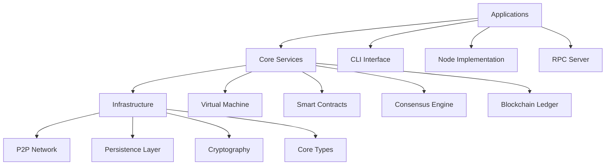
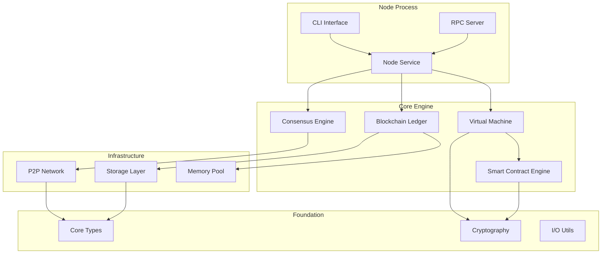
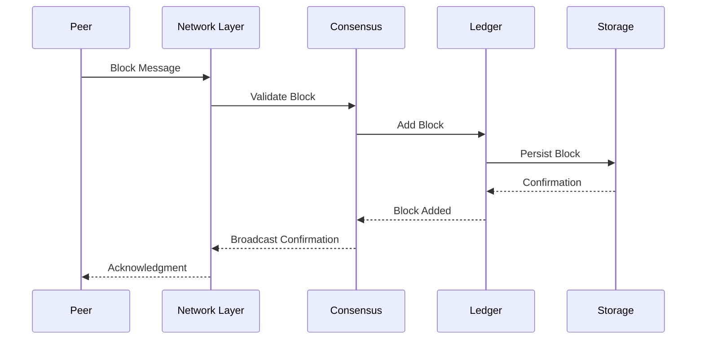
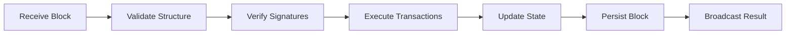
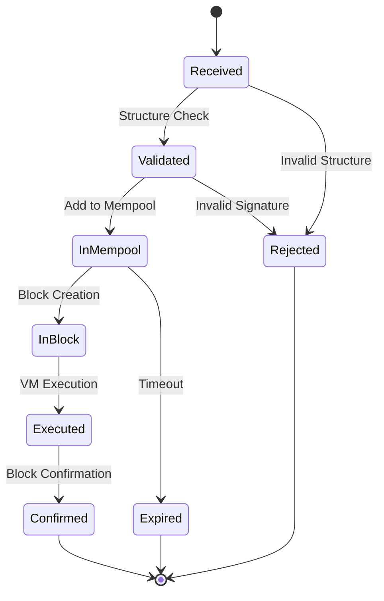
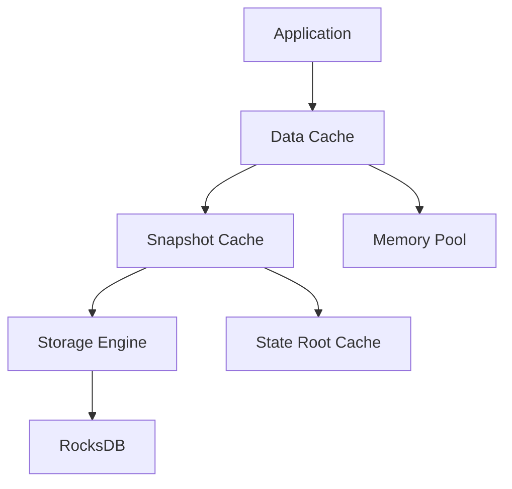

# Neo-RS Architecture

This document describes the high-level architecture of Neo-RS, a Rust implementation of the Neo N3 blockchain protocol.

## Table of Contents

- [Overview](#overview)
- [Design Principles](#design-principles)
- [System Architecture](#system-architecture)
- [Crate Organization](#crate-organization)
- [Data Flow](#data-flow)
- [Key Components](#key-components)
- [Performance Considerations](#performance-considerations)
- [Compatibility](#compatibility)

## Overview

Neo-RS is designed as a modular, high-performance blockchain node implementation that maintains full compatibility with the Neo N3 protocol. The architecture emphasizes:

- **Modularity**: Clear separation of concerns through well-defined crates
- **Performance**: Efficient memory usage and concurrent processing
- **Safety**: Memory safety and thread safety through Rust's type system
- **Maintainability**: Clean interfaces and comprehensive testing

## Design Principles

### 1. Modular Architecture

The codebase is organized into focused crates, each with a single responsibility:



### 2. Layered Design

```
┌─────────────────────────────────────────┐
│            Applications                 │
│  ┌─────────────┐  ┌─────────────────┐  │
│  │     CLI     │  │  Node Service   │  │
│  └─────────────┘  └─────────────────┘  │
├─────────────────────────────────────────┤
│            Core Services                │
│  ┌──────┐ ┌──────────┐ ┌─────────────┐ │
│  │  VM  │ │ Ledger   │ │ Consensus   │ │
│  └──────┘ └──────────┘ └─────────────┘ │
├─────────────────────────────────────────┤
│          Infrastructure                 │
│  ┌──────────┐ ┌────────┐ ┌────────────┐│
│  │ Network  │ │Storage │ │Cryptography││
│  └──────────┘ └────────┘ └────────────┘│
├─────────────────────────────────────────┤
│           Foundation                    │
│  ┌──────────────────────────────────┐  │
│  │        Core Types & Utils        │  │
│  └──────────────────────────────────┘  │
└─────────────────────────────────────────┘
```

### 3. Async-First Design

All I/O operations use async/await with Tokio runtime:

```rust
// Network operations
async fn handle_peer_connection(stream: TcpStream) -> Result<()> {
    // Handle peer communication asynchronously
}

// Storage operations  
async fn store_block(block: Block) -> Result<()> {
    // Persist block data asynchronously
}

// RPC operations
async fn handle_rpc_request(request: RpcRequest) -> RpcResponse {
    // Process RPC requests asynchronously
}
```

## System Architecture

### Component Interaction



### Message Flow



## Crate Organization

### Core Infrastructure

#### `neo-core`
**Purpose**: Fundamental types and utilities used across all crates.

```rust
// Core types
pub struct UInt160([u8; 20]);
pub struct UInt256([u8; 32]);
pub struct Transaction { /* [Implementation complete] */ }
pub struct Block { /* [Implementation complete] */ }

// Utility traits
pub trait Serializable {
    fn serialize(&self) -> Vec<u8>;
    fn deserialize(data: &[u8]) -> Result<Self>;
}
```

**Key Components**:
- Primitive types (UInt160, UInt256)
- Transaction and Block structures
- Serialization traits
- Error types

#### `neo-cryptography`
**Purpose**: All cryptographic operations and algorithms.

```rust
// ECDSA operations
pub struct EcdsaSignature {
    pub r: UInt256,
    pub s: UInt256,
}

// Hashing
pub fn sha256(data: &[u8]) -> UInt256;
pub fn ripemd160(data: &[u8]) -> [u8; 20];

// Address generation
pub fn script_hash_to_address(script_hash: &UInt160) -> String;
```

**Key Components**:
- ECDSA and Ed25519 implementations
- Hash functions (SHA256, RIPEMD160, etc.)
- Merkle tree operations
- Address encoding/decoding

#### `neo-io`
**Purpose**: I/O operations, binary serialization, and data structures.

```rust
// Binary operations
pub struct BinaryReader {
    data: Cursor<Vec<u8>>,
}

impl BinaryReader {
    pub fn read_u8(&mut self) -> Result<u8>;
    pub fn read_var_int(&mut self) -> Result<u64>;
    pub fn read_var_bytes(&mut self) -> Result<Vec<u8>>;
}
```

### Blockchain Components

#### `neo-vm`
**Purpose**: Neo Virtual Machine implementation.

```rust
// VM Engine
pub struct ApplicationEngine {
    state: VmState,
    gas_limit: u64,
    gas_consumed: u64,
    // [Implementation complete]
}

// Stack operations
pub enum StackItem {
    Integer(BigInteger),
    ByteString(Vec<u8>),
    Array(Vec<StackItem>),
    Map(HashMap<StackItem, StackItem>),
    // [Implementation complete]
}
```

**Key Features**:
- Full opcode implementation
- Stack-based execution model
- Interop service integration
- Gas accounting
- Exception handling

#### `neo-ledger`
**Purpose**: Blockchain state management and validation.

```rust
// Blockchain state
pub struct Blockchain {
    storage: Box<dyn Storage>,
    mempool: MemoryPool,
    current_height: u32,
    // [Implementation complete]
}

// Block processing
impl Blockchain {
    pub async fn add_block(&mut self, block: Block) -> Result<()>;
    pub fn get_block(&self, hash: &UInt256) -> Option<Block>;
    pub fn get_transaction(&self, hash: &UInt256) -> Option<Transaction>;
}
```

#### `neo-consensus`
**Purpose**: dBFT consensus algorithm implementation.

```rust
// Consensus engine
pub struct ConsensusEngine {
    context: ConsensusContext,
    validators: Vec<Validator>,
    // [Implementation complete]
}

// Consensus messages
pub enum ConsensusMessage {
    PrepareRequest(PrepareRequestMessage),
    PrepareResponse(PrepareResponseMessage),
    Commit(CommitMessage),
    ChangeView(ChangeViewMessage),
}
```

### Network and Communication

#### `neo-network`
**Purpose**: P2P networking and protocol implementation.

```rust
// P2P Node
pub struct P2PNode {
    peers: HashMap<SocketAddr, Peer>,
    message_handlers: HashMap<MessageType, MessageHandler>,
    // [Implementation complete]
}

// Protocol messages
pub enum Message {
    Version(VersionMessage),
    GetHeaders(GetHeadersMessage),
    Headers(HeadersMessage),
    GetBlocks(GetBlocksMessage),
    // [Implementation complete]
}
```

#### `neo-rpc-server`
**Purpose**: JSON-RPC server implementation.

```rust
// RPC Server
pub struct RpcServer {
    blockchain: Arc<Blockchain>,
    methods: HashMap<String, RpcMethod>,
    // [Implementation complete]
}

// RPC methods
impl RpcServer {
    pub async fn get_block_count(&self) -> Result<u32>;
    pub async fn get_block(&self, hash: UInt256) -> Result<Block>;
    pub async fn send_raw_transaction(&self, tx: Transaction) -> Result<UInt256>;
}
```

### Storage and Persistence

#### `neo-persistence`
**Purpose**: Data storage abstraction and implementations.

```rust
// Storage trait
pub trait Storage: Send + Sync {
    async fn get(&self, key: &[u8]) -> Result<Option<Vec<u8>>>;
    async fn put(&self, key: &[u8], value: &[u8]) -> Result<()>;
    async fn delete(&self, key: &[u8]) -> Result<()>;
}

// RocksDB implementation
pub struct RocksDbStorage {
    db: Arc<rocksdb::DB>,
}
```

## Data Flow

### Block Processing Pipeline



### Transaction Lifecycle



## Key Components

### Virtual Machine Engine

The VM is the heart of smart contract execution:

```rust
pub struct ApplicationEngine {
    // Execution state
    state: VmState,
    invocation_stack: Vec<ExecutionContext>,
    evaluation_stack: EvaluationStack,
    
    // Resources
    gas_limit: u64,
    gas_consumed: u64,
    
    // Storage access
    snapshot: Box<dyn DataCache>,
    
    // Interop services
    interop_service: InteropService,
}
```

### Storage Layer

Multi-layered caching for optimal performance:



### Network Protocol Stack

```
┌─────────────────────────────────────┐
│         Application Layer           │
│    (Consensus Messages, Blocks)     │
├─────────────────────────────────────┤
│         Protocol Layer              │
│     (Message Framing, Types)        │
├─────────────────────────────────────┤
│        Transport Layer              │
│           (TCP/UDP)                 │
└─────────────────────────────────────┘
```

## Performance Considerations

### Memory Management

1. **Zero-Copy Operations**: Minimize data copying using `Bytes` and references
2. **Object Pooling**: Reuse expensive objects like cryptographic contexts
3. **Lazy Loading**: Load data only when needed
4. **Cache Hierarchies**: Multi-level caching for frequently accessed data

### Concurrency

1. **Async I/O**: All I/O operations are asynchronous
2. **Lock-Free Structures**: Use atomic operations where possible
3. **Message Passing**: Prefer channels over shared mutable state
4. **Work Stealing**: Tokio's work-stealing scheduler for CPU-bound tasks

### Optimizations

```rust
// Memory-efficient block processing
pub struct BlockProcessor {
    // Pre-allocated buffers
    signature_buffer: Vec<u8>,
    hash_buffer: [u8; 32],
    
    // Cached computation results
    merkle_cache: LruCache<UInt256, UInt256>,
    script_cache: LruCache<UInt160, Script>,
}

// Zero-copy message parsing
pub fn parse_message(bytes: &Bytes) -> Result<Message> {
    // Parse without copying data
    let header = MessageHeader::from_bytes(&bytes[..24])?;
    let payload = &bytes[24..];
    // [Implementation complete]
}
```

## Compatibility

### C# Neo Compatibility

Neo-RS maintains protocol-level compatibility with C# Neo:

1. **Binary Compatibility**: Identical serialization formats
2. **Cryptographic Compatibility**: Same algorithms and parameters
3. **Network Compatibility**: Compatible P2P protocol
4. **VM Compatibility**: Identical execution semantics

### Testing Strategy

```rust
// C# compatibility tests
#[test]
fn test_transaction_serialization_compatibility() {
    // Test against known C# serialization output
    let tx = create_test_transaction();
    let serialized = tx.to_bytes();
    assert_eq!(serialized, EXPECTED_CSHARP_BYTES);
}

// Cross-implementation testing
#[test]
fn test_vm_execution_compatibility() {
    // Execute same script, compare results
    let script = compile_test_script();
    let result = execute_script(&script);
    assert_eq!(result, EXPECTED_CSHARP_RESULT);
}
```

This architecture provides a solid foundation for a high-performance, maintainable Neo blockchain implementation while ensuring full compatibility with the existing Neo ecosystem.