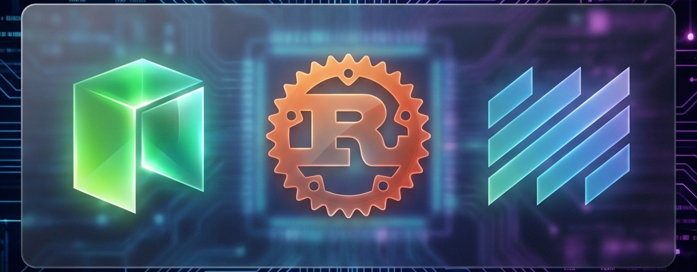
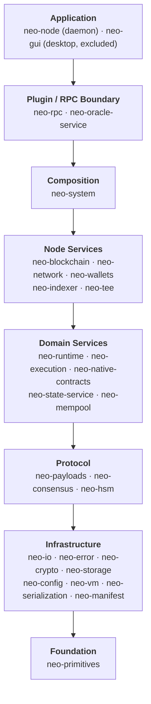

<p align="center">
  
</p>

# neo-rs

A complete **Neo N3 blockchain node in Rust** — a from-scratch reimplementation of
the C# reference node with byte-for-byte protocol parity (Neo N3 **v3.10.0**). It
joins the real MainNet/TestNet, produces the same block hashes and state roots,
runs the NeoVM and dBFT 2.0 consensus, and serves the standard JSON-RPC API.

[](https://github.com/r3e-network/neo-rs/actions)
[](https://opensource.org/licenses/MIT)
[](https://www.rust-lang.org)

> **New here?** This README is a complete tour. For depth, the [`docs/`](./docs/README.md)
> system explains the architecture, dataflow, configuration, and full RPC API with
> diagrams and tables.

---

## What it is

neo-rs is a production node implementation that speaks Neo N3's wire protocol,
executes its virtual machine, and maintains its ledger and state exactly as the
canonical C# node does — so the two are interchangeable on the same network. It
is organized as a 7-layer Rust workspace of 28 focused crates, built on mature
libraries (MDBX, RocksDB, jsonrpsee, the RustCrypto suite) with the protocol-defining
parts (NeoVM, var-int wire format, MPT, dBFT) implemented from the specification.

## What it supports

| Area | Support |
|------|---------|
| **Networks** | MainNet, TestNet, and private nets (configurable) |
| **Consensus** | dBFT 2.0 (single-block finality, view changes) |
| **Virtual machine** | NeoVM with full opcode + interop surface and gas metering |
| **State** | Merkle-Patricia Trie state root, proofs (`getproof`/`getstate`) |
| **Native contracts** | NEO, GAS, Policy, Oracle, Notary, StdLib, CryptoLib, RoleManagement, ContractManagement, Ledger, Treasury |
| **Standards** | NEP-17 (tokens), NEP-11 (NFTs), NEP-6 (wallets), NEP-2 keys |
| **Hardforks** | Full Neo N3 hardfork schedule through v3.10.0 |
| **JSON-RPC** | ~55 methods (blockchain, state, invocation, governance, wallet, oracle) |
| **Storage** | MDBX by default, RocksDB fallback, typed table codecs, hot/cold provider boundaries, or in-memory |
| **Oracle** | HTTPS + NeoFS request fulfilment |

See [docs/protocol-compatibility.md](./docs/protocol-compatibility.md) for the parity details.

## Architecture at a glance

The workspace is organized into **7 layers, 26 production crates** (plus the
`neo-test-fixtures` dev crate) so dependencies flow strictly downward —
Foundation crates know nothing of the services above them.


```mermaid
flowchart TD
    APP["<b>Application</b><br/>neo-node (daemon) · neo-gui (desktop, excluded)"]
    PLUG["<b>Plugin / RPC Boundary</b><br/>neo-rpc · neo-oracle-service"]
    COMP["<b>Composition</b><br/>neo-system"]
    NODE["<b>Node Services</b><br/>neo-blockchain · neo-network · neo-wallets<br/>neo-indexer · neo-tee"]
    DOM["<b>Domain Services</b><br/>neo-runtime · neo-execution · neo-native-contracts<br/>neo-state-service · neo-mempool"]
    PROTO["<b>Protocol</b><br/>neo-payloads · neo-consensus · neo-hsm"]
    INF["<b>Infrastructure</b><br/>neo-io · neo-error · neo-crypto · neo-storage<br/>neo-config · neo-vm · neo-serialization · neo-manifest"]
    FND["<b>Foundation</b><br/>neo-primitives"]
    APP --> PLUG --> COMP --> NODE --> DOM --> PROTO --> INF --> FND
```

The architecture follows patterns from **reth** (provider traits, the sealed
`NodeTypes` seam, pipeline stage abstraction,
feature-gated RPC) and **Polkadot/Substrate** (bounded context layers,
per-domain error types, service trait composition). See [`design.md`](./design.md)
for the full ADR log and the 4-phase evolution roadmap, and [docs/architecture.md](./docs/architecture.md)
for the full crate reference. How a block, transaction, and consensus round
flow through these crates: [docs/dataflow.md](./docs/dataflow.md).

## Quick start

Requires Rust **1.85+** and the usual build toolchain for the bundled native
storage backends — see [getting-started.md](./docs/getting-started.md).

```bash
# Clone and build the node daemon (release)
git clone https://github.com/r3e-network/neo-rs
cd neo-rs
cargo build --release -p neo-node

# Run a TestNet node
./target/release/neo-node --config config/testnet.toml

# ...or MainNet
./target/release/neo-node --config config/mainnet.toml

# RPC/indexer service-provider preset
./target/release/neo-node --config config/testnet-service.toml

# Same idea in Docker
docker run -d --name neo-node \
  -p 20332:20332 -p 20333:20333 -p 19091:9091 \
  -v "$(pwd)/data:/data" \
  -e NEO_NETWORK=testnet \
  -e NEO_PROFILE=service \
  neo-rs
```

Query a running node over JSON-RPC (default MainNet port `10332`):

```bash
# Node version, network, and active hardforks
curl -s localhost:10332 -H 'Content-Type: application/json' \
  -d '{"jsonrpc":"2.0","id":1,"method":"getversion","params":[]}'

# Current block height
curl -s localhost:10332 -H 'Content-Type: application/json' \
  -d '{"jsonrpc":"2.0","id":1,"method":"getblockcount","params":[]}'

# Built-in indexer status (enabled in the shipped node configs)
curl -s localhost:10332 -H 'Content-Type: application/json' \
  -d '{"jsonrpc":"2.0","id":1,"method":"getindexerstatus","params":[]}'
```

The shipped `config/*.toml` and `neo_*_node.toml` presets start the RPC,
NeoIndexer, ApplicationLogs, and TokensTracker service stack with durable
paths. Use `config/*-service.toml` when you want a NeoFura-style RPC/indexer
endpoint with StateService, metrics, health checks, and JSON file logs enabled.
In Docker, set `NEO_PROFILE=service`; the entrypoint uses the same presets and
rewrites bind addresses and service data paths in a temporary config copy so
published ports and mounted volumes work.
The full RPC surface is in [docs/rpc-api.md](./docs/rpc-api.md).

## Documentation

The [`docs/`](./docs/README.md) directory is a self-contained learning system —
you can understand the whole node without reading source.

| Doc | What you'll learn |
|-----|-------------------|
| [Getting started](./docs/getting-started.md) | Install, build, and run your first node |
| [Architecture](./docs/architecture.md) | The 7-layer workspace design and key decisions |
| [Dataflow](./docs/dataflow.md) | How blocks, transactions, consensus, and state move through the node |
| [Configuration](./docs/configuration.md) | Every TOML section and key, with defaults |
| [RPC API](./docs/rpc-api.md) | All JSON-RPC methods, grouped, with examples |
| [Protocol & compatibility](./docs/protocol-compatibility.md) | Neo N3 v3.10.0 parity, native contracts, hardforks |
| [Operations](./docs/operations.md) | Deploy, monitor, secure, back up, and upgrade |
| [Coding/design guidance](./docs/coding-design-architecture-guidance.md) | High-level domain-flow style, fluent APIs, abstraction layers, module organization |
| [Architecture design (ADR)](./design.md) | Full ADR log, reth/polkadot comparison, 4-phase evolution roadmap |

**Learning paths:** operators → *getting-started → configuration → operations*;
developers → *architecture → dataflow → protocol-compatibility → rpc-api*.

## Project layout

```
neo-rs/
├── neo-primitives                          # L0 Foundation — primitive types
├── neo-io, neo-error, neo-crypto,          # L1 Infrastructure
│   neo-storage, neo-config,
│   neo-vm, neo-serialization, neo-manifest
├── neo-payloads, neo-consensus, neo-hsm    # L2 Protocol
├── neo-runtime, neo-execution,             # L3 Domain Services
│   neo-native-contracts, neo-state-service,
│   neo-mempool
├── neo-blockchain, neo-network, neo-wallets,# L4 Node Services
│   neo-indexer, neo-tee
├── neo-system                              # L5 Composition
├── neo-rpc, neo-oracle-service             # L6 Plugin / RPC Boundary
├── neo-node                                # L7 Application (daemon binary)
├── design.md                               # full ADR log + evolution roadmap
├── config/                                 # mainnet/testnet TOML configs
├── docs/                                   # the documentation system
└── tests/ (neo-tests), benches-package/    # dev-only: integration tests, benchmarks
    fuzz/                                   # dev-only: fuzzing
```

## Build and test

```bash
cargo build --release -p neo-node       # the node daemon
cargo test  --workspace                 # workspace test suite
cargo clippy --workspace --all-targets  # lints (policy in [workspace.lints])
```

Coding standards and the lint/error/style conventions are in
[CONVENTIONS.md](./CONVENTIONS.md).

## Contributing

Contributions are welcome — see [CONTRIBUTING.md](./CONTRIBUTING.md) and
[CONVENTIONS.md](./CONVENTIONS.md). Work on a feature branch, keep `cargo test`,
`cargo clippy`, and `cargo fmt --check` green, and match the existing style.

## Security

Report vulnerabilities per [SECURITY.md](./SECURITY.md). Before exposing RPC
beyond localhost, read the hardening guidance in
[docs/operations.md](./docs/operations.md).

## License

Licensed under the [MIT License](./LICENSE).
