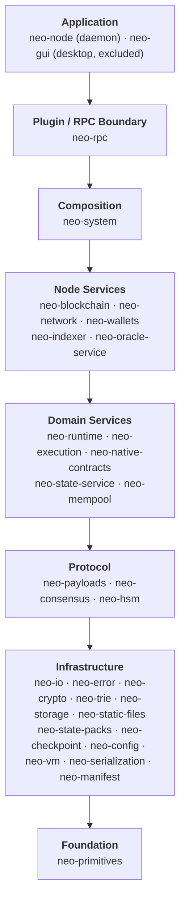

<p align="center">
  
</p>

# neo-rs

An in-progress **Neo N3 blockchain node in Rust** targeting byte-for-byte
compatibility with the C# reference node through Neo N3 **v3.10.1**. The node
can join Neo networks, replay verified MainNet ranges, execute NeoVM and native
contracts, maintain MPT state, and serve the standard JSON-RPC API. Complete
MainNet replay, every hardfork boundary, and production interchangeability are
still release gates, not current claims.

[](https://github.com/r3e-network/neo-rs/actions)
[](https://opensource.org/licenses/MIT)
[](docs/MAINNET_VALIDATION.md)
[](https://www.rust-lang.org)

> **New here?** This README is a complete tour. For depth, the [`docs/`](./docs/README.md)
> system explains the architecture, dataflow, configuration, and full RPC API with
> diagrams and tables.

---

## What it is

neo-rs is a from-scratch node implementation intended to speak Neo N3's wire
protocol, execute its virtual machine, and maintain the same ledger and state
as the canonical C# node. It is not yet promoted as a production replacement:
the retained StateRoot-enabled MainNet replay evidence reaches height
**3,457,022** with the same root on paired replicas, and a StateRoot-disabled
ledger replay reaches the available archive tip at **11,492,708**. Full-history
StateRoot replay and later-hardfork evidence remain incomplete. It is organized
as an 8-layer, multi-crate Rust workspace built on mature
libraries (MDBX, jsonrpsee, the RustCrypto suite) with the protocol-defining
parts (NeoVM, var-int wire format, MPT, dBFT) implemented from the specification.

## Implemented surface

The table describes implemented code paths, not blanket production-parity
evidence. See [docs/protocol-compatibility.md](./docs/protocol-compatibility.md)
for the distinction between component tests, bounded replay evidence, and
remaining release gates.

| Area | Support |
|------|---------|
| **Networks** | Validated built-in MainNet and TestNet chain specifications; daemon-loaded private specs are not yet supported |
| **Consensus** | dBFT 2.0 (single-block finality, view changes) |
| **Virtual machine** | NeoVM with full opcode + interop surface and gas metering |
| **State** | Merkle-Patricia Trie state root, proofs (`getproof`/`getstate`) |
| **Native contracts** | NEO, GAS, Policy, Oracle, Notary, StdLib, CryptoLib, RoleManagement, ContractManagement, Ledger, Treasury |
| **Standards** | NEP-17 (tokens), NEP-11 (NFTs), NEP-6 (wallets), NEP-2 keys |
| **Hardforks** | Neo N3 hardfork enum through v3.10.1 with MainNet/TestNet activation schedules; replay evidence across all activation boundaries remains pending |
| **JSON-RPC** | ~55 methods (blockchain, state, invocation, governance, wallet, oracle) |
| **Storage** | MDBX, append-only static Ledger archives, hot/cold provider factories, or ephemeral in-memory storage |
| **Oracle** | HTTPS + NeoFS request fulfilment |

## Sync and execution optimizations

The release keeps one canonical semantic path: workspace `neo-vm` executes all
scripts, canonical block import commits heights in order, and every accelerator
must fall back without changing protocol-visible bytes or state. The following
optimizations are implemented:

- **Bulk archive and network import.** `chain.acc`, P2P, and RPC submissions feed
  the typed import pipeline. Bounded queues, durable stage checkpoints, ordered
  batch commits, and resumable import markers amortize per-block orchestration
  without publishing a block before its storage fence succeeds.
- **Continuous empty-block fast-forward.** Eligible consecutive empty blocks
  bypass transaction-engine construction and apply the exact native reward
  transition as one bounded run. Hardfork, native-contract, observer, and
  committing-hook gates force the ordinary per-block path whenever the shortcut
  is not provably equivalent.
- **Engine and object reuse.** Multi-transaction blocks reuse an
  `ApplicationEngine` and block-local transaction/cache containers after a full
  reset. Immutable native binding tables, contract-method metadata, VM jump
  tables, and parsed instruction maps are reused instead of rebuilt per call.
- **Bounded caching.** Storage overlays cache reads and proven misses; native
  dispatch caches are keyed by contract identity and semantic call inputs.
  Stateful execution output is never cached as a pure result.
- **Optimistic signature preverification.** An opt-in bounded worker pool
  overlaps standard P-256 header-witness checks with ordered import. Results are
  bound to the complete header/witness context and are consumed only inside the
  canonical NeoVM verification fence; unsupported, stale, failed, or saturated
  work falls back synchronously.
- **StateRoot finalization and state packs.** Deferred MPT journals fuse backing
  reference resolution into the durable cursor pass. State-pack publication
  copies values directly into checksummed append frames, and large immutable
  value reads can use a bounded shared pool. Ordered roots and reopen validation
  remain mandatory.

Optimistic transaction/block execution and guarded script specialization exist
only behind dependency capture, shadow comparison, and sequential fallback
gates. They are not enabled as production sync shortcuts in this release.

## Measured performance

All numbers below are release-build MainNet archive replays on the same 8-vCPU,
62 GiB host family. A/B rows compare the same data and durability mode. Overall
BPS includes execution, finalization, and canonical persistence; transaction and
empty-block BPS are narrower stage rates and must not be averaged together.

| Mode / accepted change | Before | After | Observed gain |
|---|---:|---:|---:|
| StateRoot enabled, optimistic header signature preverification, 5,000 blocks | 255.04 BPS | 346.63 BPS | **+35.91%** |
| StateRoot enabled, one-copy state-pack publication, 5,000 blocks | 318.36 BPS | 343.46 BPS | **+7.88%** |
| StateRoot enabled, bounded pack value-read pool, 10,000 pooled blocks | 424.72 BPS | 436.69 BPS | **+2.82%** |
| StateRoot disabled, full remaining archive `3,875,678..11,492,708` | n/a | **1,938.65 BPS** overall | unpaired supplemental result |

The full StateRoot-disabled continuation imported **7,617,031 blocks** and
**4,609,575 transactions** in **3,929.03 seconds**. Its transaction-bearing
stage processed 1,543,571 blocks at 674.82 BPS; the empty-block stage processed
6,073,460 blocks at 50,130.55 BPS. It performed zero MPT apply attempts by
construction. See the
[full archive report](./reports/performance/mainnet-full-archive-no-stateroot-3875677-11492708-20260724.md),
[signature A/B](./reports/performance/optimistic-signature-verification-20260721.md),
[one-copy A/B](./reports/performance/mainnet-authoritative-one-copy-ab-3382022-3387022-20260719.md),
and [bounded-pool A/B](./reports/performance/mainnet-authoritative-shared-pool-ab-3417022-3427022-20260720.md).

The production requirement remains **2,000 BPS with StateRoot enabled**. This
release does not meet that gate, and the StateRoot-disabled result is not a
substitute. StateRoot is disabled by default for operators; enable it explicitly
with `--enable-stateroot` or `--stateroot true`.

## Architecture at a glance

The workspace is organized into **8 ordered layers, 29 production workspace members**
(plus 3 development-only members). Dependencies flow downward or through
an explicitly audited, one-way same-layer edge, so foundation crates know
nothing of the services above them.


```mermaid
flowchart TD
    APP["<b>Application</b><br/>neo-node (daemon) · neo-gui (desktop, excluded)"]
    PLUG["<b>Plugin / RPC Boundary</b><br/>neo-rpc"]
    COMP["<b>Composition</b><br/>neo-system"]
    NODE["<b>Node Services</b><br/>neo-blockchain · neo-network · neo-wallets<br/>neo-indexer · neo-oracle-service"]
    DOM["<b>Domain Services</b><br/>neo-runtime · neo-execution · neo-native-contracts<br/>neo-state-service · neo-mempool"]
    PROTO["<b>Protocol</b><br/>neo-payloads · neo-consensus · neo-hsm"]
    INF["<b>Infrastructure</b><br/>neo-io · neo-error · neo-crypto · neo-trie · neo-storage · neo-static-files<br/>neo-state-packs · neo-checkpoint · neo-config · neo-vm · neo-serialization · neo-manifest"]
    FND["<b>Foundation</b><br/>neo-primitives"]
    APP --> PLUG --> COMP --> NODE --> DOM --> PROTO --> INF --> FND
```

The architecture follows patterns from **reth** (immutable chain specs,
provider capabilities, concrete composition builders, pipeline stage
abstraction, feature-gated RPC) and **Polkadot/Substrate** (bounded context layers,
per-domain error types, service trait composition). See [`design.md`](./design.md)
for the full ADR log and the 4-phase evolution roadmap, and [docs/architecture.md](./docs/architecture.md)
for the full crate reference. How a block, transaction, and consensus round
flow through these crates: [docs/dataflow.md](./docs/dataflow.md).

The daemon lifecycle is staged and intentionally short:
`NodeCommand -> OpenNodeRuntime -> NodeRuntime -> RunningNode`. Reusable core
assembly lives in `neo-system::NodeCoreBuilder`; `neo-node` retains process
policy such as CLI/config selection, optional services, observability, and task
supervision.

## Quick start

Requires Rust **1.89+** and the usual build toolchain for the bundled native
storage backends — see [getting-started.md](./docs/getting-started.md).

```bash
# Clone and build the node daemon (release)
git clone https://github.com/r3e-network/neo-rs
cd neo-rs
cargo build --release -p neo-node

# Run a TestNet node
./target/release/neo-node --config config/testnet.toml

# ...or MainNet
./target/release/neo-node --config config/mainnet.toml

# RPC/indexer service-provider preset
./target/release/neo-node --config config/testnet-service.toml

# Same idea in Docker
docker run -d --name neo-node \
  -p 20332:20332 -p 20333:20333 -p 19091:9091 \
  -v "$(pwd)/data:/data" \
  -e NEO_NETWORK=testnet \
  -e NEO_PROFILE=service \
  neo-rs
```

Query a running node over JSON-RPC (default MainNet port `10332`):

```bash
# Node version, network, and active hardforks
curl -s localhost:10332 -H 'Content-Type: application/json' \
  -d '{"jsonrpc":"2.0","id":1,"method":"getversion","params":[]}'

# Current block height
curl -s localhost:10332 -H 'Content-Type: application/json' \
  -d '{"jsonrpc":"2.0","id":1,"method":"getblockcount","params":[]}'

# Built-in indexer status (enabled in the shipped node configs)
curl -s localhost:10332 -H 'Content-Type: application/json' \
  -d '{"jsonrpc":"2.0","id":1,"method":"getindexerstatus","params":[]}'
```

The shipped `config/*.toml` and `neo_*_node.toml` presets start the RPC,
NeoIndexer, ApplicationLogs, and TokensTracker service stack with durable
paths. Use `config/*-service.toml` when you want a NeoFura-style RPC/indexer
endpoint with StateService, metrics, health checks, and JSON file logs enabled.
In Docker, set `NEO_PROFILE=service`; the entrypoint uses the same presets and
rewrites bind addresses and service data paths in a temporary config copy so
published ports and mounted volumes work.
The full RPC surface is in [docs/rpc-api.md](./docs/rpc-api.md).

## Documentation

The [`docs/`](./docs/README.md) directory is a self-contained learning system —
you can understand the whole node without reading source.

| Doc | What you'll learn |
|-----|-------------------|
| [Getting started](./docs/getting-started.md) | Install, build, and run your first node |
| [Architecture](./docs/architecture.md) | The 8-layer workspace design and key decisions |
| [Dataflow](./docs/dataflow.md) | How blocks, transactions, consensus, and state move through the node |
| [Configuration](./docs/configuration.md) | Every TOML section and key, with defaults |
| [RPC API](./docs/rpc-api.md) | All JSON-RPC methods, grouped, with examples |
| [Protocol & compatibility](./docs/protocol-compatibility.md) | Neo N3 v3.10.1 parity, native contracts, hardforks |
| [Operations](./docs/operations.md) | Deploy, monitor, secure, back up, and upgrade |
| [Coding/design guidance](./docs/coding-design-architecture-guidance.md) | High-level domain-flow style, fluent APIs, abstraction layers, module organization |
| [Architecture design (ADR)](./design.md) | Full ADR log, reth/polkadot comparison, 4-phase evolution roadmap |

**Learning paths:** operators → *getting-started → configuration → operations*;
developers → *architecture → dataflow → protocol-compatibility → rpc-api*.

## Future work

### Verifiable NeoFS checkpoints (deferred)

The current engineering priority is exact Neo N3 v3.10.1 correctness, clean
crate ownership, and complete deterministic MainNet StateRoot replay.
NeoFS checkpoint distribution is therefore not wired into node startup,
storage, networking, or RPC.

The proposed mandatory V1 is intentionally small: deterministic commitments to
current non-Ledger state, Ledger state, and the canonical block archive; the
existing validator-signed StateRoot plus a supplementary StateValidator
certificate for the Ledger/block binding; untrusted NeoFS object transport;
atomic full-node import; and locally verified point proofs for light clients.
It excludes zero-knowledge proofs, historical or compact MPT transport, erasure
coding, lazy activation, checkpoint deltas, range proofs, logs, and notification
archives.

The dependency-light `neo-checkpoint` crate currently provides only isolated
canonical format and commitment scaffolding. It is not a supported exporter,
importer, trust path, or fast-sync mode. The complete deferred design and
promotion gates are tracked in
[`neofs-verifiable-checkpoint-v1`](./openspec/changes/neofs-verifiable-checkpoint-v1/).

## Project layout

```
neo-rs/
├── neo-primitives                          # L0 Foundation — primitive types
├── neo-io, neo-error, neo-crypto, neo-trie, # L1 Infrastructure
│   neo-storage, neo-static-files, neo-config,
│   neo-state-packs, neo-checkpoint, neo-vm,
│   neo-serialization, neo-manifest
├── neo-payloads, neo-consensus, neo-hsm    # L2 Protocol
├── neo-runtime, neo-execution,             # L3 Domain Services
│   neo-native-contracts, neo-state-service,
│   neo-mempool
├── neo-blockchain, neo-network, neo-wallets,# L4 Node Services
│   neo-indexer, neo-oracle-service
├── neo-system                              # L5 Composition
├── neo-rpc                                 # L6 Plugin / RPC Boundary
├── neo-node                                # L7 Application (daemon binary)
├── design.md                               # full ADR log + evolution roadmap
├── config/                                 # mainnet/testnet TOML configs
├── docs/                                   # the documentation system
└── tests/ (neo-tests), benches-package/    # dev-only: integration tests, benchmarks
    fuzz/                                   # dev-only: fuzzing
```

## Build and test

```bash
cargo build --release -p neo-node       # the node daemon
cargo test  --workspace                 # workspace test suite
cargo clippy --workspace --all-targets  # lints (policy in [workspace.lints])
cargo bench -p neo-benches --bench block_import -- mdbx_blocks --quick
                                        # canonical transaction-import regression
```

Coding standards and the lint/error/style conventions are in
[CONVENTIONS.md](./CONVENTIONS.md).

## Contributing

Contributions are welcome — see [CONTRIBUTING.md](./CONTRIBUTING.md) and
[CONVENTIONS.md](./CONVENTIONS.md). Work on a feature branch, keep `cargo test`,
`cargo clippy`, and `cargo fmt --check` green, and match the existing style.

## Security

Report vulnerabilities per [SECURITY.md](./SECURITY.md). Before exposing RPC
beyond localhost, read the hardening guidance in
[docs/operations.md](./docs/operations.md).

## License

Licensed under the [MIT License](./LICENSE).
