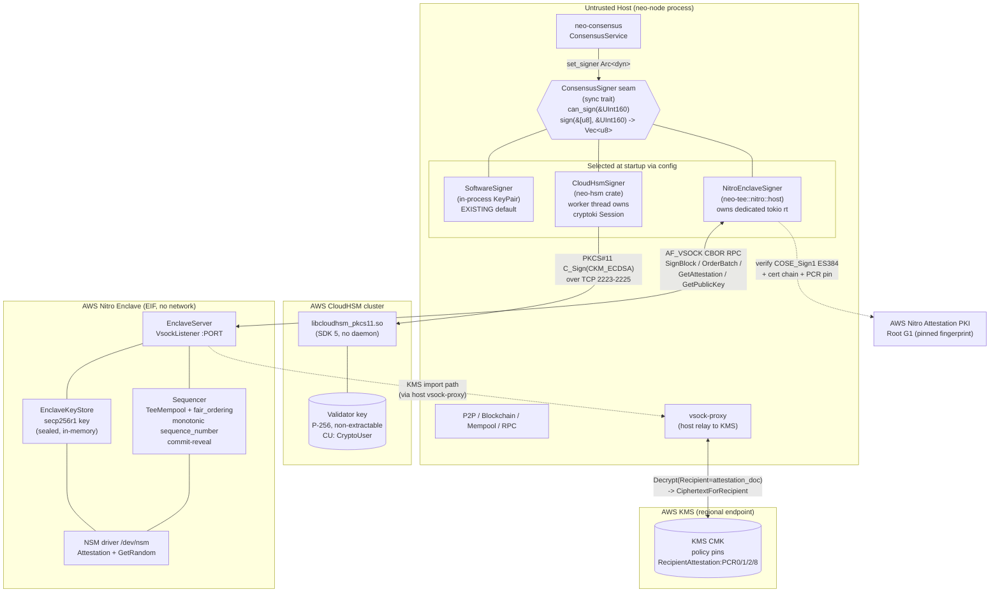

# AWS CloudHSM + Nitro Enclaves for neo-rs: Key Management & Fair Ordering

**Status:** Design (implementation-ready) · **Date:** 2026-06-14 · **Target:** neo-rs (Neo N3 node, Rust)

This document synthesizes three research streams into one concrete plan for adding two
optional, feature-gated capabilities to the neo-rs node:

1. **AWS CloudHSM** as a key-management backend — validator/consensus signing keys held in
   the HSM, accessed over PKCS#11, surfaced through `neo_consensus::ConsensusSigner`.
2. **AWS Nitro Enclaves** as a TEE that holds keys **and** performs verifiable fair
   transaction ordering — the signer is a thin host-side stub that forwards over `vsock` to
   the enclave, which owns the private key, the NSM attestation, the sealed-key store, and
   the existing fair-ordering sequencer.

Both backends plug into the **same** synchronous seam (`ConsensusSigner`) and produce
**byte-identical** Neo N3 consensus signatures (64-byte `r||s` secp256r1, low-s normalized),
so 100% protocol parity is preserved. The HSM/enclave only changes *where the key lives* and
*how transaction order is decided* — never the signed bytes.

---

## 1. Goal & Scope

### What "support CloudHSM + Nitro TEE" concretely means

| Capability | Concretely | Code vs Operational |
| --- | --- | --- |
| CloudHSM key management | A `CloudHsmSigner: ConsensusSigner` that logs in as a Crypto User over PKCS#11, finds the validator key by label, and signs `SHA-256(data)` with `CKM_ECDSA`, returning low-s-normalized 64-byte `r||s`. | **Code:** the signer + node wiring. **Operational:** CloudHSM cluster, CU creation, key generation, `configure-pkcs11`, security-group ports. |
| Nitro key management | The validator secp256r1 key is generated in-enclave (or imported via KMS attested-decrypt) and **never leaves the enclave**. The host's `NitroEnclaveSigner: ConsensusSigner` forwards a `SignBlock` request over `vsock`. | **Code:** enclave binary + host stub + attestation verify. **Operational:** Nitro-enabled EC2, allocator reservation, EIF build, KMS key + policy, `vsock-proxy`. |
| Nitro fair ordering | The existing in-enclave `fair_ordering.rs` (commit-reveal, monotonic in-enclave `sequence_number`, NSM-randomness tiebreak) runs **inside the attested EIF**. The enclave returns an ordered tx-hash list plus an attestation/`OrderingProof` that peers can verify. | **Code:** move the sequencer behind the vsock server + attestation wrapper; opt-in dBFT extension. **Operational:** all validators run the same pinned EIF for enforcement. |

### Non-goals / invariants

- **No consensus byte changes.** Signed message bytes (`network_le(4) || block_hash(32)`),
  SHA-256 pre-hash, secp256r1, low-s, 64-byte `r||s`, and the redeem script are all
  unchanged. A CloudHSM/Nitro validator is wire-indistinguishable from a software validator.
- **Fair-ordering enforcement is opt-in (v1).** Carrying an ordering proof in consensus is
  **not** stock Neo N3 dBFT. v1 ships it advisory over `ExtensiblePayload`; making it a hard
  validity rule is a future, separately-gated hardfork (mandatory attestation is a liveness
  risk — one faulty enclave or AWS outage could stall the network).
- **Default build unchanged.** Everything is behind `--features hsm` / `--features tee-nitro`;
  the default node compiles and runs exactly as today.

---

## 2. Architecture



**Key flows on the diagram**
- The **seam** is the synchronous `neo_consensus::ConsensusSigner`. Exactly one backend is
  selected at startup and handed to the service via `set_signer(Some(Arc::new(...)))`.
- **CloudHSM:** the host signer round-trips to a worker thread that owns the (`!Sync`)
  cryptoki `Session`; the worker calls `C_Sign` against the HSM over TCP.
- **Nitro:** the host signer round-trips over `vsock` into the enclave, which owns the key and
  the sequencer. The enclave reaches KMS only through the host `vsock-proxy`. The host (and
  peers) verify enclave attestation documents against the pinned Nitro Root G1.

---

## 3. Crate / Module Plan

### 3.1 `neo-hsm` (revived, CloudHSM-focused)

Re-add to `[workspace.members]`. Acyclic: `neo-hsm` depends on `neo-consensus` (to impl its
trait); `neo-consensus` does **not** depend on `neo-hsm`. Verify with
`cargo tree -i neo-hsm` after wiring.

```toml
# neo-hsm/Cargo.toml
[features]
default  = []
cloudhsm = ["dep:cryptoki"]   # PKCS#11 backend; CloudHSM speaks PKCS#11

[dependencies]
cryptoki      = { version = "0.12", optional = true }  # latest 2026-01; API stable 0.8->0.12
neo-crypto    = { workspace = true }   # Crypto::sha256, Secp256r1Crypto::normalize_low_s, SEC1 compress
neo-consensus = { workspace = true }   # ConsensusSigner trait + ConsensusResult/ConsensusError
neo-primitives= { workspace = true }   # UInt160
thiserror     = { workspace = true }
zeroize       = { workspace = true }   # CU password / transient material
tracing       = { workspace = true }
hex           = { workspace = true }
```

| Module | Responsibility |
| --- | --- |
| `error.rs` | `HsmError` (thiserror; port recovered enum + add `Disconnected`, `FeatureNotEnabled`). `HsmResult<T>`. `impl From<HsmError> for ConsensusError` mapping to `ConsensusError::state_error(...)` (verified at `neo-consensus/src/error.rs:191`). |
| `config.rs` | `CloudHsmConfig { library_path: PathBuf (default `/opt/cloudhsm/lib/libcloudhsm_pkcs11.so`), slot: Option<u64>, cu_user: String, cu_password: Zeroizing<String>, key_label: String, key_id: Option<String> }`. Password sourced from env, never TOML. |
| `worker.rs` | The **session-owning thread**. Owns `Pkcs11` ctx + logged-in `Session` (both `Send`, `!Sync` — legal to *move* into one thread). `std::sync::mpsc::Receiver<SignCommand>` loop; `enum SignCommand { Sign { digest: [u8;32], key: ObjectHandle, resp: mpsc::Sender<HsmResult<[u8;64]>> }, Shutdown }`. |
| `cloudhsm_signer.rs` | `CloudHsmSigner { tx: mpsc::Sender<SignCommand>, key_handle, script_hash: UInt160, public_key: [u8;33], _worker: JoinHandle<()> }` — Send+Sync with zero unsafe. `connect(&CloudHsmConfig)`, `public_key()`, `script_hash()`, `impl ConsensusSigner`. |
| `provision.rs` | Optional admin path: `generate_validator_key(cfg) -> HsmKeyInfo` via `generate_key_pair(&Mechanism::EccKeyPairGen, ...)` with `Extractable(false), Sensitive(true)`. Returns compressed pubkey for operator registration. |
| `lib.rs` | `#[cfg(feature = "cloudhsm")]` re-exports; a non-feature `CloudHsmConfig` stub so node config parses, returning `FeatureNotEnabled` at `connect`. Port verbatim from the recovered crate: `signature_redeem_script`, `script_hash_from_public_key`, `normalize_public_key` (65→33), `extract_ec_point` / `decode_der_octet_string`, `SECP256R1_DER` (= `06 08 2A 86 48 CE 3D 03 01 07`). |

### 3.2 `neo-tee/src/nitro/` (new module) + `TeePlatform` trait + enclave binary

**Platform abstraction (`neo-tee/src/platform.rs`, new):**

```rust
pub enum PlatformKind { Sgx, Nitro, Simulation }

pub trait TeePlatform: Send + Sync {
    fn kind(&self) -> PlatformKind;
    fn attest(&self, user_data: &[u8], nonce: &[u8], public_key: Option<&[u8]>) -> TeeResult<Vec<u8>>;
    fn derive_sealing_key(&self, cfg: &EnclaveConfig) -> TeeResult<[u8; 32]>;
}
```

Implementors: `SgxPlatform` (wraps today's `sgx.rs`), `NitroPlatform`, `SimulationPlatform`.
Refactor `enclave/runtime.rs` to hold `platform: Box<dyn TeePlatform>` instead of the
`#[cfg(feature="sgx-hw")] sgx_evidence` field + cfg-branched `derive_sealing_key`. This is the
only intrusive change to existing code and it is mechanical — SGX logic is *moved*, not
rewritten. `enclave/sealing.rs` (AES-256-GCM + HKDF-SHA256 over a `[u8;32]`) and
`mempool/fair_ordering.rs` are **reused verbatim**.

**Nitro module layout (gated `#[cfg(feature = "nitro")]`):**

| Module | Side | Responsibility |
| --- | --- | --- |
| `nitro/mod.rs` | both | re-exports, feature gate. |
| `nitro/protocol.rs` | both | vsock wire protocol: `u32 BE len \|\| u64 req_id \|\| u8 version \|\| CBOR(payload)`. `enum EnclaveRequest { GetPublicKey, GetAttestation{nonce,bind_pubkey}, SignBlock{data,script_hash}, Commit{commitment}, OrderBatch{reveal,limit}, ImportKeyViaKms{ciphertext_for_recipient} }` / `EnclaveResponse { PublicKey{pubkey,script_hash}, Attestation{document}, Signature{sig:[u8;64]}, Ack{sequence}, OrderedBatch{ordered, proof, document}, Error{kind,msg} }`. |
| `nitro/transport.rs` | both | framed async read/write over `VsockStream`; warm connection, reconnect/backoff. |
| `nitro/attestation.rs` | both | `NitroAttestationDoc { module_id, timestamp_ms, digest, pcrs: BTreeMap<u8,[u8;48]>, certificate, cabundle: Vec<Vec<u8>>, public_key, user_data, nonce }` + `NitroValidationOptions { expected_pcr0/1/2/8: Option<[u8;48]>, max_age, require_signed_pcr8 }`. Add `ReportType::Nitro` arm (additive; do **not** shoehorn 48-byte SHA-384 PCRs into the SGX `[u8;32]` fields). |
| `nitro/host/mod.rs` | host | `NitroClient` (owns a dedicated current-thread tokio runtime + vsock pool); `NitroEnclaveSigner: ConsensusSigner`; `NitroAttestationVerifier`. |
| `nitro/host/vsock_proxy.rs` | host | minimal TCP↔vsock relay so the enclave reaches KMS (only for the import path). |
| `nitro/enclave/mod.rs` | enclave | `NsmDevice` (wraps `nsm_init`/`nsm_process_request`/`nsm_exit`), `EnclaveKeyStore`, `Sequencer` (wraps existing `TeeMempool`), `EnclaveServer` (`VsockListener` accept loop). |

**Enclave binary target** — `[[bin]] name = "neo-tee-enclave"`, gated by `nitro`, built
static (musl) and packaged into an EIF by `nitro-cli`. It is the **only** code that touches
the private key. `main()`: `NsmDevice::init` → `EnclaveKeyStore::load_or_generate` →
`Sequencer::new` → `EnclaveServer::serve(port)`. Build reproducibly so PCR0/1/2 are pinnable.

```toml
# neo-tee/Cargo.toml — new features (orthogonal to sgx-hw)
[features]
default      = ["simulation"]
sgx-hw       = ["sgx-isa"]            # unchanged
attestation  = ["sgx-hw"]            # unchanged
nitro        = ["dep:aws-nitro-enclaves-nsm-api", "dep:tokio-vsock",
                "dep:serde_bytes", "dep:ciborium", "nitro-verify"]
nitro-verify = ["dep:aws-nitro-enclaves-cose", "dep:x509-parser", "dep:openssl"]
nitro-kms    = ["nitro", "dep:aws-sdk-kms", "dep:aws-config", "dep:rsa"]

[dependencies]
aws-nitro-enclaves-nsm-api = { version = "0.5.1", optional = true }  # nsm_init/process_request; Request::Attestation/GetRandom
tokio-vsock                = { version = "0.7.2", optional = true }  # VsockListener/VsockStream/VsockAddr
serde_bytes                = { version = "0.11",  optional = true }  # ByteBuf for NSM Request fields
ciborium                   = { version = "0.2",   optional = true }  # CBOR frames + doc payload (pure Rust)
aws-nitro-enclaves-cose    = { version = "0.5.2", optional = true }  # COSE_Sign1 ES384 verify
x509-parser                = { version = "0.16",  optional = true }  # cabundle->leaf chain to Nitro Root G1
openssl                    = { version = "0.10",  optional = true }  # ES384 SigningPublicKey + RSA-OAEP
aws-sdk-kms                = { version = "1",      optional = true }  # Decrypt w/ RecipientInfo
aws-config                 = { version = "1",      optional = true }
rsa                        = { version = "0.9",    optional = true }  # ephemeral RSA-2048 + OAEP decrypt
```

> **openssl note.** The workspace prefers pure-Rust crypto. The `nitro-verify` path uses
> `aws-nitro-enclaves-cose` which pulls C `openssl`. A pure-Rust alternative
> (`p384` + `x509-cert` for ES384 + DER chain) is viable and keeps the no-openssl posture;
> it is more code to maintain. **Decision for v1:** ship `nitro-verify` with `openssl` behind
> its own sub-feature (so the default and `nitro-kms`-only consumers can avoid it), and track
> the pure-Rust port as a follow-up. The in-enclave NSM/vsock path needs **no FFI in our code**
> (the nsm-api driver is safe Rust), so `#![deny(unsafe_code)]` holds for the Nitro backend
> without per-site `#[allow]`.

### 3.3 `neo-node` features

```toml
# neo-node/Cargo.toml
[features]
hsm       = ["dep:neo-hsm", "neo-hsm/cloudhsm"]
tee       = ["dep:neo-tee"]                       # existing
tee-sgx   = ["tee", "neo-tee/sgx-hw"]             # existing
tee-nitro = ["tee", "neo-tee/nitro"]              # new, mirrors tee-sgx
```

---

## 4. Integration Points

### 4.1 How each backend implements `ConsensusSigner`

The seam (verified at `neo-consensus/src/signer.rs:45`) is **synchronous** and returns 64
bytes; the caller length-checks. All three backends compute `SHA-256(data)` themselves because
the in-process path (`Secp256r1Crypto::sign`) hashes internally and `data` arrives raw
(`network_le(4) || block_hash(32)`).

**CloudHsmSigner** (`neo-hsm`):

```rust
impl ConsensusSigner for CloudHsmSigner {
    fn can_sign(&self, sh: &UInt160) -> bool { sh == &self.script_hash }

    fn sign(&self, data: &[u8], sh: &UInt160) -> ConsensusResult<Vec<u8>> {
        if sh != &self.script_hash {
            return Err(ConsensusError::state_error("hsm: unknown script hash"));
        }
        let digest = neo_crypto::Crypto::sha256(data);          // single-part CKM_ECDSA needs the digest
        let (rtx, rrx) = std::sync::mpsc::channel();
        self.tx.send(SignCommand::Sign { digest, key: self.key_handle, resp: rtx })
            .map_err(|_| HsmError::Disconnected)?;              // worker dead -> ConsensusError via From
        let raw: [u8; 64] = rrx.recv_timeout(SIGN_TIMEOUT)      // bounded: a hung HSM must not wedge dBFT
            .map_err(|_| HsmError::Disconnected)??;
        let normalized = neo_crypto::Secp256r1Crypto::normalize_low_s(&raw)?;  // C# byte-parity
        Ok(normalized.to_vec())
    }
}
```

The worker (in `worker.rs`) runs `session.sign(&Mechanism::Ecdsa, key, &digest)` →
64-byte `r||s`. CloudHSM `CKM_ECDSA` is **single-part** (it signs the digest, does not hash)
and returns **raw `r||s`** (not DER). Use `CKM_ECDSA` over our SHA-256, **not**
`CKM_ECDSA_SHA256` (that would re-hash).

**NitroEnclaveSigner** (`neo-tee::nitro::host`):

```rust
impl ConsensusSigner for NitroEnclaveSigner {
    fn can_sign(&self, sh: &UInt160) -> bool { sh == &self.script_hash }  // cached from GetPublicKey at startup

    fn sign(&self, data: &[u8], sh: &UInt160) -> ConsensusResult<Vec<u8>> {
        if sh != &self.script_hash {
            return Err(ConsensusError::state_error("nitro: unknown script hash"));
        }
        // block_on into the signer's OWN runtime (never the consensus runtime -> no nested-runtime panic).
        let resp = self.client.request_blocking(            // bounded timeout inside
            EnclaveRequest::SignBlock { data: data.to_vec(), script_hash: sh.to_array() },
        )?;
        match resp {
            EnclaveResponse::Signature { sig } => Ok(sig.to_vec()),  // enclave already SHA-256'd + low-s normalized
            EnclaveResponse::Error { msg, .. } => Err(ConsensusError::state_error(msg)),
            _ => Err(ConsensusError::state_error("nitro: unexpected response")),
        }
    }
}
```

The enclave does the SHA-256 + secp256r1 + low-s internally
(`Secp256r1Crypto::sign(data)`), so the host receives finished 64 bytes.

> **The load-bearing `!Send`/sync detail (both backends).** `ConsensusSigner::sign` runs *on*
> the consensus driver task. cryptoki `Session` is `Send` but `!Sync`, and vsock/KMS are async.
> The fix in both cases is **confinement + a sync facade**: CloudHSM moves the `Session` into
> one worker thread reached by an `mpsc::Sender` (Send+Sync); Nitro owns a *separate*
> single-threaded tokio runtime and does a blocking round-trip into it. **No `async_trait`**
> crosses the `!Send` boundary, **no unsafe**, and a bounded `recv_timeout` ensures a hung
> HSM/enclave returns an error (→ change-view) rather than blocking dBFT forever.

### 4.2 How `neo-node` selects a backend

Config gains a signer-source selector. `[consensus].private_key_hex` becomes optional when an
external signer is configured.

```toml
[consensus]
enabled = true
# private_key_hex = "..."   # software signer only; OPTIONAL when [hsm] or [tee.nitro] is enabled

[hsm]                        # --features hsm
enabled       = false
library_path  = "/opt/cloudhsm/lib/libcloudhsm_pkcs11.so"
slot          = 0            # optional; omit = first slot with a token
cu_user       = "CryptoUser"
key_label     = "neo-validator"
# password via env NEO_HSM_CU_PASSWORD  (NEVER in TOML)

[tee]                        # --features tee-nitro
backend       = "nitro"      # local | nitro
[tee.nitro]
enclave_cid   = 16           # from `nitro-cli describe-enclaves`
port          = 5005
expected_pcr0 = "…48-byte hex…"
expected_pcr1 = "…"
expected_pcr2 = "…"
expected_pcr8 = "…"          # only if EIF is signed
fair_ordering = false        # opt-in; advisory in v1
```

**The node wiring gap (verified):** `neo-node/src/consensus.rs:493` builds
`ConsensusService::new(..., setup.private_key.to_vec(), ...)` and **never** calls
`set_signer`; `build_consensus_setup` (line 178) derives the validator pubkey + `my_index`
from the raw private key (lines 196–202). Required changes:

1. `ConsensusSetup` gains `signer: Option<Arc<dyn ConsensusSigner>>` and makes `private_key`
   an `Option<[u8;32]>` (or keep a `[0u8;32]` sentinel + a `use_external_signer: bool` so the
   raw-key fallback is unreachable).
2. `build_consensus_setup`: when `[hsm].enabled` or `[tee.nitro]` is configured, build the
   signer, read `public_key = signer.public_key()`, and resolve `my_index` against the sorted
   validator set via the **existing** `resolve_public_key_index` (consensus.rs:152) — **not**
   from a private key. The `script_hash` answered by `can_sign` is
   `UInt160::from_script(signature_redeem_script(compressed_pubkey))`, identical to how
   validators' script hashes are computed in `validator_infos_from_keys`.
3. `spawn_consensus_driver`: after `ConsensusService::new(...)`, if `setup.signer.is_some()`
   call `service.set_signer(setup.signer.clone())` (`accessors.rs:40`). `signatures.rs:42`
   already prefers `self.signer` over the embedded key. Pass an empty/sentinel key in the
   external-signer case and guard the fallback to error if neither a signer nor a key exists.
4. **Startup assertion:** if an external signer is enabled but `my_index` is `None`, log a hard
   warning — the node would silently become relay-only and never propose.

This is the only consensus-path change; the signed bytes are identical.

### 4.3 How fair ordering plugs into mempool / dBFT

- The existing `mempool/fair_ordering.rs` + `mempool/tee_mempool.rs` (commit-reveal, monotonic
  in-enclave `sequence_number`, NSM-randomness tiebreak, `OrderingProof{merkle_root,
  enclave_counter, policy_hash, public_key, signature}`) are reused **verbatim** — they just
  run inside the EIF behind the vsock `EnclaveServer`.
- **dBFT primary (speaker)** feeds collected mempool tx to the enclave as `Commit{commitment}`
  then `OrderBatch{reveal, limit}`; uses the returned `ordered` list as block tx order (the
  primary already chooses tx order in Neo dBFT — drop-in for its selection logic). It attaches
  the `OrderingProof` + a reference to the enclave attestation.
- **dBFT backups** verify: (i) proposed block's merkle_root == `proof.merkle_root`;
  (ii) `proof.signature` verifies under the primary's *attested* enclave pubkey;
  (iii) periodically / on first sight of a new pubkey, a full COSE doc verify with PCR pin.
  Two-tier verification avoids a COSE ES384 + cert-chain walk on every block.
- **Transport for the proof.** v1 ships the proof/attestation reference in an
  `ExtensiblePayload` (neo-rs already has `ExtensiblePayload` + a whitelist) so vanilla nodes
  ignore it and wire compatibility holds. Enforcement is a **network-policy opt-in**
  (`fair_ordering = true` on all validators), not a hard consensus validity rule. Making it
  mandatory is a future hardfork — **flagged as an open design question**, not implemented in v1.

---

## 5. Key-Provisioning Flows

### 5.1 CloudHSM (CU login + key label)

In-code, at `CloudHsmSigner::connect`, the worker thread performs:

1. `Pkcs11::new("/opt/cloudhsm/lib/libcloudhsm_pkcs11.so")`, then
   `initialize(CInitializeArgs::OsThreads)`.
2. Pick slot — `cfg.slot` or first of `get_slots_with_token()`.
3. `open_rw_session(slot)` (or read-only `open_session(slot, false)` for sign-only).
4. `session.login(UserType::User, Some(&AuthPin::new(format!("{}:{}", cu_user, cu_password))))`
   — the PKCS#11 "User" **is** the CloudHSM Crypto User; the PIN format is **exactly**
   `"<CU_user>:<password>"`.
5. Find the key by `Attribute::Label(key_label)` (and `Attribute::Id` if `key_id` set) →
   `ObjectHandle`. Read the public point via `get_attributes(obj, &[AttributeType::EcPoint])`,
   unwrap the DER OCTET STRING, compress 65→33 (`extract_ec_point` + `normalize_public_key`),
   and validate `EcParams == prime256v1 OID`.
6. Send `{key_handle, public_key, script_hash}` back over a one-shot init channel; `connect`
   blocks on it so it **fails fast** on bad creds / missing key before consensus starts.

**Operational (deployment, not code):** create the cluster; `configure-pkcs11 -a <cluster-id>`
(writes `/opt/cloudhsm/etc/cloudhsm-pkcs11.cfg`); `cloudhsm-cli user create --username
CryptoUser --role crypto-user`; generate the key once (provision path or `cloudhsm-cli`) with
`Extractable=false`; register the compressed pubkey as a Neo validator; open security-group
TCP **2223–2225** to the HSM ENIs. SDK 5 needs **no daemon**.

### 5.2 Nitro (KMS attestation Decrypt sealed to PCRs)

Two modes; both end with the private key sealed and usable only in-enclave.

**(a) Generate-in-enclave (default).** `EnclaveKeyStore` draws the 32-byte secp256r1 scalar
from `NsmDevice::get_random` (NSM entropy), derives the compressed pubkey + Neo script hash
(reuse `tee_wallet::compute_script_hash` = `PUSHDATA(pubkey) + SYSCALL CheckSig` → hash160),
and seals with `enclave/sealing.rs`. Operator registers the resulting pubkey.

**(b) Import-via-KMS (`nitro-kms`).**
1. Enclave generates an ephemeral RSA-2048 keypair.
2. Enclave requests an attestation doc with `public_key = der(rsa_pub)`:
   `nsm_process_request(fd, Request::Attestation { user_data, nonce, public_key: Some(ByteBuf::from(rsa_pub_der)) })`
   → `Response::Attestation { document }`.
3. Host `vsock-proxy` relays a KMS `Decrypt` of the operator's KMS-encrypted validator key:

   ```rust
   kms.decrypt()
      .ciphertext_blob(Blob::new(encrypted_validator_key))
      .recipient(RecipientInfo::builder()
          .attestation_document(Blob::new(document))
          .key_encryption_algorithm(KeyEncryptionAlgorithmSpec::RsaesOaepSha256) // only valid value
          .build())
      .send().await?;
   ```
4. KMS verifies the doc against its key-policy conditions and returns
   `ciphertext_for_recipient` (RFC 5652 EnvelopedData) instead of plaintext.
5. Enclave RSA-OAEP-SHA256-decrypts it with the ephemeral RSA private key → the 32-byte
   secp256r1 validator key, held only in enclave memory (`zeroize` on drop), then sealed.

**KMS key policy** pins which enclave image may decrypt:
```json
{ "Effect": "Allow", "Principal": {"AWS": "<role>"}, "Action": "kms:Decrypt",
  "Resource": "*",
  "Condition": { "StringEqualsIgnoreCase": {
    "kms:RecipientAttestation:PCR0": "<48-byte-hex>",
    "kms:RecipientAttestation:PCR8": "<48-byte-hex>"   // only with a signed EIF
  }}}
```
Condition keys: `kms:RecipientAttestation:ImageSha384` (== PCR0) and
`kms:RecipientAttestation:PCR0/1/2/3/4/8`.

> **Sealing root on Nitro.** There is **no SGX `EGETKEY`** — no per-enclave hardware sealing
> root. The durable sealing key must itself be a **KMS-wrapped blob**, unwrapped at boot via
> the same attested `Decrypt` (PCR-gated). Otherwise a restarted enclave cannot re-open sealed
> keys and must regenerate the validator key each boot (forcing operator re-registration).
> **Recommended:** KMS-rooted sealing; cache the unsealed key in enclave memory for the process
> lifetime and only re-import on restart.

**EIF build / run (operational):**
```bash
nitro-cli build-enclave --docker-uri neo-tee-enclave:latest --output-file neo.eif \
    [--private-key key.pem --signing-certificate cert.pem]   # signing yields PCR8
# key.pem: openssl ecparam -name secp384r1 -genkey -out key.pem
# reserve resources in /etc/nitro_enclaves/allocator.yaml; systemctl start nitro-enclaves-allocator
nitro-cli run-enclave --eif-path neo.eif --cpu-count N --memory M   # NEVER --debug-mode in prod
nitro-cli describe-enclaves   # read EnclaveCID for [tee.nitro].enclave_cid
```
`build-enclave` prints PCR0/1/2(/8) — pin them into both the KMS policy and `[tee.nitro]`.

---

## 6. Implementation Plan (ordered, each step compiles + tests)

**Phase 0 — seam prep (no backend yet).**
1. Add `ConsensusSetup.signer: Option<Arc<dyn ConsensusSigner>>` and make `private_key`
   optional/sentinel in `neo-node/src/consensus.rs`. Call `set_signer` in
   `spawn_consensus_driver`. Add the "external signer but `my_index == None`" startup
   assertion. *Test:* existing software-signer path still proposes (no behavior change).

**Phase 1 — CloudHSM (simpler, no AWS hardware required to test).**
2. Revive `neo-hsm`; port the recovered pure helpers (`signature_redeem_script`,
   `script_hash_from_public_key`, `normalize_public_key`, `extract_ec_point`,
   `decode_der_octet_string`, `SECP256R1_DER`) + their unit tests (pin `script_hash`
   `6380ce3d…` for `priv=[1;32]`). *Test:* helper unit tests pass with no `cryptoki` dep.
3. Add `cryptoki = "0.12"` behind `cloudhsm`; implement `worker.rs` (Session-owning thread +
   `mpsc`) and `CloudHsmSigner` (`connect`, `public_key`, `impl ConsensusSigner` with
   `recv_timeout`). Implement `From<HsmError> for ConsensusError`.
   **→ This is where the `!Send` PKCS#11 problem is solved** (thread confinement, sync facade).
4. Add a `softhsm` dev/test feature: provision a P-256 key in SoftHSM2
   (`PKCS11_SOFTHSM2_MODULE`), sign `network||block_hash`, assert
   `Secp256r1Crypto::verify(...)` and that output == `normalize_low_s(raw_token_output)`.
   Add a **parity test**: same key, `Secp256r1Crypto::sign` vs SoftHSM path, byte-equal after
   normalize. *Test:* CI runs SoftHSM2 (no AWS).
5. Wire `[hsm]` config + `hsm` feature into `neo-node`; build `CloudHsmSigner` when enabled,
   resolve `my_index` from `signer.public_key()`. *Test:* node boots in HSM mode against
   SoftHSM2 and signs a block locally.

**Phase 2 — Nitro platform + attestation (compiles on any host; hardware tests opt-in).**
6. Add `platform.rs` + `TeePlatform`; refactor `enclave/runtime.rs` to `Box<dyn TeePlatform>`;
   add `SgxPlatform`/`SimulationPlatform`. *Test:* SGX + simulation behavior unchanged.
7. Add `nitro/protocol.rs` + `nitro/transport.rs` + `nitro/attestation.rs` (incl.
   `ReportType::Nitro`, `NitroAttestationDoc`). Implement `nitro-verify` (`verify_nitro_doc`:
   COSE ES384 + cabundle→pinned Root G1 + PCR pin + reject all-zero PCRs + freshness).
   Pin the Root G1 SHA-256 fingerprint
   `64:1A:03:21:A3:E2:44:EF:E4:56:46:31:95:D6:06:31:7E:D7:CD:CC:3C:17:56:E0:98:93:F3:C6:8F:79:BB:5B`.
   *Test:* verify a captured/sample COSE doc; tamper → reject; all-zero PCRs → reject.
8. Implement `nitro/enclave/` (`NsmDevice`, `EnclaveKeyStore` generate-in-enclave,
   `EnclaveServer`) + the `neo-tee-enclave` bin. Implement `NitroClient` +
   `NitroEnclaveSigner` (dedicated runtime, blocking facade, timeout).
   *Test:* a vsock loopback / simulation harness exercises `GetPublicKey` + `SignBlock`
   round-trip and `can_sign`. Hardware E2E gated opt-in (mirror `NEO_TEE_RUN_REAL_SGX_TEST`).
9. Add `nitro-kms` (ephemeral RSA, KMS `Decrypt` with `RecipientInfo`, `vsock-proxy`) +
   KMS-rooted sealing. *Test:* import path mocked off-hardware; real KMS E2E opt-in.
10. Wire `[tee.nitro]` + `tee-nitro` into `neo-node`; verify enclave attestation at startup
    before trusting the pubkey, then build `NitroEnclaveSigner`.

**Phase 3 — fair ordering in-enclave (the protocol question).**
11. Move `TeeMempool`/`fair_ordering` behind `EnclaveServer` (`Commit` / `OrderBatch`); wrap
    `generate_ordering_proof` with an NSM attestation over
    `user_data = SHA384(merkle_root || enclave_counter || policy_hash)`.
12. dBFT integration **as opt-in/advisory over `ExtensiblePayload`**: primary attaches proof;
    backups verify (two-tier). **Open question to resolve before any enforcement:** mandatory
    attested ordering is a hardfork + liveness risk — keep advisory in v1, gate any hard rule
    separately. *Test:* primary produces a verifiable proof; backup accepts valid / rejects
    tampered; absent proof degrades gracefully.

**Phase 4 — docs.** Add the CloudHSM + Nitro operational runbook (cluster, CU, EIF, allocator,
KMS policy, vsock-proxy, security groups) to `docs/DEPLOYMENT.md`.

---

## 7. Risks & Operational Requirements

### Must exist in AWS
- **CloudHSM:** an active cluster + HSMs; Client SDK 5 PKCS#11 package on the host;
  `configure-pkcs11 -a <cluster>`; a Crypto User; the validator P-256 key (non-extractable);
  security group allowing TCP 2223–2225 to the HSM ENIs. **No daemon** (SDK 5).
- **Nitro:** a Nitro-enabled EC2 instance type; `nitro-enclaves-allocator` reserving CPU +
  memory; `nitro-cli` toolchain; a built (ideally **signed**) EIF; a host `vsock-proxy` to the
  regional KMS endpoint (enclaves have **no network**).
- **KMS:** a CMK holding/wrapping the validator key, with a policy pinning
  `kms:RecipientAttestation:PCR0/1/2` (and `PCR8` if the EIF is signed) to the exact image.

### Security caveats
- **Low-s normalization is mandatory** for produced-byte parity with the C# reference node
  (CloudHSM `CKM_ECDSA` may emit high-s). neo-rs *verify* accepts high-s, but a non-normalized
  signature would byte-differ from a C# validator's. `normalize_low_s` already exists
  (`signature.rs:204`); keep it on the output path + a regression test.
- **Digest vs raw:** CloudHSM `CKM_ECDSA` signs the digest you pass — we must `SHA-256(data)`
  first (the in-process path hashes internally). Getting this wrong yields signatures that fail
  verification. Do **not** use `CKM_ECDSA_SHA256`.
- **Nitro attestation is the entire trust anchor:** pin Root G1, validate cert windows, verify
  ES384, compare PCR0/1/2/8 to expected, **reject all-zero PCRs** (debug-mode enclaves emit
  zeros), check timestamp freshness, single-use nonces. Fail-closed (mirror `sgx.rs`). A bug
  here defeats the TEE guarantee. **`--debug-mode` must be off in production.**
- **PCR drift:** PCR0/1/2 change on every EIF rebuild → coordinated re-pin in both the KMS
  policy and the node/peer verifier config. Signed EIFs (PCR8) + PCR3 (instance IAM role) give
  more stable pins.
- **Credentials:** CU password via `NEO_HSM_CU_PASSWORD` (or a secret store), never TOML;
  wrap in `zeroize`. The `user:password` PIN lives only inside the worker thread.
- **Liveness:** an external signer (HSM round-trip or enclave/KMS dependency) adds failure
  modes. Use bounded `recv_timeout` on every sign so a stall returns an error (→ change-view),
  never an indefinite block on the single-threaded dBFT driver. Cache the unsealed key in
  enclave memory; document a break-glass to a local signer for emergency non-fair operation.
- **Version pinning:** `cryptoki` is pre-1.0 with historical renames — pin `=0.12` and
  re-verify enum names (`Ecdsa`, `EccKeyPairGen`, `EcParams`, `EcPoint`, `AuthPin`,
  `UserType::User`) on bump. nsm-api `0.5.1`, tokio-vsock `0.7.2`, cose `0.5.2` similarly.
- **Fair-ordering enforcement is opt-in (v1):** advisory over `ExtensiblePayload`; mandatory
  attested ordering is a hardfork and a liveness risk (one faulty enclave / AWS outage could
  stall consensus). Backups must degrade gracefully when a proof is absent/unverifiable unless
  the network has explicitly opted into enforcement.
