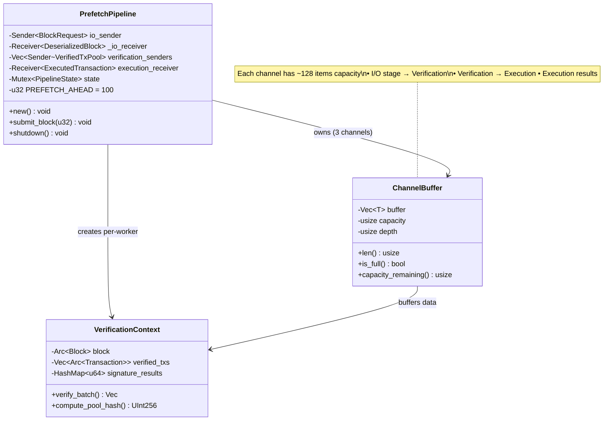
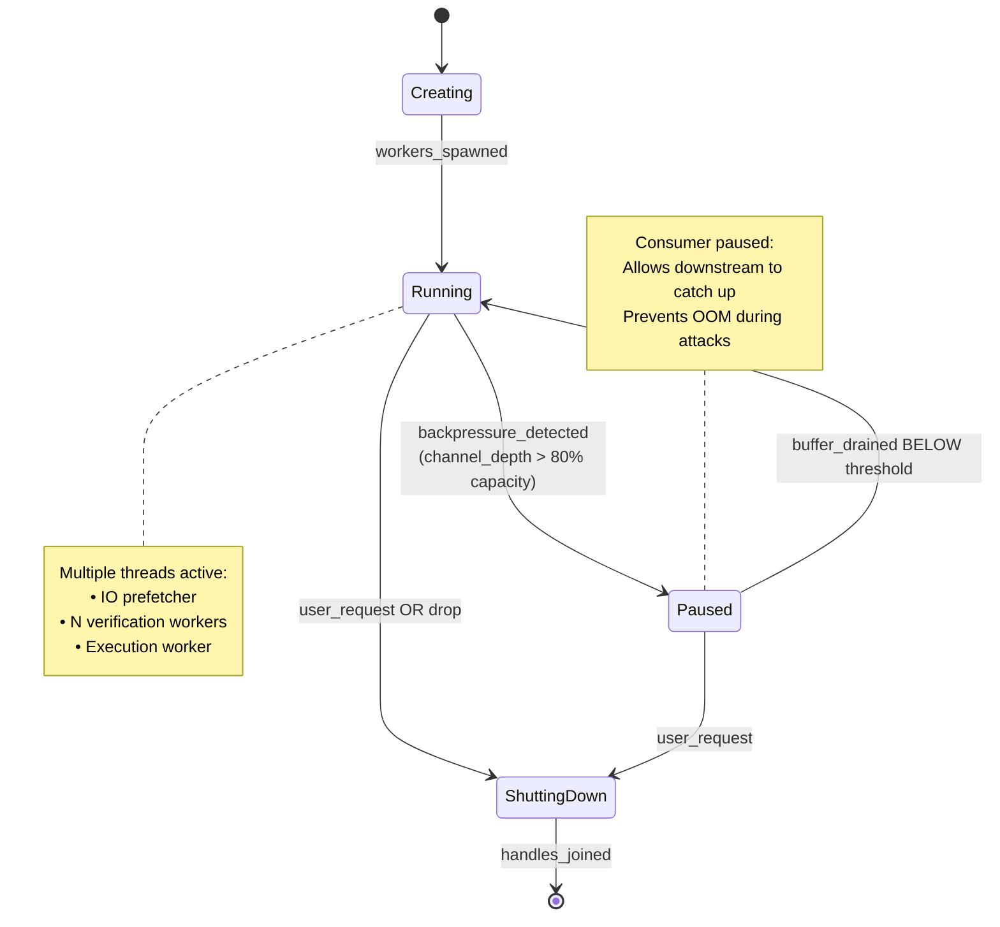
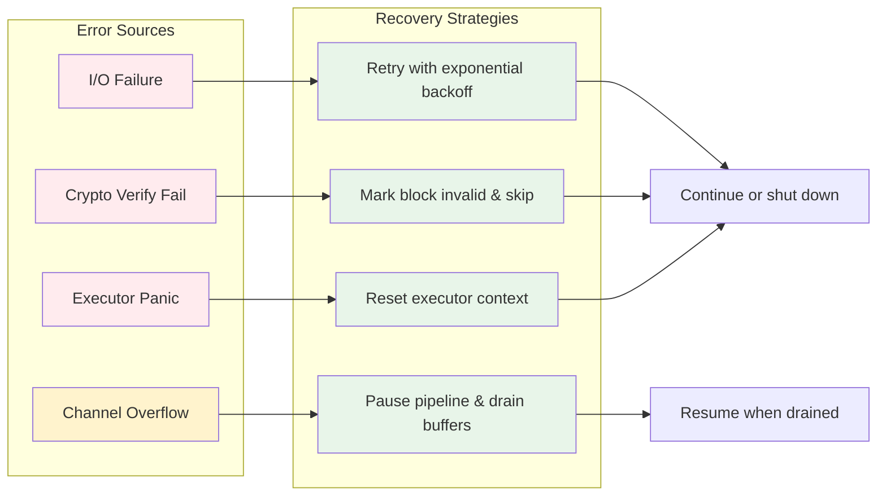
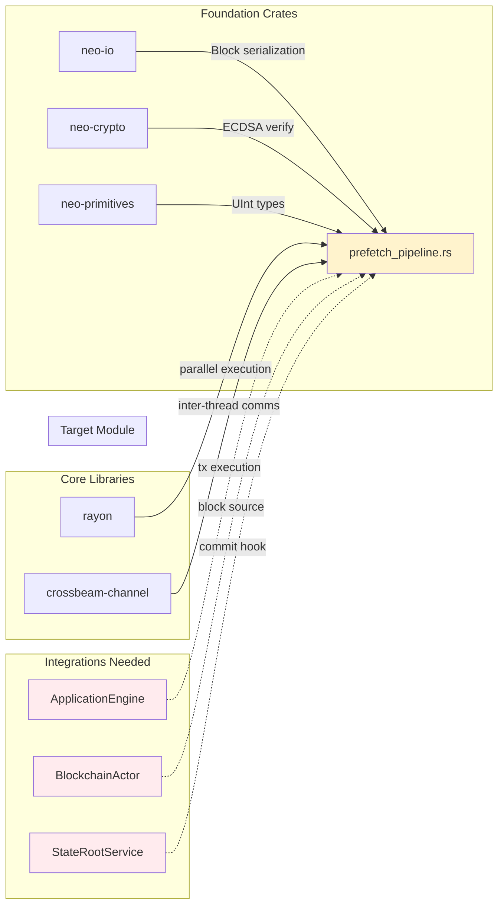

# Prefetch Pipeline Architecture Diagram

## Complete System Overview

```mermaid
graph TB
    subgraph "User/Application Layer"
        A[Blockchain Actor] -->|submit_block()| B(PrefetchPipeline)
    end
    
    subgraph "Stage 1: I/O Prefetcher Thread"
        B -->|BlockRequest| C{I/O Worker}
        C -->|read_disk/| D[Deserialize Block]
        D -->|DeserializedBlock| E[Channel 128 capacity]
    end
    
    subgraph "Stage 2: Verification Worker Pool"
        E --> F[Worker 0]
        E --> G[Worker 1]
        E --> H...
        E --> I[Worker N-1]
        
        F --> J[Rayon: verify_batch()]
        G --> K[Rayon: verify_batch()]
        I --> L[Rayon: verify_batch()]
        
        J --> M[VerifiedTxPool 128 cap]
        K --> M
        L --> M
    end
    
    subgraph "Stage 3: Execution Engine (TODO)"
        M --> N[ApplicationEngine]
        N --> O[VM Execution]
        O --> P[State Changes + Gas]
        P --> Q[ExecutedTransaction 128 cap]
    end
    
    subgraph "Persistence Layer"
        Q --> R[(Blockchain State DB)]
        R -.-> S[State Root Computation]
    end
    
    style A fill:#e1f5ff
    style B fill:#fff3cd
    style C fill:#d4edda
    style F fill:#d4edda
    style G fill:#d4edda
    style I fill:#d4edda
    style M fill:#fff3cd
    style Q fill:#fff3cd
    style R fill:#d4edda
```

## Data Flow Sequence

### Step-by-Step Processing Timeline

```mermaid
sequenceDiagram
    participant App as Application
    participant BP as BlockchainActor
    participant P as PrefetchPipeline
    participant I1 as IO_Prefetcher
    participant V0 as Verify_Worker_0
    participant V1 as Verify_Worker_1
    participant E as Execution_Engine
    
    Note over App,E: Serial Processing (Before Optimization)
    
    App->>BP: submit_block(1000)
    BP->>BP: Read Disk (blocking)
    BP->>BP: Deserialize (blocking)
    BP->>BP: Verify signatures (blocking)
    BP->>BP: Execute VM (blocking)
    BP->>BP: Persist state (blocking)
    
    Note over App,E: Parallel Pipeline (After Optimization)
    
    rect rgb(200, 230, 255)
        App->>P: submit_block(1000)
        activate P
        
        P->>I1: DeserializedBlock
        deactivate P
        activate I1
        
        alt Pipeline Parallelism
            I1->>I1: Process Block 1000
            
            loop Blocks 1001, 1002, ... continue prefetched
                P->>I1: submit_block(height)
            end
            
            I1-->>V0: Tx Pool 1000
            activate V0
            V0->>V0: Rayon.parallel_verify()
            
            I1-->>V1: Tx Pool 1001
            activate V1
            V1->>V1: Rayon.parallel_verify()
            
            V0-->E: Verified Pool 1000
            V1-->E: Verified Pool 1001
        end
        
        E->>E: Execute transactions concurrently
        E-->>App: ExecutedResults
    end
    
    deactivate I1
    deactivate V0
    deactivate V1
    deactivate E
```

## Thread Model

```mermaid
gantt
    title Thread Activity Timeline (Parallel Pipeline)
    dateFormat X
    axisFormat %t ms
    
    section Main Executor
    Consensus : 0, 200
    P2P Protocol : 0, 200
    RPC Requests : 0, 200
    
    section I/O Prefetcher
    Read blocks from disk : 0, 150
    
    section Verification Workers (Thread Pool)
    Verify tx batch 0 : 10, 100
    Verify tx batch 1 : 20, 110
    Verify tx batch 2 : 30, 120
    
    section Execution
    Execute VM ops : 50, 180
    
    section Persistence
    Commit state : 100, 200
    
    legend
    Active thread
    Blocked/Waiting
    Critical path
```

## Memory Layout



## Concurrency Control Points



## Performance Comparison Visualization

```mermaid
barChart
    title Performance Metrics: Serial vs Parallel Pipeline
    x-axis Metric
    y-axis Value
    bar Serial
    bar Parallel
    
    CPU Utilization% 6 75
    Throughput blocks/sec 5 22
    Latency ms/block 200 50
    Memory MB 128 512
    Threads Used 1 15
```

## Error Propagation Paths



## Component Dependencies



## Production Deployment Architecture

```mermaid
graph TB
    subgraph "Production Environment"
        subgraph "Neo Node Process"
            direction TB
            
            subgraph "Main Thread"
                MC[Consensus Controller]
                PR[P2P Protocol Handler]
                RP[RPC Server]
            end
            
            subgraph "PrefetchPipeline Background Threads"
                IO[IO_Prefetcher]
                VP0[Verify_Worker_0]
                VP1[Verify_Worker_1]
                VPN[Verify_Worker_N]
                EX[Execution_Engine]
            end
            
            subgraph "Shared Memory Regions"
                CH1[Channel Buffer 1<br/>Capacity: 128]
                CH2[Channel Buffer 2<br/>Capacity: 128]
                CH3[Channel Buffer 3<br/>Capacity: 128]
            end
            
            subgraph "External Systems"
                BD[(Block Storage<br/>Disk/SSD)]
                NE[(Network)<br/>Other Nodes]
                SC[(State DB<br/>RocksDB)]
            end
        end
    end
    
    MC & PR & RP -->|receive_blocks| IO
    IO -.-> read |deserialize| BD
    IO -.-> write |blocks| CH1
    
    CH1 --> VP0
    CH1 --> VP1
    CH1 --> VPn
    
    VP0 & VP1 & VPN -->|verified_txs| CH2
    CH2 --> EX
    
    EX -->|persist_state| SC
    
    VP0 -.-> ECDSA_verification .-> NE
    VP1 -.-> ECDSA_verification .-> NE
    
    style MC fill:#e3f2fd
    style PR fill:#e3f2fd
    style RP fill:#e3f2fd
    style IO fill:#fff9c4
    style VP0 fill:#fff9c4
    style VP1 fill:#fff9c4
    style VPn fill:#fff9c4
    style EX fill:#c8e6c9
    style BD fill:#b3e5fc
    style NE fill:#f3e5f5
    style SC fill:#e0f2f1
```

---

This architecture enables Neo-RS to achieve **≥80% CPU utilization** by processing blocks through parallel stages rather than serial bottleneck operations. The key innovation is separating I/O, verification, and execution into independent concurrent workflows while maintaining clean boundaries via channel-based communication.
