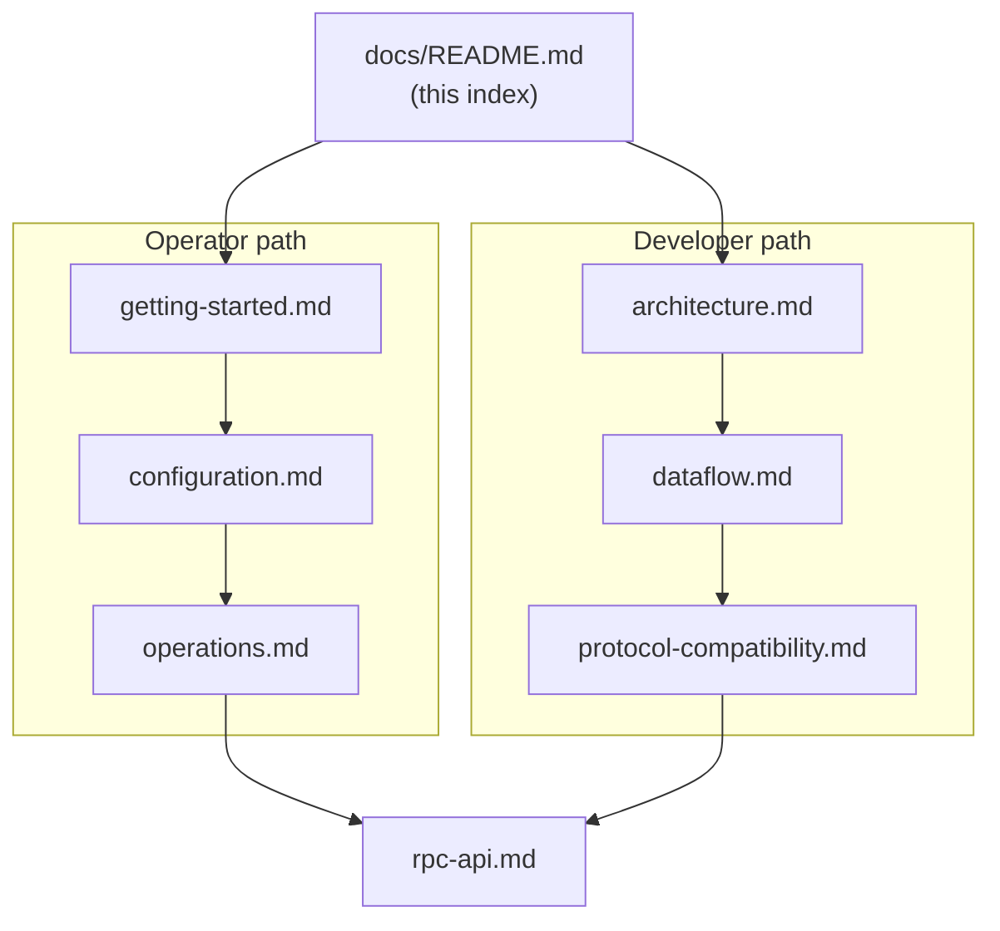

# neo-rs Documentation

`neo-rs` is a full Neo N3 blockchain node implemented from scratch in Rust, with
byte-for-byte protocol parity to the official C# reference node (tracked through
Neo v3.10.0). The runnable program is a single daemon, `neo-node`: it syncs the
chain over a custom TCP P2P protocol, executes NeoVM bytecode and native
contracts, maintains the MPT state root, and optionally serves a JSON-RPC API.

## Start here

If you want to **run a node**, begin with [getting-started.md](./getting-started.md)
and keep [configuration.md](./configuration.md) open alongside it. If you want to
**understand how the node works**, start with [architecture.md](./architecture.md)
and follow it into [dataflow.md](./dataflow.md). The navigation table below maps
every page to what you will learn from it.

## Navigation

| Doc | What you'll learn |
|-----|-------------------|
| [getting-started.md](./getting-started.md) | Install prerequisites, build `neo-node`, run a TestNet or MainNet node, point it at a data directory, and smoke-test it over JSON-RPC. Includes Docker and Makefile shortcuts. |
| [configuration.md](./configuration.md) | Every TOML section and key the daemon reads (`[network]`, `[storage]`, `[p2p]`, `[rpc]`, `[consensus]`, `[blockchain]`, `[mempool]`, `[state_service]`, `[indexer]`, `[application_logs]`, `[tokens_tracker]`, `[telemetry.metrics]`, `[logging]`, `[observability]`), preset-plus-override behavior, environment variables, and operational overrides. |
| [operations.md](./operations.md) | Running in production: systemd and Docker deployment, storage sizing, health checks via RPC, observability, security hardening, backups, upgrades, and incident response. |
| [rpc-api.md](./rpc-api.md) | The JSON-RPC 2.0 surface (~55 methods) grouped by domain — blockchain, smart-contract invocation, state and MPT proofs, node/network, wallet, plugins — with parameters, request/response shape, and curl examples. |
| [architecture.md](./architecture.md) | The layered workspace design (Foundation → Infrastructure → Protocol → Domain service → Node service → Composition → Plugin/RPC boundary → Application), a crate reference table, and the key design decisions (two-tier VM, supervised async services, block-import queue, typed storage tables, provider factories, C# parity). |
| [dataflow.md](./dataflow.md) | How data and control move at runtime: startup/composition, block ingestion, transaction lifecycle, a dBFT consensus round, RPC request handling, state/storage overlays, typed table reads, and hot/cold provider routing — each with a diagram. |
| [protocol-compatibility.md](./protocol-compatibility.md) | What "byte-for-byte C# parity" means, the 11 native contracts, the 7 hardforks with MainNet/TestNet activation heights, supported subsystems (consensus, VM, NEP standards, P2P), and the cryptography stack. |
| [coding-design-architecture-guidance.md](./coding-design-architecture-guidance.md) | Coding/design rules for high-level domain flows, fluent workflow APIs, layer-by-layer abstraction, module organization, and when to use generics versus `dyn Trait`. |
| [style-conformance-audit.md](./style-conformance-audit.md) | Repeatable crate-by-crate audit checklist and remediation plan for enforcing the coding/design/architecture guidance. |

## Learning paths

### New operator (run and maintain a node)

1. [getting-started.md](./getting-started.md) — build, run, and smoke-test a node.
2. [configuration.md](./configuration.md) — tune the TOML for your network and storage.
3. [operations.md](./operations.md) — deploy, monitor, harden, back up, and upgrade.

For the methods you will query while operating, see
[rpc-api.md](./rpc-api.md). Deployment, systemd, Docker, and RPC hardening all
live in [operations.md](./operations.md).

### New developer (understand the system)

1. [architecture.md](./architecture.md) — the crates, layers, and design decisions.
2. [dataflow.md](./dataflow.md) — how blocks, transactions, and queries flow through the services.
3. [protocol-compatibility.md](./protocol-compatibility.md) — the protocol surface, native contracts, and hardforks the node must match.
4. [rpc-api.md](./rpc-api.md) — the external interface clients use to drive the node.
5. [coding-design-architecture-guidance.md](./coding-design-architecture-guidance.md) — how to keep top-level code readable while hiding lower-level mechanics behind focused Rust APIs.
6. [style-conformance-audit.md](./style-conformance-audit.md) — how to audit and phase remediation across crates without turning style work into unsafe churn.

## Documentation map

