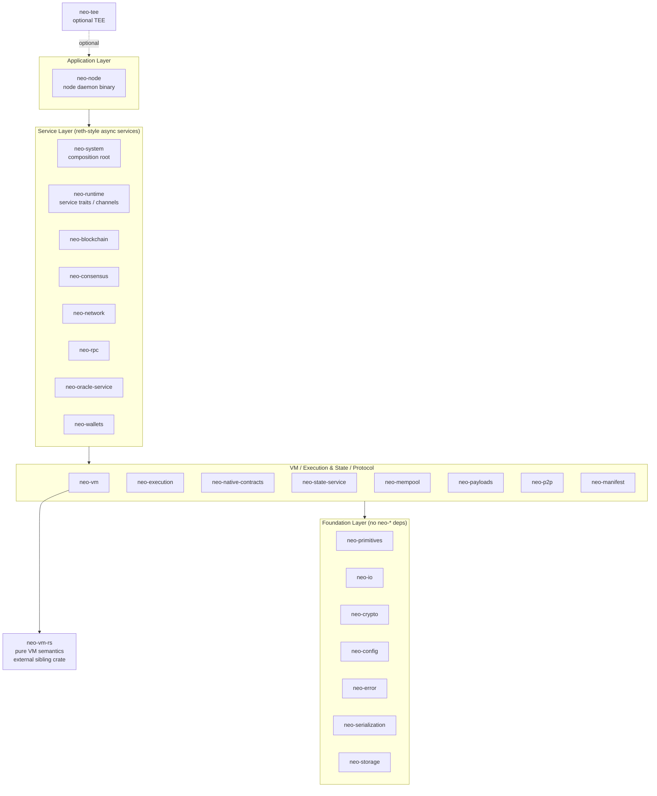

# System Architecture

## What is neo-rs

neo-rs is a full Neo N3 blockchain node implemented from scratch in Rust. It is a
re-implementation of the official C# reference node (Neo v3.10.0): it speaks the
same P2P protocol, runs the same dBFT 2.0 consensus, executes the same NeoVM
bytecode and native contracts, and produces the same state roots. Byte-for-byte
protocol parity with the C# node is a hard design constraint — a block accepted
by one node must be accepted by the other, and the two implementations must
agree on every hash, signature, fee, and storage value. neo-rs is organized as a
workspace of 27 crates arranged in four dependency layers, with `tokio`-based
async services, a `jsonrpsee` JSON-RPC interface, and pluggable RocksDB or
in-memory storage.

## Layered architecture

The workspace is strictly layered. Dependencies point **downward** only:
foundation crates have no `neo-*` dependencies, and each higher layer builds on
the ones below it. This keeps the protocol-critical core decoupled from the
service runtime and from the node binary.

The boundaries are conceptual groupings; the binding rule is the dependency
direction. For example `neo-system` (service layer) pulls together
`neo-blockchain`, `neo-network`, `neo-mempool`, `neo-state-service`,
`neo-execution`, `neo-native-contracts`, and `neo-wallets`, while
`neo-runtime` (the service-trait substrate) depends only on `neo-primitives`
and `neo-payloads`.

## Crate reference

| Crate | Layer | Responsibility |
|-------|-------|----------------|
| neo-primitives | Foundation | Primitive value types: `UInt160`, `UInt256`, `BigDecimal`. |
| neo-io | Foundation | Binary and variable-length integer reader/writer (mirrors `Neo.IO`). |
| neo-crypto | Foundation | Hashing, secp256r1 ECC, signatures, BLS12-381. |
| neo-config | Foundation | Node and protocol configuration (TOML-backed settings). |
| neo-error | Foundation | Authoritative `CoreError` / `CoreResult` error types for the workspace. |
| neo-serialization | Foundation | Compression, binary and JSON stack-item codecs, JSONPath, in-memory storage providers. |
| neo-storage | Foundation | `Store` traits, `DataCache`, plus RocksDB and in-memory backends. |
| neo-payloads | Protocol | `Block`, `Header`, `Transaction`, `Signer`, `WitnessRule`, attributes, and verification logic. |
| neo-p2p | Protocol | P2P wire constants and message types. |
| neo-manifest | Protocol | Contract ABI, NEF, `CallFlags`, `MethodToken`, validator attributes. |
| neo-vm | VM | Stateful NeoVM host (execution engine, contexts, reference-counted stack items) over `neo-vm-rs`. |
| neo-execution | Execution | `ApplicationEngine` and interop services (runtime, storage, contract, crypto syscalls). |
| neo-native-contracts | Execution | NEO, GAS, Policy, Oracle, Notary, StdLib, CryptoLib, RoleManagement, ContractManagement, Ledger, plus shared native infrastructure. |
| neo-state-service | State | MPT state root, state root cache, state store, block-commit pipeline. |
| neo-mempool | State | Transaction memory pool, pool items, transaction router, per-block verification context. |
| neo-blockchain | Service | `Blockchain` service, `LedgerContext`, `HeaderCache`, block processing. |
| neo-consensus | Service | dBFT 2.0 consensus engine. |
| neo-network | Service | P2P host: `LocalNode`, `RemoteNode`, `TaskManager` services. |
| neo-runtime | Service | Reth-style service traits, command channels, `Node` builder substrate. |
| neo-system | Service | `Node` orchestrator / composition root that wires the services together. |
| neo-wallets | Service | NEP-6 wallets, BIP-32/BIP-39 key derivation, keypairs, accounts, witness scripts. |
| neo-rpc | Plugin | `jsonrpsee` JSON-RPC server and client (~55 methods), plus the tokens-tracker plugin. |
| neo-oracle-service | Plugin | Oracle request fulfilment over HTTPS and NeoFS. |
| neo-tee | Plugin | Optional Trusted Execution Environment support (feature-gated). |
| neo-node | Application | The node daemon binary (TOML config, storage, P2P, RPC, consensus wiring). |

Two further workspace members exist purely for development and are not part of
the running node: `tests` (cross-crate integration tests) and `benches-package`
(Criterion benchmarks). The pure VM semantics live in `neo-vm-rs`, an external
sibling crate referenced by path from `neo-vm`.

## Key design decisions

- **Two-tier VM.** `neo-vm` is a stateful *host* (execution loop, call contexts,
  reference-counted stack items) layered over `neo-vm-rs`, an external crate that
  holds the pure NeoVM semantics (opcode behavior, jump tables). Separating the
  stateless instruction semantics from the stateful host keeps the
  parity-critical opcode logic isolated and independently testable.

- **Reth-style async services with command channels.** Long-lived components
  (blockchain, network, consensus, mempool) run as `tokio` services that
  communicate through typed command channels rather than shared locks or an
  actor framework. `neo-runtime` defines the service traits and `Node` builder;
  `neo-system` is the composition root that instantiates and connects them. This
  gives clear ownership, backpressure, and testable boundaries between services.

- **Single authoritative error type.** `neo-error` is the *only* crate that owns
  `CoreError` / `CoreResult`. Every higher-layer crate returns and accepts
  `CoreError`, so error handling is uniform across the workspace and the error
  type sits at the bottom of the dependency graph rather than being duplicated.

- **Pluggable storage behind a `Store` trait.** `neo-storage` exposes a `Store`
  abstraction with a RocksDB backend (the `rocksdb` feature) and an in-memory
  backend for tests and ephemeral runs. The rest of the node depends on the
  trait and on `DataCache`, not on a concrete database, so the backend can be
  swapped without touching consensus or execution code.

- **Byte-for-byte C# parity as a hard constraint.** Wire formats, hashing,
  signature schemes, fee formulas, VM opcode pricing, native-contract behavior,
  and state-root computation are all matched to the C# reference node. Where the
  C# implementation has quirks (for example specific serialization-size
  behavior), neo-rs reproduces them deliberately so the two nodes never diverge
  on a block.

## How the pieces fit at runtime

At startup the `neo-node` binary reads a TOML config, opens the configured store,
and uses `neo-system` to build and launch the service set: the network host
dials seeds and accepts peers, the blockchain service processes incoming blocks
and headers through execution and the state-commit pipeline, the mempool admits
and routes transactions, consensus (when enabled) drives block production, and
`neo-rpc` serves the JSON-RPC surface to clients. For a step-by-step trace of how
a block and a transaction move through these services — including the P2P sync
path, execution, state-root commit, and RPC query path — see
[dataflow.md](dataflow.md).
