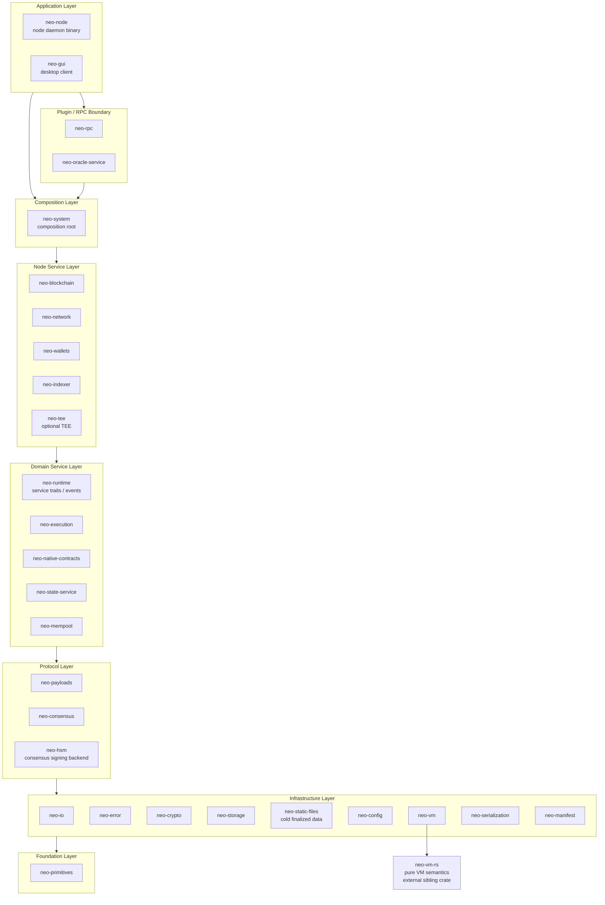

# System Architecture

## What is neo-rs

neo-rs is a full Neo N3 blockchain node implemented from scratch in Rust. It is a
re-implementation of the official C# reference node (Neo v3.10.0): it speaks the
same P2P protocol, runs the same dBFT 2.0 consensus, executes the same NeoVM
bytecode and native contracts, and produces the same state roots. Byte-for-byte
protocol parity with the C# node is a hard design constraint — a block accepted
by one node must be accepted by the other, and the two implementations must
agree on every hash, signature, fee, and storage value. neo-rs is organized as a
workspace of focused crates arranged in explicit dependency layers, with
`tokio`-based async services, a `jsonrpsee` JSON-RPC interface, MDBX as the
default store, RocksDB as a supported fallback, and in-memory storage for tests.

## Layered architecture

The workspace is strictly layered. Dependencies point **downward** only: the
foundation crate has no `neo-*` dependencies, infrastructure crates only depend
on lower infrastructure/foundation crates, and each higher layer builds on the
ones below it. This keeps the protocol-critical core decoupled from the service
runtime and from the node binary.

The boundaries are conceptual groupings; the binding rule is the dependency
direction. For example `neo-system` (composition layer) pulls together
`neo-blockchain`, `neo-network`, `neo-mempool`, `neo-state-service`,
`neo-execution`, `neo-native-contracts`, and `neo-wallets`, while `neo-indexer`
remains a node service that depends only on lower protocol/foundation crates and
is consumed by `neo-rpc` and `neo-node`.

## Crate reference

| Crate | Layer | Responsibility |
|-------|-------|----------------|
| neo-primitives | Foundation | Primitive value types: `UInt160`, `UInt256`, `BigDecimal`. |
| neo-io | Infrastructure | Binary and variable-length integer reader/writer (mirrors `Neo.IO`). |
| neo-error | Infrastructure | Authoritative `CoreError` / `CoreResult` error types for the workspace. |
| neo-crypto | Infrastructure | Hashing, secp256r1 ECC, signatures, BLS12-381. |
| neo-storage | Infrastructure | `Store` traits, `DataCache`, typed table codecs, MDBX/RocksDB adapters, and in-memory providers. |
| neo-static-files | Infrastructure | Append-only cold segment files for finalized block, transaction, receipt, and archived state-root payload bytes. Ledger-specific hot/cold provider scaffolding lives under `neo-blockchain::ledger::static_archive`. |
| neo-config | Infrastructure | Node and protocol configuration (TOML-backed settings). |
| neo-vm | Infrastructure | Stateful NeoVM host (execution engine, contexts, reference-counted stack items) over `neo-vm-rs`. |
| neo-serialization | Infrastructure | Compression, binary and JSON stack-item codecs, JSONPath, in-memory storage providers. |
| neo-manifest | Infrastructure | Contract ABI, NEF, `CallFlags`, `MethodToken`, validator attributes. |
| neo-payloads | Protocol | `Block`, `Header`, `Transaction`, `Signer`, `WitnessRule`, attributes, and verification logic. |
| neo-consensus | Protocol | dBFT 2.0 consensus engine and consensus payload handling. |
| neo-hsm | Protocol | Optional HSM-backed consensus signing support. |
| neo-runtime | Domain service | Reth-style service traits, block-import contract, bounded import queue, command channels, and shared service events. |
| neo-execution | Domain service | `ApplicationEngine` and interop services (runtime, storage, contract, crypto syscalls). |
| neo-native-contracts | Domain service | NEO, GAS, Policy, Oracle, Notary, StdLib, CryptoLib, RoleManagement, ContractManagement, Ledger, plus shared native infrastructure. |
| neo-state-service | Domain service | MPT state root, state root cache, state store, immutable state-provider views, block-commit pipeline. |
| neo-mempool | Domain service | Transaction memory pool, pool items, transaction router, per-block verification context. |
| neo-blockchain | Node service | `Blockchain` service, `LedgerContext`, `HeaderCache`, provider-style ledger reads, cold archive scaffolding, pruning checkpoints, block processing. |
| neo-network | Node service | P2P host: `LocalNode`, `RemoteNode`, `TaskManager` services. |
| neo-wallets | Node service | NEP-6 wallets, BIP-32/BIP-39 key derivation, keypairs, accounts, witness scripts. |
| neo-indexer | Node service | Read-side block, transaction, signer-account, and notification indexing for service-style RPC queries. |
| neo-tee | Node service | Optional Trusted Execution Environment support (feature-gated). |
| neo-system | Composition | `Node` orchestrator / composition root that wires the services together. |
| neo-oracle-service | Plugin/RPC boundary | Oracle request fulfilment over HTTPS and NeoFS. |
| neo-rpc | Plugin/RPC boundary | `jsonrpsee` JSON-RPC server and client, plus optional ApplicationLogs, TokensTracker, NeoIndexer, and Oracle method groups. |
| neo-node | Application | The node daemon binary (TOML config, storage, P2P, RPC, consensus wiring). |
| neo-gui | Application | Native desktop manager that talks to a running node over JSON-RPC. |

The current workspace has 27 production workspace members plus 2 development-only members.
The development-only members are not part of the running node: `tests`
(cross-crate integration tests) and `benches-package` (Criterion benchmarks).
The pure VM semantics live in `neo-vm-rs`, an external sibling crate referenced
by path from `neo-vm`.

## Crate consolidation audit

Crate count is not a goal by itself; fewer crates are useful only when the merge
removes a false boundary without creating an upward dependency or making a
protocol-critical subsystem depend on a composition/runtime concern. Current
small-crate candidates were checked against the dependency layers above:

| Candidate | Current size / role | Decision |
|-----------|---------------------|----------|
| `neo-io` into `neo-serialization` | Low-level Neo.IO-compatible readers, writers, var-int codecs, compression helpers, and bounded caches used by crypto, errors, payloads, and higher serializers. | **Do not merge.** `neo-serialization` is a higher-level codec crate with VM stack-item and JSON concerns; moving raw wire/disk IO there would make lower protocol crates depend on a broader serialization surface. |
| `neo-runtime` into `neo-system` | Small shared service-trait crate used by `neo-system` and concrete service crates such as `neo-network`. | **Do not merge.** That would force lower service implementations to depend upward on the composition root just to name shared service traits and events. |
| `neo-error` into another foundation crate | Small but central `CoreError` / `CoreResult` vocabulary. | **Do not merge.** It deliberately sits near the bottom of the graph so storage, crypto, execution, RPC, and node services share one error type without cycles. |
| `neo-config` into `neo-node` or `neo-system` | TOML-backed protocol, network, storage, RPC, and service configuration shared across daemon startup and reusable node services. | **Do not merge.** It is operator-facing configuration vocabulary; merging upward would make lower services depend on process/composition concerns just to parse or validate settings. |
| `neo-manifest` into `neo-execution` or `neo-native-contracts` | Contract ABI, NEF files, method tokens, call flags, and validator attributes shared by execution, RPC, wallets, and native-contract metadata. | **Do not merge.** Manifest/ABI data is protocol vocabulary, not execution ownership; merging it upward would make independent tools and RPC paths pull in execution or native-contract internals. |
| `neo-static-files` into `neo-storage` or `neo-node` | Append-only cold storage provider for finalized block, transaction, receipt, and archived state-root payloads. | **Do not merge.** It is an infrastructure performance component behind provider traits; keeping it separate preserves the hot `Store` abstraction while allowing cold-file recovery and format tests to evolve without pulling node process policy into storage. |
| `neo-system` into `neo-node` | Embeddable composition root, node lifecycle, service registry, and cross-service wiring used by the daemon and integration surfaces. | **Do not merge.** The daemon owns CLI/process policy, while `neo-system` should remain reusable node assembly that tests, RPC/indexer wiring, and future service hosts can embed without pulling in the binary. |
| `neo-indexer` into `neo-rpc` | Query-oriented service used by RPC, but owned by the node lifecycle and optionally registered in `neo-system::ServiceRegistry`. | **Do not merge.** Keeping it as a node service allows RPC, daemon startup, and future REST/worker surfaces to share the same read model. |
| `neo-hsm` into `neo-consensus` or `neo-node` | Optional validator signing backends for PKCS#11, Azure, and GCP HSM integrations. | **Do not merge.** HSM support is an operator/security boundary with heavyweight and feature-specific dependencies; consensus should remain about the protocol while signer providers stay replaceable. |
| `neo-tee` into `neo-node` or consensus crates | Optional SGX/Nitro TEE support, sealed wallets, attestation, and fair-ordering helpers. | **Do not merge.** TEE code is hardware and deployment specific, with simulation and enclave features; isolating it keeps normal node builds smaller and keeps sensitive runtime assumptions out of the core node. |
| `neo-oracle-service` into `neo-rpc` or `neo-native-contracts` | Off-chain oracle worker for HTTPS/NeoFS fetching, response transaction assembly, and request lifecycle processing. | **Do not merge.** The native Oracle contract must stay deterministic on-chain state, RPC is just an API boundary, and the oracle worker has its own network I/O, retries, signing, and service lifecycle. |
| Development crates `tests` / `benches-package` | Workspace-only verification and benchmark targets. | **Keep separate.** They are not linked into the node and keep dev-only dependencies out of production crates. |

The practical rule for future consolidation is: merge crates only when both
crates live in the same layer, have no separate runtime/lifecycle ownership, and
the merge removes duplicated types or glue. Do not merge a shared vocabulary
crate into a concrete implementation crate, and do not make lower layers depend
on `neo-system`, `neo-rpc`, or `neo-node`.

## Coding and abstraction guidance

Layering also applies inside each crate. Public orchestration should read as
domain flow, while protocol, storage, RPC, and runtime mechanics stay in lower
modules that own those concerns. Fluent/chained APIs are welcome when every verb
is a real domain operation and the chain remains testable and explicit about
side effects.

The detailed rules for this style live in
[coding-design-architecture-guidance.md](coding-design-architecture-guidance.md).

## Key design decisions

- **Two-tier VM.** `neo-vm` is a stateful *host* (execution loop, call contexts,
  reference-counted stack items) layered over `neo-vm-rs`, an external crate that
  holds the pure NeoVM semantics (opcode behavior, jump tables). Separating the
  stateless instruction semantics from the stateful host keeps the
  parity-critical opcode logic isolated and independently testable.

- **Reth-style async services with command channels.** Long-lived components
  (blockchain, network, consensus, mempool) run as `tokio` services that
  communicate through typed command channels rather than shared locks or an
  actor framework. `neo-runtime` defines the service traits and shared events;
  `neo-system` is the composition root that instantiates and connects concrete
  services. This gives clear ownership, backpressure, and testable boundaries
  between services.

- **Supervised daemon tasks.** `neo-node` classifies long-running background
  work as essential or normal. Essential task failure requests node shutdown;
  normal task failure is reported through bounded-label observability metrics
  and error endpoints. This follows Substrate's TaskManager discipline without
  confusing it with the Neo P2P `TaskManager` sync scheduler.

- **Canonical block import plus bounded preverification.**
  `neo_runtime::BlockImport` is the shared import trait for consensus, sync, RPC,
  and fast-sync callers. `neo_runtime::BlockImportQueue` runs cheap preflight
  checks with bounded concurrency and then submits the verified batch to
  `BlockImport::import_many` in original order. Execution, native persistence,
  state-root updates, and durable storage still happen only inside
  `neo-blockchain`.

- **Staged-sync policies are shared runtime contracts.**
  `neo_runtime::sync_pipeline` defines stable stage identifiers,
  `CommitPolicy` thresholds, `SyncStageCheckpointStore`, and
  `SyncPipelineDriver`. Downloaded `SyncBlockBatch` values are checked for
  contiguous heights, imported through the canonical `ImportQueue`, and
  checkpointed when policy fires. `neo_network::BlockDownloader` is the
  stream-shaped download boundary; its `BlockDownloadBatch` converts into the
  runtime batch type, while the concrete peer request scheduler remains the next
  integration layer.

- **Native dispatch is explicit at composition.** `neo-execution` still owns the
  low-level `NativeContractProvider` lookup seam so the engine does not depend
  on `neo-native-contracts`, but `neo-system::NodeBuilder` now accepts and stores
  the provider as an explicit dependency. The standard Neo N3 provider is
  installed by default only after required services validate, so failed
  composition does not mutate native dispatch state.

- **Single authoritative error type.** `neo-error` is the *only* crate that owns
  `CoreError` / `CoreResult`. Every higher-layer crate returns and accepts
  `CoreError`, so error handling is uniform across the workspace and the error
  type sits at the bottom of the dependency graph rather than being duplicated.

- **Pluggable storage behind `Store` and provider traits.** `neo-storage`
  exposes `Store`, `DataCache`, and typed `Table`/`TableCodec`/`TableReader`
  adapters over the existing raw bytes. MDBX is the production default, RocksDB
  remains a supported fallback, and memory providers are used for tests. Higher
  crates read through capability providers: `neo-blockchain` has
  `BlockProvider`/`TxProvider` plus `LedgerProviderFactory`, and
  `neo-state-service` has `StateProviderFactory`/`StateView` for immutable MPT
  views. These provider factories make hot/cold/static routing explicit without
  changing C#-compatible key/value bytes.

- **Cold ledger scaffold is provider-backed, not implicit.**
  `StaticLedgerArchive` is an append-only block/transaction body archive used
  through `BlockProvider`/`TxProvider`. `HotColdLedgerProviderFactory` composes a
  hot storage provider with a cold archive provider. The current implementation
  is a scaffold for explicit integration; the block import path does not
  silently write static files until node configuration and crash-recovery policy
  opt in.

- **Byte-for-byte C# parity as a hard constraint.** Wire formats, hashing,
  signature schemes, fee formulas, VM opcode pricing, native-contract behavior,
  and state-root computation are all matched to the C# reference node. Where the
  C# implementation has quirks (for example specific serialization-size
  behavior), neo-rs reproduces them deliberately so the two nodes never diverge
  on a block.

## How the pieces fit at runtime

At startup the `neo-node` binary reads a TOML config, opens the configured store,
and uses `neo-system` to build and launch the service set: the network host
dials seeds and accepts peers, the blockchain service processes incoming blocks
and headers through execution and the state-commit pipeline, the mempool admits
and routes transactions, consensus (when enabled) drives block production, and
`neo-rpc` serves the JSON-RPC surface to clients. For a step-by-step trace of how
a block and a transaction move through these services — including the P2P sync
path, execution, state-root commit, and RPC query path — see
[dataflow.md](dataflow.md).
