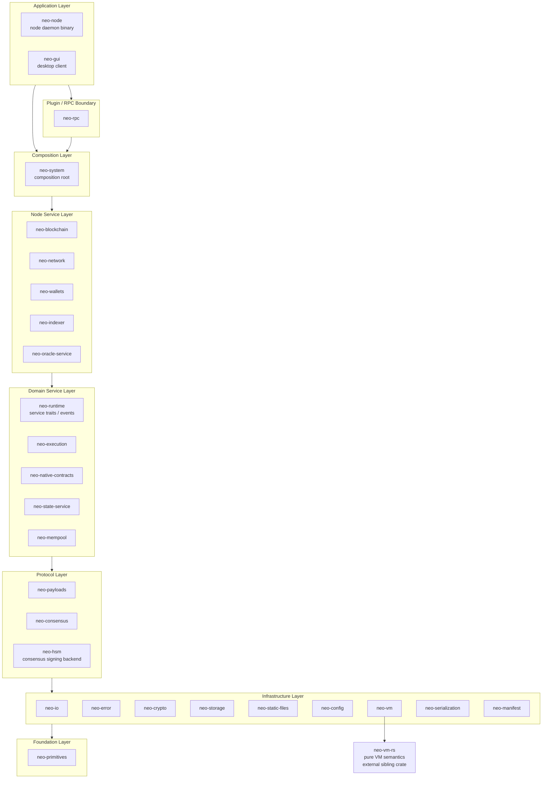

# System Architecture

## What is neo-rs

neo-rs is a full Neo N3 blockchain node implemented from scratch in Rust. It is a
re-implementation of the official C# reference node (Neo v3.10.1): it speaks the
same P2P protocol, runs the same dBFT 2.0 consensus, executes the same NeoVM
bytecode and native contracts, and produces the same state roots. Byte-for-byte
protocol parity with the C# node is a hard design constraint — a block accepted
by one node must be accepted by the other, and the two implementations must
agree on every hash, signature, fee, and storage value. neo-rs is organized as a
workspace of focused crates arranged in explicit dependency layers, with
`tokio`-based async services, a `jsonrpsee` JSON-RPC interface, MDBX as the
default store, RocksDB as a supported fallback, and in-memory storage for tests.

## Layered architecture

The workspace is organized into **8 ordered layers, 26 production workspace members plus 3 development-only members**.
Dependencies point downward, except for an explicit audited allow-list of
one-way dependencies inside a layer. The canonical layer membership and
same-layer edges live in `[workspace.metadata.architecture]` and are enforced
by `neo-tests`. This keeps the protocol-critical core decoupled from service
composition and the node binary.

The boundaries are conceptual groupings; the binding rule is the dependency
direction. For example `neo-system` (composition layer) pulls together
`neo-blockchain`, `neo-network`, `neo-mempool`, `neo-state-service`,
`neo-execution`, `neo-native-contracts`, and `neo-wallets`, while `neo-indexer`
remains a node service that depends only on lower protocol/foundation crates and
is consumed by `neo-rpc` and `neo-node`.

## Crate reference

| Crate | Layer | Responsibility |
|-------|-------|----------------|
| neo-primitives | Foundation | Primitive value types: `UInt160`, `UInt256`, `BigDecimal`. |
| neo-io | Infrastructure | Binary and variable-length integer reader/writer (mirrors `Neo.IO`). |
| neo-error | Infrastructure | Authoritative `CoreError` / `CoreResult` error types for the workspace. |
| neo-crypto | Infrastructure | Hashing, secp256r1 ECC, signatures, BLS12-381. |
| neo-storage | Infrastructure | General `Store` and canonical `TransactionalStore` traits, child/parent `DataCache` overlays, C#-compatible raw key/value codecs, isolated node-maintenance metadata, MDBX/RocksDB adapters, and in-memory providers. |
| neo-static-files | Infrastructure | Versioned genesis-first static records with zstd compression, checksums, a derived MDBX versioned-offset index, payload-free frame-key lookup, bounded suffix recovery, strict scrubbing, kernel writer ownership, and LRU frame caching. |
| neo-config | Infrastructure | Node and protocol configuration (TOML-backed settings). |
| neo-vm | Infrastructure | Stateful NeoVM host (execution engine, contexts, reference-counted stack items) over `neo-vm-rs`. |
| neo-serialization | Infrastructure | Compression, binary and JSON stack-item codecs, JSONPath, in-memory storage providers. |
| neo-manifest | Infrastructure | Contract ABI, NEF, `CallFlags`, `MethodToken`, validator attributes. |
| neo-payloads | Protocol | `Block`, `Header`, `Transaction`, `Signer`, `WitnessRule`, attributes, and verification logic. |
| neo-consensus | Protocol | dBFT 2.0 consensus engine and consensus payload handling. |
| neo-hsm | Protocol | Optional HSM-backed consensus signing support. |
| neo-runtime | Domain service | Reth-style service traits, block-import contract, bounded import queue, command channels, and shared service events. |
| neo-execution | Domain service | `ApplicationEngine` and interop services (runtime, storage, contract, crypto syscalls). |
| neo-native-contracts | Domain service | NEO, GAS, Policy, Oracle, Notary, StdLib, CryptoLib, RoleManagement, ContractManagement, Ledger, plus shared native infrastructure. |
| neo-state-service | Domain service | MPT state root, state root cache, state store, immutable state-provider views, block-commit pipeline. |
| neo-mempool | Domain service | Transaction memory pool, pool items, transaction router, per-block verification context. |
| neo-blockchain | Node service | Root-level `BlockchainHandle`/`BlockchainService` capabilities, `LedgerContext`, `HeaderCache`, provider-style ledger reads, and canonical block processing; command-loop internals stay private. |
| neo-network | Node service | Root-level P2P handles, services, protocol values, and wire codecs; `LocalNode`, `RemoteNode`, task-manager, wire, and protocol module layouts stay private. |
| neo-wallets | Node service | NEP-6 wallets, BIP-32/BIP-39 key derivation, keypairs, accounts, witness scripts. |
| neo-indexer | Node service | Durable read-side block, transaction, signer-account, and notification projections, atomic batch commands, and the contiguous projection checkpoint consumed by the node's Index stage. |
| neo-oracle-service | Node service | Off-chain Oracle request fulfilment over HTTPS and NeoFS, including retries, signing, and request lifecycle processing. |
| neo-system | Composition | Typed core composition root: `NodeCoreBuilder`, `NodeCoreLaunch`, `BlockchainTask`, `NodeSystemContext`, final `Node`, and sync workflows. |
| neo-rpc | Plugin/RPC boundary | `jsonrpsee` JSON-RPC server and client, plus optional ApplicationLogs, TokensTracker, NeoIndexer, and Oracle method groups. |
| neo-node | Application | The node daemon binary (TOML config, storage, P2P, RPC, consensus wiring). |
| neo-gui | Application | Native desktop manager that talks to a running node over JSON-RPC. |

The current workspace has 26 production workspace members plus 3 development-only members.
The development-only members are not part of the running node:
`neo-test-fixtures` (shared test builders), `tests` (cross-crate integration
tests), and `benches-package` (Criterion benchmarks).
The pure VM semantics live in `neo-vm-rs`, an external sibling crate referenced
by path from `neo-vm`. For the full ADR log and evolution roadmap, see
[`design.md`](../design.md) (41 ADRs covering RPC decoupling, engine integration,
error unification, oracle decoupling, dead dependency cleanup, pipeline strategy,
error type policy, MPT layering, and more).

## Crate consolidation audit

Crate count is not a goal by itself; fewer crates are useful only when the merge
removes a false boundary without creating an upward dependency or making a
protocol-critical subsystem depend on a composition/runtime concern. Current
small-crate candidates were checked against the dependency layers above:

| Candidate | Current size / role | Decision |
|-----------|---------------------|----------|
| `neo-io` into `neo-serialization` | Low-level Neo.IO-compatible readers, writers, var-int codecs, compression helpers, and bounded caches used by crypto, errors, payloads, and higher serializers. | **Do not merge.** `neo-serialization` is a higher-level codec crate with VM stack-item and JSON concerns; moving raw wire/disk IO there would make lower protocol crates depend on a broader serialization surface. |
| `neo-static-files` into `neo-storage` | Protocol-blind append-only finalized records, compression, integrity checks, and crash-tail repair. | **Do not merge.** Mutable KV/MVCC storage and immutable sequential archives have different transaction, recovery, and operational contracts; `neo-blockchain` is the adapter that selects exact Ledger rows without teaching either infrastructure crate Neo protocol semantics. |
| `neo-runtime` into `neo-system` | Small shared service-trait crate used by `neo-system` and concrete service crates such as `neo-network`. | **Do not merge.** That would force lower service implementations to depend upward on the composition root just to name shared service traits and events. |
| `neo-error` into another foundation crate | Small but central `CoreError` / `CoreResult` vocabulary. | **Do not merge.** It deliberately sits near the bottom of the graph so storage, crypto, execution, RPC, and node services share one error type without cycles. |
| `neo-config` into `neo-node` or `neo-system` | TOML-backed protocol, network, storage, RPC, and service configuration shared across daemon startup and reusable node services. | **Do not merge.** It is operator-facing configuration vocabulary; merging upward would make lower services depend on process/composition concerns just to parse or validate settings. |
| `neo-manifest` into `neo-execution` or `neo-native-contracts` | Contract ABI, NEF files, method tokens, call flags, and validator attributes shared by execution, RPC, wallets, and native-contract metadata. | **Do not merge.** Manifest/ABI data is protocol vocabulary, not execution ownership; merging it upward would make independent tools and RPC paths pull in execution or native-contract internals. |
| `neo-system` into `neo-node` | Embeddable composition root for typed core node handles and cross-service wiring used by the daemon and integration surfaces. | **Do not merge.** The daemon owns CLI/process policy and optional application services, while `neo-system` should remain reusable node assembly that tests and future service hosts can embed without pulling in the binary. |
| `neo-indexer` into `neo-rpc` | Query-oriented service used by RPC, but owned by the node lifecycle and passed through the typed `RpcServices` bundle. | **Do not merge.** Keeping it as a node service allows RPC, daemon startup, and future REST/worker surfaces to share the same read model. |
| `neo-hsm` into `neo-consensus` or `neo-node` | Optional validator signing backends for PKCS#11, Azure, and GCP HSM integrations. | **Do not merge.** HSM support is an operator/security boundary with heavyweight and feature-specific dependencies; consensus should remain about the protocol while signer providers stay replaceable. |
| `neo-oracle-service` into `neo-rpc` or `neo-native-contracts` | Off-chain oracle worker for HTTPS/NeoFS fetching, response transaction assembly, and request lifecycle processing. | **Do not merge.** The native Oracle contract must stay deterministic on-chain state, RPC is just an API boundary, and the oracle worker has its own network I/O, retries, signing, and service lifecycle. |
| `neo-test-fixtures` into production crates | Small shared builders and byte-compatible fixtures used only by tests. | **Keep separate.** Production crates must not acquire test-only constructors or fixture dependencies; the crate is unpublished and development-only. |
| Development crates `tests` / `benches-package` | Workspace-only verification and benchmark targets. | **Keep separate.** They are not linked into the node and keep dev-only dependencies out of production crates. |

The practical rule for future consolidation is: merge crates only when both
crates live in the same layer, have no separate runtime/lifecycle ownership, and
the merge removes duplicated types or glue. Do not merge a shared vocabulary
crate into a concrete implementation crate, and do not make lower layers depend
on `neo-system`, `neo-rpc`, or `neo-node`.

## Coding and abstraction guidance

Layering also applies inside each crate. Public orchestration should read as
domain flow, while protocol, storage, RPC, and runtime mechanics stay in lower
modules that own those concerns. Fluent/chained APIs are welcome when every verb
is a real domain operation and the chain remains testable and explicit about
side effects.

The detailed rules for this style live in
[coding-design-architecture-guidance.md](coding-design-architecture-guidance.md).

### Physical module layout

Each crate `src/` root contains only its `lib.rs` or `main.rs` entry point.
Implementation lives in domain directories, each with at most ten direct Rust
files and a thin documented `mod.rs` facade. Current examples include
`neo-node::node::lifecycle`, `neo-rpc::server::smart_contract::invoke`,
`neo-rpc::server::rpc_server_wallet::transaction`,
`neo-vm::execution_engine::runtime`, and
`neo-vm::jump_table::operations`. Provider adapters are grouped below their
owning service or handler rather than exposed from crate roots.

Physical nesting must not accidentally widen or narrow ownership. A moved
item that was visible to an owning module uses the narrowest explicit
`pub(in crate::...)` scope needed to preserve that boundary. Relative test
mounts, source-inspection paths, module rustdoc, and living architecture docs
move with the implementation. `scripts.tests.test_repository_hygiene` enforces
the root, directory-size, entry-facade, and module-rustdoc rules.

## Key design decisions

> The full ADR log lives in [`design.md`](../design.md) — 41 ADRs covering
> RPC decoupling, engine integration, error unification, oracle decoupling,
> dead dependency cleanup, pipeline strategy, error type policy, MPT layering,
> doc management, runtime versioning, and native contract registry. The
> reth/polkadot pattern comparison is also there.

- **Two-tier VM.** `neo-vm` is a stateful *host* (execution loop, call contexts,
  reference-counted stack items) layered over `neo-vm-rs`, an external crate that
  holds the pure NeoVM semantics (opcode behavior, jump tables). Separating the
  stateless instruction semantics from the stateful host keeps the
  parity-critical opcode logic isolated and independently testable. The pure
  semantics are shared with RISC-V and zkVM execution profiles. (ADR-012
  documents the analogous MPT layering: `neo-crypto::mpt_trie` owns the data
  structure, `neo-state-service` owns the durable store.)

- **Reth-style async services with command channels.** Long-lived components
  (blockchain, network, consensus, mempool) run as `tokio` services that
  communicate through typed command channels rather than shared locks or an
  actor framework. `neo-runtime` defines the service traits (`Service`,
  `NetworkService`, `BlockImport`, `ImportQueue`), the `Nep17MetadataReader`
  and `SyncStageCheckpointStore` seams, and shared events; `neo-system` is the
  composition root that instantiates and connects concrete services. This gives
  clear ownership, backpressure, and testable boundaries between services.
  Async service traits return concrete futures; `async_trait` and its
  per-call boxed future allocation are not used.

- **Typed optional-service composition.** `neo-system::Node` owns only core
  typed handles. `neo-node::NodeServiceHandles<S>` owns daemon-only state,
  indexer, application-log, token-tracker, and remote-ledger handles.
  `neo-rpc::RpcServices<S>` projects the read-side subset into `NodeContext` as
  immutable named fields. There is no `TypeId`/`Any` service locator, so
  mismatched storage backings fail to compile instead of looking like a
  disabled service at runtime.

- **Three block-outcome channels.** Consensus-critical StateService work, a
  persistent indexer, and static-archive staging participate synchronously in
  the pre-commit durability protocol. ApplicationLogs and TokensTracker consume
  an owned `FinalizedBlock<B>` through a bounded, acknowledged, statically
  dispatched stream only after canonical durability. The separate
  `RuntimeEvent` broadcast carries lightweight lifecycle wakeups such as
  `Imported`, `Reverted`, `TipChanged`, relay results, and shutdown; it does not
  carry snapshots or execution artifacts.

- **Measured block-aware persistence.** Canonical import constructs one typed
  `NativePersistResources
` bundle and shares one `Arc<ProtocolSettings>`
  through every OnPersist/Application/PostPersist engine in the batch. The
  closed standard-native registry declares which hooks have protocol work;
  ContractManagement, Notary, and Oracle add block-aware hardfork/attribute
  gates, while unknown providers retain conservative call-every-hook behavior.
  Hook order and active-contract checks remain canonical. StateService uses a
  bounded worker with independent queue and apply limits: an eager four-block
  batch preserves execution/MPT overlap when the worker catches up, while an
  eight-block ceiling amortizes MDBX work under backlog. VM syscall descriptors
  retain borrowed static protocol names, avoiding per-engine and per-syscall
  name allocation while still allowing owned custom descriptor names.
  Application-trigger engines retain their transaction through the immutable
  shared block, so script-container setup does not deep-clone transaction
  scripts, signers, attributes, or witnesses. Transactions in the same block
  also reuse one resettable child `DataCache`; HALT commits it into the block
  overlay and FAULT discards it before the next transaction.

- **Staged core and application lifecycle.** `neo-system::NodeCoreBuilder<P,
  S, H>` constructs the provider-neutral store snapshot, mempool, header cache,
  ledger context, static `NodeSystemContext`, and blockchain command service.
  `NodeCoreLaunch` separates the owned `BlockchainTask` from shareable
  `NodeCore` capabilities; `NodeCore::into_node(network)` consumes that stage so
  the final node cannot accidentally substitute a different provider, store,
  mempool, or blockchain handle. The process host remains responsible for
  configuration, optional application services, networking policy, HSMs,
  observability, and task supervision. Its entrypoint is the staged chain
  `NodeCommand::from_cli(...).open_runtime().await?.run_requested_mode().await`.
  `NodeRuntime` delegates to a private `RunningNode` workflow instead of
  destructuring stores, service bundles, and task handles.

- **Stable service capabilities, private module layouts.** `neo-blockchain`
  and `neo-network` export handles, services, outcomes, protocol values, and
  codecs from their crate roots. Their command-loop, pending-block, wire, and
  protocol module trees are implementation details. Public command enums remain
  only where typed channel constructors expose them; ordinary production
  callers use `BlockchainHandle` and `NetworkHandle` methods.

- **Node composition traits.** `neo-runtime` defines the `NodeTypes` (sealed),
  `StoreProvider`, `ConfigProvider`, and `TxAdmission` traits — the surviving
  decoupling layer. `NodeTypes` is sealed (ADR-021) to lock the associated-type
  surface. The provider traits (`StoreProvider`, `ConfigProvider`,
  `TxAdmission`) are the active decoupling layer — `neo-rpc` and
  `neo-oracle-service` depend on these traits rather than `neo_system::Node`.
  The earlier type-state composition traits (`NodeComponents`, `FullNode`,
  `FullNodeTypes`, `BlockchainProvider`) and the `EngineApi` consensus↔execution
  trait were removed in ADR-032/ADR-033; `NodeBuilder` validates concrete
  fields at `build()` rather than composing trait objects.

- **Pipeline stage traits.** The pipeline stage traits (`ValidateStage`,
  `ConsensusWitnessStage`, `PipelineStage`) live in
  `neo-blockchain::pipeline::stage_traits`, alongside their concrete
  implementations, `NeoValidateStage` and `NeoConsensusWitnessStage`. The
  high-level `VerifiedImportPipeline` composes those two stages for
  verification-enabled local imports. These validation stages are synchronous
  because they perform no I/O awaits, avoiding boxed futures and scheduler
  transitions on every imported block. The concrete block processing lives in
  `neo-blockchain::BlockchainService`. The former
  `neo-engine` crate and its `BlockchainEngineAdapter` bridge were removed in
  ADR-027 as never-instantiated dead code; ADR-009/ADR-010 record the earlier
  pipeline-vocabulary overlap that this excision resolved.

- **Committed-chain Index stage.** `neo-node::node::indexer_runtime::IndexStage<P, N>`
  is a statically dispatched follower over already committed canonical blocks.
  It is deliberately downstream of `Import`: validation, execution, native
  persistence, and state-root work are not duplicated as synthetic sync
  stages. The indexer's synchronized `IndexerStatus` projection is the stage
  checkpoint because the index and canonical Ledger live in independent
  durability domains. A valid hash-matched contiguous prefix resumes at the
  next height, an ahead prefix is pruned, and an invalid prefix is durably
  cleared before bounded atomic rebuild batches become visible. Startup and
  later import, revert, tip-change, and lag recovery signals all invoke this
  same stage. Every batch must hash-link to the verified checkpoint and the
  fixed target is revalidated before success. The pre-commit hook may only
  append the exact next block when its parent is the indexed tip, so near-tip
  writes cannot jump over historical or reverted work.

- **Supervised daemon tasks.** `neo-node` classifies long-running background
  work as essential or normal. Essential task failure requests node shutdown;
  normal task failure is reported through bounded-label observability metrics
  and error endpoints. This follows Substrate's TaskManager discipline. The
  former uncomposed P2P `TaskManagerService` was removed; task lifecycle and
  block-range scheduling now have distinct owners.

- **Canonical block import plus bounded preverification.**
  `neo_runtime::BlockImport` is the shared import trait for consensus, sync, RPC,
  and fast-sync callers. `neo_runtime::BlockImportQueue` runs cheap preflight
  checks with bounded concurrency. Its strict `push_blocks` path submits a
  completely verified staged batch to `BlockImport::import_many`; its generic
  `check_blocks<B>` path preserves `Arc<Block>` ownership and returns accepted
  candidates plus ordered rejection records. `BlockchainHandle::check`
  shares the live import path's stateless integrity checks (hash serialization,
  block version, transaction merkle root, and duplicate transaction hashes), so
  the queue is no longer a hash-only placeholder. Execution, native
  persistence, state-root updates, and durable storage still happen only inside
  `neo-blockchain`. RPC `submitblock` runs that same preflight before submitting
  decoded blocks through `BlockImport::import(..., BlockOrigin::Rpc)`,
  preserving the RPC-visible `Invalid` relay result for malformed block
  structure or rejected height-plausible imports. Verification-enabled imports
  then run `neo-blockchain::VerifiedImportPipeline`, which composes
  `NeoValidateStage` followed by `NeoConsensusWitnessStage` over the same
  snapshot used by native persistence; the second stage verifies the header
  witness against the previous block's `NextConsensus` using the explicit
  native-contract provider. `ImportMode::Sync` always uses that verified path.
  Trusted `chain.acc` and built-in fast-sync replay use
  `ImportMode::TrustedReplay { verify: false }` and retain decoder integrity
  checks while suppressing replay-only artifacts and live side effects. Before
  mutation, one immutable `ImportPlan` resolves a range-aware
  `SyncBatchCommitPolicy`. Eligible peer batches share one durable canonical
  commit while preserving ordered pre-commit durability hooks, mempool eviction,
  lifecycle events, and one batch-end reverify; active finalized projections
  near the live tip force per-block durability. The plan freezes live or
  catch-up observer behavior for the entire range, so a moving peer tip cannot
  change projection policy mid-batch. `neo_system::LiveBlockImportPipeline`
  shares the exact queue owned
  by `StagedSyncPipeline`, filters malformed unsolicited peer candidates, and
  submits its checker-typed result through
  `BlockchainHandle::submit_checked_inventory_blocks`. The service skips only
  the duplicate stateless integrity pass; dBFT witness verification, parking,
  draining, durable persistence, events, and mempool maintenance remain
  mandatory. The checker type on `CheckedBlockBatch<Arc<Block>,
  BlockchainHandle>` prevents an arbitrary verifier from forging that proof.
  Consensus-produced blocks use `submit_consensus_block`, extensible payloads
  use `submit_inventory_extensible`, and startup genesis bootstrapping uses
  `initialize`. Node composition does not construct `BlockchainCommand` variants
  directly while inventory-specific relay, parking, draining, and mempool
  behavior remains in the service loop. The canonical store commit is fallible:
  failures discard the uncommitted root overlay, rewind a staged batch tip, and
  suppress finalized delivery and import events. Bulk accepted prefixes are
  routed through the same durable fence before being returned. `NodeBuilder`,
  `NodeCore`, `NodeSystemContext`, and `Node` all require
  `S: TransactionalStore`; atomic canonical-overlay and maintenance methods are
  mandatory trait operations rather than optional `Store` probes. The canonical
  Ledger and pre-commit StateService/persistent-indexer stores are separate
  durability domains; they are not presented as one atomic transaction. Before
  either independent observer can publish, `neo-node` writes and fsyncs
  `.neo-local-replay-poisoned`. StateService and the persistent indexer are then
  durably fenced before the canonical Ledger transaction; mutation or fence
  failure in either observer rejects the block. Canonical success removes the
  marker and syncs its directory; a crash or failed fence leaves it
  in place, requests graceful shutdown, and makes restart refuse the local data
  set until matching stores are restored. ApplicationLogs and TokensTracker do
  no pre-commit staging. After Ledger succeeds, the blockchain service moves the
  exact `Arc<Block>`, canonical snapshot, execution records, and frozen import
  context into `FinalizedBlock<B>`. A bounded `FinalizedBlockStream` runs the
  concrete projection consumer on `spawn_blocking` and acknowledges completion;
  the canonical writer waits before mempool maintenance, the lightweight
  `Imported` broadcast, or the next observer-visible block. The stream is an
  essential task and defaults to capacity 64. A delivery failure cannot roll
  back the already durable Ledger block, so it marks the writer fatal and
  requests a clean restart without the pre-commit poison marker. This fail-stop
  rule is required because pruning can make MPT rollback impossible. Every
  canonical durability failure is likewise fatal to the active writer,
  including one detected inside a batch command.

- **Staged-sync policies are shared runtime contracts.**
  `neo_runtime::sync_pipeline` defines stable stage identifiers,
  `CommitPolicy` thresholds, `SyncStageCheckpointStore`,
  `StoreSyncStageCheckpointStore`, `SharedStoreSyncStageCheckpointStore`, and
  `SyncPipelineDriver`. `VerifiedHeaderStore` adds fixed, at-most-10,000-header
  sidecar windows with in-memory, owned-store, and shared-store providers.
  Ahead-of-tip headers, target metadata, target hash, and the `Headers`
  checkpoint live only in isolated maintenance metadata. Each accepted prefix
  and its checkpoint advance in one durable `StoreMaintenanceBatch`; no staged
  header can appear as a canonical Ledger row or enter state-root input.
  Restart recovery treats the canonical tip as authoritative, verifies the
  sidecar chain back to that tip, rehydrates the bounded `HeaderCache`, and
  resets a missing, corrupt, or divergent prefix before redownload. Once the
  fixed target is canonical, sidecar records are pruned because Ledger can
  reconstruct those headers.

  `neo_system::StagedSyncPipeline` is the single typed node field that composes
  `SyncHeaderPipeline` with the existing bounded `SyncImportPipeline`.
  `BlockchainHandle::validate_headers` preserves Neo's valid-prefix header
  checks in the blockchain service. Body ranges are rejected when they exceed
  the durable header frontier or disagree with the verified hash. A statically
  dispatched `VerifiedBlockRangeFetcher` performs that check inside the fetch
  future so `BlockDownloadCoordinator` can retry the exact range on another
  peer; `SyncDownloadImportDriver` checks again before canonical import. The
  `Bodies` checkpoint advances only after the fixed target is durably canonical.
  `Import` remains the only execution, native-persistence, state-root, Ledger,
  and event-publication path.

  `neo_network::HeaderRequest` owns the Neo 2,000-header wire cap and
  `BlockRequest` owns the 500-block cap. `RemoteNodeHandle` exposes correlated
  `fetch_headers_by_index` and `fetch_blocks_by_index` operations. Each
  `PeerSession` has one pending range enum, so header and body assignments
  cannot overlap ambiguously. Both require `Ready`, bypass the generic
  handshake queue, and use an absolute deadline unaffected by unrelated peer
  traffic. `HeadersPayload` replies must be nonempty, begin at the requested
  index, remain contiguous, and not exceed the requested count.

  `CrossPeerBlockRangeScheduler` is the sole owner of peer selection, bias,
  bounded in-flight range assignment, and retry accounting. It permits at most
  one in-flight range per peer, matching `PeerSession`'s single correlated-fetch
  invariant. Expiry clears the assignment without closing a healthy peer so
  coordinator retry policy can reassign it.
  `OrderedBlockBatchBuffer` holds
  out-of-order peer responses until the next contiguous height is available.
  `BlockDownloadCoordinator` composes the cross-peer scheduler, ordered buffer,
  verified fetch adapter, and transport-provided `BlockRangeFetcher` into a
  `BlockDownloader` stream.
  `PeerRegistry` implements the live-peer fetcher by resolving the assigned
  `RemoteNodeHandle`, sending `GetBlockByIndex`, and collecting matching block
  frames into a batch. The node composition root shares and registers that
  registry, and the registry exposes ready peers with advertised heights for
  range scheduling. Local-ledger node startup runs one supervised
  headers-first staged-sync task as the production P2P range-sync owner; peer
  sessions never initiate autonomous sync windows.

- **Native dispatch is explicit at composition.** `neo-execution` still owns the
  low-level `NativeContractProvider` seam so the engine does not depend on
  `neo-native-contracts`, but `neo-system::NodeBuilder` now accepts and stores
  the provider as an explicit dependency. The daemon builds the standard Neo N3
  provider once before genesis initialization and passes the same `Arc` into
  every provider-aware subsystem and into `NodeBuilder`. `ApplicationEngine<P,
  D, B>` now requires and stores `Arc
` at construction and uses that stable
  handle for direct native calls, policy
  reads, dynamic-call policy gates, contract-management lookups made from
  contract loading, committee-witness checks, storage-context resolution,
  OracleResponse witness inheritance, witness group checks, current-index
  reads, and whitelisted-fee checks. Provider-aware engine constructors and
  witness helpers require `Arc
` rather than `Option<Arc
>`; standalone
  engines pass `NoNativeContractProvider` explicitly. The removed ambient
  provider bridge cannot bypass composition. Mempool admission, RPC session
  construction, smart-contract wallet invocation, wallet-compat network-fee calculation,
  oracle service processing, RPC wallet signing/finalization, and RPC node
  `getversion` policy projection adapt the composed provider for native reads
  instead of constructing private native-contract handles. RPC Policy provider
  adapters share one crate-local native-provider adapter for registry lookup,
  downcasting, and redacted debug output; feature modules keep only their narrow
  capability traits.
  `Helper::verify_witness*_with_native_provider` and
  provider-aware script-hash resolution let node services verify witnesses
  against an explicit provider. Batch block
  import, genesis initialization, header inventory verification,
  extensible-payload verification, and signed-StateRoot verification now use
  explicit providers before entering execution. The VM host pointer used for
  allocation-free callbacks is bound only around context loading and execution
  and is cleared before each public operation returns, so engines remain
  movable between calls.
  `SystemContext::native_contract_provider` is the blockchain-service seam for
  handler paths, and native block persistence uses `NativePersistResources` to
  pass the provider directly into each OnPersist/Application/PostPersist engine.
  Batch resource setup builds `NativePersistResources` from that context
  provider and calls the explicit-resource staging/commit path instead of
  reading an ambient global provider. Every `NodeBuilder` composition supplies
  its provider explicitly; the in-memory convenience constructor creates and
  passes a local standard provider itself. Inside
  `neo-native-contracts`, each contract declares one metadata binding table that
  pairs ABI descriptors with Rust handlers, and its `NativeContract` impl uses
  `native_contract_dispatch!` to derive both direct test dispatch and resolved
  production dispatch from that table. The VM resolves `(name, arity,
  hardfork)` once, charges fees/checks flags from the selected descriptor, then
  jumps by binding-table index; invoke modules hold method bodies, not
  hand-written method-name switches. ADR-015 proposes a builder pattern for
  future extensibility.

- **Error type policy.** `neo-error` owns the authoritative `CoreError` /
  `CoreResult`. ADR-011 formalizes the split: 17 crates with domain-specific
  failure modes define their own error type (`CryptoError`, `StorageError`,
  `VmError`, `ConsensusError`, etc.) with `From<DomainError> for CoreError`
  impls for seamless `?` propagation. 9 crates whose failures are generic
  validation/codec errors use `CoreError` directly. Application crates
  (`neo-node`, `neo-gui`) use `anyhow::Result` — matching reth's `reth-node`
  pattern.

- **Pluggable storage behind explicit store capabilities.** `neo-storage`
  exposes broad `Store` behavior for auxiliary/read paths and the stronger
  `TransactionalStore` contract for canonical composition. `DataCache` provides
  the transactional execution overlay: children are isolated over a parent,
  failed children are dropped/reset, successful children merge once, and the
  backend visitor emits changed keys in byte order. This is the adopted
  `OverlayedChanges` pattern, not a second wrapper. The crate also exposes raw
  reads, `StoreFactory`, and a statically dispatched `Table`/`TableProvider`
  layer over existing bytes. GAT codecs can
  borrow input, return stack arrays, or retain owned vectors; table markers bind
  key/value types to either consensus `Data` or node-local `Maintenance`.
  `StoreMaintenanceBatch::put/delete::<T>` applies the same identity on writes.
  Sync checkpoints, verified-header sidecars, and the hot-Ledger prune
  watermark use this boundary in production. Node-local metadata remains
  physically separate: MDBX uses a named table and RocksDB a column family,
  while one batch can atomically combine ordinary row mutations with metadata
  updates. Those bytes cannot enter contract scans, store dumps, or state-root
  calculation. `StorageKeyCodec` and `StorageItemCodec` preserve exact C# bytes;
  compact encodings cannot replace protocol storage formats. Backend-reaching
  snapshots and caches expose only fallible commits. `TableProvider` is blanket
  implemented for `TransactionalStore`, because maintenance-table reads require
  that isolated namespace. MDBX is the production default, RocksDB remains a
  supported fallback, and memory providers are used for tests. Higher crates
  read through capability providers: `neo-blockchain` has
  `BlockProvider`/`TxProvider` plus `LedgerProviderFactory`,
  `StorageLedgerProviderFactory`, `StaticLedgerProviderFactory`,
  `StaticLedgerArchiveFactory`, and a generic `HotColdLedgerProviderFactory`.
  `neo-state-service` exposes `StateProviderFactory` with an associated concrete
  provider and the `StateView` read capability. `StateStore` creates
  `MptStateProviderFactory`, whose `latest`, `state_at`, and `state_by_root`
  operations bind root selection and pruning policy to one immutable
  `MptReadSnapshot`. The returned `MptStateProvider` hides trie construction and
  its request-local resolution cache behind `get`, bounded `find`, and `proof`;
  root metadata has separate `latest_root`/`root_at` methods so pruning does not
  hide historical StateRoot records. RPC uses this boundary without boxing or
  direct MPT storage access. These live boundaries preserve C#-compatible
  key/value bytes.

- **MPT layering.** The Merkle-Patricia Trie is split across two crates
  (ADR-012): `neo-crypto::mpt_trie` owns the generic data structure (`Node`,
  `Trie`, `MptCache`, `MptStoreSnapshot` trait) with no durable backend;
  `neo-state-service::storage::mpt_store` owns the durable store (`MptStore`,
  `MptChange`, `MptReadSnapshot`) built on top of `neo-crypto::mpt_trie` and
  `neo-storage`. `neo-state-service::providers` adapts that mechanism into the
  application-facing state capability and owns proof verification;
  `neo-rpc` only parses/encodes the C# proof payload and maps provider errors.
  This is layered design, not duplication.

- **Cold ledger routing and publication are explicit.**
  `HotColdLedgerProviderFactory` composes hot native Ledger reads with any cold
  provider implementing `BlockProvider`/`TxProvider`, and falls back only when
  hot records miss. When `[storage].static_files_dir` is configured,
  `neo-node` opens `neo-static-files`, reconciles it to the canonical Ledger
  tip before exposing reads, verifies every still-hot overlapping block hash,
  and installs `StaticLedgerProvider` as the cold side. The
  same statically dispatched optional provider is carried through
  `NodeSystemContext`, the composed `Node`, dBFT consensus, local P2P serving,
  transaction admission, and `NodeContext`; historical blockchain, wallet, and
  RPC reads therefore share one runtime policy instead of rebuilding an empty
  fallback in each crate. Current-block health/session reads remain hot-only
  because the current pointer is never a pruning candidate. A kernel-held
  archive-file lease excludes concurrent repair or append writers and is
  released automatically on process exit. `block_committing` captures the exact
  C#-compatible block-hash,
  trimmed-block, final transaction-state, and signer-conflict rows in memory;
  `fence_precommit_durability` appends and syncs the whole accepted batch before
  the canonical MDBX/RocksDB transaction, but leaves those frames absent from
  the provider-visible index. `canonical_commit_succeeded` then publishes frame
  boundaries, all versioned row locations, tip, archive identity, and indexed
  length in one sidecar MDBX transaction. Failure before the cold fence discards
  pending rows. Failure or interruption after it leaves an unpublished suffix;
  startup recovers that suffix, validates the overlapping canonical prefix, and
  truncates any cold-ahead heights. The archive file is authoritative relative
  to its rebuildable sidecar. Clean open validates one published boundary and
  scans only an unpublished suffix instead of rebuilding an O(rows) in-memory
  map. Missing, stale, or ahead sidecars are rebuilt from archive frames, and
  truncation removes only discarded row versions so overwritten keys reveal
  their retained value.
  After index publication, hot pruning enumerates frame keys without payload
  decompression, resolves each key's latest archived height in one MDBX read
  transaction, and deletes only keys whose latest version is no newer than the
  prune frontier. Before deletion it verifies that hot and cold values match.
  The deletes and `hot-pruned-through` watermark commit atomically through the
  backend maintenance namespace. The initial protocol
  `MaxTraceableBlocks` value is the retention floor, so native Ledger methods
  keep every traceable record; prefix `12` (`CurrentBlock`) is never archived
  or pruned. Startup rejects a watermark above canonical/archive truth, fails
  when the archive no longer covers a pruned prefix, and validates overlap from
  `watermark + 1` instead of expecting deleted history in the hot store.
  Normal reads checksum the full compressed frame;
  explicit `scrub` verifies every frame and sidecar entry. Offline
  `neo-db-probe` uses the same optional hot/cold provider for historical Ledger
  replay and inspection after reconciling the archive to the selected hot
  database, reads the same prune watermark, and can run archive-only scrub.
  Once a watermark exists, the archive is authoritative for historical Ledger
  rows and must be backed up and restored with the hot database.

- **Byte-for-byte C# parity as a hard constraint.** Wire formats, hashing,
  signature schemes, fee formulas, VM opcode pricing, native-contract behavior,
  and state-root computation are all matched to the C# reference node. Where the
  C# implementation has quirks (for example specific serialization-size
  behavior), neo-rs reproduces them deliberately so the two nodes never diverge
  on a block.

## How the pieces fit at runtime

At startup the `neo-node` process host (L7) reads TOML and CLI policy, opens the
configured store, builds optional application services, and enters
`neo-system::NodeCoreBuilder` (L5). The typed launch creates the canonical core
state and blockchain task. The process host composes the concrete finalized
projection consumer, starts its essential acknowledged stream before the
blockchain service, and then initializes the local chain. After network
construction,
`NodeCore::into_node(network)` finalizes the coherent `Node`. `NodeRuntime`
then delegates startup import, live-service startup, and graceful shutdown to
`RunningNode::run_requested_mode`. The network host (`neo-network`, L4) dials seeds and accepts
peers; the blockchain service (`neo-blockchain`, L4) processes incoming blocks
and headers through execution (`neo-execution`, L3) and the state-commit pipeline
(`neo-state-service`, L3); the mempool (`neo-mempool`, L3) admits and routes
transactions; consensus (`neo-consensus`, L2, when enabled) drives block
production; and `neo-rpc` (L6) serves the JSON-RPC surface to clients. The
concrete `BlockchainService` (L4) drives execution and block persistence; the
pipeline stage traits it uses live in `neo-blockchain::pipeline::stage_traits`.

For a step-by-step trace of how a block and a transaction move through these
services — including the P2P sync path, execution, state-root commit, and RPC
query path — see [dataflow.md](dataflow.md). For the 41 ADRs documenting every
architectural decision and the 4-phase evolution roadmap, see
[design.md](../design.md).
