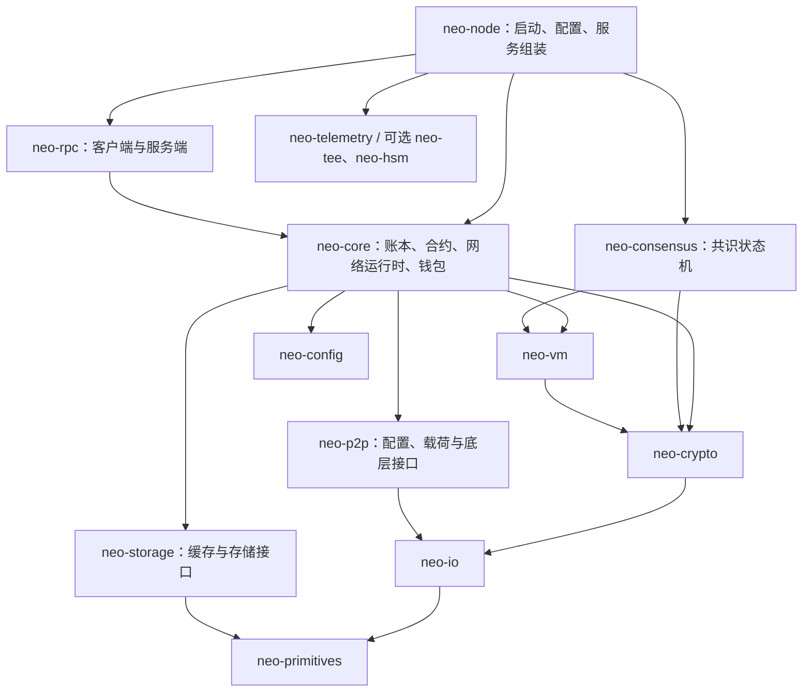

# neo-rs 系统性审查报告

审查日期：2026-09-05。范围：架构、设计、目录与模块结构、协议正确性、代码质量、风格、功能完整性、交付专业性、性能及高级优化。

**总体判断：项目已经形成覆盖广泛、具有实质实现和测试积累的 Neo N3 节点，但当前证据不足以支持“与 C# 完全等价、可直接作为生产共识节点”的结论。优先工作应是收敛协议语义、共识状态机和存储边界，随后建立生产构建与差分回放的发布门槛，再开展深层性能优化。**

最直接的交付阻断已实测：`neo-node --features full` 在排除本机原生头文件问题后，仍因 RocksDB provider 的 6 处 Rust trait 返回类型不匹配而编译失败（R21）。与此同时，默认特性 2,221 项库测试与选定 35 项集成测试均通过，说明必须分别看待默认测试、完整构建和协议等价性。

本次仅审查并生成报告，没有修改项目代码、配置或既有测试。复现程序和检查日志保存在仓库外。

## 1. 基线、方法与证据边界

| 项目 | 审查基线 |
|---|---|
| 仓库 | `D:/Git/neo-rs` |
| 分支 | `protocol-v3.10.1-compliance` |
| HEAD | `b31a7fe869d451c7d4a1816a0cac6b5d512ec623` |
| 实际对象 | 当前工作树，包含审查开始前已有的 972 个变更路径；不能将结论直接归于 HEAD 的纯提交内容 |
| Cargo 版本 | workspace `0.16.0`，edition 2024，声明 MSRV 1.85 |
| 本机工具链 | PATH 中的 Rust/Cargo 1.95.0，host 为 `x86_64-pc-windows-gnullvm`；MSRV 实验另外显式调用已安装的 Rust 1.86 MSVC |
| 协议参考 | Neo / NeoVM `v3.10.1`；dBFT 参考采用下文链接中的固定 neo-modules 提交 |
| 代码定位 | 优先使用已有 CodeGraph，再读取未覆盖的调用细节；关键问题检查了上层调用与已有防护 |

协议参考版本来自项目自身的兼容目标，并核对了[官方 Neo v3.10.1 发布页](https://github.com/neo-project/neo/releases/tag/v3.10.1)。本地 `neo_csharp` 没有可用于完整对照的 C# 源码，因此使用官方标签源码进行协议核对。

审查分为整体架构与存储、VM/合约与交易、共识与 P2P、RPC/Oracle/硬件扩展四个并行范围，并交叉复核重要发现。建立了 1,456 个源码及项目文本文件的 SHA-256 清单，检查审查期间内容变化；最终核验见第 8 节。

**证据等级：**“动态”表示运行了当前 Rust 实现或构建工具；“静态确认”表示代码、调用路径和必要参考实现足以证明局部缺陷；“条件性影响”表示后果还需要特定消息调度、存储故障或部署配置。本文不把静态推导写成已发生的主网事故。

这是覆盖主要信任边界的系统性审查，未逐行穷尽全部代码，也未逐方法认证所有原生合约。未运行 C# 节点、完整主网回放、真实 SGX/Ledger/PKCS#11 硬件验收或对外网络攻击实验；不提供虚构的覆盖率、TPS、全网分叉或生产稳定性结论。

## 2. 架构与设计评价

### 2.1 实际结构

Cargo metadata 显示 17 个 workspace 成员，包括 15 个产品 crate、集成测试 crate 和基准 crate；fuzz 独立于 workspace。按仓库 Rust 文件物理行数统计，包含注释、空行、测试和 examples，`neo-core` 为 622 个文件、127,014 行，`neo-rpc` 为 131 个文件、38,161 行，`neo-vm` 为 100 个文件、25,099 行。它们说明维护责任集中度，不代表测试覆盖率或复杂度评分。

下面是简化后的实际依赖方向，箭头表示“依赖”：



**值得保留的设计：**

- `neo-consensus` 不反向依赖 `neo-core`，由节点层适配钱包、交易获取和持久化，方向合理。
- 基础类型、加密、序列化、存储接口独立；本地 `neo-vm` 是实际链接的规范 crate，并非无效的重复目录。
- 共识 handlers、RPC registry/routes、原生合约 metadata、交易无状态/有状态验证已有清楚的拆分。
- 交易 overlay、FAULT 丢弃、提交错误返回、状态根 staging 等机制已有实质实现。问题主要在边界不变量的完整性，而非完全缺少设计。

### 2.2 主要架构债务

| 设计问题 | 当前证据与后果 | 建议方向 |
|---|---|---|
| `neo-core` 职责过宽 | 同时承担协议、P2P actor、存储 provider、钱包、Oracle、状态服务与 tracker；修改一处常牵动运行时和测试构建 | 先限制公开 API、建立内部模块依赖规则，再按稳定端口提取服务；不以拆更多 crate 为目标 |
| 两套 VM 执行路径存在语义分叉 | 同一脚本已实测得到不同状态；诊断配置又能改变路径，见 R06/R07 | 建立共享语义规范和跨执行器差分门槛，优化路径必须证明等价 |
| 共识跨层不变量靠调用约定维持 | quorum、交易验证、签名状态、持久化、广播分别位于不同层；见 R01–R03 | 使用已验证提案类型和统一 Commit effect，令非法顺序难以表达 |
| 存储接口丢失错误信息 | `Option` 和不含错误项的 iterator 混合“没有数据”与“读失败”，见 R09 | 将状态机关键读取改成 `Result<Option<T>>` 和可失败迭代，外围再做兼容适配 |
| 配置存在多个权威模型 | `neo-config::Settings`、`neo-core::ProtocolSettings`、节点 `NodeConfig` 及插件 RPC 配置分别转换和验证 | 明确一个生效配置模型，提供带来源的有效配置输出；用转换契约测试避免默认值漂移 |
| 快照缓存缺少版本归属 | 全局 typed cache 被多个快照共享，见 R10 | 缓存绑定 snapshot/sequence，区分历史视图、未提交 overlay 与最新状态 |
| 网络连接所有权设计限制并发 | reader 在网络 await 内持有 writer 也需要的锁，见 R11 | 拆分 read/write halves 与独立任务，锁仅保护元数据 |

源码入口：[节点配置](/D:/Git/neo-rs/neo-node/src/config/sections.rs:12)、[公共 Settings](/D:/Git/neo-rs/neo-config/src/settings.rs:11)、[核心协议设置](/D:/Git/neo-rs/neo-core/src/protocol_settings.rs:28)、[节点依赖](/D:/Git/neo-rs/neo-node/Cargo.toml:34)。

## 3. 主要发现与优先级

P1 表示应在对应能力投入生产前解决；P2 表示明确功能、边界或可维护性问题。严重性不等于现实攻击已经发生。可选功能的问题只在启用该功能时适用。

| 编号 | 优先级 | 发现 | 主要证据 |
|---|---|---|---|
| R01 | P1 | 共识主节点可在准备阶段贡献两票 | 静态确认；停块序列推导 |
| R02 | P1 | 未取得并验证提案也能签发 Commit | 静态确认；消息重排条件 |
| R03 | P1 | 恢复状态持久化全部失败后继续广播 Commit | 静态确认；磁盘故障与重启条件 |
| R04 | P1 | 合法非标准 invocation 被快捷验证路径拒绝 | 静态对照；脚本合法性动态验证 |
| R05 | P1 | 应用执行附加了一百万指令的非协议限制 | Rust 动态复现；官方源码对照 |
| R06 | P1 | Gorgon 零位移语义未按 hardfork 切换 | Rust 动态复现；官方源码对照 |
| R07 | P1 | 两个执行器对同一 HASKEY 脚本结果不同 | Rust 动态复现 |
| R08 | P1 | RocksDB snapshot 析构可能晚于数据库释放 | 静态确认并交叉复核 |
| R09 | P1 | RocksDB 读取失败被当成缺失或跳过条目 | 静态确认；异常 I/O 条件 |
| R10 | P2 | typed 全局缓存违反快照隔离与提交可见性 | 静态确认；限定 typed 路径 |
| R11 | P1 | P2P 等待读取阻塞同连接的发送 | 静态确认；正常沉默 peer 即可触发等待 |
| R12 | P1 | 单个停滞 TLS 握手阻塞 RPC 接受循环 | 静态确认；内置 TLS 条件 |
| R13 | P1 | 默认/发布构建不包含默认生产存储能力 | manifest、启动代码与 Docker 对照 |
| R14 | P1 | 声明的 Rust 1.85 与锁定依赖不兼容 | Rust 1.86 实测已被依赖拒绝 |
| R15 | P1 | Oracle 地址检查与实际 DNS 连接未绑定 | 静态确认；可控 DNS 条件 |
| R16 | P1 | SGX 证据验证被过度等同于可信执行和动态证明 | 静态确认；可选硬件功能 |
| R17 | P2 | Ledger HID 单帧截断正常签名消息 | 长度与协议静态对照；未做硬件实验 |
| R18 | P2 | Oracle 响应结果依赖网络 chunk 划分 | 静态确认 |
| R19 | P2 | RPC burst 配置被忽略，GET/POST 重复计费不一致 | 静态确认；既有测试固化错误语义 |
| R20 | P2 | 未来视图 RecoveryMessage 提前返回并丢弃剩余内容 | 静态确认 |
| R21 | P1 | full 节点的 RocksDB provider 有 6 处 trait 类型不匹配，无法编译 | 完整特性检查实测 |

### R01 — 共识主节点被重复计票

[PrepareResponse 处理](/D:/Git/neo-rs/neo-consensus/src/service/handlers/prepare.rs:197)仅检查响应 map 中是否已存在发送者，没有排除 primary；[准备票计数](/D:/Git/neo-rs/neo-consensus/src/context/mod.rs:299)使用“收到 PrepareRequest 的隐式一票 + PrepareResponse 数量”。因此同一 primary 的请求和响应计为两票。

一个完整静态触发场景是 4 个验证人、M=3：恶意 primary 分别向三个诚实 backup 提出 nonce 不同的合法空块；每个 backup 的请求票加自身响应为 2，primary 再发匹配该提案的响应使各自达到 3。三个诚实节点分别 Commit 不同区块，却没有任何一个区块能收齐 3 个不同验证人的最终签名。[Commit 后的超时处理](/D:/Git/neo-rs/neo-consensus/src/service/lifecycle.rs:177)和[视图切换限制](/D:/Git/neo-rs/neo-consensus/src/service/handlers/change_view.rs:66)使其进入停块条件。

最终 Commit 仍按不同验证人核验，故此处没有证明双花或伪造最终 quorum。问题是准备阶段的唯一投票人约束被破坏，且存在容错范围内的活性失效序列。应将请求和响应放入同一验证人槽位，并增加多节点 primary equivocation 测试。官方采用统一的 PreparationPayloads 槽位：[固定版本处理逻辑](https://github.com/neo-project/neo-modules/blob/8c6b64b75cb2d133714d4a843f2dcb84dd16ddec/src/DBFTPlugin/Consensus/ConsensusService.OnMessage.cs)。

### R02 — Commit 缺少已验证提案前置条件

[check_prepare_responses](/D:/Git/neo-rs/neo-consensus/src/service/handlers/prepare.rs:301)只看票数，缺失 `proposed_block_hash` 时还使用 `unwrap_or_default()`。同文件 241 行在本地没有 preparation hash 时允许先保存响应。[节点组装顺序](/D:/Git/neo-rs/neo-node/src/consensus.rs:1051)先处理共识消息，再尝试本地交易检查，上层未阻止该路径。

7 个验证人、M=5 时，某 backup 的请求包被延迟，但先收到另外 5 个 backup 的合法响应，就能在没有提案的情况下签发零哈希 Commit。收到请求但交易仍不齐时也可以提前 Commit。[恢复处理](/D:/Git/neo-rs/neo-consensus/src/service/handlers/recovery.rs:285)另有相似入口。

能够确定的是发出无效承诺和进入错误 CommitSent 状态；不能据此断言无效区块必然入账，也不应将本项单独说成必然永久停块。建议建立 `ValidatedProposal`，统一所有签名入口，在签名和广播前检查提案、交易、视图与已签状态。官方额外检查交易完整性：[准备条件](https://github.com/neo-project/neo-modules/blob/8c6b64b75cb2d133714d4a843f2dcb84dd16ddec/src/DBFTPlugin/Consensus/ConsensusService.Check.cs)。

### R03 — 无法持久化承诺时仍继续广播

[节点 Commit 广播流程](/D:/Git/neo-rs/neo-node/src/consensus.rs:571)先保存数据库恢复状态，失败后尝试文件；585 行附近在两者均失败时仅 warning，随后仍广播。[恢复存储函数](/D:/Git/neo-rs/neo-node/src/consensus.rs:1125)将失败返回为 bool，没有另一个强制停止路径。

在两种存储同时失效、节点已经广播 Commit、随后该高度完成前崩溃重启的条件下，节点不能可靠恢复已签承诺，存在重新签署不同提案的风险。应将“承诺可靠保存”设为广播前不可绕过的门槛；失败后停止新增签名并使健康状态明确失败。验收需涵盖 DB、文件、双失败及 crash/restart 的组合。官方也在发送前保存状态，见上面的固定版本 Check.cs。

### R04 — 快捷见证验证扩大了拒绝范围

[单签快捷路径](/D:/Git/neo-rs/neo-core/src/network/p2p/payloads/transaction/verification.rs:206)和[多签快捷路径](/D:/Git/neo-rs/neo-core/src/network/p2p/payloads/transaction/verification.rs:236)在 verification script 为标准格式、invocation 不是预期 PUSHDATA1 模式时直接拒绝。

但 `PUSHDATA2 <64 字节有效签名>` 或 `NOP; PUSHDATA1 <签名>` 可以是合法 VM 脚本。官方只在 invocation 与 verification 两侧都满足快捷格式时使用快捷验证，其余回到 VM。已动态确认当前 Rust strict Script 接受 PUSHDATA2；完整有效签名交易的接受差异由两边验证流程证明，未动态运行完整交易实验。[官方交易验证](https://github.com/neo-project/neo/blob/v3.10.1/src/Neo/Network/P2P/Payloads/Transaction.cs#L325-L375)、[见证回退](https://github.com/neo-project/neo/blob/v3.10.1/src/Neo/SmartContract/Helper.cs#L300-L353)、[strict Script 规则](https://github.com/neo-project/neo-vm/blob/v3.10.1/src/Neo.VM/Script.cs#L70-L128)。

影响是拒绝参考实现可接受的交易，涉及区块验证时存在互操作风险。快捷模式识别失败应回退通用路径；真正验签失败才拒绝。测试应包含等价但非最短编码的 invocation，并保留正确费用核算。

### R05 — 一百万指令上限进入共识执行

[默认 VM limits](/D:/Git/neo-rs/neo-vm/src/vm/limits.rs:54)设置 1,000,000 指令上限；[执行循环](/D:/Git/neo-rs/neo-vm/src/execution_engine/execution.rs:136)强制执行；[ApplicationEngine 构造](/D:/Git/neo-rs/neo-core/src/smart_contract/application_engine/state.rs:38)沿用默认，另一[解释器路径](/D:/Git/neo-rs/neo-core/src/smart_contract/application_engine/external_vm.rs:30)也使用它。

动态复现：十字节脚本 `02161605009d4a24fe40`，即 333334 次递减循环，总计 1,000,004 条指令，默认配置在 1,000,000 条处 FAULT；只将独立实例上限调到 2,000,000 后即 HALT，结果为 0。按[opcode 价格](/D:/Git/neo-rs/neo-core/src/smart_contract/application_engine/op_code_prices.rs:7)和执行因子 30 静态计算，费用为 `(1 + 333334 × (4+2+2)) × 30 / 10^8 = 0.8000019 GAS`；probe 没有接入 ApplicationEngine gas host，这不是实测 gas 数值。官方限制中没有这项指令计数上限：[NeoVM ExecutionEngineLimits](https://github.com/neo-project/neo-vm/blob/v3.10.1/src/Neo.VM/ExecutionEngineLimits.cs)。

本地反滥用预算不能直接成为共识有效性规则。应由协议 gas 与规定的资源界限决定链上执行结果；RPC 可以另外实施准入、取消和服务预算，但须区分服务拒绝与 VM FAULT。未运行同脚本的 C# 二进制，对照结论来自固定版本源码。

### R06 — Gorgon 零位移语义未正确切换

[共享算术语义](/D:/Git/neo-rs/neo-vm/src/semantics/arithmetic.rs:194)与[解释器数字操作](/D:/Git/neo-rs/neo-vm/src/interpreter/executor/numeric_ops.rs:94)在移位量为 0 时保留输入原类型。脚本 `0c010110a8d92140` 将 ByteString(01) 左移 0 位后检查是否 Integer，两个 Rust 执行器均动态返回 false。

官方 Gorgon 后路径先做整数转换，再压入 Integer，因此应为 true；更早规则才保留旧行为。当前 ApplicationEngine 使用默认执行表，没有对应的 fork 分派。[官方数字语义](https://github.com/neo-project/neo-vm/blob/v3.10.1/src/Neo.VM/JumpTable/JumpTable.Numeric.cs#L220-L240)、[官方 hardfork 分派](https://github.com/neo-project/neo/blob/v3.10.1/src/Neo/SmartContract/ApplicationEngine.cs#L668-L691)。

应以执行高度/协议配置选择语义，而非统一改成一种行为。验收需覆盖激活前一块、激活块、激活后一块，以及 ByteString、Integer、超长输入。此处不推断当前主网激活状态。

### R07 — 双执行器结果不一致，诊断开关改变执行入口

脚本 `c20fcb40`，即 `NEWARRAY0; PUSHM1; HASKEY; RET`，在当前构建中实测：stateful 引擎 FAULT（Invalid array index），解释器 HALT(false)。原因是[JumpTable 下标检查](/D:/Git/neo-rs/neo-vm/src/jump_table/compound.rs:378)与[共享 collection 语义](/D:/Git/neo-rs/neo-vm/src/semantics/collections.rs:237)处理负数的方式不同。

[ApplicationEngine 路径选择](/D:/Git/neo-rs/neo-core/src/smart_contract/application_engine/external_vm.rs:292)会在存在 diagnostic 时禁用快速解释器。故这是同一字节码在不同执行入口返回不同结果的真实缺陷，并且调试观察可能改变行为。Gorgon 后官方 HASKEY 也会对负下标 FAULT：[官方边界检查](https://github.com/neo-project/neo-vm/blob/v3.10.1/src/Neo.VM/JumpTable/JumpTable.Compound.cs#L252-L290)。

应将两个执行器的状态、栈类型、gas、通知、存储写集和异常位置纳入同一差分测试；diagnostic 只能观察，不能改变语义。当前动态复现运行两个 VM 入口，没有启动带 diagnostic 的完整 RPC 节点。

### R08 — RocksDB snapshot 与 DB 析构顺序不安全

[RocksDbSnapshot 字段](/D:/Git/neo-rs/neo-core/src/persistence/providers/rocksdb/store.rs:343)按 `store → db → snapshot` 声明；[create_snapshot](/D:/Git/neo-rs/neo-core/src/persistence/providers/rocksdb/store.rs:375)通过 unsafe 将 DB 借用提升为 `'static`。当其他 store/DB 强引用均已释放、该 snapshot 成为最后 DB 拥有者时，结构体析构会先释放 store（包括其间接持有的 DB Arc），再释放 db 的最后 Arc，最后才析构 snapshot。

Rust 的结构体字段按声明顺序析构；rocksdb 0.21 的 Snapshot Drop 会调用 `self.db.release_snapshot`。因此代码中的“Arc 保证数据库活得足够久”注释没有覆盖析构阶段，存在释放后使用或底层关闭断言/崩溃风险。[Rust 析构规则](https://doc.rust-lang.org/reference/destructors.html#destructors)、[依赖 Snapshot 源码](https://github.com/rust-rocksdb/rust-rocksdb/blob/v0.21.0/src/snapshot.rs)。

该结论经过独立复核，未执行可能崩溃的原生库实验。建议使用明确的拥有者/借用封装，确保 snapshot 先于所有 DB owner 释放；必要时显式控制 Drop。验收至少包括“释放原 store 后继续使用并释放 snapshot”，以及 native sanitizers 下的生命周期测试。

### R09 — 存储读取错误被静默解释为数据缺失

[RocksDbStore::try_get](/D:/Git/neo-rs/neo-core/src/persistence/providers/rocksdb/store.rs:101)将错误记录后返回 None；[snapshot 原始读取](/D:/Git/neo-rs/neo-core/src/persistence/providers/rocksdb/store.rs:477)使用 `.ok().flatten()`；[迭代读取](/D:/Git/neo-rs/neo-core/src/persistence/providers/rocksdb/store.rs:515)直接过滤 Err。上层无法区分“余额/合约/状态不存在”与“数据库读取失败”，也不知道扫描是否缺条目。

触发前提是 I/O 或数据库损坏，并非正常数据下必然错误。但对确定性状态机而言，继续按缺失数据执行、生成不完整查询或计算状态，均比显式失败危险。应将关键存储读接口改为可失败返回，节点遇到状态读取错误停止该次验证/执行，不继续以默认状态解释。已有 `try_commit` 错误传播是正确方向，应扩展到读路径。验收需注入 get、seek、iterator 中途失败，而不只测试写失败。

### R10 — typed 共享缓存污染快照和提交可见性

[provider 默认开启读缓存](/D:/Git/neo-rs/neo-core/src/persistence/providers/rocksdb/provider.rs:56)。[typed snapshot 读取](/D:/Git/neo-rs/neo-core/src/persistence/providers/rocksdb/store.rs:519)会将未提交 pending 值以及历史 snapshot 的值写入全局 cache，缓存键没有 snapshot/sequence 身份。

还有一条无需历史快照的交错：snapshot.put(k,new) 驱逐缓存 → 其他 typed store reader 从数据库读取 old 并回填 → snapshot.commit 写入 new → [commit 不再失效缓存](/D:/Git/neo-rs/neo-core/src/persistence/providers/rocksdb/store.rs:708) → 新 typed reader 仍得到 old。

影响必须限定：[StoreCache::new_from_store](/D:/Git/neo-rs/neo-storage/src/persistence/store_cache.rs:41)走 typed 路径；[new_from_snapshot](/D:/Git/neo-rs/neo-storage/src/persistence/store_cache.rs:77)走原始字节路径，绕过该共享缓存。不能据此声称默认区块持久化已经产生分叉。

建议缓存以 snapshot/sequence 为边界，禁止未提交值进入最新状态全局缓存；提交时实施可靠的版本切换或失效。仅增加一次 cache.clear 不能完整修复历史 snapshot 回填污染。应验证并发读写、旧 snapshot 存活、提交失败重试及 rollback 的可见性。

### R11 — P2P reader 跨 await 持锁，阻塞 writer

[reader](/D:/Git/neo-rs/neo-core/src/network/p2p/remote_node/handshake.rs:75)获得共享连接 mutex 后，在 guard 内 await `receive_message`；[send_wire_message](/D:/Git/neo-rs/neo-core/src/network/p2p/remote_node/routing.rs:91)必须获得同一个锁才能发送。对端沉默、本机要发送 GetData/Ping/共识消息时，即使 socket 可写，也只能等待读锁释放。

[默认 active read timeout](/D:/Git/neo-rs/neo-p2p/src/channels_config.rs:57)为 120 秒；[FrameReader](/D:/Git/neo-rs/neo-core/src/network/p2p/framed.rs:230)又按每次底层 read 重新计算期限，持续碎片可进一步延长。writer 的网络写超时不覆盖等锁时间，actor 等待发送时也不能正常处理后续控制消息。

应拆分 TCP 的读写所有权，使用独立有界 writer 队列与控制通道。Tokio 提供可分配给独立任务的[owned read/write halves](https://docs.rs/tokio/latest/tokio/net/struct.TcpStream.html#method.into_split)。测试重点是沉默 peer 下及时出站、部分帧下及时关闭，以及停止命令不被普通消息阻塞。此处未运行双节点延迟实验。

### R12 — 内置 TLS 握手使 RPC 接受循环发生队首阻塞

[RPC 接受流](/D:/Git/neo-rs/neo-rpc/src/server/rpc_server.rs:292)在 `stream::unfold` 内 accept TCP 后，直接 await TLS handshake，没有单独期限或并行握手任务。一个建立 TCP 连接后不发送 ClientHello 的客户端，会使该流无法产出连接，也无法接受下一个客户端。

354 行的 HTTP headers timeout 在 TLS 完成后才起作用；已有连接 semaphore 不能修复握手串行等待。影响条件是启用内置 TLS。应采用有界并发握手和明确 deadline，测试“一个停滞握手不妨碍另一个正常请求”。未执行网络 PoC，缺陷来自接受循环的确定性控制流。

### R13 — 默认构建产物无法满足默认生产存储配置

[neo-node features](/D:/Git/neo-rs/neo-node/Cargo.toml:21)中 `default=[]`，只有 `full` 才启用 `neo-core/full`；普通依赖仅启用 `runtime`。[启动选择存储](/D:/Git/neo-rs/neo-node/src/startup/config.rs:34)在未编译 full 时明确拒绝 RocksDB。

但 README 的 Quick Start 使用 `cargo build --release` 后直接运行 [MainNet RocksDB 配置](/D:/Git/neo-rs/neo_mainnet_node.toml:8)；[Dockerfile 构建命令](/D:/Git/neo-rs/Dockerfile:54)同样没有 `--features full`，而[容器默认后端](/D:/Git/neo-rs/Dockerfile:111)为 RocksDB。[Windows CI](/D:/Git/neo-rs/.github/workflows/ci.yml:119)也只构建默认节点。

因此即使解决下述工具链问题，所描述的生产构建与启动配方仍互相矛盾。建议明确 dev/light/full 交付配置，发布产物固定包含其宣称的功能，并在 CI 中真正启动“产物 + 随包配置”，完成持久化、关闭和重启冒烟验证。不是把所有可选硬件 feature 无差别设为默认。

### R14 — MSRV 和 Docker 构建工具链已失真

[workspace](/D:/Git/neo-rs/Cargo.toml:95)声明 Rust 1.85，[Dockerfile](/D:/Git/neo-rs/Dockerfile:4)固定 `rust:1.85-bookworm`，但 [Cargo.lock](/D:/Git/neo-rs/Cargo.lock:4240)锁定 `time 0.3.47`。实际依赖链为 `neo-node / neo-telemetry → tracing-appender 0.2.4 → time 0.3.47`，其 manifest 要求 Rust 1.88。

本次用已安装的 Rust 1.86 执行 locked/offline node check，编译前即报 `time@0.3.47 requires rustc 1.88.0` 和 `time-core@0.1.8 requires rustc 1.88.0`。这是比声明版本还新的工具链仍失败的实测证据；没有实际运行 Docker 构建。

应统一 MSRV、lockfile、容器镜像和发布工具链，或者重新锁定真正支持声明 MSRV 的依赖；增加独立 MSRV lane。只用 stable CI 会掩盖这一承诺破坏。

### R15 — Oracle 私网过滤与 DNS 连接存在检查/使用脱节

[地址检查](/D:/Git/neo-rs/neo-core/src/oracle_service/https/security.rs:23)只检查 DNS 结果的第一个地址；[后续请求](/D:/Git/neo-rs/neo-core/src/oracle_service/https/process.rs:48)通过普通 reqwest client 重新按域名连接，没有固定已验证地址。[redirect 检查](/D:/Git/neo-rs/neo-core/src/oracle_service/https/security.rs:100)还允许 HTTP。

在 Oracle 功能运行、请求方控制 URL/DNS、节点网络可达目标的条件下，多地址回退或重绑定能让“被检查地址”与“实际连接地址”不同。攻击者控制的 HTTPS 起点还可以跳转到 HTTP 域名，使后续连接不依赖内部目标的 TLS 证书。没有执行内网访问实验。

应验证全部候选地址，绑定本次连接所用地址，并在每次重定向重新检查 scheme/host/port。reqwest 有[显式解析覆盖和 resolver 接口](https://docs.rs/reqwest/latest/reqwest/struct.ClientBuilder.html#method.resolve)，但采用它们后仍需保持 TLS 主机名验证和地址生命周期正确。

### R16 — SGX 当前能力边界与可信执行声明不一致

[TEE 声明](/D:/Git/neo-rs/neo-tee/src/lib.rs:3)覆盖钱包保护、公平排序和真实 SGX 支持，但当前 `sgx-hw` 路径从[主机环境/普通文件](/D:/Git/neo-rs/neo-tee/src/sgx.rs:240)读取完整 sealing key，放入[宿主进程 RwLock](/D:/Git/neo-rs/neo-tee/src/enclave/runtime.rs:194)，[钱包签名](/D:/Git/neo-rs/neo-tee/src/wallet/tee_wallet.rs:257)在当前进程解封私钥并直接执行。它没有建立“私钥始终留在 enclave 内”的执行边界。

此外，[证明生成](/D:/Git/neo-rs/neo-tee/src/attestation/service.rs:417)在请求的 report_data 与缓存 quote 不一致时仅警告，仍返回旧 evidence，同时给外层填当前时间。[批次证明入口](/D:/Git/neo-rs/neo-tee/src/attestation/service.rs:175)请求绑定的 merkle root/batch ID/时间并不能由该返回 quote 证明。

**已有 DCAP 验证、measurement/SVN/debug 检查和 quote-key hash 绑定，不能说“没有真实 quote 验证”。**缺的是受证明的可信执行，以及当次操作/挑战与证据绑定。应准确标注当前为证据验证或实验集成；要产品化，需要 enclave 内生成/封存/签名、明确 ECALL/OCALL 边界和挑战绑定。该问题只涉及宣称使用 SGX 保护的部署，不说明普通节点需要 SGX 才安全。

抗回滚也需补齐：[sealing](/D:/Git/neo-rs/neo-tee/src/enclave/sealing.rs:128)的认证数据未覆盖 counter，运行时 counter 是普通文件，钱包解封使用 `min_counter=None`。不能将这些机制对外描述为已提供硬件抗回滚。

### R17 — Ledger HID 传输不支持实际签名消息长度

[Ledger 发送](/D:/Git/neo-rs/neo-hsm/src/ledger/ledger_signer.rs:109)只建立一个 HID 报告，`resize(65,0)` 会截断超长内容；[节点签名输入](/D:/Git/neo-rs/neo-node/src/hsm_wallet.rs:328)是 36 字节网络号+hash，加 21 字节路径和 5 字节 APDU 头共 62 字节，超过首包 57 字节有效容量。[响应读取](/D:/Git/neo-rs/neo-hsm/src/ledger/ledger_signer.rs:133)也只读一次，不能重组通常需要多包的 DER 签名。

[Ledger 官方传输协议](https://github.com/LedgerHQ/btchip-doc/blob/master/bitcoin-technical.asc)定义了 chunk 和序列号分帧；本次没有真机实验，但请求长度截断链路明确。应采用成熟 transport 或完整有界分片状态机，并验证短包、连续包、错误序号、超长长度和真实签名。324 行附近的 DER parser 也应补齐边界检查，避免异常设备响应导致 panic。

### R18 — Oracle 将 transport chunk 当成响应大小约束

[响应处理](/D:/Git/neo-rs/neo-core/src/oracle_service/https/process.rs:218)把单次 chunk 大于 8 KiB 判为 ResponseTooLarge，但[配置](/D:/Git/neo-rs/neo-core/src/oracle_service/settings.rs:6)允许累计 64 KiB，229 行已有累计长度控制。

同一个合法 12 KiB body，如果在一次 chunk 中交付会失败，拆成两个较小 chunk 则可能成功。[reqwest bytes_stream](https://docs.rs/reqwest/latest/reqwest/struct.Response.html#method.bytes_stream)并不承诺固定 ≤8 KiB。结果因此可能随网络缓冲与分片方式变化。应限制累计解压后长度；固定解析块应由应用自己切片。验收应对同一 body 枚举不同 chunk 分割，要求结果一致。

### R19 — RPC 限流配置与传输行为不一致

[GovernorRateLimiter 构造](/D:/Git/neo-rs/neo-rpc/src/server/middleware/rate_limiter.rs:211)只根据 max_rps 缩放预设 tier，忽略传入的 burst。调用端却从配置传入 burst，因此 `max_rps=100, burst=1` 实际 Standard burst 是 200。

[GET 处理](/D:/Git/neo-rs/neo-rpc/src/server/routes/handlers.rs:87)先计一次方法额度，再进入 233 行附近的 process_object 计第二次；POST 只经过后一处。相同方法的有效配额随 HTTP verb 改变。[既有测试](/D:/Git/neo-rs/neo-rpc/tests/rate_limiter_governor.rs:22)在 burst=1 时断言同 IP 前两次均通过，正好说明“测试通过”也可能固化错误的配置语义。

应明确全局额度、方法成本与 burst 的契约，每个请求在一个权威位置计费，并对 GET/POST、batch、notification 进行配置驱动验证。未运行额外的限流服务实验。

### R20 — 未来视图恢复包只消费一部分后即去重

[RecoveryMessage 处理](/D:/Git/neo-rs/neo-consensus/src/service/handlers/recovery.rs:139)在处理未来视图 ChangeView 后无条件 return。即使这些投票已将本机推进到该视图，也不继续消费同包的 PrepareRequest/Responses/Commits。[消息去重](/D:/Git/neo-rs/neo-consensus/src/service/lifecycle.rs:146)随后将整个 hash 标记为已处理，相同包重传不能补齐内容。

影响是增加恢复对另一份不同消息的依赖，在丢包或恢复源少时继续超时；未证明此项单独足以永久停块。应在视图推进后重新判断并继续消费剩余内容，或准确记录已消费范围。官方连续条件处理可供对照，见 R01 的固定版本 OnMessage.cs。

### R21 — 完整节点特性无法通过 Rust 类型检查

`cargo check --locked -p neo-node --features full` 初次受本机 GNU LLVM 的 Windows API 头文件限制影响。只在检查进程设置 `CXXFLAGS=-D_WIN32_WINNT=0x0602` 后，原生 RocksDB 编译通过，随后暴露 **6 个 E0053**：

- [RocksDBStoreProvider::get_store](/D:/Git/neo-rs/neo-core/src/persistence/providers/rocksdb/provider.rs:105)。
- [RocksDbStore::delete](/D:/Git/neo-rs/neo-core/src/persistence/providers/rocksdb/store.rs:234)、[put](/D:/Git/neo-rs/neo-core/src/persistence/providers/rocksdb/store.rs:247)、[put_sync](/D:/Git/neo-rs/neo-core/src/persistence/providers/rocksdb/store.rs:260)。
- [RocksDbSnapshot::delete](/D:/Git/neo-rs/neo-core/src/persistence/providers/rocksdb/store.rs:641)、[put](/D:/Git/neo-rs/neo-core/src/persistence/providers/rocksdb/store.rs:650)。

这些实现返回 `CoreResult`，但重导出的 [WriteStore trait](/D:/Git/neo-rs/neo-storage/src/persistence/write_store.rs:4)与[StoreProvider trait](/D:/Git/neo-rs/neo-storage/src/persistence/store_provider.rs:7)要求 `StorageResult`。这是源码接口不兼容，不能归咎于 Windows 头文件问题；默认测试未启用 RocksDB，因而没有编译到这些方法。

应统一 provider 的存储错误边界及上层转换，并把 full check/test 设为发布必经项。本次遵守只审查要求，没有修改返回类型。R08–R10 是对该后端源码的进一步静态审查；由于当前 full 构建失败，不能将它们描述为本次已经在这个构建产物中触发的运行时故障。

## 4. 功能完整性与工程专业性

### 4.1 功能覆盖判断

| 能力 | 当前判断 | 达到生产确信仍需的证据 |
|---|---|---|
| 序列化、基础类型、密码学 | 实质实现且有大量测试；主 P2P 路径有帧/解压上限与尾随数据检查 | 固定参考版本的二进制向量、恶意长度/非规范编码的差分验证 |
| 账本、交易、原生合约 | 主体覆盖广泛，支持分层验证、overlay、native metadata 和历史回放 | 完整 fork 边界与实际链状态下的执行、费用、通知和状态根一致性；修复 R04–R07 |
| dBFT | 有消息、视图、恢复、签名和节点接入 | 修复 R01–R03/R20；4/7 节点恶意主节点、乱序、崩溃模拟 |
| 持久化与状态根 | 有 RocksDB、快照、MPT staging 和提交失败测试，但当前 full 构建不通过 | 先修复 R21，再修复生命周期/错误语义；真实 RocksDB 故障与重启验收 |
| P2P 同步 | 有 actor、任务调度、缓存、有数量上限的发送队列和请求追踪 | 修复 R11；真实双节点读写并发、慢 peer、长期同步与资源预算实验 |
| RPC | registry/routes/metadata 清楚，HTTP 资源限制覆盖多方面 | 修复 TLS、配额语义；昂贵方法的调度和取消、WS 策略一致性 |
| 钱包 | key Drop 清零、Debug 遮蔽、NEP2 Zeroizing 有实际实现 | 地址/派生/导入导出向量及硬件端到端签名验收；不以 simulation 测试代替 |
| Oracle | 有请求处理、过滤、交易生成和 NeoFS 集成 | 修复地址连接绑定、chunk 依赖；网络故障/分片测试及 oracle、neofs-grpc 特性矩阵 |
| HSM / TEE | PKCS#11 有曲线和签名处理；SGX 有真实证据校验 | Ledger 多包支持；真正 enclave 执行及动态证明；分别定义实验/生产支持级别 |

不能用“模块存在”“测试数量多”推导百分之百兼容。README 中的全完成声明需要可追溯到版本、脚本、报告和复现数据的证据矩阵。

### 4.2 风格一致性

格式层面表现良好，本次 `cargo fmt --all --check` 通过。很多大文件已按 handlers、metadata、helpers、tests 拆分；最大文件中相当一部分是测试，不应机械地为了行数继续碎片化。

更值得治理的是语义风格：

- 同一项目同时存在 `commit` 日志吞错与 `try_commit` 返回错误、typed 与 raw 两套读取、多个设置转换模型；应统一每一层的错误和状态语义。
- 边界中不宜通过 `unwrap_or_default()` 把缺失提案变成零哈希，或通过 `.ok()` 把存储失败变成缺失值。对关键状态使用显式类型和 Result。
- `neo-core` 此次构建产生 196 条 warning，许多是公开 API 缺文档。公开 API 数量和可支持边界应收敛；禁止以全局 allow 掩盖新增问题。
- 架构测试中大量 `source.contains(...)` 可以防止某些导入回归，但它们绑定拼写而非行为。例如[VM 边界测试](/D:/Git/neo-rs/tests/tests/no_local_neo_vm_dependency.rs:86)检查源字符串。应保留少量结构规则，把协议可信度建立在行为和差分测试上。

### 4.3 文档、CI、发布的专业性

1. **版本和架构文档失配。** [ARCHITECTURE.md](/D:/Git/neo-rs/ARCHITECTURE.md:3)仍写 0.7.0 / Neo 3.9.2，并描述当前不存在的 neo-cli、neo-chain、neo-state 等 crate；[README](/D:/Git/neo-rs/README.md:115)兼容表写 0.15.x，而 workspace 是 0.16.0。应由实际 metadata 生成依赖图和构建特性表。
2. **历史证据与当前保证混在一起。** [README 测试声明](/D:/Git/neo-rs/README.md:164)仍为 343 个 core 库测试、520+ 集成测试及全部 C# UT 已转换；本次 core 库实际运行 741 项。数量差异不是功能缺陷，但证明材料必须标注日期、commit、feature、命令和适用范围。[MAINNET-STATUS](/D:/Git/neo-rs/MAINNET-STATUS.md:1)是三月早期同步快照，不能作为九月当前运行保证。
3. **默认测试不能覆盖可选生产能力。** [CI](/D:/Git/neo-rs/.github/workflows/ci.yml:101)的 workspace 测试没有 `full`、Ledger、SGX hardware 特性矩阵；Rust stable 也不能证明 MSRV。发布应包含最小特性、完整节点、模拟后端、真实硬件后端编译和平台矩阵。
4. **兼容流水线是有价值的基础，但强度需明确。** [v3.10.1 工作流](/D:/Git/neo-rs/.github/workflows/compatibility-v3101.yml:106)要求固定 execution-spec ref，默认禁止 policy mismatch 调整，这是优点；但它设置 `VECTOR_GAS_TOLERANCE=1000000`，脚本使用 memory 节点（[配置生成](/D:/Git/neo-rs/scripts/validate-v3101-consistency.sh:211)）。它能验证部分协议/RPC 向量，不能代替逐块 RocksDB 状态回放；费用容差也不能作为逐单位 gas 等价的门槛。建议把精确确定性向量与允许环境差异的在线探针分开。
5. **基准命名与测量对象不一致。** [block_processing bench](/D:/Git/neo-rs/benches-package/benches/block_processing.rs:1)主要测 header/transaction 序列化和 hash；[state_root bench](/D:/Git/neo-rs/benches-package/benches/state_root.rs:52)明确尚待加入 MPT。它们不能证明真实区块处理和状态根性能。历史参数扩大倍数也不能等同于吞吐提升倍数。
6. **部分测试目标名不能代表实际覆盖。** 本次运行 `block_persistence` 集成目标显示 0 tests；[文件](/D:/Git/neo-rs/tests/tests/block_persistence.rs:1)解释旧类型删除后测试已移除。其他模块确实存在持久化相关测试，但这个目标本身没有验收作用。`p2p_message_exchange` 的 5 项也主要验证消息类型与构造，不是双节点 socket 通信实验。

进一步建议给发布产物附带 feature/build manifest、锁定依赖清单、已执行测试报告和可复现样本。生产镜像验收应至少验证启动、认证请求、持久化、退出重启及健康状态，而不只成功编译镜像。

## 5. 性能审查与高级优化路线

### 5.1 现有优化的实际状态

当前已采用 mimalloc、Rayon、缓存/预取配置、二进制写缓冲、共享数据和执行器快捷路径，release 还配置 fat LTO 与单 codegen unit。这些是值得测量的实现手段，不能仅据存在便宣称吞吐提升。

有三个特别需要澄清的地方：

- **当前 MPT 仍在同步等待。** [commit handler](/D:/Git/neo-rs/neo-core/src/state_service/commit_handlers.rs:157)spawn 线程后在 164 行立即 join。当前代码保持提交前的 staging/error gate，但没有实现与下一块执行的重叠，并且每块付出线程创建成本。不能依据历史异步 MPT 计划声称已经获得其预计收益。建议先比较直接调用与常驻 worker；如要重叠，必须重新设计有序发布与崩溃恢复，不能只删除 join。
- **存在没有进入当前 snapshot 写热路径的批处理层。** [BatchCommitter](/D:/Git/neo-rs/neo-core/src/persistence/providers/rocksdb/provider.rs:24)包含 WriteBatchBuffer，但当前 [snapshot commit](/D:/Git/neo-rs/neo-core/src/persistence/providers/rocksdb/store.rs:696)直接执行 DB write；检索到的 buffer 调用主要是 stats/flush。它不能证明当前已经跨块合批。该 buffer 自身还有自动 flush 忽略错误、取走 batch 后失败不能恢复的风险，因未确认生产写入调用而不计入主要运行路径发现。
- **队列内存预算只是估算。** [estimate_message_size](/D:/Git/neo-rs/neo-core/src/network/p2p/remote_node/outbound_queue.rs:240)把 Block/Transaction 分别按固定 2048/1024 字节估算；数量限制真实存在，8 MiB 估算阈值不能当成实际 RSS 上限。优先使用实际保留 bytes 和共享对象归属核算，再调并发窗口。

### 5.2 推荐的优化顺序

以下都是建议方案，本次没有实现或声称获得性能收益。

| 顺序 | 技术方案 | 适用位置与实现要点 | 必须保持的不变量 | 衡量指标 |
|---|---|---|---|---|
| 1 | 明确所有权与有界任务队列 | 修复 reader/writer 互锁；RPC 昂贵 VM/存储调用进入有界专用执行池；按实际字节获取 permits | 控制消息及时处理、取消可达、内存上界可信 | lock wait、queue wait、event-loop latency、p99、RSS |
| 2 | 一次解码、共享不可变 payload | 使用 Bytes/Arc 持有帧，typed view 和 filter 共享解析结果，减少序列化/再解压 | 严格尾随数据、长度、flag、解压上限一致 | copies/message、allocations/message、decode CPU |
| 3 | 不改变语义的验证复用 | 标准验签按 network、unsigned hash、witness bytes 缓存；交易到达触发增量共识校验 | policy、费用、账户状态仍按当前 snapshot 重算；缓存不能跨不兼容上下文复用 | 验签次数、mempool 扫描成本、提案准备延迟 |
| 4 | 存储视图和扫描优化 | snapshot 有版本身份；ordered overlay 与底层 iterator 懒合并；减少 full Vec/BTreeMap materialization；在真实多键负载评估 MultiGet | 读一致性、迭代顺序、写失败可重试、FAULT 隔离 | read amplification、alloc bytes、seek p99、每块写放大 |
| 5 | 常驻 MPT worker 和增量 dirty-subtree 处理 | 先消除每块 spawn/join；复用脏节点 hash，按版本有序提交；逐项核验现有 trie cache 命中再增设缓存 | 区块/状态根高度关系、失败不发布 root、可恢复的 durable checkpoint | MPT 时间、dirty nodes、hash 次数、root lag、恢复耗时 |
| 6 | VM 预解码基本块/超指令 | 在统一语义后合并调度开销；gas 仍逐逻辑 opcode 结算；保留原 ip 映射 | HALT/FAULT、gas、栈类型、trace、exception 完全一致 | instructions/s、dispatch CPU、branch miss、code size |
| 7 | 局部 arena 与稠密引用图 | 评估 VM 单执行上下文的 arena、可复用 buffer、整数 ID adjacency；避免大量 Arc/Mutex/线性查找 | alias、cycle、引用释放与最大栈项限制不改变 | allocation count、GC/reference CPU、峰值活跃对象 |
| 8 | PGO 与编译配置实验 | 用代表性回放训练 profile；比较 thin/fat LTO、codegen units；保留独立符号产物 | 相同向量/回放结果；可复现工具链和回滚 | CPU、binary size、build time、真实回放吞吐 |

实施细节与风险：

1. **分离无状态并行验证和有状态顺序执行。** 可以并行计算 hash、做独立密码学验证和预解码；涉及账户余额、合约存储、通知顺序的执行仍按协议顺序提交。若以后引入乐观并行，应记录读写集、验证版本、处理冲突并确定性重放；在此之前，不建议直接并行执行同一区块内任意交易。
2. **RPC 执行池必须真正有界。** [HTTP 同步处理路径](/D:/Git/neo-rs/neo-rpc/src/server/routes/handlers.rs:270)可能执行昂贵 VM 工作；已有 [jsonrpsee blocking adapter](/D:/Git/neo-rs/neo-rpc/src/server/jsonrpsee_adapter.rs:71)可供参考。仅增加 spawn_blocking 或把 max_blocking_threads 调得更大不能提供过载保护。应让 admission、deadline、排队和取消传播形成闭环。
3. **引用图优化先确认热度。** [Tarjan 实现](/D:/Git/neo-rs/neo-vm/src/vm/graph.rs:17)使用 Vec 保存索引与 on-stack 集合，多处线性查找；稠密 ID 的数组/bitset 可以保持 no_std 兼容并避免这些扫描。它是可验证的复杂度改进候选，不是已经通过 profile 证明的主瓶颈。
4. **并行 MPT 必须设计发布协议。** 可以尝试“区块执行写集 → 版本化 MPT 任务 → 有序 checkpoint 发布”，并规定 root 查询只见已完成版本。数据库和 MPT 分开持久化时，必须具备恢复日志/重放能力，不能以暂时提高同步速度交换不可恢复的一致性漏洞。
5. **PGO 放在正确性与基准之后。** Rust 支持 profile-generate/profile-use 的[官方 PGO 流程](https://doc.rust-lang.org/rustc/profile-guided-optimization.html)。训练数据需同时覆盖普通转账、合约、存储扫描、RPC 和同步，避免优化单一脚本而拖慢其他场景。

暂不推荐优先做：改变协议签名格式/聚合签名、降低 quorum、默认关闭 WAL 换取吞吐、无限扩大下载窗口、在尚无等价性证明时大范围 JIT 化。JIT、SIMD、无锁容器和数据库引擎替换都应由真实 profile 和兼容性实验决定。

### 5.3 应新增的性能基线

建议固定五类可复现数据集：真实历史区块区间；不同合约和写集大小；热/冷 RocksDB；高并发混合 RPC；包含沉默/慢速/恶意 peer 的同步。每份结果记录 commit、features、CPU、RAM、磁盘、工具链、数据库大小、缓存冷热、WAL/fsync 配置和重复运行分布。

必须同时报告吞吐、p50/p95/p99、RSS、CPU、I/O、写放大和正确性摘要；基准输出绑定最终 block hash、状态根和通知摘要。只报告平均耗时、参数倍数或单次最快结果不足以支持优化结论。

## 6. 建议执行路线与验收门槛

| 阶段 | 工作重点 | 完成标准 |
|---|---|---|
| A：协议与存储正确性 | R01–R10、R20；统一 VM fork 语义、Commit gate、存储错误与生命周期 | 新增反例在修复前失败、修复后通过；双执行器与固定官方语义一致；4/7 节点调度和磁盘故障模拟通过 |
| B：可交付节点 | R11–R14、R21；构建特性、MSRV、持久化启动与重启、连接读写；R21 可与阶段 A 同步处理 | 每个发布配置从干净环境构建，随包配置启动并完成持久化/重启；沉默连接不阻塞出站和接入 |
| C：可选能力边界 | R15–R19；Oracle、TLS/WS 策略、Ledger、TEE | 功能支持级别明确；模拟接口/网络故障测试通过；宣称支持的硬件有对应真机验收 |
| D：性能与长期运行 | 前述有界队列、减少复制、增量验证、MPT/VM 优化 | 代表性回放和混合负载重复测量；性能改进同时保留全部协议比较结果；长时间故障恢复结果可复现 |

发布前建议设置三道独立门槛：

- **协议门槛：**固定官方版本及 execution-spec commit；fork 前后边界；按交易状态、栈类型、gas、通知、存储变化与状态根比较。精确比较不使用统一宽容差掩盖差异。
- **恢复门槛：**Commit 持久化失败、区块提交中断、MPT 发布失败、旧快照存活、数据库错误均能进入定义好的恢复/停止状态。
- **交付门槛：**声明 MSRV、Windows/Linux 支持、默认/full/hardware feature 与镜像运行配方都有实际 CI 证据；文档版本和产物一致。

这些是建议的后续工程安排，本次没有创建变更任务、修改实现或执行部署。

## 7. 本次运行的验证

| 检查 | 结果 | 能证明什么 / 不能证明什么 |
|---|---|---|
| `cargo metadata --no-deps --format-version 1 --locked` | 通过 | 当前 workspace 与直接依赖可解析 |
| `cargo fmt --all --check` | 通过 | 格式符合当前 formatter 规则；不等同于设计一致 |
| `cargo test --workspace --lib --locked --no-fail-fast` | 15 个测试目标，2,221 passed，0 failed，0 ignored；其中一个目标 0 tests | 当前默认特性库测试通过；不覆盖全 feature、所有集成/文档/二进制测试 |
| 指定 neo-tests 集成目标 | 35 passed，0 failed：共识 19、层边界 11、P2P 消息 5；block_persistence 0 tests | 相应契约和单进程测试通过；没有实际完成多节点网络/磁盘恢复实验 |
| Rust 1.86 MSVC locked/offline node check | 失败：time/time-core 要求 Rust 1.88 | 支持 R14；使用 rustup 显式调用，非 PATH 中 GNU LLVM 工具链 |
| 默认环境的 `cargo check --locked -p neo-node --features full` | 在 librocksdb-sys 原生构建失败：GNU LLVM Windows 头文件缺少 FILE_ID_INFO/FileIdInfo | 属于当前完整特性构建的本机验证阻碍，不能据此推断 Linux/MSVC 都无法构建 |
| 临时指定 Windows API 版本后重试 full check | 失败：原生 RocksDB 通过，neo-core 出现 6 个 E0053，见 R21；exit 101 | 只改变检查进程的 CXXFLAGS，没有修改项目配置；确认存在独立于原生工具链的源码类型错误 |
| 独立 VM probe，链接本次构建的 neo-vm rlib | R05/R06/R07 的 Rust 行为已复现；strict PUSHDATA2 通过 | 未运行 C# 二进制或完整有效签名交易；gas 数值为静态协议计算 |

主要库测试分布：core 741、RPC 567、primitives 264、storage 160、crypto 124、VM 119、consensus 110、TEE 54、telemetry 21、IO 19、P2P 19、config 14、HSM 6、JSON 3。硬件模块默认 simulation 通过不代表 hardware 功能通过。

指定集成测试命令：

```text
cargo test --locked -p neo-tests --test layer_boundary_tests --test consensus_integration_tests --test block_persistence --test p2p_message_exchange --no-fail-fast
```

MSRV 实验：

```text
rustup run 1.86.0-x86_64-pc-windows-msvc cargo check --locked --offline -p neo-node --target-dir <仓库外临时目录>
```

VM probe 摘要：

```text
SHL 0 后检查 Integer：stateful HALT(false)，interpreter HALT(false)
空数组 HASKEY(-1)：stateful FAULT，interpreter HALT(false)
333334 次循环：默认 1,000,000 指令处 FAULT
同脚本、实例限额 2,000,000：HALT(0)，共 1,000,004 指令
PUSHDATA2 64-byte strict Script：合法
```

没有运行完整 clippy、全量 doctest、主网全量同步回放、真实硬件或 crash injection；这几项不在本次“测试通过”范围内。

检查材料：

- [库测试日志](/C:/Users/Administrator/.codex/visualizations/2026/09/05/01a06f03-4702-7cd2-a95c-6cf8d3258f52/cargo-test-workspace-lib.log)
- [集成测试日志](/C:/Users/Administrator/.codex/visualizations/2026/09/05/01a06f03-4702-7cd2-a95c-6cf8d3258f52/cargo-test-integration.log)
- [full check 原始日志](/C:/Users/Administrator/.codex/visualizations/2026/09/05/01a06f03-4702-7cd2-a95c-6cf8d3258f52/cargo-check-node-full.log)
- [full check 重试日志](/C:/Users/Administrator/.codex/visualizations/2026/09/05/01a06f03-4702-7cd2-a95c-6cf8d3258f52/cargo-check-node-full-winapi.log)
- [VM probe 源码](/C:/Users/Administrator/.codex/visualizations/2026/09/05/01a06f03-4702-7cd2-a95c-6cf8d3258f52/protocol_vm_probe.rs)与[执行日志](/C:/Users/Administrator/.codex/visualizations/2026/09/05/01a06f03-4702-7cd2-a95c-6cf8d3258f52/protocol-vm-probe.log)

## 8. 交付与只读核验

本次仓库内仅新增本报告。对清单中的 1,456 个既有源码/项目文本文件再次计算 SHA-256，内容变化为 0；与初始 Git status 对比，唯一新增状态是本报告。清单排除了 Git/CodeGraph 索引、构建目录、运行数据、日志、参考目录与 Cargo.lock，因此不将它当成整个磁盘逐字节镜像；既有工作树变更没有被恢复或清理。[最终只读核验结果](/C:/Users/Administrator/.codex/visualizations/2026/09/05/01a06f03-4702-7cd2-a95c-6cf8d3258f52/review-readonly-verification.json)。

初始 Git 状态与源码清单保存在[初始状态](/C:/Users/Administrator/.codex/visualizations/2026/09/05/01a06f03-4702-7cd2-a95c-6cf8d3258f52/review-initial-status.txt)和[SHA-256 清单](/C:/Users/Administrator/.codex/visualizations/2026/09/05/01a06f03-4702-7cd2-a95c-6cf8d3258f52/source-manifest-start.json)。构建缓存和外部检查产物属于验证输出；没有提交、推送、格式化写入或清理用户已有工作树变更。
