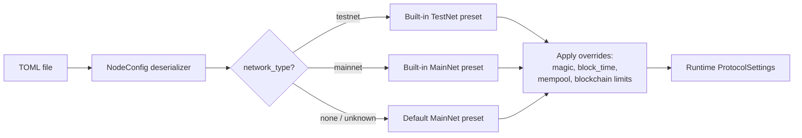

# Configuration Reference

The `neo-node` daemon is configured by a single TOML file passed with
`--config` (default: `neo_testnet_node.toml`). This page documents every
section and key the daemon reads.

The shipped presets live under `config/`: `testnet.toml`, `mainnet.toml`,
`mainnet-stateroot.toml`, plus `testnet-service.toml` and
`mainnet-service.toml` for NeoFura-style RPC/indexer service providers.

## How config is parsed



Two important behaviors:

- **Forward compatibility.** Every section and key is optional. Most unknown
  sections/keys are ignored, while safety-critical opt-in sections such as
  `[execution.specialization_shadow]` reject unknown keys instead of silently
  accepting a misspelled control.
- **Presets plus overrides.** `[network] network_type` selects a built-in
  protocol preset (committee, seeds, hardfork schedule). Individual keys in
  `[network]`, `[blockchain]`, and `[mempool]` then override fields of that
  preset.

## Sections the daemon consumes

These sections drive node behavior: `[network]`, `[storage]`, `[p2p]`, `[rpc]`,
`[consensus]` (alias `[dbft]`), `[blockchain]`, `[mempool]`,
`[execution.specialization_shadow]`,
`[state_service]`, `[indexer]`, `[application_logs]`, and
`[tokens_tracker]`, `[telemetry.metrics]`, `[logging]`, and
`[observability]`.

### `[network]`

Selects which Neo network the node joins.

| Key | Type | Default | Meaning |
|-----|------|---------|---------|
| `network_type` | string | none | `"testnet"` or `"mainnet"` (case-insensitive). Selects the built-in protocol preset. An unknown value falls back to the MainNet preset with a warning. |
| `network_magic` | u32 | from preset | Explicit network magic override. Wins over the preset. Accepts hex (e.g. `0x334F454E`). The `--network-magic` CLI flag overrides this. |

### `[storage]`

Persistence backend.

| Key | Type | Default | Meaning |
|-----|------|---------|---------|
| `backend` | string | `"memory"` unless a persistent path is supplied | `"mdbx"` for the production persistent store or `"memory"` for ephemeral and remote-ledger nodes (state lost on restart). Any other value is rejected. |
| `data_dir` | path | none | MDBX environment directory. Required for persistent storage unless `--storage-path` is passed. |
| `read_only` | bool | `false` | Open the primary store read-only when the selected backend supports it. Alias: `ReadOnly`. Use only for offline inspection/query modes; a normal syncing node must write genesis, blocks, headers, indexes, and service state. |
| `mdbx_geometry_upper_gb` | integer | backend default | MDBX map upper bound in GiB. Shipped MainNet/TestNet configs pin this so the mmap geometry is explicit. |
| `mdbx_geometry_growth_mb` | integer | backend default | MDBX map growth step in MiB. |
| `mdbx_max_readers` | integer | backend default | MDBX reader slot limit for concurrent RPC/service reads. |
| `static_files_dir` | path | none (disabled) | Enables the finalized Ledger static archive, storing authoritative frames in `ledger.static` plus height-addressed `ledger.static.segment-<first-height>` files and one derived offset index in `ledger.static.index/` (MDBX). The configured provider becomes the shared historical fallback for blockchain, consensus, P2P, admission, wallet, and RPC reads. Archived hot Ledger rows older than the initial protocol `MaxTraceableBlocks` window are pruned automatically. Requires a writable persistent canonical backend. |
| `static_files_compression_level` | integer | `3` | Zstandard level applied independently to each finalized-height frame. |
| `static_files_cache_capacity` | integer | `64` | Number of decompressed height frames retained by the LRU cache; must be greater than zero. |
| `static_files_max_segment_mb` | integer | `4096` | Target maximum size of one height-addressed archive segment in MiB; must be greater than zero. Frames are never split, so one oversized frame may exceed the target. |
| `static_files_recovery_batch_blocks` | integer | `1024` | Maximum hot Ledger blocks appended per startup reconciliation sync; must be greater than zero. |

#### `[storage.append_shadow]` — append-frame shadow dual-write (opt-in)

Phase 1 verification mode for the `neo-state-packs` append engine. MDBX
remains authoritative for every StateService row. When enabled, each
coordinated commit also mirrors the window's MPT node entries
(`0xf0 || node_hash`) into a pack store at `path` (one frame plus one
immutable index run per co-commit window) and persists a pack high-water
record (`neo_state_packs_high_water`) into the MDBX maintenance table inside
the same transaction (cold-first: the frame is synced before the marker can
commit). Shadow failures are logged and counted
(`MdbxCommitMetrics::shadow_commit_failures`) and never fail the canonical
commit; the transaction simply commits without the marker. Requires the
durable MDBX backend, `[state_service].enabled=true` with coordinated
commits, and a writable node (`read_only=false`).

| Key | Type | Default | Meaning |
|-----|------|---------|---------|
| `enabled` | bool | `false` | Enable the shadow dual-write. Alias: `Enabled`. |
| `path` | path | none (required when enabled) | Shadow pack-store directory. `{0}` is replaced with uppercase 8-digit network magic. Alias: `Path`. |
| `max_index_memory_mb` | integer | `256` | Decoded index-memory bound in MiB for the shadow store; must be greater than zero. Alias: `MaxIndexMemoryMb`. |

#### `[storage.state_packs]` — authoritative MPT node packs (opt-in)

Moves only exact StateService MPT node rows (`0xf0 || node_hash`) to the
append-frame store. Ledger rows, StateService root records/current-height
metadata, and the mandatory pack marker stay in MDBX. A commit is published in
strict order: sync and seal the pack generation, atomically commit Ledger plus
StateService metadata plus marker in MDBX, then swap the already-created pinned
pack snapshot. A pack miss or error never falls back to stale MDBX node rows.
Immutable index compaction is derived maintenance: one coalescing worker builds
and syncs merge output without holding the pack writer, then briefly validates
its leased source runs and publishes an equivalent manifest/snapshot. It does
not alter the MDBX marker or StateService generation. Run debt is bounded per
level; producers wait only after a level reaches its hard debt threshold.

Startup requires `checkpoint.json` with `complete=true` and
`authoritative_ready=true`, the configured network and current pack formats,
an exact StateService height/root match, the expected namespace identity and
tip receipt, and a resolvable current root node. Existing shadow packs are not
complete checkpoints and are rejected. This mode requires writable MDBX,
coordinated `full_state` StateService tracking during catch-up and is mutually
exclusive with `[storage.append_shadow]`. The default
`defer_full_state_finalization=false` keeps eager finalization. When explicitly
enabled, deferred journals are resolved in bounded sorted batches against the
exact pinned pack generation used to prepare the batch; they are never resolved
through or allowed to fall back to stale MDBX node rows.

| Key | Type | Default | Meaning |
|-----|------|---------|---------|
| `enabled` | bool | `false` | Enable fail-closed authoritative pack mode. Alias: `Enabled`. |
| `path` | path | none (required when enabled) | Complete checkpoint directory. `{0}` is replaced with uppercase 8-digit network magic. Alias: `Path`. |
| `max_index_memory_mb` | integer | `512` | Decoded immutable-index memory bound in MiB; must be greater than zero. Alias: `MaxIndexMemoryMb`. |
| `random_point_mmap` | bool | `false` | Experimental host-specific optimization: index-located payload reads and sparse index-window probes use separate mappings with `MADV_RANDOM`; compaction, validation, and scrub retain ordinary mappings. Explicit enablement fails startup if the OS rejects the advice. Alias: `RandomPointMmap`. |
| `batch_value_workers` | integer | `1` | Workers for large sorted immutable payload reads; accepted range `1..=8`, with the effective count capped by visible logical CPUs. Parallel copying starts at `effective_workers * 256` located values, uses a process-wide pool capped at eight threads, preserves duplicate/result order, and remains opt-in because storage devices differ. Alias: `BatchValueWorkers`. |

`neo-pack-build --network-magic <u32-or-hex> --mdbx <store> --pack <new-dir>`
is offline migration tooling, not a node mode. It streams a frozen StateService
node namespace into bounded frames and publishes `checkpoint.json` only after
stable height/root and pack reopen checks. The marker binds network magic,
format versions, source digest/root, and the exact tip-frame checksum.
Before the first frame, the builder also durably publishes
`checkpoint-build.json`, binding the network magic, source height/root,
`--rows-per-frame`, and all three pack format versions used by an interrupted
build.
`--max-rows` always produces `"complete": false` and
`"authoritative_ready": false` smoke evidence; such output cannot authorize
pack-backed reads. An uncapped build publishes `"authoritative_ready": true`
only after its complete source scan, stable height/root check, full payload
scrub, tip checksum validation, and reopen all pass. Keep the syncing node stopped during an uncapped
checkpoint build so the before/after height/root guard represents one canonical
source generation. If a build stops after complete frames but before marker
publication, rerun it with the same network magic, source generation, and
`--rows-per-frame`: the builder validates the durable build identity, proves
that every prior frame has the declared row geometry, then compares every
stored prefix value with the frozen source before appending. A missing legacy
identity or any mismatch aborts instead of silently adopting a partial pack.
Before publishing a complete marker, the builder also sequentially re-hashes
and decodes every committed frame payload. The report records scrubbed frames,
rows, puts, tombstones, payload/value bytes, and scrub wall time.

One compatibility operation is explicit and disabled by default:

```text
neo-pack-build --network-magic <u32-or-hex> --mdbx <frozen-store> \
  --pack <legacy-complete-pack> --rows-per-frame <original-size> \
  --adopt-legacy-complete-pack
```

This flag accepts only an uncapped, complete schema-v1 checkpoint produced by
the earlier offline builder; it never adopts a partial pack. The builder
requires the legacy height, displayed/internal root, row count, value bytes,
frame count, frame geometry, pack length, and namespace digest to match the
frozen MDBX source and reopened pack. It then compares every namespace value,
recomputes the namespace digest, reads and hashes the physical tip payload, and
checks any optional legacy tip fields. Only after all checks pass does it write
`checkpoint-build.json` and atomically replace the old marker with schema v2,
including current pack format versions and the verified tip identity. Any
network magic in the legacy report is ignored; the required CLI value is the
only magic written into the new identity and marker. Run adoption only after
the legacy builder has exited and its complete marker is durable.

A legacy build that stopped before publishing any marker requires a different,
also disabled-by-default recovery mode:

```text
neo-pack-build --network-magic <u32-or-hex> --mdbx <frozen-store> \
  --pack <legacy-partial-pack> --rows-per-frame <original-size> \
  --max-index-memory-mb <explicit-bound> --adopt-legacy-partial-pack
```

Partial adoption requires both `checkpoint.json` and `checkpoint-build.json`
to be absent, every visible frame to contain exactly the original row count,
and an uncapped source scan. It compares the complete existing prefix with the
frozen MDBX source, atomically republishes the unchanged run set in the current
manifest format, then publishes the new build identity; no later frame may be
appended before that durable identity exists. If adoption is interrupted
after identity publication, rerun without the adoption flag. A short final
frame, source drift, value mismatch, existing marker, or ambiguous identity
fails closed.

The ordered MPT finalizer keeps batch reads serial by default. For a controlled
catch-up profile, `NEO_MDBX_WRITE_INTENT_READ_THREADS` enables bounded parallel
readers only for the sparse lookup set immediately before an MPT write. It is
clamped to 16 and falls back to `NEO_MDBX_BATCH_READ_THREADS` when unset; both
environment variables default to one reader. Benchmark this setting on the
actual storage host before enabling it permanently.

`NEO_MDBX_SYNC_MODE` defaults to `durable`. A bounded replay or bootstrap job
may set `no_meta_sync` or `safe_no_sync` to reduce commit latency; both modes
preserve MDBX atomicity and database integrity but can lose the newest commits
after a crash, so restart from the last steady checkpoint. `utterly_no_sync` is
rejected and falls back to `durable`.

`NEO_MDBX_CURSOR_WRITE_MODE` defaults to `search`, which performs one MDBX
cursor lookup per overlay entry. A controlled catch-up A/B may set it to
`merge_cursor` (or `merge`) to walk sorted overlays once and update exact rows
with `CURRENT`; keep it opt-in until the target filesystem has matching
state-root and restart evidence.

The Cargo feature `neo-storage/mdbx-write-map` is an experimental backend
variant for hardware-specific A/B testing. The shipped node uses `NoWriteMap`;
enable the feature only after validating restart durability and state-root
parity on the target filesystem.

Notes:

- The CLI `--storage-path <DIR>` overrides the directory and selects the MDBX
  persistent backend even when the TOML omits `[storage].backend`.
- MDBX with no directory and no `--storage-path` is an error.
- Static files are a **precommit-durable cold archive**. The node captures the exact
  Ledger rows, writes and syncs provider-invisible frames before the canonical
  MDBX transaction, and publishes their sidecar index only after hot
  success. Startup verifies the still-hot overlapping block-hash suffix,
  recovers and truncates a cold-ahead suffix left by a failed hot commit,
  repairs archive lag only where hot rows still exist, and serves clean hot
  misses through the same provider traits. After publication, rows older than
  the initial protocol `MaxTraceableBlocks` retention window are pruned from
  the hot store. An MDBX named table stores the node-local watermark outside
  Neo contract storage; row deletes and watermark
  advancement are one durable backend transaction. `Prefix_CurrentBlock (12)`
  always remains hot.
- Opening `ledger.static` takes an exclusive OS lock on the base archive file
  and thereby owns recovery and mutation of every height-addressed segment. A
  second node using the same base file, including through a symlink or hard
  link, fails startup; the kernel releases the lease automatically when the
  owning process exits, so no stale lockfile cleanup is required.
- Static-file publication is ordered `segment append -> sync_data -> hot
  canonical transaction -> global MDBX index transaction`. Until the final index
  transaction, staged frames are invisible to providers. The index stores frame
  boundaries plus every row-location version and the active segment, so latest
  lookup and rollback after truncation do not rebuild a process-local map. A
  clean open validates segment boundaries, archive identity, and the published
  tail, then scans and republishes only files/bytes beyond the index checkpoint.
  Missing, stale, or archive-ahead indexes rebuild from all authoritative
  segments before canonical reconciliation.
- Reads decompress and checksum the complete containing frame before returning
  a value. Published corruption is reported and is never guessed to be a torn
  write; only an incomplete or corrupt **unpublished suffix in the final
  segment** may be truncated during recovery. `StaticFileArchive::scrub` performs an explicit
  full frame/index parity check. `neo-db-probe --static-files-dir <DIR>
  --scrub-static-files` exposes that maintenance operation without opening a
  hot database and fails if `<DIR>/ledger.static` does not already exist.
- Static archive format v2 binds the sidecar to a non-zero archive identity.
  Format v1 development archives are intentionally not migrated: remove both
  old mirror artifacts and let startup reconcile them from the authoritative
  hot store.
- Archive-enabled P2P sync uses at most 64 blocks per deferred canonical batch.
  Larger batches from other import sources fall back to per-block durability,
  bounding pending Ledger-row memory instead of accumulating an entire large
  replay batch.
- The first startup after enabling static files may spend additional time
  verifying hot/cold row bytes and pruning an existing historical prefix in
  bounded 1024-frame transactions. Startup fails rather than advancing the
  watermark if a row differs, if the watermark exceeds the canonical tip, or
  if the archive does not cover an already-pruned height.
- Once `hot-pruned-through` exists, the static archive is not a disposable
  mirror. Back up and restore the canonical database, `ledger.static`, every
  `ledger.static.segment-*` file, and `ledger.static.index/` together. The
  sidecar can be rebuilt from the segments, but missing or corrupt authoritative
  frame bytes require a matching backup or a clean resync.
- A precommit archive frame write or sync failure rejects the canonical commit
  before hot state is published and stops the writer. If the archive fence
  completed but the hot commit did not, startup validates and truncates the
  cold-ahead suffix before exposing local reads. If hot commit succeeds but the
  sidecar index publication fails, the node requests a recoverable restart and
  startup republishes the durable suffix.

### `[p2p]`

Peer-to-peer networking.

| Key | Type | Default | Meaning |
|-----|------|---------|---------|
| `port` | u16 | TestNet `20333`, MainNet `10333` (by network) | TCP port for inbound peers. Aliases: `listen_port`, `Port`. |
| `bind_address` | string | `0.0.0.0` | IP address the P2P listener binds to. |
| `seed_nodes` | array of string | preset seed list | `host:port` endpoints dialed on startup. Empty falls back to the preset's seeds. |
| `enable_compression` | bool | `true` | Advertise/enable P2P message compression. Alias: `EnableCompression`. |
| `min_desired_connections` | usize | `10` | Minimum desired outbound peer count. Alias: `MinDesiredConnections`. |
| `max_connections` | i64 | `40` | Maximum simultaneous peers. `-1` means unlimited. Alias: `MaxConnections`. |
| `max_connections_per_address` | usize | `3` | Maximum peers accepted from one remote IP. Alias: `MaxConnectionsPerAddress`. |
| `max_known_hashes` | usize | `1000` | Known inventory hashes retained for duplicate suppression. Alias: `MaxKnownHashes`. |
| `broadcast_history_limit` | usize | channel default | Recent broadcasts retained for diagnostics. |

Defaults shown for connection limits are the `ChannelsConfig` defaults applied
when the key is omitted.

### `[rpc]`

JSON-RPC server. The daemon maps the node TOML keys below directly into the
embedded `RpcServerConfig`, so shipped hardening knobs such as authentication,
disabled methods, invoke gas limits, and batch limits are applied at startup.

| Key | Type | Default | Meaning |
|-----|------|---------|---------|
| `enabled` | bool | `false` | Start the JSON-RPC server. |
| `port` | u16 | `10332` | RPC listen port. |
| `bind_address` | string | `127.0.0.1` | IP address the RPC server binds to. |
| `auth_enabled` | bool | auto | Enable Basic authentication. If omitted, non-empty `rpc_user`/`rpc_pass` enable auth. Alias: `AuthEnabled`. |
| `rpc_user` | string | empty | Basic-auth username. Alias: `RpcUser`. |
| `rpc_pass` | string | empty | Basic-auth password. Alias: `RpcPass`. |
| `cors_enabled` | bool | RPC default | Enable CORS headers. Alias: `EnableCors`. |
| `allow_origins` | array of string | empty | Allowed CORS origins. Alias: `AllowOrigins`. |
| `max_gas_invoke` | i64 | RPC default | Maximum GAS, in datoshi, allowed for one invoke call. Alias: `MaxGasInvoke`. |
| `max_iterator_results` / `max_iterator_result_items` | usize | RPC default | Maximum iterator items returned in one response. Alias: `MaxIteratorResultItems`. |
| `max_stack_size` | usize | RPC default | Maximum VM stack items in invoke responses. Alias: `MaxStackSize`. |
| `disabled_methods` | array of string | empty | RPC methods disabled for this endpoint. Alias: `DisabledMethods`. |
| `max_concurrent_connections` | usize | RPC default | Maximum concurrent RPC connections. Alias: `MaxConcurrentConnections`. |
| `max_request_body_size` | usize | RPC default | Maximum JSON-RPC request body size in bytes. Alias: `MaxRequestBodySize`. |
| `max_requests_per_second` | u32 | RPC default | Enforced by the in-process per-method limiter as a process-wide fallback; use an edge proxy for true per-client/IP limits on public deployments. Alias: `MaxRequestsPerSecond`. |
| `rate_limit_burst` | u32 | RPC default | Burst capacity for the in-process RPC rate limiter. Alias: `RateLimitBurst`. |
| `max_batch_size` | usize | RPC default | Maximum JSON-RPC calls accepted in one batch. Alias: `MaxBatchSize`. |
| `session_enabled` | bool | RPC default | Enable iterator sessions. Alias: `SessionEnabled`. |
| `session_expiration_time` | u64 | RPC default | Session expiration time in seconds. Alias: `SessionExpirationTime`. |
| `find_storage_page_size` | usize | RPC default | Page size used by `findstorage`. Alias: `FindStoragePageSize`. |
| `keep_alive_timeout` | i32 | RPC default | Idle keep-alive timeout in seconds; negative disables idle reaping. Alias: `KeepAliveTimeout`. |
| `request_headers_timeout` | u64 | RPC default | Request header timeout in seconds. Alias: `RequestHeadersTimeout`. |

When Basic authentication is enabled, every HTTP RPC request must include a
valid `Authorization: Basic ...` header. Wallet-mutating protected methods are
only exposed by the transport when a complete `rpc_user`/`rpc_pass` pair is
configured, and incomplete credentials are rejected during startup validation.
When CORS is enabled, an empty `allow_origins` list allows any browser origin;
otherwise the transport echoes only origins present in `allow_origins` and
answers CORS preflight `OPTIONS` requests before RPC authentication.

### `[consensus]` (alias `[dbft]`)

dBFT consensus participation. The section name `[dbft]` is accepted as an alias.

| Key | Type | Default | Meaning |
|-----|------|---------|---------|
| `enabled` | bool | `false` | Participate in dBFT. When `true`, the node decodes inbound dBFT extensible payloads and drives the round lifecycle if its key is a validator. |
| `auto_start` | bool | `false` | C# DBFT-style startup flag. When either `enabled` or `auto_start` is true, the daemon attempts to start consensus using `private_key_hex` or `[consensus.hsm]`. |
| `private_key_hex` | string | none | 32-byte secp256r1 private key (hex). Required when consensus startup is requested and no HSM config is present. The node only produces blocks if the derived public key is in the validator set; otherwise it relays consensus messages only. |

> Keep `private_key_hex` out of shared configs and version control. It is a
> validator signing key.

#### `[consensus.hsm]` — HSM-backed signing (optional)

Instead of a software `private_key_hex`, a validator can sign consensus
messages with a hardware security module over PKCS#11. The node never sees the
private key — it sends each pre-hashed message to the HSM and gets back the
signature. Requires building the node with the `hsm` feature
(`cargo build --release -p neo-node --features hsm`). When `[consensus.hsm]` is
present it takes precedence over `private_key_hex`.

| Key | Type | Default | Meaning |
|-----|------|---------|---------|
| `provider` | string | — | `aws`, `azure-cloud-hsm`, `azure-dedicated-hsm`, `gcp-cloud-hsm`, `yubihsm2`, `nshield`, `softhsm2`, `utimaco`, or `generic`. Selects the default PKCS#11 library and signature format; use `generic` + `library_path` for any other PKCS#11 HSM. |
| `library_path` | string | provider default | Path to the PKCS#11 `.so` to load. |
| `slot` | int | first with token | PKCS#11 slot number. |
| `token_label` | string | none | Token label to match when `slot` is omitted. |
| `key_label` | string | — | `CKA_LABEL` of the consensus private key (required). |
| `key_id_hex` | string | none | Optional `CKA_ID` (hex) to disambiguate keys sharing a label. |
| `pin_env` | string | `NEO_HSM_CU_PASSWORD` | Environment variable holding the `C_Login` PIN. |

The PIN is **never** stored in the TOML — it is read at startup from the
`pin_env` environment variable (for AWS/Azure Cloud HSM the value is
`"<CU_user>:<password>"`; for GCP it is empty and credentials come from ADC).
The node fails fast at startup if the HSM cannot be reached.

```toml
[consensus]
enabled = true

[consensus.hsm]
provider = "aws"
key_label = "neo-consensus-validator-1"
# pin_env defaults to NEO_HSM_CU_PASSWORD; export it before starting the node:
#   export NEO_HSM_CU_PASSWORD="crypto_user:hunter2"
```

### `[blockchain]`

Protocol limits that override the selected preset.

| Key | Type | Default | Meaning |
|-----|------|---------|---------|
| `block_time` | u32 | preset (`15000`) | Target block interval in milliseconds (`MillisecondsPerBlock`). Aliases: `milliseconds_per_block`, `MillisecondsPerBlock`. |
| `max_transactions_per_block` | u32 | preset (MainNet `200`, TestNet `5000`) | Maximum transactions per block. Alias: `MaxTransactionsPerBlock`. |
| `max_valid_until_block_increment` | u32 | preset (`5760`) | Maximum `ValidUntilBlock` increment for transactions. Aliases: `max_valid_until_block_increment`, `MaxValidUntilBlockIncrement`. |
| `max_traceable_blocks` | u32 | preset | Maximum traceable blocks exposed to contracts. Alias: `MaxTraceableBlocks`. |

### `[mempool]`

Transaction pool sizing.

| Key | Type | Default | Meaning |
|-----|------|---------|---------|
| `max_transactions` | i32 | preset (`50000`) | Maximum transactions retained in the memory pool (`MemoryPoolMaxTransactions`). Aliases: `memory_pool_max_transactions`, `MemoryPoolMaxTransactions`. |

### `[execution.specialization_shadow]`

Ordinary-authoritative differential execution for exact audited
specializations. This section is disabled by default. When it is absent or
`enabled = false`, the node constructs no specialization control and every
transaction follows the ordinary sequential `neo-vm` persistence path.

| Key | Type | Default | Meaning |
|-----|------|---------|---------|
| `enabled` | bool | `false` | Construct the bounded process control and evaluate explicitly listed candidates in isolated Shadow mode. Requires local ledger execution. |
| `strict_replay` | bool | `false` | Reject block publication when Shadow infrastructure cannot prove equality or when artifacts differ. Use `true` for bounded promotion replays; a mismatch still latches the candidate off when this is false. |
| `candidates` | array of string | empty | Exact candidate versions to observe. The only accepted value is currently `"flamingo_factory_pair_key_v1"`; no candidate is selected implicitly. |
| `max_reproducers` | usize | `64` | Maximum retained first-mismatch reproducers. Values above 64 are rejected. |
| `max_reproducer_bytes` | usize | `1048576` | Maximum aggregate retained reproducer payload-prefix bytes. Larger values are rejected. |
| `max_artifact_bytes` | usize | `16777216` | Maximum dynamic payload bytes retained by one comparison artifact. Larger values are rejected; all artifact counts and graph traversal dimensions retain their own fixed hard bounds. |

```toml
[execution.specialization_shadow]
enabled = true
strict_replay = true
candidates = ["flamingo_factory_pair_key_v1"]
max_reproducers = 16
max_reproducer_bytes = 262144
max_artifact_bytes = 8388608
```

The node configuration intentionally has no authoritative specialization mode.
Shadow branches run from isolated overlays, complete artifacts are compared,
and only the ordinary sequential branch can commit. A first mismatch retains a
bounded reproducer and latches that exact candidate off for the rest of the
process. The shared process control also retains global and candidate kill
switches across block batches. Operational rollback is immediate on restart:
set `enabled = false` or remove the section; no persisted-state migration or
cache cleanup is required.

### `[state_service]`

State-root/MPT support used by Neo's StateService RPC methods.

| Key | Type | Default | Meaning |
|-----|------|---------|---------|
| `enabled` | bool | `false` | Legacy StateRoot intent. StateRoot still requires `--enable-stateroot` or `--stateroot true`; `enabled = true` without an explicit CLI choice fails startup. Alias: `Enabled`. |
| `full_state` | bool | `false` | Retain historical trie nodes for old-root proofs/state reads. Alias: `FullState`. |
| `defer_full_state_finalization` | bool | `false` | Opt-in performance mode that batches full-state finalization lookups while preserving every serialized mutation and reference count. The eager path remains the default. Alias: `DeferFullStateFinalization`. |
| `track_during_catchup` | bool | `false` | Keep computing local MPT state roots even while the node is far behind the peer tip. Explicit CLI enablement forces this to `true` so the local root history stays contiguous. Alias: `TrackDuringCatchup`. |
| `path` | path | none | Optional auxiliary MDBX directory when the canonical node itself is using the in-memory provider. Persistent MDBX nodes use the canonical environment's `neo_state_service` named table and ignore this path. `{0}` is replaced with uppercase 8-digit network magic. Alias: `Path`. |

StateRoot is disabled by default. Enable it for a run with
`--enable-stateroot` (or `--stateroot true`); use `--stateroot false` to
explicitly disable a legacy config that still declares `enabled = true`.
The service is updated during block persistence through the daemon's commit
handlers, so it follows the same canonical-chain lifecycle as the ledger. When
enabled, cold catch-up always tracks per-block MPT work so `getstateheight` and
`getstateroot` advance from genesis instead of only near the live tip.
StateService data must be contiguous with the chain store: if the chain has
already advanced without matching MPT roots, restore a checkpoint that includes
the matching coordinated MPT namespace or replay from genesis with
`track_during_catchup = true`.

### `[indexer]`

Read-side block, transaction, signer-account, and notification index used by
the built-in `NeoIndexer` RPC method group.

| Key | Type | Default | Meaning |
|-----|------|---------|---------|
| `enabled` | bool | `false` | Start the indexer service and expose indexer RPC methods. Alias: `Enabled`. |
| `store_path` | path | none | Optional service-store directory for prefix-keyed index records using the configured storage provider. `{0}` is replaced with uppercase 8-digit network magic. Aliases: `StorePath`, `DBPath`, `DbPath`. |

Live block imports include smart-contract notifications because the daemon has
the current `ApplicationExecuted` list during persistence. Enabled indexers now
always resume their durable canonical Index stage automatically on activation:
if a persisted tip is contiguous with the canonical chain, indexing continues
from the next block; an ahead tip is pruned, while a stale, divergent, or
incomplete projection is durably cleared before rebuilding from genesis in
bounded atomic batches. For blocks the stage processes during that catch-up or
rebuild, notification recovery requires matching records in the enabled
ApplicationLogs service; an already verified prefix is not revisited solely to
enrich notifications.

This is the built-in service-oriented indexer for NeoFura-style RPC workloads:
it gives operators block, transaction, signer-account, contract-notification,
and transfer-participant notification queries through JSON-RPC. Use
`store_path` for the configured service-store provider (MDBX in shipped
profiles). It stores blocks, transactions, account transaction links, and
notification lookup rows under stable `neo-indexer:v3:*` prefixes and commits
only the block-scoped rows changed by each indexing batch.
Removed `path` and `backfill_on_startup` options are rejected instead of
silently falling back to an in-memory or partial-history indexer.
Stores containing the removed `neo-indexer:snapshot:v2` whole-snapshot format
are also rejected explicitly; remove that derived index store and let the
canonical Index stage rebuild it.

`getindexerstatus` reports the indexed tip, current ledger height, block lag,
sync state, persistence mode, and whether ApplicationLogs is available when a
future catch-up or rebuild processes historical blocks.

### `[application_logs]`

C# `Neo.Plugins.ApplicationLogs`-compatible execution log storage.

| Key | Type | Default | Meaning |
|-----|------|---------|---------|
| `enabled` | bool | `false` | Capture per-block and per-transaction application logs for `getapplicationlog`. Alias: `Enabled`. |
| `path` | path | `ApplicationLogs_{0}` | Plugin store directory. `{0}` is replaced with uppercase 8-digit network magic. Alias: `Path`. |
| `max_stack_size` | usize | plugin default | Maximum serialized stack item size. Alias: `MaxStackSize`. |
| `debug` | bool | `false` | Include `ApplicationEngine.Log` messages. Alias: `Debug`. |
| `exception_policy` | enum | plugin default | Handler exception policy. Alias: `UnhandledExceptionPolicy`. |

### `[tokens_tracker]`

NEP-11/NEP-17 balance and transfer indexing used by the TokensTracker RPC
method group.

| Key | Type | Default | Meaning |
|-----|------|---------|---------|
| `enabled` | bool | `false` | Track NEP-11/NEP-17 balances and transfers. Alias: `Enabled`. |
| `db_path` | path | `TokenBalanceData` | Plugin store directory. `{0}` is replaced with uppercase 8-digit network magic when present. Aliases: `DBPath`, `Path`. |
| `track_history` | bool | plugin default | Retain historical transfer records. Alias: `TrackHistory`. |
| `max_results` | u32 | plugin default | Maximum RPC result count. Alias: `MaxResults`. |
| `network` | u32 | node network | Optional network override. Alias: `Network`. |
| `enabled_trackers` | array of string | `["NEP-17", "NEP-11"]` | Standards to track. Alias: `EnabledTrackers`. |
| `exception_policy` | enum | plugin default | Handler exception policy. Alias: `UnhandledExceptionPolicy`. |

### `[telemetry.metrics]`

Prometheus-compatible text metrics endpoint. Disabled by default.

| Key | Type | Default | Meaning |
|-----|------|---------|---------|
| `enabled` | bool | `false` | Start the HTTP metrics endpoint. Alias: `Enabled`. |
| `port` | u16 | `9090` | Metrics listen port. Alias: `Port`. |
| `bind_address` | string | `127.0.0.1` | Metrics bind address. Alias: `BindAddress`. |
| `path` | string | `/metrics` | HTTP path that serves Prometheus text. Must start with `/` and cannot be `/healthz` or `/readyz`. Alias: `Path`. |

Example:

```toml
[telemetry.metrics]
enabled = true
port = 9090
bind_address = "127.0.0.1"
path = "/metrics"
```

The telemetry HTTP server also serves `/healthz` for process liveness and
`/readyz` for local ledger readiness. The exporter serves node
liveness/build labels, uptime, ledger height, peer count, mempool counts,
header-cache count, optional service registration gauges, NeoIndexer health and
index counts, NeoIndexer lag/sync gauges, and any metrics already registered with the process-wide
Prometheus registry such as RPC request/error counters.

### `[logging]`

Tracing subscriber configuration. The `RUST_LOG` environment variable overrides
`[logging].level` when it is set, so operators can temporarily raise verbosity
without editing TOML.

| Key | Type | Default | Meaning |
|-----|------|---------|---------|
| `enabled` | bool | `true` | Enable TOML-driven logging. If false and `RUST_LOG` is unset, the filter is `off`. Aliases: `Enabled`, `active`. |
| `level` | string | `info,neo=debug` | Tracing filter directive, e.g. `info`, `debug`, or `info,neo=debug`. Alias: `Level`. |
| `format` | string | `pretty` | `pretty`, `compact`, or `json`. Alias: `Format`. |
| `console_output` | bool | `true` | Emit logs to stdout/stderr. Alias: `ConsoleOutput`. |
| `file_path` | path | none | Optional log file path. Parent directories are created automatically. Alias: `FilePath`. |
| `max_file_size` | string | none | Rotate the configured log file once it reaches this size. Supports bytes plus `KB`, `MB`, or `GB` suffixes. Requires `file_path`. Alias: `MaxFileSize`. |
| `max_files` | usize | `5` when rotation is enabled | Number of rotated archives to retain. Must be greater than zero when set. Alias: `MaxFiles`. |

Example:

```toml
[logging]
level = "info,neo=debug"
format = "json"
console_output = true
file_path = "./logs/neo-node-mainnet.log"
max_file_size = "100MB"
max_files = 10
```

### `[observability]`

Optional outbound observability hooks for production operators. When disabled
(the default), the daemon sends no external requests. When enabled, the daemon
can report startup failures and Rust panics to one or more error endpoints, and
can ping heartbeat URLs such as Better Stack uptime heartbeats.
If `capture_panics = true`, at least one enabled error endpoint is required;
set `capture_panics = false` for heartbeat-only deployments.

| Key | Type | Default | Meaning |
|-----|------|---------|---------|
| `enabled` | bool | `false` | Install observability hooks and spawn heartbeat tasks. Alias: `Enabled`. |
| `service_name` | string | `neo-node` | Service name sent in payloads. Alias: `ServiceName`. |
| `environment` | string | none | Deployment label such as `production`, `testnet`, or `local`. Alias: `Environment`. |
| `node_id` | string | none | Operator-defined node identifier. Alias: `NodeId`. |
| `capture_panics` | bool | `true` | Report Rust panics to configured error endpoints. Alias: `CapturePanics`. |
| `request_timeout_ms` | u64 | `5000` | HTTP timeout for outbound observability requests. Alias: `RequestTimeoutMs`. |
| `heartbeat_interval_seconds` | u64 | `60` | Default heartbeat interval. Alias: `HeartbeatIntervalSeconds`. |

Error endpoints are configured as `[[observability.error_endpoints]]`.

| Key | Type | Default | Meaning |
|-----|------|---------|---------|
| `enabled` | bool | `true` | Toggle this destination. Alias: `Enabled`. |
| `kind` | string | `custom_json` | `custom_json`, `better_stack_logs`, `google_error_reporting`, or `sentry`. Alias: `Kind`. |
| `name` | string | kind | Name used in local warning logs. Alias: `Name`. |
| `url` | string | none | HTTPS endpoint URL. Required except for Google when `project_id` is set. Alias: `Url`. |
| `token` | string | none | Inline bearer token. Prefer `token_env` for production. Alias: `Token`. |
| `token_env` | string | none | Environment variable containing a bearer token. Alias: `TokenEnv`. |
| `project_id` | string | none | Google Cloud project id for `google_error_reporting`. When `project_id` is used without an explicit `url`, configure `token` or `token_env` for the Google API bearer token. Alias: `ProjectId`. |
| `headers` | table | `{}` | Extra valid HTTP headers. Do not set `Authorization` when `token` or `token_env` is configured. Alias: `Headers`. |
| `headers_env` | table | `{}` | Header name to environment-variable name map for provider-specific header secrets such as Sentry `X-Sentry-Auth`. Do not duplicate names from `headers`. Alias: `HeadersEnv`. |

Heartbeat endpoints are configured as `[[observability.heartbeat_endpoints]]`.

| Key | Type | Default | Meaning |
|-----|------|---------|---------|
| `enabled` | bool | `true` | Toggle this heartbeat. Alias: `Enabled`. |
| `name` | string | URL | Name used in local warning logs. Alias: `Name`. |
| `url` | string | none | HTTP(S) heartbeat URL. Alias: `Url`. |
| `method` | string | `GET` | `GET`, `POST`, or `PUT`. Alias: `Method`. |
| `interval_seconds` | u64 | global default | Per-heartbeat interval. Alias: `IntervalSeconds`. |
| `token` | string | none | Inline bearer token for custom heartbeat APIs. Alias: `Token`. |
| `token_env` | string | none | Environment variable containing a bearer token. Alias: `TokenEnv`. |
| `headers` | table | `{}` | Extra valid HTTP headers. Do not set `Authorization` when `token` or `token_env` is configured. Alias: `Headers`. |
| `headers_env` | table | `{}` | Header name to environment-variable name map for custom heartbeat headers. Do not duplicate names from `headers`. Alias: `HeadersEnv`. |

`GET` heartbeats send a provider-compatible ping with no body. `POST` and
`PUT` heartbeats send JSON containing service metadata plus a `node` health
summary with ledger height, peer count, mempool counts, optional service
registration, and NeoIndexer readiness/lag/sync.
When a heartbeat request fails, the daemon logs the failure and sends a
`heartbeat_failure` event to every enabled error endpoint, so operators can
route heartbeat outages through the same Google, Better Stack Logs, or custom
JSON incident pipeline as startup errors and panics.

For `google_error_reporting`, the daemon sends Google-compatible
`ReportedErrorEvent` payloads with `eventTime`, `serviceContext`, and
`context.reportLocation`. Panics use the Rust panic source location when
available; startup errors without a source location use a `neo-node` fallback
location so Google can group the event. When `node_id` is set, it is sent as
`context.user` to make node-specific incidents easier to filter. If you set
`project_id` instead of a full `url`, startup validation requires `token` or
`token_env`; custom URLs may carry credentials in the URL or be handled by an
operator-controlled proxy.

For `better_stack_logs`, the daemon sends a single JSON log event with
top-level `message`, `dt`, `level`, `event_type`, service, network, version,
environment, node id, and optional source location fields. `token` or
`token_env` is sent as the Better Stack source bearer token, while `url`
remains operator-configurable for custom or regional ingestion hosts.

Example:

```toml
[observability]
enabled = true
service_name = "neo-node-mainnet"
environment = "production"
node_id = "validator-1"
heartbeat_interval_seconds = 60

[[observability.error_endpoints]]
kind = "google_error_reporting"
project_id = "my-gcp-project"
token_env = "GOOGLE_ERROR_REPORTING_TOKEN"

[[observability.error_endpoints]]
kind = "better_stack_logs"
url = "https://in.logs.betterstack.com"
token_env = "BETTER_STACK_SOURCE_TOKEN"

[[observability.error_endpoints]]
kind = "sentry"
url = "https://sentry.example.com/api/42/store/"

[observability.error_endpoints.headers_env]
X-Sentry-Auth = "SENTRY_AUTH_HEADER"

[[observability.heartbeat_endpoints]]
name = "better-stack"
url = "https://uptime.betterstack.com/api/v1/heartbeat/your-heartbeat-id"
method = "GET"
interval_seconds = 60
```

## Environment variables

| Variable | Scope | Meaning |
|----------|-------|---------|
| `RUST_LOG` | daemon | Log filter (e.g. `info`, `debug`, `info,neo=debug`). Default when unset: `info,neo=debug`. |
| `NEO_NETWORK` | Docker | `testnet` (default) or `mainnet`; selects the bundled config inside the container. |
| `NEO_STORAGE` | Docker | Primary storage path inside the container. The backend still comes from the TOML preset, which uses MDBX by default. |
| `NEO_CONFIG` | Docker | Custom config path for a bind-mounted TOML. |
| `NEO_PLUGINS_DIR` | Docker | Directory for plugin configs (e.g. `RpcServer.json`). |
| `NEO_RPC_PORT` | Docker | Health-check RPC port override only; the node's actual RPC port still comes from the TOML `[rpc]` section. |
| `BETTER_STACK_SOURCE_TOKEN` | observability | Optional Better Stack Logs bearer token referenced by `token_env`. |
| `GOOGLE_ERROR_REPORTING_TOKEN` | observability | Optional Google Error Reporting bearer token referenced by `token_env`. |
| `SENTRY_AUTH_HEADER` | observability | Optional full Sentry auth header value referenced by `headers_env`. |

CLI flags (`--network-magic`, `--storage-path`, `--config`) take precedence over
the corresponding TOML values. There is no general environment-variable override
for arbitrary TOML keys; `NEO_*` variables apply to the Docker entrypoint, not
the native binary.

## Storage path alias

The primary store directory can be set two ways, in increasing precedence:

1. `[storage] data_dir = "..."`
2. `--storage-path <DIR>` on the command line (selects the MDBX persistent backend)

Legacy `[storage].path` is not used for the primary chain store. Keep primary
storage configs canonical with `data_dir`; service-specific stores may still
use their own `path` / `store_path` keys where documented in their sections.

## Minimal example

A minimal, persistent TestNet node with RPC enabled on loopback:

```toml
[network]
network_type = "testnet"

[storage]
backend = "mdbx"
data_dir = "./data/testnet"
static_files_dir = "./data/testnet-static"
static_files_max_segment_mb = 4096

[p2p]
port = 20333

[rpc]
enabled = true
port = 20332
bind_address = "127.0.0.1"
```

For MainNet, set `network_type = "mainnet"`, use a MainNet data directory, and
the MainNet ports (`10333` P2P, `10332` RPC). The bundled `config/mainnet.toml`
and `config/testnet.toml` are complete working examples.

## RPC server hardening defaults

When `[rpc] enabled = true`, omitted RPC hardening keys keep the embedded
server's `RpcServerConfig` defaults. Keys present in node TOML override those
defaults before the listener starts, including authentication, disabled-method
lists, request body and batch limits, invoke gas caps, iterator limits, and
session support.

To harden RPC, bind to loopback and keep it behind a reverse proxy with TLS,
auth, and rate limits — see the RPC hardening section of
[operations.md](./operations.md).
