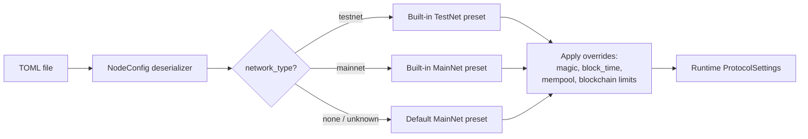

# Configuration Reference

The `neo-node` daemon is configured by a single TOML file passed with
`--config` (default: `neo_testnet_node.toml`). This page documents every
section and key the daemon reads.

The shipped presets live under `config/`: `testnet.toml`, `mainnet.toml`,
`mainnet-stateroot.toml`, plus `testnet-service.toml` and
`mainnet-service.toml` for NeoFura-style RPC/indexer service providers.

## How config is parsed



Two important behaviors:

- **Forward compatibility.** Every section and key is optional, and unknown
  sections/keys are ignored.
- **Presets plus overrides.** `[network] network_type` selects a built-in
  protocol preset (committee, seeds, hardfork schedule). Individual keys in
  `[network]`, `[blockchain]`, and `[mempool]` then override fields of that
  preset.

## Sections the daemon consumes

These sections drive node behavior: `[network]`, `[storage]`, `[p2p]`, `[rpc]`,
`[consensus]` (alias `[dbft]`), `[blockchain]`, `[mempool]`,
`[state_service]`, `[indexer]`, `[application_logs]`, and
`[tokens_tracker]`, `[telemetry.metrics]`, `[logging]`, and
`[observability]`.

### `[network]`

Selects which Neo network the node joins.

| Key | Type | Default | Meaning |
|-----|------|---------|---------|
| `network_type` | string | none | `"testnet"` or `"mainnet"` (case-insensitive). Selects the built-in protocol preset. An unknown value falls back to the MainNet preset with a warning. |
| `network_magic` | u32 | from preset | Explicit network magic override. Wins over the preset. Accepts hex (e.g. `0x334F454E`). The `--network-magic` CLI flag overrides this. |

### `[storage]`

Persistence backend.

| Key | Type | Default | Meaning |
|-----|------|---------|---------|
| `backend` | string | `"memory"` unless a persistent path is supplied | `"mdbx"` for the production persistent store, `"rocksdb"` for the supported fallback/test backend, or `"memory"` for in-memory (state lost on restart). Alias: `Engine`. Any other value is rejected. |
| `data_dir` | path | none | Database directory for persistent storage. Required when `backend = "mdbx"` or `"rocksdb"` unless `--storage-path` is passed. |
| `read_only` | bool | `false` | Open the primary store read-only when the selected backend supports it. Alias: `ReadOnly`. Use only for offline inspection/query modes; a normal syncing node must write genesis, blocks, headers, indexes, and service state. |
| `mdbx_geometry_upper_gb` | integer | backend default | MDBX map upper bound in GiB. Shipped MainNet/TestNet configs pin this so the mmap geometry is explicit. |
| `mdbx_geometry_growth_mb` | integer | backend default | MDBX map growth step in MiB. |
| `mdbx_max_readers` | integer | backend default | MDBX reader slot limit for concurrent RPC/service reads. |
| `static_files_dir` | path | none (disabled) | Enables the finalized Ledger static archive and stores `ledger.static` in this directory. The configured provider becomes the shared historical fallback for blockchain, consensus, P2P, admission, wallet, and RPC reads. Requires a writable persistent canonical backend. |
| `static_files_compression_level` | integer | `3` | Zstandard level applied independently to each finalized-height frame. |
| `static_files_cache_capacity` | integer | `64` | Number of decompressed height frames retained by the LRU cache; must be greater than zero. |
| `static_files_recovery_batch_blocks` | integer | `1024` | Maximum hot Ledger blocks appended per startup reconciliation sync; must be greater than zero. |

Notes:

- The CLI `--storage-path <DIR>` overrides the directory and uses the default
  persistent backend (`mdbx`) unless `[storage].backend` explicitly selects
  `rocksdb`.
- A persistent backend (`mdbx` or `rocksdb`) with no directory and no
  `--storage-path` is an error.
- Static files are currently a **post-canonical mirror**. The node captures the
  exact Ledger rows before commit, appends them only after MDBX/RocksDB commits,
  verifies the complete retained block-hash prefix and repairs lag from the hot
  store at startup, and serves clean hot misses through the same provider
  traits. Hot Ledger pruning is not enabled yet, so operators should budget for
  both copies while this correctness-first phase is active.
- Opening `ledger.static` takes an exclusive OS lock on the archive file
  itself. A second node using the same file, including through a symlink or
  hard link, fails startup; the kernel releases the lease automatically when
  the owning process exits, so no stale lockfile cleanup is required.
- The current latest-key index is rebuilt in memory on startup. Its scan time
  and memory scale with archived rows until persistent MDBX offset/checkpoint
  indexes and segment rotation are implemented.
- Archive-enabled P2P sync uses at most 64 blocks per deferred canonical batch.
  Larger batches from other import sources fall back to per-block durability,
  bounding pending Ledger-row memory instead of accumulating an entire large
  replay batch.
- A static archive write failure requests a clean restart; it does not roll
  back or poison already durable canonical state. Startup repairs the missing
  prefix before exposing local reads.

### `[p2p]`

Peer-to-peer networking.

| Key | Type | Default | Meaning |
|-----|------|---------|---------|
| `port` | u16 | TestNet `20333`, MainNet `10333` (by network) | TCP port for inbound peers. Aliases: `listen_port`, `Port`. |
| `bind_address` | string | `0.0.0.0` | IP address the P2P listener binds to. |
| `seed_nodes` | array of string | preset seed list | `host:port` endpoints dialed on startup. Empty falls back to the preset's seeds. |
| `enable_compression` | bool | `true` | Advertise/enable P2P message compression. Alias: `EnableCompression`. |
| `min_desired_connections` | usize | `10` | Minimum desired outbound peer count. Alias: `MinDesiredConnections`. |
| `max_connections` | i64 | `40` | Maximum simultaneous peers. `-1` means unlimited. Alias: `MaxConnections`. |
| `max_connections_per_address` | usize | `3` | Maximum peers accepted from one remote IP. Alias: `MaxConnectionsPerAddress`. |
| `max_known_hashes` | usize | `1000` | Known inventory hashes retained for duplicate suppression. Alias: `MaxKnownHashes`. |
| `broadcast_history_limit` | usize | channel default | Recent broadcasts retained for diagnostics. |

Defaults shown for connection limits are the `ChannelsConfig` defaults applied
when the key is omitted.

### `[rpc]`

JSON-RPC server. The daemon maps the node TOML keys below directly into the
embedded `RpcServerConfig`, so shipped hardening knobs such as authentication,
disabled methods, invoke gas limits, and batch limits are applied at startup.

| Key | Type | Default | Meaning |
|-----|------|---------|---------|
| `enabled` | bool | `false` | Start the JSON-RPC server. |
| `port` | u16 | `10332` | RPC listen port. |
| `bind_address` | string | `127.0.0.1` | IP address the RPC server binds to. |
| `auth_enabled` | bool | auto | Enable Basic authentication. If omitted, non-empty `rpc_user`/`rpc_pass` enable auth. Alias: `AuthEnabled`. |
| `rpc_user` | string | empty | Basic-auth username. Alias: `RpcUser`. |
| `rpc_pass` | string | empty | Basic-auth password. Alias: `RpcPass`. |
| `cors_enabled` | bool | RPC default | Enable CORS headers. Alias: `EnableCors`. |
| `allow_origins` | array of string | empty | Allowed CORS origins. Alias: `AllowOrigins`. |
| `max_gas_invoke` | i64 | RPC default | Maximum GAS, in datoshi, allowed for one invoke call. Alias: `MaxGasInvoke`. |
| `max_iterator_results` / `max_iterator_result_items` | usize | RPC default | Maximum iterator items returned in one response. Alias: `MaxIteratorResultItems`. |
| `max_stack_size` | usize | RPC default | Maximum VM stack items in invoke responses. Alias: `MaxStackSize`. |
| `disabled_methods` | array of string | empty | RPC methods disabled for this endpoint. Alias: `DisabledMethods`. |
| `max_concurrent_connections` | usize | RPC default | Maximum concurrent RPC connections. Alias: `MaxConcurrentConnections`. |
| `max_request_body_size` | usize | RPC default | Maximum JSON-RPC request body size in bytes. Alias: `MaxRequestBodySize`. |
| `max_requests_per_second` | u32 | RPC default | Enforced by the in-process per-method limiter as a process-wide fallback; use an edge proxy for true per-client/IP limits on public deployments. Alias: `MaxRequestsPerSecond`. |
| `rate_limit_burst` | u32 | RPC default | Burst capacity for the in-process RPC rate limiter. Alias: `RateLimitBurst`. |
| `max_batch_size` | usize | RPC default | Maximum JSON-RPC calls accepted in one batch. Alias: `MaxBatchSize`. |
| `session_enabled` | bool | RPC default | Enable iterator sessions. Alias: `SessionEnabled`. |
| `session_expiration_time` | u64 | RPC default | Session expiration time in seconds. Alias: `SessionExpirationTime`. |
| `find_storage_page_size` | usize | RPC default | Page size used by `findstorage`. Alias: `FindStoragePageSize`. |
| `keep_alive_timeout` | i32 | RPC default | Idle keep-alive timeout in seconds; negative disables idle reaping. Alias: `KeepAliveTimeout`. |
| `request_headers_timeout` | u64 | RPC default | Request header timeout in seconds. Alias: `RequestHeadersTimeout`. |

When Basic authentication is enabled, every HTTP RPC request must include a
valid `Authorization: Basic ...` header. Wallet-mutating protected methods are
only exposed by the transport when a complete `rpc_user`/`rpc_pass` pair is
configured, and incomplete credentials are rejected during startup validation.
When CORS is enabled, an empty `allow_origins` list allows any browser origin;
otherwise the transport echoes only origins present in `allow_origins` and
answers CORS preflight `OPTIONS` requests before RPC authentication.

### `[consensus]` (alias `[dbft]`)

dBFT consensus participation. The section name `[dbft]` is accepted as an alias.

| Key | Type | Default | Meaning |
|-----|------|---------|---------|
| `enabled` | bool | `false` | Participate in dBFT. When `true`, the node decodes inbound dBFT extensible payloads and drives the round lifecycle if its key is a validator. |
| `auto_start` | bool | `false` | C# DBFT-style startup flag. When either `enabled` or `auto_start` is true, the daemon attempts to start consensus using `private_key_hex` or `[consensus.hsm]`. |
| `private_key_hex` | string | none | 32-byte secp256r1 private key (hex). Required when consensus startup is requested and no HSM config is present. The node only produces blocks if the derived public key is in the validator set; otherwise it relays consensus messages only. |

> Keep `private_key_hex` out of shared configs and version control. It is a
> validator signing key.

#### `[consensus.hsm]` — HSM-backed signing (optional)

Instead of a software `private_key_hex`, a validator can sign consensus
messages with a hardware security module over PKCS#11. The node never sees the
private key — it sends each pre-hashed message to the HSM and gets back the
signature. Requires building the node with the `hsm` feature
(`cargo build --release -p neo-node --features hsm`). When `[consensus.hsm]` is
present it takes precedence over `private_key_hex`.

| Key | Type | Default | Meaning |
|-----|------|---------|---------|
| `provider` | string | — | `aws`, `azure-cloud-hsm`, `azure-dedicated-hsm`, `gcp-cloud-hsm`, `yubihsm2`, `nshield`, `softhsm2`, `utimaco`, or `generic`. Selects the default PKCS#11 library and signature format; use `generic` + `library_path` for any other PKCS#11 HSM. |
| `library_path` | string | provider default | Path to the PKCS#11 `.so` to load. |
| `slot` | int | first with token | PKCS#11 slot number. |
| `token_label` | string | none | Token label to match when `slot` is omitted. |
| `key_label` | string | — | `CKA_LABEL` of the consensus private key (required). |
| `key_id_hex` | string | none | Optional `CKA_ID` (hex) to disambiguate keys sharing a label. |
| `pin_env` | string | `NEO_HSM_CU_PASSWORD` | Environment variable holding the `C_Login` PIN. |

The PIN is **never** stored in the TOML — it is read at startup from the
`pin_env` environment variable (for AWS/Azure Cloud HSM the value is
`"<CU_user>:<password>"`; for GCP it is empty and credentials come from ADC).
The node fails fast at startup if the HSM cannot be reached.

```toml
[consensus]
enabled = true

[consensus.hsm]
provider = "aws"
key_label = "neo-consensus-validator-1"
# pin_env defaults to NEO_HSM_CU_PASSWORD; export it before starting the node:
#   export NEO_HSM_CU_PASSWORD="crypto_user:hunter2"
```

### `[blockchain]`

Protocol limits that override the selected preset.

| Key | Type | Default | Meaning |
|-----|------|---------|---------|
| `block_time` | u32 | preset (`15000`) | Target block interval in milliseconds (`MillisecondsPerBlock`). Aliases: `milliseconds_per_block`, `MillisecondsPerBlock`. |
| `max_transactions_per_block` | u32 | preset (MainNet `200`, TestNet `5000`) | Maximum transactions per block. Alias: `MaxTransactionsPerBlock`. |
| `max_valid_until_block_increment` | u32 | preset (`5760`) | Maximum `ValidUntilBlock` increment for transactions. Aliases: `max_valid_until_block_increment`, `MaxValidUntilBlockIncrement`. |
| `max_traceable_blocks` | u32 | preset | Maximum traceable blocks exposed to contracts. Alias: `MaxTraceableBlocks`. |

### `[mempool]`

Transaction pool sizing.

| Key | Type | Default | Meaning |
|-----|------|---------|---------|
| `max_transactions` | i32 | preset (`50000`) | Maximum transactions retained in the memory pool (`MemoryPoolMaxTransactions`). Aliases: `memory_pool_max_transactions`, `MemoryPoolMaxTransactions`. |

### `[state_service]`

State-root/MPT support used by Neo's StateService RPC methods.

| Key | Type | Default | Meaning |
|-----|------|---------|---------|
| `enabled` | bool | `false` | Start the state-root service and register its state store. Alias: `Enabled`. |
| `full_state` | bool | `false` | Retain historical trie nodes for old-root proofs/state reads. Alias: `FullState`. |
| `track_during_catchup` | bool | `false` | Keep computing local MPT state roots even while the node is far behind the peer tip. Enable this for full MainNet state-root validation or bootstrap jobs that must produce every historical root. Alias: `TrackDuringCatchup`. |
| `path` | path | `StateRoot_{0}` | State-service store directory. `{0}` is replaced with uppercase 8-digit network magic. Alias: `Path`. |

The service is updated during block persistence through the daemon's commit
handlers, so it follows the same canonical-chain lifecycle as the ledger. By
default, cold catch-up defers per-block MPT work for sync throughput; validation
configs set `track_during_catchup = true` so `getstateheight` and
`getstateroot` advance from genesis instead of only near the live tip. A
StateService store must be contiguous with the chain store: if the chain has
already advanced without matching MPT roots, restore a checkpoint that includes
`StateRoot` or replay from genesis with `track_during_catchup = true`.

### `[indexer]`

Read-side block, transaction, signer-account, and notification index used by
the built-in `NeoIndexer` RPC method group.

| Key | Type | Default | Meaning |
|-----|------|---------|---------|
| `enabled` | bool | `false` | Start the indexer service and expose indexer RPC methods. Alias: `Enabled`. |
| `store_path` | path | none | Optional RocksDB/service-store directory for prefix-keyed index records. `{0}` is replaced with uppercase 8-digit network magic. Aliases: `StorePath`, `DBPath`, `DbPath`. |
| `path` | path | none | Legacy JSON snapshot file for persistence. Mutually exclusive with `store_path`. `{0}` is replaced with uppercase 8-digit network magic. Alias: `Path`. |
| `backfill_on_startup` | bool | `true` | Fill missing block/transaction/account records from the canonical chain before following live imports. Alias: `BackfillOnStartup`. |

Live block imports include smart-contract notifications because the daemon has
the current `ApplicationExecuted` list during persistence. Startup backfill can
reconstruct block, transaction, and signer-account records from stored blocks;
historical notification backfill requires those execution records to have been
captured live. When a persisted indexer already has a contiguous tip whose hash
matches the canonical chain, startup backfill resumes from the next block
instead of scanning from genesis; if the tip is stale or incomplete, it falls
back to a conservative full scan.

This is the built-in service-oriented indexer for NeoFura-style RPC workloads:
it gives operators block, transaction, signer-account, contract-notification,
and transfer-participant notification queries through JSON-RPC. Use
`store_path` for the default RocksDB-backed service-store mode, which stores
blocks, transactions, account transaction links, and notification lookup rows
under stable `neo-indexer:v3:*` prefixes and updates changed rows with
per-mutation deltas. `path` remains available only for portable JSON snapshot
compatibility.

`getindexerstatus` reports the indexed tip, current ledger height, block lag,
sync state, persistence mode, and whether ApplicationLogs is available for
historical notification recovery.

### `[application_logs]`

C# `Neo.Plugins.ApplicationLogs`-compatible execution log storage.

| Key | Type | Default | Meaning |
|-----|------|---------|---------|
| `enabled` | bool | `false` | Capture per-block and per-transaction application logs for `getapplicationlog`. Alias: `Enabled`. |
| `path` | path | `ApplicationLogs_{0}` | Plugin store directory. `{0}` is replaced with uppercase 8-digit network magic. Alias: `Path`. |
| `max_stack_size` | usize | plugin default | Maximum serialized stack item size. Alias: `MaxStackSize`. |
| `debug` | bool | `false` | Include `ApplicationEngine.Log` messages. Alias: `Debug`. |
| `exception_policy` | enum | plugin default | Handler exception policy. Alias: `UnhandledExceptionPolicy`. |

### `[tokens_tracker]`

NEP-11/NEP-17 balance and transfer indexing used by the TokensTracker RPC
method group.

| Key | Type | Default | Meaning |
|-----|------|---------|---------|
| `enabled` | bool | `false` | Track NEP-11/NEP-17 balances and transfers. Alias: `Enabled`. |
| `db_path` | path | `TokenBalanceData` | Plugin store directory. `{0}` is replaced with uppercase 8-digit network magic when present. Aliases: `DBPath`, `Path`. |
| `track_history` | bool | plugin default | Retain historical transfer records. Alias: `TrackHistory`. |
| `max_results` | u32 | plugin default | Maximum RPC result count. Alias: `MaxResults`. |
| `network` | u32 | node network | Optional network override. Alias: `Network`. |
| `enabled_trackers` | array of string | `["NEP-17", "NEP-11"]` | Standards to track. Alias: `EnabledTrackers`. |
| `exception_policy` | enum | plugin default | Handler exception policy. Alias: `UnhandledExceptionPolicy`. |

### `[telemetry.metrics]`

Prometheus-compatible text metrics endpoint. Disabled by default.

| Key | Type | Default | Meaning |
|-----|------|---------|---------|
| `enabled` | bool | `false` | Start the HTTP metrics endpoint. Alias: `Enabled`. |
| `port` | u16 | `9090` | Metrics listen port. Alias: `Port`. |
| `bind_address` | string | `127.0.0.1` | Metrics bind address. Alias: `BindAddress`. |
| `path` | string | `/metrics` | HTTP path that serves Prometheus text. Must start with `/` and cannot be `/healthz` or `/readyz`. Alias: `Path`. |

Example:

```toml
[telemetry.metrics]
enabled = true
port = 9090
bind_address = "127.0.0.1"
path = "/metrics"
```

The telemetry HTTP server also serves `/healthz` for process liveness and
`/readyz` for local ledger readiness. The exporter serves node
liveness/build labels, uptime, ledger height, peer count, mempool counts,
header-cache count, optional service registration gauges, NeoIndexer health and
index counts, NeoIndexer lag/sync gauges, and any metrics already registered with the process-wide
Prometheus registry such as RPC request/error counters.

### `[logging]`

Tracing subscriber configuration. The `RUST_LOG` environment variable overrides
`[logging].level` when it is set, so operators can temporarily raise verbosity
without editing TOML.

| Key | Type | Default | Meaning |
|-----|------|---------|---------|
| `enabled` | bool | `true` | Enable TOML-driven logging. If false and `RUST_LOG` is unset, the filter is `off`. Aliases: `Enabled`, `active`. |
| `level` | string | `info,neo=debug` | Tracing filter directive, e.g. `info`, `debug`, or `info,neo=debug`. Alias: `Level`. |
| `format` | string | `pretty` | `pretty`, `compact`, or `json`. Alias: `Format`. |
| `console_output` | bool | `true` | Emit logs to stdout/stderr. Alias: `ConsoleOutput`. |
| `file_path` | path | none | Optional log file path. Parent directories are created automatically. Alias: `FilePath`. |
| `max_file_size` | string | none | Rotate the configured log file once it reaches this size. Supports bytes plus `KB`, `MB`, or `GB` suffixes. Requires `file_path`. Alias: `MaxFileSize`. |
| `max_files` | usize | `5` when rotation is enabled | Number of rotated archives to retain. Must be greater than zero when set. Alias: `MaxFiles`. |

Example:

```toml
[logging]
level = "info,neo=debug"
format = "json"
console_output = true
file_path = "./logs/neo-node-mainnet.log"
max_file_size = "100MB"
max_files = 10
```

### `[observability]`

Optional outbound observability hooks for production operators. When disabled
(the default), the daemon sends no external requests. When enabled, the daemon
can report startup failures and Rust panics to one or more error endpoints, and
can ping heartbeat URLs such as Better Stack uptime heartbeats.
If `capture_panics = true`, at least one enabled error endpoint is required;
set `capture_panics = false` for heartbeat-only deployments.

| Key | Type | Default | Meaning |
|-----|------|---------|---------|
| `enabled` | bool | `false` | Install observability hooks and spawn heartbeat tasks. Alias: `Enabled`. |
| `service_name` | string | `neo-node` | Service name sent in payloads. Alias: `ServiceName`. |
| `environment` | string | none | Deployment label such as `production`, `testnet`, or `local`. Alias: `Environment`. |
| `node_id` | string | none | Operator-defined node identifier. Alias: `NodeId`. |
| `capture_panics` | bool | `true` | Report Rust panics to configured error endpoints. Alias: `CapturePanics`. |
| `request_timeout_ms` | u64 | `5000` | HTTP timeout for outbound observability requests. Alias: `RequestTimeoutMs`. |
| `heartbeat_interval_seconds` | u64 | `60` | Default heartbeat interval. Alias: `HeartbeatIntervalSeconds`. |

Error endpoints are configured as `[[observability.error_endpoints]]`.

| Key | Type | Default | Meaning |
|-----|------|---------|---------|
| `enabled` | bool | `true` | Toggle this destination. Alias: `Enabled`. |
| `kind` | string | `custom_json` | `custom_json`, `better_stack_logs`, `google_error_reporting`, or `sentry`. Alias: `Kind`. |
| `name` | string | kind | Name used in local warning logs. Alias: `Name`. |
| `url` | string | none | HTTPS endpoint URL. Required except for Google when `project_id` is set. Alias: `Url`. |
| `token` | string | none | Inline bearer token. Prefer `token_env` for production. Alias: `Token`. |
| `token_env` | string | none | Environment variable containing a bearer token. Alias: `TokenEnv`. |
| `project_id` | string | none | Google Cloud project id for `google_error_reporting`. When `project_id` is used without an explicit `url`, configure `token` or `token_env` for the Google API bearer token. Alias: `ProjectId`. |
| `headers` | table | `{}` | Extra valid HTTP headers. Do not set `Authorization` when `token` or `token_env` is configured. Alias: `Headers`. |
| `headers_env` | table | `{}` | Header name to environment-variable name map for provider-specific header secrets such as Sentry `X-Sentry-Auth`. Do not duplicate names from `headers`. Alias: `HeadersEnv`. |

Heartbeat endpoints are configured as `[[observability.heartbeat_endpoints]]`.

| Key | Type | Default | Meaning |
|-----|------|---------|---------|
| `enabled` | bool | `true` | Toggle this heartbeat. Alias: `Enabled`. |
| `name` | string | URL | Name used in local warning logs. Alias: `Name`. |
| `url` | string | none | HTTP(S) heartbeat URL. Alias: `Url`. |
| `method` | string | `GET` | `GET`, `POST`, or `PUT`. Alias: `Method`. |
| `interval_seconds` | u64 | global default | Per-heartbeat interval. Alias: `IntervalSeconds`. |
| `token` | string | none | Inline bearer token for custom heartbeat APIs. Alias: `Token`. |
| `token_env` | string | none | Environment variable containing a bearer token. Alias: `TokenEnv`. |
| `headers` | table | `{}` | Extra valid HTTP headers. Do not set `Authorization` when `token` or `token_env` is configured. Alias: `Headers`. |
| `headers_env` | table | `{}` | Header name to environment-variable name map for custom heartbeat headers. Do not duplicate names from `headers`. Alias: `HeadersEnv`. |

`GET` heartbeats send a provider-compatible ping with no body. `POST` and
`PUT` heartbeats send JSON containing service metadata plus a `node` health
summary with ledger height, peer count, mempool counts, optional service
registration, and NeoIndexer readiness/lag/sync.
When a heartbeat request fails, the daemon logs the failure and sends a
`heartbeat_failure` event to every enabled error endpoint, so operators can
route heartbeat outages through the same Google, Better Stack Logs, or custom
JSON incident pipeline as startup errors and panics.

For `google_error_reporting`, the daemon sends Google-compatible
`ReportedErrorEvent` payloads with `eventTime`, `serviceContext`, and
`context.reportLocation`. Panics use the Rust panic source location when
available; startup errors without a source location use a `neo-node` fallback
location so Google can group the event. When `node_id` is set, it is sent as
`context.user` to make node-specific incidents easier to filter. If you set
`project_id` instead of a full `url`, startup validation requires `token` or
`token_env`; custom URLs may carry credentials in the URL or be handled by an
operator-controlled proxy.

For `better_stack_logs`, the daemon sends a single JSON log event with
top-level `message`, `dt`, `level`, `event_type`, service, network, version,
environment, node id, and optional source location fields. `token` or
`token_env` is sent as the Better Stack source bearer token, while `url`
remains operator-configurable for custom or regional ingestion hosts.

Example:

```toml
[observability]
enabled = true
service_name = "neo-node-mainnet"
environment = "production"
node_id = "validator-1"
heartbeat_interval_seconds = 60

[[observability.error_endpoints]]
kind = "google_error_reporting"
project_id = "my-gcp-project"
token_env = "GOOGLE_ERROR_REPORTING_TOKEN"

[[observability.error_endpoints]]
kind = "better_stack_logs"
url = "https://in.logs.betterstack.com"
token_env = "BETTER_STACK_SOURCE_TOKEN"

[[observability.error_endpoints]]
kind = "sentry"
url = "https://sentry.example.com/api/42/store/"

[observability.error_endpoints.headers_env]
X-Sentry-Auth = "SENTRY_AUTH_HEADER"

[[observability.heartbeat_endpoints]]
name = "better-stack"
url = "https://uptime.betterstack.com/api/v1/heartbeat/your-heartbeat-id"
method = "GET"
interval_seconds = 60
```

## Environment variables

| Variable | Scope | Meaning |
|----------|-------|---------|
| `RUST_LOG` | daemon | Log filter (e.g. `info`, `debug`, `info,neo=debug`). Default when unset: `info,neo=debug`. |
| `NEO_NETWORK` | Docker | `testnet` (default) or `mainnet`; selects the bundled config inside the container. |
| `NEO_STORAGE` | Docker | Primary storage path inside the container. The backend still comes from the TOML preset, which uses MDBX by default. |
| `NEO_CONFIG` | Docker | Custom config path for a bind-mounted TOML. |
| `NEO_PLUGINS_DIR` | Docker | Directory for plugin configs (e.g. `RpcServer.json`). |
| `NEO_RPC_PORT` | Docker | Health-check RPC port override only; the node's actual RPC port still comes from the TOML `[rpc]` section. |
| `BETTER_STACK_SOURCE_TOKEN` | observability | Optional Better Stack Logs bearer token referenced by `token_env`. |
| `GOOGLE_ERROR_REPORTING_TOKEN` | observability | Optional Google Error Reporting bearer token referenced by `token_env`. |
| `SENTRY_AUTH_HEADER` | observability | Optional full Sentry auth header value referenced by `headers_env`. |

CLI flags (`--network-magic`, `--storage-path`, `--config`) take precedence over
the corresponding TOML values. There is no general environment-variable override
for arbitrary TOML keys; `NEO_*` variables apply to the Docker entrypoint, not
the native binary.

## Storage path alias

The primary store directory can be set two ways, in increasing precedence:

1. `[storage] data_dir = "..."`
2. `--storage-path <DIR>` on the command line (uses the default persistent backend, MDBX, unless `[storage].backend` explicitly selects RocksDB)

Legacy `[storage].path` is not used for the primary chain store. Keep primary
storage configs canonical with `data_dir`; service-specific stores may still
use their own `path` / `store_path` keys where documented in their sections.

## Minimal example

A minimal, persistent TestNet node with RPC enabled on loopback:

```toml
[network]
network_type = "testnet"

[storage]
backend = "rocksdb"
data_dir = "./data/testnet"
static_files_dir = "./data/testnet-static"

[p2p]
port = 20333

[rpc]
enabled = true
port = 20332
bind_address = "127.0.0.1"
```

For MainNet, set `network_type = "mainnet"`, use a MainNet data directory, and
the MainNet ports (`10333` P2P, `10332` RPC). The bundled `config/mainnet.toml`
and `config/testnet.toml` are complete working examples.

## RPC server hardening defaults

When `[rpc] enabled = true`, omitted RPC hardening keys keep the embedded
server's `RpcServerConfig` defaults. Keys present in node TOML override those
defaults before the listener starts, including authentication, disabled-method
lists, request body and batch limits, invoke gas caps, iterator limits, and
session support.

To harden RPC, bind to loopback and keep it behind a reverse proxy with TLS,
auth, and rate limits — see the RPC hardening section of
[operations.md](./operations.md).
