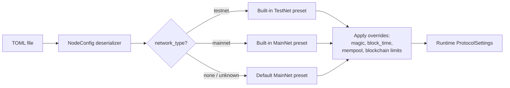

# Configuration Reference

The `neo-node` daemon is configured by a single TOML file passed with
`--config` (default: `neo_testnet_node.toml`). This page documents every
section and key the daemon reads, plus a few keys that appear in the shipped
config files but are not yet consumed by the daemon.

The shipped presets live under `config/` (`testnet.toml`, `mainnet.toml`,
`mainnet-stateroot.toml`).

## How config is parsed



Two important behaviors:

- **Forward compatibility.** Every section and key is optional, and unknown
  sections/keys are ignored. A config carrying blocks the daemon does not
  consume (such as `[telemetry]`, `[logging]`, `[state_service]`) still parses.
- **Presets plus overrides.** `[network] network_type` selects a built-in
  protocol preset (committee, seeds, hardfork schedule). Individual keys in
  `[network]`, `[blockchain]`, and `[mempool]` then override fields of that
  preset.

## Sections the daemon consumes

These sections drive node behavior: `[network]`, `[storage]`, `[p2p]`, `[rpc]`,
`[consensus]` (alias `[dbft]`), `[blockchain]`, and `[mempool]`.

### `[network]`

Selects which Neo network the node joins.

| Key | Type | Default | Meaning |
|-----|------|---------|---------|
| `network_type` | string | none | `"testnet"` or `"mainnet"` (case-insensitive). Selects the built-in protocol preset. An unknown value falls back to the MainNet preset with a warning. |
| `network_magic` | u32 | from preset | Explicit network magic override. Wins over the preset. Accepts hex (e.g. `0x334F454E`). The `--network-magic` CLI flag overrides this. |

### `[storage]`

Persistence backend.

| Key | Type | Default | Meaning |
|-----|------|---------|---------|
| `backend` | string | `"memory"` | `"rocksdb"` for a persistent store, `"memory"` for in-memory (state lost on restart). Alias: `Engine`. Any other value is rejected. |
| `data_dir` | path | none | RocksDB database directory. Required when `backend = "rocksdb"` unless `--storage-path` is passed. |
| `path` | path | none | Alias for `data_dir`, accepted by the shipped presets. |
| `read_only` | bool | (not consumed) | Present in shipped configs; parsed but not currently consumed by the daemon. |

Notes:

- The CLI `--storage-path <DIR>` overrides the directory and forces the RocksDB
  backend regardless of `backend`.
- A `rocksdb` backend with no directory (and no `--storage-path`) is an error.

### `[p2p]`

Peer-to-peer networking.

| Key | Type | Default | Meaning |
|-----|------|---------|---------|
| `port` | u16 | TestNet `20333`, MainNet `10333` (by network) | TCP port for inbound peers. Aliases: `listen_port`, `Port`. |
| `bind_address` | string | `0.0.0.0` | IP address the P2P listener binds to. |
| `seed_nodes` | array of string | preset seed list | `host:port` endpoints dialed on startup. Empty falls back to the preset's seeds. |
| `enable_compression` | bool | `true` | Advertise/enable P2P message compression. Alias: `EnableCompression`. |
| `min_desired_connections` | usize | `10` | Minimum desired outbound peer count. Alias: `MinDesiredConnections`. |
| `max_connections` | i64 | `40` | Maximum simultaneous peers. `-1` means unlimited. Alias: `MaxConnections`. |
| `max_connections_per_address` | usize | `3` | Maximum peers accepted from one remote IP. Alias: `MaxConnectionsPerAddress`. |
| `max_known_hashes` | usize | `1000` | Known inventory hashes retained for duplicate suppression. Alias: `MaxKnownHashes`. |
| `broadcast_history_limit` | usize | channel default | Recent broadcasts retained for diagnostics. |

Defaults shown for connection limits are the `ChannelsConfig` defaults applied
when the key is omitted.

### `[rpc]`

JSON-RPC server. The daemon consumes only `enabled`, `port`, and
`bind_address`. All other server behavior uses built-in defaults (see
[RPC server defaults](#rpc-server-defaults-not-from-node-toml) below).

| Key | Type | Default | Meaning |
|-----|------|---------|---------|
| `enabled` | bool | `false` | Start the JSON-RPC server. |
| `port` | u16 | `10332` | RPC listen port. |
| `bind_address` | string | `127.0.0.1` | IP address the RPC server binds to. |

> The shipped configs also include `cors_enabled`, `auth_enabled`,
> `max_gas_invoke`, `max_iterator_results` / `max_iterator_result_items`, and
> `disabled_methods`. These keys are **not** read from the node TOML by the
> daemon. They mirror the RPC server's own settings, which the embedded server
> currently applies from built-in defaults. See
> [RPC server defaults](#rpc-server-defaults-not-from-node-toml).

### `[consensus]` (alias `[dbft]`)

dBFT consensus participation. The section name `[dbft]` is accepted as an alias.

| Key | Type | Default | Meaning |
|-----|------|---------|---------|
| `enabled` | bool | `false` | Participate in dBFT. When `true`, the node decodes inbound dBFT extensible payloads and drives the round lifecycle if its key is a validator. |
| `private_key_hex` | string | none | 32-byte secp256r1 private key (hex). Required when `enabled = true`. The node only produces blocks if the derived public key is in the validator set; otherwise it relays consensus messages only. |

The shipped configs also include `auto_start`; it is parsed but not consumed.

> Keep `private_key_hex` out of shared configs and version control. It is a
> validator signing key.

#### `[consensus.hsm]` — HSM-backed signing (optional)

Instead of a software `private_key_hex`, a validator can sign consensus
messages with a hardware security module over PKCS#11. The node never sees the
private key — it sends each pre-hashed message to the HSM and gets back the
signature. Requires building the node with the `hsm` feature
(`cargo build --release -p neo-node --features hsm`). When `[consensus.hsm]` is
present it takes precedence over `private_key_hex`.

| Key | Type | Default | Meaning |
|-----|------|---------|---------|
| `provider` | string | — | `aws`, `azure-cloud-hsm`, `azure-dedicated-hsm`, `gcp-cloud-hsm`, `yubihsm2`, `nshield`, `softhsm2`, `utimaco`, or `generic`. Selects the default PKCS#11 library and signature format; use `generic` + `library_path` for any other PKCS#11 HSM. |
| `library_path` | string | provider default | Path to the PKCS#11 `.so` to load. |
| `slot` | int | first with token | PKCS#11 slot number. |
| `token_label` | string | none | Token label to match when `slot` is omitted. |
| `key_label` | string | — | `CKA_LABEL` of the consensus private key (required). |
| `key_id_hex` | string | none | Optional `CKA_ID` (hex) to disambiguate keys sharing a label. |
| `pin_env` | string | `NEO_HSM_CU_PASSWORD` | Environment variable holding the `C_Login` PIN. |

The PIN is **never** stored in the TOML — it is read at startup from the
`pin_env` environment variable (for AWS/Azure Cloud HSM the value is
`"<CU_user>:<password>"`; for GCP it is empty and credentials come from ADC).
The node fails fast at startup if the HSM cannot be reached.

```toml
[consensus]
enabled = true

[consensus.hsm]
provider = "aws"
key_label = "neo-consensus-validator-1"
# pin_env defaults to NEO_HSM_CU_PASSWORD; export it before starting the node:
#   export NEO_HSM_CU_PASSWORD="crypto_user:hunter2"
```

### `[blockchain]`

Protocol limits that override the selected preset.

| Key | Type | Default | Meaning |
|-----|------|---------|---------|
| `block_time` | u32 | preset (`15000`) | Target block interval in milliseconds (`MillisecondsPerBlock`). Aliases: `milliseconds_per_block`, `MillisecondsPerBlock`. |
| `max_transactions_per_block` | u32 | preset (MainNet `200`, TestNet `5000`) | Maximum transactions per block. Alias: `MaxTransactionsPerBlock`. |
| `max_valid_until_block_increment` | u32 | preset (`5760`) | Maximum `ValidUntilBlock` increment for transactions. Aliases: `max_valid_until_block_increment`, `MaxValidUntilBlockIncrement`. |
| `max_traceable_blocks` | u32 | preset | Maximum traceable blocks exposed to contracts. Alias: `MaxTraceableBlocks`. |

### `[mempool]`

Transaction pool sizing.

| Key | Type | Default | Meaning |
|-----|------|---------|---------|
| `max_transactions` | i32 | preset (`50000`) | Maximum transactions retained in the memory pool (`MemoryPoolMaxTransactions`). Aliases: `memory_pool_max_transactions`, `MemoryPoolMaxTransactions`. |

## Sections present in shipped configs but not consumed by the daemon

These appear in one or more of the bundled `config/*.toml` files. They parse
without error (unknown keys are ignored) but the `neo-node` daemon does not act
on them yet. They are documented here so the shipped files are not surprising.

### `[telemetry]` / `[telemetry.metrics]`

Prometheus metrics configuration. Present in `config/mainnet.toml` and
`config/mainnet-stateroot.toml`.

| Key | Type | Example | Meaning |
|-----|------|---------|---------|
| `enabled` | bool | `false` | Intended to toggle the metrics endpoint. Not consumed by the daemon. |
| `port` | u16 | `9090` | Intended metrics port. Not consumed. |
| `bind_address` | string | `127.0.0.1` | Intended metrics bind address. Not consumed. |

### `[logging]`

Logging configuration. Present in shipped configs. The daemon logs via
`tracing` and is controlled by the `RUST_LOG` environment variable instead of
these keys.

| Key | Type | Example | Meaning |
|-----|------|---------|---------|
| `level` | string | `info` | Intended log level. Use `RUST_LOG` instead. |
| `format` | string | `json` / `pretty` | Intended log format. Not consumed. |
| `file_path` | string | `./logs/neo-node.log` | Intended log file. Not consumed. |
| `max_file_size` | string | `100MB` | Intended rotation size. Not consumed. |
| `max_files` | int | `10` | Intended rotation count. Not consumed. |

### `[state_service]`

MPT state-root service. Present in `config/mainnet.toml` and
`config/mainnet-stateroot.toml`. Parsed but not consumed by the `neo-node`
daemon's config surface.

| Key | Type | Example | Meaning |
|-----|------|---------|---------|
| `enabled` | bool | `true` | Intended to enable the state-root service. |
| `full_state` | bool | `true` | Intended to keep full state history. |
| `path` | string | `StateRoot` | Intended state-store subdirectory. |
| `auto_verify` | bool | `false` | Intended state auto-verification toggle. |
| `max_find_result_items` | int | `100` | Intended cap for `findstates` results. |

## Environment variables

| Variable | Scope | Meaning |
|----------|-------|---------|
| `RUST_LOG` | daemon | Log filter (e.g. `info`, `debug`, `info,neo=debug`). Default when unset: `info,neo=debug`. |
| `NEO_NETWORK` | Docker | `testnet` (default) or `mainnet`; selects the bundled config inside the container. |
| `NEO_STORAGE` | Docker | RocksDB path inside the container. |
| `NEO_CONFIG` | Docker | Custom config path for a bind-mounted TOML. |
| `NEO_PLUGINS_DIR` | Docker | Directory for plugin configs (e.g. `RpcServer.json`). |
| `NEO_RPC_PORT` | Docker | Health-check RPC port override only; the node's actual RPC port still comes from the TOML `[rpc]` section. |

CLI flags (`--network-magic`, `--storage-path`, `--config`) take precedence over
the corresponding TOML values. There is no general environment-variable override
for arbitrary TOML keys; `NEO_*` variables apply to the Docker entrypoint, not
the native binary.

## Storage path alias

The RocksDB directory can be set three ways, in increasing precedence:

1. `[storage] data_dir = "..."`
2. `[storage] path = "..."` (alias for `data_dir`)
3. `--storage-path <DIR>` on the command line (also forces the RocksDB backend)

When both `data_dir` and `path` are present, `data_dir` takes precedence.

## Minimal example

A minimal, persistent TestNet node with RPC enabled on loopback:

```toml
[network]
network_type = "testnet"

[storage]
backend = "rocksdb"
data_dir = "./data/testnet"

[p2p]
port = 20333

[rpc]
enabled = true
port = 20332
bind_address = "127.0.0.1"
```

For MainNet, set `network_type = "mainnet"`, use a MainNet data directory, and
the MainNet ports (`10333` P2P, `10332` RPC). The bundled `config/mainnet.toml`
and `config/testnet.toml` are complete working examples.

## RPC server defaults (not from node TOML)

When `[rpc] enabled = true`, the daemon constructs the embedded JSON-RPC server
with built-in defaults for everything except network magic, bind address, and
port. The server's own settings model (`RpcServerConfig`) supports keys such as
rate limiting, request body size, CORS, basic auth, max gas per invocation,
iterator result caps, session/iterator support, and disabled-method lists. These
are loaded from the server's settings model (a separate JSON `RpcServer.json`
style configuration), not from the node TOML's `[rpc]` section.

To harden RPC, bind to loopback and keep it behind a reverse proxy with TLS,
auth, and rate limits — see the RPC hardening section of
[operations.md](./operations.md).
