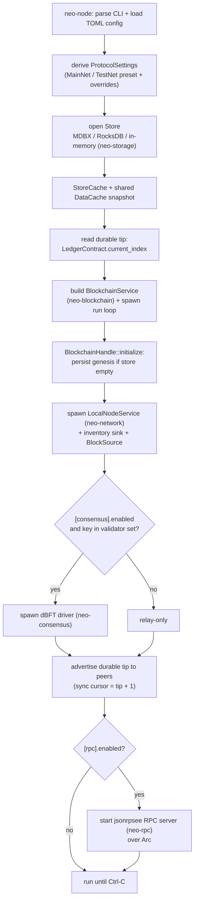
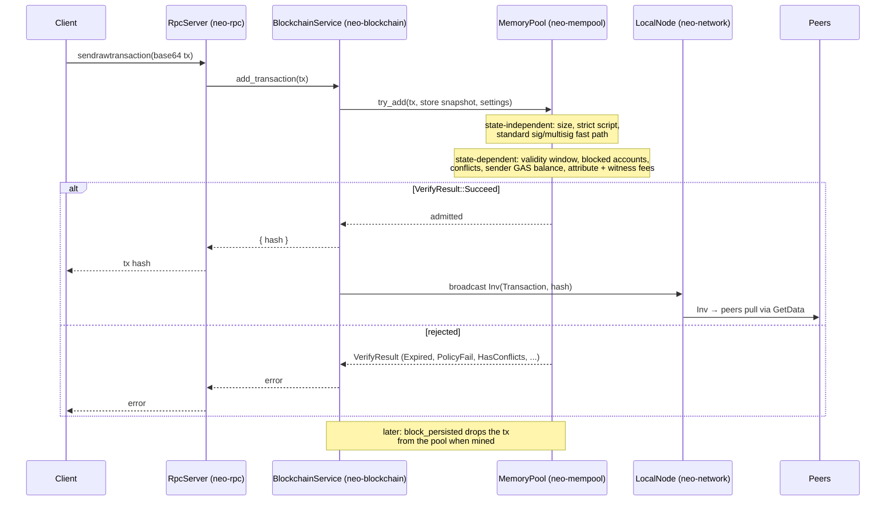
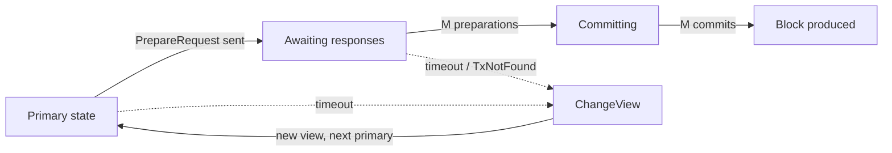
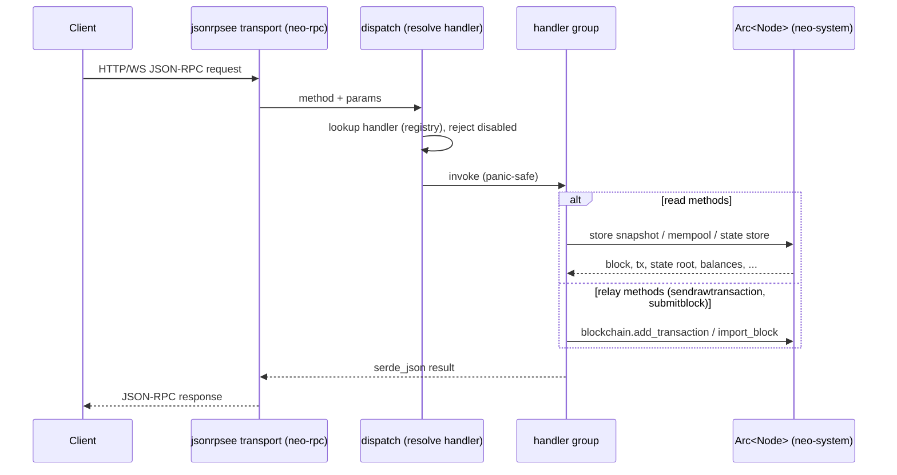
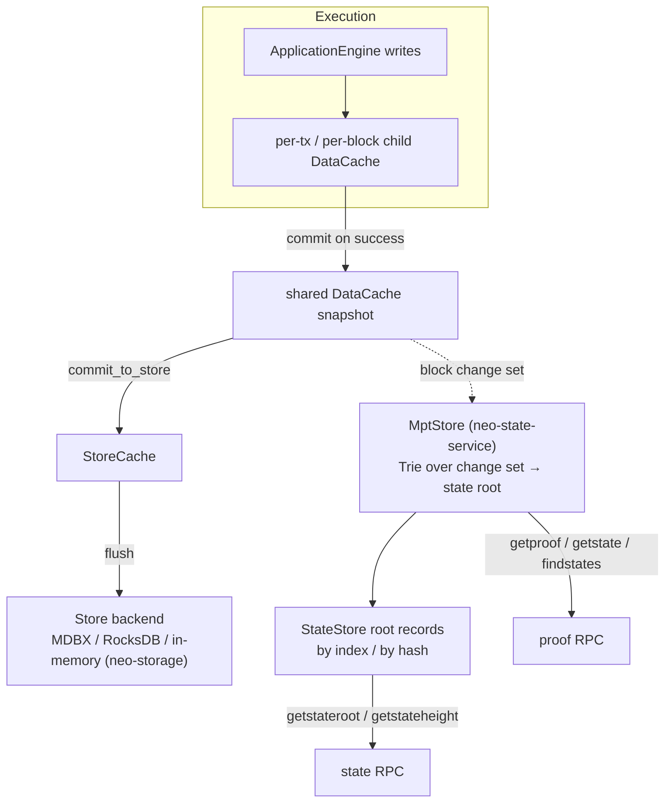

# Data and Control Flow

This document explains how data and control move through the node: how the
services are wired at startup, how blocks and transactions travel from the
network into durable state, how consensus produces a block, and how JSON-RPC
reads it back. Each section pairs a diagram with a short explanation. The
focus is conceptual; it does not document private functions.

The node is a set of independent async services connected by typed channels.
There is no actor framework: each service owns a command/event loop, and the
composition root (`neo-system` / the `neo-node` daemon) wires the channels
together. The diagrams below name the crate that owns each step.

## 1. Node startup and composition

The daemon (`neo-node`) is the composition root. It loads TOML configuration,
opens storage, builds the blockchain service over a shared store snapshot,
bootstraps genesis on an empty store, then spawns the P2P, consensus (optional),
and RPC services and connects them with channels.



Two startup details matter for correctness:

- **Shared snapshot.** A single `DataCache` over the `StoreCache` is shared by
  the blockchain service (which writes blocks), the RPC `BlockSource`, and the
  mempool's verification view, so reads observe the live chain state.
- **Restart resume.** The durable tip is read from the store before P2P starts.
  The in-memory ledger tip and the advertised height are seeded from it, so a
  restarted node requests blocks from `tip + 1` instead of re-syncing from
  genesis (`neo-node/src/node.rs`).

## 2. Block ingestion

A block arriving from a peer is decoded by its per-peer task, buffered by
`neo-node`, and submitted through
`neo_blockchain::BlockchainHandle::submit_inventory_blocks`. Consensus-produced
blocks use `submit_inventory_block`; extensible payloads use
`submit_inventory_extensible`; startup genesis bootstrapping uses `initialize`.
The node composition code does not construct private `BlockchainCommand`
variants directly. The blockchain service then structurally and
witness-verifies blocks, runs the C# `Blockchain.Persist` pipeline, and commits
them durably. Out-of-order blocks are parked and drained when their parent
lands. The typed inventory handle methods deliberately preserve
inventory-specific behavior (relay policy, parking, draining, and live mempool
maintenance) instead of routing peer blocks through the generic bulk-import
command.

Downloaded block batches may first pass through `neo_runtime::BlockImportQueue`:
the queue runs `BlockImport::check` with bounded concurrency and then calls
`BlockImport::import_many` in the original order. That queue is a preflight
boundary, not a second import path. `neo_network::BlockDownloader` is the
stream-shaped source boundary for peer schedulers; its `BlockDownloadBatch`
converts into `neo_runtime::SyncBlockBatch`. `SyncPipelineDriver` validates
contiguous heights, pushes those batches through the import queue, and persists
import-stage checkpoints through
`neo_runtime::sync_pipeline::{CommitPolicy, SyncStageCheckpointStore}`. The
node-level `neo_system::SyncImportPipeline` now composes the queue and durable
checkpoint provider over the same blockchain and storage handles used by the
rest of the node and is registered in the node `ServiceRegistry`.
`neo_system::SyncDownloadImportDriver` drains any `BlockDownloader` stream into
that handle and stops on downloader, contiguity, partial-import, or checkpoint
errors; the remaining network work is to feed it from the real async peer
transport. The
per-peer `GetBlockByIndex` request window is planned by
`neo_network::BlockRequestScheduler` and sent by `PeerSession`. Cross-peer range
assignment, peer bias, and retry accounting are now owned by
`neo_network::CrossPeerBlockRangeScheduler`. The transport-agnostic
`neo_network::BlockDownloadCoordinator` composes that scheduler with
`neo_network::OrderedBlockBatchBuffer` and yields ordered `BlockDownloadBatch`
values from any `BlockRangeFetcher`. `Arc<neo_network::PeerRegistry>` now
implements that fetcher by resolving the assigned peer handle, sending
`GetBlockByIndex`, and collecting the matching block frames into a batch; the
remaining production integration is wiring the coordinator-driven downloader
into node sync startup.
The canonical execution/persist path remains the `neo-blockchain` service loop.

```mermaid
sequenceDiagram
    participant Peer
    participant RN as RemoteNode (neo-network)
    participant Fwd as Inventory forwarder (neo-node)
    participant BC as BlockchainService (neo-blockchain)
    participant NP as native_persist pipeline
    participant AE as ApplicationEngine (neo-execution)
    participant Store as DataCache / StoreCache (neo-storage)

    Peer->>RN: block message
    RN->>Fwd: InboundInventory::Block
    opt batch preflight
        Fwd->>Fwd: BlockImportQueue::push_blocks<br/>(bounded check concurrency)
    end
    Fwd->>BC: submit_inventory_blocks / submit_inventory_block
    Note over BC: index == height + 1?<br/>else park / ignore
    BC->>BC: structural checks (version, tx count,<br/>merkle root, no duplicate tx)
    BC->>Store: load prev TrimmedBlock
    BC->>BC: verify consensus witness vs<br/>prev.NextConsensus (3-GAS cap)
    BC->>NP: stage_block_natives_with_resources(block)
    NP->>AE: OnPersist engine (+ native init at activation)
    loop each transaction
        AE->>AE: Application engine, gas = tx.SystemFee
        Note over AE: HALT commits per-tx cache; FAULT discards
    end
    NP->>AE: PostPersist engine
    NP->>Store: stage all writes in child cache, commit on success
    BC->>Store: commit_to_store() flush to durable backend
    BC->>BC: mempool.block_persisted (drop mined + conflicts)
    BC-->>Fwd: RuntimeEvent::Imported { height }
```

Ownership by step:

| Step | Owner crate |
|------|-------------|
| Decode wire frame, per-peer state machine | neo-network |
| Sequencing, structural + witness verification | neo-blockchain |
| Native OnPersist / PostPersist + tx execution | neo-blockchain → neo-execution + neo-native-contracts |
| Per-block atomic staging, durable commit | neo-storage |
| Mempool eviction of mined/conflicting tx | neo-mempool |

The whole `Persist` sequence is staged in a child `DataCache` and merged into
the shared snapshot only when every stage succeeds; a fault leaves no partial
block state. Locally produced (consensus) blocks set `pre_verified = true` and
skip the peer-witness check.

## 3. Transaction lifecycle

A client submits a raw transaction over RPC. The RPC layer hands it to the
blockchain service, which runs the full `Transaction.Verify` pipeline through
the mempool. On a fresh accept, the daemon re-announces it to peers so it
propagates and is eventually included in a block.



Peer-relayed transactions take the same path: the inventory forwarder calls
`add_transaction`, and a fresh `Succeed` triggers the same `Inv` re-announce
(`neo-node/src/node.rs`). Verification logic lives in
`neo-mempool/src/verification.rs` and ports C# `Transaction.VerifyStateIndependent`
followed by `VerifyStateDependent`.

## 4. dBFT consensus round

When `[consensus]` is enabled and this node's key is in the validator set, the
dBFT driver participates in single-block rounds. The primary proposes a block;
backups respond; once `M = N - (N-1)/3` commits are collected the block is
assembled and handed to the blockchain service as a pre-verified block.

```mermaid
sequenceDiagram
    participant Primary
    participant Backups
    participant BC as BlockchainService

    Note over Primary,Backups: Reset for block index; primary = (index) mod N
    Primary->>Primary: collect tx from mempool (RequestTransactions)
    Primary->>Backups: PrepareRequest (proposed tx, timestamp, nonce)
    Backups->>Backups: validate proposal
    Backups->>Primary: PrepareResponse
    Note over Primary,Backups: M preparations reached
    Primary->>Backups: Commit (signature over block header)
    Backups->>Primary: Commit
    Note over Primary,Backups: M commits reached
    Primary->>BC: assembled block (pre_verified)
    BC->>BC: persist (section 2), advance tip
```



Messages travel as `ExtensiblePayload` over P2P (category `dBFT`). The driver
decodes and authenticates inbound payloads against the validator set before
processing; payloads are deduplicated by `ExtensiblePayload.Hash` only after
their witness verifies, so a forged-witness payload cannot suppress the genuine
one (`neo-consensus/src/service/core.rs`). On timeout (or missing proposed
transactions) a backup requests a view change, rotating to the next primary.

## 5. RPC request handling

JSON-RPC requests are served by a jsonrpsee server. A request is parsed, the
method is resolved (case-insensitive) against a registry, and the handler reads
from the ledger snapshot, MPT/state store, or mempool to build the response.



Handlers are grouped by domain and registered at startup
(`neo-node/src/node.rs` calls `register_handlers` for blockchain, node, state,
wallet, utilities, smart-contract, plus the optional application-logs,
tokens-tracker, and oracle groups). The dispatcher catches handler panics and
applies the configured `UnhandledExceptionPolicy`
(`neo-rpc/src/server/dispatch.rs`). Read handlers query the shared store
snapshot via the native `LedgerContract` reader and the mempool; relay handlers
forward to the blockchain service over its command channel.

| Handler group | Example methods | Reads from |
|---------------|-----------------|------------|
| blockchain | getblock, getblockcount, getrawtransaction, getcontractstate | ledger snapshot |
| node | getversion, getpeers, getconnectioncount | network handle |
| state | getstateroot, getstateheight, getproof, getstate, findstates | state store / MPT |
| state / mempool | getrawmempool | mempool |
| smart-contract | invokefunction, invokescript, calculatenetworkfee | snapshot + ApplicationEngine |
| relay | sendrawtransaction, submitblock | blockchain service |

## 6. State and storage

All execution writes go to an in-memory `DataCache` overlay over the `Store`
backend. A block's writes are staged in a child cache, committed into the
shared snapshot when the block succeeds, and flushed to the durable backend by
`commit_to_store()`. The Merkle-Patricia-Trie state root is maintained by the
state service over the block change set and exposed through the state RPCs.



Key points:

- **Overlay model.** A `DataCache` records adds/changes/deletes over a parent
  store; `commit()` merges a child into its parent atomically, and dropping a
  child discards its writes. This is the per-block atomicity mechanism
  (`neo-blockchain/src/native_persist.rs`).
- **Durability.** `commit_to_store()` flushes the snapshot's tracked writes
  through the `StoreCache` to the configured store backend. MDBX is the
  production default, RocksDB remains a supported fallback, and the in-memory
  backend does not persist across restarts.
- **Typed table boundary.** `neo-storage::persistence::Table`,
  `TableCodec`, and `TableReader` give storage code a typed table API over the
  existing raw bytes. `StorageKey` still encodes with `to_array()` and
  `StorageItem` still encodes with `to_value()`, so this abstraction does not
  alter C#-compatible state roots.
- **Ledger provider boundary.** `neo-blockchain` exposes `BlockProvider` and
  `TxProvider` capability traits. `StorageLedgerProviderFactory` creates hot
  providers over native Ledger records; `HotColdLedgerProviderFactory` composes
  hot reads with a `StaticLedgerArchive` cold provider. Static archive writes
  are explicit integration work, not an implicit side effect of block import.
- **State provider boundary.** `neo-state-service` exposes
  `StateProviderFactory` and `StateView` so RPC, VM, and tests can request an
  immutable MPT view at a specific height instead of holding ad-hoc references
  to mutable service internals.
- **State root.** The MPT root is computed from a block's storage change set and
  stored under the C# `StateRoot` wire layout (`neo-state-service/src/mpt_store.rs`),
  with per-block records by index and by hash. `getstateroot`/`getstateheight`
  serve from the `StateStore` verification cache and fall back to the live
  `MptStore`; `getproof`/`getstate`/`findstates` walk the persisted MPT, and
  return a clean `UnsupportedState` error if no MPT backend is registered
  (`neo-rpc/src/server/rpc_server_state.rs`).
