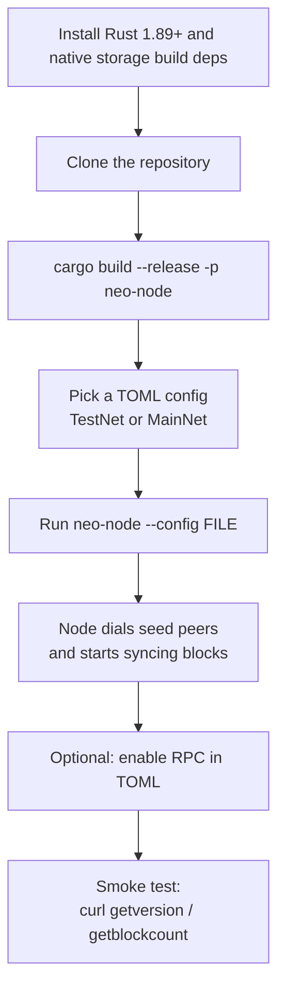

# Getting Started

This guide walks you through building `neo-rs`, running a Neo N3 node on
TestNet or MainNet, pointing it at a data directory, and verifying it over
JSON-RPC. `neo-rs` is a from-scratch Rust implementation of the Neo N3 node with
byte-for-byte protocol parity to the C# reference node (tracked through Neo
v3.10.1).

The runnable program is a single daemon, `neo-node`. It syncs the chain over a
custom TCP P2P protocol and optionally serves a JSON-RPC API. There is no
separate CLI client binary — you query a running node over HTTP.

## Quickstart flow



## Prerequisites

| Requirement | Version / Notes |
|-------------|-----------------|
| Rust toolchain | 1.89 or newer (the workspace uses edition 2024 and standard-library file locking). Install via [rustup](https://rustup.rs). |
| Native storage build dependencies | The production storage provider is MDBX, and RocksDB remains compiled as an explicit fallback/test backend. On Ubuntu/Debian: `build-essential cmake clang libclang-dev libsnappy-dev liblz4-dev libzstd-dev zlib1g-dev libbz2-dev`. |
| Disk | A full MainNet persistent store grows large (hundreds of GB over time). Use a durable volume. |
| OS | Linux or macOS. |

You do not need a system RocksDB library installed; the build compiles RocksDB
from source, which is why a C++ toolchain and `clang` are listed above.

## Clone and build

```bash
git clone https://github.com/r3e-network/neo-rs.git
cd neo-rs

# Build the runnable node daemon (release profile)
cargo build --release -p neo-node
```

This builds the full node — MDBX storage, the RocksDB fallback backend, and the
RPC server are included by default. The only optional feature is `tee` (Trusted Execution Environment
support), enabled with `--features tee`.

The resulting binary is at `target/release/neo-node`.

## Configuration files

The node reads a single TOML config file. The repository ships ready-to-use
presets under `config/`:

| File | Network | Notes |
|------|---------|-------|
| `config/testnet.toml` | TestNet | Sets `network_type = "testnet"`, TestNet seeds, P2P `20333`, RPC `20332`. |
| `config/testnet-service.toml` | TestNet | Service-provider preset: RPC, NeoIndexer, ApplicationLogs, TokensTracker, StateService, metrics, and JSON file logs. |
| `config/mainnet.toml` | MainNet | MainNet magic, MainNet seeds, P2P `10333`, RPC `10332`. |
| `config/mainnet-service.toml` | MainNet | Service-provider preset for NeoFura-style workloads behind a reverse proxy. |
| `config/mainnet-stateroot.toml` | MainNet | MainNet variant with the state-root service enabled. |

The `--config` flag defaults to `neo_testnet_node.toml` (in the current working
directory) when not given. A missing config file is not fatal — the node falls
back to its built-in MainNet protocol preset and logs a warning. Always pass
`--config` explicitly so the node joins the network you intend.

See [configuration.md](./configuration.md) for the full key reference.

## Run a TestNet node

```bash
# Persistent data is written to the path in [storage] (config/testnet.toml uses ./data/testnet)
./target/release/neo-node --config config/testnet.toml
```

On startup the node:

1. Loads protocol settings from the TOML (or the matching built-in preset).
2. Opens the storage backend (MDBX by default, RocksDB when explicitly configured, or in-memory).
3. Starts the blockchain service and begins persisting blocks.
4. Starts the P2P listener and dials the configured seed nodes.
5. Starts the JSON-RPC server if `[rpc] enabled = true`.

Stop the node with `Ctrl-C`; it shuts down gracefully.

## Run a MainNet node

```bash
./target/release/neo-node --config config/mainnet.toml
```

`config/mainnet.toml` binds RPC to `127.0.0.1:10332` and listens for P2P on
`10333`. Expect a long initial sync from genesis.

## Run a service endpoint

Use the `*-service.toml` presets when you want one daemon to provide a
NeoFura-style endpoint with durable RPC indexes, token history, ApplicationLogs,
state proofs, `/metrics`, `/healthz`, and `/readyz`:

```bash
./target/release/neo-node --config config/testnet-service.toml
# or
./target/release/neo-node --config config/mainnet-service.toml
```

These presets bind RPC and telemetry to `127.0.0.1`; expose them through your
reverse proxy or tunnel rather than binding the daemon directly to the public
internet.

## Point at a data directory

The persistent store directory comes from `[storage] data_dir` (or its alias
`path`) in the TOML. You can override it on the command line without changing
the configured backend:

```bash
./target/release/neo-node --config config/mainnet.toml --storage-path /opt/neo/data
```

Notes:

- If `[storage] backend` is omitted, the node defaults to an in-memory store
  unless a persistent path is supplied. Set `backend = "mdbx"` and a directory,
  or pass `--storage-path`, for a production persistent node.
- A persistent backend with no directory configured (and no `--storage-path`) is an
  error.
- Data directories are tagged with the network magic; only start a node against
  a directory that matches its configured network.

## Preflight checks (no startup)

You can validate a config or storage path without starting the node:

```bash
# Validate the TOML config only
./target/release/neo-node --config config/mainnet.toml --check-config

# Validate that the storage backend can be opened
./target/release/neo-node --config config/mainnet.toml --check-storage

# Both at once
./target/release/neo-node --config config/mainnet.toml --check-all
```

## First JSON-RPC smoke check

Enable the RPC server in your config (`[rpc] enabled = true`), then query it over
HTTP. The default RPC ports are `20332` (TestNet) and `10332` (MainNet) in the
shipped configs.

```bash
# Node version, network magic, and hardfork schedule
curl -s -X POST http://127.0.0.1:10332 \
  -H 'Content-Type: application/json' \
  -d '{"jsonrpc":"2.0","id":1,"method":"getversion","params":[]}'

# Current block height (block count)
curl -s -X POST http://127.0.0.1:10332 \
  -H 'Content-Type: application/json' \
  -d '{"jsonrpc":"2.0","id":1,"method":"getblockcount","params":[]}'
```

A healthy node returns a JSON-RPC `result`. `getblockcount` should increase as
the node syncs. Replace `10332` with `20332` for TestNet.

## Command reference

| Command | Purpose |
|---------|---------|
| `cargo build --release -p neo-node` | Build the node daemon (release). |
| `cargo build --workspace` | Build every crate (tests, benches, optional integrations). |
| `./target/release/neo-node --config <FILE>` | Run the node with a TOML config. |
| `--config / -c <FILE>` | Path to the TOML config (default `neo_testnet_node.toml`). |
| `--storage-path <DIR>` | Override the persistent data directory for the configured/default backend. |
| `--network-magic <U32>` | Override the protocol network magic. |
| `--check-config` | Validate config and exit. |
| `--check-storage` | Validate storage access and exit. |
| `--check-all` | Run both preflight checks and exit. |
| `neo-node --help` | Full flag list. |

### Makefile shortcuts

The `Makefile` wraps common workflows (build, lint, test, preflight, Docker
Compose). Useful targets:

| Target | Action |
|--------|--------|
| `make build-release` | Release build of the workspace. |
| `make run-testnet` / `make run-mainnet` | Run `neo-node` with the standard TestNet or MainNet preset. |
| `make run-service-testnet` / `make run-service-mainnet` | Run `neo-node` with the service-provider presets. |
| `make preflight` | Run preflight checks for the bundled MainNet and TestNet configs. |
| `make test` | `cargo test --workspace`. |
| `make fmt` / `make clippy` | Format / lint. |
| `make compose-up` / `make compose-down` | Start / stop the Docker Compose stack. |
| `make compose-service` | Start Docker Compose with `NEO_PROFILE=service`. |

## Run with Docker

A multi-stage Docker build and a Compose file are provided. The container
selects a bundled config from `NEO_NETWORK`; set `NEO_PROFILE=service` to use
`config/testnet-service.toml` or `config/mainnet-service.toml` inside the image.
The workspace currently expects the shared VM crate at `../neo-vm-rs`; Compose
wires that sibling checkout automatically through a named build context.

```bash
docker build --build-context neo-vm-rs=../neo-vm-rs -t neo-rs .

docker run -d --name neo-node \
  -p 20332:20332 -p 20333:20333 -p 19091:9091 \
  -v "$(pwd)/data:/data" \
  -e NEO_NETWORK=testnet \
  -e NEO_PROFILE=service \
  neo-rs
```

Key environment knobs:

| Variable | Meaning |
|----------|---------|
| `NEO_NETWORK` | `testnet` (default) or `mainnet`; picks the bundled config. |
| `NEO_PROFILE` | Empty/`node` for the standard bundled config, or `service` for the RPC/indexer service-provider preset. |
| `NEO_STORAGE` | Persistent storage path inside the container. |
| `NEO_CONFIG` | Path to a custom config if you bind-mount your own TOML. |
| `NEO_RPC_BIND_ADDRESS` | Runtime RPC bind address used for bundled service profiles; defaults to `0.0.0.0` in the container. |
| `NEO_METRICS_BIND_ADDRESS` | Runtime telemetry bind address used for bundled service profiles; defaults to `NEO_RPC_BIND_ADDRESS`. |
| `NEO_MAINNET_METRICS_PORT` / `NEO_TESTNET_METRICS_PORT` | Host ports used by Compose for container telemetry ports `9090` / `9091`. |
| `NEO_LOGS_DIR` | Log directory created by the entrypoint; defaults to `/data/Logs`. |
| `BETTER_STACK_SOURCE_TOKEN` | Optional Better Stack log bearer token referenced by `token_env`. |
| `GOOGLE_ERROR_REPORTING_TOKEN` | Optional Google Error Reporting bearer token referenced by `token_env`. |
| `SENTRY_AUTH_HEADER` | Optional full Sentry auth header value referenced by `headers_env`. |
| `RUST_LOG` | Temporary log filter override (e.g. `info`, `debug`). |

For bundled service profiles, the entrypoint writes a temporary config copy that
rebinds RPC and telemetry from the file's loopback defaults to container-facing
addresses. It also maps bundled service data paths from `./data/<network>/...`
to `NEO_STORAGE/...` and bundled log files to `NEO_LOGS_DIR/...`, so indexer,
ApplicationLogs, TokensTracker, StateService, and log output land on the
container volumes you configured. Explicit `NEO_CONFIG` files are used as-is.

The container health check calls `getversion` on the detected RPC port. For a
Compose-based setup, see `docker-compose.yml` and the `make compose-*` targets.

## Logging

The daemon logs via `tracing`. Default filters and formatting come from the
TOML `[logging]` section; set `RUST_LOG=info` or `RUST_LOG=debug` to override
the TOML level temporarily while diagnosing.

## Next steps

- [configuration.md](./configuration.md) — full TOML configuration reference.
- [operations.md](./operations.md) — production deployment, Docker, backups, monitoring, upgrades, and securing the RPC endpoint before exposing it.
- [rpc-api.md](./rpc-api.md) — the JSON-RPC method reference.
- [architecture.md](./architecture.md) and [dataflow.md](./dataflow.md) — how the node is built and how data flows through it.
