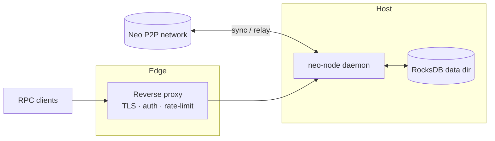
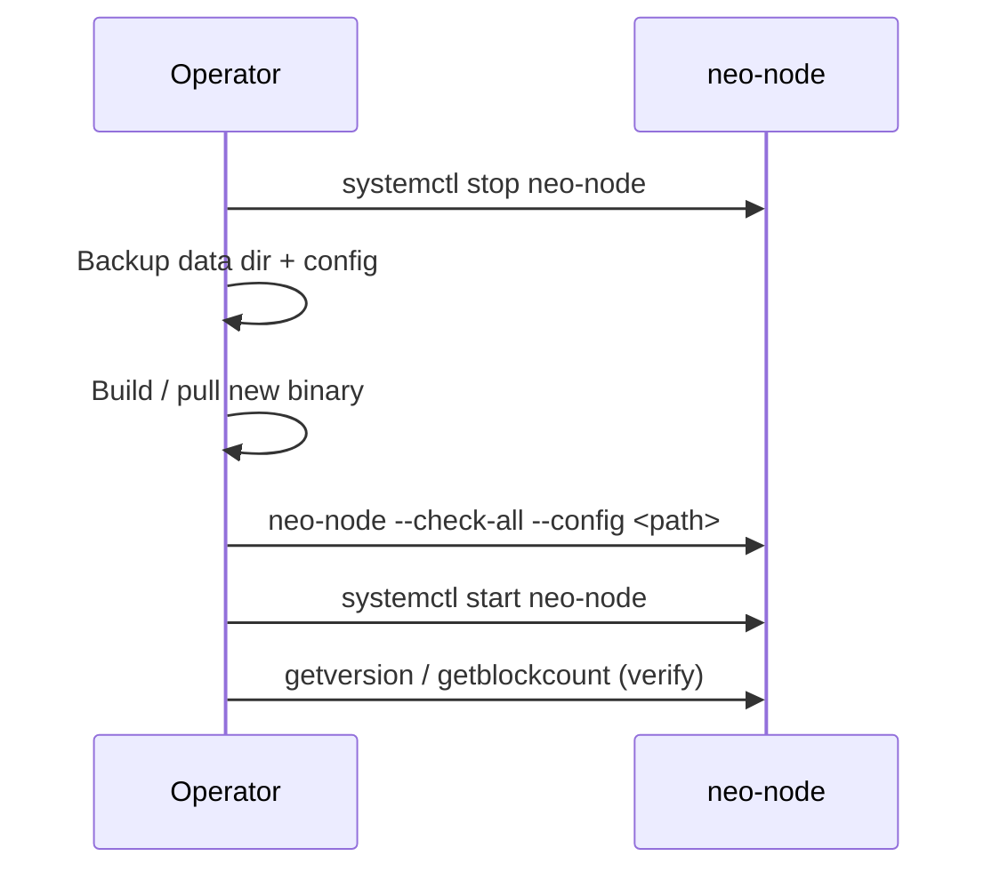

# Operations

Running `neo-rs` in production: deployment, storage, health checks, observability, security hardening, backups, and upgrades.

This guide covers the `neo-node` daemon — the full node behind the `wip` feature. It syncs blocks over P2P, validates the chain, and optionally serves a JSON-RPC API. Storage is RocksDB (default) with an in-memory fallback. Configuration is a single TOML file plus a few CLI flags.

---

## Deployment overview



The daemon binds RPC to loopback by default. Anything that must be reachable off-host should sit behind a reverse proxy that terminates TLS and enforces authentication and rate limits (see [Security hardening](#security-hardening)).

---

## Running the node

Build the daemon and run it against a config file (the full node is `neo-node`'s
default build; see [getting-started.md](./getting-started.md) for details):

```bash
cargo build --release -p neo-node

# MainNet
./target/release/neo-node --config neo_mainnet_node.toml

# TestNet, with an explicit data directory
./target/release/neo-node --config neo_testnet_node.toml --storage-path /var/neo/testnet
```

### CLI flags

The daemon accepts a small, fixed set of flags; everything else lives in TOML.

| Flag | Purpose |
|------|---------|
| `--config`, `-c <PATH>` | Path to the TOML node configuration file. |
| `--network-magic <U32>` | Override the network magic (must match the rest of the network). Wins over the config/preset. |
| `--storage-path <PATH>` | Override the persistent data directory. Implies the RocksDB backend regardless of `[storage].backend`. |
| `--check-config` | Validate configuration and exit without starting services. |
| `--check-storage` | Open the configured storage backend, confirm it is reachable/writable, and exit. |
| `--check-all` | Run both preflight checks and exit. |

Run preflight checks before any deploy or restart:

```bash
./target/release/neo-node --config /opt/neo/config.toml --check-all
```

### systemd (bare metal)

Run as a dedicated non-root user with restart-on-failure and a high file-descriptor limit (RocksDB and P2P need many descriptors).

```ini
# /etc/systemd/system/neo-node.service
[Unit]
Description=Neo N3 Rust Node
After=network-online.target
Wants=network-online.target

[Service]
Type=simple
User=neo
Group=neo
WorkingDirectory=/opt/neo
ExecStart=/opt/neo/neo-node --config /opt/neo/neo_mainnet_node.toml
Restart=always
RestartSec=5
LimitNOFILE=65535

# Hardening
NoNewPrivileges=true
ProtectSystem=strict
ProtectHome=true
ReadWritePaths=/var/neo /var/log/neo
Environment=RUST_LOG=info

[Install]
WantedBy=multi-user.target
```

```bash
sudo systemctl daemon-reload
sudo systemctl enable --now neo-node
journalctl -u neo-node -f
```

### Docker

A multi-stage `Dockerfile` builds the daemon (`cargo build --release -p neo-node`) onto a slim Debian runtime as a non-root `neo` user, and a `docker-compose.yml` is provided. The container exposes MainNet (`10332`/`10333`), TestNet (`20332`/`20333`), and private-net (`30332`/`30333`) ports and persists state under the `/data` volume.

The Rust workspace depends on the shared VM crate at `../neo-vm-rs`. Compose
passes that sibling checkout as a named build context; direct Docker builds need
the same context flag.

```bash
docker build --build-context neo-vm-rs=../neo-vm-rs -t neo-rs:latest .

# TestNet with persistent data
docker run -d --name neo-node \
  -p 20332:20332 -p 20333:20333 -p 19091:9091 \
  -v "$(pwd)/data:/data" \
  -e NEO_NETWORK=testnet \
  -e NEO_PROFILE=service \
  neo-rs:latest
```

The image entrypoint reads a few environment variables to select a bundled
config and wire paths. The RPC port the node actually serves still comes from
the TOML `[rpc]` section. `NEO_CONFIG` has highest priority; otherwise
`NEO_PROFILE=service` selects the bundled service-provider preset for the chosen
network.

| Variable | Purpose | Example |
|----------|---------|---------|
| `NEO_NETWORK` | Selects the bundled config (`mainnet` / `testnet`). | `mainnet` |
| `NEO_PROFILE` | Empty/`node` for the standard config, or `service` for `config/<network>-service.toml`. | `service` |
| `NEO_CONFIG` | Path to a custom TOML config (overrides `NEO_NETWORK`). | `/config/custom.toml` |
| `NEO_STORAGE` | RocksDB directory, passed as `--storage-path`. | `/data/mainnet` |
| `NEO_PLUGINS_DIR` | Plugin configuration directory. | `/data/Plugins` |
| `NEO_RPC_BIND_ADDRESS` | Runtime RPC bind address for bundled service profiles. | `0.0.0.0` |
| `NEO_METRICS_BIND_ADDRESS` | Runtime telemetry bind address for bundled service profiles. | `0.0.0.0` |
| `NEO_MAINNET_METRICS_PORT` / `NEO_TESTNET_METRICS_PORT` | Compose host ports for container telemetry ports `9090` / `9091`. | `19090` / `19091` |
| `NEO_LOGS_DIR` | Log directory created by the entrypoint. | `/data/Logs` |
| `NEO_RPC_PORT` | Port used by the container health check only. | `10332` |
| `BETTER_STACK_SOURCE_TOKEN` | Optional bearer token used by Better Stack log endpoints when referenced by `token_env`. | `source-token` |
| `GOOGLE_ERROR_REPORTING_TOKEN` | Optional Google Error Reporting bearer token when referenced by `token_env`. | `ya29...` |
| `SENTRY_AUTH_HEADER` | Optional full Sentry auth header value when referenced by `headers_env`. | `Sentry sentry_key=..., sentry_version=7` |
| `RUST_LOG` | Log directive. | `info,neo_p2p=debug` |

For bundled service profiles, the entrypoint writes a temporary config copy that
keeps the repository TOML safe for bare-metal loopback deployments while binding
RPC and telemetry to container-facing addresses. It also rewrites bundled
service data paths from `./data/<network>/...` to `NEO_STORAGE/...` and bundled
log files to `NEO_LOGS_DIR/...`, so the indexer, ApplicationLogs,
TokensTracker, StateService, and file logs stay inside the mounted volumes.
Explicit `NEO_CONFIG` files are not rewritten.

The container `HEALTHCHECK` issues a `getversion` JSON-RPC POST against the RPC port. Inspect it with:

```bash
docker inspect --format='{{.State.Health.Status}}' neo-node
```

> The `docker-compose.yml` includes an optional Grafana profile (`docker compose --profile monitoring up -d`). Grafana alone is only a dashboard surface; pair it with a scraper pointed at `[telemetry.metrics]` or with RPC-based probes — see [Observability](#observability).

---

## Configuration

`neo-node` reads a TOML file. Bundled samples: `neo_mainnet_node.toml`, `neo_testnet_node.toml`, `neo_production_node.toml`. The daemon consumes the sections below; unknown sections and keys are ignored.

| Section | Key keys | Notes |
|---------|----------|-------|
| `[network]` | `network_magic`, `network_type` | Selects the chain. `--network-magic` overrides. |
| `[storage]` | `backend`, `data_dir` / `path`, `read_only` | `backend = "rocksdb"` for persistence; anything else is in-memory. `--storage-path` overrides and forces RocksDB. `read_only = true` opens the primary store read-only for inspection, not for normal syncing. |
| `[p2p]` | `port`, `bind_address`, `seed_nodes`, `max_connections`, `min_desired_connections`, `max_connections_per_address` | `bind_address` defaults to `0.0.0.0`; `max_connections = -1` means unlimited (C# parity). |
| `[rpc]` | `enabled`, `port`, `bind_address`, `rpc_user`, `rpc_pass`, `disabled_methods`, limits | The daemon wires these into `neo-rpc` at startup. Built-in Basic auth protects HTTP RPC when credentials are configured; use a proxy for TLS and network-level policy. |
| `[consensus]` | `enabled`, `private_key_hex`, `hsm`, `auto_start` | Off by default; consensus participation starts when `enabled` or `auto_start` is true and requires validator key material. |
| `[blockchain]` | `block_time`, `max_transactions_per_block` | |
| `[mempool]` | `max_transactions` | |
| `[state_service]` | `enabled`, `full_state`, `path` | Enables the StateService MPT store used by state proofs and state-root RPC. |
| `[indexer]` | `enabled`, `store_path`, `backfill_on_startup` | Enables NeoIndexer RPC methods and durable read-side indexes. |
| `[application_logs]` | `enabled`, `path`, `debug`, `exception_policy` | Enables C# ApplicationLogs-compatible plugin storage. |
| `[tokens_tracker]` | `enabled`, `db_path`, `enabled_trackers` | Enables NEP-11/NEP-17 token tracker services. |
| `[telemetry.metrics]` | `enabled`, `port`, `bind_address`, `path` | Optional Prometheus-compatible text endpoint. |
| `[logging]` | `level`, `format`, `console_output`, `file_path`, `max_file_size`, `max_files` | Configures tracing filters, JSON/pretty formatting, stdout, optional file output, and size-based log rotation. |
| `[observability]` | `enabled`, `error_endpoints`, `heartbeat_endpoints` | Optional panic/startup-error reporting and external heartbeat pings. |

`RUST_LOG` overrides `[logging].level` when set, which is useful for temporary incident diagnostics.

Apply config changes by editing the TOML and restarting the service. For Docker, update the env vars or mounted TOML and run `docker compose up -d` to recreate the container.

For hosted RPC/indexer workloads, start from `config/mainnet-service.toml` or
`config/testnet-service.toml`. Those presets keep RPC on loopback, enable the
durable NeoIndexer/ApplicationLogs/TokensTracker/StateService stack, expose
local metrics and health endpoints, and leave observability destinations
commented until you provide real provider URLs or tokens.

---

## Data directory & storage sizing

RocksDB requires fast, durable, local storage. Avoid NAS for primary data, spinning disks (insufficient IOPS), and ephemeral/tmpfs volumes.

The exact on-disk size depends on the chain height at the time you sync and on whether you enable `[state_service]` (the state-root MPT trie adds a separate `StateRoot` directory). Size the volume with comfortable headroom and monitor free space; both MainNet and TestNet grow steadily with chain height.

Operational guarantees and markers the node enforces at the data directory:

- **Network marker** — a `NETWORK_MAGIC` file is written; use a distinct directory per network so you cannot mix MainNet and TestNet data.
- **Version marker** — a `VERSION` file is written; if it differs from the running binary, startup fails. Use a fresh path or migrate.
- **Fail-fast on RocksDB** — if RocksDB cannot be opened, the node aborts rather than silently falling back to memory. Check permissions and disk if startup fails.
- **State integrity guard** — startup validates persisted non-native contract state and aborts on malformed payloads or duplicate contract IDs. Restore from a known-good backup or resync from a clean directory if this triggers; do not keep restarting the same directory.

Keep at least 20% free space on the RocksDB volume and monitor inode usage.

---

## Health checks

Enable `[telemetry.metrics]` to expose lightweight HTTP health endpoints on the
same bind address as the metrics exporter:

| Endpoint | Healthy signal | Intended use |
|----------|----------------|--------------|
| `/healthz` | HTTP 200 with `{"status":"ok"}` | Process liveness checks and uptime monitors |
| `/readyz` | HTTP 200 when the local ledger pointer is readable; HTTP 503 while starting | Readiness checks for load balancers and orchestrators |

Keep JSON-RPC probes as the chain-readiness surface for public service quality:
they prove that the externally served RPC path answers and that height/peer
signals are acceptable.

```mermaid
flowchart TD
  H[/healthz] -->|HTTP 200| Live[Process is live]
  R[/readyz] -->|HTTP 200| Local[Local ledger readable]
  A[getversion] -->|HTTP 200 + result| Rpc[RPC is live]
  B[getblockcount] -->|height vs trusted seed| Synced{Height lag acceptable?}
  C[getconnectioncount] -->|peer count| Peers{Peers > 0?}
  Synced -->|yes| Ready[Ready to serve]
  Peers -->|sustained 0| Alert[Investigate networking]
```

```bash
# Liveness endpoint on the telemetry HTTP server
curl -sf http://127.0.0.1:9090/healthz

# Local readiness endpoint on the telemetry HTTP server
curl -sf http://127.0.0.1:9090/readyz

# Liveness + protocol identity
curl -sf --compressed -X POST http://127.0.0.1:10332 \
  -H 'Content-Type: application/json' \
  -d '{"jsonrpc":"2.0","id":1,"method":"getversion","params":[]}'

# Persisted block height (compare to a trusted seed/explorer for sync status)
curl -sf --compressed -X POST http://127.0.0.1:10332 \
  -H 'Content-Type: application/json' \
  -d '{"jsonrpc":"2.0","id":1,"method":"getblockcount","params":[]}'

# Connected peers (sustained zero warrants investigation)
curl -sf --compressed -X POST http://127.0.0.1:10332 \
  -H 'Content-Type: application/json' \
  -d '{"jsonrpc":"2.0","id":1,"method":"getconnectioncount","params":[]}'
```

Use `--compressed` so gzipped responses decode correctly when piping to `jq`.

| Probe | Source | Healthy signal |
|-------|--------|----------------|
| Process liveness | `/healthz` | HTTP 200 with `status = ok` |
| Local readiness | `/readyz` | HTTP 200 with `ready = true` |
| RPC liveness | `getversion` | HTTP 200 with a `result` object |
| Readiness / sync | `getblockcount` | Height tracks a trusted seed within a small lag |
| Connectivity | `getconnectioncount` | Non-zero, stable peer count |

---

## Observability

### Error reporting and heartbeats

The daemon can send outbound observability events when `[observability]` is
enabled. This is intentionally opt-in: default configs do not send any node data
to external services. If you only want heartbeat pings and no crash/error reporting, set
`capture_panics = false`; otherwise at least one error endpoint is required.

Use error endpoints for crash/startup diagnostics:

```toml
[observability]
enabled = true
service_name = "neo-node-mainnet"
environment = "production"
node_id = "validator-1"

[[observability.error_endpoints]]
kind = "google_error_reporting"
project_id = "my-gcp-project"
token_env = "GOOGLE_ERROR_REPORTING_TOKEN"

[[observability.error_endpoints]]
kind = "sentry"
url = "https://sentry.example.com/api/42/store/"

[observability.error_endpoints.headers_env]
X-Sentry-Auth = "SENTRY_AUTH_HEADER"

[[observability.error_endpoints]]
kind = "custom_json"
url = "https://errors.example.com/neo-node"
```

Supported error endpoint kinds:

| Kind | Behavior |
|------|----------|
| `custom_json` | POSTs a generic JSON event payload to `url`. Optional `token` / `token_env` becomes a bearer token. |
| `better_stack_logs` | POSTs a Better Stack-friendly JSON log event with top-level `message`, `dt`, `level`, service, network, and optional source location fields. Requires `token` or `token_env`. |
| `google_error_reporting` | POSTs a Google Error Reporting `projects.events.report` payload. Set `project_id` plus `token_env` for a Google OAuth bearer token, or provide a full `url` that carries its own API key/proxy authentication. |
| `sentry` | POSTs a Sentry event payload with Rust platform metadata, release, environment, service/network tags, and exception source location when available. Configure Sentry auth with `headers_env` such as `X-Sentry-Auth = "SENTRY_AUTH_HEADER"`, or use `token` / `token_env` when posting through a bearer-auth proxy. |

Prefer `token_env` over inline `token` values in production. Use `headers_env`
when a provider requires a non-bearer header secret such as Sentry's
`X-Sentry-Auth`. Custom `headers` and `headers_env` names must be syntactically
valid HTTP headers; if `token` or `token_env` is set, do not also configure an
`Authorization` header.

Google Error Reporting events include `eventTime`, `serviceContext`, and
`context.reportLocation`. Rust panics use the panic file/line; startup errors
fall back to a `neo-node` report location so the event is accepted and grouped.
Set `node_id` to populate Google `context.user` for per-node filtering.
Startup validation rejects `project_id`-only Google endpoints without
`token`/`token_env`, because those requests would fail once the node starts.
Sentry events include `release = "neo-node@<version>"`, `level = "fatal"` for
panics and `level = "error"` for other reports, plus service, network, and
event-type tags for project filtering.

Use heartbeat endpoints for uptime monitors such as Better Stack:

```toml
[observability]
enabled = true
capture_panics = false

[[observability.heartbeat_endpoints]]
name = "better-stack"
url = "https://uptime.betterstack.com/api/v1/heartbeat/your-heartbeat-id"
method = "GET"
interval_seconds = 60
```

When a heartbeat request repeatedly fails to arrive, configure the provider to
notify your team. Pair heartbeats with JSON-RPC health checks below: heartbeat
proves the daemon task loop is alive, while RPC checks prove chain-specific
readiness such as height and peer count. `GET` heartbeats are bodyless for
Better Stack-style URL pings; `POST` and `PUT` heartbeats send a JSON payload
with service metadata, ledger height, peer count, mempool counts, optional
service state, and NeoIndexer readiness/lag/sync for custom webhook monitors.

### Metrics

Enable the Prometheus-compatible text endpoint with `[telemetry.metrics]`.

```toml
[telemetry.metrics]
enabled = true
port = 9090
bind_address = "127.0.0.1"
path = "/metrics"
```

Scrape it with Prometheus, Grafana Agent, OpenTelemetry Collector, or another
compatible collector:

```bash
curl -sf http://127.0.0.1:9090/metrics | head
```

The telemetry server also exposes `/healthz` and `/readyz` for uptime monitors,
load balancers, and orchestrators. `/readyz` includes a `services` object with
state-service, indexer, application-log, and token-tracker registration state.
RPC clients can call `listservices` on the JSON-RPC endpoint for the same
operator-facing service inventory, including each optional method group, its
`enabled` / `ready` state, and NeoIndexer status counters.
The metrics endpoint itself includes `neo_node_up`, `neo_node_info`,
`neo_node_uptime_seconds`, `neo_node_ledger_height`,
`neo_node_connected_peers`, mempool counts, header-cache count,
`neo_node_service_enabled{service=...}`, NeoIndexer health and indexed-record
gauges, `neo_node_indexer_blocks_behind`, `neo_node_indexer_synced`, and any
process-wide Prometheus metrics already registered by RPC such as request and
error counters. Keep RPC health probes too: metrics show local process state,
while RPC probes prove the externally served JSON-RPC path answers correctly.

| Signal | Source | What to watch |
|--------|--------|---------------|
| Block height | `/metrics` `neo_node_ledger_height` and `getblockcount` | Lag vs. a trusted seed RPC/explorer |
| Peer count | `/metrics` `neo_node_connected_peers`, `getconnectioncount`, `getpeers` | Below-threshold or churning connections |
| Mempool | `/metrics` mempool gauges and `getrawmempool` | Size stuck at 0 or growing past a cap |
| Indexer | `/metrics` `neo_node_service_enabled{service="indexer"}`, `neo_node_indexer_up`, `neo_node_indexer_blocks_behind`, `neo_node_indexer_synced`, `listservices`, `getindexerstatus` | Disabled unexpectedly, status read failures, height lag |
| RocksDB disk | host filesystem agent | Free space, IOPS, latency on the data volume |
| Process | host agent (`node_exporter` / cAdvisor) | Memory, CPU, file descriptors vs. `nofile` limit |

Suggested alerts to start with:

| Alert | Condition |
|-------|-----------|
| Height lag | Local height behind a reference by more than N blocks for M minutes |
| Low peers | Peer count below threshold for M minutes |
| Mempool anomaly | Size stuck at 0 or exceeding a cap |
| Disk pressure | RocksDB volume free space < 20% or inode pressure |
| FD pressure | Process FD usage > 80% of `nofile`; repeated restarts |

For continuous correctness assurance, the repository ships state-root parity validators (`scripts/continuous-stateroot-validation.py` and `scripts/validate-stateroot-continuous.sh`) that compare each local `getstateroot` against official Neo seed RPCs and emit a JSON status file.

### Logging

Configure default logging in TOML:

```toml
[logging]
level = "info,neo=debug"
format = "json"
console_output = true
file_path = "./logs/neo-node-mainnet.log"
max_file_size = "100MB"
max_files = 10
```

`RUST_LOG` overrides the TOML level/filter directive at runtime:

```bash
RUST_LOG=info,neo_p2p=debug ./target/release/neo-node --config neo_mainnet_node.toml
```

When `max_file_size` is set, the daemon rotates `file_path` into numbered
archives and retains `max_files` generations. When `console_output = true`,
systemd and Docker receive logs through stdout/stderr. View and filter systemd
logs with `journalctl`:

```bash
journalctl -u neo-node -f
journalctl -u neo-node -p warning..alert --since "1 hour ago"
```

Ship logs to your stack and alert on errors, timeouts, and restarts.

---

## Security hardening

The daemon wires the `[rpc]` TOML section into the embedded `neo-rpc` server,
including Basic auth, CORS, disabled methods, and transport resource limits. It
still serves plaintext HTTP/WS and does not provide in-process TLS termination,
so put RPC behind a reverse proxy (Nginx/Caddy/Envoy) for any non-loopback
exposure.

### Server-enforced RPC limits

The jsonrpsee server applies these transport-layer limits natively from
`neo-rpc`'s `RpcServerConfig`. Defaults reflect C# parity; keys present in the
node TOML override those defaults before the daemon starts the server.

| Limit | Config key | Default | Behavior |
|-------|------------|---------|----------|
| HTTP request body size | `max_request_body_size` | 5 MiB | Caps inbound request body. |
| Concurrent connections | `max_concurrent_connections` | 100 | Caps simultaneous connections. |
| Batch length | `max_batch_size` | 1024 | Caps JSON-RPC batch size; `0` disables batching. |
| RPC method rate | `max_requests_per_second` / `rate_limit_burst` | 100 / 200 | Enforced in-process as a process-wide per-method fallback. |
| WS keep-alive | `keep_alive_timeout` | 60s | Drives WS keep-alive pings; a negative value disables idle reaping. |
| Header read timeout | `request_headers_timeout` | 15s | Reaps connections that stall sending headers. |

### Enforced at the proxy

| Control | Why at the proxy |
|---------|------------------|
| TLS termination | The daemon serves plaintext HTTP/WS. |
| Authentication | Built-in HTTP Basic auth is enforced when `rpc_user`/`rpc_pass` are configured; terminate TLS at a proxy before exposing it off-host. |
| Per-IP rate limiting | The built-in limiter protects the process but cannot key by client IP under the current jsonrpsee transport setup. |
| CORS policy | Built-in CORS headers and preflight responses follow `enable_cors` / `allow_origins`; use the proxy for organization-wide edge policy. |
| Method allowlisting / IP restriction | Restrict to the methods/clients you intend to expose. |

### Hardening checklist

| ✓ | Item |
|---|------|
| ☐ | Bind RPC to loopback (`bind_address = "127.0.0.1"`) and front it with a reverse proxy if it must be reachable off-host. |
| ☐ | Terminate TLS at the proxy or a tunnel. |
| ☐ | Configure `rpc_user`/`rpc_pass` or enforce stronger authentication at the proxy; keep method allowlists and per-client/IP rate limits at the edge for public deployments. |
| ☐ | Do not expose wallet-mutating methods (`openwallet`, `sendfrom`, `sendmany`, `sendtoaddress`, `importprivkey`, `dumpprivkey`) on untrusted networks. |
| ☐ | Run the node as a dedicated non-root user. |
| ☐ | Restrict P2P and RPC ports at the host/cloud firewall; limit connections per IP (`max_connections_per_address`). |
| ☐ | Set `LimitNOFILE=65535` (or equivalent) so RocksDB and P2P have enough descriptors. |
| ☐ | Configure log shipping and rotation; alert on errors and restarts. |
| ☐ | Configure automated backups and test restores. |

> `NEO_NATIVE_STRICT_SECURITY=1` enables extra native-contract guard checks for hardening experiments. Do **not** enable it on production consensus nodes without validating full chain parity for your exact network and dataset — it can diverge from reference behavior.

---

## Backups

RocksDB is the source of truth. For a consistent snapshot, stop the service, archive the data directory, and restart.

```bash
sudo systemctl stop neo-node
sudo tar czf /backups/neo-$(date +%F).tgz /var/neo/mainnet
sudo systemctl start neo-node
```

Helper scripts in `scripts/` automate this:

| Script | Purpose |
|--------|---------|
| `scripts/backup-rocksdb.sh <rocksdb_path> [backup_dir]` | One-shot archive of the RocksDB directory (also via `make backup-rocksdb`). |
| `scripts/checkpoint-live-rocksdb.sh <writer_pid> <rocksdb_path> [root]` | Live checkpoint with a short pause, then resume. |
| `scripts/checkpoint-live-rocksdb-loop.sh <writer_pid> <rocksdb_path> [interval] [max] [root]` | Periodic live checkpoints with rotation (default interval 1800s, retention 8). |

To restore: stop the service, extract the archive into the configured storage path, fix ownership for the `neo` user, then start the service. Keep backups on storage separate from the live volume, and wire backup/restore failures into your alerting so you know when data protection is stale.

---

## Upgrades



1. **Back up** the data directory and config (see [Backups](#backups)).
2. **Deploy** the new binary (or rebuild the Docker image).
3. **Preflight**: `neo-node --check-all --config <path>` to catch config/storage issues without starting.
4. **Start** and watch logs during catch-up; confirm `getversion` responds and that `getblockcount` tracks a trusted seed.

### Resync after correctness-affecting upgrades

Some upgrades change how state is computed. If you previously ran a build with a known state-computation bug, the local DB may hold divergent state that newer builds will not silently reconcile. **Resync from a clean data directory or a trusted snapshot** if any of these applied to your prior build:

- Unexpected transaction `FAULT`s versus TestNet/MainNet reference (e.g., before strict prefix-bound `DataCache.find`).
- `unclaimedGas` returning `0` in live transfer paths (reverse-prefix iteration that missed NeoToken GAS-per-block records).
- Contract-originated native transfers (e.g., GAS `transfer`) returning `false` unexpectedly (caller-hash resolution fix).
- Repeated block-persistence failures such as `GasToken burn failed ... Insufficient balance for burn` on canonical blocks — treat this as divergent local state, not a recoverable network error.

For breaking schema changes, check the changelog; you may need to resync from genesis or a bootstrap snapshot.

---

## Incident response

| Symptom | First actions |
|---------|---------------|
| Out of sync / zero peers | Restart; verify P2P port reachability, network magic, and seed list. If the DB is corrupt, restore from backup and resync. |
| Startup aborts (integrity / version / network marker) | Do not loop-restart the same directory. Move it aside, restore a backup, or resync from a clean path. |
| RPC overloaded | Front the node with a rate-limiting reverse proxy; consider moving RPC to a dedicated instance. |
| Disk full | Expand the volume, prune old backups/logs, keep RocksDB on fast durable storage. |
| Persistent block-persist failures on canonical blocks | Treat as divergent state; resync from a clean directory or trusted snapshot. |
