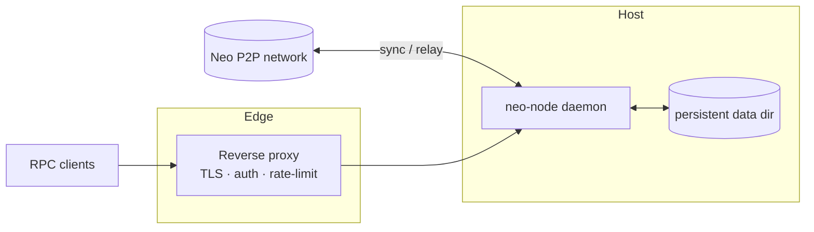
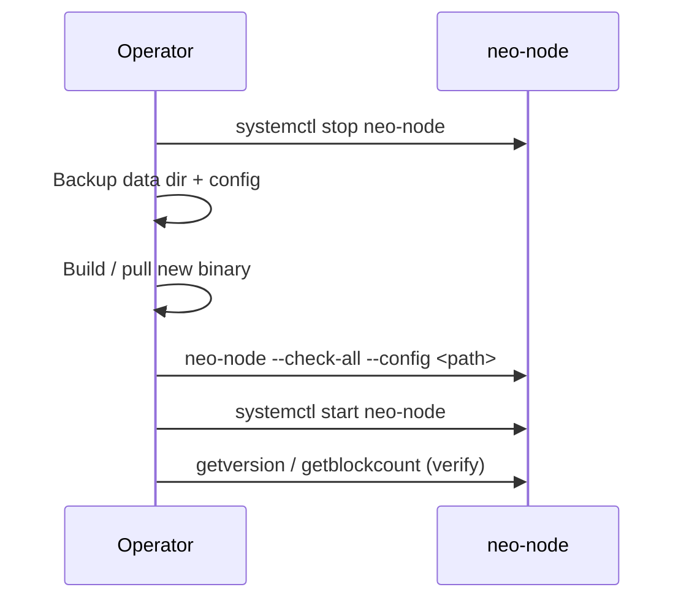

# Operations

Running `neo-rs` in production: deployment, storage, health checks, observability, security hardening, backups, and upgrades.

This guide covers the `neo-node` daemon — the full node behind the `wip` feature. It syncs blocks over P2P, validates the chain, and optionally serves a JSON-RPC API. Storage is MDBX by default, with RocksDB available as an explicit fallback/test backend and in-memory storage for ephemeral runs. Configuration is a single TOML file plus a few CLI flags.

---

## Deployment overview



The daemon binds RPC to loopback by default. Anything that must be reachable off-host should sit behind a reverse proxy that terminates TLS and enforces authentication and rate limits (see [Security hardening](#security-hardening)).

---

## Running the node

Build the daemon and run it against a config file (the full node is `neo-node`'s
default build; see [getting-started.md](./getting-started.md) for details):

```bash
cargo build --release -p neo-node

# MainNet
./target/release/neo-node --config neo_mainnet_node.toml

# TestNet, with an explicit data directory
./target/release/neo-node --config neo_testnet_node.toml --storage-path /var/neo/testnet
```

### CLI flags

The daemon accepts a small, fixed set of flags; everything else lives in TOML.

| Flag | Purpose |
|------|---------|
| `--config`, `-c <PATH>` | Path to the TOML node configuration file. |
| `--network-magic <U32>` | Override the network magic (must match the rest of the network). Wins over the config/preset. |
| `--storage-path <PATH>` | Override the persistent data directory for the configured/default backend. |
| `--check-config` | Validate configuration and exit without starting services. |
| `--check-storage` | Open the configured storage backend, confirm it is reachable/writable, and exit. |
| `--check-all` | Run both preflight checks and exit. |
| `--import-chain <PATH>` | Import a local `chain.acc` dump before live P2P sync. |
| `--fast-sync` | Download, validate, cache, and import the built-in official fast-sync package before live P2P sync. |
| `--fast-sync-cache <PATH>` | Override the fast-sync package cache directory. Requires `--fast-sync`. |
| `--stop-at-height <HEIGHT>` | Stop gracefully after the persisted local ledger reaches the target height. |
| `--remote-ledger-rpc <URL>` | Run without a local canonical ledger and delegate ledger/state/indexer RPC reads plus relay, wallet transaction, and oracle submission RPC calls to the upstream JSON-RPC endpoint. Cannot be combined with `--import-chain` or `--fast-sync`. |

Run preflight checks before any deploy or restart:

```bash
./target/release/neo-node --config /opt/neo/config.toml --check-all
```

### Fast sync

`--fast-sync` is the built-in bootstrap path for operators who want a local
ledger but do not want to replay from genesis over P2P. The daemon resolves the
official fast-sync manifest, downloads the package when it is not already cached,
checks the package MD5, extracts the included `chain*.acc` file, imports it, then
checks that the durable local ledger tip matches the final imported block, and
restores durable backend write settings before continuing with live network sync.
The in-progress marker is removed only after that local tip proof succeeds; if
the marker remains, restore a checkpoint or remove the local ledger before
retrying the import.

```bash
./target/release/neo-node \
  --config neo_mainnet_node.toml \
  --storage-path /var/neo/mainnet \
  --fast-sync
```

Use `--fast-sync-cache /path/to/cache` when the package cache must live outside
the main storage path.

For bounded validation of the built-in package path, run the bounded replay
wrapper with `--fast-sync` instead of validating only an already extracted
`chain.acc` file:

```bash
python3 scripts/run-bounded-mainnet-replay.py \
  --config data/mainnet-stateroot-clean/neo_mainnet_validate.toml \
  --node-bin target/release/neo-node \
  --target-height 100000 \
  --fast-sync \
  --fast-sync-cache data/mainnet-stateroot-clean/fast-sync-cache \
  --initial-height 0 \
  --db data/mainnet-stateroot-clean/mainnet \
  --stateroot-db data/mainnet-stateroot-clean/StateRoot_334F454E \
  --require-stateroot-height-match \
  --require-reference-stateroot-match \
  --sync-speed-floor-bps 1500 \
  --sync-speed-ceiling-bps 2000
```

When the imported package already satisfies `--stop-at-height`, `neo-node` can
shut down before RPC and telemetry are started. Treat that as expected for this
bounded proof: rely on the post-run `--db` / `--stateroot-db` probes, reference
`getstateroot` comparison, and `--initial-height` throughput math. Metrics can
still be sampled when available, but do not require metrics samples for this
fast-sync stop-height proof.

### RPC-backed ledger mode

`--remote-ledger-rpc <URL>` starts `neo-node` without opening or creating the
configured local chain store directory. The node keeps only an ephemeral memory
context for internal handles, disables replay-derived local services
(StateService, NeoIndexer, ApplicationLogs, TokensTracker), and delegates
ledger/state/indexer read RPC methods, service/plugin inventory, plus
relay-style methods such as `sendrawtransaction`, `submitblock`, wallet
transaction builders, and `submitoracleresponse` to the upstream JSON-RPC
endpoint.

```bash
./target/release/neo-node \
  --config neo_mainnet_node.toml \
  --remote-ledger-rpc https://seed1.neo.org:10332
```

Process-local RPC methods such as `getpeers`, wallet open/import/list
operations, and address validation remain local because they describe this
process. `getversion` also keeps this node's identity fields local, but its
dynamic protocol policy values are read from the upstream `getversion` response
so they do not come from the ephemeral local context. In this mode seed dialing
and inbound P2P inventory replay are disabled so the node does not silently
build a local canonical chain in memory. The P2P listener can still serve
remote-backed block/header requests when enabled.

Do not use this mode as a validator or as an independently verifying node. It is
an upstream-backed RPC/P2P facade for deployments that intentionally do not keep
a local ledger.

### systemd (bare metal)

Run as a dedicated non-root user with restart-on-failure and a high file-descriptor limit (storage backends and P2P need many descriptors).

```ini
# /etc/systemd/system/neo-node.service
[Unit]
Description=Neo N3 Rust Node
After=network-online.target
Wants=network-online.target

[Service]
Type=simple
User=neo
Group=neo
WorkingDirectory=/opt/neo
ExecStart=/opt/neo/neo-node --config /opt/neo/neo_mainnet_node.toml
Restart=always
RestartSec=5
LimitNOFILE=65535

# Hardening
NoNewPrivileges=true
ProtectSystem=strict
ProtectHome=true
ReadWritePaths=/var/neo /var/log/neo
Environment=RUST_LOG=info

[Install]
WantedBy=multi-user.target
```

```bash
sudo systemctl daemon-reload
sudo systemctl enable --now neo-node
journalctl -u neo-node -f
```

### Docker

A multi-stage `Dockerfile` builds the daemon (`cargo build --release -p neo-node`) onto a slim Debian runtime as a non-root `neo` user, and a `docker-compose.yml` is provided. The container exposes MainNet (`10332`/`10333`), TestNet (`20332`/`20333`), and private-net (`30332`/`30333`) ports and persists state under the `/data` volume.

The Rust workspace depends on the shared VM crate at `../neo-vm-rs`. Compose
passes that sibling checkout as a named build context; direct Docker builds need
the same context flag.

```bash
docker build --build-context neo-vm-rs=../neo-vm-rs -t neo-rs:latest .

# TestNet with persistent data
docker run -d --name neo-node \
  -p 20332:20332 -p 20333:20333 -p 19091:9091 \
  -v "$(pwd)/data:/data" \
  -e NEO_NETWORK=testnet \
  -e NEO_PROFILE=service \
  neo-rs:latest
```

The image entrypoint reads a few environment variables to select a bundled
config and wire paths. The RPC port the node actually serves still comes from
the TOML `[rpc]` section. `NEO_CONFIG` has highest priority; otherwise
`NEO_PROFILE=service` selects the bundled service-provider preset for the chosen
network.

| Variable | Purpose | Example |
|----------|---------|---------|
| `NEO_NETWORK` | Selects the bundled config (`mainnet` / `testnet`). | `mainnet` |
| `NEO_PROFILE` | Empty/`node` for the standard config, or `service` for `config/<network>-service.toml`. | `service` |
| `NEO_CONFIG` | Path to a custom TOML config (overrides `NEO_NETWORK`). | `/config/custom.toml` |
| `NEO_STORAGE` | Persistent storage directory, passed as `--storage-path`. | `/data/mainnet` |
| `NEO_PLUGINS_DIR` | Plugin configuration directory. | `/data/Plugins` |
| `NEO_RPC_BIND_ADDRESS` | Runtime RPC bind address for bundled service profiles. | `0.0.0.0` |
| `NEO_METRICS_BIND_ADDRESS` | Runtime telemetry bind address for bundled service profiles. | `0.0.0.0` |
| `NEO_MAINNET_METRICS_PORT` / `NEO_TESTNET_METRICS_PORT` | Compose host ports for container telemetry ports `9090` / `9091`. | `19090` / `19091` |
| `NEO_LOGS_DIR` | Log directory created by the entrypoint. | `/data/Logs` |
| `NEO_RPC_PORT` | Port used by the container health check only. | `10332` |
| `BETTER_STACK_SOURCE_TOKEN` | Optional bearer token used by Better Stack log endpoints when referenced by `token_env`. | `source-token` |
| `GOOGLE_ERROR_REPORTING_TOKEN` | Optional Google Error Reporting bearer token when referenced by `token_env`. | `ya29...` |
| `SENTRY_AUTH_HEADER` | Optional full Sentry auth header value when referenced by `headers_env`. | `Sentry sentry_key=..., sentry_version=7` |
| `RUST_LOG` | Log directive. | `info,neo_p2p=debug` |

For bundled service profiles, the entrypoint writes a temporary config copy that
keeps the repository TOML safe for bare-metal loopback deployments while binding
RPC and telemetry to container-facing addresses. It also rewrites bundled
service data paths from `./data/<network>/...` to `NEO_STORAGE/...` and bundled
log files to `NEO_LOGS_DIR/...`, so the indexer, ApplicationLogs,
TokensTracker, StateService, and file logs stay inside the mounted volumes.
Explicit `NEO_CONFIG` files are not rewritten.

The container `HEALTHCHECK` issues a `getversion` JSON-RPC POST against the RPC port. Inspect it with:

```bash
docker inspect --format='{{.State.Health.Status}}' neo-node
```

> The `docker-compose.yml` includes an optional Grafana profile (`docker compose --profile monitoring up -d`). Grafana alone is only a dashboard surface; pair it with a scraper pointed at `[telemetry.metrics]` or with RPC-based probes — see [Observability](#observability).

---

## Configuration

`neo-node` reads a TOML file. Bundled samples: `neo_mainnet_node.toml`, `neo_testnet_node.toml`, `neo_production_node.toml`. The daemon consumes the sections below; unknown sections and keys are ignored.

| Section | Key keys | Notes |
|---------|----------|-------|
| `[network]` | `network_magic`, `network_type` | Selects the chain. `--network-magic` overrides. |
| `[storage]` | `backend`, `data_dir` / `path`, `read_only` | `backend = "mdbx"` is the production persistent default; `rocksdb` remains an explicit fallback/test backend; `memory` is ephemeral. `--storage-path` overrides the directory without changing the backend. `read_only = true` opens the primary store read-only for inspection, not for normal syncing. |
| `[p2p]` | `port`, `bind_address`, `seed_nodes`, `max_connections`, `min_desired_connections`, `max_connections_per_address` | `bind_address` defaults to `0.0.0.0`; `max_connections = -1` means unlimited (C# parity). |
| `[rpc]` | `enabled`, `port`, `bind_address`, `rpc_user`, `rpc_pass`, `disabled_methods`, limits | The daemon wires these into `neo-rpc` at startup. Built-in Basic auth protects HTTP RPC when credentials are configured; use a proxy for TLS and network-level policy. |
| `[consensus]` | `enabled`, `private_key_hex`, `hsm`, `auto_start` | Off by default; consensus participation starts when `enabled` or `auto_start` is true and requires validator key material. |
| `[blockchain]` | `block_time`, `max_transactions_per_block` | |
| `[mempool]` | `max_transactions` | |
| `[state_service]` | `enabled`, `full_state`, `path` | Enables the StateService MPT store used by state proofs and state-root RPC. |
| `[indexer]` | `enabled`, `store_path`, `backfill_on_startup` | Enables NeoIndexer RPC methods and durable read-side indexes. |
| `[application_logs]` | `enabled`, `path`, `debug`, `exception_policy` | Enables C# ApplicationLogs-compatible plugin storage. |
| `[tokens_tracker]` | `enabled`, `db_path`, `enabled_trackers` | Enables NEP-11/NEP-17 token tracker services. |
| `[telemetry.metrics]` | `enabled`, `port`, `bind_address`, `path` | Optional Prometheus-compatible text endpoint. |
| `[logging]` | `level`, `format`, `console_output`, `file_path`, `max_file_size`, `max_files` | Configures tracing filters, JSON/pretty formatting, stdout, optional file output, and size-based log rotation. |
| `[observability]` | `enabled`, `error_endpoints`, `heartbeat_endpoints` | Optional panic/startup-error reporting and external heartbeat pings. |

`RUST_LOG` overrides `[logging].level` when set, which is useful for temporary incident diagnostics.

Apply config changes by editing the TOML and restarting the service. For Docker, update the env vars or mounted TOML and run `docker compose up -d` to recreate the container.

For hosted RPC/indexer workloads, start from `config/mainnet-service.toml` or
`config/testnet-service.toml`. Those presets keep RPC on loopback, enable the
durable NeoIndexer/ApplicationLogs/TokensTracker/StateService stack, expose
local metrics and health endpoints, and leave observability destinations
commented until you provide real provider URLs or tokens. During cold catch-up,
the daemon keeps the expensive NeoIndexer worker deferred for sync throughput
and automatically starts it once the durable chain height is near the peer tip,
so service-provider nodes do not need a manual restart after initial sync.

---

## Data directory & storage sizing

Persistent node storage requires fast, durable, local storage. Avoid NAS for primary data, spinning disks (insufficient IOPS), and ephemeral/tmpfs volumes.

The exact on-disk size depends on the chain height at the time you sync and on whether you enable `[state_service]` (the state-root MPT trie adds a separate `StateRoot` directory). Size the volume with comfortable headroom and monitor free space; both MainNet and TestNet grow steadily with chain height.

Operational guarantees and markers the node enforces at the data directory:

- **Network marker** — a `NETWORK_MAGIC` file is written; use a distinct directory per network so you cannot mix MainNet and TestNet data.
- **Version marker** — a `VERSION` file is written; if it differs from the running binary, startup fails. Use a fresh path or migrate.
- **Fail-fast on persistent storage** — if the configured persistent backend cannot be opened, the node aborts rather than silently falling back to memory. Check permissions and disk if startup fails.
- **State integrity guard** — startup validates persisted non-native contract state and aborts on malformed payloads or duplicate contract IDs. Restore from a known-good backup or resync from a clean directory if this triggers; do not keep restarting the same directory.

Keep at least 20% free space on the storage volume and monitor inode usage.

---

## Health checks

Enable `[telemetry.metrics]` to expose lightweight HTTP health endpoints on the
same bind address as the metrics exporter:

| Endpoint | Healthy signal | Intended use |
|----------|----------------|--------------|
| `/healthz` | HTTP 200 with `{"status":"ok"}` | Process liveness checks and uptime monitors |
| `/readyz` | HTTP 200 when the local ledger pointer is readable; HTTP 503 while starting | Readiness checks for load balancers and orchestrators |

Keep JSON-RPC probes as the chain-readiness surface for public service quality:
they prove that the externally served RPC path answers and that height/peer
signals are acceptable.

```mermaid
flowchart TD
  H[/healthz] -->|HTTP 200| Live[Process is live]
  R[/readyz] -->|HTTP 200| Local[Local ledger readable]
  A[getversion] -->|HTTP 200 + result| Rpc[RPC is live]
  B[getblockcount] -->|height vs trusted seed| Synced{Height lag acceptable?}
  C[getconnectioncount] -->|peer count| Peers{Peers > 0?}
  Synced -->|yes| Ready[Ready to serve]
  Peers -->|sustained 0| Alert[Investigate networking]
```

```bash
# Liveness endpoint on the telemetry HTTP server
curl -sf http://127.0.0.1:9090/healthz

# Local readiness endpoint on the telemetry HTTP server
curl -sf http://127.0.0.1:9090/readyz

# Liveness + protocol identity
curl -sf --compressed -X POST http://127.0.0.1:10332 \
  -H 'Content-Type: application/json' \
  -d '{"jsonrpc":"2.0","id":1,"method":"getversion","params":[]}'

# Persisted block height (compare to a trusted seed/explorer for sync status)
curl -sf --compressed -X POST http://127.0.0.1:10332 \
  -H 'Content-Type: application/json' \
  -d '{"jsonrpc":"2.0","id":1,"method":"getblockcount","params":[]}'

# Connected peers (sustained zero warrants investigation)
curl -sf --compressed -X POST http://127.0.0.1:10332 \
  -H 'Content-Type: application/json' \
  -d '{"jsonrpc":"2.0","id":1,"method":"getconnectioncount","params":[]}'
```

Use `--compressed` so gzipped responses decode correctly when piping to `jq`.

| Probe | Source | Healthy signal |
|-------|--------|----------------|
| Process liveness | `/healthz` | HTTP 200 with `status = ok` |
| Local readiness | `/readyz` | HTTP 200 with `ready = true` |
| RPC liveness | `getversion` | HTTP 200 with a `result` object |
| Readiness / sync | `getblockcount` | Height tracks a trusted seed within a small lag |
| Connectivity | `getconnectioncount` | Non-zero, stable peer count |

---

## Observability

### Error reporting and heartbeats

The daemon can send outbound observability events when `[observability]` is
enabled. This is intentionally opt-in: default configs do not send any node data
to external services. If you only want heartbeat pings and no crash/error reporting, set
`capture_panics = false`; otherwise at least one error endpoint is required.

Use error endpoints for crash/startup diagnostics:

```toml
[observability]
enabled = true
service_name = "neo-node-mainnet"
environment = "production"
node_id = "validator-1"

[[observability.error_endpoints]]
kind = "google_error_reporting"
project_id = "my-gcp-project"
token_env = "GOOGLE_ERROR_REPORTING_TOKEN"

[[observability.error_endpoints]]
kind = "sentry"
url = "https://sentry.example.com/api/42/store/"

[observability.error_endpoints.headers_env]
X-Sentry-Auth = "SENTRY_AUTH_HEADER"

[[observability.error_endpoints]]
kind = "custom_json"
url = "https://errors.example.com/neo-node"
```

Delivery is best-effort but resilient: each report is retried with exponential
backoff so a transient network blip does not silently drop a crash. Tune this
with `request_timeout_ms` (per-attempt HTTP timeout, default `5000`),
`max_send_attempts` (total attempts per endpoint, default `3`, must be `>= 1`),
and `retry_backoff_ms` (base backoff that doubles each retry, capped at 30s,
default `250`).

Supported error endpoint kinds:

| Kind | Behavior |
|------|----------|
| `custom_json` | POSTs a generic JSON event payload to `url`. Optional `token` / `token_env` becomes a bearer token. |
| `better_stack_logs` | POSTs a Better Stack-friendly JSON log event with top-level `message`, `dt`, `level`, service, network, and optional source location fields. Requires `token` or `token_env`. |
| `google_error_reporting` | POSTs a Google Error Reporting `projects.events.report` payload. Set `project_id` plus `token_env` for a Google OAuth bearer token, or provide a full `url` that carries its own API key/proxy authentication. |
| `sentry` | POSTs a Sentry event payload with Rust platform metadata, release, environment, service/network tags, and exception source location when available. Configure Sentry auth with `headers_env` such as `X-Sentry-Auth = "SENTRY_AUTH_HEADER"`, or use `token` / `token_env` when posting through a bearer-auth proxy. |

Prefer `token_env` over inline `token` values in production. Use `headers_env`
when a provider requires a non-bearer header secret such as Sentry's
`X-Sentry-Auth`. Custom `headers` and `headers_env` names must be syntactically
valid HTTP headers; if `token` or `token_env` is set, do not also configure an
`Authorization` header.

Google Error Reporting events include `eventTime`, `serviceContext`, and
`context.reportLocation`. Rust panics use the panic file/line; startup errors
fall back to a `neo-node` report location so the event is accepted and grouped.
Set `node_id` to populate Google `context.user` for per-node filtering.
Startup validation rejects `project_id`-only Google endpoints without
`token`/`token_env`, because those requests would fail once the node starts.
Sentry events include `release = "neo-node@<version>"`, `level = "fatal"` for
panics and `level = "error"` for other reports, plus service, network, and
event-type tags for project filtering.

Use heartbeat endpoints for uptime monitors such as Better Stack:

```toml
[observability]
enabled = true
capture_panics = false

[[observability.heartbeat_endpoints]]
name = "better-stack"
url = "https://uptime.betterstack.com/api/v1/heartbeat/your-heartbeat-id"
method = "GET"
interval_seconds = 60
```

When a heartbeat request repeatedly fails to arrive, configure the provider to
notify your team. Pair heartbeats with JSON-RPC health checks below: heartbeat
proves the daemon task loop is alive, while RPC checks prove chain-specific
readiness such as height and peer count. `GET` heartbeats are bodyless for
Better Stack-style URL pings; `POST` and `PUT` heartbeats send a JSON payload
with service metadata, ledger height, peer count, mempool counts, optional
service state, and NeoIndexer readiness/lag/sync for custom webhook monitors.

### Metrics

Enable the Prometheus-compatible text endpoint with `[telemetry.metrics]`.

```toml
[telemetry.metrics]
enabled = true
port = 9090
bind_address = "127.0.0.1"
path = "/metrics"
```

Scrape it with Prometheus, Grafana Agent, OpenTelemetry Collector, or another
compatible collector:

```bash
curl -sf http://127.0.0.1:9090/metrics | head
```

The telemetry server also exposes `/healthz` and `/readyz` for uptime monitors,
load balancers, and orchestrators. `/readyz` includes a `services` object with
state-service, indexer, application-log, and token-tracker registration state.
RPC clients can call `listservices` on the JSON-RPC endpoint for the same
operator-facing service inventory, including each optional method group, its
`enabled` / `ready` state, and NeoIndexer status counters.
The metrics endpoint itself includes `neo_node_up`, `neo_node_info`,
`neo_node_uptime_seconds`, `neo_node_ledger_height`,
`neo_node_connected_peers`, mempool counts, header-cache count,
`neo_node_service_enabled{service=...}`, NeoIndexer health and indexed-record
gauges, `neo_node_indexer_blocks_behind`, `neo_node_indexer_synced`, and any
process-wide Prometheus metrics already registered by RPC such as request and
error counters. Keep RPC health probes too: metrics show local process state,
while RPC probes prove the externally served JSON-RPC path answers correctly.
During long sync or state-root replay, also watch the built-in sync pipeline
metrics: `neo_sync_avg_verify_us`, `neo_sync_avg_persist_us`,
`neo_sync_avg_commit_us`, the native-persistence substage gauges
`neo_sync_native_persist_avg_onpersist_us`,
`neo_sync_native_persist_avg_tx_us`,
`neo_sync_native_persist_avg_postpersist_us`,
`neo_sync_native_persist_avg_cache_commit_us`, the per-contract native hook
series `neo_sync_native_contract_hook_avg_us{trigger=...,contract=...,id=...}`,
the NeoToken refresh breakdown
`neo_sync_neotoken_onpersist_stage_avg_us{stage=...}`,
the committee recompute internals
`neo_sync_neotoken_committee_compute_stage_avg_us{stage=...}` and
`neo_sync_neotoken_committee_candidate_scan_avg_items{kind=...}`,
and the StateService MPT apply gauges `neo_state_service_mpt_apply_avg_total_us`,
`neo_state_service_mpt_apply_avg_project_us`,
`neo_state_service_mpt_apply_avg_trie_us`, and
`neo_state_service_mpt_apply_avg_changes`. When StateService MPT is material,
split the apply bucket with
`neo_state_service_mpt_apply_stage_avg_us{stage=...}` and
`neo_state_service_mpt_apply_avg_items{kind=...}`. These are EWMA values updated
from the block hot path, so they are lightweight enough to leave enabled and
useful for deciding whether a throughput drop is witness verification, native
persistence OnPersist/transaction/PostPersist work, backend commit, StateService
MPT projection/write pressure, or MPT trie internals. The StateService stage
labels are `mutate_changes`, `root_hash`, `trie_commit`, `overlay_prepare`,
`backing_commit`, and `publish_generation`; count labels are `changes`,
`overlay_entries`, `overlay_puts`, and `overlay_deletes`. When OnPersist or
PostPersist is dominant, split by the native hook labels first; on MainNet this
quickly shows whether the pressure is in ContractManagement
initialization/manifest refresh, GAS fee accounting, NEO committee/reward
maintenance, or another native. If `NeoToken` dominates `OnPersist`, split again
by the NeoToken stage labels:
`read_cached_committee`, `compute_committee`, `write_committee`,
`compare_committee`, `notify_committee_changed`, `refresh_total`, and `skip`.
If `compute_committee` dominates, use the committee-compute labels
`read_voters_count`, `standby_lookup`, `candidate_scan_total`,
`candidate_blocked_prefetch`, `candidate_pubkey_decode`,
`candidate_state_decode`, `candidate_blocked_lookup`, and
`top_candidate_maintenance`, plus the scan count labels `storage_entries`,
`malformed_keys`, `decoded_entries`, `registered_entries`,
`blocked_registered`, `eligible_candidates`, and `top_candidates`.

| Signal | Source | What to watch |
|--------|--------|---------------|
| Block height | `/metrics` `neo_node_ledger_height` and `getblockcount` | Lag vs. a trusted seed RPC/explorer |
| Peer count | `/metrics` `neo_node_connected_peers`, `getconnectioncount`, `getpeers` | Below-threshold or churning connections |
| Mempool | `/metrics` mempool gauges and `getrawmempool` | Size stuck at 0 or growing past a cap |
| Indexer | `/metrics` `neo_node_service_enabled{service="indexer"}`, `neo_node_indexer_up`, `neo_node_indexer_blocks_behind`, `neo_node_indexer_synced`, `listservices`, `getindexerstatus` | Disabled unexpectedly, status read failures, height lag |
| Native hooks | `/metrics` `neo_sync_native_contract_hook_*{trigger=...,contract=...}` | Single native contract dominating OnPersist/PostPersist latency |
| NeoToken refresh | `/metrics` `neo_sync_neotoken_onpersist_stage_*{stage=...}` | Committee recompute, cache read/write, or notification work dominating NeoToken OnPersist |
| NeoToken committee scan | `/metrics` `neo_sync_neotoken_committee_compute_stage_*{stage=...}` and `neo_sync_neotoken_committee_candidate_scan_*{kind=...}` | Candidate prefix scan, candidate-state decode, Policy blocked-set prefetch, per-candidate blocked membership check, top-M maintenance, and scanned/eligible counts |
| StateService MPT | `/metrics` `neo_state_service_mpt_apply_*`, stage/count labels, `getstateroot`, and checkpoint probes | Apply failures, increasing per-block changes/overlay entries, MPT stage hot spots, or MPT height lag vs. chain |
| Storage disk | host filesystem agent | Free space, IOPS, latency on the data volume |
| Process | host agent (`node_exporter` / cAdvisor) | Memory, CPU, file descriptors vs. `nofile` limit |

Suggested alerts to start with:

| Alert | Condition |
|-------|-----------|
| Height lag | Local height behind a reference by more than N blocks for M minutes |
| Low peers | Peer count below threshold for M minutes |
| Mempool anomaly | Size stuck at 0 or exceeding a cap |
| Disk pressure | Storage volume free space < 20% or inode pressure |
| FD pressure | Process FD usage > 80% of `nofile`; repeated restarts |

For continuous correctness assurance, the repository ships state-root parity
validators (`scripts/continuous-stateroot-validation.py` and
`scripts/validate-stateroot-continuous.sh`) that compare each local
`getstateroot` against official Neo seed RPCs and emit a JSON status file. That
status payload includes `checkpoint_stages`: three validated recovery points
for long MainNet replays. `base` is the oldest validated point in the current
run, `mid` is the midpoint between `base` and the latest validated block, and
`latest` is the most recently validated block. Each stage includes `height`,
`label`, and a `scripts/checkpoint-on-height.sh none --once --height <height>`
command so operators can refresh the corresponding local checkpoint without
recomputing from genesis. The list stays empty until at least one block has
passed reference state-root validation.

Before starting a long MainNet run, print the full dry-run stack plan:

```bash
python3 scripts/plan-mainnet-validation-stack.py \
  --node-config neo_mainnet_validate.toml \
  --status-file /tmp/stateroot-validation.json \
  --resume-file /tmp/stateroot-last-validated
```

The plan lists the storage preflight, isolated node command, state-root validator
command, and checkpoint maintainer command with their log paths. The preflight
uses `neo-node --check-all`, so it catches a chain/StateService height mismatch
before the node can serve or validate non-contiguous state roots. It does not
start background processes; use it as the single review point before running the
commands in separate supervised shells or service units.

To run that same stack with repository-managed PID files and logs, use
`scripts/run-mainnet-validation-stack.py`. It also defaults to dry-run output;
only `--start` launches processes. The runner starts the node first, passes the
real node PID into the checkpoint maintainer, and writes PID files under
`logs/mainnet-validation/pids` by default. If preflight fails, the runner returns
JSON with `mode = "preflight-failed"`, includes the captured command output, and
does not start any background processes or write PID files.

When preflight reports a chain/StateService height mismatch, generate a read-only
recovery plan before moving any data:

```bash
python3 scripts/plan-stateroot-recovery.py \
  --node-config neo_mainnet_validate.toml \
  --probe-bin target/debug/neo-db-probe
```

The planner inspects the configured chain DB, the StateService MPT store, and
available checkpoints. It recommends either restoring the nearest checkpoint
that includes both `mainnet/` and `StateRoot/`, or doing a clean replay when
only chain-only checkpoints are available.

For a clean replay, prepare a fresh isolated config instead of reusing the
mismatched directories:

```bash
python3 scripts/prepare-clean-stateroot-validation.py \
  --base-config neo_mainnet_validate.toml \
  --work-root data/mainnet-stateroot-clean
```

The command writes `data/mainnet-stateroot-clean/neo_mainnet_validate.toml` and
prints the exact preflight, recovery-plan, bounded-smoke, checkpoint-smoke,
milestone-smoke, and `run-mainnet-validation-stack` commands for that isolated
workspace. Run the bounded smoke command first: it starts `neo-node` with
`--stop-at-height`,
probes both the chain Ledger height and the StateService MPT current root
height with `neo-db-probe`, fetches `getstateroot` from the official MainNet
seed RPCs, and fails the run unless the local height and root hash match the
reference response. Only promote the workspace to the long-running validation
stack after this short check reports `status = "target-reached"`,
`stateroot_matches_chain = true`, and `reference_stateroot.matches_local =
true`. Then run the generated checkpoint-smoke command to preserve that first
full-state recovery point. It is counted as usable only after its
`CHECKPOINT_INFO` records restore verification metadata
(`restore_verified=true`, `verified_height=<height>`,
`verified_stateroot_root=<roothash>`, and `verified_against_reference=true`).
The milestone-smoke command repeats the
same reference-checked bounded replay at three increasing heights and creates a
full-state checkpoint after each successful milestone, which gives the clean
workspace an immediate `base` / `mid` / `latest` recovery ladder before handing
off to the long-running validator. Milestone results default to compact JSON
that keeps each parsed `bounded_report` and checkpoint return code; add
`--include-command-output` only when you need raw child stdout/stderr for a
successful diagnostic run. The top-level `summary` reports
`average_blocks_per_second`, `latest_height`, `latest_root`, and per-milestone
reference-match status, so early bounded runs can double as a repeatable sync
throughput baseline. The generated command also appends that compact summary to
`milestone-summary.jsonl`; use the same `--summary-jsonl <path>` flag for any
manual milestone run you want included in the performance history. Summarize the
history periodically to find slowest intervals and any reference/state mismatch:

```bash
python3 scripts/analyze-stateroot-milestone-history.py \
  data/mainnet-stateroot-clean/milestone-summary.jsonl \
  --checkpoint-root data/mainnet-stateroot-clean/checkpoints
```

Do not pass a bounded replay progress log such as `bounded-report.jsonl` to the
milestone analyzer. Those files contain per-poll progress samples plus the final
bounded replay JSON object; the analyzer expects the compact history emitted by
`run-stateroot-milestones.py --summary-jsonl`.

When `--checkpoint-root` is provided, the report includes the retained
full-state checkpoint inventory, the latest on-disk recovery height, and any
successful milestone checkpoints that have since been rotated out. A checkpoint
directory that merely contains `mainnet/`, `StateRoot/`, and `CHECKPOINT_INFO`
is structurally present, not restore-verified; milestone and maintainer scripts
do not count it as usable for state validation until the restore verification
metadata is present and matches the checkpoint height.
The report also includes a `throughput_trend` series and
`throughput_regressions` list. By default, any adjacent milestone drop of 25%
or more is flagged; adjust that with `--regression-threshold-percent <N>` when
you are comparing debug, release, or different storage devices.
Use `production_proof_readiness` as the top-level release gate summary. It is
`ready=true` only when the history has no StateRoot/reference mismatch, at
least one transaction-bearing fast-sync proof meets the configured BPS floor,
each counted transaction proof has at least the minimum transaction-bearing
block sample size, each counted proof has enough successful reference RPC
samples, and the retained checkpoint inventory includes at least three
restore-verified full-state checkpoints. Empty-block speed never satisfies this
readiness gate by itself. Add `--require-production-proof` to make the analyzer
exit with status `2` when that readiness gate is false:

```bash
python3 scripts/analyze-stateroot-milestone-history.py \
  data/mainnet-stateroot-clean/milestone-summary.jsonl \
  --checkpoint-root data/mainnet-stateroot-clean/checkpoints \
  --require-production-proof
```

Fast-sync runs now produce two distinct throughput views. The analyzer keeps
`transaction_import_*` fields for the transaction-bearing import proof that
backs the production BPS gate, and `empty_block_*` fields for the empty-block
fast-path evaluation. Empty-block rates are reported as a correctness-preserving
fast-path measurement with no configured ceiling: they may exceed 10,000 BPS by
a wide margin when contiguous empty headers are folded into batch ledger
metadata and native-state updates, and they should be driven as high as the
validated batching algorithm, batch-size guard, disk flush policy, and hardware
allow. Empty-block throughput is reported separately and does not satisfy the
transaction-bearing speed proof. Operators can pass
`--empty-block-speed-floor-bps <N>` to flag hardware-specific empty-block floor
misses without changing the production transaction-bearing speed gate.
`performance_by_node_bin` groups throughput by the recorded node binary so
debug and release runs are not averaged together; older JSONL entries without
that field are reported as `unknown`.
For each new milestone summary, the runner also records a compact
`height_sample_rate_summary` derived from the bounded replay poll samples. The
analyzer lifts those into `slowest_sample_intervals` and
`fastest_sample_intervals`, which helps separate a uniformly slow milestone
from a short local stall.
When the validation config enables `[telemetry.metrics]`, pass
`--metrics-url http://127.0.0.1:<port>/metrics` to
`run-stateroot-milestones.py`; each height poll samples the sync and
StateService MPT Prometheus metrics and stores a compact
`metrics_sample_summary` in the JSONL history for hotspot analysis. When
`run-stateroot-milestones.py --fast-sync` is used, the bounded package import
may reach the milestone and exit before telemetry starts, so the runner samples
metrics opportunistically but does not require `--require-metrics-samples`.

```bash
python3 scripts/run-mainnet-validation-stack.py \
  --node-config neo_mainnet_validate.toml \
  --status-file /tmp/stateroot-validation.json \
  --resume-file /tmp/stateroot-last-validated

python3 scripts/run-mainnet-validation-stack.py --start \
  --node-config neo_mainnet_validate.toml \
  --checkpoint-waiting-interval 30 \
  --checkpoint-execute

python3 scripts/run-mainnet-validation-stack.py --status
python3 scripts/run-mainnet-validation-stack.py --stop
```

During extended MainNet sync or state-root replay, keep at least these three
restore-verified phases current: early `base`, middle `mid`, and near-tip
`latest`. If parity diverges or an upgrade requires rollback, restore the
nearest checkpoint whose metadata shows `restore_verified=true` and
`verified_stateroot_root=<roothash>` plus `verified_against_reference=true`,
rerun validation from that height, and only discard older phases after a newer
validated phase exists.

Use `scripts/maintain-stateroot-checkpoints.py` to turn the status file into a
concrete maintenance plan. It defaults to a JSON dry-run so operators can review
which phases will be skipped or created; add `--execute` only after confirming
the status file reflects a healthy validator run. If a target `h<height>`
directory already exists but is incomplete or lacks restore verification
metadata, the plan reports `blocked` so you can inspect or remove the checkpoint
before creating a replacement. When the status file is not present yet, the plan
reports `waiting` and takes no action. The maintainer only creates a checkpoint
when the target height is the current durable chain/StateRoot height and the
validator status includes the matching `local_validated_height` /
`last_validated_block` evidence; it counts an existing checkpoint as usable
only when `CHECKPOINT_INFO` also records `restore_verified=true`,
`verified_height=<height>`, `verified_stateroot_root=<roothash>`, and
`verified_against_reference=true`. It defers
older historical stages or incomplete status payloads because a live store
snapshot cannot reconstruct an earlier height after the node has already
advanced.

```bash
python3 scripts/maintain-stateroot-checkpoints.py \
  --status-file /tmp/stateroot-validation.json \
  --data-dir ./data \
  --writer-pid none

python3 scripts/maintain-stateroot-checkpoints.py \
  --status-file /tmp/stateroot-validation.json \
  --data-dir ./data \
  --writer-pid <neo-node-pid> \
  --watch-interval 600 \
  --waiting-interval 30 \
  --execute
```

For the isolated validation preset in `neo_mainnet_validate.toml`, pass its
node config so the checkpoint maintainer derives the chain and StateRoot paths:

```bash
python3 scripts/maintain-stateroot-checkpoints.py \
  --node-config neo_mainnet_validate.toml \
  --status-file /tmp/stateroot-validation.json \
  --writer-pid none \
  --watch-interval 600 \
  --waiting-interval 30
```

Use explicit paths when a replay uses non-configured directories:

```bash
python3 scripts/maintain-stateroot-checkpoints.py \
  --status-file /tmp/stateroot-validation.json \
  --data-dir ./data \
  --chain-db ./data/mainnet-validate \
  --stateroot-db ./Data_MPT_validate_334F454E \
  --writer-pid none
```

When native persistence fails on a canonical block, capture the failed block
and fee context before replacing the data directory. For example, repeated
`GasToken::burn` insufficient-balance errors can be enriched with the reference
block transaction whose `sysfee + netfee` matches the failed burn:

```bash
python3 scripts/diagnose-persist-failure.py \
  --log logs/neo-node-validate.log \
  --status-file /tmp/stateroot-validation.json
```

If the failed local node is still available on RPC, add `--local-rpc` to sample
the matching sender's GAS account storage (`Prefix_Account ++ sender`) and
include the decoded NEP-17 `AccountState` balance in the report:

```bash
python3 scripts/diagnose-persist-failure.py \
  --log logs/neo-node-validate.log \
  --status-file /tmp/stateroot-validation.json \
  --local-rpc http://127.0.0.1:20332
```

For bounded replay workspaces only, the matching sender's GAS account can be
copied from the official reference state root at `failed_height - 1` into the
local replay DB. First inspect the planned repair:

```bash
python3 scripts/repair-bounded-replay-gas.py \
  --db data/bounded-replay/v474701-to-595959-cachefix/data \
  --log data/bounded-replay/v474701-to-595959-cachefix/neo-node.log
```

Then apply it after stopping the replay node that holds the RocksDB lock:

```bash
python3 scripts/repair-bounded-replay-gas.py \
  --db data/bounded-replay/v474701-to-595959-cachefix/data \
  --log data/bounded-replay/v474701-to-595959-cachefix/neo-node.log \
  --probe-bin target/release/neo-db-probe \
  --apply
```

When a long bounded replay needs several short attempts, use the supervisor so
both process exits and stuck timeout windows can repair a new GAS drift from the
just-finished run, while unrelated timeouts continue from the same DB:

```bash
python3 scripts/run-bounded-replay-with-repairs.py \
  --config data/bounded-replay/v474701-to-595959-cachefix/neo-bounded-replay.toml \
  --db data/bounded-replay/v474701-to-595959-cachefix/data \
  --log data/bounded-replay/v474701-to-595959-cachefix/neo-node.log \
  --target-height 663386 \
  --node-bin target/release/neo-node \
  --probe-bin target/release/neo-db-probe \
  --max-attempts 20
```

`scripts/prepare-bounded-mainnet-replay.py` includes this command as the
`run-node-with-repairs` step in its JSON plan. Under the hood, the supervisor
records the log size before each attempt and passes that byte offset into
`repair-bounded-replay-gas.py`, so an older GAS drift entry cannot be repaired
again after an unrelated timeout. If a timeout produced no new `GasToken::burn`
balance failure, the supervisor records that fact and starts another bounded
attempt without mutating storage. The bounded runner also uses `neo-db-probe`
as a local height fallback, so summaries keep reporting the durable Ledger
height even when the replay node has not opened RPC yet.

Do not use this as a production-node mutation path. It is a deterministic
validation recovery tool for replaying from a checkpoint whose local storage has
already been classified as divergent against the reference chain.

If the node is stopped, inspect the same storage offline without starting RPC,
P2P, or service plugins:

```bash
cargo run -p neo-node --bin neo-db-probe -- \
  --db data/mainnet-validate \
  --gas-address NRMrnHtDT4PENPpmuZAaEbPVaq7XvpVpQE \
  --decode nep17-account
```

The probe also reads arbitrary contract storage keys. For example, the Ledger
current-block pointer is `contract_id=-4`, key suffix `0c`:

```bash
cargo run -p neo-node --bin neo-db-probe -- \
  --db data/mainnet-validate \
  --contract-id -4 \
  --key-hex 0c \
  --decode hash-index
```

After restoring or replaying a checkpoint, compare selected local GAS account
storage against the official reference state root at the DB's current Ledger
height:

```bash
cargo build -p neo-node --bin neo-db-probe

python3 scripts/compare-offline-gas-storage.py \
  --db checkpoints/latest/data \
  --probe-bin target/debug/neo-db-probe \
  --address NRMrnHtDT4PENPpmuZAaEbPVaq7XvpVpQE \
  --address NVU2QwsVdttjfTHQK7RYD6iwwfXRkSezGU
```

The report confirms the local block hash, the reference state root, each sampled
GAS account balance, and any `delta`. Run it before promoting a checkpoint to a
known-good recovery stage.

If the report classifies the failure as `local_state_divergence`, do not
continue loop-restarting the same DB. Restore the nearest validated checkpoint
before the failed height, or replay from a clean data directory and rebuild the
checkpoint phases as validation advances.

### Logging

Configure default logging in TOML:

```toml
[logging]
level = "info,neo=debug"
format = "json"
console_output = true
file_path = "./logs/neo-node-mainnet.log"
max_file_size = "100MB"
max_files = 10
```

`RUST_LOG` overrides the TOML level/filter directive at runtime:

```bash
RUST_LOG=info,neo_p2p=debug ./target/release/neo-node --config neo_mainnet_node.toml
```

When `max_file_size` is set, the daemon rotates `file_path` into numbered
archives and retains `max_files` generations. When `console_output = true`,
systemd and Docker receive logs through stdout/stderr. View and filter systemd
logs with `journalctl`:

```bash
journalctl -u neo-node -f
journalctl -u neo-node -p warning..alert --since "1 hour ago"
```

Ship logs to your stack and alert on errors, timeouts, and restarts.

---

## Security hardening

The daemon wires the `[rpc]` TOML section into the embedded `neo-rpc` server,
including Basic auth, CORS, disabled methods, and transport resource limits. It
still serves plaintext HTTP/WS and does not provide in-process TLS termination,
so put RPC behind a reverse proxy (Nginx/Caddy/Envoy) for any non-loopback
exposure.

### Server-enforced RPC limits

The jsonrpsee server applies these transport-layer limits natively from
`neo-rpc`'s `RpcServerConfig`. Defaults reflect C# parity; keys present in the
node TOML override those defaults before the daemon starts the server.

| Limit | Config key | Default | Behavior |
|-------|------------|---------|----------|
| HTTP request body size | `max_request_body_size` | 5 MiB | Caps inbound request body. |
| Concurrent connections | `max_concurrent_connections` | 100 | Caps simultaneous connections. |
| Batch length | `max_batch_size` | 1024 | Caps JSON-RPC batch size; `0` disables batching. |
| RPC method rate | `max_requests_per_second` / `rate_limit_burst` | 100 / 200 | Enforced in-process as a process-wide per-method fallback. |
| WS keep-alive | `keep_alive_timeout` | 60s | Drives WS keep-alive pings; a negative value disables idle reaping. |
| Header read timeout | `request_headers_timeout` | 15s | Reaps connections that stall sending headers. |

### Enforced at the proxy

| Control | Why at the proxy |
|---------|------------------|
| TLS termination | The daemon serves plaintext HTTP/WS. |
| Authentication | Built-in HTTP Basic auth is enforced when `rpc_user`/`rpc_pass` are configured; terminate TLS at a proxy before exposing it off-host. |
| Per-IP rate limiting | The built-in limiter protects the process but cannot key by client IP under the current jsonrpsee transport setup. |
| CORS policy | Built-in CORS headers and preflight responses follow `enable_cors` / `allow_origins`; use the proxy for organization-wide edge policy. |
| Method allowlisting / IP restriction | Restrict to the methods/clients you intend to expose. |

### Hardening checklist

| ✓ | Item |
|---|------|
| ☐ | Bind RPC to loopback (`bind_address = "127.0.0.1"`) and front it with a reverse proxy if it must be reachable off-host. |
| ☐ | Terminate TLS at the proxy or a tunnel. |
| ☐ | Configure `rpc_user`/`rpc_pass` or enforce stronger authentication at the proxy; keep method allowlists and per-client/IP rate limits at the edge for public deployments. |
| ☐ | Do not expose wallet-mutating methods (`openwallet`, `sendfrom`, `sendmany`, `sendtoaddress`, `importprivkey`, `dumpprivkey`) on untrusted networks. |
| ☐ | Run the node as a dedicated non-root user. |
| ☐ | Restrict P2P and RPC ports at the host/cloud firewall; limit connections per IP (`max_connections_per_address`). |
| ☐ | Set `LimitNOFILE=65535` (or equivalent) so storage and P2P have enough descriptors. |
| ☐ | Configure log shipping and rotation; alert on errors and restarts. |
| ☐ | Configure automated backups and test restores. |

> `NEO_NATIVE_STRICT_SECURITY=1` enables extra native-contract guard checks for hardening experiments. Do **not** enable it on production consensus nodes without validating full chain parity for your exact network and dataset — it can diverge from reference behavior.

---

## Backups

The persistent store is the source of truth. For a consistent snapshot, stop the service, archive the data directory, and restart.

```bash
sudo systemctl stop neo-node
sudo tar czf /backups/neo-$(date +%F).tgz /var/neo/mainnet
sudo systemctl start neo-node
```

Helper scripts in `scripts/` automate this:

| Script | Purpose |
|--------|---------|
| `scripts/run-bounded-mainnet-replay.py --config <toml> --target-height <N>` | Runs `neo-node` with `--stop-at-height`; add `--fast-sync` to validate the built-in fast-sync package path or `--import-chain <chain.acc>` to validate an extracted package. With `--db`, `--stateroot-db`, `--require-stateroot-height-match`, `--reference`, and `--require-reference-stateroot-match`, also verifies the post-run chain Ledger height matches the StateService MPT height and the local root matches reference `getstateroot`. |
| `scripts/run-stateroot-milestones.py --config <toml> --milestone <N>` | Runs multiple reference-checked bounded replay milestones in order and creates a full chain + StateRoot checkpoint after each successful height. Add `--fast-sync --initial-height 0` when the first proof must exercise the built-in package importer. Defaults to compact JSON with a throughput/root summary; use `--summary-jsonl <path>` to append run history and `--include-command-output` for raw child stdout/stderr. |
| `scripts/analyze-stateroot-milestone-history.py <milestone-summary.jsonl>` | Reads milestone history and reports latest root/height, average throughput, slowest/fastest milestones, adjacent throughput trend/regressions, and reference/state mismatch counts. Add `--checkpoint-root <dir>` to include the current on-disk full-state checkpoint inventory and rotated-out history heights. |
| `scripts/backup-rocksdb.sh <rocksdb_path> [backup_dir]` | One-shot archive of the RocksDB directory (also via `make backup-rocksdb`). |
| `scripts/maintain-stateroot-checkpoints.py [options]` | Reads the continuous state-root status file and keeps the reported `base`, `mid`, and `latest` checkpoints present; defaults to dry-run, use `--execute` to create missing phases. Use `--node-config` to derive paths, or `--chain-db` / `--stateroot-db` for manual validation/replay layouts. |
| `scripts/checkpoint-on-height.sh <writer_pid or none> [options]` | Height-labelled chain + StateRoot checkpoint; use `--once --height <height>` for the `base`, `mid`, and `latest` recovery stages reported by continuous state-root validation. Accepts explicit `--chain-db` / `--stateroot-db` paths; pass `--chain-only` for bounded replay checkpoints that do not include a StateRoot DB. |
| `scripts/restore-checkpoint.sh <height|latest|--at-or-below N> [options]` | Restores a height-labelled `h<height>` checkpoint. Accepts `--chain-db` / `--stateroot-db` targets for validation or bounded replay directories instead of only restoring into `data/mainnet`. |
| `scripts/compare-offline-gas-storage.py --db <rocksdb_path> --address <ADDR>` | Uses `neo-db-probe` plus official state-root RPCs to compare selected offline GAS AccountState balances before promoting a checkpoint. |
| `scripts/checkpoint-live-rocksdb.sh <writer_pid> <rocksdb_path> [root]` | Live checkpoint with a short pause, then resume. |
| `scripts/checkpoint-live-rocksdb-loop.sh <writer_pid> <rocksdb_path> [interval] [max] [root]` | Periodic live checkpoints with rotation (default interval 1800s, retention 8). |

`scripts/restore-checkpoint.sh` can restore a chain-only checkpoint when its
`CHECKPOINT_INFO` contains `state_root_included=false`. In that mode it restores
only the chain DB and removes or stashes the target StateRoot directory so an
old MPT database cannot be mixed with the restored chain. `latest` and
`--at-or-below N` consider only production `h<height>` checkpoint directories.

To restore: stop any service that is writing the target chain or StateRoot DB,
extract the archive into the configured storage path, fix ownership for the
`neo` user, then start the service. Restoring into a separate validation or
bounded-replay directory can run while unrelated `neo-node` processes use other
data directories. Keep backups on storage separate from the live volume, and
wire backup/restore failures into your alerting so you know when data
protection is stale.

---

## Upgrades



1. **Back up** the data directory and config (see [Backups](#backups)).
2. **Deploy** the new binary (or rebuild the Docker image).
3. **Preflight**: `neo-node --check-all --config <path>` to catch config/storage issues without starting.
4. **Start** and watch logs during catch-up; confirm `getversion` responds and that `getblockcount` tracks a trusted seed.

### Resync after correctness-affecting upgrades

Some upgrades change how state is computed. If you previously ran a build with a known state-computation bug, the local DB may hold divergent state that newer builds will not silently reconcile. **Resync from a clean data directory or a trusted snapshot** if any of these applied to your prior build:

- Unexpected transaction `FAULT`s versus TestNet/MainNet reference (e.g., before strict prefix-bound `DataCache.find`).
- `unclaimedGas` returning `0` in live transfer paths (reverse-prefix iteration that missed NeoToken GAS-per-block records).
- Contract-originated native transfers (e.g., GAS `transfer`) returning `false` unexpectedly (caller-hash resolution fix).
- NEO transfers or mints to contracts running `onNEP17Payment` before deferred GAS reward distribution (native-to-contract callback ordering fix).
- Repeated block-persistence failures such as `GasToken burn failed ... Insufficient balance for burn` on canonical blocks — treat this as divergent local state, not a recoverable network error.

For breaking schema changes, check the changelog; you may need to resync from genesis or a bootstrap snapshot.

---

## Incident response

| Symptom | First actions |
|---------|---------------|
| Out of sync / zero peers | Restart; verify P2P port reachability, network magic, and seed list. If the DB is corrupt, restore from backup and resync. |
| Startup aborts (integrity / version / network marker) | Do not loop-restart the same directory. Move it aside, restore a backup, or resync from a clean path. |
| RPC overloaded | Front the node with a rate-limiting reverse proxy; consider moving RPC to a dedicated instance. |
| Disk full | Expand the volume, prune old backups/logs, keep the persistent store on fast durable storage. |
| Persistent block-persist failures on canonical blocks | Treat as divergent state; resync from a clean directory or trusted snapshot. |
