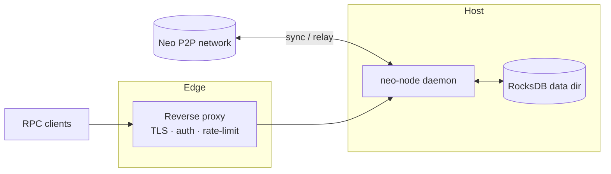
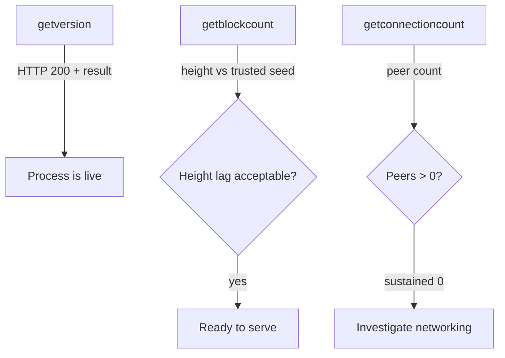
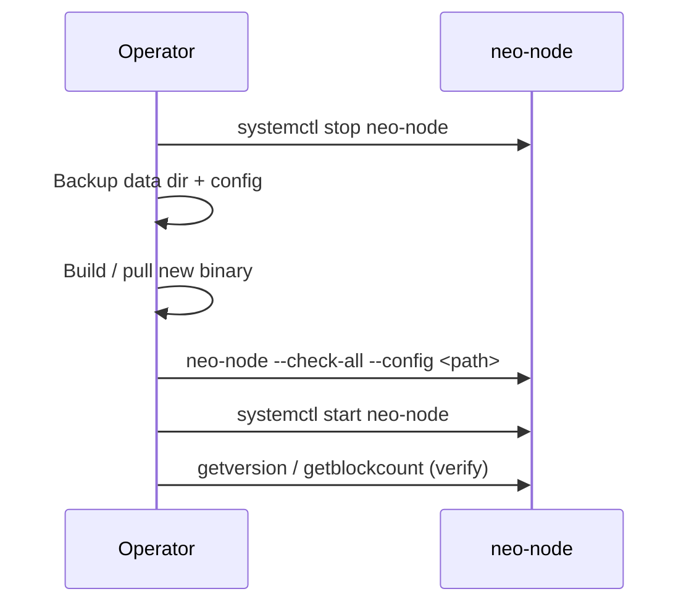

# Operations

Running `neo-rs` in production: deployment, storage, health checks, observability, security hardening, backups, and upgrades.

This guide covers the `neo-node` daemon — the full node behind the `wip` feature. It syncs blocks over P2P, validates the chain, and optionally serves a JSON-RPC API. Storage is RocksDB (default) with an in-memory fallback. Configuration is a single TOML file plus a few CLI flags.

---

## Deployment overview



The daemon binds RPC to loopback by default. Anything that must be reachable off-host should sit behind a reverse proxy that terminates TLS and enforces authentication and rate limits (see [Security hardening](#security-hardening)).

---

## Running the node

Build the daemon and run it against a config file (the full node is `neo-node`'s
default build; see [getting-started.md](./getting-started.md) for details):

```bash
cargo build --release -p neo-node

# MainNet
./target/release/neo-node --config neo_mainnet_node.toml

# TestNet, with an explicit data directory
./target/release/neo-node --config neo_testnet_node.toml --storage-path /var/neo/testnet
```

### CLI flags

The daemon accepts a small, fixed set of flags; everything else lives in TOML.

| Flag | Purpose |
|------|---------|
| `--config`, `-c <PATH>` | Path to the TOML node configuration file. |
| `--network-magic <U32>` | Override the network magic (must match the rest of the network). Wins over the config/preset. |
| `--storage-path <PATH>` | Override the persistent data directory. Implies the RocksDB backend regardless of `[storage].backend`. |
| `--check-config` | Validate configuration and exit without starting services. |
| `--check-storage` | Open the configured storage backend, confirm it is reachable/writable, and exit. |
| `--check-all` | Run both preflight checks and exit. |

Run preflight checks before any deploy or restart:

```bash
./target/release/neo-node --config /opt/neo/config.toml --check-all
```

### systemd (bare metal)

Run as a dedicated non-root user with restart-on-failure and a high file-descriptor limit (RocksDB and P2P need many descriptors).

```ini
# /etc/systemd/system/neo-node.service
[Unit]
Description=Neo N3 Rust Node
After=network-online.target
Wants=network-online.target

[Service]
Type=simple
User=neo
Group=neo
WorkingDirectory=/opt/neo
ExecStart=/opt/neo/neo-node --config /opt/neo/neo_mainnet_node.toml
Restart=always
RestartSec=5
LimitNOFILE=65535

# Hardening
NoNewPrivileges=true
ProtectSystem=strict
ProtectHome=true
ReadWritePaths=/var/neo /var/log/neo
Environment=RUST_LOG=info

[Install]
WantedBy=multi-user.target
```

```bash
sudo systemctl daemon-reload
sudo systemctl enable --now neo-node
journalctl -u neo-node -f
```

### Docker

A multi-stage `Dockerfile` builds the daemon (`cargo build --release -p neo-node`) onto a slim Debian runtime as a non-root `neo` user, and a `docker-compose.yml` is provided. The container exposes MainNet (`10332`/`10333`), TestNet (`20332`/`20333`), and private-net (`30332`/`30333`) ports and persists state under the `/data` volume.

```bash
docker build -t neo-rs:latest .

# TestNet with persistent data
docker run -d --name neo-node \
  -p 20332:20332 -p 20333:20333 \
  -v "$(pwd)/data:/data" \
  -e NEO_NETWORK=testnet \
  neo-rs:latest
```

The image entrypoint reads a few environment variables to select a bundled config and wire paths. The RPC port the node actually serves still comes from the TOML `[rpc]` section.

| Variable | Purpose | Example |
|----------|---------|---------|
| `NEO_NETWORK` | Selects the bundled config (`mainnet` / `testnet`). | `mainnet` |
| `NEO_CONFIG` | Path to a custom TOML config (overrides `NEO_NETWORK`). | `/config/custom.toml` |
| `NEO_STORAGE` | RocksDB directory, passed as `--storage-path`. | `/data/mainnet` |
| `NEO_PLUGINS_DIR` | Plugin configuration directory. | `/data/Plugins` |
| `NEO_RPC_PORT` | Port used by the container health check only. | `10332` |
| `RUST_LOG` | Log directive. | `info,neo_p2p=debug` |

The container `HEALTHCHECK` issues a `getversion` JSON-RPC POST against the RPC port. Inspect it with:

```bash
docker inspect --format='{{.State.Health.Status}}' neo-node
```

> The `docker-compose.yml` includes an optional Grafana profile (`docker compose --profile monitoring up -d`). Grafana alone is only a dashboard surface; you must pair it with a scraper and a metrics source — see [Observability](#observability) for what the daemon currently exposes.

---

## Configuration

`neo-node` reads a TOML file. Bundled samples: `neo_mainnet_node.toml`, `neo_testnet_node.toml`, `neo_production_node.toml`. The daemon consumes the sections below; unknown sections and keys are ignored, so a config carrying blocks the daemon does not yet wire (for example `[telemetry]`, `[logging]`) still parses.

| Section | Key keys | Notes |
|---------|----------|-------|
| `[network]` | `network_magic`, `network_type` | Selects the chain. `--network-magic` overrides. |
| `[storage]` | `backend`, `data_dir` / `path` | `backend = "rocksdb"` for persistence; anything else is in-memory. `--storage-path` overrides and forces RocksDB. |
| `[p2p]` | `port`, `bind_address`, `seed_nodes`, `max_connections`, `min_desired_connections`, `max_connections_per_address` | `bind_address` defaults to `0.0.0.0`; `max_connections = -1` means unlimited (C# parity). |
| `[rpc]` | `enabled`, `port`, `bind_address` | These three are wired by the daemon. Deeper RPC knobs (auth, CORS, disabled methods, limits) exist in `neo-rpc` but are not yet plumbed through `neo-node` startup — enforce them at a proxy. |
| `[consensus]` | `enabled`, `auto_start` | Off by default; consensus participation requires validator keys. |
| `[blockchain]` | `block_time`, `max_transactions_per_block` | |
| `[mempool]` | `max_transactions` | |

> Accuracy note: the sample configs also carry `[telemetry.metrics]` and `[logging]` blocks. The current `neo-node` build parses but does not act on these — they are forward-looking. Logging is driven by `RUST_LOG` today; metrics are not yet served (see below).

Apply config changes by editing the TOML and restarting the service. For Docker, update the env vars or mounted TOML and run `docker compose up -d` to recreate the container.

---

## Data directory & storage sizing

RocksDB requires fast, durable, local storage. Avoid NAS for primary data, spinning disks (insufficient IOPS), and ephemeral/tmpfs volumes.

The exact on-disk size depends on the chain height at the time you sync and on whether you enable `[state_service]` (the state-root MPT trie adds a separate `StateRoot` directory). Size the volume with comfortable headroom and monitor free space; both MainNet and TestNet grow steadily with chain height.

Operational guarantees and markers the node enforces at the data directory:

- **Network marker** — a `NETWORK_MAGIC` file is written; use a distinct directory per network so you cannot mix MainNet and TestNet data.
- **Version marker** — a `VERSION` file is written; if it differs from the running binary, startup fails. Use a fresh path or migrate.
- **Fail-fast on RocksDB** — if RocksDB cannot be opened, the node aborts rather than silently falling back to memory. Check permissions and disk if startup fails.
- **State integrity guard** — startup validates persisted non-native contract state and aborts on malformed payloads or duplicate contract IDs. Restore from a known-good backup or resync from a clean directory if this triggers; do not keep restarting the same directory.

Keep at least 20% free space on the RocksDB volume and monitor inode usage.

---

## Health checks

There is **no `/healthz`, `/readyz`, or `/metrics` HTTP endpoint** on the daemon. Use the JSON-RPC server as the operational health surface. Enable `[rpc] enabled = true` and probe the configured port.



```bash
# Liveness + protocol identity
curl -sf --compressed -X POST http://127.0.0.1:10332 \
  -H 'Content-Type: application/json' \
  -d '{"jsonrpc":"2.0","id":1,"method":"getversion","params":[]}'

# Persisted block height (compare to a trusted seed/explorer for sync status)
curl -sf --compressed -X POST http://127.0.0.1:10332 \
  -H 'Content-Type: application/json' \
  -d '{"jsonrpc":"2.0","id":1,"method":"getblockcount","params":[]}'

# Connected peers (sustained zero warrants investigation)
curl -sf --compressed -X POST http://127.0.0.1:10332 \
  -H 'Content-Type: application/json' \
  -d '{"jsonrpc":"2.0","id":1,"method":"getconnectioncount","params":[]}'
```

Use `--compressed` so gzipped responses decode correctly when piping to `jq`.

| Probe | RPC method | Healthy signal |
|-------|------------|----------------|
| Liveness | `getversion` | HTTP 200 with a `result` object |
| Readiness / sync | `getblockcount` | Height tracks a trusted seed within a small lag |
| Connectivity | `getconnectioncount` | Non-zero, stable peer count |

---

## Observability

### Metrics

The daemon does **not** currently expose a Prometheus `/metrics` endpoint. The `[telemetry.metrics]` config block (`enabled`, `port`, `bind_address`) is parsed but not acted on, and the `prometheus` dependency is not wired to an HTTP exporter in `neo-node`. Until a native endpoint lands, derive metrics from RPC polling via a lightweight sidecar/exporter and from host/container agents.

| Signal | Source | What to watch |
|--------|--------|---------------|
| Block height | `getblockcount` | Lag vs. a trusted seed RPC/explorer |
| Peer count | `getconnectioncount` / `getpeers` | Below-threshold or churning connections |
| Mempool | `getrawmempool` | Size stuck at 0 or growing past a cap |
| RocksDB disk | host filesystem agent | Free space, IOPS, latency on the data volume |
| Process | host agent (`node_exporter` / cAdvisor) | Memory, CPU, file descriptors vs. `nofile` limit |

Suggested alerts to start with:

| Alert | Condition |
|-------|-----------|
| Height lag | Local height behind a reference by more than N blocks for M minutes |
| Low peers | Peer count below threshold for M minutes |
| Mempool anomaly | Size stuck at 0 or exceeding a cap |
| Disk pressure | RocksDB volume free space < 20% or inode pressure |
| FD pressure | Process FD usage > 80% of `nofile`; repeated restarts |

For continuous correctness assurance, the repository ships state-root parity validators (`scripts/continuous-stateroot-validation.py` and `scripts/validate-stateroot-continuous.sh`) that compare each local `getstateroot` against official Neo seed RPCs and emit a JSON status file.

### Logging

Logging is driven by the `RUST_LOG` directive (the `[logging]` TOML block is not yet consumed by the daemon).

```bash
RUST_LOG=info,neo_p2p=debug ./target/release/neo-node --config neo_mainnet_node.toml
```

Under systemd, view and filter logs with `journalctl`:

```bash
journalctl -u neo-node -f
journalctl -u neo-node -p warning..alert --since "1 hour ago"
```

Ship logs to your stack and alert on errors, timeouts, and restarts.

---

## Security hardening

The daemon wires only `[rpc] enabled`, `bind_address`, and `port`. Auth, CORS, method allowlists, and per-IP rate limiting are **not** enforced by the daemon itself — put RPC behind a reverse proxy (Nginx/Caddy/Envoy) for any non-loopback exposure.

### Server-enforced RPC limits

The jsonrpsee server applies these transport-layer limits natively (from `neo-rpc`'s `RpcServerConfig`). Defaults reflect C# parity. The `neo-node` TOML surface does not yet expose these keys, so they apply at their defaults when the daemon starts the server.

| Limit | Config key | Default | Behavior |
|-------|------------|---------|----------|
| HTTP request body size | `max_request_body_size` | 5 MiB | Caps inbound request body. |
| Concurrent connections | `max_concurrent_connections` | 100 | Caps simultaneous connections. |
| Batch length | `max_batch_size` | 1024 | Caps JSON-RPC batch size; `0` disables batching. |
| WS keep-alive | `keep_alive_timeout` | 60s | Drives WS keep-alive pings; a negative value disables idle reaping. |
| Header read timeout | `request_headers_timeout` | 15s | Reaps connections that stall sending headers. |

### Enforced at the proxy

| Control | Why at the proxy |
|---------|------------------|
| TLS termination | The daemon serves plaintext HTTP/WS. |
| Authentication | Not wired through `neo-node` startup. |
| Per-IP rate limiting | The in-tree limiter cannot key per client IP under the current jsonrpsee transport setup. |
| CORS | `enable_cors` / `allow_origins` are parsed but not emitted by the server. |
| Method allowlisting / IP restriction | Restrict to the methods/clients you intend to expose. |

### Hardening checklist

| ✓ | Item |
|---|------|
| ☐ | Bind RPC to loopback (`bind_address = "127.0.0.1"`) and front it with a reverse proxy if it must be reachable off-host. |
| ☐ | Terminate TLS at the proxy or a tunnel. |
| ☐ | Enforce authentication, method allowlists, request-size limits, and rate limits at the proxy. |
| ☐ | Do not expose wallet-mutating methods (`openwallet`, `sendfrom`, `sendmany`, `sendtoaddress`, `importprivkey`, `dumpprivkey`) on untrusted networks. |
| ☐ | Run the node as a dedicated non-root user. |
| ☐ | Restrict P2P and RPC ports at the host/cloud firewall; limit connections per IP (`max_connections_per_address`). |
| ☐ | Set `LimitNOFILE=65535` (or equivalent) so RocksDB and P2P have enough descriptors. |
| ☐ | Configure log shipping and rotation; alert on errors and restarts. |
| ☐ | Configure automated backups and test restores. |

> `NEO_NATIVE_STRICT_SECURITY=1` enables extra native-contract guard checks for hardening experiments. Do **not** enable it on production consensus nodes without validating full chain parity for your exact network and dataset — it can diverge from reference behavior.

---

## Backups

RocksDB is the source of truth. For a consistent snapshot, stop the service, archive the data directory, and restart.

```bash
sudo systemctl stop neo-node
sudo tar czf /backups/neo-$(date +%F).tgz /var/neo/mainnet
sudo systemctl start neo-node
```

Helper scripts in `scripts/` automate this:

| Script | Purpose |
|--------|---------|
| `scripts/backup-rocksdb.sh <rocksdb_path> [backup_dir]` | One-shot archive of the RocksDB directory (also via `make backup-rocksdb`). |
| `scripts/checkpoint-live-rocksdb.sh <writer_pid> <rocksdb_path> [root]` | Live checkpoint with a short pause, then resume. |
| `scripts/checkpoint-live-rocksdb-loop.sh <writer_pid> <rocksdb_path> [interval] [max] [root]` | Periodic live checkpoints with rotation (default interval 1800s, retention 8). |

To restore: stop the service, extract the archive into the configured storage path, fix ownership for the `neo` user, then start the service. Keep backups on storage separate from the live volume, and wire backup/restore failures into your alerting so you know when data protection is stale.

---

## Upgrades



1. **Back up** the data directory and config (see [Backups](#backups)).
2. **Deploy** the new binary (or rebuild the Docker image).
3. **Preflight**: `neo-node --check-all --config <path>` to catch config/storage issues without starting.
4. **Start** and watch logs during catch-up; confirm `getversion` responds and that `getblockcount` tracks a trusted seed.

### Resync after correctness-affecting upgrades

Some upgrades change how state is computed. If you previously ran a build with a known state-computation bug, the local DB may hold divergent state that newer builds will not silently reconcile. **Resync from a clean data directory or a trusted snapshot** if any of these applied to your prior build:

- Unexpected transaction `FAULT`s versus TestNet/MainNet reference (e.g., before strict prefix-bound `DataCache.find`).
- `unclaimedGas` returning `0` in live transfer paths (reverse-prefix iteration that missed NeoToken GAS-per-block records).
- Contract-originated native transfers (e.g., GAS `transfer`) returning `false` unexpectedly (caller-hash resolution fix).
- Repeated block-persistence failures such as `GasToken burn failed ... Insufficient balance for burn` on canonical blocks — treat this as divergent local state, not a recoverable network error.

For breaking schema changes, check the changelog; you may need to resync from genesis or a bootstrap snapshot.

---

## Incident response

| Symptom | First actions |
|---------|---------------|
| Out of sync / zero peers | Restart; verify P2P port reachability, network magic, and seed list. If the DB is corrupt, restore from backup and resync. |
| Startup aborts (integrity / version / network marker) | Do not loop-restart the same directory. Move it aside, restore a backup, or resync from a clean path. |
| RPC overloaded | Front the node with a rate-limiting reverse proxy; consider moving RPC to a dedicated instance. |
| Disk full | Expand the volume, prune old backups/logs, keep RocksDB on fast durable storage. |
| Persistent block-persist failures on canonical blocks | Treat as divergent state; resync from a clean directory or trusted snapshot. |
