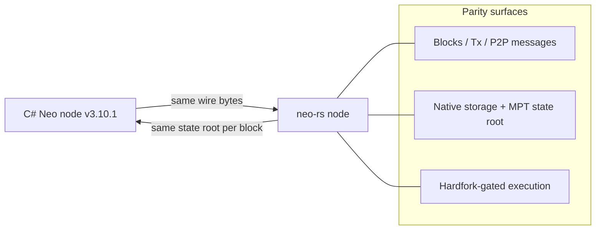
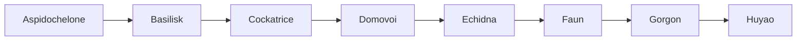
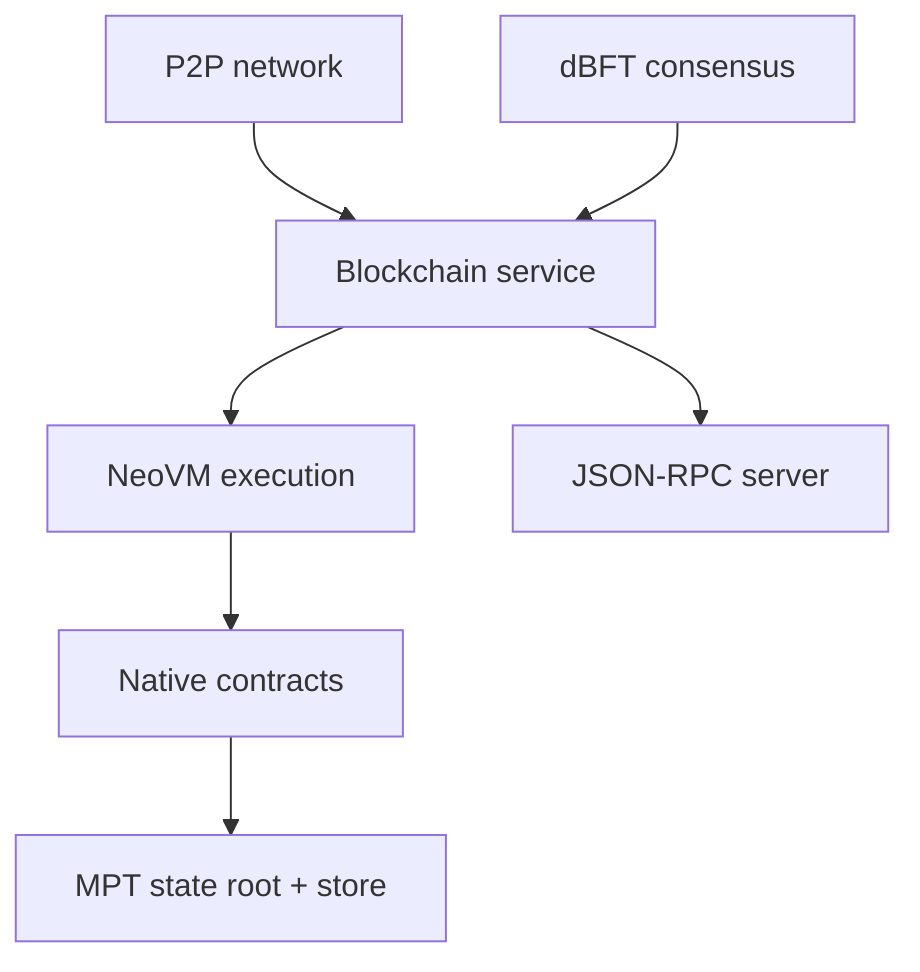

# Protocol Compatibility

This node is a from-scratch Rust reimplementation of the Neo N3 protocol. It targets **byte-for-byte parity** with the official C# reference node (Neo v3.10.1). This document describes what that means, which native contracts and hardforks are implemented, and which protocol features are supported.

## Neo N3 v3.10.1 Parity

"Byte-for-byte parity" means the node produces the exact same on-wire and on-disk bytes as the C# node for the structures that determine consensus:

- **Same network.** Blocks, headers, transactions, signers, witnesses, and P2P messages serialize to identical bytes, so the node speaks the same TCP protocol and participates on the same MainNet/TestNet as C# nodes.
- **Same state roots.** Native-contract storage layout, the Merkle Patricia Trie (MPT), and block execution are modeled to produce the same state root hash at each block, so a synced node reaches the same state as the C# node.
- **Same hardfork schedule.** Consensus-affecting behavior is gated behind named hardforks at the same activation heights as the C# `config.mainnet.json` / `config.testnet.json`, so historical blocks replay identically.

> Parity is verified by in-tree tests (wire round-trips, a real MainNet block-1000 fixture that decodes and hashes to its known C# hash, native-contract hash/manifest pinning tests). Full live-network state-root replay against a running C# node is not part of the in-tree test suite.

## Native Contracts

The node implements the standard Neo N3 native contracts. Each has a fixed, negative contract ID and a deterministic script hash derived the same way as in C#. IDs and names below are taken directly from the source (`neo-native-contracts/src`).

| Contract | ID | Purpose |
|---|---:|---|
| ContractManagement | -1 | Deploy, update, and destroy smart contracts; query contract state, hashes, and IDs |
| StdLib | -2 | Utility library: serialize/deserialize, Base64/Base58, encoding, string and memory helpers |
| CryptoLib | -3 | Cryptographic primitives: hashes, ECDSA verification (multiple curves), BLS12-381 operations |
| LedgerContract | -4 | Read-side ledger queries: blocks, transactions, transaction height and state |
| NeoToken | -5 | Governance token (NEP-17): voting, candidate registration, committee, GAS distribution |
| GasToken | -6 | Utility token (NEP-17): balances, transfers, fee burn/mint |
| PolicyContract | -7 | Network policy: fee factors, storage price, blocked accounts, fee-whitelisted contracts |
| RoleManagement | -8 | Designated node roles (oracle, state validator, etc.) and role designation |
| OracleContract | -9 | Oracle request/response lifecycle and response verification |
| Notary | -10 | Notary-assisted transactions: deposit lifecycle and notary verification |
| Treasury | -11 | Treasury payment callbacks and committee verification |

All eleven contracts are registered in the canonical catalog in C# ID order. Some methods within them only become active at a given hardfork (see below).

## Hardforks

Neo N3 ships protocol upgrades as named hardforks (named after mythological creatures, in alphabetical order) that activate at configured block heights. The node defines the full enum and gates behavior accordingly. Activation heights for MainNet and TestNet match the C# v3.10.1 configuration; `HF_Gorgon` and `HF_Huyao` are defined in the enum but are not scheduled in the v3.10.1 MainNet/TestNet configs.

| Hardfork | Index | What it changes (as gated in this node) |
|---|---:|---|
| HF_Aspidochelone | 0 | First N3 hardfork; baseline protocol improvements |
| HF_Basilisk | 1 | Execution/verification refinements gated in the application engine |
| HF_Cockatrice | 2 | Enables `CryptoLib` Keccak256 and adds hardfork-gated `NeoToken` methods |
| HF_Domovoi | 3 | Adjusts executing-contract resolution in contract calls |
| HF_Echidna | 4 | Broad upgrade: additional `CryptoLib`/`StdLib`/`NeoToken`/`PolicyContract` methods, Notary-related policy changes |
| HF_Faun | 5 | `PolicyContract` extensions (whitelist fee contracts, fund recovery, value-scaling changes) |
| HF_Gorgon | 6 | VM jump-table changes and `CryptoLib` method deprecation/replacement; defined but unscheduled in v3.10.1 configs |
| HF_Huyao | 7 | Neo v3.10.1 protocol refinements; defined but unscheduled in built-in MainNet/TestNet configs |

Activation heights (from the node's hardfork manager):

| Hardfork | MainNet height | TestNet height |
|---|---:|---:|
| HF_Aspidochelone | 1,730,000 | 210,000 |
| HF_Basilisk | 4,120,000 | 2,680,000 |
| HF_Cockatrice | 5,450,000 | 3,967,000 |
| HF_Domovoi | 5,570,000 | 4,144,000 |
| HF_Echidna | 7,300,000 | 5,870,000 |
| HF_Faun | 8,800,000 | 12,960,000 |
| HF_Gorgon | not scheduled | not scheduled |
| HF_Huyao | not scheduled | not scheduled |

A hardfork is enabled at a given block when the block index is greater than or equal to its configured height; an unconfigured hardfork is treated as disabled. Because consensus-affecting code (including the VM jump table) is hardfork-gated, blocks before a hardfork replay with the pre-hardfork rules and blocks after it replay with the post-hardfork rules.

## What's Supported

| Area | Support |
|---|---|
| Consensus | dBFT 2.0 (`neo-consensus`): prepare/commit, view change, recovery, primary selection |
| Virtual machine | NeoVM with hardfork-gated jump table and gas accounting (`neo-vm`, `neo-execution`) |
| State | Merkle Patricia Trie state root, state store, atomic block-commit pipeline (`neo-state-service`) |
| Native contracts | The 11 standard native contracts listed above |
| NEP-17 | Fungible tokens (NEO, GAS) with transfer and `onNEP17Payment` callbacks |
| NEP-11 | Non-fungible token interface support |
| NEP-6 | Wallet format with BIP-32/BIP-39 key derivation (`neo-wallets`) |
| Oracle | HTTPS and NeoFS oracle request fulfilment (`neo-oracle-service`) |
| P2P | Neo N3 TCP wire protocol: version/verack handshake, inv/getdata, blocks, headers, addr, mempool relay (`neo-network`) |
| RPC | jsonrpsee JSON-RPC server and client (~55 methods); see the RPC reference |

## Cryptography

The node uses Neo N3's cryptographic scheme, built on mature, widely-used Rust crates rather than hand-rolled primitives (`neo-crypto`):

| Primitive | Use | Library |
|---|---|---|
| secp256r1 (P-256) ECDSA | The chain's identity/signing curve for transaction and block witnesses | `p256` |
| secp256k1 ECDSA | `CryptoLib` `recoverSecp256K1` / secp256k1 verification (hardfork-gated) | `secp256k1`, `k256` |
| Ed25519 | `CryptoLib` Ed25519 verification | `ed25519-dalek` |
| BLS12-381 | `CryptoLib` BLS operations | `blst` |
| SHA-256 / SHA-512 | Block, transaction, and Merkle hashing | `sha2` |
| RIPEMD-160 | Script-hash (address) derivation | `ripemd` |
| Keccak-256 / SHA-3 | `CryptoLib` Keccak256 (gated at HF_Cockatrice) | `sha3` |
| Murmur32 / Murmur128 | Bloom-filter seeding | `murmur3` |

The identity curve is **secp256r1** — secp256k1, Keccak, and the other curves exist only as discrete, hardfork-gated `CryptoLib` native methods, not as the chain's default hash or signature scheme.
