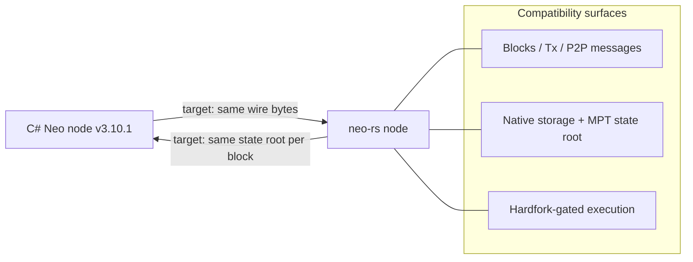
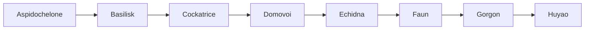
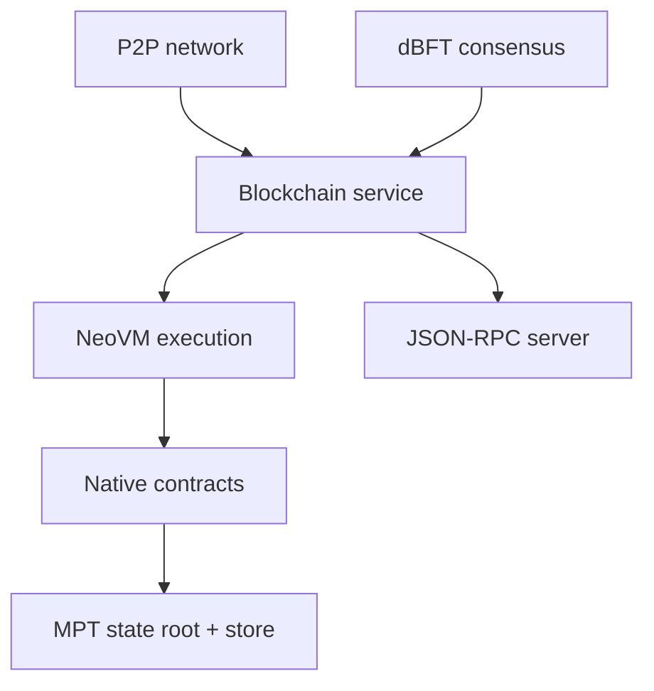

# Protocol Compatibility

This node is a from-scratch Rust reimplementation of the Neo N3 protocol. It
targets **byte-for-byte compatibility** with the official C# reference node
(Neo v3.10.1). Phase 1 establishes a reproducible, hardfork-aware execution
baseline; it does not establish blanket protocol parity. This document records
the compatibility target, the implemented surfaces, and the evidence still
required before a production release.

## Compatibility Target and Current Evidence

Byte-for-byte compatibility requires the node to produce the same on-wire and
on-disk bytes as the C# node for every structure that determines consensus:

- **Same network target.** Blocks, headers, transactions, signers, witnesses,
  and P2P messages must serialize to identical bytes before sustained
  MainNet/TestNet interoperability can be claimed.
- **Same state-root target.** Native-contract storage, the Merkle Patricia Trie
  (MPT), and block execution must produce the reference state root at every
  retained comparison height.
- **Same hardfork schedule.** Consensus-affecting behavior is selected at the
  official `config.mainnet.json` / `config.testnet.json` activation heights.

> In-tree fixtures and focused tests provide component evidence only. Full
> differential execution parity, sustained live-peer interoperability,
> complete MainNet replay and state parity, and authenticated checkpoint fast
> sync remain separate release gates.

## v3.10.1 Release Delta Audit

The v3.10.1 compatibility target is based on the official `neo-project/neo`
[`v3.10.1`](https://github.com/neo-project/neo/releases/tag/v3.10.1) release,
published on 2026-07-07 and pointing at commit
`d10e9ceecdabe3fcff719ee68ea5b76ba7e62c3d`. The C# release depends on
`neo-project/neo-vm` [`v3.10.1`](https://github.com/neo-project/neo-vm/releases/tag/v3.10.1),
commit `004cd6070a940405818d9357638277dd44407e2e`. The audited upstream
ranges are `neo` `v3.10.0...v3.10.1` and `neo-vm` `v3.10.0...v3.10.1`:

| Upstream commit / PR | Consensus or wire effect | neo-rs coverage |
|---|---|---|
| `df402675` / #4562, `d10e9cee` / #4575 | Release metadata: core package version `3.10.1` and final `Neo.VM` `3.10.1`. | `README.md`, protocol docs, release scripts, and protocol-target tests identify Neo v3.10.1 as the active C# parity target. |
| `9f4795ab` / #4571 | Adds `HF_Huyao` after `HF_Gorgon`. Empty `Hardforks: {}` now backfills every known hardfork through Huyao at height 0. | `neo-primitives::Hardfork::HfHuyao`, `neo-config::HardforkManager`, and config tests define Huyao and the C# empty-object backfill rule. Built-in MainNet/TestNet presets stay explicit operational schedules unless a loaded network config schedules later forks. |
| `f5ae5e82` / #4565 | Centralizes `ApplicationEngine.AddFee(gas, applyFactor)` so datoshi-vs-picoGAS conversion happens once, negative fees fault before whitelist bypass, and overflow cannot leave partial fee-consumed side effects. | `neo-execution` keeps `add_fee_datoshi`, `add_fee_pico`, `add_cpu_fee`, and native-method combined charging separate; fee tests cover negative-fee ordering, storage-fee units, and no-side-effect overflow. |
| `e66e4dfc` / #4563 | `StdLib.Itoa` formats integers with invariant culture. | `neo-native-contracts::StdLib` uses deterministic base-10/base-16 formatting; tests pin C# base-10 and two's-complement hex output independently of host locale. |
| `6b1c90c6` / #4566 plus `neo-vm` `7a8018e` / #581 and `004cd60` / #587 | Refreshes NeoVM to v3.10.1 reference-counter behavior. | `neo-vm` matches the recursive C# `ReferenceCounter`, including `CLEARITEMS` cycle and underflow behavior; runtime reference-counter tests pin those paths. |
| `55c14029` / #4569 | From `HF_Gorgon`, committee voter-reward refreshes use live candidate votes rather than stale committee-cache votes. | `neo-native-contracts::NeoToken` reads live candidate votes for refresh-time voter rewards, including the empty-block fast-forward path; tests cover post-Gorgon normal and fast-forward rewards. |
| `abbc3a25` / #4570 | Notary-sponsored transactions reserve and persist fees against the secondary signer's Notary deposit; missing or overdrawn deposits fault instead of spending unrelated Notary GAS balance. | `neo-mempool` tracks v3.10.1 payer tuples `(Notary, Signers[1])`, verification reads Notary deposit balances, and `neo-native-contracts::Notary` faults on missing or overdrawn deposits during persist. |
| `7f8454f4` / #4572 | Hardening: invalid `ExtensiblePayload` relay results are returned to the sender but not published to the event stream; witnesses must hash to `Sender`. | `neo-payloads::ExtensiblePayload` rejects mismatched witness script hashes, `neo-blockchain` validates before cache/relay insertion, and failed extensible relay results are suppressed from runtime events. |
| `7bb91ff5` / #4574 | `StorageKey.ToString()` no longer indexes empty keys. | `neo-storage::StorageKey` formats empty keys as `StorageKey{Id=...}` and non-empty keys as `StorageKey{Id=...,Key=...}`. |

## Native Contracts

The node implements the standard Neo N3 native contracts. Each has a fixed, negative contract ID and a deterministic script hash derived the same way as in C#. IDs and names below are taken directly from the source (`neo-native-contracts/src`).

| Contract | ID | Purpose |
|---|---:|---|
| ContractManagement | -1 | Deploy, update, and destroy smart contracts; query contract state, hashes, and IDs |
| StdLib | -2 | Utility library: serialize/deserialize, Base64/Base58, encoding, string and memory helpers |
| CryptoLib | -3 | Cryptographic primitives: hashes, ECDSA verification (multiple curves), BLS12-381 operations |
| LedgerContract | -4 | Read-side ledger queries: blocks, transactions, transaction height and state |
| NeoToken | -5 | Governance token (NEP-17): voting, candidate registration, committee, GAS distribution |
| GasToken | -6 | Utility token (NEP-17): balances, transfers, fee burn/mint |
| PolicyContract | -7 | Network policy: fee factors, storage price, blocked accounts, fee-whitelisted contracts |
| RoleManagement | -8 | Designated node roles (oracle, state validator, etc.) and role designation |
| OracleContract | -9 | Oracle request/response lifecycle and response verification |
| Notary | -10 | Notary-assisted transactions: deposit lifecycle and notary verification |
| Treasury | -11 | Treasury payment callbacks and committee verification |

All eleven contracts are registered in the canonical catalog in C# ID order. Some methods within them only become active at a given hardfork (see below).

## Hardforks

Neo N3 ships protocol upgrades as named hardforks (named after mythological
creatures, in alphabetical order) that activate at configured block heights.
The node defines the full enum and gates behavior accordingly. The C# v3.10.1
`ProtocolSettings` loader backfills omitted leading hardforks at height 0, so an
explicitly loaded `Hardforks: {}` enables every known hardfork including
`HF_Gorgon` and `HF_Huyao`. The built-in neo-rs MainNet/TestNet presets instead
use the explicit official operational schedules: they schedule Gorgon and omit
Huyao.

| Hardfork | Index | What it changes (as gated in this node) |
|---|---:|---|
| HF_Aspidochelone | 0 | First N3 hardfork; baseline protocol improvements |
| HF_Basilisk | 1 | Execution/verification refinements gated in the application engine |
| HF_Cockatrice | 2 | Enables `CryptoLib` Keccak256 and adds hardfork-gated `NeoToken` methods |
| HF_Domovoi | 3 | Adjusts executing-contract resolution in contract calls |
| HF_Echidna | 4 | Broad upgrade: additional `CryptoLib`/`StdLib`/`NeoToken`/`PolicyContract` methods, Notary-related policy changes |
| HF_Faun | 5 | `PolicyContract` extensions (whitelist fee contracts, fund recovery, value-scaling changes) |
| HF_Gorgon | 6 | VM jump-table changes and `CryptoLib` method deprecation/replacement; active when the loaded hardfork schedule enables it |
| HF_Huyao | 7 | Neo v3.10.1 protocol refinements; active when the loaded hardfork schedule enables it |

The built-in schedules are sourced from `neo-project/neo-node` tag `v3.10.1`,
commit `7313f8087724e1de4caa88edd2ada58c1fe54abc`. The `neo` and
`neo-vm` commits in the release-delta audit remain the semantic authorities.

Activation heights for the built-in operational presets are:

| Hardfork | MainNet height | TestNet height |
|---|---:|---:|
| HF_Aspidochelone | 1,730,000 | 210,000 |
| HF_Basilisk | 4,120,000 | 2,680,000 |
| HF_Cockatrice | 5,450,000 | 3,967,000 |
| HF_Domovoi | 5,570,000 | 4,144,000 |
| HF_Echidna | 7,300,000 | 5,870,000 |
| HF_Faun | 8,800,000 | 12,960,000 |
| HF_Gorgon | 12,020,000 | 17,960,000 |
| HF_Huyao | not scheduled | not scheduled |

A hardfork is enabled at a given block when the block index is greater than or equal to its configured height; an unconfigured hardfork is treated as disabled. When a loaded config contains `Hardforks: {}`, the C# v3.10.1 compatibility rule inserts all known hardforks at height 0. Because consensus-affecting code (including the VM jump table) is hardfork-gated, blocks before a hardfork replay with the pre-hardfork rules and blocks after it replay with the post-hardfork rules.

## Implemented Surfaces

The following table describes code present in the repository. Code presence is
not, by itself, evidence of live interoperability, complete replay, or state
parity.

| Area | Support |
|---|---|
| Consensus | dBFT 2.0 (`neo-consensus`): prepare/commit, view change, recovery, primary selection |
| Virtual machine | NeoVM with hardfork-gated jump table and gas accounting (`neo-vm`, `neo-execution`) |
| State | Merkle Patricia Trie state root, state store, atomic block-commit pipeline (`neo-state-service`) |
| Native contracts | The 11 standard native contracts listed above |
| NEP-17 | Fungible tokens (NEO, GAS) with transfer and `onNEP17Payment` callbacks |
| NEP-11 | Non-fungible token interface support |
| NEP-6 | Wallet format with BIP-32/BIP-39 key derivation (`neo-wallets`) |
| Oracle | HTTPS and NeoFS oracle request fulfilment (`neo-oracle-service`) |
| P2P | Neo N3 TCP wire protocol: version/verack handshake, inv/getdata, blocks, headers, addr, mempool relay (`neo-network`) |
| RPC | jsonrpsee JSON-RPC server and client (~55 methods); see the RPC reference |

## Cryptography

The node uses Neo N3's cryptographic scheme, built on mature, widely-used Rust crates rather than hand-rolled primitives (`neo-crypto`):

| Primitive | Use | Library |
|---|---|---|
| secp256r1 (P-256) ECDSA | The chain's identity/signing curve for transaction and block witnesses | `p256` |
| secp256k1 ECDSA | `CryptoLib` `recoverSecp256K1` / secp256k1 verification (hardfork-gated) | `secp256k1`, `k256` |
| Ed25519 | `CryptoLib` Ed25519 verification | `ed25519-dalek` |
| BLS12-381 | `CryptoLib` BLS operations | `blst` |
| SHA-256 / SHA-512 | Block, transaction, and Merkle hashing | `sha2` |
| RIPEMD-160 | Script-hash (address) derivation | `ripemd` |
| Keccak-256 / SHA-3 | `CryptoLib` Keccak256 (gated at HF_Cockatrice) | `sha3` |
| Murmur32 / Murmur128 | Bloom-filter seeding | `murmur3` |

The identity curve is **secp256r1** — secp256k1, Keccak, and the other curves exist only as discrete, hardfork-gated `CryptoLib` native methods, not as the chain's default hash or signature scheme.
