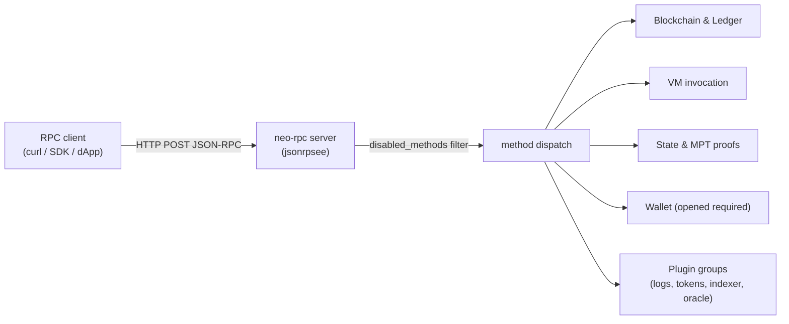

# JSON-RPC API Reference

The node exposes a JSON-RPC 2.0 API over HTTP. The endpoint listens on the
address and port configured in the `[rpc]` section of your TOML config
(default `127.0.0.1:10332`). All requests are `POST` to the root path `/`
with `Content-Type: application/json`. Parameters are passed positionally as a
JSON array.

This API targets parity with the C# Neo `RpcServer` plugin: every method name
and its parameter order match the reference node, so existing Neo tooling and
SDKs work unchanged.



## Request and response shape

A request is a JSON object with `jsonrpc`, `method`, `params`, and `id`:

```json
{ "jsonrpc": "2.0", "method": "getblockcount", "params": [], "id": 1 }
```

A success response carries `result`; an error response carries an `error`
object with a numeric `code` and `message`. Unknown methods, malformed
parameters, and disabled methods all return JSON-RPC errors.

## Endpoint configuration

The endpoint is governed by the `[rpc]` config section. The node daemon wires
the listen address plus the RPC hardening and resource-limit keys into the
embedded server configuration:

| Key | Shipped configs | Purpose |
|-----|-----------------|---------|
| `enabled` | `true` | Whether the RPC server starts (omitted ⇒ off) |
| `bind_address` | `127.0.0.1` | Listen address |
| `port` | `10332` (MainNet) / `20332` (TestNet) | Listen port |
| `rpc_user` / `rpc_pass` / `auth_enabled` | MainNet preset sets credentials | Basic authentication |
| `cors_enabled` / `allow_origins` | Optional | Browser CORS headers and preflight handling |
| `disabled_methods` | MainNet disables `openwallet` | Per-endpoint method deny-list |
| `max_gas_invoke`, `max_iterator_results` | Shipped configs set bounded values | Invoke and iterator response limits |
| `max_request_body_size`, `max_batch_size`, rate-limit keys | Optional | Request-size and batch controls; rate-limit keys are parsed, but public deployments should rate-limit at the proxy |

The full `[rpc]` key list is documented in
[configuration.md](./configuration.md), which is the authoritative config
reference. Notes on the supported surface:

- **TLS** is not terminated in-process; bind to localhost or place the node
  behind a TLS-terminating reverse proxy for remote access (see
  [operations.md](./operations.md)).
- **Basic authentication** is enforced for every HTTP RPC request when
  `rpc_user`/`rpc_pass` are configured. Clients must send an
  `Authorization: Basic ...` header.
- **CORS** is emitted by the HTTP transport when `cors_enabled` is true. Empty
  `allow_origins` allows any origin; a non-empty list only echoes matching
  origins.
- **Wallet methods** require an opened wallet and are intended to be disabled on
  untrusted networks (`openwallet` is in `disabled_methods` in the shipped
  configs).
- **WebSocket subscriptions** are not enabled by the node daemon; the HTTP
  JSON-RPC endpoint above is the supported interface.

## curl examples

Get the node version:

```bash
curl -s http://127.0.0.1:10332 \
  -H 'Content-Type: application/json' \
  -d '{"jsonrpc":"2.0","method":"getversion","params":[],"id":1}'
```

Get the current block height (count):

```bash
curl -s http://127.0.0.1:10332 \
  -H 'Content-Type: application/json' \
  -d '{"jsonrpc":"2.0","method":"getblockcount","params":[],"id":1}'
```

Get a block by index, verbose form:

```bash
curl -s http://127.0.0.1:10332 \
  -H 'Content-Type: application/json' \
  -d '{"jsonrpc":"2.0","method":"getblock","params":[0, true],"id":1}'
```

---

## Blockchain

Read-only queries over blocks, transactions, contracts, storage, and committee
state. All names are C#-parity named.

| Method | Parameters | Returns | Notes |
|--------|------------|---------|-------|
| `getbestblockhash` | none | Hash of the latest block | |
| `getblockcount` | none | Block count (height + 1) | |
| `getblockheadercount` | none | Header count | |
| `getblockhash` | `index` | Block hash at height | |
| `getblock` | `hash`\|`index`, `verbose?` | Block (hex or JSON) | `verbose` boolean or `0`/`1` |
| `getblockheader` | `hash`\|`index`, `verbose?` | Header (hex or JSON) | |
| `getblocksysfee` | `index` | Cumulative system fee | |
| `getrawmempool` | `should_get_unverified?` | Pending tx hashes | |
| `getrawtransaction` | `txid`, `verbose?` | Transaction (hex or JSON) | |
| `gettransactionheight` | `txid` | Block index of a tx | |
| `getcontractstate` | `hash`\|`id`\|`name` | Contract manifest + state | Accepts script hash, native id, or native name |
| `getstorage` | `contract`, `key` (base64) | Stored value | |
| `findstorage` | `contract`, `prefix` (base64), `start?` | Paged storage entries | |
| `getnativecontracts` | none | All native contract states | |
| `getcommittee` | none | Committee public keys | |
| `getcandidates` | none | Registered candidates + votes | |
| `getnextblockvalidators` | none | Validators for the next block | |

## Smart contract invocation

Execute scripts against a read-only VM snapshot, verify witnesses, and drive
result iterators. These do not change chain state.

| Method | Parameters | Returns | Notes |
|--------|------------|---------|-------|
| `invokefunction` | `scripthash`, `method`, `params?`, `signers?` | VM result (state, gas, stack) | Optional signers/witnesses |
| `invokescript` | `script` (base64), `signers?` | VM result | |
| `invokecontractverify` | `scripthash`, `params?`, `signers?` | Witness verification result | |
| `getunclaimedgas` | `address` | Unclaimed GAS for an account | |
| `traverseiterator` | `session`, `iterator-id`, `count` | Next batch of iterator items | Session from a prior `invoke*` |
| `terminatesession` | `session` | Boolean | Releases an iterator session |

## State and MPT proofs

Merkle-Patricia state root, historical state lookups, and inclusion proofs.

| Method | Parameters | Returns | Notes |
|--------|------------|---------|-------|
| `getstateroot` | `index` | State root at a height | |
| `getstateheight` | none | Local + validated state heights | |
| `getstate` | `root-hash`, `contract`, `key` (base64) | Value at a historical root | |
| `findstates` | `root-hash`, `contract`, `prefix` (base64), `start?`, `count?` | Paged state entries with proofs | |
| `getproof` | `root-hash`, `contract`, `key` (base64) | Inclusion proof | |
| `verifyproof` | `root-hash`, `proof` (base64) | Verified value | Validates a proof from `getproof` |

## Node and network

Local node identity and peer connectivity; transaction and block submission.

| Method | Parameters | Returns | Notes |
|--------|------------|---------|-------|
| `getversion` | none | Protocol, port, and node info | |
| `getconnectioncount` | none | Number of connected peers | |
| `getpeers` | none | Connected / unconnected / bad peers | |
| `sendrawtransaction` | `tx` (base64) | Accepted tx hash | Relays to the mempool |
| `submitblock` | `block` (base64) | Submitted block hash | |

## Wallet

Wallet operations require an opened wallet on the node and are marked
**protected**: when RPC authentication is configured they require credentials.
`openwallet` is disabled by default (`disabled_methods`). These methods operate
on the wallet loaded into the running node, not a client-side wallet.

| Method | Parameters | Returns | Notes |
|--------|------------|---------|-------|
| `openwallet` | `path`, `password` | Boolean | Disabled by default in shipped configs |
| `closewallet` | none | Boolean | |
| `getnewaddress` | none | New address | |
| `listaddress` | none | Wallet addresses | |
| `dumpprivkey` | `address` | WIF private key | Sensitive |
| `importprivkey` | `wif` | Imported account | |
| `getwalletbalance` | `asset` | Asset balance | |
| `getwalletunclaimedgas` | none | Unclaimed GAS for the wallet | |
| `calculatenetworkfee` | `tx` (base64) | Network fee | |
| `sendfrom` | `asset`, `from`, `to`, `amount` | Signed/relayed tx | |
| `sendtoaddress` | `asset`, `to`, `amount` | Signed/relayed tx | |
| `sendmany` | `from?`, `outputs[]` | Signed/relayed tx | Multiple outputs |
| `canceltransaction` | `txid`, `signers[]`, `fee?` | Conflicting cancel tx | |

## Governance

Governance reads are served from the Blockchain group (`getcommittee`,
`getcandidates`, `getnextblockvalidators`, listed above) and the smart-contract
group (`getunclaimedgas`). There is no separate governance namespace; the names
match C# for tooling compatibility.

## Plugin method groups

The daemon registers optional plugin method groups on the same JSON-RPC
endpoint as the standard methods. Their backing services are enabled in TOML;
when a service is not running, its methods return a service-unavailable error
instead of silently disappearing from the transport.

### Application logs

| Method | Parameters | Returns | Notes |
|--------|------------|---------|-------|
| `getapplicationlog` | `txid`\|`blockhash`, `trigger?` | Execution log + notifications | |

### Token tracker (NEP-11 / NEP-17)

| Method | Parameters | Returns | Notes |
|--------|------------|---------|-------|
| `getnep17balances` | `address` | NEP-17 balances | |
| `getnep17transfers` | `address`, `start?`, `end?` | NEP-17 transfer history | |
| `getnep11balances` | `address` | NEP-11 balances | |
| `getnep11transfers` | `address`, `start?`, `end?` | NEP-11 transfer history | |
| `getnep11properties` | `contract`, `tokenid` | NEP-11 token properties | |

### NeoIndexer

| Method | Parameters | Returns | Notes |
|--------|------------|---------|-------|
| `getindexerstatus` | none | Indexed tip hash/height, chain lag, record counts, ApplicationLogs availability, and persistence mode | Requires `[indexer] enabled = true`; returns `ledgerheight`, `blocksbehind`, `synced`, `applicationlogs`, `persistent`, `persistencemode` (`memory`, `json-snapshot`, or `service-store`), `snapshotpath`, and `storepath`. |
| `getblockindex` | `hash`\|`height` | Indexed block summary or `null` | |
| `getblockindexes` | `skip?`, `limit?` | Indexed block summaries | Returns blocks in ascending height order. |
| `gettransactionindex` | `txid` | Indexed transaction summary or `null` | Includes signer accounts and addresses. |
| `getblocktransactions` | `hash`\|`height`, `skip?`, `limit?` | Indexed transactions for a block | Returns transaction summaries in block order. |
| `getaddresstransactions` | `address`, `skip?`, `limit?` | Signer-account transaction records | Limit is capped by the server. |
| `getcontracttransactions` | `contract`, `event?`, `skip?`, `limit?` | Transactions that emitted matching contract notifications | De-duplicates transactions with multiple matching notifications. |
| `getaddressnotifications` | `address`, `skip?`, `limit?` | Transfer notifications involving the address | Uses indexed notification participants, not only signer accounts. |
| `getblocknotifications` | `hash`\|`height`, `skip?`, `limit?` | Indexed notifications for a block | Live imports include notifications. Startup backfill reconstructs block/tx/account records from stored blocks; historical notification backfill requires `[application_logs]` records. |
| `gettransactionnotifications` | `txid`, `skip?`, `limit?` | Indexed notifications for a transaction | |
| `getcontractnotifications` | `contract`, `event?`, `skip?`, `limit?` | Indexed notifications for a contract | `contract` accepts script hash or address. |

For paged NeoIndexer methods, the default page size is 100 and the maximum page size is 1000; larger limits are capped server-side.
`synced` is true only when `indexedheight` exactly matches `ledgerheight`; an indexer store ahead of the current ledger is reported as unsynced.

### Oracle

| Method | Parameters | Returns | Notes |
|--------|------------|---------|-------|
| `submitoracleresponse` | oracle response fields | Boolean | Used by oracle nodes |

## Utility

| Method | Parameters | Returns | Notes |
|--------|------------|---------|-------|
| `validateaddress` | `address` | Validity + script hash | |
| `listplugins` | none | Loaded plugins | C#-compatible `name`, `version`, `interfaces` objects. |
| `listservices` | none | Runtime service directory | Rust node operator view with `enabled`, `ready`, `interfaces`, `methods`, and lightweight `status` fields for RPC, StateService, ApplicationLogs, TokensTracker, NeoIndexer, and OracleService. |

## Error handling

Errors follow the JSON-RPC 2.0 error object with C#-parity codes. Common cases:

| Condition | Behaviour |
|-----------|-----------|
| Unknown method | Method-not-found error |
| Bad / missing parameters | Invalid-params error with a description |
| Method in `disabled_methods` | Error refusing the call |
| Wallet method without an open wallet | Error indicating no wallet is open |
| Auth configured, credentials missing/wrong | Request rejected before dispatch |
