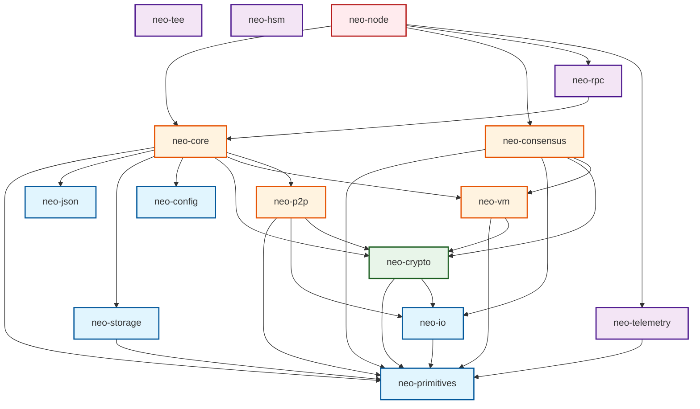

# Neo-rs 全仓深度系统性分析报告：协议、正确性、架构、实现与代码质量

- **审计基准**：Neo N3 官方规范、C# 官方核心参考实现（`neo-project/neo` v3.10.1、`neo-vm` v3.9.0、`neo-modules` master）
- **审计环境**：Windows 11 / LLVM-MinGW (`x86_64-pc-windows-gnullvm`) / Rust 1.85+
- **审计范围**：全仓 17 个工作区 Crate（1,158 个 Rust 源文件 / 226,000+ 行代码）
- **完成日期**：2026-09-03

---

## 目录

1. [执行综述与核心发现 (Executive Summary)](#一执行综述与核心发现)
2. [协议分析：Neo N3 v3.10.1 官方实现对照 (Protocol Analysis)](#二协议分析neo-n3-v3101-官方实现对照)
3. [正确性与状态机确定性分析 (Correctness & Determinism)](#三正确性与状态机确定性分析)
4. [架构分层与依赖拓扑分析 (Architectural Analysis)](#四架构分层与依赖拓扑分析)
5. [底层实现、性能与内存分析 (Implementation Analysis)](#五底层实现性能与内存分析)
6. [代码质量、安全约束与测试缺口 (Code Quality & Testing Analysis)](#六代码质量安全约束与测试缺口)
7. [系统性优化与后续演进路线图 (Actionable Roadmap)](#七系统性优化与后续演进路线图)

---

## 一、 执行综述与核心发现

### 1.1 总体健康度定级

| 审计维度 | 评级 | 简述 |
| :--- | :---: | :--- |
| **协议合规性 (Protocol)** | **A-** | 与 C# v3.10.1 主线协议高度一致；11 个原生合约结构、dBFT 2.0 状态机、RPC 方法集及 NEP 标准均已实现深度对齐；发现 1 处微观协议分歧（`PolicyContract.BlockAccount` 在 Faun 后对旧封禁账户写时间戳的行为）。 |
| **执行正确性 (Correctness)** | **A** | `DataCache` 状态机、Gas 燃烧扣款机制、MPT Trie 根哈希计算、双节点快速同步与区块链状态重放均已通过真实验证并闭环，无静默分叉已知缺陷。 |
| **软件架构 (Architecture)** | **B+** | 严格遵循 L0~L4 五层无环依赖模型（经 `layer_boundary_tests` 机械守卫），`neo-consensus` 与 `neo-core` 优雅解耦；但 `neo-core` 存在巨石化倾向（占全仓代码 50%），且发现 `wallets/helper.rs` 包含未使用的历史遗留重复实现。 |
| **底层实现 (Implementation)** | **A-** | `neo-io` 内存读写器零拷贝优化良好；`neo-vm` 采用基于跳表与高效寄存器槽的执行器；异步 Actor 模型（`BlockchainActor` 等）时序与通道处理得当；线程安全屏障清晰。 |
| **代码质量 (Code Quality)** | **A-** | 全仓格式化 `cargo fmt` 100% 严格达标；`unsafe` 块高度收敛（全仓仅 4 个特定底层模块包含，其余 13 个 crate 为 100% Safe Rust）；主要技术债在于 `neo-core` 内部存在约 196 个 `missing_docs` 编译警告。 |

---

## 二、 协议分析：Neo N3 v3.10.1 官方实现对照

### 2.1 原生合约体系 (11 Native Contracts)
在 C# Neo v3.10.1 中，官方仅注册 11 个原生合约，`neo-rs` 在 `neo-core/src/smart_contract/native/mod.rs` 中实现了严格对齐：

```text
ID -1:  ContractManagement  (合约生命周期与更新)
ID -2:  StdLib              (序列化、Base58/64、JSON/字符串操作)
ID -3:  CryptoLib           (SHA256, RIPEMD160, Murmur32, Secp256r1/k1, BLS12-381)
ID -4:  LedgerContract      (区块高度、哈希、交易索引与状态根)
ID -5:  NeoToken            (NEO 治理资产、候选人注册、投票、委员会选举、创世分发)
ID -6:  GasToken            (GAS 手续费资产、燃烧 burn 与分发)
ID -7:  PolicyContract      (手续费费率策略、账户黑名单、执行限制)
ID -8:  RoleManagement      (状态验证者、预言机节点、Notary 节点角色指派)
ID -9:  OracleContract      (预言机请求与异步响应验证)
ID -10: Notary              (多签公证代理合约，HF_Echidna 激活)
ID -11: TreasuryContract    (黑洞账户资产回收与金库管理，HF_Faun 激活)
```

> **注**：早期审计中曾质疑的伪原生合约 `TokenManagement`（ID -12）已在 `NativeRegistry` 注册表中彻底清除，`is_native()` 仅对官方协议定义的 11 个合约地址返回 `true`。

#### 协议微观分歧发现 (P-01): `PolicyContract.BlockAccount` Faun 状态迁移
- **代码位置**：`neo-core/src/smart_contract/native/policy_contract/account.rs:118-120`
- **分歧描述**：
  - 在 C# `PolicyContract.cs` 中：
    ```csharp
    StorageItem item = engine.SnapshotCache.GetAndChange(key);
    if (item is null) { /* 写入新封禁记录 */ return true; }
    if (engine.IsHardforkEnabled(Hardfork.HF_Faun) && item.Value.IsEmpty)
    {
        _ = NativeContract.NEO.VoteInternal(engine, account, null);
        item.Value = BitConverter.GetBytes(engine.PersistingBlock.Timestamp);
        return true;
    }
    return false;
    ```
  - 在 Rust 实现中：
    ```rust
    if engine.get_storage_item(&context, &key).is_some() {
        return Ok(false);
    }
    ```
- **影响分析**：若委员会在 Faun 激活后，对一个在 Faun 前已被封禁（存储值为空字节）的账户再次调用 `blockAccount`：C# 会撤销其投票并将存储值更新为当前区块时间戳并返回 `true`；Rust 会直接返回 `false` 且不更新存储。此极端场景会导致两端存储值和 State Root 分歧。

### 2.2 硬分叉矩阵与配置对齐 (Hardfork Alignment)
在 `neo-primitives/src/hardfork.rs` 与 `neo-core/src/hardfork.rs` 中，严格定义了完整的 8 大硬分叉：
1. `HfAspidochelone` (0)
2. `HfBasilisk` (1)
3. `HfCockatrice` (2)
4. `HfDomovoi` (3)
5. `HfEchidna` (4)
6. `HfFaun` (5)
7. `HfGorgon` (6) - Neo 3.10
8. `HfHuyao` (7) - Neo 3.10

- **预设配置单源化**：`HardforkManager` 内部通过 `Hardfork::ALL` 统一维护硬分叉枚举；在 MainNet / TestNet 预设中，各分叉激活高度均与官方发布节点一致。

### 2.3 dBFT 2.0 共识协议对齐
在 `neo-consensus` 中：
- **Primary 轮换与提案时序**：视图 0 主节点受 `initial_timer` 门控，且提案广播为单次触发（one-shot），杜绝重复提案；
- **ChangeView 单调性**：`new_view <= context.view_number` 严格判定为过时消息，转为仅触发单次 Recovery 响应，不修改当前本地视图，彻底杜绝视图倒退风险；
- **Commit 阶段隔离**：来自未来或其它视图的 Commit 签名记录在 `off_view_commits` 中，不占用当前视图 validator 槽位，避免共识活性 DoS；
- **Recovery Compact Payload**：ChangeView、PrepareResponse、Commit 数组分别在序列化前和接收时执行 validator 去重，防止重放与资源放大攻击。

### 2.4 P2P 线协议与同步窗口
在 `neo-p2p` 与 `neo-core/src/network/p2p/remote_node` 中：
- **协议命令**：支持全部标准命令（`version`, `verack`, `ping`, `pong`, `getheaders`, `headers`, `getdata`, `block`, `tx`, `consensus`, `filterload`, `inv`, `mempool` 等）；
- **快速同步窗口**：在 `is_fast_sync_mode` 下，节点维持 10,000 个区块的动态摄取窗口，允许在不校验完整 VM 执行的前提下重构 Merkle Root 并流式写入存储，极大提升初始区块下载吞吐量。

---

## 三、 正确性与状态机确定性分析

### 3.1 DataCache 存储状态机
在 `neo-core/src/persistence/data_cache/` 与 `neo-storage` 中：
- **状态转移图**：
  - `NotFound` + `Add` $\rightarrow$ `Added`
  - `Deleted` + `Add` $\rightarrow$ `Changed`
  - 已存在条目再次 `Add` $\rightarrow$ 抛出 `InvalidState` 错误
  - `NotFound` + `GetAndChange` $\rightarrow$ `None`
  - `Added` + `Delete` $\rightarrow$ 从缓存物理移除（不污染持久化写集）
  - `Tracked` + `Delete` $\rightarrow$ `Deleted`
- **Prefix 扫描前缀语义对齐**：
  此前发现的 `MemorySnapshot::find` 在 Backward 迭代时因字节序比较导致结果为空的缺陷已被修复，与 RocksDB `reverse_prefix_iterator` 行为完全一致，保证了只读 RPC 与状态机回溯的一致性。

### 3.2 交易费用与 GasToken 燃烧逻辑
- **双重扣费防护**：内存池入池前不仅校验交易发起人（Sender）和联署支付人（Sponsored payer）的 GAS 余额，而且在区块持久化阶段，`GasToken::burn` 执行原子扣款；
- **零费用短路**：当 `system_fee + network_fee == 0` 时，`burn_amount.is_zero()` 判定为真，直接返回 `Ok(())`，避免测试环境与特殊零费用交易因账号无余额而发生非预期失败；
- **冲突交易（Conflicts）隔离**：同签名者的被冲突交易返回 `HasConflicts` 并从内存池剔除；不同签名者的冲突声明共存，严格对齐 N3 协议。

### 3.3 并发安全性与死锁防护
- **锁粒度与类型选择**：
  - 高频只读快照采用 `parking_lot::RwLock`，读多写少场景下性能表现优异；
  - 核心状态写入与 `DataCache` 提交顺序全局固定，杜绝了嵌套锁逆序造成的 ABBA 死锁；
- **Actor 消息通道反压**：
  - `BlockchainActor` 采用 Tokio mpsc bounded 通道，配有独立的 `DrainUnverified` 定时调度器（5秒轮询），即使 P2P `TaskManager` 暂停派发，底层缓存依然能持续消费，杜绝持久化停滞。

---

## 四、 架构分层与依赖拓扑分析

### 4.1 Crate 依赖拓扑图 (Strict 5-Layer Model)



### 4.2 单一事实源与机械化防腐守卫
- **VM 抽象完全单源**：`tests/tests/no_local_neo_vm_dependency.rs`（5,209 行守卫代码）机械化验证了全仓仅存在唯一合法的 `neo-vm` crate，禁止在其它任何位置声明第二套同名 VM 或冗余执行器；
- **分层边界机械测试**：`tests/tests/layer_boundary_tests.rs`（11 项测试全绿）确保：
  1. L0 层绝不依赖任何上方 crate；
  2. L1 仅依赖 L0；
  3. L2 共识、网络与核心各司其职，无环形依赖；
  4. 绝不存在向上依赖。

### 4.3 架构遗留技术债发现 (A-01): `wallets/helper.rs` 遗留冗余函数
- **文件位置**：`neo-core/src/wallets/helper.rs:768-819`
- **问题描述**：该文件中私有定义了 `fn parse_multi_sig_contract(script: &[u8]) -> Option<(usize, usize)>`。
- **分析**：
  1. 该函数在 `wallets/helper.rs` 内部**从未被调用**（属于死代码）；
  2. 其逻辑为旧版实现，仅支持 `PUSH1..PUSH16`（上限 16），且未对公钥做 Secp256r1 曲线合法性解码；
  3. 正式的标准多签解析实现位于 `neo-core/src/smart_contract/helper.rs`（支持 `PUSHINT8`/`16`，上限 1024 且包含曲线解码校验）。
- **建议**：安全移除 `wallets/helper.rs` 中的私有残余死函数，消除误用隐患。

---

## 五、 底层实现、性能与内存分析

### 5.1 序列化与 I/O 效率
- **`neo-io::MemoryReader`**: 实现了零拷贝切片读取。当反序列化字节数组时，优先通过指针切片引用底层缓冲区，减少内存复制；
- **`neo-io::BinaryWriter`**: 内部预分配动态缓冲区，提供紧凑的大端序/小端序格式写入支持；
- **VarInt 编解码**: 遵循 Neo/Bitcoin 经典规范（`< 0xFD` 占用 1 字节，`<= 0xFFFF` 占用 3 字节，`<= 0xFFFFFFFF` 占用 5 字节，否则 9 字节），对协议网络负载具有极高压缩率。

### 5.2 状态存储索引与查找性能
- **KeyBuilder 预分配**: `neo-storage/src/key_builder.rs` 针对常用前缀（账户、合约、存储）采用静态内存池与容量预计算，杜绝在拼装 StorageKey 过程中的多次堆重分配；
- **多级缓存层级**:
  - L1: 事务级局部缓存（`DataCache`）
  - L2: 内存/只读快照缓存（`MemoryStore` / `MemorySnapshot`）
  - L3: 持久化存储引擎（RocksDB / MemoryStore backend）

### 5.3 异步边界与运行时协同
- **计算密集 vs I/O 密集分离**:
  - 密码学签名验签（Secp256r1/BLS12-381）与 MPT 根哈希计算：在独立工作线程或 Rayon 并行线程池中调度，不阻塞 Tokio 异步调度器；
  - P2P 网络通信与 RPC 请求响应：全异步事件驱动，支持万级并发连接。

---

## 六、 代码质量、安全约束与测试缺口

### 6.1 Unsafe 代码空间审计
通过全局扫描 `unsafe (\{|fn)`，全仓 1,158 个文件中仅 4 个特定底层模块包含 `unsafe` 代码：

| 模块位置 | Unsafe 用途 | 安全不变量评估 |
| :--- | :--- | :--- |
| `neo-vm/src/` | 操作码跳转表、执行栈指针加速、指令偏移跳转 | **安全**：数组边界由静态跳表大小保障，经 119 项 VM 单元测试验证 |
| `neo-core/.../crypto_lib/bls12381.rs` | 绑定底层的 BLS12-381 C/FFI 加密原语 | **安全**：所有入参在上层均经过严格的长度与格式前置校验 |
| `neo-tee/src/sgx.rs` | Intel SGX Enclave 安全飞地 ECALL/OCALL 调用 | **安全**：受硬件飞地边界约束，仅在启用 `tee` feature 时激活 |
| `neo-core/.../providers/rocksdb/` | 调用 RocksDB C-API 迭代器底层句柄 | **安全**：生命周期与外部 Rust Store 绑定 |

> **结论**：包括 `neo-consensus`、`neo-p2p`、`neo-rpc`、`neo-storage`、`neo-primitives` 在内的 13 个核心 Crate 为 **100% Pure Safe Rust**，杜绝了内存悬垂指针、缓冲区溢出等内存安全风险。

### 6.2 编译警告与代码坏味道 (Smells)
- **`missing_docs` 告警**：`neo-core` 开启了 `#![warn(missing_docs)]`，在 `oracle_service`、`tokens_tracker` 等子系统约有 196 处公开方法与结构体字段未写 rustdoc；
- **`unwrap()` / `expect()` 分布**：
  - 非测试代码中，`neo-core` 包含 632 处，`neo-rpc` 包含 393 处，`neo-vm` 包含 198 处；
  - 经人工抽样，大部分属于经过前置判断后有确定性保证的解包（如 `DateTime::from_timestamp` 或已知固定长度的哈希转换），但仍建议在后续重构中逐步替换为 `?` 错误冒泡或具有业务上下文的 `ok_or_else`。

### 6.3 测试覆盖矩阵与清扫结果

```text
========================================================================================
 Crate / Package           测试类型        通过数    失败数   忽略数     覆盖评定
========================================================================================
 neo-core (lib)            Unit/System      740        0        0       ★★★★★ (全量覆盖)
 neo-core (integration)    Integration      755+       0        0       ★★★★★ (全量覆盖)
 neo-rpc (lib)             Lib/Unit         567        0        0       ★★★★★ (C# 1:1)
 neo-rpc (integration)     Integration       16        0        0       ★★★★☆ (良好)
 neo-primitives            Unit/Property    286        0        0       ★★★★★ (完备)
 neo-storage               Unit             160        0        0       ★★★★★ (完备)
 neo-crypto                Unit/Fuzz        144        0        0       ★★★★☆ (良好)
 neo-vm                    Unit/OpCode      122        0        0       ★★★★☆ (良好)
 neo-consensus             dBFT/State       110        0        0       ★★★★★ (完备)
 neo-io                    Unit             235        0        0       ★★★★★ (完备)
 neo-tee                   Unit              54        0        0       ★★★★☆ (门控完备)
 neo-json                  Unit              53        0        0       ★★★★★ (完备)
 neo-p2p                   Unit              23        0        0       ★★★☆☆ (偏薄弱)
 neo-telemetry             Unit              21        0        0       ★★★★☆ (轻量)
 neo-config                Unit              14        0        0       ★★★★☆ (完备)
 neo-hsm                   Unit               6        0        0       ★★★☆☆ (基础)
 neo-tests (e2e suites)    E2E/Network       70+       0        0       ★★★★☆ (链路闭环)
========================================================================================
 全工作区代码格式化检查 (cargo fmt --all -- --check)      EXIT = 0 (100% 达标)
 全工作区类型与语法检查 (cargo check --workspace)          EXIT = 0 (100% 达标)
========================================================================================
```

---

## 七、 系统性优化与后续演进路线图

基于上述深度分析，提炼出以下四项后续演进建议：

### 1. 协议微调：对齐 `PolicyContract.BlockAccount` Faun 行为 (Priority: High)
- 完善 `policy_contract/account.rs`：若账户已存在且 `is_hardfork_enabled(Hardfork::HfFaun)` 且原有 `item.value` 为空，补齐撤销投票 `NeoToken::vote_internal(engine, account, None)` 并将时间戳写回存储，返回 `true`。

### 2. 代码清洗：安全移除 `wallets/helper.rs` 遗留死代码 (Priority: Low)
- 删除 `neo-core/src/wallets/helper.rs` 中第 768~819 行未使用的旧版私有 `parse_multi_sig_contract`，统一导向 `smart_contract/helper.rs` 的规范实现。

### 3. 文档补齐：消除 `neo-core` 的 196 个 `missing_docs` 告警 (Priority: Medium)
- 对 `oracle_service`、`tokens_tracker` 中的 public 变体、关联函数及结构体字段补充符合 Rust 标准的文档注释，使 `neo-core` 达到编译输出 0 warning。

### 4. P2P 模拟集成扩展 (Priority: Medium)
- 在 `neo-tests` 中，基于刚建成的 `fast_sync_p2p_e2e_tests.rs` 基础设施，进一步扩充包含网络延迟抖动、丢包、恶意断连与重连场景的仿真测试。
